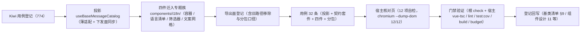

# 01 实施 · 文案目录组件与宿主核对页

> 前端组件库 · 08 交互类 · 07 国际化文案编辑器 · 嵌套子任务 02（需求 08-7）· 实施记录

[文档首页](../../../../../../../文档首页.md) › [08 交互类](../../../08_交互类.md) › [07 国际化文案编辑器](../../08_交互类_07_国际化文案编辑器.md) › 实施记录　|　[← 详细设计](../设计/01_详细设计_01_文案目录组件与宿主核对页.md)　[测试记录 →](../测试/01_测试_02_文案目录组件与宿主核对页.md)

## 1. 实施信息 

| 项 | 值 |
| --- | --- |
| 任务 | 08-7-2 文案目录组件与宿主核对页（[任务](../08_交互类_07_国际化文案编辑器_02_文案目录组件与宿主核对页.md)） |
| 对应需求 | [08-7](../../../../../需求/08_需求_交互类.md#r08-7) |
| 详细设计 | [01_详细设计_01_文案目录组件与宿主核对页.md](../设计/01_详细设计_01_文案目录组件与宿主核对页.md)（定稿提交 `4c850d4c`） |
| 实施日期 | 2026-09-19 |
| 实施人 | minjian |
| 实施环境 | Ubuntu 开发机 · Node（workspace `@bms/ui-ep` + `apps/desktop`）· Vitest 5 / jsdom · Vue 3.5 / TypeScript 严格模式 |
| Kiwi 用例 | 774（分类「平台骨架」/ P2 / CONFIRMED / 标签「自动化」） |
| 结论 | 完成标准达标（四件可用、网格编辑与批量保存正确、缺失筛选准确、导入导出接线可用、保存后缓存失效与重载即时生效、核对页 12/12） |

## 2. 实施概览 

结果小结：新增 1 套投影与 2 个件（语言清单 / 筛选器），2 件迁入 `components/i18n/` 专题族并填充真实编排；`ui-ep` 42 文件 / 471 用例全绿（本次新增 32 条）；核对页 12/12。

## 3. 实施过程 

1. **Kiwi 先行**：经容器内 Django shell 登记用例，取得编号 **774**；用例文件首行标注 `// kiwi_id: 774`。
2. **投影**（`ui-ep/src/composables/useBaseMessageCatalog.ts`）：薄适配（核心实例 ↔ Vue 响应式），跨实例基类实例经 `markRaw(toRaw(...))` 隔离，`onScopeDispose` 解除生命周期订阅；集合面（清单 / 行 / 列集 / 缺失 / 修改键）在 `sync()` 时重建（核心集合非响应式）。
3. **四件落入专题族**（`ui-ep/src/components/i18n/`）：
   - `I18nMessageEditor.vue`（容器）：承接 `08_01_02` 冻结形状（Props / 事件 / 插槽 / `data-test` 全部保留），新增页签装配（语言管理 / 语言包维护，受控 `update:tab`）、工具栏、脏数据拦截（切页签 / 切筛选二次确认）、保存 → 失效 → 重载链路与上屏提示、导入导出接线（`ImportDialog` / `ExportButton`）、`defineExpose({ catalog })`；
   - `LocaleList.vue`（新增）：code / name / rtl / status 清单 + 默认语言与「至少一种启用」保护 + 弹窗表单（复用 `FormDialog`）+ 删除二次确认；
   - `MessageFilter.vue`（新增）：模块前缀 / 关键词 / 缺失 / 仅已修改 / 语言聚焦，**本地草稿即时渲染 + 上抛受控值**，缺失语言提示；
   - `MessageGrid.vue`（迁移 + 真实实现）：可编辑单元格（失焦 / 回车提交，草稿提交后清空避免重复上报）、缺失高亮、停用列置灰仍占位、被修改标记、受控分页、超阈值切虚拟滚动（复用 `VirtualListContainer`），保持 `data-subpackage="i18n"` 独立分包。
4. **下发面同步**：容器 watch `props.locales` / `props.messages` → `catalog.applySnapshot(...)`（下发即已保存 → 置基线），使「渲染用 props、编排用内核」两处一致；注入 `jobs` 时文案行改读投影可见行以承载本地缺失筛选。
5. **导出面登记**（`ui-ep/src/index.ts`）：`I18nMessageEditor` 改来源路径并新增 `MessageTab` 类型；新增 `LocaleList` / `MessageFilter` / `useBaseMessageCatalog` 导出；**`MessageGrid` 不入根出口**（否则静态引入使动态导入无法分包）；旧路径 `components/interaction/{I18nMessageEditor,MessageGrid}.vue` 删除。
6. **用例**：`ui-ep/tests/interaction-i18n-editor.spec.ts`（32 条）——投影薄适配与保存链路、契约套件投影适配、容器页签与脏拦截与内部编排与导入导出、语言清单件（保护规则 / 弹窗校验 / 编辑只读 / 删除确认）、筛选件（五类条件 / 回车 / 重置）、网格件（缺失 / 置灰 / 编辑 / 分页 / 虚拟滚动 / 空态）；既有 `interaction-placeholder-2.spec.ts` 冻结断言**未改动**即通过。
7. **宿主核对页**：`apps/desktop/i18n-editor-check.html` + `src/dev/{i18nEditorCheck.ts,I18nEditorCheck.vue}`（12 项自检），`vite build` 不含；以 chromium headless `--dump-dom` 核验 **12/12** 通过。

## 4. 问题与处置 

| # | 问题 | 处置 |
| --- | --- | --- |
| 1 | 首版把文案网格单元格的 `data-test` 挂在 `<td>` 上，既有冻结用例对 `cell-{key}-{code}` 调 `setValue` 失败（「cannot be called on TD」） | 输入框迁回 `data-test="cell-{key}-{code}"`（保持冻结标记位置），`<td>` 另起 `cell-wrap-*` 承载 `data-missing` / `data-disabled`；既有 `interaction-placeholder-2.spec.ts` **未改动即通过** |
| 2 | 草稿「同值不上抛」在 `@input` 时判同值会让「设为原值后再改回」漏报 | 改为**仅当无草稿时不上抛**（未经编辑不发），提交后清空草稿，避免重复上报 |
| 3 | 删除 key 首版加了二次确认，导致既有冻结断言「点击即上抛 `remove-key`」失败 | **先报冲突 → 按铁律（对外契约冻结优先）**：删除一律先上抛（冻结形状）；仅当注入 `jobs`（真实实现用法）时由内核同步移除；详细设计 §3.2 行为表已回写 |
| 4 | 重试按钮原先未渲染（`onRetry` 声明未使用，`vue-tsc` TS6133） | 工具栏补 `data-test="retry"` 按钮并复用保存结果上屏逻辑（含幂等键复用） |
| 5 | 语言清单件模板 `@toggle="toggleLocale"` 的载荷形状与件契约不一致（缺 name/status） | 容器增 `onLocaleToggle` 适配（按 code 回查语言项后走冻结载荷形状） |
| 6 | 核对页自检 ④「缺失筛选本地生效」失败：注入 `jobs` 时仍读宿主下发面，本地筛选不生效 | 容器在注入 `jobs` 时文案行改读**投影可见行**（承载本地筛选），纯事件用法回落宿主下发面；详细设计 §3.1 已回写 |
| 7 | 核对页自检 ⑨「重试成功」失败：`onRetry` 未写提示与 `cache-invalidated` | 重试路径与保存路径统一（成功写提示、失败写失败文案与 `failed` 事件） |
| 8 | 核对页自检 ⑫「占位零请求」误读就绪件的内核计数 | 占位件单独挂 `ref`，自检改读占位件内核 `requestCount` |
| 9 | 筛选件受控值未回写时 UI 不更新（父件未接 `v-model`） | 件内维护**本地草稿**（变更即更新草稿供即时渲染并上抛受控值），沿用「受控件内部态优先」口径 |
| 10 | 停用语言空值被算作缺失（与领域口径冲突） | 领域侧统一按启用语言派生（归 `08-7-1` 处置），件层随之正确 |

## 5. 验证结果 

| 命令 | 结果 |
| --- | --- |
| 根 `npm run check`（core + vue + ui-ep） | 50 + 2 + 42 文件 / 535 + 5 + 471 用例全绿（ui-ep 本次新增 32） |
| 宿主 `npx vue-tsc -b` / `npm run lint` | 通过 |
| 宿主 `npm run test:cov` | 通过（全库语句覆盖 86.79%、行覆盖 87.61%、35 用例） |
| 宿主 `npm run build` / `npm run budget` | 通过（合计 122.0 KB / 预算 260 KB；最大单文件 103.1 KB / 预算 150 KB；新代码未引入分包退化告警） |
| 开发态核对页（chromium headless `--dump-dom`） | **12 / 12** 自检项通过 |
| 既有 `interaction-placeholder-2.spec.ts`（`08_01_02` 冻结契约） | 未改动即通过 |
| `python3 scripts/tools/base-check/check-links.py` | 通过（断链 0、失效锚点 0） |
| `python3 scripts/tools/base-check/check-base.py` | 通过（四项均为 0） |

对照完成标准：四件可用、网格编辑与批量保存正确、缺失筛选准确、导入导出接线可用、保存后缓存失效与语言包重载即时生效；`vue-tsc` / ESLint / Vitest 全通过。

## 6. 偏差与遗留 

- **工时偏差**：名义 8h；因 1 套投影、2 件新增、2 件迁移与真实实现、32 条用例与 12 项自检核对页，实际上浮，明细见第 4 节。
- **对外契约扩展（向后兼容）**：`I18nMessageEditor` 新增可选 Props（`jobs` / `access` / `notice` / `page` / `pageSize` / `filter` / `showDisabledLocales` / `defaultLocale` / `modifiedKeys`）、事件（`update:tab` / `saved` / `failed` / `cache-invalidated` / `messages-reloaded` / `page-change` / `filter-change`）、插槽（`locales` / `filter` / `error-report`）与 `defineExpose({ catalog })`；既有 Props / 事件 / 插槽 / `data-test` / 分包入口**全部保持不变**。
- **事件与注入双轨的风险**：宿主同时监听既有事件并注入 `jobs` 会导致重复执行（文档写明「二选一」）；件层不额外去重（保持对外形状不变）。
- **真实接口联调**：语言清单 / 文案维护 / 批量保存 / 缓存失效 / 语言包重载 / 导入导出接口未就绪，处理函数由宿主注入；未注入即占位（不发请求）；真实联调随**阶段八**。
- **`useBaseLocale` 向后兼容扩展**：返回面新增 `localeContext`（供需要基类实例的件与投影复用），既有字段不变；已在《前端基类清单》§9 同步。
- **未实现**：引导式「批量补齐缺失」向导（后续可基于缺失筛选扩展）、移动端实现、移动端不提供文案维护（设计节点已明确）。
- **上游回写已完成**：三处随 `08-7-1` 一并回写（本子任务只回写《组件设计 11》与《前端基类清单》）。

> 本文档依《[文档生成规范](../../../../../../../规范/文档生成规范.md)》编写
