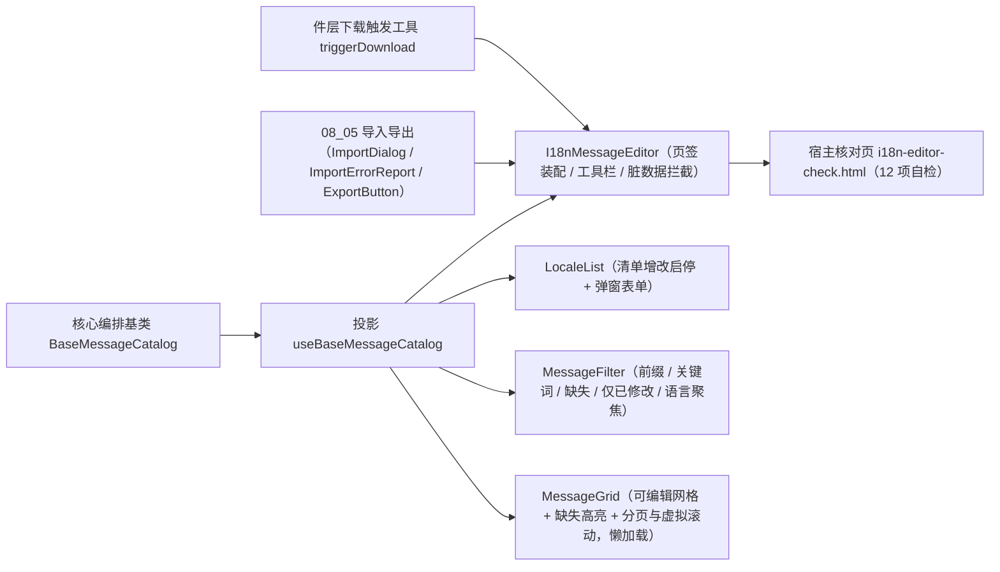

# 01 详细设计 · 文案目录组件与宿主核对页

> 前端组件库 · 08 交互类 · 07 国际化文案编辑器 · 嵌套子任务 02（需求 08-7）· 详细设计

[文档首页](../../../../../../../文档首页.md) › [08 交互类](../../../08_交互类.md) › [07 国际化文案编辑器](../../08_交互类_07_国际化文案编辑器.md) › 详细设计　|　[← 任务](../08_交互类_07_国际化文案编辑器_02_文案目录组件与宿主核对页.md)

## 1. 设计目标与范围 <a id="goal"></a>

交付[需求 08-7](../../../../../需求/08_需求_交互类.md#r08-7) 的**组件层与宿主核对页**：把 `08-7-1` 的编排内核（`BaseMessageCatalog` + `domain/i18n` + 契约套件）接到 PC 具体件上，四件组件迁入 / 落入 `components/i18n/` 专题族并填充真实编排，落投影与宿主开发态核对页。

- **投影入插件层**：新增 `useBaseMessageCatalog` 薄适配（核心实例 ↔ Vue 响应式），判定逻辑全部在核心。
- **对外契约不变**：`I18nMessageEditor` 的导出名、既有 Props（`ready` / `locales` / `messages` / `activeLocale` / `dirty` / `loading` / `degradeText`）、既有事件（`change` / `save` / `invalidate-cache` / `add-key` / `remove-key` / `add-locale` / `toggle-locale` / `export` / `import` / `retry`）、既有插槽（`degrade` / `live` / `toolbar` / `grid`）与既有 `data-test` 标记**保持 `08_01_02` 冻结形状**；本次只**向后兼容新增**可选 Props、事件与插槽。
- **组件状态源唯一**：件以 `useBaseMessageCatalog` 投影为唯一状态源（不再并行维护 `useInteractionPlaceholder` 状态），`ready` prop 经 `setReady` 同步；`dirty` / `loading` 等既有 Props 作为**宿主可覆盖的下发面**叠加（未传即由投影派生）。
- **事件与注入双轨**：件层点击一律**保留既有事件上抛**（`save` / `invalidate-cache` / `add-key` / `remove-key` / `add-locale` / `toggle-locale` / `export` / `import` / `retry`）；**仅当宿主注入 `jobs`** 时件内才驱动真实编排（避免宿主两种用法重复执行）。
- **专题族自成一族**：新建 `components/i18n/`（同 `components/import-export/`、`components/form-design/`、`components/form-render/`）；旧 `components/interaction/{I18nMessageEditor,MessageGrid}.vue` 删除。
- **宿主核对页**：`apps/desktop/i18n-editor-check.html` + `src/dev/*`（十二项自检上屏，`vite build` 不含）。

### 1.1 口径与依从 <a id="positioning"></a>

- **架构铁律**：件层只做渲染与投影，编排与判定全部在 `08-7-1` 的能力基类与领域纯函数；每个组件以**值引入**核心基类或基类投影（`ui-ep/tests/guard-component-inheritance.spec.ts` 护栏）。
- **继承链**：`BaseComponent`（组件根）→ 能力基类（`BaseMessageCatalog`）→ 具体件；件内经**投影**（`useBaseMessageCatalog`）挂链。
- **占位语义**：件的 `ready` 缺省 `false` → 降级（`data-degraded="true"`）+ 禁用 + 零请求，与 `08_01_02` 冻结口径一致；就绪后由投影面驱动禁用与提示。
- **导入导出复用**：导入经 `ImportDialog`（注入语言包处理函数集）+ `ImportErrorReport`；导出经 `ExportButton`（`scope='filtered'` + `params=exportParams`）或编辑器工具栏导出按钮上抛由宿主接线；件层下载触发复用 `utils/downloadFile.ts`。
- **弹窗表单复用**：语言清单新增 / 编辑走 `03_01` 的 `FormDialog`（含二次确认与脏数据拦截）。
- **端范围**：**仅 PC**（`frontend/packages/ui-ep`）；移动端实现遗留（契约套件已就位）。
- **工时**：本嵌套子任务 8h；因四件迁移与真实实现、新增语言清单件与筛选件、十二项核对页，实际上浮在实施记录登记。

## 2. 交付物清单 <a id="deliver"></a>

| # | 交付物 | 落点 |
| --- | --- | --- |
| 1 | 文案目录投影（新增） | `ui-ep/src/composables/useBaseMessageCatalog.ts` |
| 2 | 编辑器容器件（迁移 + 真实实现） | `ui-ep/src/components/i18n/I18nMessageEditor.vue` |
| 3 | 语言清单件（新增） | `ui-ep/src/components/i18n/LocaleList.vue` |
| 4 | 筛选器件（新增） | `ui-ep/src/components/i18n/MessageFilter.vue` |
| 5 | 文案网格件（迁移 + 真实实现，独立分包） | `ui-ep/src/components/i18n/MessageGrid.vue` |
| 6 | 导出面登记（含旧路径移除与分包口径） | `ui-ep/src/index.ts` |
| 7 | 用例 | `ui-ep/tests/interaction-i18n-editor.spec.ts` |
| 8 | 宿主核对页（`vite build` 不含） | `apps/desktop/i18n-editor-check.html`、`apps/desktop/src/dev/{i18nEditorCheck.ts,I18nEditorCheck.vue}` |
| 9 | 登记回写 | 见第 6 节 |



## 3. 接口 / 契约与边界 <a id="contract"></a>

### 3.1 投影 `useBaseMessageCatalog`（`ui-ep/src/composables/`） <a id="bindings"></a>

```ts
export interface UseBaseMessageCatalogOptions {
  ready?: boolean
  biz?: string
  bizName?: string
  defaultLocale?: string
  page?: number
  pageSize?: number
  filter?: Partial<I18nFilter>
  activeLocale?: string
  showDisabledLocales?: boolean
  virtualThreshold?: number
  jobs?: MessageJobs
  /** 组合的语言上下文（`useBaseLocale()` 返回面；聚焦语言经其承载）。 */
  locale?: BaseLocale
  access?: BaseAccess
  notice?: BaseNotice
}

export interface UseBaseMessageCatalogResult {
  catalog: BaseMessageCatalog
  ready: Ref<boolean>
  degraded: Ref<boolean>
  busy: Ref<boolean>
  phase: Ref<MessagePhase>
  dirty: Ref<boolean>
  locales: Ref<I18nLocaleItem[]>
  columns: Ref<I18nLocaleItem[]>
  messages: Ref<I18nMessageItem[]>
  total: Ref<number>
  page: Ref<number>
  pageCount: Ref<number>
  pageSize: Ref<number>
  filter: Ref<I18nFilter>
  activeLocale: Ref<string>
  showDisabledLocales: Ref<boolean>
  virtualized: Ref<boolean>
  missingCodes: Ref<string[]>
  idempotencyKey: Ref<string>
  errorMessage: Ref<string>
  errorCode: Ref<number>
  messagesRevision: Ref<number>
  exportParams: Ref<Record<string, unknown>>
  setReady: (value: boolean) => void
  setJobs: (jobs: MessageJobs) => void
  setFilter: (filter: Partial<I18nFilter>) => void
  setActiveLocale: (code: string) => void
  setShowDisabledLocales: (value: boolean) => void
  setPage: (page: number) => void
  setPageSize: (size: number) => void
  load: () => Promise<boolean>
  reload: () => Promise<boolean>
  editCell: (input: { key: string; locale: string; value: string }) => boolean
  addKey: (input: { key: string; values?: Record<string, string> }) => boolean
  removeKey: (key: string) => boolean
  addLocale: (input: I18nLocaleInput) => I18nCheckResult
  updateLocale: (code: string, patch: I18nLocaleInput) => I18nCheckResult
  toggleLocale: (code: string, enabled: boolean) => I18nCheckResult
  removeLocale: (code: string) => I18nCheckResult
  save: () => Promise<SaveResult | undefined>
  retry: () => Promise<SaveResult | undefined>
  invalidateCache: () => Promise<boolean>
  reloadMessages: () => Promise<boolean>
  resetDirty: () => void
  /** 行是否被修改（按基线，响应式面驱动「仅已修改」标记）。 */
  modifiedKeys: Ref<string[]>
}
```

- 薄适配（核心实例 ↔ Vue 响应式），不含判定逻辑；基类实例经 `markRaw(toRaw(...))` 隔离跨实例代理（沿用既有投影口径），`onScopeDispose` 解除生命周期订阅。
- 响应式面中的数组（`locales` / `messages` / `columns` / `missingCodes` / `modifiedKeys`）在 `sync()` 时重建（核心集合非响应式，沿用既有投影口径）。
- 宿主未接 `v-model` 时，件层后续操作一律**读投影返回的响应式面**（既有口径：受控件内部态优先）。

### 3.2 `I18nMessageEditor` 编辑器容器件契约 <a id="editor"></a>

| 面 | 内容 |
| --- | --- |
| 数据面（既有，必守） | `ready`（缺省 `false`）/ `locales` / `messages` / `activeLocale`（缺省 `''`）/ `dirty`（缺省 `false`）/ `loading`（缺省 `false`）/ `degradeText`（缺省 `'国际化文案未就绪（占位）'`） |
| 数据面（新增可选） | `jobs`（`MessageJobs`）/ `access`（`BaseAccess`）/ `notice`（`BaseNotice`）/ `page` / `pageSize` / `filter` / `showDisabledLocales` / `defaultLocale` / `modifiedKeys`（宿主下发的已修改行键，件层与投影取并集） |
| 事件（既有，必守） | `change`（`I18nChangePayload`）/ `save` / `invalidate-cache` / `add-key` / `remove-key`（`key`）/ `add-locale` / `toggle-locale`（`{ code, enabled }`）/ `export` / `import` / `retry` |
| 事件（新增） | `saved`（`SaveResult`）/ `failed`（`{ message, code }`）/ `cache-invalidated`（`{ ok: boolean }`）/ `messages-reloaded`（`{ revision: number }`）/ `page-change`（`number`）/ `filter-change`（`I18nFilter`） |
| 插槽（既有） | `degrade` / `live` / `toolbar` / `grid` |
| 插槽（新增） | `locales`（替换语言清单区）/ `filter`（替换筛选区）/ `error-report`（导入错误报告替换） |
| 数据标记（必守） | `data-ready` / `data-degraded` / `data-test="placeholder"` / `data-test="toolbar"` / `data-test="locale"` / `data-test="add-key"` / `data-test="add-locale"` / `data-test="save"` / `data-test="invalidate-cache"` / `data-test="export"` / `data-test="import"` / `data-test="dirty"` / `data-test="locales"` / `data-test="locale-{code}"` / `data-test="toggle-{code}"` / `data-test="grid"` |
| 数据标记（新增） | `data-test="tabs"` / `data-test="tab-{locale|messages}"` / `data-test="import-dialog"` / `data-test="error-report"` / `data-test="save-hint"` / `data-test="cache-hint"` / `data-test="revision"` / `data-ready` 上补 `data-dirty` |

| 行为 | 口径 |
| --- | --- |
| 占位 | `ready` 为假 → 降级（既有断言「`data-degraded="true"` + 占位文案 + 工具栏不渲染」保持），**零请求** |
| 就绪 | 渲染两个页签：语言管理（`LocaleList`）与语言包维护（筛选 + 网格）；工具栏在语言包维护页可见 |
| 页签受控 | 页签为**受控**（`activeTab` 缺省 `messages`）：点击只 `emit('update:tab')`，未接线时回退内部态（沿用受控组件口径：点击路径只上抛） |
| 脏数据拦截 | 切页签 / 切筛选 / 关闭前若 `dirty`（投影派生 ∪ 宿主下发）为真 → 二次确认（`useConfirm`）；确认后 `resetDirty()` 并放行 |
| 保存 | 点击「保存」：**先 emit `save`** → 若 `jobs.save` 注入则 `await catalog.save()` 并上抛 `saved` / `failed`；未注入则仅事件上抛（占位文案由核心写入） |
| 缓存失效 | 点击「缓存失效」：**先 emit `invalidate-cache`** → 若注入则 `await catalog.invalidateCache()` 并上抛 `cache-invalidated`；保存成功后的自动失效不重复上抛 |
| 新增 key / 语言 | 点击「新增 key」emit `add-key`；注入时打开新增 key 弹窗（`FormDialog`：`msg_key` + 各语言初值）；点击「新增语言」emit `add-locale` 并打开语言弹窗（`LocaleList` 提供） |
| 删除 key / 启停语言 | 网格删除 → `removeKey`（二次确认）；清单启停 → `toggleLocale`（默认语言与「至少一种」由核心拒绝并回显文案） |
| 即时生效 | 保存成功后投影 `messagesRevision` 递增 → 件层展示 `data-test="revision"` 与 `save-hint`（「保存成功，文案已即时生效」或失效失败降级提示） |
| 导入导出 | 工具栏「导入」打开 `ImportDialog`（注入语言包处理函数集与 `error-report` 插槽）；「导出」emit `export` 并透传 `catalog.exportParams`（`scope='filtered'`） |

### 3.3 `LocaleList` 语言清单件契约 <a id="locale-list"></a>

| 面 | 内容 |
| --- | --- |
| 数据面 | `locales`（`I18nLocaleItem[]`）/ `defaultLocale` / `disabled`（占位或无权）/ `busy` |
| 事件 | `add`（`I18nLocaleInput`）/ `update`（`{ code, patch }`）/ `toggle`（`{ code, enabled }`）/ `remove`（`code`）/ `edit`（打开编辑入口） |
| 插槽 | `#empty`（无语言）/ `#actions`（行操作区替换） |
| 数据标记 | `data-test="locale-list"` / `data-test="locale-row-{code}"` / `data-test="locale-name-{code}"` / `data-test="locale-rtl-{code}"` / `data-test="locale-status-{code}"` / `data-test="locale-default-{code}"` / `data-test="locale-toggle-{code}"` / `data-test="locale-edit-{code}"` / `data-test="locale-remove-{code}"` / `data-test="locale-add"` |
| 行为 | 列：code / name / rtl / status；默认语言行显示「默认」标记且停用与删除按钮禁用（44005 保护）；仅一种启用语言时其余行停用按钮禁用（44004）；新增 / 编辑走 `FormDialog`（`code` 仅新增可填、编辑只读）；删除二次确认并提示「有语言包数据不可删除（仅可停用）」；`rtl` 以开关呈现（件内用 `SwitchField`） |
| 与网格联动 | 启用语言成为网格列；停用语言列置灰仍占位（网格侧据 `columns()` 与文档决策 9 渲染）；新增语言成功后该语言立即出现在网格列（免发版） |

### 3.4 `MessageFilter` 筛选器件契约 <a id="filter-component"></a>

| 面 | 内容 |
| --- | --- |
| 数据面 | `modelValue`（`I18nFilter`）/ `locales`（语言清单，供语言聚焦下拉）/ `missingCodes`（存在缺失的语言，用于强调）/ `disabled` |
| 事件 | `update:modelValue` / `search`（提交筛选）/ `reset`（清空） |
| 插槽 | `#extra`（扩展条件区） |
| 数据标记 | `data-test="message-filter"` / `data-test="filter-prefix"` / `data-test="filter-keyword"` / `data-test="filter-missing"` / `data-test="filter-modified"` / `data-test="filter-locale"` / `data-test="filter-search"` / `data-test="filter-reset"` / `data-test="filter-missing-hint"` |
| 行为 | 模块前缀与关键词为文本输入（回车触发 `search`）；缺失与仅已修改为勾选；语言聚焦为下拉（清空 = 全部语言）；筛选变更**不直接触发请求**（由容器在放行（无脏数据）后调用 `setFilter` + `reload`）；`missingCodes` 非空时在缺失项旁提示可补齐语言 |

### 3.5 `MessageGrid` 文案网格件契约 <a id="grid"></a>

| 面 | 内容 |
| --- | --- |
| 数据面 | `locales` / `messages` / `activeLocale`（既有三项必守）/ 新增：`page` / `pageSize` / `pageCount` / `total` / `virtualized` / `modifiedKeys` / `disabled` / `showDisabledLocales` |
| 事件 | `cell-change`（`{ key, locale, value }`，既有）/ `remove-key`（`key`，既有）/ 新增：`update:page`（`number`）/ `update:page-size`（`number`）/ `add-key` |
| 插槽 | `#empty`（无数据）/ `#cell`（单元格替换，参数 `{ row, locale }`） |
| 数据标记（必守） | `data-test="message-grid"` + `data-subpackage="i18n"` + `data-state` / `data-test="grid-empty"` / `data-test="column-{code}"` / `data-test="message-{key}"` / `data-test="message-key"` / `data-test="cell-{key}-{code}"` / `data-test="remove-{key}"` |
| 数据标记（新增） | `data-test="grid-pager"` / `data-test="grid-page-current"` / `data-test="grid-prev"` / `data-test="grid-next"` / `data-test="grid-virtual"` / `data-test="grid-total"` / `data-test="cell-missing-{key}-{code}"` / `data-test="cell-modified-{key}"` / `data-test="add-key"` / `data-column-disabled-{code}` |
| 行为 | 列 = `msg_key` 列 + 各语言列（`columns()` 顺序）；单元格内联编辑（失焦 / 回车提交 → `cell-change`），**失焦提交前按内容比较**（同值不上抛，沿用既有口径）；缺失单元格标「缺失」（`data-missing` + 提示）；停用语言列置灰（`disabled` 输入）且可经 `showDisabledLocales` 隐藏；被修改行标 `data-modified`；长值省略 + `title` 悬浮提示（> 2000 字由核心拒绝，件层只展示错误）；分页为受控（`page` + `update:page`），总数为 0 时展示 `#empty`；`virtualized` 为真时切换虚拟滚动容器（复用 `04_01` `VirtualListContainer` 与核心 `computeVirtualRange`） |

### 3.6 分包与命名 <a id="chunk"></a>

- 保留 `MessageGrid` 独立分包入口（`08_01` 冻结：`data-subpackage="i18n"`），用 `defineAsyncComponent(() => import('./MessageGrid.vue'))`，不在宿主静态 `import` 中。
- **懒加载件不作为根出口静态导出**（`ui-ep/src/index.ts`）：否则将被静态引入而使动态导入无法分包（构建告警 `INEFFECTIVE_DYNAMIC_IMPORT`、分包退化）；需要单独复用时按件路径直接引用。
- 四件落入 `ui-ep/src/components/i18n/`（专题自成一族，同 `components/import-export/`）；旧路径 `components/interaction/{I18nMessageEditor,MessageGrid}.vue` 删除。
- `ui-ep/src/index.ts` 的导出名与类型名不变（`I18nMessageEditor` / `I18nLocale` / `I18nMessageRow` / `I18nChangePayload`），仅改来源路径；`I18nMessageRow` 保留为对外别名（映射核心 `I18nMessageItem`）。

## 4. 失败分支与边界 <a id="edge"></a>

| 边界 / 失败场景 | 处置 |
| --- | --- |
| `ready` 为假（占位） | 降级渲染 + 操作禁用 + 零请求（既有冻结断言） |
| 未注入 `jobs` | 仅事件上抛（宿主自理），不产生请求；核心占位文案按需展示 |
| 无 `i18n:manage` 权限 | 保存 / 新增 / 删除 / 启停入口禁用（件层按权限上下文判定）；后端兜底 |
| `msg_key` 命名非法 | 新增弹窗内联报错（44003 文案），提交按钮禁用、不请求 |
| 文案值超长 | 单元格内联报错、不写入本地行（核心拒绝） |
| 语言 code 重复 / 空 | 语言弹窗内联报错（44001），不提交 |
| 停用默认语言 / 停用至无启用语言 / 删除有数据语言 | 核心拒绝并回显文案（44005 / 44004 / 44002），件层按钮按规则预先禁用 |
| 存在未保存变更时切页签 / 切筛选 / 关闭 | 二次确认（`useConfirm`）；取消则保持原状态下拉回原值（受控回写） |
| 保存失败 | 件层 `failed` 文案 + 重试按钮；本地变更保留；`retry` 复用同幂等键 |
| 缓存失效失败 | 提示降级（`save-hint` / `cache-hint`），**保存结果保持成功**，不阻断页面 |
| 语言包重载失败 | 提示「语言包重载失败，将按短 TTL 兜底」；`revision` 不变 |
| 导入部分失败 | `ImportErrorReport` 展示汇总与错误行（复用 `08_05`），提示按行修正后重导 |
| 无数据（筛选后为空） | 网格 `#empty`「暂无文案数据」；导出仍可触发（后端按条件导出，件层不预先禁用） |
| 行数超阈值 | 切虚拟滚动容器（`virtualized` 为真）；分页器隐藏 |
| 分包懒加载失败 | 由容器兜底展示占位提示（不白屏） |

## 5. 测试设计与验收映射 <a id="test"></a>

| 验收点（需求 08-7 / 子任务 08-7-2） | 用例 |
| --- | --- |
| 投影薄适配（就绪 / 取数 / 编辑 / 保存 / 失效 / 重载 / 复位） | `ui-ep/tests/interaction-i18n-editor.spec.ts` |
| `I18nMessageEditor` 就绪态页签、工具栏、事件上抛与内部编排 | 同上 +（**复用**）`ui-ep/tests/interaction-placeholder-2.spec.ts` 既有冻结断言 |
| 脏数据拦截（切页签 / 切筛选 / 关闭前二次确认与取消回写） | 同上 |
| 保存成功后的失效与重载、`messagesRevision` 递增与即时生效提示 | 同上 |
| 缓存失效失败不阻断保存（降级提示与保存成功态） | 同上 |
| `LocaleList` 渲染、默认语言保护、启停禁用规则、弹窗新增与校验报错 | 同上 |
| `MessageFilter` 五类条件、回车提交与重置、缺失提示 | 同上 |
| `MessageGrid` 单元格编辑、缺失高亮、停用列置灰与显隐、被修改标记、同值不上抛 | 同上 |
| 分页受控（翻页 / 页长）与虚拟滚动阈值切换 | 同上 |
| 导入错误报告挂载与导出参数透传（`filtered` + 筛选参数） | 同上 |
| 分包边界（`MessageGrid` 懒加载解析与 `data-subpackage`） | 同上（`vi.dynamicImportSettled()`） |
| 组件挂链护栏（值引入基类投影） | `ui-ep/tests/guard-component-inheritance.spec.ts`（自动覆盖新件与新投影） |
| 宿主机对页十二项自检 | chromium headless `--dump-dom`（**12 / 12**） |
| `vue-tsc`、ESLint、Vitest 全通过 | 根 `npm run check` + 宿主 `vue-tsc -b` / `lint` / `test:cov` / `build` / `budget` |
| 文档链接与基座校验 | `check-links.py`、`check-base.py` |

- Kiwi 用例 1 条（一任务一条，编号于测试步登记后回填，预计 **774**；分类「平台骨架」、优先级 P2、状态 CONFIRMED、标签「自动化」）。

## 6. 登记落点 <a id="register"></a>

| 内容 | 落点 |
| --- | --- |
| 投影落点（`useBaseMessageCatalog`） | 《[前端基类清单](../../../../../../../前端基类清单.md)》§9「PC 插件」（`ui-ep/src/composables/` 投影清单） |
| 组件落点（专题族 `components/i18n/` 四件） | 同上 §9「PC 插件」（按族分目录，含专题族清单） |
| 旧路径移除（`components/interaction/` 两件） | 同上 §9（目录清单同步） |
| 设计口径回写 | 《组件设计》[11 国际化文案编辑器](../../../../../../../设计/组件设计/08_交互类/11_组件设计_国际化文案编辑器/11_组件设计_国际化文案编辑器.md)：第 2 节职责分层补「语言清单 / 筛选器独立成件」、第 12 节分包补 `components/i18n/` 专题族 |
| 任务 / 父任务 / 域任务 / 计划状态 | [任务](../08_交互类_07_国际化文案编辑器_02_文案目录组件与宿主核对页.md)、[父任务](../../08_交互类_07_国际化文案编辑器.md)、[域任务](../../../08_交互类.md)、[计划](../../../../../../../项目/04_前端组件库/计划/01_计划_前端组件库.md)（`08_07` 完成后由 §3 移入 §2，§4 甘特同步） |
| 需求文档 | 不承载进度（状态只在任务与计划两处一致）；遗留归口写在实施 / 测试记录与计划 |

## 7. 边界与开放项 <a id="open"></a>

- **不在本期**：真实接口联调（阶段八）；语言包 Excel 列头核对与行级校验（后端）；运行时语言包下发与浏览器二次缓存机制（架构侧）；引导式「批量补齐缺失」向导（后续可基于缺失筛选扩展）；移动端实现。
- **协同契约**：宿主注入 `jobs` / `access` / `notice` / `locale` 上下文；件层默认注入 `triggerDownload` 与 `useConfirm`；未注入即事件上抛 + 核心占位。
- **分包预算**：`MessageGrid` 为轻量渲染层（无第三方依赖，虚拟滚动复用既有容器件），不新增内核分包；宿主主包体积变化在 `npm run budget` 中核对。
- **事件与注入双轨的风险**：宿主同时监听事件并注入 `jobs` 会导致重复执行（文档写明「二选一」）；件层不额外去重（保持对外形状不变）。
- **停用语言列口径**：置灰仍占位（决策 9）；若后续后端明确「停用语言不参与下发」，可改为默认隐藏并留开关。
- Kiwi 用例编号于测试步登记后回填实施 / 测试记录与用例文件（预计 774）。

## 8. 决策记录 <a id="decision"></a>

| # | 决策项 | 结论 |
| --- | --- | --- |
| 1 | 组件落点 | 四件落入 `ui-ep/src/components/i18n/` 专题族；对外导出名与契约不变 |
| 2 | 组件状态源 | 件以 `useBaseMessageCatalog` 投影为唯一状态源（不再并行维护 `useInteractionPlaceholder`），`ready` prop 经 `setReady` 同步；宿主可覆盖面（`dirty` / `loading` / `filter` / `page`）作为叠加下发 |
| 3 | 事件与注入 | 点击**保留既有事件上抛**；**仅当注入 `jobs` 时**件内驱动真实编排（避免双重执行） |
| 4 | 语言清单件 | 新增对外件 `LocaleList.vue`（增改启停 + 弹窗表单 + 默认语言与「至少一种」保护） |
| 5 | 筛选器件 | 新增对外件 `MessageFilter.vue`（五类条件，变更不直接请求，由容器放行后 `reload`） |
| 6 | 导入导出 | 件层装配 `08_05` 的 `ImportDialog` / `ImportErrorReport` / `ExportButton` 与 `triggerDownload`；核心不组合导入导出键 |
| 7 | 网格大数据 | 分页为受控主路径 + `virtualized` 为真时切虚拟滚动容器（复用 `04_01`） |
| 8 | 停用语言列 | 置灰仍占位 + `showDisabledLocales` 开关 |
| 9 | 页签口径 | 页签受控（点击只 `emit('update:tab')`），未接线回退内部态 |
| 10 | 关键 `data-test` | 既有标记全部保留（占位 / 工具栏 / 语言清单 / 网格 / 单元格 / 删除）；新增标记仅追加不重命名（`tabs` / `filter-*` / `grid-pager` / `cell-missing-*` / `save-hint` / `cache-hint` / `revision`） |
| 11 | 核对页自检 | **十二项**（占位零请求 / 就绪页签与语言清单 / 缺失派生与筛选 / 三态与错误码校验 / 网格编辑与脏标记 / 内容派生幂等键 / 保存与缓存失效 / 失效失败不阻断 / 新增语言免发版列 / 分页与虚拟滚动阈值切换 / 导入错误行报告 / 按筛选导出）；核对页**覆盖件层触发手段为记录型**（仅记录下载请求，不发起真实导航） |
| 12 | 用例复用 | 既有 `interaction-placeholder-2.spec.ts` 冻结断言**不改动**，新增 `interaction-i18n-editor.spec.ts` 覆盖真实编排 |

## 9. 参考文档 <a id="ref"></a>

- [需求 08-7](../../../../../需求/08_需求_交互类.md#r08-7)、[任务 08-7-2](../08_交互类_07_国际化文案编辑器_02_文案目录组件与宿主核对页.md)、[父任务 07 国际化文案编辑器](../../08_交互类_07_国际化文案编辑器.md)
- [08-7-1 文案目录编排基类与领域](../../08_交互类_07_国际化文案编辑器_01_文案目录编排基类与领域/08_交互类_07_国际化文案编辑器_01_文案目录编排基类与领域.md)（**前置契约已交付**：能力基类、领域纯函数与契约套件）
- 《组件设计》[11 国际化文案编辑器](../../../../../../../设计/组件设计/08_交互类/11_组件设计_国际化文案编辑器/11_组件设计_国际化文案编辑器.md)（含[可交互原型](../../../../../../../设计/组件设计/08_交互类/11_组件设计_国际化文案编辑器/11_原型设计_国际化文案编辑器.html)，原型即验收基准）
- [08_01_02 数据进出与表单占位](../../../08_交互类_01_占位版交付/08_交互类_01_占位版交付_02_数据进出与表单占位/08_交互类_01_占位版交付_02_数据进出与表单占位.md)（冻结对外契约与分包入口）
- [08_05_02 导入导出组件与宿主核对页](../../../08_交互类_05_导入导出/08_交互类_05_导入导出_02_导入导出组件与宿主核对页/08_交互类_05_导入导出_02_导入导出组件与宿主核对页.md)（宿主核对页与浏览器 API 收口做法、错误报告件复用）
- [《前端基类清单》](../../../../../../../前端基类清单.md)、《[前端开发规范](../../../../../../../规范/前端开发规范.md)》、《[文档生成规范](../../../../../../../规范/文档生成规范.md)》

> 本文档依《[文档生成规范](../../../../../../../规范/文档生成规范.md)》编写
