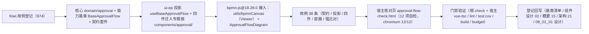

# 01 实施 · 审批流展示

> 前端组件库 · 08 交互类 · 08 审批流展示与流程建模器 · 嵌套子任务 01（需求 08-8）· 实施记录

[文档首页](../../../../../../../文档首页.md) › [08 交互类](../../../08_交互类.md) › [08 审批流展示与流程建模器](../../08_交互类_08_审批流展示与流程建模器.md) › 实施记录　|　[← 详细设计](../设计/01_详细设计_01_审批流展示.md)　[测试记录 →](../测试/01_测试_01_审批流展示.md)

## 1. 实施信息 

| 项 | 值 |
| --- | --- |
| 任务 | 08-8-1 审批流展示（[任务](../08_交互类_08_审批流展示与流程建模器_01_审批流展示.md)） |
| 对应需求 | [08-8](../../../../../需求/08_需求_交互类.md#r08-8) |
| 详细设计 | [01_详细设计_01_审批流展示.md](../设计/01_详细设计_01_审批流展示.md)（定稿提交 `a40089fa`） |
| 实施日期 | 2026-09-19 |
| 实施人 | minjian |
| 实施环境 | Ubuntu 开发机 · Node v24.20.0 / npm 11.19.0（npmmirror）· Vitest 5 / jsdom · Vue 3.5 / TypeScript 严格模式 · chromium headless（核对页核验） |
| Kiwi 用例 | 974（分类「平台骨架」/ P2 / CONFIRMED / 标签「自动化」） |
| 结论 | 完成标准达标（审批进度与操作可用且幂等、时间线与当前节点高亮正确、只读流程图可展示、核对页 12/12） |

## 2. 实施概览 

结果小结：核心新增 1 份领域纯函数、1 个能力基类、1 套契约套件；插件新增 1 套投影与五件（四件迁入专题族 + 只读图件），并引入 `bpmn-js@18.28.0`（Viewer）真实渲染；`ui-ep` 44 文件 / 543 用例全绿（本次新增 38 条）；核对页 12/12。

## 3. 实施过程 

1. **Kiwi 先行**：经容器内 Django shell 登记用例，取得编号 **974**；用例文件首行标注 `// kiwi_id: 974`。
2. **核心领域**（`core/src/domain/approval.ts`）：归一（加载输入口径 → 运行态，集合 / 文本不出现 `undefined`）、会签聚合与进度摘要、当前节点定位、分支降级（紧凑省略 / 非紧凑置 `skipped`）、时间线正倒序与分组、意见折叠与**码点**校验、动作前置校验与可用矩阵、内容派生幂等键（`wf:{fnv1aHex}`）、错误码 → 处置映射（60003 / 60004 / 60005 / 60008 / 60009）、只读判定与只读图三级形态判定。
3. **核心能力基类**（`core/src/capabilities/approval-flow.ts`）：键 `approval-flow`，依赖 `presigned-url` / `access` / `notice`；实例与记录**并行取数**（分部状态各自结算、单失败不整体报错）；提交（内容派生幂等键、防重复提交、成功后刷新）；错误码处置（`60005` 按成功、`60009` 置只读、命中 `refresh` 者刷新实例状态且**刷新后复原失败面**）；只读图形态与图片通路（注入处理函数优先、否则经预签名能力、皆无时不请求）。
4. **契约套件**（`core/testing/approval-flow.ts`）：`describeApprovalFlowContract`——占位零请求、并行取数与单失败、会签与进度、动作矩阵、意见必填与超长、幂等键、提交后刷新、错误码处置、未注入不请求、进行中重复提交、只读图三级判定；**缺省注入图片通路取址**（`withDiagram: false` 用于断言占位零请求）。
5. **插件投影与件**（`ui-ep/src/composables/useBaseApprovalFlow.ts` + `components/approval/`）：薄适配（跨实例基类实例经 `markRaw(toRaw(...))` 隔离、`onScopeDispose` 解除订阅）；五件——`ApprovalFlow`（容器：装配 / 弹窗二次确认 / 事件与注入双轨）、`ApprovalProgress`（三形态 / 高亮滚动居中 / 会签展开 / 分支降级）、`ApprovalTimeline`（正倒序 / 分组 / 折叠 / 附件）、`ApprovalActionPanel`（可用矩阵 / 必填与码点计数）、`ApprovalFlowDiagram`（Viewer 只读图，独立分包）；件层工具 `utils/approvalActions.ts`（动作元数据）、`utils/bpmnCanvas.ts`（`bpmn-js` 单一落点）、`utils/bpmnRoundTrip.ts`（`bpmn-moddle` 强比对）。
6. **依赖接入**：`npm install bpmn-js@18.28.0 -w @bms/ui-ep`（npmmirror），并**改为精确版本 pin**；`bpmn-moddle` 类型声明在插件与宿主 `env.d.ts` 各自补齐（该包自带类型不含构造器声明）。
7. **用例**：`ui-ep/tests/interaction-approval-flow.spec.ts`（38 条，含契约适配器 / 投影 / 四件 / 容器 / 强比对）；既有 `interaction-placeholder.spec.ts` 因**契约口径调整**（五个动作事件合并为 `action`、受控面改装载输入口径）**同步更新**，并对 `bpmn-js` 画布创建入口下桩（jsdom 缺 SVG `getBBox`）。
8. **宿主核对页**：`apps/desktop/approval-flow-check.html` + `src/dev/{approvalFlowCheck.ts,ApprovalFlowCheck.vue}`（12 项自检），`vite build` 不含；以 chromium headless `--dump-dom` 核验 **12/12**。

## 4. 问题与处置 

| # | 问题 | 处置 |
| --- | --- | --- |
| 1 | 核心 `domain/approval` 与 `domain/permission-config` 同名导出 `resolveErrorCode`，核心导出面出现 `Duplicate identifier` | 审批侧改名 `resolveApprovalErrorCode`（并在核心导出面与能力基类同步），保留权限侧原名不动 |
| 2 | 核心注释齐备护栏拦截「多行参数列表中的形参行」 | 把多行参数的对象字面量抽为命名接口 `ApprovalSubmitInput`，`validate` / `submit` 签名收为单行 |
| 3 | `submit()` 原先「先校验后判未注入」，导致「就绪但未注入」时提示的是校验文案而非占位文案 | 调整为**先判未注入（写占位文案）再校验**，与「未注入即占位」口径一致；契约套件对应用例通过 |
| 4 | 错误码处置需「失败后刷新实例」，但 `reload()` 会重写阶段与文案 | 刷新后**复原失败面**（阶段与文案与 `errorHandling`），使错误码处置优先于取数结论 |
| 5 | 投影 `progress` / `actions` 直接读基类实例（字段非响应式）→ computed 首次求值后永久缓存，`ApprovalActionPanel` 按钮不随状态变化 | 派生面改为读**响应式面**（`instance` / `canApprove` / `canWithdraw` / `currentTask` 等 ref）派生 |
| 6 | `bpmn-js` 在 jsdom 下抛 `activeLayer.getBBox is not a function`（SVG API 缺失） | 单测对 `utils/bpmnCanvas` 的创建入口**下桩**（断言分包边界与载荷），真实渲染改由核对页以 chromium 核验 |
| 7 | 核对页初版示例 XML 仅有语义元素、**无 BPMN DI 布局信息** → Viewer `importXML` 失败并降级 | 核对页补 `bpmndi:BPMNDiagram`（`BPMNShape` / `BPMNEdge`）；并明确「渲染依赖 DI」写入组件设计与架构节点 |
| 8 | 核对页自检读取 `defineExpose` 的投影面（ref）当普通字段用 → 断言恒假 | 两件 `defineExpose` 同时暴露**基类实例**（`approval` / `modeler`）与投影（`projection`），核对页读实例普通字段 |
| 9 | 冻结用例原先断言五个动作事件与「无权限按钮禁用」 | 随契约口径调整同步更新为单一 `action` 事件与「无权限按钮不渲染」（**经确认后执行**，并在 `08_01_01` 设计留痕） |

## 5. 验证结果 

| 命令 | 结果 |
| --- | --- |
| 根 `npm run check`（core + vue + ui-ep） | 54 + 2 + 44 文件 / 614 + 5 + 543 用例全绿（ui-ep 本次新增 38） |
| 宿主 `npx vue-tsc -b` / `npm run lint` | 通过 |
| 宿主 `npm run test:cov` | 通过（全库语句覆盖 86.79%、行覆盖 87.61%、35 用例） |
| 宿主 `npm run build` / `npm run budget` | 通过（合计 123.1 KB / 预算 260 KB；最大单文件 104.1 KB / 预算 150 KB；产物中无 `bpmn-js` 命中，首屏不含） |
| 开发态核对页（chromium headless `--dump-dom`） | **12 / 12** 自检项通过（含 `bpmn-js` Viewer 真实渲染出 `djs-container`） |
| 既有 `interaction-placeholder.spec.ts`（`08_01_01` 冻结契约） | **同步更新后**通过（口径调整已在 `08_01_01` 设计留痕） |

对照完成标准：审批进度与操作可用且幂等（内容派生幂等键 + 防重复提交 + 60005 按成功）、时间线与当前节点高亮正确、只读流程图可展示（Viewer 真实渲染 + 三级降级）；`vue-tsc` / ESLint / Vitest 全通过。

## 6. 偏差与遗留 

- **工时偏差**：名义 12h；因新增 1 个能力基类、1 份领域纯函数、1 套契约套件、五件组件、`bpmn-js` 依赖接入与 12 项自检核对页，实际上浮，明细见第 4 节。
- **契约口径调整（破坏性，经确认后执行）**：五个动作事件（`approve` / `reject` / `transfer` / `withdraw` / `comment`）合并为单一 `action`；受控面 `instance` / `records` / `currentTask` 改**装载输入口径**；新增可选 Props / 事件 / 插槽（见详细设计第 3.4.2 节）。已回写 `08_01_01` 详细设计并同步更新冻结用例；导出名 / 分包入口 / 占位语义保持不变。
- **过程偏差**：本轮实施与两份详细设计的落档顺序倒置（先落码后补设计），已在本记录与设计文档如实登记；设计内容与实现一致，无未登记的隐性偏差。
- **真实接口联调**：实例详情 / 审批记录 / 审批提交 / 转办 / 撤回 / 仅评论 / 取图址均未就绪，处理函数由宿主注入；未注入即占位（不发请求）；真实联调随**阶段九**（工作流引擎）。
- **待办角标与实时订阅**：`approval.todo` 实时推送与待办角标归口**阶段八 + 十**（实时推送）。
- **未实现**：移动端审批详情（状态条 + 信息卡 + 时间线 + 底部操作栏，契约套件已就位）；宿主「流程实例详情 / 我的待办审批」路由页（归宿主布局任务）。
- **jsdom 限制**：`bpmn-js` 依赖 SVG `getBBox`，单测对画布创建入口下桩；真实渲染由核对页核验（该限制已写入详细设计第 7 节）。

> 本文档依《[文档生成规范](../../../../../../../规范/文档生成规范.md)》编写
