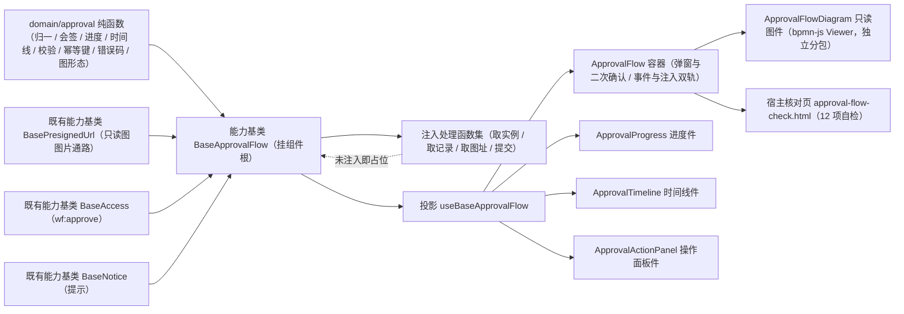

# 01 详细设计 · 审批流展示

> 前端组件库 · 08 交互类 · 08 审批流展示与流程建模器 · 嵌套子任务 01（需求 08-8）· 详细设计

[文档首页](../../../../../../../文档首页.md) › [08 交互类](../../../08_交互类.md) › [08 审批流展示与流程建模器](../../08_交互类_08_审批流展示与流程建模器.md) › 详细设计　|　[← 任务](../08_交互类_08_审批流展示与流程建模器_01_审批流展示.md)

## 1. 设计目标与范围 <a id="goal"></a>

交付[需求 08-8](../../../../../需求/08_需求_交互类.md#r08-8) 的**审批流展示**：以 `08_01_01` 冻结的 `ApprovalFlow` 对外形状为基础，落地流程进度（简化节点序列 / 当前节点高亮 / 会签聚合）、审批时间线（全链路轨迹）、审批操作面板（同意 / 驳回 / 转办 / 撤回 / 评论，二次确认 + 幂等提交）与**可选只读 BPMN 图**（bpmn-js Viewer 真实渲染）。

- **编排入链**：新增能力基类 `BaseApprovalFlow`（核心 `capabilities/approval-flow.ts`，挂组件根），承载实例与记录**并行取数**、会签与进度派生、提交与幂等、错误码处置、只读图形态判定；判定逻辑全部在核心。
- **领域入核心**：新增 `domain/approval.ts`（归一 / 会签聚合 / 进度 / 时间线与分组 / 意见折叠与校验 / 动作校验与可用矩阵 / 内容派生幂等键 / 错误码处置 / 只读与图形态），框架无关纯函数。
- **数据通路注入式**：`loadInstance` / `loadRecords` / `loadDiagramUrl` / `submit` 四个处理函数由宿主注入；**未注入即占位**（不发请求、写占位文案、返回 `undefined`），真实联调随**阶段九**（工作流引擎）。
- **只读图真实渲染**：引入 `bpmn-js@18.28.0`（只引 `Viewer` 实现，**不引** `bpmn-js-properties-panel`），经 `defineAsyncComponent` 独立分包懒加载，与建模画布共用同一份依赖与 `bpmn` 分包。
- **契约套件**：`describeApprovalFlowContract`（`@bms/core/testing`），后续移动端实现跑同一套断言。

### 1.1 口径与依从 <a id="positioning"></a>

- **架构铁律**：审批编排为**横切功能**，一律落为**继承链上的能力基类**（核心 `capabilities/`）；具体件只做渲染与投影，件内经 `useBaseApprovalFlow` 值引入挂链（`ui-ep/tests/guard-component-inheritance.spec.ts` 护栏）。
- **继承链**：`BaseComponent`（组件根）→ 能力基类 `BaseApprovalFlow` → 具体件；能力基类依赖单向登记于 `capabilities/manifest.ts`。
- **对外契约口径**（决策 1）：**允许按真实实现调整既有形状**——`08_01_01` 的五个动作事件（`approve` / `reject` / `transfer` / `withdraw` / `comment`）合并为单一 `action`（载荷 `ApprovalPanelPayload`），并**同步回写 `08_01_01` 详细设计与既有冻结用例**；其余（`ready` / `instance` / `records` / `currentTask` / `canApprove` / `canWithdraw` / `showDiagram` / `bpmnXml` / `degradeText` 与 `degrade` / `live` / `actions` 插槽）保持。
- **装载输入口径 ≠ 运行态口径**：件的 `instance` / `records` / `currentTask` 三个受控面按**装载输入口径**（字段可省略），件内经核心 `normalize*` 归一为运行态。
- **端范围**：**仅 PC**（`frontend/packages/ui-ep`）；移动端审批详情（状态条 + 信息卡 + 时间线 + 底部操作栏）归口移动端宿主任务，契约套件已就位供复用。
- **工时**：本嵌套子任务 12h；因新增 1 个能力基类、1 份领域纯函数、1 套契约套件、五件组件、bpmn-js 依赖与宿主核对页，实际上浮在实施记录登记。

## 2. 交付物清单 <a id="deliver"></a>

| # | 交付物 | 落点 |
| --- | --- | --- |
| 1 | 审批流领域纯函数与数据模型 | `core/src/domain/approval.ts` |
| 2 | 审批流编排能力基类 | `core/src/capabilities/approval-flow.ts` |
| 3 | 能力依赖登记（新增 `approval-flow` 键） | `core/src/capabilities/manifest.ts` |
| 4 | 契约套件（审批流编排） | `core/testing/approval-flow.ts` |
| 5 | 核心用例（领域 / 编排） | `core/tests/{domain-approval,approval-flow}.spec.ts` |
| 6 | 投影（薄适配） | `ui-ep/src/composables/useBaseApprovalFlow.ts` |
| 7 | 流程进度件 | `ui-ep/src/components/approval/ApprovalProgress.vue` |
| 8 | 审批时间线件 | `ui-ep/src/components/approval/ApprovalTimeline.vue` |
| 9 | 审批操作面板件 | `ui-ep/src/components/approval/ApprovalActionPanel.vue` |
| 10 | 只读 BPMN 图件（独立分包懒加载） | `ui-ep/src/components/approval/ApprovalFlowDiagram.vue` |
| 11 | 容器件（装配 / 弹窗 / 事件与注入双轨） | `ui-ep/src/components/approval/ApprovalFlow.vue` |
| 12 | 件层工具（动作元数据 / bpmn-js 单一落点 / 强比对） | `ui-ep/src/utils/{approvalActions,bpmnCanvas,bpmnRoundTrip}.ts` |
| 13 | 导出面登记（含旧路径移除与分包口径） | `ui-ep/src/index.ts` |
| 14 | 用例 | `ui-ep/tests/interaction-approval-flow.spec.ts` |
| 15 | 宿主核对页（`vite build` 不含） | `apps/desktop/approval-flow-check.html`、`apps/desktop/src/dev/{approvalFlowCheck.ts,ApprovalFlowCheck.vue}` |
| 16 | 登记回写 | 见第 6 节 |



## 3. 接口 / 契约与边界 <a id="contract"></a>

### 3.1 核心：`domain/approval.ts` <a id="domain"></a>

```ts
/** 节点状态 / 实例状态 / 审批动作。 */
export type ApprovalNodeStatus = 'done' | 'active' | 'pending' | 'rejected' | 'skipped'
export type ApprovalInstanceStatus = 'running' | 'finished' | 'rejected' | 'abnormal'
export type ApprovalAction = 'approve' | 'reject' | 'withdraw' | 'transfer' | 'comment'
/** 编排阶段 / 取数分部状态 / 只读图形态 / 错误码处置类别 / 时间线排序。 */
export type ApprovalPhase = 'idle' | 'loading' | 'submitting' | 'done' | 'failed'
export type ApprovalPartState = 'idle' | 'loading' | 'ready' | 'empty' | 'error'
export type ApprovalDiagramMode = 'xml' | 'image' | 'none' | 'failed'
export type ApprovalErrorHandling = 'denied' | 'stale' | 'duplicated' | 'signed-pending' | 'abnormal'
export type ApprovalTimelineOrder = 'asc' | 'desc'

/** 常量。 */
export const APPROVAL_UNGROUPED = 'ungrouped'
export const APPROVAL_COMMENT_MAX = 4000      // 与 08_07 文案值同口径（Unicode 码点）
export const APPROVAL_COMMENT_FOLD = 200
export const APPROVAL_PLACEHOLDER_TEXT = '审批数据未就绪（占位）'
export const APPROVAL_EMPTY_TEXT = '暂无审批记录'
export const APPROVAL_DIAGRAM_FALLBACK_TEXT = '流程图加载失败，已切换为进度视图'
export const APPROVAL_COMMENT_REQUIRED_TEXT = '请填写审批意见'
export const APPROVAL_COMMENT_TOO_LONG_TEXT = `审批意见超长（最多 ${APPROVAL_COMMENT_MAX} 字）`
export const APPROVAL_TARGET_REQUIRED_TEXT = '请选择转办对象'
export const APPROVAL_NO_TASK_TEXT = '当前无待办任务'
export const APPROVAL_READONLY_TEXT = '实例已结束或异常，仅供查看'
export const APPROVAL_ACTION_LABELS: Readonly<Record<ApprovalAction, string>>
export const APPROVAL_ERROR_HANDLERS: Readonly<Record<number, ApprovalErrorHandlingItem>>

/** 数据模型（运行态）。 */
export interface ApprovalAssignee { id: string; name: string; avatar?: string }
export interface ApprovalAttachment { id: string; name: string; url?: string; fileId?: string; size?: number }
export interface ApprovalNode {
  nodeId: string; name: string; status: ApprovalNodeStatus
  assignees: ApprovalAssignee[]; signed: boolean
  signedDone?: number; signedTotal?: number; time?: string; rejectedTarget?: string
}
export interface ApprovalInstance {
  id: string; status: ApprovalInstanceStatus; currentNodeId?: string
  nodes: ApprovalNode[]; bpmnXml: string
  initiatorId?: string; initiatorName?: string
  businessType?: string; businessId?: string; startedAt?: string; finishedAt?: string
}
export interface ApprovalRecord {
  id: string; nodeId: string; nodeName: string
  assigneeId: string; assigneeName: string; avatar?: string
  action: ApprovalAction; comment: string
  target?: string; attachments: ApprovalAttachment[]; createdAt: string
}
export interface ApprovalTask { taskId: string; nodeId: string; nodeName: string; signed: boolean; assignees: ApprovalAssignee[]; deadline?: string }
export interface ApprovalSubmitPayload { action: ApprovalAction; taskId?: string; comment?: string; target?: string; idempotencyKey: string }
export interface ApprovalProgressSummary { done: number; total: number; activeName: string }
export interface ApprovalErrorHandlingItem { handling: ApprovalErrorHandling; refresh: boolean; readOnly?: boolean; message: string }
export interface ApprovalRecordGroup { nodeId: string; nodeName: string; records: ApprovalRecord[] }

/** 装载输入口径（后端可省略字段）。 */
export interface ApprovalNodeInput { nodeId: string; name: string; status?: ApprovalNodeStatus; assignees?: readonly ApprovalAssignee[]; signed?: boolean; signedDone?: number; signedTotal?: number; time?: string; rejectedTarget?: string }
export interface ApprovalInstanceInput { id: string; status?: ApprovalInstanceStatus; currentNodeId?: string; nodes?: readonly ApprovalNodeInput[]; bpmnXml?: string; initiatorId?: string; initiatorName?: string; businessType?: string; businessId?: string; startedAt?: string; finishedAt?: string }
export interface ApprovalRecordInput { id: string; nodeId?: string; nodeName?: string; assigneeId?: string; assigneeName?: string; action?: ApprovalAction; comment?: string; target?: string; attachments?: readonly ApprovalAttachment[]; createdAt?: string }
export interface ApprovalTaskInput { taskId?: string; nodeId?: string; nodeName?: string; signed?: boolean; assignees?: readonly ApprovalAssignee[]; deadline?: string }
export interface ApprovalCheckResult { valid: boolean; message: string }

/** 纯函数。 */
export function normalizeNode(input: ApprovalNodeInput): ApprovalNode
export function normalizeNodes(input: readonly ApprovalNodeInput[]): ApprovalNode[]
export function normalizeInstance(input: ApprovalInstanceInput): ApprovalInstance
export function normalizeRecord(input: ApprovalRecordInput): ApprovalRecord
export function normalizeRecords(input: readonly ApprovalRecordInput[]): ApprovalRecord[]
export function normalizeTask(input?: ApprovalTaskInput): ApprovalTask | undefined
export function signProgress(node: ApprovalNode): { done: number; total: number } | undefined
export function resolveProgressSummary(instance: ApprovalInstance): ApprovalProgressSummary
export function resolveActiveNodeIndex(nodes: readonly ApprovalNode[], currentNodeId?: string): number
export function resolveVisibleNodes(nodes: readonly ApprovalNode[], options?: { compact?: boolean }): ApprovalNode[]
export function resolveReadonlyInstance(status?: ApprovalInstanceStatus): boolean
export function resolveTimelineOrderRecords(records: readonly ApprovalRecord[], order?: ApprovalTimelineOrder): ApprovalRecord[]
export function groupRecordsByNode(records: readonly ApprovalRecord[]): ApprovalRecordGroup[]
export function countCodePoints(value: string): number
export function foldComment(comment: string, limit?: number): { text: string; folded: boolean }
export function validateComment(value: string, options?: { required?: boolean }): ApprovalCheckResult
export function validateAction(action: ApprovalAction, context: { comment?: string; target?: string; canApprove?: boolean; canWithdraw?: boolean; hasTask?: boolean }): ApprovalCheckResult
export function resolveApprovalActions(context: { status?: ApprovalInstanceStatus; canApprove?: boolean; canWithdraw?: boolean; hasTask?: boolean; taskId?: string }): { approve: boolean; reject: boolean; transfer: boolean; withdraw: boolean; comment: boolean }
export function deriveApprovalKey(taskId: string | undefined, action: ApprovalAction, comment?: string, target?: string): string
export function resolveDiagramMode(input: { bpmnXml?: string; url?: string; failed?: boolean }): ApprovalDiagramMode
export function resolveApprovalErrorCode(error: unknown): number | undefined
export function resolveErrorHandling(code: number | undefined): ApprovalErrorHandlingItem | undefined
```

| 行为 | 口径 |
| --- | --- |
| 归一 | 运行态**不出现 `undefined`**：集合缺省 `[]`、文本缺省 `''`、状态缺省 `running` / `pending` / `comment`；会签字段仅在 `signed` 为真时派生 |
| 会签聚合 | `signed` 为假返回 `undefined`；为真时 `done` 取 `signedDone`，`total` 缺省取审批人数 |
| 进度 | `done` = 状态为 `done` 的节点数；`activeName` 由 `resolveActiveNodeIndex`（`currentNodeId` 优先，否则首个 `active`，皆无 `-1`）定位 |
| 分支降级 | 紧凑模式**省略**未走分支；非紧凑模式把未走分支（`pending` 且非当前节点）**降级为 `skipped`**（不修改入参） |
| 只读判定 | `finished` / `rejected` / `abnormal` 为只读；`running` 与 `undefined` 非只读 |
| 时间线排序 | 正序缺省保持原顺序；倒序按时间逆序且**同时间保持稳定序** |
| 分组 | 空节点标识归 `ungrouped`；组名取组内首个非空节点名，否则回落 `ungrouped` |
| 意见折叠 | 按 **Unicode 码点**截断（`countCodePoints`）；未超阈值不折叠 |
| 意见校验 | 必填（去空白判空）与上限（`APPROVAL_COMMENT_MAX` 码点）两段；`4000` 汉字与 `4000` emoji 均放行 |
| 动作校验 | 驳回意见必填、转办目标必填、评论意见必填、同意意见可选；动作不可用（无权限 / 无待办 / 不可撤回）直接不通过 |
| 可用矩阵 | `status` 非 `running` 时全部不可用；审批类动作 = 进行中 ∧ 有待办 ∧ `canApprove`；`withdraw` = 进行中 ∧ `canWithdraw`（**独立于待办**） |
| 幂等键 | `wf:{fnv1aHex(stableStringify([taskId, action, comment.trim(), target ?? '']))}`：同内容同键、内容变更换键；核心不依赖加密库 |
| 图形态 | `failed` 优先 → `xml`（有 XML）→ `image`（有地址）→ `none` |
| 错误码 | `60003 denied` / `60004 stale` / `60005 duplicated` / `60008 signed-pending` / `60009 abnormal`（`readOnly`），均 `refresh: true` |
| 纯数据 | 不触 DOM、不请求、不依赖渲染框架；同输入同输出 |

### 3.2 核心：能力基类 `BaseApprovalFlow` <a id="base"></a>

```ts
export interface ApprovalSubmitInput { comment?: string; target?: string }
export interface ApprovalSubmitResult { recordVersion?: number; version?: number; message?: string }

export type ApprovalLoadInstanceHandler = (input: { instanceId: string }) => Promise<ApprovalInstanceInput | undefined>
export type ApprovalLoadRecordsHandler = (input: { instanceId: string }) => Promise<readonly ApprovalRecordInput[] | undefined>
export type ApprovalLoadDiagramHandler = () => Promise<PresignedResult | undefined>
export type ApprovalSubmitHandler = (payload: ApprovalSubmitPayload) => Promise<ApprovalSubmitResult | undefined>
export interface ApprovalJobs {
  loadInstance?: ApprovalLoadInstanceHandler
  loadRecords?: ApprovalLoadRecordsHandler
  loadDiagramUrl?: ApprovalLoadDiagramHandler
  submit?: ApprovalSubmitHandler
}

export abstract class BaseApprovalFlow extends BaseComponent {
  readonly identifier: string = 'approval-flow'
  override readonly depends = ['presigned-url', 'access', 'notice']

  instanceId: string
  ready: boolean                    // 数据通路就绪（占位语义开关）
  approvable: boolean               // 宿主下发：可审批（缺省 true，按「持有待办」判定）
  withdrawable: boolean             // 宿主下发：可撤回（发起人）
  phase: ApprovalPhase
  instance?: ApprovalInstance
  records: ApprovalRecord[]
  currentTask?: ApprovalTask
  instanceState: ApprovalPartState
  recordsState: ApprovalPartState
  errorMessage: string
  errorHandling?: ApprovalErrorHandlingItem
  pendingRefresh: boolean
  requestCount: number
  diagramXml: string
  diagramUrl: string
  diagramFailed: boolean
  jobs: ApprovalJobs
  access?: BaseAccess
  notice?: BaseNotice
  presigned?: BasePresignedUrl

  get degraded(): boolean
  get disabled(): boolean
  get busy(): boolean
  get readonly(): boolean
  get canApprove(): boolean
  get canWithdraw(): boolean
  get actions(): { approve; reject; transfer; withdraw; comment }
  get progress(): ApprovalProgressSummary
  get diagramMode(): ApprovalDiagramMode
  get loadReady(): boolean
  get submitReady(): boolean

  setReady(value: boolean): void
  setInstanceId(instanceId: string): void
  setJobs(jobs: ApprovalJobs): void
  setAccess(access?: BaseAccess): void
  setNotice(notice?: BaseNotice): void
  setPresigned(presigned?: BasePresignedUrl): void
  applyInstance(input: ApprovalInstanceInput): void
  applyRecords(input: readonly ApprovalRecordInput[]): void
  applyTask(input?: ApprovalTaskInput): void
  load(): Promise<boolean>
  reload(): Promise<boolean>
  loadDiagramImage(): Promise<string | undefined>
  markDiagramFailed(): void
  idempotencyKey(action: ApprovalAction, comment?: string, target?: string): string
  validate(action: ApprovalAction, input?: ApprovalSubmitInput): ApprovalCheckResult
  submit(action: ApprovalAction, input?: ApprovalSubmitInput): Promise<ApprovalSubmitResult | undefined>
  retry(): Promise<ApprovalSubmitResult | undefined>
  reset(): void
}
```

| 行为 | 口径 |
| --- | --- |
| 装载 | `applyInstance` 同步 `instanceId` 与只读图 XML 并清 `diagramFailed`；空节点置分部空态；`applyRecords` 空集置空态；`applyTask` 归一（无 `taskId` 视为无待办） |
| 切换实例 | `setInstanceId` 清空实例 / 记录 / 待办 / 错误 / 图态与分部状态，阶段回 `idle` |
| 并行取数 | `load()`：实例与记录**各自独立结算**（单失败置该分部 `error` + 写 `pendingRefresh`，不影响另一分部与整体阶段）；请求计数按**实际发起数**累加；未就绪 / 无处理函数 / 进行中不发请求 |
| 提交前置 | `submit()`：未就绪 → 不动作；**未注入处理函数 → 写占位文案且不请求**（先于校验）；随后动作校验（不通过写文案）；只读 / 进行中不动作 |
| 提交 | 以**内容派生幂等键**打包载荷交处理函数；`requestCount + 1`；成功后刷新实例（`reload`）并阶段 `done` |
| 重复提交 | 错误码 `60005` 视为**成功**（置 `done`、`errorHandling.handling = 'duplicated'`、**不置只读**） |
| 失败处置 | 按错误码写 `errorHandling` 与文案、阶段 `failed`；`refresh` 为真时**刷新实例**（刷新会重写阶段与文案，故刷新后**复原失败面**，错误码处置优先于取数结论）；`readOnly` 为真时置内部异常标记 → `readonly` 为真 |
| 重试 | `retry()` 仅在 `failed` 阶段重放上次提交入参（保留），否则返回 `undefined` |
| 只读图 | `diagramMode` 三级判定；`loadDiagramImage()` 未就绪 / 未注入取址（处理函数与预签名皆无）时**不请求** |
| 权控 | 未注入权限上下文视为有权；注入后按 `wf:approve` 判定 |
| 占位语义 | `ready === false` → `degraded` / `disabled` 为真、取数与提交**零请求**，保持 `08_01_01` 冻结口径 |

- 依赖登记：`approval-flow: ['presigned-url', 'access', 'notice']`。
- 不含渲染（进度 / 时间线 / 面板 / 图）与弹窗语义（归件层）。

### 3.3 契约套件（`@bms/core/testing`） <a id="testing"></a>

| 套件 | 契约面（结构化接口） | 断言要点 |
| --- | --- | --- |
| `describeApprovalFlowContract(name, create)` | `ready` / `degraded` / `disabled` / `requestCount` / `phase` / `instanceStatus` / `nodeCount` / `recordCount` / `readonlyState` / `diagramMode` / `loadCount` / `progress()` / `signProgress()` / `actions()` / `errorHandling()` / `setReady` / `setAccess` / `setHandlers` / `load` / `applyInstance` / `applyRecords` / `applyTask` / `setWithdrawable` / `idempotencyKey` / `validate` / `submit` / `retry` / `loadDiagramImage` / `markDiagramFailed` | 占位零请求；就绪未注入零请求；并行取数各自结算与单失败不整体报错；会签聚合与进度摘要；动作矩阵（无待办 / 结束态 / 无权）；意见必填与超长拒绝；幂等键同内容同键、内容变更换键；提交成功后刷新；`60005` 按成功、`60003`/`60004`/`60008` 失败并刷新、`60009` 置只读；未注入提交不请求；校验不通过不请求；进行中重复提交不动作；只读图三级判定与未注入零请求 |

- 目标约定：实例 `wf-1`（`running`，`n1 done` / `n2 active signed`（2 人已完成 1）/ `n3 pending`，`currentNodeId = n2`）；记录两条；当前待办 `task-1`；权限码 `wf:approve`；**缺省注入 `loadDiagramUrl`**（使图形态三级判定可完整断言），`withDiagram: false` 时不注入（断言占位零请求）。
- 套件端中立，后续移动端实现复用同一套断言。

### 3.4 件层：投影与四件 <a id="components"></a>

#### 3.4.1 投影 `useBaseApprovalFlow`（`ui-ep/src/composables/`） <a id="binding"></a>

```ts
export interface UseBaseApprovalFlowOptions {
  ready?: boolean
  instanceId?: string
  jobs?: ApprovalJobs
  access?: BaseAccess
  notice?: BaseNotice
  presigned?: BasePresignedUrl
}

export interface UseBaseApprovalFlowResult {
  approval: BaseApprovalFlow
  ready / degraded / disabled / busy / phase / instance / records / currentTask
  instanceState / recordsState / errorMessage / errorHandling / pendingRefresh / requestCount
  diagramMode / diagramXml / diagramUrl / readonly / canApprove / canWithdraw: Ref<...>
  progress: ComputedRef<ApprovalProgressSummary>
  actions: ComputedRef<Record<ApprovalAction, boolean>>
  setReady / setInstanceId / setJobs / setAccess / setPresigned / setNotice
  setApprovable / setWithdrawable / applyInstance / applyRecords / applyTask
  load / reload / loadDiagramImage / markDiagramFailed
  idempotencyKey / validate / submit / retry / reset
}
```

- **薄适配**：核心实例 ↔ Vue 响应式，不含判定逻辑；跨实例基类实例经 `markRaw(toRaw(...))` 隔离，`onScopeDispose` 解除生命周期订阅；集合面（`records`）在 `sync()` 时重建（核心集合非响应式）。
- **派生面必须读响应式面**（实施偏差修正）：`progress` / `actions` 若直接读基类实例（字段非响应式），computed 首次求值后会永久缓存；故改为基于投影的 `instance` / `canApprove` / `canWithdraw` / `currentTask` 等 ref 派生。

#### 3.4.2 `ApprovalFlow` 容器件契约 <a id="container"></a>

| 面 | 内容 |
| --- | --- |
| 数据面（沿用） | `ready`（缺省 `false`）/ `instance` / `records` / `currentTask` / `loading` / `compact` / `canApprove` / `canWithdraw` / `showDiagram` / `bpmnXml` / `degradeText` |
| 数据面（新增可选） | `diagramUrl` / `instanceId` / `jobs` / `access` / `notice` / `presigned` / `showActions` / `showTimeline` / `timelineOrder` / `highlightAction` / `returnableNodes` / `transferCandidates` / `autoLoad` |
| 事件（既有） | `node-click`（`nodeId`）/ `retry` |
| 事件（口径调整） | 五个动作事件（`approve` / `reject` / `transfer` / `withdraw` / `comment`）**合并为 `action`**（`ApprovalPanelPayload`） |
| 事件（新增） | `saved`（`ApprovalSubmitResult`）/ `failed`（`{ message, code? }`）/ `reloaded`（`{ instance, records }`）/ `node-select`（`{ nodeId, assignees }`）/ `diagram-fallback` |
| 插槽（既有） | `degrade` / `live` / `actions` |
| 插槽（新增） | `progress` / `timeline` / `panel` |
| 数据标记（延续） | `data-ready` / `data-degraded` / `data-test="placeholder"` / `data-test="empty"` / `data-test="empty-records"` / `data-test="diagram-degrade"` / `data-test="retry"` / `data-test="actions"` / `data-test="progress"` / `data-test="timeline"` / `data-test="diagram"` / `data-test="bpmn-diagram"` |
| 数据标记（新增） | `data-phase` / `data-compact` / `data-readonly` / `data-test="loading"` / `data-test="instance-status"` / `data-test="reject-dialog"` / `data-test="reject-comment"` / `data-test="reject-node"` / `data-test="transfer-dialog"` / `data-test="transfer-user"` / `data-test="error"` |

| 行为 | 口径 |
| --- | --- |
| 占位 | `ready` 为假 → 降级 + 禁用 + 零请求（既有冻结断言保持） |
| 受控覆盖 | `instance` / `records` / `currentTask` / `loading` / `canApprove` / `canWithdraw` 提供时优先，按装载输入口径归一到运行态 |
| 自动取数 | `ready` ∧ `autoLoad` ∧ 未下发 `instance` → 调 `load()` 并上抛 `reloaded` |
| 注入判定 | `jobs.submit` **未注入**时点击只上抛 `action`（宿主自理）；注入时由内核驱动真实编排（避免双重执行） |
| 驳回 / 转办 | 注入时走 `FormDialog`（驳回意见必填 + 可退回节点；转办目标必填），确认后提交 |
| 撤回 | 注入时走 `useConfirm` 危险确认（「撤回后流程实例将终止」），确认后提交 |
| 只读图 | `diagramUrl` 提供时按图片通路；否则按图形态三级判定（`xml` / `image` 渲染分包件，`none` 显示降级文案，分包件报错 → `markDiagramFailed` + 上抛 `diagram-fallback`） |

#### 3.4.3 `ApprovalProgress` 流程进度件契约 <a id="progress"></a>

| 面 | 内容 |
| --- | --- |
| 数据面 | `nodes` / `instanceStatus` / `currentNodeId` / `direction`（`horizontal` / `vertical`，缺省横向）/ `compact` / `showAssignees` |
| 事件 | `node-click`（`nodeId`）/ `node-select`（`{ nodeId, assignees }`） |
| 插槽 | `node`（节点区替换，参数 `{ nodes }`） |
| 数据标记 | `data-test="approval-progress"` / `data-direction` / `data-compact` / `data-status` / `data-test="progress-empty"` / `data-test="node-{nodeId}"`（含 `data-status` / `data-node-id` / `data-active`）/ `data-test="active-node"` / `data-test="signed"` / `data-test="sign-progress"` / `data-test="node-assignees-{nodeId}"` / `data-test="signed-panel"` / `data-test="progress-summary"` |
| 行为 | 当前节点高亮（`data-active`）并在横向模式下**容器内滚动居中**；会签节点展示「已完成 n / 共 m」且点击展开各审批人处理状态（已处理 / 待处理）；未走分支按核心降级规则展示；空节点出空态 |

#### 3.4.4 `ApprovalTimeline` 审批时间线件契约 <a id="timeline"></a>

| 面 | 内容 |
| --- | --- |
| 数据面 | `records` / `order`（缺省正序）/ `grouped` / `highlightAction` / `activeNodeId` / `foldLimit`（缺省 200）/ `showAttachments` |
| 事件 | `record-click` / `attachment-click`（`{ recordId, attachment }`）/ `fold-toggle`（`{ recordId, folded }`）/ `order-change` |
| 插槽 | `record`（记录区替换，参数 `{ records }`） |
| 数据标记 | `data-test="approval-timeline"` / `data-order` / `data-test="timeline-order"` / `data-test="empty-records"` / `data-test="record-group-{nodeId}"` / `data-test="record-{id}"`（含 `data-action` / `data-highlight` / `data-node-active`）/ `data-test="fold-{id}"` / `data-test="attachment-{id}"` |
| 行为 | 正序缺省、可切倒序（受控只上抛 `order-change`，件内同步以即时生效）；按节点分组；动作语义色（`approve` success / `reject` danger / `withdraw` warning / `transfer`·`comment` info）；长意见折叠与展开；附件名称按钮；定位节点高亮；空态 |

#### 3.4.5 `ApprovalActionPanel` 审批操作面板件契约 <a id="panel"></a>

| 面 | 内容 |
| --- | --- |
| 数据面 | `actions`（可用矩阵）/ `currentTask` / `readonly` / `submitting` / `commentMax`（缺省 4000）/ `returnableNodes` / `transferCandidates` |
| 事件 | `action`（`ApprovalPanelPayload`）/ `cancel` |
| 插槽 | `extra` / `buttons` |
| 数据标记 | `data-test="approval-action-panel"` / `data-readonly` / `data-submitting` / `data-test="readonly-tip"` / `data-test="no-task"` / `data-test="comment-input"` / `data-test="reject-target"` / `data-test="transfer-target"` / `data-test="approve"` / `data-test="reject"` / `data-test="transfer"` / `data-test="withdraw"` / `data-test="comment"` / `data-test="comment-error"` / `data-test="submit-loading"` |
| 行为 | 按可用矩阵渲染按钮（不可用不渲染）；意见按**码点**实时计数并标超限；驳回 / 转办前先校验必填（不通过写内联错误且不上抛）；只读态不出按钮并提示；无待办提示 |

#### 3.4.6 `ApprovalFlowDiagram` 只读 BPMN 图件契约 <a id="diagram"></a>

| 面 | 内容 |
| --- | --- |
| 数据面 | `xml`（主通路）/ `currentNodeId` / `rejectedTargetId` / `url`（图片通路） |
| 事件 | `ready` / `error`（`{ reason }`） |
| 数据标记 | `data-test="bpmn-diagram"` / `data-subpackage="bpmn"` / `data-state` / `data-node` / `data-test="diagram-note"` / `data-test="diagram-error"` |
| 行为 | `bpmn-js` **Viewer** 只读渲染（禁编辑）+ 当前节点高亮与滚动居中 + 驳回节点标记 + 缩放平移；加载 / 解析失败上抛 `error` 供容器降级 |

### 3.5 分包与命名 <a id="chunk"></a>

- 保留两个异步分包入口（`08_01` 冻结）：`ApprovalFlowDiagram`（Viewer）与建模画布 `ProcessCanvas`（Modeler），均经 `defineAsyncComponent` 懒加载、**共用同一份 `bpmn-js` 依赖与 `bpmn` 分包**，`data-subpackage="bpmn"` 不变。
- **懒加载件不作为根出口静态导出**（`ui-ep/src/index.ts`）：否则会被静态引入而使动态导入无法分包（构建告警 `INEFFECTIVE_DYNAMIC_IMPORT`）。
- 五件落入 `ui-ep/src/components/approval/` 专题族；旧 `components/interaction/{ApprovalFlow,ApprovalFlowDiagram}.vue` 删除；`ui-ep/src/index.ts` 的导出名与既有类型名不变（类型改由 `@bms/core` 统一导出）。
- `bpmn-js` **pin `18.28.0`**（= 原型内置版本，18.x 系最新补丁），声明在 `@bms/ui-ep` 包依赖（与 `codemirror` / `tiptap` / `qrcode` 同层），经 npmmirror 安装并锁入 `package-lock.json`。
- `bpmn-js` 与 `bpmn-moddle` 的调用**只在 `ui-ep/src/utils/`** 单一落点（`bpmnCanvas.ts` / `bpmnRoundTrip.ts`）；**核心包保持零依赖**（`bpmn-moddle` 不进 `@bms/core`）。

## 4. 失败分支与边界 <a id="edge"></a>

| 边界 / 失败场景 | 处置 |
| --- | --- |
| 数据通路未就绪（`ready` 为假） | 占位：降级提示 + 操作禁用 + 取数与提交零请求 |
| 处理函数未注入 | 占位：不请求、写占位文案、返回 `undefined`；件层按 `actions()` 与 `submitReady` 决定是否驱动内核 |
| 无当前待办 | `tasks` 类动作不可用（按钮不渲染）+ 面板提示「当前无待办任务」 |
| 非当前审批人（60003） | 失败 + 按错误码提示 + 刷新实例状态；可重试 |
| 任务状态不允许（60004） | 同上 |
| 重复提交（60005） | **按成功处理**：置 `done`、不置只读、提示「已提交」 |
| 会签未完成（60008） | 失败 + 提示；不推进（后端兜底） |
| 引擎异常（60009） | 置**只读**（`readonly` 为真、动作全不可用）+ 提示人工处理 |
| 驳回未填意见 / 转办未选目标 / 评论未填意见 | 面板内联报错且**不上抛**（零请求） |
| 意见超长（> 4000 码点） | 面板内联报错且不上抛；核心 `validate` 同样拒绝 |
| 实例已结束 / 已驳回 / 异常 | 只读：不出操作按钮 + 提示「实例已结束或异常，仅供查看」 |
| 无 `wf:approve` | 动作不可用；后端兜底 |
| 实例详情取数失败 | 该分部 `error` + 局部错误态与重试；**记录分部照常渲染**（不整体报错） |
| 审批记录取数失败 | 同上（反向） |
| 无记录 | 时间线空态「暂无审批记录」 |
| 无节点 | 进度件空态「暂无流程节点」 |
| 只读图无 XML 且无地址 | 不出异步图（`none`），显示降级文案 |
| 只读图依赖加载 / XML 解析失败 | `markDiagramFailed` → 三级降级 → 显示「流程图加载失败，已切换为进度视图」并上抛 `diagram-fallback` |
| 超长流程（横向超宽） | 容器内横向滚动 + 当前节点滚动居中 |
| 窄容器 / 紧凑模式 | 进度件切纵向 + 省略未走分支 |

## 5. 测试设计与验收映射 <a id="test"></a>

| 验收点（需求 08-8 / 子任务 08-8-1） | 用例 |
| --- | --- |
| 占位语义（降级 / 禁用 / 零请求） | `describeApprovalFlowContract`（`08_01_01` 冻结口径延续）+ `interaction-placeholder.spec.ts` |
| 并行取数、单失败不整体报错、分部空态 | 契约套件 + `interaction-approval-flow.spec.ts`（投影薄适配） |
| 会签聚合与进度摘要、当前节点定位、分支降级 | `core/tests/domain-approval.spec.ts` + 契约套件 + `ApprovalProgress` 用例 |
| 时间线正 / 倒序、分组、长意见折叠、附件、空态 | `domain-approval.spec.ts` + `ApprovalTimeline` 用例 |
| 动作校验（必填 / 超长 / 可用性）与可用矩阵 | `domain-approval.spec.ts` + 契约套件 + `ApprovalActionPanel` 用例 |
| 幂等键（同内容同键、内容变更换键、重复提交结果一致） | `domain-approval.spec.ts` + 契约套件 + 投影用例 |
| 提交成功刷新、错误码处置（含 60005 按成功、60009 置只读） | 契约套件 + `core/tests/approval-flow.spec.ts` + 容器用例 |
| 驳回 / 转办弹窗与撤回危险确认（未确认零提交） | 容器用例 |
| 只读图三级降级与异步分包边界 | 契约套件 + 容器用例（分包件桩）+ **核对页 chromium 核验** |
| 组件挂链护栏（值引入基类投影） | `ui-ep/tests/guard-component-inheritance.spec.ts`（自动覆盖新件与新投影） |
| 宿主机对页十二项自检 | chromium headless `--dump-dom`（**12 / 12**） |
| `vue-tsc`、ESLint、Vitest 全通过 | 根 `npm run check` + 宿主 `vue-tsc -b` / `lint` / `test:cov` / `build` / `budget` |
| 文档链接与基座校验 | `check-links.py`、`check-base.py` |

- Kiwi 用例 1 条（一任务一条，编号于测试步登记后回填，预计 **974**；分类「平台骨架」、优先级 P2、状态 CONFIRMED、标签「自动化」）。

## 6. 登记落点 <a id="register"></a>

| 内容 | 落点 |
| --- | --- |
| 新增能力基类 `BaseApprovalFlow`（能力键 `approval-flow`） | 《[前端基类清单](../../../../../../../前端基类清单.md)》§2.1 插入行（父基类 `BaseComponent`，组件侧·能力基类，状态「已交付」，后续编号顺延）+ §2 继承链总览 + §5.2 能力基类表 + `capabilities/manifest.ts` |
| 领域纯函数与数据模型 `domain/approval.ts` | 同上 §9「核心」（`domain/` 领域纯函数） |
| 契约套件 | 同上 §9（`core/testing/`：审批流编排一套） |
| 投影与件（`useBaseApprovalFlow` + 专题族 `components/approval/`） | 同上 §9「PC 插件」（投影清单、专题族目录清单、`utils/` 落点） |
| 旧路径移除（`components/interaction/` 两件） | 同上 §9（目录清单同步） |
| 设计口径回写 | 《组件设计》[02 审批流展示](../../../../../../../设计/组件设计/08_交互类/02_组件设计_审批流展示/02_组件设计_审批流展示.md)：继承链行改现行口径、第 9.2 节登记项状态回写 |
| 冻结设计回写 | [08_01_01 配置与工作流占位](../../../08_交互类_01_占位版交付/08_交互类_01_占位版交付_01_配置与工作流占位/设计/01_详细设计_01_配置与工作流占位.md)：`ApprovalFlow` 动作事件合并为 `action` 的对齐记录 |
| 上游登记（2 项，本任务只登记归口、不代上游裁决） | ① 审批展示数据结构与操作接口（含转办 / 撤回 / 仅评论）→ 《概要设计 · 工作流管理》「数据模型与表设计」「接口设计」节；② 前端展示形态分层（简化进度 + 只读 BPMN）→ 《架构设计 · 子系统 · 工作流》「职责与边界」「协作」节 |
| 任务 / 父任务 / 域任务 / 计划状态 | [任务](../08_交互类_08_审批流展示与流程建模器_01_审批流展示.md)、[父任务](../../08_交互类_08_审批流展示与流程建模器.md)、[域任务](../../../08_交互类.md)、[计划](../../../../../../../项目/04_前端组件库/计划/01_计划_前端组件库.md) |
| 需求文档 | 不承载进度（状态只在任务与计划两处一致）；遗留归口写在实施 / 测试记录与计划 |

## 7. 边界与开放项 <a id="open"></a>

- **不在本期**：真实接口联调（实例详情 / 审批记录 / 提交 / 转办 / 撤回 / 仅评论 / 取图址，随**阶段九**）；待办角标与实时推送订阅（`approval.todo`，随阶段八 + 十）；移动端审批详情；宿主「流程实例详情 / 我的待办审批」路由页（归宿主布局任务）。
- **协同契约**：宿主注入 `jobs` / `access` / `notice` / `presigned` 上下文；件层默认装配 `FormDialog`（驳回 / 转办）与 `useConfirm`（撤回）；未注入即事件上抛 + 核心占位。
- **事件与注入双轨的风险**：宿主同时监听 `action` 并注入 `jobs.submit` 会导致重复执行（文档写明「二选一」）；件层不额外去重（保持对外形状稳定）。
- **`jsdom` 与真实渲染**：`bpmn-js` 依赖 SVG `getBBox`（jsdom 不实现），单元用例对画布创建入口下桩，**真实渲染由开发态核对页以 chromium 核验**。
- **契约调整留痕**：`08_01_01` 的五个动作事件合并为 `action` 属**破坏性变更**（经确认后执行），已在 `08_01_01` 详细设计与本任务实施记录登记；既有 `interaction-placeholder.spec.ts` 同步更新。
- Kiwi 用例编号于测试步登记后回填实施 / 测试记录与用例文件（预计 974）。

## 8. 决策记录 <a id="decision"></a>

| # | 决策项 | 结论 |
| --- | --- | --- |
| 1 | 对外契约口径 | **允许按真实实现调整**：五个动作事件合并为 `action`；同步回写 `08_01_01` 设计与既有冻结用例 |
| 2 | 编排落点 | 新增能力基类 `BaseApprovalFlow`（挂组件根），依赖 `presigned-url` / `access` / `notice` |
| 3 | 注入面 | 四处理函数：`loadInstance` / `loadRecords` / `loadDiagramUrl` / `submit`（载荷含动作） |
| 4 | 幂等键 | **内容派生**（任务 + 动作 + 意见 + 目标），`wf:{hash}`；同内容同键、内容变更换键 |
| 5 | 取数口径 | **并行拉取，单失败不整体报错**（分部状态 + 重试） |
| 6 | 错误码处置 | 核心内置映射表；`60005` 按成功、`60009` 置只读；命中 `refresh` 者刷新实例状态 |
| 7 | 弹窗形态 | 驳回 / 转办走 `FormDialog`（必填校验）；撤回走 `useConfirm` 危险确认 |
| 8 | 只读图 | **真实接入 `bpmn-js` Viewer**（pin `18.28.0`，只引 Viewer）；XML 渲染为主 + 预签名图片为辅 |
| 9 | 只读图降级 | 三级：无 XML / 依赖加载失败 / XML 解析失败 → 回退进度件 + 提示 |
| 10 | 件拆分 | 容器 + 四件（进度 / 时间线 / 操作面板 / 只读图） |
| 11 | 进度件形态 | 三形态（横向 / 纵向 / 紧凑）+ 高亮滚动居中 + 会签 n/m 聚合展开 + 分支降级 |
| 12 | 时间线形态 | 正序缺省可切倒序 + 节点分组 + 长意见折叠 + 附件 |
| 13 | 长度口径 | 意见上限 **4000 码点**（与 `08_07` 文案值口径统一，均由 `Array.from(value).length` 口径计数，与后端 Python `len()` 一致） |
| 14 | 分包入口 | 两个异步入口不变（只读图 / 建模画布），共用同一 `bpmn` 分包 |
| 15 | 端范围 | **仅 PC**；移动端遗留（契约套件已就位） |
| 16 | 依赖落层 | `bpmn-js` 装 `@bms/ui-ep` 包依赖；`bpmn-moddle` 不引（强比对用其内置导出，仍只在插件层） |
| 17 | 阶段归属 | 阶段四内交付；真实联调归口**阶段九** |
| 18 | 宿主页面 | 不做宿主路由页（本期只做核对页） |

## 9. 参考文档 <a id="ref"></a>

- [需求 08-8](../../../../../需求/08_需求_交互类.md#r08-8)、[任务 08-8-1](../08_交互类_08_审批流展示与流程建模器_01_审批流展示.md)、[父任务 08 审批流展示与流程建模器](../../08_交互类_08_审批流展示与流程建模器.md)
- 《组件设计》[02 审批流展示](../../../../../../../设计/组件设计/08_交互类/02_组件设计_审批流展示/02_组件设计_审批流展示.md)（含[可交互原型](../../../../../../../设计/组件设计/08_交互类/02_组件设计_审批流展示/02_原型设计_审批流展示.html)，原型即验收基准）
- 《[概要设计 · 工作流管理](../../../../../../../设计/概要设计/15_概要设计_工作流管理.md)》、《[架构设计 · 子系统 · 工作流](../../../../../../../设计/架构设计/21_架构设计_子系统_工作流.md)》
- [08_01_01 配置与工作流占位](../../../08_交互类_01_占位版交付/08_交互类_01_占位版交付_01_配置与工作流占位/08_交互类_01_占位版交付_01_配置与工作流占位.md)（冻结对外契约与占位套件）、[08_02 图标选择器与代码表达式编辑器](../../../08_交互类_02_图标选择器与代码表达式编辑器/08_交互类_02_图标选择器与代码表达式编辑器.md)（代码表达式编辑能力复用）
- [《前端基类清单》](../../../../../../../前端基类清单.md)、《[前端开发规范](../../../../../../../规范/前端开发规范.md)》、《[文档生成规范](../../../../../../../规范/文档生成规范.md)》

> 本文档依《[文档生成规范](../../../../../../../规范/文档生成规范.md)》编写
