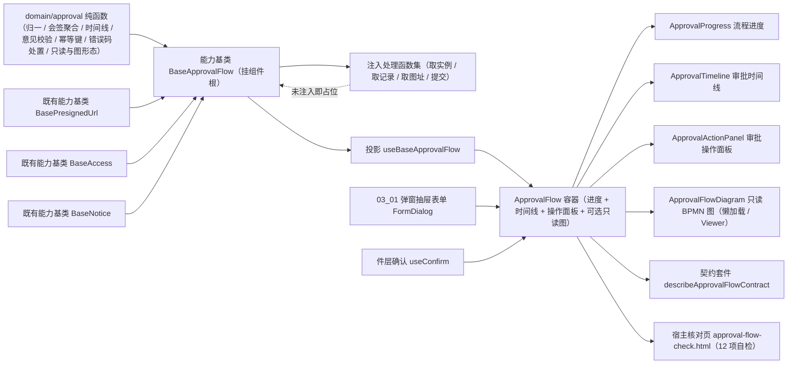

# 01 详细设计 · 审批流展示

> 前端组件库 · 08 交互类 · 08 审批流展示与流程建模器 · 嵌套子任务 01（需求 08-8）· 详细设计

[文档首页](../../../../../../../文档首页.md) › [08 交互类](../../../08_交互类.md) › [08 审批流展示与流程建模器](../../08_交互类_08_审批流展示与流程建模器.md) › 详细设计　|　[← 任务](../08_交互类_08_审批流展示与流程建模器_01_审批流展示.md)

## 1. 设计目标与范围 <a id="goal"></a>

交付[需求 08-8](../../../../../需求/08_需求_交互类.md#r08-8) 的**审批流展示**：流程进度（简化节点序列、当前节点高亮与会签聚合）、审批时间线（全链路轨迹）、审批操作（同意 / 驳回 / 转办 / 撤回 / 评论，二次确认与**幂等提交**）、可选只读 BPMN 图（bpmn-js Viewer，按需加载与三级降级），以及审批取数与提交语义（并行取数、错误码处置、提交后刷新）。

- **领域入核心**：新增 `domain/approval.ts` —— 实例 / 节点 / 记录 / 待办归一、会签聚合、进度与会签展开、时间线分组与排序、意见校验与折叠、动作前置校验、内容派生幂等键、错误码 → 处置映射、只读判定、分支降级与图形态判定，全部为框架无关纯函数。
- **编排入链**：新增能力基类 `BaseApprovalFlow`（核心 `capabilities/approval-flow.ts`，挂组件根），承载并行取数、阶段机、提交与幂等、错误码处置与实例刷新；**组合**预签名能力基类 `BasePresignedUrl` 承接只读图图片通路。
- **数据通路注入式**：`loadInstance` / `loadRecords` / `loadDiagramUrl` / `submit` 由宿主注入；**未注入即占位**（不发请求、返回 `undefined`、写占位文案），与 `08_01_01` 的占位语义一致；真实工作流接口联调随**阶段九**。
- **契约套件**：`describeApprovalFlowContract` 一套（`@bms/core/testing`），端中立，后续移动端实现跑同一套断言。
- **只读 BPMN 图**：真实接入 **bpmn-js Viewer 18.28.0**（只引 Viewer，不引 Properties Panel），与 `08-8-2` 建模器**共用同一依赖与 bpmn 分包**、懒加载不进首屏；无 XML / 加载失败 / 解析失败**三级降级**回退流程进度件。
- **对外契约**：`08_01_01` 冻结的 `ApprovalFlow` 契约**按真实实现调整**（命名与载荷重整），并同步回写 `08_01_01` 详细设计与既有冻结用例。

### 1.1 口径与依从 <a id="positioning"></a>

- **架构铁律**：审批展示编排为**横切功能**，一律落为**继承链上的能力基类**（核心 `capabilities/`），不在链外自由挂接；具体件只做渲染与投影。
- **继承链**：`BaseComponent`（组件根）→ 能力基类 `BaseApprovalFlow` → 具体件；件内经 `useBaseApprovalFlow` 投影挂链。只读图件经 `useBasePresignedUrl` 与懒加载边界承载。
- **占位口径**：`ready !== true` → `degraded` / `disabled` 为真、取数与提交**零请求**，继续跑 `describePlaceholderInteractionContract` 同口径断言。
- **幂等口径**（决策）：审批提交携带**内容派生**幂等键 `wf:{fnv1aHex}`（任务 + 动作 + 意见 + 目标）；同内容同键（重复点击与重试天然复用）、内容变更换键；**进行中重复提交不动作**（核心兜底 + 件层按钮加载态）。
- **错误码口径**（决策）：核心内置「错误码 → 处置 + 是否刷新」映射表（`error.600xx` 文案走 i18n）：60003 越权（提示 + 刷新）、60004 状态不允许（提示 + 刷新）、60005 重复提交（**按成功处理**）、60008 会签未完成（提示 + 刷新）、60009 引擎异常（**实例置只读** + 提示）。
- **意见长度口径**（决策）：全库统一按 **Unicode 码点**计（`Array.from(value).length`），审批意见上限 **4000 码点**；与后端 Python `len()` 一致，中文与 emoji 均 1 个计 1 字。
- **只读图口径**：主路径为 `bpmnXml` 经 Viewer 渲染（高亮当前节点）；宿主仅提供已渲染图片时经 `BasePresignedUrl` 取图（失效重取 + 降级下载）。**进度件不解析 BPMN XML**，只消费后端结构化节点序列。
- **端范围**：**仅 PC**（`frontend/packages/ui-ep`）；移动端审批详情（状态条 + 信息卡 + 时间线 + 底部操作栏）归口移动端宿主任务，契约套件已就位供复用。
- **阶段归属**：阶段四内交付；真实接口联调（取数 / 提交 / 预签名取图）归口**阶段九**（工作流引擎）。
- **工时**：本嵌套子任务 12h；因新增 1 个能力基类、1 份领域纯函数、1 套契约套件、四件组件（另加容器改造）与 12 项核对页，实际上浮在实施记录登记。

## 2. 交付物清单 <a id="deliver"></a>

| # | 交付物 | 落点 |
| --- | --- | --- |
| 1 | 审批展示领域纯函数与数据模型 | `core/src/domain/approval.ts` |
| 2 | 审批流编排能力基类 | `core/src/capabilities/approval-flow.ts` |
| 3 | 能力依赖登记（新增 `approval-flow` 键） | `core/src/capabilities/manifest.ts` |
| 4 | 核心导出面登记 | `core/src/index.ts` |
| 5 | 契约套件（审批流编排） | `core/testing/approval-flow.ts` + `core/testing/index.ts` |
| 6 | 核心用例（领域 / 编排） | `core/tests/domain-approval.spec.ts`、`core/tests/approval-flow.spec.ts` |
| 7 | 审批流投影（新增） | `ui-ep/src/composables/useBaseApprovalFlow.ts` |
| 8 | 审批流容器件（迁移 + 真实实现） | `ui-ep/src/components/approval/ApprovalFlow.vue` |
| 9 | 流程进度件（新增） | `ui-ep/src/components/approval/ApprovalProgress.vue` |
| 10 | 审批时间线件（新增） | `ui-ep/src/components/approval/ApprovalTimeline.vue` |
| 11 | 审批操作面板件（新增） | `ui-ep/src/components/approval/ApprovalActionPanel.vue` |
| 12 | 只读 BPMN 图件（迁移 + 真实实现，懒加载） | `ui-ep/src/components/approval/ApprovalFlowDiagram.vue` |
| 13 | 件层工具（动作元数据 / BPMN 强比对） | `ui-ep/src/utils/approvalActions.ts`、`ui-ep/src/utils/bpmnRoundTrip.ts` |
| 14 | 导出面登记（含旧路径移除与分包口径） | `ui-ep/src/index.ts` |
| 15 | 用例 | `ui-ep/tests/interaction-approval-flow.spec.ts` |
| 16 | 宿主核对页（`vite build` 不含） | `apps/desktop/approval-flow-check.html`、`apps/desktop/src/dev/{approvalFlowCheck.ts,ApprovalFlowCheck.vue}` |
| 17 | 登记回写 | 见第 6 节 |



## 3. 接口 / 契约与边界 <a id="contract"></a>

### 3.1 核心：`domain/approval.ts`（新增纯函数与数据模型） <a id="domain"></a>

```ts
/** 节点状态。 */
export type ApprovalNodeStatus = 'done' | 'active' | 'pending' | 'rejected' | 'skipped'
/** 实例状态。 */
export type ApprovalInstanceStatus = 'running' | 'finished' | 'rejected' | 'abnormal'
/** 审批动作。 */
export type ApprovalAction = 'approve' | 'reject' | 'withdraw' | 'transfer' | 'comment'
/** 审批展示阶段。 */
export type ApprovalPhase = 'idle' | 'loading' | 'submitting' | 'done' | 'failed'
/** 取数分部状态（实例详情与审批记录各自独立）。 */
export type ApprovalPartState = 'idle' | 'loading' | 'ready' | 'empty' | 'error'
/** 只读图形态。 */
export type ApprovalDiagramMode = 'xml' | 'image' | 'none' | 'failed'
/** 错误码处置类别。 */
export type ApprovalErrorHandling = 'denied' | 'stale' | 'duplicated' | 'signed-pending' | 'abnormal'
/** 时间线排序。 */
export type ApprovalTimelineOrder = 'asc' | 'desc'

/** 审批人。 */
export interface ApprovalAssignee { id: string; name: string; avatar?: string }
/** 附件。 */
export interface ApprovalAttachment { id: string; name: string; url?: string; fileId?: string; size?: number }
/** 流程节点（装载输入：后端可省略字段）。 */
export interface ApprovalNodeInput {
  nodeId: string
  name: string
  status?: ApprovalNodeStatus
  assignees?: readonly ApprovalAssignee[]
  signed?: boolean
  /** 会签已完成人数（缺省按派生值）。 */
  signedDone?: number
  /** 会签总人数（缺省取 `assignees.length`）。 */
  signedTotal?: number
  time?: string
  /** 被驳回时指向的目标节点。 */
  rejectedTarget?: string
}
/** 流程节点（运行态：字段确定）。 */
export interface ApprovalNode {
  nodeId: string
  name: string
  status: ApprovalNodeStatus
  assignees: ApprovalAssignee[]
  signed: boolean
  signedDone?: number
  signedTotal?: number
  time?: string
  rejectedTarget?: string
}
/** 流程实例（装载输入）。 */
export interface ApprovalInstanceInput {
  id: string
  status?: ApprovalInstanceStatus
  currentNodeId?: string
  nodes?: readonly ApprovalNodeInput[]
  bpmnXml?: string
  initiatorId?: string
  initiatorName?: string
  businessType?: string
  businessId?: string
  startedAt?: string
  finishedAt?: string
}
/** 流程实例（运行态）。 */
export interface ApprovalInstance {
  id: string
  status: ApprovalInstanceStatus
  currentNodeId?: string
  nodes: ApprovalNode[]
  bpmnXml: string
  initiatorId?: string
  initiatorName?: string
  businessType?: string
  businessId?: string
  startedAt?: string
  finishedAt?: string
}
/** 审批记录（装载输入）。 */
export interface ApprovalRecordInput {
  id: string
  nodeId?: string
  nodeName?: string
  assigneeId?: string
  assigneeName?: string
  avatar?: string
  action?: ApprovalAction
  comment?: string
  attachments?: readonly ApprovalAttachment[]
  createdAt?: string
  /** 驳回目标节点 / 转办对象展示名。 */
  target?: string
}
/** 审批记录（运行态）。 */
export interface ApprovalRecord {
  id: string
  nodeId: string
  nodeName: string
  assigneeId: string
  assigneeName: string
  avatar?: string
  action: ApprovalAction
  comment: string
  attachments: ApprovalAttachment[]
  createdAt: string
  target?: string
}
/** 当前待办任务（装载输入）。 */
export interface ApprovalTaskInput {
  taskId?: string
  nodeId?: string
  nodeName?: string
  signed?: boolean
  deadline?: string
  assignees?: readonly ApprovalAssignee[]
}
/** 当前待办任务（运行态）。 */
export interface ApprovalTask {
  taskId: string
  nodeId: string
  nodeName: string
  signed: boolean
  deadline?: string
  assignees: ApprovalAssignee[]
}
/** 提交载荷。 */
export interface ApprovalSubmitPayload {
  action: ApprovalAction
  taskId?: string
  comment?: string
  target?: string
  idempotencyKey: string
}
/** 提交结果。 */
export interface ApprovalSubmitResult {
  instanceId?: string
  status?: ApprovalInstanceStatus
  currentNodeId?: string
  /** 记录版本（透出）。 */
  recordVersion?: number
  /** 命中去重（60005）。 */
  duplicate?: boolean
  message?: string
}
/** 错误码处置映射项。 */
export interface ApprovalErrorHandlingItem {
  handling: ApprovalErrorHandling
  /** 是否重取实例状态。 */
  refresh: boolean
  /** i18n 文案键。 */
  i18nKey: string
  /** 是否使实例进入只读。 */
  readOnly?: boolean
}
/** 动作前置校验结果。 */
export interface ApprovalCheckResult { valid: boolean; message: string }
/** 会签进度。 */
export interface ApprovalSignProgress { done: number; total: number }
/** 进度摘要。 */
export interface ApprovalProgressSummary { done: number; total: number; activeName: string }
/** 时间线分组。 */
export interface ApprovalRecordGroup { nodeId: string; nodeName: string; records: ApprovalRecord[] }

/** 审批写权限码。 */
export const APPROVAL_APPROVE_PERM = 'wf:approve'
/** 审批查权限码。 */
export const APPROVAL_QUERY_PERM = 'wf:query'
/** 审批意见长度上限（Unicode 码点）。 */
export const APPROVAL_COMMENT_MAX = 4000
/** 长意见折叠阈值（Unicode 码点）。 */
export const APPROVAL_COMMENT_FOLD = 200
/** 占位文案（数据通路未就绪）。 */
export const APPROVAL_PLACEHOLDER_TEXT = '审批数据未就绪（占位）'
/** 空态文案。 */
export const APPROVAL_EMPTY_TEXT = '暂无审批记录'
/** 只读图降级文案。 */
export const APPROVAL_DIAGRAM_FALLBACK_TEXT = '流程图加载失败，已切换为进度视图'
/** 意见必填文案。 */
export const APPROVAL_COMMENT_REQUIRED_TEXT = '请填写审批意见'
/** 意见超长文案。 */
export const APPROVAL_COMMENT_TOO_LONG_TEXT = `审批意见超长（最多 ${APPROVAL_COMMENT_MAX} 字）`
/** 无待办文案。 */
export const APPROVAL_NO_TASK_TEXT = '当前无待办任务'
/** 错误码 → 处置映射表。 */
export const APPROVAL_ERROR_HANDLERS: Readonly<Record<number, ApprovalErrorHandlingItem>>

countCodePoints(value: string): number
normalizeAssignee(input: ApprovalAssignee): ApprovalAssignee
normalizeAssignees(input?: readonly ApprovalAssignee[]): ApprovalAssignee[]
normalizeNode(input: ApprovalNodeInput): ApprovalNode
normalizeNodes(input?: readonly ApprovalNodeInput[]): ApprovalNode[]
normalizeInstance(input: ApprovalInstanceInput): ApprovalInstance
normalizeRecord(input: ApprovalRecordInput): ApprovalRecord
normalizeRecords(input?: readonly ApprovalRecordInput[]): ApprovalRecord[]
normalizeTask(input?: ApprovalTaskInput): ApprovalTask | undefined

resolveActiveNodeIndex(nodes: readonly ApprovalNode[], currentNodeId?: string): number
resolveVisibleNodes(nodes: readonly ApprovalNode[], options?: { compact?: boolean }): ApprovalNode[]
signProgress(node: ApprovalNode): ApprovalSignProgress | undefined
resolveProgressSummary(instance: ApprovalInstance): ApprovalProgressSummary
resolveReadonlyInstance(status: ApprovalInstanceStatus | undefined): boolean

resolveTimelineOrderRecords(records: readonly ApprovalRecord[], order?: ApprovalTimelineOrder): ApprovalRecord[]
groupRecordsByNode(records: readonly ApprovalRecord[]): ApprovalRecordGroup[]
foldComment(comment: string, limit?: number): { text: string; folded: boolean }
validateComment(comment: string, options?: { required?: boolean }): ApprovalCheckResult
validateTarget(target: string | undefined, options: { required?: boolean }): ApprovalCheckResult
validateAction(
  action: ApprovalAction,
  input: { comment?: string; target?: string; canApprove?: boolean; canWithdraw?: boolean },
): ApprovalCheckResult

resolveApprovalActions(context: {
  status?: ApprovalInstanceStatus
  canApprove?: boolean
  canWithdraw?: boolean
  hasTask?: boolean
  taskId?: string
}): { approve: boolean; reject: boolean; transfer: boolean; withdraw: boolean; comment: boolean }
deriveApprovalKey(taskId: string | undefined, action: ApprovalAction, comment?: string, target?: string): string
resolveDiagramMode(input: { bpmnXml?: string; url?: string; failed?: boolean }): ApprovalDiagramMode
resolveErrorCode(error: unknown): number | undefined
resolveErrorHandling(code: number | undefined): ApprovalErrorHandlingItem | undefined
```

| 行为 | 口径 |
| --- | --- |
| 归一 | `normalize*` 补齐确定值：`status` 缺省 `running`、`nodes` / `records` / `attachments` / `assignees` 缺省空数组、`bpmnXml` / `comment` / 文本字段缺省空串；**运行态不出现 `undefined`**（可选展示字段除外） |
| 会签聚合 | `signProgress` 仅当 `signed === true` 返回 `{ done, total }`：`total` 取 `signedTotal ?? assignees.length`，`done` 取 `signedDone ?? 已处理审批人数（由记录反查时传入；缺省 0）`；非会签返回 `undefined` |
| 进度摘要 | `resolveProgressSummary` 统计 `status === 'done'` 节点数与节点总数，并给出当前节点（`currentNodeId` 命中优先，否则取首个 `active`）名称 |
| 当前节点索引 | `resolveActiveNodeIndex`：命中 `currentNodeId` 返回其索引；未命中取首个 `active`；皆无返回 `-1`（件层不做滚动定位） |
| 分支降级 | `resolveVisibleNodes` 默认**只保留主干与已走路径**（`done` / `active` / `rejected`），未走分支（`pending`）在 `compact` 为假时以 `skipped` 语义**置灰保留一行**、在 `compact` 为真时**整体省略**；保证进度条可读（不前端解析 BPMN） |
| 只读判定 | `resolveReadonlyInstance`：`finished` / `rejected` / `abnormal` 为只读（`running` 可操作），与错误码 60009 处置一致 |
| 时间线排序 | `resolveTimelineOrderRecords` 缺省 `asc`（按节点推进）；`desc` 时按 `createdAt` 倒序，同时间保持稳定序 |
| 节点分组 | `groupRecordsByNode` 按记录出现顺序分组（节点名取首个非空）；空 `nodeId` 归入 `ungrouped` 组 |
| 意见折叠 | `foldComment` 按 **Unicode 码点**截断：`> limit`（缺省 200）时返回截断文本 + `folded: true`，否则原样 + `folded: false` |
| 意见校验 | `validateComment`：`required` 为真且去空白为空 → 不通过（必填文案）；码点数 `> APPROVAL_COMMENT_MAX` → 不通过（超长文案） |
| 动作校验 | `validateAction`：`reject` 意见必填、`transfer` 目标必填、`comment` 意见必填、**幂等边界（重复提交）** 由核心阶段机拦截；`approve` 意见可选；动作不可用时返回不通过（无待办文案） |
| 动作可用 | `resolveApprovalActions`：`approve` / `reject` / `transfer` / `comment` 需「`running` ∧ `canApprove` ∧ 有当前待办」；`withdraw` 需「`running` ∧ `canWithdraw`」；`abnormal` 全不可用（只读） |
| 幂等键 | `deriveApprovalKey` = `wf:{fnv1aHex(stableStringify({ taskId, action, comment: 去空白, target }))}`：**同内容同键、内容变更换键**；`taskId` 缺省时用 `action` 参与派生（仅评论等无任务场景） |
| 图形态 | `resolveDiagramMode`：`failed` 为真 → `failed`（件层回落进度件）；有 `bpmnXml` → `xml`；无 XML 但有 `url` → `image`；皆无 → `none` |
| 错误码 | `resolveErrorCode` 从错误对象取数值 `code`（`BaseError.code` 或宿主请求层错误）；`resolveErrorHandling` 查表，未命中返回 `undefined` |
| 纯数据 | 不触 DOM、不请求、不依赖渲染框架；同输入同输出 |

**错误码映射表**（文案走 i18n `error.{code}`）：

| 错误码 | 含义 | 处置 | 刷新 | 只读 |
| --- | --- | --- | --- | --- |
| 60003 | 任务不存在或非当前审批人 | `denied` | 是 | 否 |
| 60004 | 任务状态不允许该动作 | `stale` | 是 | 否 |
| 60005 | 重复提交被拦截 | `duplicated`（**按成功处理**） | 是 | 否 |
| 60008 | 会签未完成 | `signed-pending` | 是 | 否 |
| 60009 | 引擎执行异常 | `abnormal` | 是 | **是** |

### 3.2 核心：能力基类 `BaseApprovalFlow`（新增） <a id="base"></a>

```ts
/** 取实例详情处理函数（未注入即占位）。 */
export type ApprovalLoadInstanceHandler = (input: { instanceId: string }) => Promise<ApprovalInstanceInput | undefined>
/** 取审批记录处理函数（未注入即占位）。 */
export type ApprovalLoadRecordsHandler = (
  input: { instanceId: string },
) => Promise<readonly ApprovalRecordInput[] | undefined>
/** 取只读图图片地址处理函数（未注入即占位；返回预签名结果）。 */
export type ApprovalLoadDiagramHandler = () => Promise<PresignedResult | undefined>
/** 提交处理函数（单入口，宿主按动作路由端点；未注入即占位）。 */
export type ApprovalSubmitHandler = (payload: ApprovalSubmitPayload) => Promise<ApprovalSubmitResult | undefined>
/** 注入的处理函数集。 */
export interface ApprovalJobs {
  loadInstance?: ApprovalLoadInstanceHandler
  loadRecords?: ApprovalLoadRecordsHandler
  loadDiagramUrl?: ApprovalLoadDiagramHandler
  submit?: ApprovalSubmitHandler
}

/** 审批流编排能力基类（抽象）。 */
export abstract class BaseApprovalFlow extends BaseComponent {
  readonly identifier: string = 'approval-flow'
  override readonly depends: readonly string[]   // ['presigned-url', 'access', 'notice']
  instanceId: string
  ready: boolean
  override disabled: boolean
  requestCount: number
  phase: ApprovalPhase
  instance: ApprovalInstance | undefined
  records: ApprovalRecord[]
  currentTask: ApprovalTask | undefined
  instanceState: ApprovalPartState
  recordsState: ApprovalPartState
  errorMessage: string
  errorHandling: ApprovalErrorHandlingItem | undefined
  lastResult: ApprovalSubmitResult | undefined
  pendingRefresh: boolean
  diagramFailed: boolean
  diagramXml: string
  diagramUrl: string
  access: BaseAccess | undefined
  notice: BaseNotice | undefined
  presigned: BasePresignedUrl | undefined
  jobs: ApprovalJobs

  get degraded(): boolean
  get busy(): boolean
  get canApprove(): boolean
  get canWithdraw(): boolean
  get readonly(): boolean
  get actions(): ReturnType<typeof resolveApprovalActions>
  get progress(): ApprovalProgressSummary
  get commentMax(): number
  get diagramMode(): ApprovalDiagramMode
  get submitReady(): boolean
  get loadReady(): boolean

  setReady(value: boolean): void
  setInstanceId(instanceId: string): void
  setJobs(jobs: ApprovalJobs): void
  setAccess(access: BaseAccess | undefined): void
  setPresigned(presigned: BasePresignedUrl | undefined): void
  setNotice(notice: BaseNotice | undefined): void
  applyInstance(input: ApprovalInstanceInput): void
  applyRecords(input: readonly ApprovalRecordInput[]): void
  load(): Promise<boolean>
  reload(): Promise<boolean>
  loadDiagramImage(): Promise<string | undefined>
  markDiagramFailed(): void
  idempotencyKey(action: ApprovalAction, comment?: string, target?: string): string
  validate(action: ApprovalAction, input?: { comment?: string; target?: string }): ApprovalCheckResult
  submit(action: ApprovalAction, input?: { comment?: string; target?: string }): Promise<ApprovalSubmitResult | undefined>
  retry(): Promise<ApprovalSubmitResult | undefined>
  reset(): void
}
```

| 行为 | 口径 |
| --- | --- |
| 挂链 | `BaseComponent`（组件根）→ 能力基类 `BaseApprovalFlow`；依赖登记 `approval-flow: ['presigned-url', 'access', 'notice']` |
| 装载 | `applyInstance` / `applyRecords` 分别归一装载并置分部状态（空集 → `empty`）；`applyInstance` 同步记录 `diagramXml`（`bpmnXml`）并复位 `diagramFailed` |
| 取数 | `load()` 仅在 `ready` 且对应处理函数已注入时发请求，**并行**（`Promise.allSettled`：实例与记录各自独立结算、`requestCount` 按实际发起数累加）；**单失败不整体报错**：失败分部置 `error` + 写分部错误文案，成功分部照常可渲染；就该 `ready` 为假 / 处理函数未注入时**零请求**、返回 `false` |
| 阶段 | 取数中 `phase = 'loading'`；提交中 `phase = 'submitting'`；全部结算后 `done`（含分部失败）；提交失败 `failed` |
| 提交前置 | `submit` 需「`ready` ∧ 非只读 ∧ 非进行中 ∧ 动作可用」；未注入提交处理函数 → 占位（不请求 + 写占位文案 + 返回 `undefined`） |
| 幂等 | 提交载荷带 `idempotencyKey`（内容派生，同内容同键）；**进行中重复提交不动作**（返回 `undefined`，件层按钮同时加载态禁用） |
| 提交成功 | 写 `lastResult` → 命中 `duplicate`（60005）时**按成功处理**（提示「已处理，结果一致」）→ 阶段 `done` → 依次 `reload()` 实例与记录（刷新最新状态） |
| 提交失败 | 阶段 `failed`；按错误码写 `errorHandling` 与文案；`refresh` 为真时 `reload()`；`readOnly` 为真（60009）时置只读；**不丢失本地意见**（件层保留输入） |
| 刷新 | `reload()` 复用 `load()`；`pendingRefresh` 在刷新未成功（处理函数未注入或失败）时为真，件层可再触发 |
| 上下文刷新 | 提交成功后另发实例与记录请求（`loadInstance` / `loadRecords` 由宿主注入）；未注入时不发请求、置 `pendingRefresh` |
| 只读图 | 主路径用 `diagramXml`；`loadDiagramImage()` 经组合的 `BasePresignedUrl.get()` 取图（失效重取），未注入即降级返回已有值；`markDiagramFailed()` 由件层在 Viewer 加载 / 解析失败时调用 → `diagramMode` 归 `failed` → 件层回落进度件 |
| 权控 | `canApprove`：权限上下文已注入时按 `has(APPROVAL_APPROVE_PERM)` 判定，未注入视为有权（后端兜底）；`canWithdraw` 同理由宿主下发（发起人判定归后端） |
| 占位语义 | `ready === false` → `degraded` / `disabled` 为真、取数与提交**零请求**（`requestCount` 恒 0），保持 `08_01_01` 冻结口径 |
| 释放 | 状态变更经生命周期 `update` 通知；释放后不再通知（`isDisposed` 守卫） |
| 纯数据 | 不触 DOM、不请求；不含渲染与弹窗语义（归件层） |

- 不含渲染、弹窗与附件预览语义（归具体件）；不含工作流引擎执行与审批人解析（归后端）。

### 3.3 契约套件（`@bms/core/testing`） <a id="testing"></a>

| 套件 | 契约面（结构化接口） | 断言要点 |
| --- | --- | --- |
| `describeApprovalFlowContract(name, create)` | `ready` / `degraded` / `disabled` / `requestCount` / `phase` / `instanceStatus` / `nodeCount` / `recordCount` / `progress()` / `signProgress(nodeId)` / `isReadonly` / `actions()` / `diagramMode` / `setReady` / `setHandlers` / `setAccess` / `load` / `applyInstance` / `applyRecords` / `idempotencyKey(action, comment?, target?)` / `validate(action, input?)` / `submit(action, input?)` / `retry` / `reloadCount()` / `errorHandling()` / `refreshAccess…` | 占位零请求与就绪不变占位；**并行取数单失败不整体报错**（一份成功一份失败时成功面仍可读）；会签聚合 `n / m` 与 `signed` 为假时无聚合；只读判定（`finished` / `rejected` / `abnormal`）；动作可用矩阵（`abnormal` 全禁用、无待办时 approve/reject/transfer 不可用、`canWithdraw` 独立）；动作前置校验（驳回意见必填、转办目标必填、意见超 4000 码点拒绝）；**幂等键同内容同键、内容变更换键、重试复用同键**；进行中重复提交不动作；提交成功刷新计数递增；60003 / 60004 / 60008 处置与刷新；**60005 按成功处理**；**60009 置只读**；图形态三级判定（`xml` / `image` / `none` / `failed`）、`markDiagramFailed` 后归 `failed`；就绪且未注入处理函数时零请求 |

- 目标约定：实例 `wf-1`（`running`，节点 `n1 done` / `n2 active signed`（`assignees` 2 人、`signedDone` 1）/ `n3 pending`，`currentNodeId = n2`）；记录两条（`n1` 同意、`n2` 评论）；当前待办 `task-1`；初始未注入处理函数；权限上下文含 `wf:approve`。
- 套件端中立：`ui-ep`（投影适配）与后续移动端实现跑同一套断言。

### 3.4 投影与件（`ui-ep`） <a id="bindings"></a>

#### 3.4.1 投影 `useBaseApprovalFlow` <a id="binding"></a>

```ts
export interface UseBaseApprovalFlowOptions {
  ready?: boolean
  instanceId?: string
  jobs?: ApprovalJobs
  access?: BaseAccess
  notice?: BaseNotice
  presigned?: BasePresignedUrl
}
export interface UseBaseApprovalFlowResult {
  approval: BaseApprovalFlow
  ready: Ref<boolean>
  degraded: Ref<boolean>
  disabled: Ref<boolean>
  phase: Ref<ApprovalPhase>
  instance: Ref<ApprovalInstance | undefined>
  records: Ref<ApprovalRecord[]>
  currentTask: Ref<ApprovalTask | undefined>
  instanceState: Ref<ApprovalPartState>
  recordsState: Ref<ApprovalPartState>
  errorMessage: Ref<string>
  errorHandling: Ref<ApprovalErrorHandlingItem | undefined>
  pendingRefresh: Ref<boolean>
  requestCount: Ref<number>
  diagramMode: Ref<ApprovalDiagramMode>
  diagramXml: Ref<string>
  diagramUrl: Ref<string>
  progress: Ref<ApprovalProgressSummary>
  actions: Ref<ReturnType<typeof resolveApprovalActions>>
  canApprove: Ref<boolean>
  canWithdraw: Ref<boolean>
  readonly: Ref<boolean>
  setReady: (value: boolean) => void
  setInstanceId: (instanceId: string) => void
  setJobs: (jobs: ApprovalJobs) => void
  setAccess: (access?: BaseAccess) => void
  setPresigned: (presigned?: BasePresignedUrl) => void
  setNotice: (notice?: BaseNotice) => void
  applyInstance: (input: ApprovalInstanceInput) => void
  applyRecords: (input: readonly ApprovalRecordInput[]) => void
  load: () => Promise<boolean>
  reload: () => Promise<boolean>
  loadDiagramImage: () => Promise<string | undefined>
  markDiagramFailed: () => void
  idempotencyKey: (action: ApprovalAction, comment?: string, target?: string) => string
  validate: (action: ApprovalAction, input?: { comment?: string; target?: string }) => ApprovalCheckResult
  submit: (
    action: ApprovalAction,
    input?: { comment?: string; target?: string },
  ) => Promise<ApprovalSubmitResult | undefined>
  retry: () => Promise<ApprovalSubmitResult | undefined>
  reset: () => void
}
```

- 薄适配（核心实例 ↔ Vue 响应式），不含判定逻辑；基类实例经 `markRaw(toRaw(...))` 隔离跨实例代理，`onScopeDispose` 解除生命周期订阅。
- 集合面（`records`）在 `sync()` 时重建（核心集合非响应式）。

#### 3.4.2 `ApprovalFlow` 容器件契约 <a id="container"></a>

| 面 | 内容 |
| --- | --- |
| 数据面（既有，保留） | `ready`（缺省 `false`）/ `instance` / `records` / `currentTask` / `loading` / `compact` / `canApprove` / `canWithdraw` / `showDiagram` / `bpmnXml` / `degradeText`（缺省 `'审批数据未就绪（占位）'`） |
| 数据面（新增可选） | `jobs` / `access` / `notice` / `presigned` / `instanceId` / `showActions`（缺省 `true`）/ `showTimeline`（缺省 `true`）/ `timelineOrder` / `highlightAction` / `returnableNodes`（可退回节点，供驳回选择）/ `transferCandidates`（转办候选）/ `diagramUrl` / `autoLoad`（缺省 `true`） |
| 事件（既有，保留） | `approve` / `reject` / `transfer` / `withdraw` / `comment`（载荷 `ApprovalActionPayload`）/ `node-click`（`nodeId`）/ `retry` |
| 事件（既有，重命名 + 新增） | `action`（**替代原五个动作事件**，载荷 `ApprovalActionPayload & { comment?; target? }`）/ `saved`（`ApprovalSubmitResult`）/ `failed`（`{ message: string; code?: number }`）/ `reloaded`（`{ instance: boolean; records: boolean }`）/ `diagram-fallback` / `node-select`（`{ nodeId: string; assignees: ApprovalAssignee[] }`，会签展开联动） |
| 插槽（既有） | `degrade` / `empty` / `live` / `actions` |
| 插槽（新增） | `progress` / `timeline` / `diagram` / `panel`（操作面板整体替换） |
| 数据标记（保留） | `data-ready` / `data-degraded` / `data-test="placeholder"` / `data-test="progress"` / `data-test="node-{nodeId}"`（`data-status`）/ `data-test="signed"` / `data-test="timeline"` / `data-test="record-{id}"`（`data-action`）/ `data-test="empty"` / `data-test="empty-records"` / `data-test="diagram"` / `data-test="diagram-degrade"` / `data-test="actions"` / `data-test="approve"` / `data-test="reject"` / `data-test="transfer"` / `data-test="withdraw"` / `data-test="comment"` |
| 数据标记（新增） | `data-test="active-node"` / `data-test="sign-progress-{nodeId}"` / `data-test="node-assignees-{nodeId}"` / `data-test="timeline-order"` / `data-test="record-group-{nodeId}"` / `data-test="fold-{recordId}"` / `data-attachment-count` / `data-test="instance-status"` / `data-test="progress-summary"` / `data-test="readonly-tip"` / `data-test="reject-dialog"` / `data-test="transfer-dialog"` / `data-test="withdraw-confirm"` / `data-test="comment-input"` / `data-test="comment-error"` / `data-test="submit-loading"` / `data-test="idempotency-hint"` / `data-test="bpmn-diagram"`（`data-subpackage="bpmn"` + `data-node`） |

| 行为 | 口径 |
| --- | --- |
| 占位 | `ready` 为假 → 降级（`data-degraded="true"` + 占位文案 + 不渲染进度 / 时间线 / 操作区），**零请求** |
| 就绪 | 渲染进度（`ApprovalProgress`）+ 时间线（`ApprovalTimeline`）+ 操作面板（`ApprovalActionPanel`）；`showActions` / `showTimeline` 为假时对应区块不渲染 |
| 取数 | `ready` 为真且 `autoLoad` 为真时挂载调用 `load()`；`props.instance` / `props.records` 下发时经 `applyInstance` / `applyRecords` 覆盖（**下发即已装载**），避免与取数结果双通道冲突 |
| 事件与注入双轨 | 点击动作**一律先上抛 `action`**（保留事件轨）；**仅当注入 `jobs`** 时才由内核驱动真实编排（避免宿主两种用法重复执行）；文档写明「二选一」 |
| 动作入口 | 同意：可直接提交（`validate('approve')` 通过即提交）；评论：`FormDialog`（意见必填）；驳回：`FormDialog`（意见必填 + 可选退回节点，危险确认）；转办：`FormDialog`（目标必填）；撤回：`useConfirm` 危险确认（正文说明「撤回后流程实例终止」） |
| 二次确认 | 驳回 / 转办 / 撤回在提交前二次确认（驳回与撤回危险、转办警告）；确认取消 → 不发请求、保留输入 |
| 幂等与加载态 | 提交中按钮 `disabled` + 加载态（`data-test="submit-loading"`）；提交带内容派生幂等键；重复点击不产生第二次请求（核心 `busy` 拦截） |
| 错误处置 | 提交失败 → 上抛 `failed` + 按错误码展示文案（`error.600xx`）；60005 按成功处理并上抛 `saved`（`duplicate: true`）；60009 置只读并展示只读提示 |
| 越权与状态 | 无当前待办 / 非 `running` / 无 `wf:approve` → 动作按钮不渲染或禁用（件层按投影 `actions` 判定）；后端兜底 |
| 会签联动 | 点击会签节点 → 上抛 `node-select` 并展开该节点各审批人处理状态（浮层），同时**联动时间线定位**该节点记录（`ApprovalTimeline` 高亮该分组） |
| 只读图 | `showDiagram` 为真且 `diagramMode` 为 `xml` / `image` 时异步加载 `ApprovalFlowDiagram`（`defineAsyncComponent`，`data-subpackage="bpmn"`）；`none` / `failed` → 展示 `data-test="diagram-degrade"`（「流程图加载失败，已切换为进度视图」）并保持进度件可见；图件加载 / 解析失败 → 件内调 `markDiagramFailed()` 并上抛 `diagram-fallback` |
| 卸载 | 释放时清理在途请求与生命周期订阅（投影 `onScopeDispose`） |

#### 3.4.3 `ApprovalProgress` 流程进度件契约 <a id="progress"></a>

| 面 | 内容 |
| --- | --- |
| 数据面 | `nodes`（`ApprovalNode[]`）/ `instanceStatus` / `currentNodeId` / `direction`（`horizontal` / `vertical`）/ `compact`（缺省 `false`）/ `showAssignees`（缺省 `true`）/ `highlightNodeId` |
| 事件 | `node-click`（`nodeId`）/ `node-select`（`{ nodeId, assignees }`，会签展开） |
| 插槽 | `#node`（节点自定义，参数 `{ node, index }`）/ `#empty` |
| 数据标记 | `data-test="approval-progress"` / `data-test="node-{nodeId}"`（`data-status`）/ `data-test="active-node"` / `data-test="sign-progress-{nodeId}"` / `data-test="node-assignees-{nodeId}"` / `data-test="progress-summary"` |
| 行为 | 三形态（横向 / 纵向 / 紧凑）；节点状态语义色取自设计令牌（`done` success、`active` primary、`pending` info、`rejected` danger、`skipped` info 虚线）；**当前节点高亮**且横向超宽时**容器内滚动居中**（`scrollIntoView({ inline: 'center' })` + 容器 `overflow-x: auto`）；会签节点显示「已完成 n / 共 m」并可点击展开各审批人处理状态；未走分支置灰（`skipped`）或在紧凑模式省略；空节点集展示 `#empty` |

#### 3.4.4 `ApprovalTimeline` 审批时间线件契约 <a id="timeline"></a>

| 面 | 内容 |
| --- | --- |
| 数据面 | `records`（`ApprovalRecord[]`）/ `order`（`asc` 缺省）/ `grouped`（缺省 `false`）/ `activeNodeId`（定位高亮）/ `highlightAction` / `foldLimit`（缺省 200 码点）/ `showAttachments`（缺省 `true`） |
| 事件 | `record-click`（`recordId`）/ `attachment-click`（`{ recordId, attachment }`）/ `fold-toggle`（`{ recordId, folded }`）/ `order-change`（`asc` / `desc`） |
| 插槽 | `#empty` / `#record`（参数 `{ record }`） |
| 数据标记 | `data-test="approval-timeline"` / `data-test="record-{id}"`（`data-action`）/ `data-test="record-group-{nodeId}"` / `data-test="fold-{recordId}"` / `data-test="timeline-order"` / `data-test="empty-records"` / `data-attachment-count` |
| 行为 | 缺省**正序**（按节点推进），可切**倒序**；`grouped` 为真时按节点分组展示；动作语义色 `approve` success / `reject` danger / `withdraw` warning / `transfer` · `comment` info；长意见（> `foldLimit` 码点）折叠 + 「展开」按钮；附件以名称 + 数量呈现（点击上抛，预览归 `07_03` 文件预览件）；空态展示「暂无审批记录」（复用 `03_02` 空态口径） |

#### 3.4.5 `ApprovalActionPanel` 审批操作面板件契约 <a id="panel"></a>

| 面 | 内容 |
| --- | --- |
| 数据面 | `actions`（可用动作矩阵）/ `currentTask` / `readonly` / `submitting` / `commentMax`（缺省 4000）/ `commentRequired`（按动作）/ `returnableNodes` / `transferCandidates` / `comment`（受控草稿）/ `richText`（缺省 `false`，意见是否用富文本） |
| 事件 | `action`（`ApprovalActionPayload & { comment?; target? }`）/ `update:comment` / `cancel` |
| 插槽 | `#extra`（扩展操作区）/ `#comment-hint` |
| 数据标记 | `data-test="approval-action-panel"` / `data-test="approve"` / `data-test="reject"` / `data-test="transfer"` / `data-test="withdraw"` / `data-test="comment"` / `data-test="comment-input"` / `data-test="comment-error"` / `data-test="submit-loading"` / `data-test="readonly-tip"` |
| 行为 | 按 `actions` 矩阵渲染按钮（不可用不渲染或禁用）；点击**先上抛 `action`**（含 `comment` / `target` 载荷）；意见输入默认多行文本（长度按码点提示，超 4000 拒绝并内联报错），`richText` 为真时复用富文本字段；`readonly` 为真时全部禁用并展示只读提示 |

### 3.5 只读 BPMN 图件与分包入口 <a id="chunk"></a>

| 项 | 设计 |
| --- | --- |
| 组件 | `ApprovalFlowDiagram.vue`（`bpmn-js/lib/Viewer`，**只读**：禁用拖拽编辑，缩放平移可用） |
| 加载 | 由 `ApprovalFlow` 经 `defineAsyncComponent(() => import('./ApprovalFlowDiagram.vue'))` 懒加载；与 `08-8-2` 建模器**共用 bpmn-js 依赖与同一 bpmn 分包** |
| 数据 | `xml`（`bpmnXml`）+ `currentNodeId`（高亮）+ `url`（图片通路，经预签名） |
| 高亮 | 对当前节点元素加高亮 class 与滚动居中（`canvas.scrollToElement`）；驳回实例标记驳回节点 |
| 失败降级 | 依赖加载失败 / XML 解析失败 → 件内 `markDiagramFailed()` + 上抛 `diagram-fallback` → 容器展示降级提示并保持进度件（**三级降级**） |
| 分包 | `data-subpackage="bpmn"` 保持不变；**不入根出口静态导出**（否则动态导入无法分包） |
| 依赖落层 | `bpmn-js@18.28.0`（pin）声明在 `frontend/packages/ui-ep` 的 `dependencies`（与 codemirror / tiptap / qrcode 同层）；经 npmmirror 安装并锁入 `package-lock.json` |

### 3.6 件层工具 <a id="utils"></a>

| # | 工具 | 职责 |
| --- | --- | --- |
| 1 | `ui-ep/src/utils/approvalActions.ts` | 动作元数据表（键 / 文案 / 按钮类型 / 是否危险 / 意见是否必填 / 目标是否必填 / 二次确认文案模板），供面板与容器共用 |
| 2 | `ui-ep/src/utils/bpmnRoundTrip.ts` | **强比对**（`bpmn-moddle`，随 bpmn-js 带入）：把两份 XML 解析为元素 / 连线结构集合后比对（忽略命名空间前缀与属性顺序）；供 `08-8-2`「XML 往返一致」实测与核对页使用 |

## 4. 失败分支与边界 <a id="edge"></a>

| 边界 / 失败场景 | 处置 |
| --- | --- |
| 数据通路未就绪（`ready` 为假） | 占位：降级提示 + 操作禁用 + 取数与提交零请求 |
| 处理函数未注入 | 占位：不请求、返回 `undefined` / `false`、写占位文案；件层据 `submitReady` 禁用入口 |
| 实例详情取数失败 | `instanceState = 'error'` + 局部错误文案 + 重试（经 `reload()`）；**审批记录照常渲染** |
| 审批记录取数失败 | `recordsState = 'error'` + 局部错误文案 + 重试；**流程进度照常渲染** |
| 无审批记录 | 空态「暂无审批记录」（`03_02` 口径） |
| 无当前待办 | 操作区展示「当前无待办任务」；approve / reject / transfer / comment 不可用（撤回按发起人判定独立） |
| 非 `running` 实例 | `readonly` 为真：操作全禁用 + 只读提示（历史回看场景） |
| 越权（60003） | 按错误码提示 + 刷新实例与记录（避免基于过期状态操作） |
| 任务状态不允许（60004） | 同上（提示 + 刷新） |
| 重复提交（60005） | **按成功处理**：上抛 `saved`（`duplicate: true`）+ 提示「已处理，结果一致」+ 刷新 |
| 会签未完成（60008） | 提示 + 刷新；会签进度以最新 `n / m` 呈现 |
| 引擎异常（60009） | 置只读 + 提示「引擎异常，实例待人工处理」+ 刷新 |
| 提交失败（网络 / 服务错误） | `phase = 'failed'` + 文案；**保留本地意见**；`retry()` 复用同一幂等键重放 |
| 提交 / 取数进行中重复点击 | 不动作（核心 `busy` 拦截）+ 按钮加载态禁用 |
| 驳回意见为空 | 拦截：内联报错（必填文案）、不提交 |
| 转办目标为空 | 拦截：内联报错、不提交 |
| 意见超长（> 4000 码点） | 核心拒绝（按码点计）+ 件层内联报错 + 不写入 |
| 二次确认取消 | 不发请求、保留输入与面板状态 |
| 会签节点展开 | 展示各审批人处理状态（已处理 / 待处理）；人数极多时浮层内滚动 |
| 无 `bpmnXml` 且无 `url` | `diagramMode = 'none'`：`showDiagram` 为真也降级为进度件 + 提示 |
| BPMN 依赖加载失败 | 件内 `markDiagramFailed()` → `failed` → 降级提示 + 进度件（不白屏） |
| BPMN XML 解析失败 | 同上 |
| 预签名取图失效 | 经 `BasePresignedUrl.get()` 失效重取；重取失败 → 降级提示（保留进度件） |
| 超长流程（节点极多） | 横向滚动 + 当前节点居中定位；紧凑模式只渲染圆点 + 名称 |
| 超长意见 | 时间线折叠（> 200 码点）+ 展开按钮 |
| 附件不可预览 | 仅展示名称与数量；点击上抛由宿主接 `07_03` 文件预览件 |
| 实例异常（`abnormal`） | 只读展示 + 提示人工处理（`resolveReadonlyInstance` 命中） |

## 5. 测试设计与验收映射 <a id="test"></a>

| 验收点（需求 08-8 / 子任务 08-8-1） | 用例 |
| --- | --- |
| 归一与运行态确定值（缺省字段补齐，不出现 `undefined`） | `core/tests/domain-approval.spec.ts` |
| 会签聚合（`signed` 为假无聚合；`n / m` 与缺省派生） | 同上 + 契约套件「会签聚合」 |
| 进度摘要与当前节点索引（命中 / 首个 active / 皆无） | 同上 |
| 分支降级（紧凑省略 / 非紧凑置灰保留） | 同上 |
| 时间线排序（正序缺省 / 倒序稳定）、节点分组、空节点归组 | 同上 |
| 意见折叠与校验（码点计、必填、超 4000 拒绝） | 同上 + 契约套件「动作前置校验」 |
| 动作可用矩阵与只读判定（`abnormal` 全禁用、无待办不可审批） | 同上 + 契约套件「动作与只读」 |
| **幂等（同内容同键、内容变更换键、重试复用同键、重复提交结果一致）** | 同上 + 契约套件「幂等」 |
| 并行取数单失败不整体报错 | 契约套件「取数」+ `ui-ep` 用例 |
| 提交阶段推进与提交后刷新 | 契约套件「提交与刷新」+ `ui-ep` 用例 |
| 错误码处置（60003 / 60004 / 60008 刷新；60005 按成功；60009 置只读） | 同上 + `ui-ep` 用例 |
| 图形态三级判定与 `markDiagramFailed` | 契约套件「图形态」+ `ui-ep` 用例 |
| 占位语义（降级 / 禁用 / 零请求） | 契约套件 + `describePlaceholderInteractionContract`（`08_01_01` 口径） |
| 件渲染：进度三形态、当前节点高亮、会签展开、时间线正倒序与折叠、操作面板载荷 | `ui-ep/tests/interaction-approval-flow.spec.ts` |
| 弹窗二次确认（驳回 / 转办 `FormDialog`、撤回 `useConfirm`）与取消不请求 | 同上 |
| 只读图懒加载解析与 `data-subpackage` 分包 | 同上（`vi.dynamicImportSettled()`） |
| 组件挂链护栏（值引入基类投影） | `ui-ep/tests/guard-component-inheritance.spec.ts`（自动覆盖新件与新投影） |
| 宿主机对页十二项自检 | chromium headless `--dump-dom`（**12 / 12**） |
| `vue-tsc`、ESLint、Vitest 全通过 | 根 `npm run check` + 宿主 `vue-tsc -b` / `lint` / `test:cov` / `build` / `budget` |
| 文档链接与基座校验 | `check-links.py`、`check-base.py` |

- Kiwi 用例 1 条（一任务一条，编号于测试步登记后回填，**775**；分类「平台骨架」、优先级 P2、状态 CONFIRMED、标签「自动化」）。
- 既有 `ui-ep/tests/interaction-placeholder.spec.ts`（`08_01_01` 冻结口径）因对外契约调整**同步更新**：动作事件由五个并为一个 `action`、只读图失败降级断言保留、占位断言保留；改动在实施记录 §偏差与遗留登记，并回写 `08_01_01` 详细设计。

## 6. 登记落点 <a id="register"></a>

| 内容 | 落点 |
| --- | --- |
| 新增能力基类 `BaseApprovalFlow`（能力键 `approval-flow`） | 《[前端基类清单](../../../../../../../前端基类清单.md)》§2.1 插入行（父基类 `BaseComponent`，组件侧 · 能力基类，状态「已交付」，后续编号顺延）+ §2 继承链总览 + §5.2 能力基类表 + `capabilities/manifest.ts` |
| 领域纯函数与数据模型 `domain/approval.ts` | 同上 §9「核心」（`domain/` 领域纯函数） |
| 契约套件 `describeApprovalFlowContract` | 同上 §9（`core/testing/`：审批流编排一套） |
| 投影 `useBaseApprovalFlow` | 同上 §9「PC 插件」（`ui-ep/src/composables/` 投影清单） |
| 组件落点（专题族 `components/approval/` 五件） | 同上 §9「PC 插件」（按族分目录，含专题族清单） |
| 旧路径移除（`components/interaction/` 两件） | 同上 §9（目录清单同步） |
| 设计口径回写 | 《组件设计》[02 审批流展示](../../../../../../../设计/组件设计/08_交互类/02_组件设计_审批流展示/02_组件设计_审批流展示.md)：继承链行改现行口径；§9.2 登记项①②状态更新（接口与结构由本任务驱动、归口阶段九联调） |
| **冻结设计回写** | [08_01_01 详细设计](../../../08_交互类_01_占位版交付/08_交互类_01_占位版交付_01_配置与工作流占位/设计/01_详细设计_01_配置与工作流占位.md)：`ApprovalFlow` / `ApprovalFlowDiagram` 契约形状按真实实现调整（记录变更点） |
| 上游登记（2 项，本任务只登记归口、不代上游裁决） | ① 审批展示数据结构与操作接口（`nodes` / `current_node` / `bpmn_xml` / 记录结构 / 转办与撤回与仅评论 / `Idempotency-Key`）→ 《概要设计 · 工作流管理》「数据模型与表设计」「接口设计」节；② 前端审批展示形态分层（简化进度 + 只读 BPMN 按需加载）→ 《架构设计 · 子系统 · 工作流》「职责与边界」「协作」节 + 《架构设计 · 前端架构》「技术要点」「前端性能」节 |
| 任务 / 父任务 / 域任务 / 计划状态 | [任务](../08_交互类_08_审批流展示与流程建模器_01_审批流展示.md)、[父任务](../../08_交互类_08_审批流展示与流程建模器.md)、[域任务](../../../08_交互类.md)、[计划](../../../../../../../项目/04_前端组件库/计划/01_计划_前端组件库.md)（嵌套子任务并入父任务行；完成后由 §3 移入 §2，§4 甘特同步） |
| 需求文档 | 不承载进度（状态只在任务与计划两处一致）；遗留归口写在实施 / 测试记录与计划 |

## 7. 边界与开放项 <a id="open"></a>

- **不在本期**：真实工作流接口联调（取数 / 提交 / 预签名取图，随阶段九）；后端权限与任务归属校验（60003 等兜底）；流程实例列表 / 待办列表表格（归通用表格节点）；审批状态标签取色（归状态标签与描述列表节点）；附件富预览（归文件预览件）；审批意见富文本（件层预留开关，实际取值由业务配置决定）；移动端审批详情（契约套件已就位供复用）。
- **协同契约**：宿主注入 `jobs` / `access` / `notice` / `presigned` 上下文；件层默认注入 `useConfirm` 与弹窗件；未注入即事件上抛 + 核心占位。
- **事件与注入双轨的风险**：宿主同时监听 `action` 并注入 `jobs` 会导致重复执行（文档写明「二选一」）；件层不额外去重（保持对外形状稳定）。
- **幂等键的内容派生边界**：同一任务先后两次**完全相同**的意见将被视为重复提交并返回首次结果——审批语义上属正确行为（登记为边界）。
- **只读图图片通路**：宿主仅提供已渲染图片时走预签名通路；若后续统一为 XML 通路，可移除 `loadDiagramUrl` 注入点（向后兼容，不影响既有形状）。
- **遗留登记**：`08-8-2` 建模器的 `ProcessCanvas` / `ProcessModeler` 契约与只读图件**共用 bpmn-js 依赖与分包**，其真实实现与契约调整在 `08-8-2` 详细设计内处理；本任务只保证共用口径与分包入口不被破坏。
- Kiwi 用例编号于测试步登记后回填实施 / 测试记录与用例文件（**775**）。

## 8. 决策记录 <a id="decision"></a>

| # | 决策项 | 结论 |
| --- | --- | --- |
| 1 | 后端依赖处置 | 真实编排 + 注入式数据通路；未注入即占位不请求；真实联调归口阶段九（同 `07_03` / `08_04` 口径） |
| 2 | 编排落点 | 新增能力基类 `BaseApprovalFlow`（挂组件根）；依赖 `presigned-url` / `access` / `notice` |
| 3 | 对外契约 | 保留既有 Props / 插槽 / `data-test` / 分包入口；**动作事件由五个并为一个 `action`**、新增可选 Props 与事件（破坏性变更，回写 `08_01_01` 设计 + 同步更新既有用例） |
| 4 | 件拆分 | 容器 + 四件（进度 / 时间线 / 操作面板 / 只读图）；专题族 `components/approval/` |
| 5 | 幂等键 | 内容派生（任务 + 动作 + 意见 + 目标）：**同内容同键、内容变更换键**；进行中重复提交不动作 |
| 6 | 驳回目标 | 默认「退回上一节点」；`returnableNodes` 非空时提供「退回指定节点」下拉；无配置时仅「终止 / 退回上一节点」 |
| 7 | 二次确认 | 驳回与转办走 `FormDialog`（表单 + 必填）；撤回走 `useConfirm` 危险确认 |
| 8 | 取数 | `Promise.allSettled` 并行：实例与记录各自结算，**单失败不整体报错** |
| 9 | 错误码处置 | 核心内置映射表：60003 / 60004 / 60008 提示 + 刷新；**60005 按成功处理**；**60009 置只读**；文案走 i18n `error.600xx` |
| 10 | 意见长度 | 全库统一按 **Unicode 码点**计（`Array.from`），审批意见上限 **4000 码点**；与后端 Python `len()` 一致 |
| 11 | 只读图 | 主路径 XML 经 **bpmn-js Viewer 18.28.0** 渲染；图片通路经 `BasePresignedUrl`；**三级降级**（无 XML / 加载失败 / 解析失败）回退进度件 |
| 12 | 依赖落层 | `bpmn-js@18.28.0`（pin）装 `ui-ep`；只引 Viewer，不引 Properties Panel |
| 13 | 分包 | 两个异步入口（只读图 / 建模画布）不变，共用 bpmn 分包，`data-subpackage="bpmn"` 不变 |
| 14 | 进度形态 | 三形态（横向 / 纵向 / 紧凑）+ 当前节点高亮并容器内居中 + 会签 `n / m` 聚合 + 分支降级 |
| 15 | 时间线形态 | 正序缺省、可切倒序 + 节点分组 + 长意见折叠（200 码点）+ 附件名称与数量（预览归 `07_03`） |
| 16 | 端范围 | **仅 PC**；移动端遗留（契约套件端中立） |
| 17 | 契约套件 | 一套 `describeApprovalFlowContract`（端中立） |
| 18 | 用例复用 | 新增 `interaction-approval-flow.spec.ts`；既有 `interaction-placeholder.spec.ts` **同步更新**（契约调整） |
| 19 | 核对页自检 | **十二项**（占位零请求 / 就绪渲染与会签聚合 / 当前节点高亮 / 时间线正倒序与折叠 / 驳回弹窗必填校验 / 转办与撤回二次确认 / 幂等键同内容同键 / 重复提交按成功 / 错误码处置与刷新 / 只读图加载与三级降级 / 分支降级与紧凑形态 / 提交后面板只读） |
| 20 | 上游回写 | 本任务回写《组件设计 02》《概要设计 15》《架构设计 08 / 21》与 `08_01_01` 详细设计 |

## 9. 参考文档 <a id="ref"></a>

- [需求 08-8](../../../../../需求/08_需求_交互类.md#r08-8)、[任务 08-8-1](../08_交互类_08_审批流展示与流程建模器_01_审批流展示.md)、[父任务 08 审批流展示与流程建模器](../../08_交互类_08_审批流展示与流程建模器.md)
- 《组件设计》[02 审批流展示](../../../../../../../设计/组件设计/08_交互类/02_组件设计_审批流展示/02_组件设计_审批流展示.md)（含[可交互原型](../../../../../../../设计/组件设计/08_交互类/02_组件设计_审批流展示/02_原型设计_审批流展示.html)，原型即验收基准）
- 《[概要设计 · 工作流管理](../../../../../../../设计/概要设计/15_概要设计_工作流管理.md)》、《[架构设计 · 子系统 · 工作流](../../../../../../../设计/架构设计/21_架构设计_子系统_工作流.md)》、《[架构设计 · 前端架构](../../../../../../../设计/架构设计/08_架构设计_前端架构.md)》
- 《[资料 · bpmn-js 技术介绍](../../../../../../../资料/知识档案/前端/bpmn-js技术介绍.md)》（18.x：无官方 Vue 封装、只读场景不引 Properties Panel、卸载须 `destroy()`）
- [08_01_01 配置与工作流占位](../../../08_交互类_01_占位版交付/08_交互类_01_占位版交付_01_配置与工作流占位/08_交互类_01_占位版交付_01_配置与工作流占位.md)（**冻结契约**：本任务按真实实现调整并回写）
- [08-8-2 流程建模器](../../08_交互类_08_审批流展示与流程建模器_02_流程建模器/08_交互类_08_审批流展示与流程建模器_02_流程建模器.md)（**共用 bpmn-js 依赖与分包**）
- [08_03 面板与工具](../../../08_交互类_03_面板与工具/08_交互类_03_面板与工具.md)（`useConfirm` 二次确认口径）、[08_04 权限配置](../../../08_交互类_04_权限配置/08_交互类_04_权限配置.md)（权限上下文刷新与错误码映射口径）、[03_01 弹窗抽屉表单](../../../../03_布局组件类/03_布局组件类_01_弹窗抽屉表单/03_布局组件类_01_弹窗抽屉表单.md)
- [《前端基类清单》](../../../../../../../前端基类清单.md)、《[前端开发规范](../../../../../../../规范/前端开发规范.md)》、《[文档生成规范](../../../../../../../规范/文档生成规范.md)》

> 本文档依《[文档生成规范](../../../../../../../规范/文档生成规范.md)》编写
