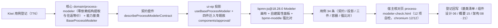

# 01 实施 · 流程建模器

> 前端组件库 · 08 交互类 · 08 审批流展示与流程建模器 · 嵌套子任务 02（需求 08-8）· 实施记录

[文档首页](../../../../../../../文档首页.md) › [08 交互类](../../../08_交互类.md) › [08 审批流展示与流程建模器](../../08_交互类_08_审批流展示与流程建模器.md) › 实施记录　|　[← 详细设计](../设计/01_详细设计_02_流程建模器.md)　[测试记录 →](../测试/01_测试_02_流程建模器.md)

## 1. 实施信息 

| 项 | 值 |
| --- | --- |
| 任务 | 08-8-2 流程建模器（[任务](../08_交互类_08_审批流展示与流程建模器_02_流程建模器.md)） |
| 对应需求 | [08-8](../../../../../需求/08_需求_交互类.md#r08-8) |
| 详细设计 | [01_详细设计_02_流程建模器.md](../设计/01_详细设计_02_流程建模器.md)（定稿提交 `a40089fa`） |
| 实施日期 | 2026-09-19 |
| 实施人 | minjian |
| 实施环境 | Ubuntu 开发机 · Node v24.20.0 / npm 11.19.0（npmmirror）· Vitest 5 / jsdom · Vue 3.5 / TypeScript 严格模式 · chromium headless（核对页核验） |
| Kiwi 用例 | 776（分类「平台骨架」/ P2 / CONFIRMED / 标签「自动化」） |
| 结论 | 完成标准达标（建模器可画、可导入导出 XML、校验并发布、分包生效、核对页 12/12） |

## 2. 实施概览 

结果小结：核心新增 1 份领域纯函数（**零外部依赖**）、1 个能力基类、1 套契约套件；插件新增 1 套投影与四件（两件迁入专题族 + 两件新增），接入 `bpmn-js@18.28.0` **Modeler** 与 `bpmn-moddle` 强比对；`ui-ep` 44 文件 / 543 用例全绿（本次新增 34 条）；核对页 12/12。

## 3. 实施过程 

1. **Kiwi 先行**：经容器内 Django shell 登记用例，取得编号 **776**；用例文件首行标注 `// kiwi_id: 776`。
2. **核心领域**（`core/src/domain/process-modeler.ts`）：**零依赖纯字符串** BPMN 子集结构提取（忽略命名空间前缀、容忍属性顺序与空白）、结构键与往返等价、结构校验五项（子集外元素 / 起止事件 / `id` 唯一 / 引用完整 / 孤立节点）、属性 schema 与读取（含 `bms:*` 扩展属性）与校验、校验结论合并、版本推进、内容派生幂等键（`wfd:{fnv1aHex}`）、错误码定位（60006 元素级 / 60007 定义级）。
3. **核心能力基类**（`core/src/capabilities/process-modeler.ts`）：键 `process-modeler`，依赖 `access` / `notice`；定义装载（空 XML 回落空流程模板、记脏基线）、XML 更新与导入（**两段确认**、校验通过才生效）、校验（结构 + 注入式引擎合并）、保存草稿与版本发布（内容派生幂等键、发布推进版本）、脏基线与撤销、只读判定、错误码定位与重试。
4. **契约套件**（`core/testing/process-modeler.ts`）：`describeProcessModelerContract`——占位零请求、装载与初始不脏、取定义、更新置脏与撤销、结构校验定位、导入两段式、XML 往返等价、校验来源切换与合并、幂等键、发布推进版本、未注入不请求、校验不通过阻断、只读与无权、错误码与重试、进行中重复提交。
5. **插件投影与件**（`ui-ep/src/composables/useBaseProcessModeler.ts` + `components/approval/`）：投影薄适配（`definition` 为 ref，`definitionKey` / `definitionName` / `version` 由其 computed 派生）；四件——`ProcessModeler`（容器：工具栏含撤销重做 / 缩放 / 导入导出 / 校验 / 保存发布 / 版本历史 / **重试**、三区装配、脏拦截、错误上屏与元素高亮）、`ProcessPalette`（BPMN 子集六类）、`ProcessProperties`（自建面板，条件表达式复用表达式编辑器）、`ProcessCanvas`（`bpmn-js` Modeler：事件订阅 / 命令栈 / 缩放平移 / 外部 XML 变更经结构等价比对去重）。
6. **类型声明与依赖**：`bpmn-moddle` 类型声明在插件与宿主 `env.d.ts` 各自补齐；`utils/bpmnRoundTrip.ts` 用其强比对（忽略命名空间前缀与属性顺序）。
7. **用例**：`ui-ep/tests/interaction-process-modeler.spec.ts`（34 条，含契约适配器 / 投影 / 三件 / 容器 / 强比对）；对 `bpmn-js` 画布创建入口下桩（jsdom 缺 SVG `getBBox`）。
8. **宿主核对页**：`apps/desktop/process-modeler-check.html` + `src/dev/{processModelerCheck.ts,ProcessModelerCheck.vue}`（12 项自检），`vite build` 不含；以 chromium headless `--dump-dom` 核验 **12/12**。

## 4. 问题与处置 

| # | 问题 | 处置 |
| --- | --- | --- |
| 1 | 核心 `BaseObject` 已有 `version` 字段，建模器若同名 getter 会冲突（TS2611），且核对页按 `modelerInstance.version` 读取取到的是**基类命名空间版本**而非流程版本 | 版本一律经 `definition.version` 读取；核对页断言改为 `definition.version`，并在设计中明确「版本经定义对象读取」 |
| 2 | 并发重复提交可穿透 `busy`：`submit()` 原先「先 `await validate`（异步）再判 `busy`」 | 改为**先占位（置提交中）再校验**；契约套件「进行中重复提交不动作」由**死锁超时**暴露该缺口，修正后通过 |
| 3 | 契约「结构校验定位」断言空数组：适配器未把 `validate()` 结论回写目标面 | 适配器改为读投影的 `validateResult` 响应式面（不再自持局部变量） |
| 4 | 契约「进行中重复提交」原先挂在「调板交互」用例里，语义错位 | 校准用例归属（进行中重复提交留在编排契约；调板用例只断言创建与上抛） |
| 5 | `bpmn-js` 在 jsdom 下抛 `getBBox is not a function` | 单测对画布创建入口下桩；真实画布与 XML 往返由核对页以 chromium 核验 |
| 6 | 核对页初版**缺重试入口**：核心有 `retry()` 但件层未接，发布失败后无法恢复 | 工具栏补 `data-test="retry"` 与 `runRetry()`（复用上次提交种类）；核对页第 ⑧ 项由失败转为通过 |
| 7 | 核对页属性面板断言依赖 `properties-selected` 文案（受控面归一后为元素标识） | 断言改为「元素标识 + 属性项存在」（`property-assigneeSource`） |
| 8 | 属性面板 `sequenceFlow` 无独立属性项（条件挂在排他网关侧） | 用例与文档口径统一为「排他网关出线条件 + 默认流」；`sequenceFlow` 名称由调板与画布承担 |

## 5. 验证结果 

| 命令 | 结果 |
| --- | --- |
| 根 `npm run check`（core + vue + ui-ep） | 54 + 2 + 44 文件 / 614 + 5 + 543 用例全绿（ui-ep 本次新增 34） |
| 宿主 `npx vue-tsc -b` / `npm run lint` | 通过 |
| 宿主 `npm run test:cov` | 通过（全库语句覆盖 86.79%、行覆盖 87.61%、35 用例） |
| 宿主 `npm run build` / `npm run budget` | 通过（合计 123.1 KB / 预算 260 KB；最大单文件 104.1 KB / 预算 150 KB） |
| 开发态核对页（chromium headless `--dump-dom`） | **12 / 12** 自检项通过（含 `bpmn-js` Modeler 真实画布出 `djs-container`） |

对照完成标准：建模器可画（Modeler 真实画布 + 调板 + 自建属性面板）、可导入导出 XML（结构校验 + 往返等价；强比对经 `bpmn-moddle`）、校验并发布（结构校验 + 引擎预解析合并 + 版本推进）、分包生效（首屏产物无 `bpmn-js` 命中）；`vue-tsc` / ESLint / Vitest 全通过。

## 6. 偏差与遗留 

- **工时偏差**：名义 16h；因新增 1 个能力基类、1 份领域纯函数（零依赖结构提取与往返等价）、1 套契约套件、四件组件、`bpmn-js` Modeler 接入与 12 项自检核对页，实际上浮，明细见第 4 节。
- **过程偏差**：本轮实施与两份详细设计的落档顺序倒置（先落码后补设计），已在本记录与设计文档如实登记；设计内容与实现一致，无未登记的隐性偏差。
- **往返比对落点**：核心包依赖面保持为空（护栏要求），故核心出**零依赖**结构提取与等价判定（端中立），`bpmn-moddle` 强比对只在插件层；两种口径结论一致（用例双向断言）。
- **真实接口联调**：定义取数 / 保存草稿 / 发布 / 引擎预解析均未就绪，处理函数由宿主注入；未注入即占位（不发请求）；真实联调随**阶段九**（工作流引擎）。
- **未实现**：定义列表与删除 / 下架（归通用表格与后端）；流程模板种子（产品仓库提供）；宿主「流程建模」路由页（归宿主布局任务）；移动端建模（设计节点明确不提供）。
- **jsdom 限制**：同 `08-8-1`，真实画布渲染由核对页核验。

> 本文档依《[文档生成规范](../../../../../../../规范/文档生成规范.md)》编写
