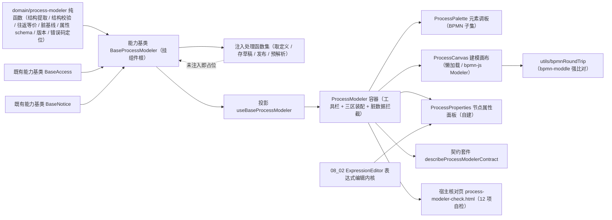

# 01 详细设计 · 流程建模器

> 前端组件库 · 08 交互类 · 08 审批流展示与流程建模器 · 嵌套子任务 02（需求 08-8）· 详细设计

[文档首页](../../../../../../../文档首页.md) › [08 交互类](../../../08_交互类.md) › [08 审批流展示与流程建模器](../../08_交互类_08_审批流展示与流程建模器.md) › 详细设计　|　[← 任务](../08_交互类_08_审批流展示与流程建模器_02_流程建模器.md)

## 1. 设计目标与范围 <a id="goal"></a>

交付[需求 08-8](../../../../../需求/08_需求_交互类.md#r08-8) 的**流程建模器**：bpmn-js Modeler 拖拽建模画布、元素调板（BPMN 子集）、自建节点属性面板（审批人来源 / 会签或签 / 条件表达式 / 超时 / 通知）、XML 导入导出（**往返语义等价**）、结构校验与引擎预解析、保存草稿与版本发布、版本历史只读载入，以及建模状态语义（选中联动、脏基线、只读判定、失败定位）。

- **领域入核心**：新增 `domain/process-modeler.ts` —— BPMN 子集结构提取（**零依赖**：元素 / 连线 / 扩展属性，纯字符串解析）、结构校验（起止事件 / 连通性 / 孤立节点 / 子集合规 / 重复 id）、**往返等价判定**、脏基线（结构键）、属性 schema（按元素类型给出可配属性、枚举与默认值）、条件表达式载体与校验接入、版本推进与错误码定位，全部为框架无关纯函数。
- **编排入链**：新增能力基类 `BaseProcessModeler`（核心 `capabilities/process-modeler.ts`，挂组件根），承载阶段机、定义装载、导入 / 导出、校验（前端结构 + 注入式引擎预解析）、保存草稿与发布（内容派生幂等键）、脏基线与只读判定。
- **数据通路注入式**：`loadDefinition` / `saveDraft` / `deploy` / `validate` 由宿主注入；**未注入即占位**（不发请求、返回 `undefined`、写占位文案）；真实工作流接口与引擎预解析联调随**阶段九**。
- **契约套件**：`describeProcessModelerContract` 一套（`@bms/core/testing`），端中立。
- **画布**：真实接入 **bpmn-js Modeler 18.28.0**（与 `08-8-1` 只读图**共用同一依赖与 bpmn 分包**、懒加载不进首屏）；属性面板自建（不引 `bpmn-js-properties-panel`）。
- **对外契约**：`08_01_01` 冻结的 `ProcessModeler` / `ProcessCanvas` 契约按真实实现调整，并同步回写 `08_01_01` 详细设计与既有冻结用例。

### 1.1 口径与依从 <a id="positioning"></a>

- **架构铁律**：建模编排为**横切功能**，一律落为**继承链上的能力基类**（核心 `capabilities/`），不在链外自由挂接；具体件只做渲染与 bpmn-js 适配。
- **继承链**：`BaseComponent`（组件根）→ 能力基类 `BaseProcessModeler` → 具体件；件内经 `useBaseProcessModeler` 投影挂链。
- **占位口径**：`ready !== true` → `degraded` / `disabled` 为真、取数与提交**零请求**；`readOnly` 为真（历史版本 / 无 `wf:define`）→ 画布与调板禁用、仍可导出。
- **BPMN 子集口径**（决策）：仅提供开始 / 结束事件、用户任务、排他 / 并行网关、顺序流（对齐工作流引擎可解析范围）；服务任务 / 脚本任务等高级元素不提供，调板与校验据此限制。
- **属性写回口径**（决策）：**写**经件层 bpmn-js `modeling.updateProperties`（保持模型一致）；**读**由核心零依赖字符串提取（供校验、往返与用例断言）；核心提供属性 schema（可配项、枚举、默认值、必填）。
- **往返口径**（决策）：核心出零依赖结构等价判定（`equivalentBpmnStructure`）用于契约套件与前端校验；件层 `utils/bpmnRoundTrip.ts` 用 `bpmn-moddle`（随 bpmn-js 带入）做**强比对**（忽略命名空间前缀与属性顺序）。
- **幂等口径**：保存草稿与发布各带内容派生幂等键（`wfd:{fnv1aHex}` = 定义标识 + 版本 + 结构键），同内容同键、内容变更换键。
- **错误码口径**：60006（BPMN 非法 / 引擎解析失败）→ 定位到元素并在画布高亮；60007（定义被引用不可删除）→ 定义级提示；文案走 i18n `error.600xx`。
- **端范围**：**仅 PC**（`frontend/packages/ui-ep`）；移动端不提供建模（组件设计第 12 节明确）。
- **阶段归属**：阶段四内交付；真实接口与引擎预解析联调归口**阶段九**。
- **工时**：本嵌套子任务 16h；因新增 1 个能力基类、1 份领域纯函数、1 套契约套件、四件组件（含 bpmn-js 真实接入）与 12 项核对页，实际上浮在实施记录登记。

## 2. 交付物清单 <a id="deliver"></a>

| # | 交付物 | 落点 |
| --- | --- | --- |
| 1 | 流程建模领域纯函数与数据模型 | `core/src/domain/process-modeler.ts` |
| 2 | 建模器编排能力基类 | `core/src/capabilities/process-modeler.ts` |
| 3 | 能力依赖登记（新增 `process-modeler` 键） | `core/src/capabilities/manifest.ts` |
| 4 | 核心导出面登记 | `core/src/index.ts` |
| 5 | 契约套件（建模器编排） | `core/testing/process-modeler.ts` + `core/testing/index.ts` |
| 6 | 核心用例（领域 / 编排） | `core/tests/domain-process-modeler.spec.ts`、`core/tests/process-modeler.spec.ts` |
| 7 | 建模器投影（新增） | `ui-ep/src/composables/useBaseProcessModeler.ts` |
| 8 | 建模器容器件（迁移 + 真实实现） | `ui-ep/src/components/approval/ProcessModeler.vue` |
| 9 | 建模画布件（迁移 + 真实实现，懒加载） | `ui-ep/src/components/approval/ProcessCanvas.vue` |
| 10 | 元素调板件（新增） | `ui-ep/src/components/approval/ProcessPalette.vue` |
| 11 | 节点属性面板件（新增） | `ui-ep/src/components/approval/ProcessProperties.vue` |
| 12 | 件层工具（bpmn-js 适配 / 强比对） | `ui-ep/src/utils/bpmnCanvas.ts`、`ui-ep/src/utils/bpmnRoundTrip.ts` |
| 13 | 导出面登记（含旧路径移除与分包口径） | `ui-ep/src/index.ts` |
| 14 | 用例 | `ui-ep/tests/interaction-process-modeler.spec.ts` |
| 15 | 宿主核对页（`vite build` 不含） | `apps/desktop/process-modeler-check.html`、`apps/desktop/src/dev/{processModelerCheck.ts,ProcessModelerCheck.vue}` |
| 16 | 登记回写 | 见第 6 节 |



## 3. 接口 / 契约与边界 <a id="contract"></a>

### 3.1 核心：`domain/process-modeler.ts`（新增纯函数与数据模型） <a id="domain"></a>

```ts
/** BPMN 子集元素类型。 */
export type ModelerElementType =
  | 'startEvent'
  | 'endEvent'
  | 'userTask'
  | 'exclusiveGateway'
  | 'parallelGateway'
  | 'sequenceFlow'
/** 建模阶段。 */
export type ModelerPhase = 'idle' | 'loading' | 'saving' | 'deploying' | 'validating' | 'done' | 'failed'
/** 校验结果来源。 */
export type ModelerValidateSource = 'structure' | 'engine'
/** 用户任务审批人来源。 */
export type ModelerAssigneeSource =
  | 'subject-chain'
  | 'user'
  | 'dept'
  | 'initiator-manager'
  | 'form-field'
/** 多人规则。 */
export type ModelerMultiRule = 'any' | 'all'
/** 属性控件的取值形态。 */
export type ModelerPropertyKind = 'text' | 'select' | 'number' | 'switch' | 'expression'

/** 建模元素（运行态）。 */
export interface ModelerElement {
  id: string
  type: ModelerElementType
  name?: string
}
/** 顺序流（运行态）。 */
export interface ModelerFlow {
  id: string
  sourceRef: string
  targetRef: string
  name?: string
  condition?: string
  default?: boolean
}
/** BPMN 结构（零依赖提取结果）。 */
export interface BpmnStructure {
  elements: ModelerElement[]
  flows: ModelerFlow[]
}
/** 校验错误。 */
export interface ModelerValidateError { elementId?: string; message: string }
/** 校验结果。 */
export interface ModelerValidateResult { valid: boolean; errors: ModelerValidateError[]; source: ModelerValidateSource }
/** 节点属性值集合。 */
export interface ModelerElementProperties {
  name?: string
  assigneeSource?: ModelerAssigneeSource
  assigneeValue?: string
  multiRule?: ModelerMultiRule
  timeoutValue?: number
  timeoutUnit?: 'day' | 'hour'
  notify?: boolean
  condition?: string
  defaultFlow?: boolean
}
/** 属性项 schema（面板渲染依据）。 */
export interface ModelerPropertyItem {
  key: keyof ModelerElementProperties
  label: string
  kind: ModelerPropertyKind
  /** 适用元素类型。 */
  appliesTo: ModelerElementType[]
  options?: { value: string; label: string }[]
  required?: boolean
  placeholder?: string
}
/** 定义（装载输入）。 */
export interface ModelerDefinitionInput {
  definitionKey?: string
  name?: string
  version?: number
  xml?: string
  status?: 'draft' | 'published'
}
/** 定义（运行态）。 */
export interface ModelerDefinition {
  definitionKey: string
  name: string
  version: number
  xml: string
  status: 'draft' | 'published'
}
/** 提交结果。 */
export interface ModelerSubmitResult { version?: number; definitionKey?: string; message?: string }
/** 错误码 → 定位处置。 */
export interface ModelerErrorTarget { code: number; elementId?: string; i18nKey: string; refresh: boolean }

/** 权限码（定义与版本管理）。 */
export const MODELER_DEFINE_PERM = 'wf:define'
/** 占位文案。 */
export const MODELER_PLACEHOLDER_TEXT = '流程建模器未就绪（占位）'
/** BPMN 子集元素类型清单（调板顺序）。 */
export const MODELER_SUBSET: readonly ModelerElementType[]
/** 空流程模板 XML。 */
export const MODELER_BLANK_XML: string
/** 导入覆盖需确认的提示文案。 */
export const MODELER_IMPORT_CONFIRM_TEXT = '导入将覆盖当前画布内容，是否继续？'
/** 属性面板 schema。 */
export const MODELER_PROPERTIES: readonly ModelerPropertyItem[]
/** 错误码 → 定位映射表。 */
export const MODELER_ERROR_TARGETS: Readonly<Record<number, { i18nKey: string; refresh: boolean }>>

extractBpmnStructure(xml: string): BpmnStructure
structureKey(structure: BpmnStructure): string
equivalentBpmnStructure(left: string, right: string): boolean
isSubsetElement(type: string): boolean
validateBpmnStructure(xml: string): ModelerValidateResult
mergeValidateResults(structure: ModelerValidateResult, engine?: ModelerValidateResult): ModelerValidateResult
elementTypeOf(xml: string, elementId: string): ModelerElementType | undefined
readElementProperties(xml: string, elementId: string): ModelerElementProperties
propertiesFor(type: ModelerElementType | undefined): ModelerPropertyItem[]
validateProperties(type: ModelerElementType | undefined, values: ModelerElementProperties): ModelerValidateResult
nextVersion(version: number): number
normalizeDefinition(input?: ModelerDefinitionInput): ModelerDefinition
deriveModelerKey(definitionKey: string, version: number, structure: BpmnStructure): string
resolveModelerErrorCode(error: unknown): number | undefined
resolveModelerErrorTarget(code: number | undefined, structure?: BpmnStructure): ModelerErrorTarget | undefined
```

| 行为 | 口径 |
| --- | --- |
| 结构提取 | **零依赖**纯字符串解析（限定 BPMN 子集标签）：产出 `elements`（id / type / name）与 `flows`（id / `sourceRef` / `targetRef` / name / condition / default）；元素与流按 id 排序，保证同结构同结果 |
| 结构键 | `structureKey` = `stableStringify(结构)`：与 XML 命名空间前缀、属性顺序、空白无关 —— **脏基线**与**往返等价**共用 |
| 往返等价 | `equivalentBpmnStructure(a, b)`：两份 XML 的结构键相等即等价（语义等价；忽略格式化差异） |
| 子集判定 | `isSubsetElement`：仅子集六类为真；其余（`serviceTask` / `scriptTask` / `manualTask` 等）为假，校验时按「不支持的元素类型」报错 |
| 结构校验 | `validateBpmnStructure` 依次检查：① 至少一个 `startEvent` 与一个 `endEvent`；② 元素 id 与流 id 全局唯一；③ 引用完整（`sourceRef` / `targetRef` 指向已存在元素）；④ **无孤立节点**（除开始事件外均须有入边，除结束事件外均须有出边）；⑤ 元素类型在 BPMN 子集内；错误逐条带 `elementId`（可定位则带） |
| 校验合并 | `mergeValidateResults`：前端结构校验与注入式引擎预解析结果**合并**（任一不通过即不通过，`source` 为 `engine` 表示含引擎结论） |
| 属性读取 | `readElementProperties`：从元素的扩展属性 / 标准属性字符串提取属性集合（用户任务：审批人来源与取值 / 多人规则 / 超时与单位 / 通知；网关出线：条件与默认流）；缺省不出现 `undefined`（未配置项省略） |
| 属性 schema | `propertiesFor(type)`：按元素类型给出可配项（用户任务 → 名称 / 审批人来源 / 审批人取值 / 多人规则 / 超时 / 通知；排他网关出线 → 条件 / 默认流；流程级 → 定义标识 / 名称）；`MODELER_PROPERTIES` 为全量表 |
| 属性校验 | `validateProperties`：审批人来源为 `subject-chain` 时取值必填（主体链标识）、为 `user` / `dept` / `form-field` 时取值必填；多人规则取值在枚举内；超时为正数；条件表达式非空（非默认流时）；返回不通过时带定位 |
| 版本推进 | `nextVersion`：`version + 1`（下界 1） |
| 定义归一 | `normalizeDefinition`：`definitionKey` / `name` / `xml` 缺省空串、`version` 缺省 0、`status` 缺省 `draft`；`xml` 为空时回落 `MODELER_BLANK_XML` |
| 幂等键 | `deriveModelerKey` = `wfd:{fnv1aHex(definitionKey + ':' + version + ':' + structureKey)}`：同内容同键、内容变更换键 |
| 错误码定位 | `resolveModelerErrorCode` 取数值 `code`；`resolveModelerErrorTarget`：60006 → 若错误对象带 `elementId`（后端返回）则定位该元素、否则不定位（画布整体提示）；60007 → 定义级提示（`refresh: true`） |
| 纯数据 | 不触 DOM、不依赖 bpmn-js / bpmn-moddle；同输入同输出 |

### 3.2 核心：能力基类 `BaseProcessModeler`（新增） <a id="base"></a>

```ts
/** 取定义处理函数（未注入即占位）。 */
export type ModelerLoadHandler = (
  input: { definitionKey: string; version?: number },
) => Promise<ModelerDefinitionInput | undefined>
/** 保存草稿处理函数（未注入即占位）。 */
export type ModelerSaveHandler = (input: {
  definitionKey: string
  name: string
  xml: string
  version: number
  idempotencyKey: string
}) => Promise<ModelerSubmitResult | undefined>
/** 发布处理函数（未注入即占位）。 */
export type ModelerDeployHandler = (input: {
  definitionKey: string
  xml: string
  version: number
  idempotencyKey: string
}) => Promise<ModelerSubmitResult | undefined>
/** 引擎预解析处理函数（未注入即跳过引擎段）。 */
export type ModelerValidateHandler = (input: { xml: string }) => Promise<ModelerValidateResult | undefined>
/** 注入的处理函数集。 */
export interface ModelerJobs {
  loadDefinition?: ModelerLoadHandler
  saveDraft?: ModelerSaveHandler
  deploy?: ModelerDeployHandler
  validate?: ModelerValidateHandler
}

/** 建模器编排能力基类（抽象）。 */
export abstract class BaseProcessModeler extends BaseComponent {
  readonly identifier: string = 'process-modeler'
  override readonly depends: readonly string[]   // ['access', 'notice']
  definition: ModelerDefinition
  ready: boolean
  override disabled: boolean
  readOnly: boolean
  requestCount: number
  phase: ModelerPhase
  dirtyValue: boolean
  selectedId: string
  selected: ModelerElement | undefined
  lastResult: ModelerSubmitResult | undefined
  errorMessage: string
  errorTarget: ModelerErrorTarget | undefined
  importPending: string       // 待确认覆盖的导入 XML（空串表示无）
  validateResult: ModelerValidateResult | undefined
  access: BaseAccess | undefined
  notice: BaseNotice | undefined
  jobs: ModelerJobs

  get degraded(): boolean
  get busy(): boolean
  get dirty(): boolean
  get canEdit(): boolean                    // 就绪 ∧ 非只读 ∧ 有权
  get canDeploy(): boolean
  get structure(): BpmnStructure
  get xml(): string
  get nextVersion(): number
  get loadReady(): boolean

  setReady(value: boolean): void
  setJobs(jobs: ModelerJobs): void
  setAccess(access: BaseAccess | undefined): void
  setNotice(notice: BaseNotice | undefined): void
  setReadOnly(value: boolean): void
  applyDefinition(input?: ModelerDefinitionInput): void
  load(definitionKey?: string, version?: number): Promise<boolean>
  updateXml(xml: string): void
  importXml(xml: string): boolean
  requestImport(xml: string): boolean
  confirmImport(): boolean
  cancelImport(): void
  exportXml(): string
  select(elementId?: string): ModelerElement | undefined
  validate(options?: { engine?: boolean }): Promise<ModelerValidateResult>
  saveDraft(): Promise<ModelerSubmitResult | undefined>
  deploy(): Promise<ModelerSubmitResult | undefined>
  retry(): Promise<ModelerSubmitResult | undefined>
  idempotencyKey(kind: 'draft' | 'deploy'): string
  discard(): void
  reset(): void
}
```

| 行为 | 口径 |
| --- | --- |
| 挂链 | `BaseComponent`（组件根）→ 能力基类 `BaseProcessModeler`；依赖登记 `process-modeler: ['access', 'notice']` |
| 装载 | `applyDefinition` 归一装载（`xml` 空则回落空流程模板）、以**结构键**记脏基线并清脏、清选中与校验结果 |
| 取定义 | `load()` 仅在 `ready` 且已注入 `loadDefinition` 时发请求（`requestCount + 1`、阶段 `loading`）；未就绪 / 未注入**不发请求**、返回 `false`；失败置 `failed` 并写错误码定位 |
| XML 变更 | `updateXml` 整体替换当前 XML（件层画布变更回传入口）；`importXml` 直接导入（结构校验通过才生效，返回是否生效）；`requestImport` 置 `importPending`（待件层二次确认）后由 `confirmImport` 生效 |
| 导出 | `exportXml()` 返回当前 XML（只读态同样可用） |
| 选中 | `select(elementId)` 设置选中元素并返回运行态元素（未命中或 `elementId` 为空则清空选中） |
| 校验 | `validate()` 先跑**前端结构校验**（`validateBpmnStructure`），引擎预解析仅在注入 `validate` 处理函数时追加调用（`requestCount + 1`）；未注入即只出结构结论（`source = 'structure'`）；结果写 `validateResult`，不通过时置 `phase = 'failed'` 与错误定位 |
| 保存草稿 | `saveDraft()` 需「`ready` ∧ 非只读 ∧ 有权 ∧ 结构校验通过」；未注入处理函数 → 占位（不请求 + 占位文案 + 返回 `undefined`）；进行中重复调用不动作；成功后**基线前移**（当前结构键即新基线）并置 `dirty = false` |
| 发布 | `deploy()` 同保存前置；发布成功后版本推进（`lastResult.version ?? nextVersion`）、基线前移；错误码 60006 定位元素、60007 定义级提示并刷新 |
| 编辑权控 | `canEdit` = 就绪 ∧ 非只读 ∧ 无权判定（无 `wf:define` 时不可编辑）；`readOnly` 为真（历史版本 / 无权限）时画布与调板禁用、导出仍可用 |
| 占位语义 | `ready === false` → `degraded` / `disabled` 为真、取数与提交**零请求**（`requestCount` 恒 0），保持 `08_01_01` 冻结口径 |
| 撤销 | `discard()` 用**当前定义 XML** 覆盖工作 XML（从基线回滚）并清脏；`reset()` 只把阶段回 `idle` 并清错误（保留数据） |
| 释放 | 状态变更经生命周期 `update` 通知；释放后不再通知（`isDisposed` 守卫） |
| 纯数据 | 不触 DOM、不依赖 bpmn-js；**画布与命令栈（撤销重做）归件层**，核心只持有 XML 与结构结论 |

- 不含画布渲染、拖拽与命令栈语义（归件层 bpmn-js）；不含引擎执行与定义持久化（归后端）。

### 3.3 契约套件（`@bms/core/testing`） <a id="testing"></a>

| 套件 | 契约面（结构化接口） | 断言要点 |
| --- | --- | --- |
| `describeProcessModelerContract(name, create)` | `ready` / `degraded` / `disabled` / `readOnly` / `requestCount` / `phase` / `definitionKey` / `version` / `xml()` / `structure()` / `dirty` / `selectedId` / `setReady` / `setReadOnly` / `setHandlers` / `setAccess` / `load` / `applyDefinition` / `updateXml` / `importXml` / `exportXml` / `select` / `validate` / `validateSource()` / `validateErrors()` / `saveDraft` / `deploy` / `retry` / `idempotencyKey(kind)` / `errorTargetElement()` / `discard` | 占位零请求与就绪不变占位；定义装载（XML 空回落模板、基线记脏为假）；`updateXml` 置脏、`discard` 回滚清脏；**结构校验**（缺起止事件 / 孤立节点 / 重复 id / 非子集元素各报一条并带定位）；`mergeValidateResults` 引擎段未注入时 `source = structure`；**XML 往返语义等价**（`importXml` 后 `exportXml` 结构等价）；导入覆盖需 `requestImport` + `confirmImport` 两段；`select` 命中与清空；**保存草稿与发布幂等键同内容同键、内容变更换键**；未注入处理函数不请求且保留本地；进行中重复调用不动作；就绪且未注入取数时零请求；只读态不可保存 / 发布、导出仍可用；无权（无 `wf:define`）不可编辑；60006 定位元素、60007 定义级提示并可重试 |

- 目标约定：定义 `leave`（`version = 2`，XML 为含 `startEvent s1 → userTask t1 → endEvent e1` 的最小合法流程）；引擎预解析处理函数初始未注入；权限上下文含 `wf:define`。
- 套件端中立：`ui-ep`（投影适配）消费；移动端不提供建模，套件仍保留端中立口径。

### 3.4 投影与件（`ui-ep`） <a id="bindings"></a>

#### 3.4.1 投影 `useBaseProcessModeler` <a id="binding"></a>

```ts
export interface UseBaseProcessModelerOptions {
  ready?: boolean
  definitionKey?: string
  version?: number
  xml?: string
  readOnly?: boolean
  jobs?: ModelerJobs
  access?: BaseAccess
  notice?: BaseNotice
}
export interface UseBaseProcessModelerResult {
  modeler: BaseProcessModeler
  ready: Ref<boolean>
  degraded: Ref<boolean>
  disabled: Ref<boolean>
  readOnly: Ref<boolean>
  phase: Ref<ModelerPhase>
  definitionKey: Ref<string>
  version: Ref<number>
  xml: Ref<string>
  dirty: Ref<boolean>
  canEdit: Ref<boolean>
  canDeploy: Ref<boolean>
  selected: Ref<ModelerElement | undefined>
  validateResult: Ref<ModelerValidateResult | undefined>
  errorMessage: Ref<string>
  errorTarget: Ref<ModelerErrorTarget | undefined>
  requestCount: Ref<number>
  structure: () => BpmnStructure
  setReady: (value: boolean) => void
  setReadOnly: (value: boolean) => void
  setJobs: (jobs: ModelerJobs) => void
  setAccess: (access?: BaseAccess) => void
  setNotice: (notice?: BaseNotice) => void
  applyDefinition: (input?: ModelerDefinitionInput) => void
  load: (definitionKey?: string, version?: number) => Promise<boolean>
  updateXml: (xml: string) => void
  importXml: (xml: string) => boolean
  requestImport: (xml: string) => boolean
  confirmImport: () => boolean
  cancelImport: () => void
  exportXml: () => string
  select: (elementId?: string) => ModelerElement | undefined
  validate: (options?: { engine?: boolean }) => Promise<ModelerValidateResult>
  saveDraft: () => Promise<ModelerSubmitResult | undefined>
  deploy: () => Promise<ModelerSubmitResult | undefined>
  retry: () => Promise<ModelerSubmitResult | undefined>
  idempotencyKey: (kind: 'draft' | 'deploy') => string
  discard: () => void
  reset: () => void
}
```

- 薄适配（核心实例 ↔ Vue 响应式），不含判定逻辑；基类实例经 `markRaw(toRaw(...))` 隔离跨实例代理，`onScopeDispose` 解除生命周期订阅。

#### 3.4.2 `ProcessModeler` 容器件契约 <a id="container"></a>

| 面 | 内容 |
| --- | --- |
| 数据面（既有，保留） | `ready`（缺省 `false`）/ `definitionKey` / `version` / `xml` / `readOnly` / `loading` / `dirty` / `degradeText`（缺省 `'流程建模器未就绪（占位）'`） |
| 数据面（新增可选） | `jobs` / `access` / `notice` / `autoLoad`（缺省 `true`）/ `historyVersions`（版本历史清单，`{ version, status, createdAt }[]`）/ `expressionTokens`（条件表达式令牌，透传属性面板）/ `expressionTemplates` |
| 事件（既有，保留） | `update:xml` / `change` / `save-draft` / `deploy` / `validate` / `import` / `export` / `add-element` / `select` |
| 事件（新增） | `loaded`（`{ definitionKey, version }`）/ `drafted`（`ModelerSubmitResult`）/ `deployed`（`ModelerSubmitResult`）/ `failed`（`{ message, code?, elementId? }`）/ `history-load`（`version`）/ `undo` / `redo` |
| 插槽（既有） | `degrade` / `empty` / `live` / `toolbar` / `palette` / `properties` |
| 插槽（新增） | `canvas` / `history`（版本历史区） |
| 数据标记（保留） | `data-ready` / `data-degraded` / `data-test="placeholder"` / `data-test="toolbar"` / `data-test="definition-key"` / `data-test="import"` / `data-test="export"` / `data-test="validate"` / `data-test="save-draft"` / `data-test="deploy"` / `data-test="dirty"` / `data-test="palette"` / `data-test="palette-{type}"` / `data-test="canvas"` / `data-test="properties"` / `data-test="properties-selected"` / `data-test="properties-empty"` |
| 数据标记（新增） | `data-test="undo"` / `data-test="redo"` / `data-test="zoom-in"` / `data-test="zoom-out"` / `data-test="zoom-reset"` / `data-test="validation-errors"` / `data-test="validate-error-{elementId}"` / `data-test="import-confirm"` / `data-test="history"` / `data-test="history-{version}"` / `data-test="readonly-tip"` / `data-test="process-canvas"`（`data-subpackage="bpmn"`） |

| 行为 | 口径 |
| --- | --- |
| 占位 | `ready` 为假 → 降级（`data-degraded="true"` + 占位文案 + 工具栏与三区不渲染），**零请求** |
| 就绪 | 渲染工具栏 + 三区（调板 / 画布 / 属性面板）；`autoLoad` 为真且 `definitionKey` 非空时挂载调 `load()` |
| 工具栏 | 新建（`definitionKey` + 名称输入）→ 打开（`load`）→ 导入 XML（二次确认）→ 导出 XML → 校验 → 保存草稿 → 发布版本（主按钮）→ 版本历史（只读载入）；只读态禁用编辑类按钮、保留导出 |
| 事件与注入双轨 | 点击工具栏**一律先上抛既有事件**（`save-draft` / `deploy` / `validate` / `import` / `export`）；**仅当注入 `jobs`** 时才由内核驱动真实编排（避免宿主两种用法重复执行）；文档写明「二选一」 |
| 画布 | `ProcessCanvas` 经 `defineAsyncComponent(() => import('./ProcessCanvas.vue'))` 懒加载（`data-subpackage="bpmn"`）；画布变更回传 XML → `updateXml` + 上抛 `update:xml` / `change`；选中联动属性面板；撤销重做与缩放平移由画布工具条承载（件层命令栈） |
| 拖拽建模 | 调板项点击 / 拖拽 → 画布创建元素（`modeling.createShape` / `appendShape`）并选中；连线用 `modeling.createConnection`；只读态禁用 |
| 属性写回 | 属性面板变更 → 画布 `modeling.updateProperties`（保持模型一致）→ 回传新 XML；条件表达式经 `08_02` 的 `ExpressionEditor` 编辑内核（透传令牌与模板），保存前强制校验非空（非默认流） |
| 校验与定位 | 校验不通过 → 错误清单上屏（`validation-errors`），带 `elementId` 的错误定位并在画布高亮 + 滚动居中；无定位则整体提示 |
| 导入覆盖 | 导入先经 `requestImport` 置待确认，件层 `useConfirm` 二次确认后 `confirmImport` 生效；取消保持原画布 |
| 脏数据拦截 | 切版本 / 打开其他定义 / 离开前若 `dirty` 为真 → 二次确认（`useConfirm`）；确认后 `discard()` 放行 |
| 发布 | 发布前置校验（结构 + 引擎预解析，注入时）通过才提交；成功后版本推进 + 上抛 `deployed` + 提示；60007 定义级提示 |
| 版本历史 | `historyVersions` 非空时展示历史清单；点击历史版本 → `readOnly` 只读载入画布 + 上抛 `history-load` |
| 卸载 | 画布件在卸载时调 `bpmnModeler.destroy()`（bpmn-js 无官方 Vue 封装，须手动释放），并释放投影订阅 |

#### 3.4.3 `ProcessCanvas` 建模画布件契约 <a id="canvas"></a>

| 面 | 内容 |
| --- | --- |
| 数据面 | `xml`（受控）/ `readOnly` / `selectedId` / `zoom`（缺省 1） |
| 事件 | `update:xml` / `change`（`xml`）/ `select`（`{ id, type, name? } \| null`）/ `ready`（画布就绪）/ `error`（`{ reason }`）/ `undo-state`（`{ canUndo, canRedo }`） |
| 方法（`defineExpose`） | `createElement(type)` / `undo()` / `redo()` / `zoomBy(delta)` / `zoomTo(value)` / `fitViewport()` / `highlight(elementId?)` / `destroy()` |
| 数据标记 | `data-test="process-canvas"` + `data-subpackage="bpmn"` + `data-readonly` + `data-state`（`loading` / `ready` / `empty` / `error`） |
| 行为 | 挂载动态 `import('bpmn-js/lib/Modeler')` 并 `importXML`；挂载 bpmn-js 事件（`selection.changed` → `select`；`commandStack.changed` → 取 `saveXML()` → 上抛 `update:xml` / `change`）；`readOnly` 为真时禁用拖拽编辑（`modeling` 与调板入口禁用）但保留缩放平移；`xml` 受控变更时**按结构比较**（`equivalentBpmnStructure`）决定是否重新 `importXML`，避免自触发循环；导入 / 解析失败 → 上抛 `error` 并置 `data-state="error"`（件层降级提示） |

#### 3.4.4 `ProcessPalette` 元素调板件契约 <a id="palette"></a>

| 面 | 内容 |
| --- | --- |
| 数据面 | `elements`（缺省 `MODELER_SUBSET`）/ `disabled` / `draggable`（缺省 `true`） |
| 事件 | `add`（`ModelerElementType`）/ `drag-start`（`ModelerElementType`） |
| 数据标记 | `data-test="process-palette"` / `data-test="palette-{type}"` |
| 行为 | 仅列 BPMN 子集六类（对齐引擎可解析范围）；点击或拖出即创建；`disabled` 为真（占位或只读）时全部禁用 |

#### 3.4.5 `ProcessProperties` 节点属性面板件契约 <a id="properties"></a>

| 面 | 内容 |
| --- | --- |
| 数据面 | `properties`（当前属性值）/ `schema`（缺省按元素类型取自 `propertiesFor`）/ `selectedType` / `selectedId` / `readOnly` / `expressionTokens` / `expressionTemplates` / `errors`（`ModelerValidateError[]`） |
| 事件 | `update:properties`（整体）/ `property-change`（`{ key, value }`）/ `validate`（`ModelerValidateResult`） |
| 插槽 | `#empty`（未选中）/ `#extra` |
| 数据标记 | `data-test="process-properties"` / `data-test="properties-selected"` / `data-test="properties-empty"` / `data-test="property-{key}"` / `data-test="property-error-{key}"` / `data-test="condition-editor"` |
| 行为 | 未选中时展示流程级属性（`definition_key` / 名称），选中时按元素类型渲染可配项（用户任务：名称 / 审批人来源 / 审批人取值 / 多人规则 / 超时与单位 / 通知；网关出线：条件与默认流）；条件表达式复用 `08_02` 的 `ExpressionEditor`；必填与枚举校验即时（`validateProperties`），不通过内联报错；`readOnly` 为真时全部只读 |

### 3.5 分包入口与件层工具 <a id="chunk"></a>

| 项 | 设计 |
| --- | --- |
| 分包入口 | `ProcessCanvas.vue` 由 `ProcessModeler` 经 `defineAsyncComponent` 懒加载，**与 `08-8-1` 只读图共用同一 bpmn-js 依赖与 bpmn 分包**；`data-subpackage="bpmn"` 不变；**不入根出口静态导出**（否则动态导入无法分包） |
| 依赖落层 | `bpmn-js@18.28.0`（pin，与 `08-8-1` 同一次安装）声明在 `frontend/packages/ui-ep` 的 `dependencies`；经 npmmirror 安装并锁入 `package-lock.json`；**不引** `bpmn-js-properties-panel` |
| 样式 | 引 `bpmn-js/dist/assets/diagram-js.css` 与 `bpmn-js/dist/assets/bpmn-js.css`（BPMN 字体资源随包），样式限定在画布独立容器内（防全局污染） |
| 工具 1 | `ui-ep/src/utils/bpmnCanvas.ts`：bpmn-js 引用、创建 / 销毁、事件订阅与解绑、命令栈包装、缩放与定位封装（**第三方库单一落点**） |
| 工具 2 | `ui-ep/src/utils/bpmnRoundTrip.ts`：`bpmn-moddle` **强比对**（解析为元素 / 连线结构集合后比对，忽略命名空间前缀与属性顺序）；供「XML 往返一致」实测与两份核对页复用 |

## 4. 失败分支与边界 <a id="edge"></a>

| 边界 / 失败场景 | 处置 |
| --- | --- |
| 数据通路未就绪（`ready` 为假） | 占位：降级提示 + 画布与调板禁用 + 取数与提交零请求 |
| 处理函数未注入 | 占位：不请求、返回 `undefined`、写占位文案；件层据 `canDeploy` / 处理函数注入状态禁用入口 |
| 缺开始或结束事件 | 结构校验不通过 + 定位（无定位则整体提示）+ 保存 / 发布阻断 |
| 孤立节点（无入边或出边） | 同上，逐条带 `elementId` |
| 重复 id | 同上 |
| 非 BPMN 子集元素 | 同上（「不支持的元素类型」） |
| 引用缺失（`sourceRef` / `targetRef` 悬空） | 同上 |
| 引擎预解析失败（60006） | 后端错误码 → 件层定位元素并高亮；保留画布内容、可修正后重试 |
| 定义被引用不可删除（60007） | 定义级提示（`refresh: true`）；不删除 |
| XML 解析失败（导入） | 不覆盖当前画布、置失败文案、`data-state="error"` |
| 导入覆盖未确认 | 保持原画布（`cancelImport`）；已确认则结构校验通过后生效 |
| bpmn-js 依赖加载失败 | 画布件上抛 `error` → 容器降级提示（不白屏）；「导出 XML」仍可用 |
| 画布渲染失败 / 卸载未释放 | 件层卸载调 `destroy()`；工具封装保证幂等释放 |
| 只读态（历史版本 / 无 `wf:define`） | 画布与调板禁用编辑与拖拽、属性面板只读；导出与缩放平移可用 |
| 属性必填缺失（审批人取值 / 条件表达式） | 属性面板内联报错 + 保存 / 发布前整体校验阻断 |
| 超时非正数 | 内联报错（正数校验） |
| 多人规则非枚举值 | 内联报错 |
| 脏数据未保存时切版本 / 打开其他定义 / 离开 | 二次确认（`useConfirm`）；取消则保持原状态 |
| 进行中重复点击保存 / 发布 | 不动作（核心 `busy` 拦截）+ 按钮加载态禁用 |
| 保存 / 发布失败（网络 / 服务错误） | `phase = 'failed'` + 文案；**保留画布与本地变更**；`retry()` 复用同一幂等键 |
| 版本历史载入 | 以只读模式载入（`readOnly` 为真），不产生新版本 |
| 从画布删除元素 | 画布命令栈处理（可撤销重做）；核心按回传 XML 更新结构与脏基线 |
| 大图渲染 | 用 bpmn-js 自带缩放平移；不做虚拟化（登记为边界） |
| 移动端 | 不提供建模（组件设计第 12 节明确） |

## 5. 测试设计与验收映射 <a id="test"></a>

| 验收点（需求 08-8 / 子任务 08-8-2） | 用例 |
| --- | --- |
| 结构提取（元素 / 连线 / 条件 / 默认流）与结构键稳定 | `core/tests/domain-process-modeler.spec.ts` |
| **往返语义等价**（忽略命名空间前缀与属性顺序） | 同上 + 契约套件「往返等价」+ `ui-ep` 用例（`bpmn-moddle` 强比对） |
| 结构校验五类错误（起止事件 / 孤立节点 / 重复 id / 非子集 / 悬空引用）与元素定位 | 同上 + 契约套件「结构校验」 |
| 校验合并（引擎段未注入时 `source = structure`；注入后合并） | 同上 + 契约套件「校验合并」 |
| 属性 schema（按元素类型）与属性校验（必填 / 枚举 / 正数 / 条件非空） | 同上 + `ui-ep` 用例 |
| 属性读取（核心字符串提取）与写回（件层 `updateProperties`） | `ui-ep/tests/interaction-process-modeler.spec.ts` |
| 版本推进与定义归一（版本历史只读载入） | 同上 + 契约套件「版本」 |
| 脏基线与 `discard` 回滚、`updateXml` 置脏 | 同上 + 契约套件「脏基线」 |
| **幂等（保存草稿与发布同内容同键、内容变更换键、重试复用同键）** | 同上 + 契约套件「幂等」 |
| 只读态禁用编辑与调板、导出可用 | 同上 + 契约套件「只读」 |
| 错误码 60006 元素定位 / 60007 定义级提示与重试 | 同上 + 契约套件「错误码」 |
| 导入覆盖二次确认（`requestImport` / `confirmImport` / `cancelImport`） | 同上 + `ui-ep` 用例 |
| 占位语义（降级 / 禁用 / 零请求） | 契约套件 + `describePlaceholderInteractionContract`（`08_01_01` 口径） |
| 画布懒加载解析与 `data-subpackage` 分包 | `ui-ep/tests/interaction-process-modeler.spec.ts`（`vi.dynamicImportSettled()`） |
| 组件挂链护栏（值引入基类投影） | `ui-ep/tests/guard-component-inheritance.spec.ts`（自动覆盖新件与新投影） |
| 宿主机对页十二项自检 | chromium headless `--dump-dom`（**12 / 12**） |
| `vue-tsc`、ESLint、Vitest 全通过 | 根 `npm run check` + 宿主 `vue-tsc -b` / `lint` / `test:cov` / `build` / `budget` |
| 文档链接与基座校验 | `check-links.py`、`check-base.py` |

- Kiwi 用例 1 条（一任务一条，编号于测试步登记后回填，**975**；分类「平台骨架」、优先级 P2、状态 CONFIRMED、标签「自动化」）。
- 既有 `ui-ep/tests/interaction-placeholder.spec.ts`（`08_01_01` 冻结口径）因对外契约调整**同步更新**：调板 / 画布 / 属性标记保留、`select` 载荷保留、新增撤销重做与导入确认断言；改动在实施记录 §偏差与遗留登记，并回写 `08_01_01` 详细设计。

## 6. 登记落点 <a id="register"></a>

| 内容 | 落点 |
| --- | --- |
| 新增能力基类 `BaseProcessModeler`（能力键 `process-modeler`） | 《[前端基类清单](../../../../../../../前端基类清单.md)》§2.1 插入行（父基类 `BaseComponent`，组件侧 · 能力基类，状态「已交付」）+ §2 继承链总览 + §5.2 能力基类表 + `capabilities/manifest.ts` |
| 领域纯函数与数据模型 `domain/process-modeler.ts` | 同上 §9「核心」（`domain/` 领域纯函数） |
| 契约套件 `describeProcessModelerContract` | 同上 §9（`core/testing/`：建模器编排一套） |
| 投影 `useBaseProcessModeler` | 同上 §9「PC 插件」（`ui-ep/src/composables/` 投影清单） |
| 组件落点（专题族 `components/approval/` 四件） | 同上 §9「PC 插件」（按族分目录，含专题族清单） |
| 工具落点（`bpmnCanvas.ts` / `bpmnRoundTrip.ts`） | 同上 §9（`ui-ep/src/utils/`：第三方库与浏览器 API 单一落点） |
| 旧路径移除（`components/interaction/` 两件） | 同上 §9（目录清单同步） |
| 设计口径回写 | 《组件设计》[06 流程建模器](../../../../../../../设计/组件设计/08_交互类/06_组件设计_流程建模器/06_组件设计_流程建模器.md)：继承链行改现行口径；§11.2 登记项①②③状态更新（BPMN 子集与属性结构、条件变量与校验、建模依赖与只读共用由本任务驱动，归口阶段九联调） |
| **冻结设计回写** | [08_01_01 详细设计](../../../08_交互类_01_占位版交付/08_交互类_01_占位版交付_01_配置与工作流占位/设计/01_详细设计_01_配置与工作流占位.md)：`ProcessModeler` / `ProcessCanvas` 契约形状按真实实现调整（记录变更点） |
| 上游登记（3 项，本任务只登记归口、不代上游裁决） | ① 建模器交互与 BPMN 子集 / 节点属性结构 → 《概要设计 · 工作流管理》「功能点分解」「接口设计」节 + 《架构设计 · 子系统 · 工作流》「流程定义与版本」节；② 网关条件变量与表达式校验 → 《概要设计 · 工作流管理》「接口设计」节；③ 前端建模依赖与只读共用（独立分包懒加载、BPMN 字体 / CSS 资源、不进首屏）→ 《架构设计 · 前端架构》「技术要点」「前端性能」节 |
| 任务 / 父任务 / 域任务 / 计划状态 | [任务](../08_交互类_08_审批流展示与流程建模器_02_流程建模器.md)、[父任务](../../08_交互类_08_审批流展示与流程建模器.md)、[域任务](../../../08_交互类.md)、[计划](../../../../../../../项目/04_前端组件库/计划/01_计划_前端组件库.md)（嵌套子任务并入父任务行；完成后由 §3 移入 §2，§4 甘特同步） |
| 需求文档 | 不承载进度（状态只在任务与计划两处一致）；遗留归口写在实施 / 测试记录与计划 |

## 7. 边界与开放项 <a id="open"></a>

- **不在本期**：真实工作流接口联调（取定义 / 存草稿 / 发布 / 引擎预解析，随阶段九）；SpiffWorkflow 可解析性实测（后端）；流程定义列表页与菜单（宿主布局任务）；业务模板种子（产品仓库提供并登记）；条件表达式的变量来源下发（登记项②，上游）；移动端不提供建模。
- **协同契约**：宿主注入 `jobs` / `access` / `notice` 上下文；条件表达式编辑内核复用 `08_02` 的 `ExpressionEditor`（件层装配）；未注入即事件上抛 + 核心占位。
- **事件与注入双轨的风险**：宿主同时监听事件并注入 `jobs` 会导致重复执行（文档写明「二选一」）；件层不额外去重（保持对外形状稳定）。
- **子集解析口径的边界**：核心结构提取为**零依赖字符串解析**（限定子集标签），适用于子集内合法 XML；若导入含子集外元素或异常嵌套，提取结果可能不完整——件层仍以 bpmn-js 解析为准（校验结论以引擎预解析为终态），核心结论用于前端快速拦截与往返判定（登记为边界）。
- **幂等键的内容派生边界**：结构未变而版本已推进时键不同（版本参与派生）——符合「发布新版本」语义（登记为边界）。
- **bpmn-js 升级口径**：pin `18.28.0`；升级须自验 `diagram-js` 联动并复跑两份核对页（登记在实施记录）。
- Kiwi 用例编号于测试步登记后回填实施 / 测试记录与用例文件（**975**）。

## 8. 决策记录 <a id="decision"></a>

| # | 决策项 | 结论 |
| --- | --- | --- |
| 1 | 后端依赖处置 | 真实编排 + 注入式数据通路；未注入即占位不请求；真实联调归口阶段九 |
| 2 | 编排落点 | 新增能力基类 `BaseProcessModeler`（挂组件根）；依赖 `access` / `notice` |
| 3 | 画布 | 真实接入 **bpmn-js Modeler 18.28.0**（与只读图共用依赖与分包、懒加载） |
| 4 | 属性面板 | **自建**（不引 `bpmn-js-properties-panel`）；写经件层 `modeling.updateProperties`，读由核心零依赖提取 |
| 5 | 校验 | 前端结构校验即时 + 引擎预解析注入式（未注入只出结构结论）；结论按 `source` 标注 |
| 6 | 往返验证 | 核心零依赖**结构等价判定**（契约套件与前端校验）+ 件层 `bpmn-moddle` **强比对**（实测） |
| 7 | BPMN 子集 | 开始 / 结束事件、用户任务、排他 / 并行网关、顺序流六类；高级元素不提供 |
| 8 | 属性结构 | 用户任务：名称 / 审批人来源（主体链 / 指定用户 / 指定部门 / 发起人主管 / 表单字段人员）/ 审批人取值 / 多人规则（会签 / 或签）/ 超时与单位 / 通知；网关出线：条件与默认流；流程级：定义标识与名称 |
| 9 | 属性写回风险 | 扩展属性随 XML 保存；属性面板自建（登记项①），若后端扩展属性命名不同则只改映射常量 |
| 10 | 版本 | 发布 `version + 1`；版本历史只读载入；在途实例不随新版本漂移（后端语义，前端不做裁决） |
| 11 | 幂等键 | `wfd:{fnv1aHex(定义 + 版本 + 结构键)}`（保存草稿与发布各自派生）；进行中重复调用不动作 |
| 12 | 错误码 | 60006 定位元素并高亮（后端给 `elementId` 时）、60007 定义级提示；文案走 i18n `error.600xx` |
| 13 | 导入覆盖 | 两段式：`requestImport` 置待确认 + 件层二次确认 + `confirmImport` 生效 |
| 14 | 撤销重做 | 走 bpmn-js 命令栈（**件层**）；核心只持 XML 与结构结论 |
| 15 | 件拆分 | 容器 + 三件（画布 / 调板 / 属性面板）；专题族 `components/approval/` |
| 16 | 依赖落层 | `bpmn-js@18.28.0` 装 `ui-ep`（与 `08-8-1` 同一次安装）；样式限容器内 |
| 17 | 端范围 | **仅 PC**；移动端不提供建模 |
| 18 | 契约套件 | 一套 `describeProcessModelerContract`（端中立） |
| 19 | 用例复用 | 新增 `interaction-process-modeler.spec.ts`；既有 `interaction-placeholder.spec.ts` **同步更新**（契约调整） |
| 20 | 核对页自检 | **十二项**（占位零请求 / 画布加载与调板 / 拖拽创建与选中联动 / 属性面板写回 / 条件表达式编辑 / 结构校验五类错误与定位 / XML 导入导出往返等价 / 导入覆盖二次确认 / 保存草稿与发布幂等键 / 版本推进与历史只读载入 / 只读态禁用编辑与导出可用 / 脏数据拦截与撤销重做） |
| 21 | 上游回写 | 本任务回写《组件设计 06》《概要设计 15》《架构设计 08 / 21》与 `08_01_01` 详细设计（与 `08-8-1` 同一批回写） |

## 9. 参考文档 <a id="ref"></a>

- [需求 08-8](../../../../../需求/08_需求_交互类.md#r08-8)、[任务 08-8-2](../08_交互类_08_审批流展示与流程建模器_02_流程建模器.md)、[父任务 08 审批流展示与流程建模器](../../08_交互类_08_审批流展示与流程建模器.md)
- 《组件设计》[06 流程建模器](../../../../../../../设计/组件设计/08_交互类/06_组件设计_流程建模器/06_组件设计_流程建模器.md)（含[可交互原型](../../../../../../../设计/组件设计/08_交互类/06_组件设计_流程建模器/06_原型设计_流程建模器.html)，原型即验收基准）
- 《[概要设计 · 工作流管理](../../../../../../../设计/概要设计/15_概要设计_工作流管理.md)》、《[架构设计 · 子系统 · 工作流](../../../../../../../设计/架构设计/21_架构设计_子系统_工作流.md)》、《[架构设计 · 前端架构](../../../../../../../设计/架构设计/08_架构设计_前端架构.md)》
- 《[资料 · bpmn-js 技术介绍](../../../../../../../资料/知识档案/前端/bpmn-js技术介绍.md)》（18.x：`Modeler` 可编辑 / `Viewer` 只读、无官方 Vue 封装、卸载须 `destroy()`、只读场景不引 Properties Panel）
- [08_01_01 配置与工作流占位](../../../08_交互类_01_占位版交付/08_交互类_01_占位版交付_01_配置与工作流占位/08_交互类_01_占位版交付_01_配置与工作流占位.md)（**冻结契约**：本任务按真实实现调整并回写）
- [08-8-1 审批流展示](../../08_交互类_08_审批流展示与流程建模器_01_审批流展示/08_交互类_08_审批流展示与流程建模器_01_审批流展示.md)（**共用 bpmn-js 依赖与分包**；同一批回写）
- [08_02 图标选择器与代码表达式编辑器](../../../08_交互类_02_图标选择器与代码表达式编辑器/08_交互类_02_图标选择器与代码表达式编辑器.md)（条件表达式编辑内核复用 `ExpressionEditor`）
- [08_04 权限配置](../../../08_交互类_04_权限配置/08_交互类_04_权限配置.md)（错误码映射与幂等键口径）、[03_01 弹窗抽屉表单](../../../../03_布局组件类/03_布局组件类_01_弹窗抽屉表单/03_布局组件类_01_弹窗抽屉表单.md)
- [《前端基类清单》](../../../../../../../前端基类清单.md)、《[前端开发规范](../../../../../../../规范/前端开发规范.md)》、《[文档生成规范](../../../../../../../规范/文档生成规范.md)》

> 本文档依《[文档生成规范](../../../../../../../规范/文档生成规范.md)》编写
