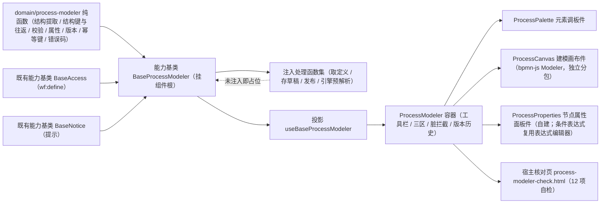

# 01 详细设计 · 流程建模器

> 前端组件库 · 08 交互类 · 08 审批流展示与流程建模器 · 嵌套子任务 02（需求 08-8）· 详细设计

[文档首页](../../../../../../../文档首页.md) › [08 交互类](../../../08_交互类.md) › [08 审批流展示与流程建模器](../../08_交互类_08_审批流展示与流程建模器.md) › 详细设计　|　[← 任务](../08_交互类_08_审批流展示与流程建模器_02_流程建模器.md)

## 1. 设计目标与范围 <a id="goal"></a>

交付[需求 08-8](../../../../../需求/08_需求_交互类.md#r08-8) 的**流程建模器**：以 `08_01_01` 冻结的 `ProcessModeler` 对外形状与 bpmn 分包入口为基础，落地工具栏（新建 / 打开 / 撤销重做 / 缩放 / 导入导出 XML / 校验 / 保存草稿 / 发布版本 / 版本历史）、三区装配（元素调板 / 建模画布 / 节点属性面板）与建模状态语义（选中联动、属性写回、脏基线、只读判定）。

- **编排入链**：新增能力基类 `BaseProcessModeler`（核心 `capabilities/process-modeler.ts`，挂组件根），承载定义装载、XML 更新与导入（两段确认）、结构校验与引擎预解析合并、保存草稿与版本发布（内容派生幂等键）、脏基线、只读判定与错误码定位。
- **领域入核心**：新增 `domain/process-modeler.ts`（BPMN 子集结构提取、结构键与往返等价、结构校验、属性 schema / 读取 / 校验、版本推进、幂等键、错误码定位），**零依赖纯字符串实现**（核心包依赖面保持为空）。
- **数据通路注入式**：`loadDefinition` / `saveDraft` / `deploy` / `validate` 四个处理函数由宿主注入；**未注入即占位**（不发请求、写占位文案、返回 `undefined`），真实联调随**阶段九**（工作流引擎）。
- **画布真实接入**：`bpmn-js@18.28.0` 的 **`Modeler`**（可编辑画布）与 **`Viewer`**（`08-8-1` 只读图）**共用同一份依赖与 `bpmn` 分包**；属性面板**自建**（基于 Modeling 接口 + 事件，**不引** `bpmn-js-properties-panel`）。
- **契约套件**：`describeProcessModelerContract`（`@bms/core/testing`），端中立。

### 1.1 口径与依从 <a id="positioning"></a>

- **架构铁律**：流程建模编排为**横切功能**，落为**继承链上的能力基类**；画布命令栈与渲染归件层，判定逻辑全部在核心。
- **继承链**：`BaseComponent`（组件根）→ 能力基类 `BaseProcessModeler` → 具体件；依赖单向登记于 `capabilities/manifest.ts`。
- **对外契约口径**：沿用 `08_01_01` 冻结形状并**向后兼容新增**（`historyVersions` / `expressionFields` / `expressionVariables` / `expressionTemplates` / `autoLoad` / `definitionName` 等可选 Props 与 `loaded` / `drafted` / `deployed` / `failed` / `history-load` 事件）；既有 Props / 事件 / 插槽 / 数据标记 / 分包入口保持。
- **核心零依赖（强制）**：`bpmn-moddle` **不得**进 `@bms/core`（`guard-core-framework-agnostic` 护栏要求核心包依赖面为空）；故 **XML 往返等价由核心的零依赖字符串结构提取判定**（端中立、可供移动端复用），`bpmn-moddle` 强比对**只在插件层**（`ui-ep/src/utils/bpmnRoundTrip.ts`）。
- **端范围**：**仅 PC**；移动端**不提供建模**（设计节点第 12 节明确），契约套件仍保留端中立口径。
- **工时**：本嵌套子任务 16h；因新增 1 个能力基类、1 份领域纯函数、1 套契约套件、四件组件、bpmn-js Modeler 接入与宿主核对页，实际上浮在实施记录登记。

## 2. 交付物清单 <a id="deliver"></a>

| # | 交付物 | 落点 |
| --- | --- | --- |
| 1 | 流程建模领域纯函数与数据模型 | `core/src/domain/process-modeler.ts` |
| 2 | 流程建模编排能力基类 | `core/src/capabilities/process-modeler.ts` |
| 3 | 能力依赖登记（新增 `process-modeler` 键） | `core/src/capabilities/manifest.ts` |
| 4 | 契约套件（流程建模器编排） | `core/testing/process-modeler.ts` |
| 5 | 核心用例（领域 / 编排） | `core/tests/{domain-process-modeler,process-modeler}.spec.ts` |
| 6 | 投影（薄适配） | `ui-ep/src/composables/useBaseProcessModeler.ts` |
| 7 | 元素调板件 | `ui-ep/src/components/approval/ProcessPalette.vue` |
| 8 | 节点属性面板件 | `ui-ep/src/components/approval/ProcessProperties.vue` |
| 9 | 建模画布件（`bpmn-js` Modeler，独立分包懒加载） | `ui-ep/src/components/approval/ProcessCanvas.vue` |
| 10 | 容器件（工具栏 / 三区装配 / 脏拦截 / 版本历史） | `ui-ep/src/components/approval/ProcessModeler.vue` |
| 11 | 件层工具（bpmn-js 单一落点 / 强比对） | `ui-ep/src/utils/{bpmnCanvas,bpmnRoundTrip}.ts` |
| 12 | 导出面登记（含旧路径移除与分包口径） | `ui-ep/src/index.ts` |
| 13 | 用例 | `ui-ep/tests/interaction-process-modeler.spec.ts` |
| 14 | 宿主核对页（`vite build` 不含） | `apps/desktop/process-modeler-check.html`、`apps/desktop/src/dev/{processModelerCheck.ts,ProcessModelerCheck.vue}` |
| 15 | 登记回写 | 见第 6 节 |



## 3. 接口 / 契约与边界 <a id="contract"></a>

### 3.1 核心：`domain/process-modeler.ts` <a id="domain"></a>

```ts
/** 建模元素类型（BPMN 子集）。 */
export type ModelerElementType = 'startEvent' | 'endEvent' | 'userTask' | 'exclusiveGateway' | 'parallelGateway' | 'sequenceFlow'
/** 定义状态 / 阶段 / 提交种类 / 校验来源。 */
export type ModelerDefinitionStatus = 'draft' | 'published'
export type ModelerPhase = 'idle' | 'loading' | 'validating' | 'saving' | 'deploying' | 'done' | 'failed'
export type ModelerSubmitKind = 'draft' | 'deploy'
export type ModelerValidateSource = 'structure' | 'engine'

/** 常量。 */
export const MODELER_DEFINE_PERM = 'wf:define'
export const MODELER_PLACEHOLDER_TEXT = '流程建模器未就绪（占位）'
export const MODELER_IMPORT_CONFIRM_TEXT = '导入将覆盖当前画布内容，是否继续？'
export const MODELER_SUBSET: readonly ModelerElementType[]
export const MODELER_BLANK_XML: string
export const MODELER_ERROR_TARGETS: Readonly<Record<number, ModelerErrorTarget>>

/** 数据模型。 */
export interface ModelerElement { id: string; type: ModelerElementType; name?: string }
export interface ModelerFlow { id: string; sourceRef: string; targetRef: string; condition?: string; default?: boolean }
export interface BpmnStructure { elements: ModelerElement[]; flows: ModelerFlow[] }
export interface ModelerDefinition { definitionKey: string; name: string; version: number; xml: string; status: ModelerDefinitionStatus }
export interface ModelerDefinitionInput { definitionKey?: string; name?: string; version?: number; xml?: string; status?: ModelerDefinitionStatus }
export interface ModelerValidateError { elementId?: string; message: string }
export interface ModelerValidateResult { valid: boolean; errors: ModelerValidateError[]; source?: ModelerValidateSource }
export interface ModelerErrorTarget { code: number; elementId?: string; i18nKey: string; refresh: boolean }
export interface ModelerElementProperties {
  name?: string; assigneeSource?: string; assigneeValue?: string
  multiRule?: 'any' | 'all'; timeoutValue?: number; timeoutUnit?: 'day' | 'hour'
  notify?: boolean; condition?: string; defaultFlow?: boolean
}
export interface ModelerPropertyItem {
  key: keyof ModelerElementProperties; label: string
  kind: 'text' | 'select' | 'number' | 'switch' | 'expression'
  appliesTo: readonly ModelerElementType[]
  options?: readonly { value: string; label: string }[]
  required?: boolean; placeholder?: string
}
export const MODELER_PROPERTIES: readonly ModelerPropertyItem[]
export const ASSIGNEE_SOURCES: readonly { value: string; label: string }[]
export const MULTI_RULES: readonly { value: 'any' | 'all'; label: string }[]

/** 纯函数（零依赖字符串实现）。 */
export function extractBpmnStructure(xml: string): BpmnStructure
export function elementTypeOf(xml: string, elementId: string): ModelerElementType | undefined
export function isSubsetElement(type: string): boolean
export function structureKey(structure: BpmnStructure): string
export function equivalentBpmnStructure(left: string, right: string): boolean
export function validateBpmnStructure(xml: string): ModelerValidateResult
export function mergeValidateResults(structure: ModelerValidateResult, engine?: ModelerValidateResult): ModelerValidateResult
export function propertiesFor(type?: ModelerElementType): ModelerPropertyItem[]
export function readElementProperties(xml: string, elementId: string): ModelerElementProperties
export function validateProperties(type: ModelerElementType | undefined, values: ModelerElementProperties): ModelerValidateResult
export function normalizeDefinition(input?: ModelerDefinitionInput): ModelerDefinition
export function nextVersion(version: number): number
export function deriveModelerKey(definitionKey: string, version: number, structure: BpmnStructure): string
export function resolveModelerErrorCode(error: unknown): number | undefined
export function resolveModelerErrorTarget(code: number | undefined, structure: BpmnStructure, elementId?: string): ModelerErrorTarget | undefined
```

| 行为 | 口径 |
| --- | --- |
| 结构提取 | 正则扫描元素与顺序流（**忽略命名空间前缀**、容忍属性顺序与空白），元素与流按 `id` 排序；提取 `conditionExpression` 文本与排他网关的默认流标记 |
| 子集约束 | 六类：开始 / 结束事件、用户任务、排他网关、并行网关、顺序流；子集外元素在校验中报「不支持的元素类型」并定位 |
| 结构键与往返 | `structureKey` = 元素与流的稳定串接；`equivalentBpmnStructure` 比对两 XML 的结构键 → **命名空间前缀 / 属性顺序 / 空白无关**，结构变化即不等价 |
| 结构校验 | 五项：子集外元素、起止事件齐备、`id` 唯一、顺序流引用完整、孤立节点（除开始事件须有入边、除结束事件须有出边）；错误尽量带 `elementId` |
| 校验合并 | 结构校验不通过即以结构为准；通过且注入引擎结论时以引擎为准（`source` 透出 `structure` / `engine`） |
| 属性读取 | 读元素 `name` 与 `bms:*` 扩展属性（审批人来源 / 取值 / 多人规则 / 超时值 / 超时单位 / 通知）、出线 `condition`、网关 `default` |
| 属性校验 | 用户任务：名称 / 审批人来源（枚举）/ 审批人取值 / 多人规则（枚举）必填，超时值为负数拒绝；网关：名称必填，且「非默认流须有条件表达式」 |
| 版本推进 | `nextVersion` 版本 + 1（发布）；保存草稿保持当前版本 |
| 幂等键 | `wfd:{fnv1aHex(stableStringify([definitionKey, version, structureKey]))}`：同内容同键、版本或结构变更换键 |
| 错误码 | `60006`（BPMN 非法 / 引擎解析失败）带元素定位；`60007`（定义被引用不可删除）定义级提示（`refresh: true`）；文案走 i18n `error.600xx` |
| 纯数据 | 不触 DOM、不请求、不依赖渲染框架；**零外部依赖**（核心包依赖面为空） |

### 3.2 核心：能力基类 `BaseProcessModeler` <a id="base"></a>

```ts
export interface ModelerSubmitResult { version?: number; message?: string }

export type ModelerLoadDefinitionHandler = (input: { definitionKey: string; version?: number }) => Promise<ModelerDefinitionInput | undefined>
export type ModelerSaveHandler = (input: { definitionKey: string; name: string; xml: string; version: number; idempotencyKey: string }) => Promise<ModelerSubmitResult | undefined>
export type ModelerValidateHandler = (input: { definitionKey: string; xml: string }) => Promise<ModelerValidateResult | undefined>
export interface ModelerJobs {
  loadDefinition?: ModelerLoadDefinitionHandler
  saveDraft?: ModelerSaveHandler
  deploy?: ModelerSaveHandler
  validate?: ModelerValidateHandler
}

export abstract class BaseProcessModeler extends BaseComponent {
  readonly identifier: string = 'process-modeler'
  override readonly depends = ['access', 'notice']

  ready: boolean
  definition: ModelerDefinition
  readOnly: boolean
  selectedId: string
  importPending: string
  lastResult?: ModelerSubmitResult
  validateResult?: ModelerValidateResult
  phase: ModelerPhase
  errorMessage: string
  errorTarget?: ModelerErrorTarget
  requestCount: number
  jobs: ModelerJobs
  access?: BaseAccess
  notice?: BaseNotice

  get degraded(): boolean
  get disabled(): boolean
  get busy(): boolean
  get structure(): BpmnStructure
  get xml(): string
  get dirty(): boolean
  get canEdit(): boolean
  get canDeploy(): boolean
  get selected(): ModelerElement | undefined
  get nextVersion(): number

  setReady(value: boolean): void
  setReadOnly(value: boolean): void
  setJobs(jobs: ModelerJobs): void
  setAccess(access?: BaseAccess): void
  setNotice(notice?: BaseNotice): void
  applyDefinition(input?: ModelerDefinitionInput): void
  load(definitionKey?: string, version?: number): Promise<boolean>
  updateXml(xml: string): void
  importXml(xml: string): boolean
  requestImport(xml: string): boolean
  confirmImport(): boolean
  cancelImport(): void
  exportXml(): string
  select(elementId?: string): ModelerElement | undefined
  validate(options?: { engine?: boolean }): Promise<ModelerValidateResult>
  saveDraft(): Promise<ModelerSubmitResult | undefined>
  deploy(): Promise<ModelerSubmitResult | undefined>
  retry(): Promise<ModelerSubmitResult | undefined>
  idempotencyKey(kind: ModelerSubmitKind): string
  discard(): void
  reset(): void
}
```

| 行为 | 口径 |
| --- | --- |
| 装载 | `applyDefinition` 归一（空 XML 回落 `MODELER_BLANK_XML`）并**记脏基线**（基线 XML + 基线结构键）；`importXml` 结构校验通过才生效（不通过置 `failed` 与定位，画布保持原内容） |
| 导入两段确认 | `requestImport` 置 `importPending`（非编辑态 / 非法返回 `false`）；`confirmImport` 生效；`cancelImport` 清待确认 |
| 取定义 | 未就绪 / 未注入不发请求；成功后装载并清脏、清待确认；失败置 `failed` |
| 更新 XML | `updateXml` 仅改本地并重算结构；`dirty` = 基线结构键非空且与当前结构键不等 |
| 选中 | `select` 按 `id` 命中（返回元素）或清空；`selectedId` 供件层联动属性面板 |
| 校验 | `validate`：结构校验必然执行；`engine` 为真且已注入时并行取引擎结论并按 `mergeValidateResults` 合并（不通过即写定位）；阶段置 `validating` → `idle`；未就绪时不请求 |
| 保存 / 发布前置 | `canEdit` = 就绪 ∧ 有权 ∧ 非只读；提交前**先占位再校验**（校验异步：若不先置提交中，并发重复提交会双双穿过 `busy` 判定） |
| 保存 / 发布 | 校验通过才请求；载荷含 `definitionKey` / `name` / `xml` / `version`（草稿取当前版本、发布取 `nextVersion`）与**内容派生幂等键**；成功清脏、发布推进版本并置 `published`、阶段 `done` 并提示 |
| 失败 | 阶段 `failed` + 文案 + 错误码定位（`60006` 带元素 / `60007` 定义级）；`retry()` 仅在 `failed` 阶段重放上次提交种类（保留入参） |
| 只读 | `readOnly`（历史版本 / 无 `wf:define`）→ 禁用编辑 / 保存 / 发布 与调板 / 属性面板；**导出与校验仍可用** |
| 占位语义 | `ready === false` → `degraded` / `disabled` 为真、取数与提交**零请求**，保持 `08_01_01` 冻结口径 |

- 依赖登记：`process-modeler: ['access', 'notice']`。
- 不含画布渲染、命令栈与调板 / 属性面板渲染（归件层）。

### 3.3 契约套件（`@bms/core/testing`） <a id="testing"></a>

| 套件 | 契约面（结构化接口） | 断言要点 |
| --- | --- | --- |
| `describeProcessModelerContract(name, create)` | `ready` / `degraded` / `disabled` / `readOnlyState` / `requestCount` / `phase` / `definitionKey` / `version` / `dirty` / `canEdit` / `xml()` / `structure()` / `selectedId()` / `validateSource()` / `errorElementIds()` / `errorTargetElement()` / `setReady` / `setReadOnly` / `setAccess` / `setHandlers` / `applyDefinition` / `load` / `updateXml` / `importXml` / `requestImport` / `confirmImport` / `cancelImport` / `exportXml` / `select` / `validate` / `saveDraft` / `deploy` / `retry` / `idempotencyKey` / `discard` | 占位零请求；装载（空 XML 回落模板、初始不脏）；取定义装载；`updateXml` 置脏与 `discard` 回滚；结构校验定位；导入两段式（确认 / 取消）；XML 往返语义等价；校验来源切换与合并；保存 / 发布幂等键同内容同键、内容变更换键；发布推进版本并清脏；未注入不请求；校验不通过阻断且不请求；只读态与无权不可编辑；`60006` 定位元素、`60007` 定义级与重试；进行中重复提交不动作 |

- 目标约定：定义 `leave`（`version = 2`，合法最小流程）；引擎预解析初始未注入；权限码 `wf:define`。
- 套件端中立（移动端虽不提供建模，仍保留同一口径）。

### 3.4 件层：投影与四件 <a id="components"></a>

#### 3.4.1 投影 `useBaseProcessModeler`（`ui-ep/src/composables/`） <a id="binding"></a>

```ts
export interface UseBaseProcessModelerOptions {
  ready?: boolean
  definitionKey?: string
  version?: number
  xml?: string
  readOnly?: boolean
  jobs?: ModelerJobs
  access?: BaseAccess
  notice?: BaseNotice
}

export interface UseBaseProcessModelerResult {
  modeler: BaseProcessModeler
  ready / degraded / disabled / readOnly / busy / phase / xml / dirty / canEdit / canDeploy
  selected / validateResult / errorMessage / errorTarget / requestCount: Ref<...>
  definitionKey / definitionName / version: ComputedRef<...>   // 自 definition 派生
  structure: () => BpmnStructure
  setReady / setReadOnly / setJobs / setAccess / setNotice / applyDefinition / load
  updateXml / importXml / requestImport / confirmImport / cancelImport / exportXml / select
  validate / saveDraft / deploy / retry / idempotencyKey / discard / reset
}
```

- 薄适配；跨实例基类实例经 `markRaw(toRaw(...))` 隔离；`definition` 为 ref、`definitionKey` / `definitionName` / `version` 由 `definition` **computed 派生**（保证装载后响应式更新）。

#### 3.4.2 `ProcessModeler` 容器件契约 <a id="container"></a>

| 面 | 内容 |
| --- | --- |
| 数据面（沿用） | `ready`（缺省 `false`）/ `definitionKey` / `version` / `xml` / `readOnly` / `loading` / `dirty` / `degradeText` |
| 数据面（新增可选） | `definitionName` / `jobs` / `access` / `notice` / `autoLoad` / `historyVersions` / `expressionFields` / `expressionVariables` / `expressionTemplates` |
| 事件（既有） | `update:xml` / `change` / `save-draft` / `deploy` / `validate` / `import` / `export` / `add-element` / `select` |
| 事件（新增） | `loaded` / `drafted` / `deployed` / `failed`（`{ message, code?, elementId? }`）/ `history-load` |
| 插槽（既有） | `degrade` / `live` / `toolbar` / `palette` / `properties` |
| 插槽（新增） | `canvas` |
| 数据标记（延续） | `data-ready` / `data-degraded` / `data-test="placeholder"` / `data-test="toolbar"` / `data-test="definition-key"` / `data-test="import"` / `data-test="export"` / `data-test="validate"` / `data-test="save-draft"` / `data-test="deploy"` / `data-test="dirty"` / `data-test="palette"` / `data-test="palette-{type}"` / `data-test="canvas"` / `data-test="properties"` / `data-test="properties-selected"` / `data-test="properties-empty"` / `data-test="process-canvas"`（`data-subpackage="bpmn"`） |
| 数据标记（新增） | `data-phase` / `data-readonly` / `data-test="undo"` / `data-test="redo"` / `data-test="zoom-in"` / `data-test="zoom-out"` / `data-test="zoom-reset"` / `data-test="history-toggle"` / `data-test="history-{version}"` / `data-test="history"` / `data-test="readonly-tip"` / `data-test="loading"` / `data-test="validation-errors"` / `data-test="validate-error-{elementId}"` |

| 行为 | 口径 |
| --- | --- |
| 占位 / 只读 | `ready` 为假 → 降级（既有断言保持）；`readOnly`（或占位）→ 编辑 / 保存 / 发布 / 调板 / 属性禁用，**导出与校验仍可用** |
| 受控覆盖 | `xml` / `dirty` / `readOnly` / `definitionKey` / `version` / `definitionName` 提供时优先，`watch` 同步进内核 |
| 自动取定义 | `ready` ∧ `autoLoad` ∧ 有 `definitionKey` → 调 `load()` 并上抛 `loaded` |
| 画布联动 | 画布 `update:xml` → 内核 `updateXml` + 上抛 `update:xml` / `change`；画布 `select` → 内核 `select` + 读 `readElementProperties` 灌属性面板 + 上抛 `select` |
| 调板创建 | 点击调板项：**先上抛** `add-element`，编辑态下再经画布 `createElement` 创建并选中 |
| 属性写回 | 属性面板 `property-change` → 经画布 `updateProperties` 写回 BPMN（`bms:*` 扩展属性 / 出线条件 / 网关默认流），并同步件内草稿 |
| 导入 / 导出 | 导入：上抛 `import` → 内核 `requestImport` → `useConfirm` 危险确认 → `confirmImport`（取消则 `cancelImport`）；导出：上抛 `export`（内核 `exportXml`） |
| 校验 | 上抛 `validate` → 内核 `validate`（结构 + 注入式引擎合并）→ 错误上屏（`validation-errors`）；失败项带元素时**画布高亮** |
| 保存 / 发布 | 上抛 `save-draft` / `deploy` → 注入时内核提交并上抛 `drafted` / `deployed`；失败上抛 `failed`（带错误码与元素定位，并高亮） |
| 版本历史 | 有 `historyVersions` 时展示入口；载入前若脏则二次确认（放弃变更）；注入取定义时按版本取数并**置只读**，上抛 `history-load` |

#### 3.4.3 `ProcessPalette` 元素调板件契约 <a id="palette"></a>

| 面 | 内容 |
| --- | --- |
| 数据面 | `elements`（缺省 `MODELER_SUBSET`）/ `disabled` / `draggable` |
| 事件 | `add`（`ModelerElementType`）/ `drag-start` |
| 数据标记 | `data-test="process-palette"` / `data-test="palette-{type}"` |
| 行为 | 仅列 BPMN 子集六类（对齐工作流引擎可解析边界）；点击上抛 `add`，拖出写 `dataTransfer` 并上抛 `drag-start`；禁用态不可拖出 |

#### 3.4.4 `ProcessProperties` 节点属性面板件契约 <a id="properties"></a>

| 面 | 内容 |
| --- | --- |
| 数据面 | `properties`（运行态值）/ `selectedType` / `selectedId` / `definitionKey` / `definitionName` / `readOnly` / `expressionFields` / `expressionVariables` / `expressionTemplates` / `errors`（外部引擎结论） |
| 事件 | `property-change`（`{ key, value }`）/ `validate`（`{ valid, errors }`） |
| 数据标记 | `data-test="process-properties"` / `data-test="properties-empty"` / `data-test="properties-selected"` / `data-test="property-{key}"` / `data-test="property-error-{key}"` / `data-test="condition-editor"` |
| 行为 | **自建面板**（不引官方 properties-panel）：按 `propertiesFor(type)` 渲染（文本 / 下拉 / 数字 / 开关 / 表达式）；写入即时上抛并推校验结论；条件表达式复用 `08_02` 的表达式编辑器（含令牌与模板）；未命中选中时展示流程级信息；只读态全部禁用 |

#### 3.4.5 `ProcessCanvas` 建模画布件契约 <a id="canvas"></a>

| 面 | 内容 |
| --- | --- |
| 数据面 | `xml`（受控）/ `readOnly` / `selectedId` |
| 事件 | `update:xml` / `change` / `select`（`{ id, type, name? } \| null`）/ `ready` / `error`（`{ reason }`）/ `command-state`（`{ canUndo, canRedo }`） |
| 数据标记 | `data-test="process-canvas"` / `data-subpackage="bpmn"` / `data-readonly` / `data-state` / `data-test="canvas-note"` / `data-test="canvas-error"` |
| 行为 | `bpmn-js` **Modeler** 可编辑画布：导入 XML、事件订阅（`selection.changed` / `commandStack.changed`）、命令栈（撤销 / 重做与状态上报）、缩放平移与适配、`createElement` / `updateProperties`；外部 `xml` 变更经**结构等价比对**后才重导（避免自触发循环）；卸载销毁实例 |

### 3.5 分包与命名 <a id="chunk"></a>

- 保留既有异步分包入口 `ProcessCanvas`（Modeler），与 `08-8-1` 的 `ApprovalFlowDiagram`（Viewer）**共用同一份 `bpmn-js` 依赖与 `bpmn` 分包**，`data-subpackage="bpmn"` 不变。
- **懒加载件不作为根出口静态导出**（`ui-ep/src/index.ts`）。
- 四件落入 `ui-ep/src/components/approval/` 专题族（与审批流展示同族）；旧 `components/interaction/{ProcessModeler,ProcessCanvas}.vue` 删除。
- `bpmn-js` **pin `18.28.0`**，声明在 `@bms/ui-ep` 包依赖，经 npmmirror 安装并锁入 `package-lock.json`；`bpmn-js` / `bpmn-moddle` 调用**只经 `ui-ep/src/utils/`** 单一落点。

## 4. 失败分支与边界 <a id="edge"></a>

| 边界 / 失败场景 | 处置 |
| --- | --- |
| 数据通路未就绪（`ready` 为假） | 占位：降级提示 + 编辑禁用 + 取数与提交零请求 |
| 处理函数未注入 | 占位：不请求、写占位文案、返回 `undefined` |
| 无 `wf:define` 权限 | `canEdit` 为假：编辑 / 保存 / 发布 / 调板禁用；导出与校验仍可用；后端兜底 |
| 只读（历史版本 / 无权限） | 同上 + 提示「只读视图」 |
| XML 为空 | 装载回落空流程模板（可继续绘制） |
| 结构校验不通过（起止事件缺失 / 孤立节点 / 悬空引用 / 重复 id / 非子集元素） | 阻断保存 / 发布（零请求）；错误上屏并**定位元素 + 画布高亮** |
| 引擎预解析失败（60006） | 同上（`source = engine`，错误带元素定位） |
| 定义被引用不可删除（60007） | 定义级提示（无元素定位）；可重试 |
| 导入 XML 非法 | `importXml` 返回 `false`、画布保持原内容、可定位 |
| 导入未确认 | 取消则清待确认、画布不变（**未确认前零覆盖**） |
| 存在未保存变更时载入历史版本 | 二次确认（放弃变更）；取消则保持当前画布 |
| 进行中重复提交 | 不动作（返回 `undefined`；件层同时禁用按钮） |
| 提交后画布 XML 回写 | 经结构等价比对去重，避免「回写 → 变更 → 再回写」自触发循环 |
| BPMN 渲染依赖加载失败 / 画布构造失败 | 上抛 `error` → 容器上抛 `failed`（不白屏） |
| 远程大流程 | Viewer / Modeler 自带缩放平移与适配；件层不做虚拟化（图纸规模受控） |
| 移动端 | **不提供建模**（设计节点明确）；契约套件仍端中立 |

## 5. 测试设计与验收映射 <a id="test"></a>

| 验收点（需求 08-8 / 子任务 08-8-2） | 用例 |
| --- | --- |
| 占位语义（降级 / 禁用 / 零请求） | `describeProcessModelerContract`（`08_01_01` 冻结口径延续）+ `interaction-placeholder.spec.ts` |
| 结构提取 / 子集判定 / 结构键与往返等价 | `core/tests/domain-process-modeler.spec.ts` |
| 结构校验五项与元素定位、校验合并 | 同上 + 契约套件 |
| 属性 schema / 读取 / 校验 | 同上 + `ProcessProperties` 用例 |
| 版本推进 / 幂等键（同内容同键、内容变更换键） | 同上 + 契约套件 |
| 错误码 `60006` / `60007` 定位与重试 | 同上 + 契约套件 |
| 装载 / 更新 / 导入两段确认 / 脏基线与回滚 / 只读 / 无权 | 契约套件 + `core/tests/process-modeler.spec.ts` |
| 画布事件联动、调板创建、属性写回、命令栈与缩放 | `interaction-process-modeler.spec.ts`（画布入口桩 + 真实画布由核对页核验） |
| **XML 往返强比对**（`bpmn-moddle`，忽略命名空间前缀与属性顺序） | `interaction-process-modeler.spec.ts` |
| 分包边界（异步件解析与 `data-subpackage`） | 同上 + 容器用例 |
| 组件挂链护栏（值引入基类投影） | `ui-ep/tests/guard-component-inheritance.spec.ts` |
| 宿主机对页十二项自检 | chromium headless `--dump-dom`（**12 / 12**） |
| `vue-tsc`、ESLint、Vitest 全通过 | 根 `npm run check` + 宿主 `vue-tsc -b` / `lint` / `test:cov` / `build` / `budget` |
| 文档链接与基座校验 | `check-links.py`、`check-base.py` |

- Kiwi 用例 1 条（一任务一条，编号于测试步登记后回填，预计 **975**；分类「平台骨架」、优先级 P2、状态 CONFIRMED、标签「自动化」）。

## 6. 登记落点 <a id="register"></a>

| 内容 | 落点 |
| --- | --- |
| 新增能力基类 `BaseProcessModeler`（能力键 `process-modeler`） | 《[前端基类清单](../../../../../../../前端基类清单.md)》§2.1 插入行（父基类 `BaseComponent`，组件侧·能力基类，状态「已交付」）+ §2 继承链总览 + §5.2 能力基类表 + `capabilities/manifest.ts` |
| 领域纯函数与数据模型 `domain/process-modeler.ts` | 同上 §9「核心」（`domain/` 领域纯函数） |
| 契约套件 | 同上 §9（`core/testing/`：流程建模器编排一套） |
| 投影与件（`useBaseProcessModeler` + 专题族 `components/approval/` 四件） | 同上 §9「PC 插件」（投影清单、专题族目录清单） |
| 旧路径移除（`components/interaction/` 两件） | 同上 §9（目录清单同步） |
| 设计口径回写 | 《组件设计》[06 流程建模器](../../../../../../../设计/组件设计/08_交互类/06_组件设计_流程建模器/06_组件设计_流程建模器.md)：继承链行改现行口径、属性面板「自建」口径与登记项状态 |
| 上游登记（3 项，本任务只登记归口、不代上游裁决） | ① 建模器交互与 BPMN 子集 / 节点属性结构 → 《概要设计 · 工作流管理》「功能点分解」「接口设计」节；② 网关条件变量与表达式校验 → 同上「接口设计」节；③ 前端建模依赖与只读共用 → 《架构设计 · 前端架构》「技术要点」「前端性能」节 |
| 任务 / 父任务 / 域任务 / 计划状态 | [任务](../08_交互类_08_审批流展示与流程建模器_02_流程建模器.md)、[父任务](../../08_交互类_08_审批流展示与流程建模器.md)、[域任务](../../../08_交互类.md)、[计划](../../../../../../../项目/04_前端组件库/计划/01_计划_前端组件库.md) |
| 需求文档 | 不承载进度；遗留归口写在实施 / 测试记录与计划 |

## 7. 边界与开放项 <a id="open"></a>

- **不在本期**：真实接口联调（取定义 / 存草稿 / 发布 / 引擎预解析，随**阶段九**）；定义列表与删除下架（归通用表格与后端）；流程模板种子（产品仓库提供）；宿主「流程建模」路由页（归宿主布局任务）；移动端建模（设计节点明确不提供）。
- **协同契约**：宿主注入 `jobs` / `access` / `notice`；件层默认装配 `useConfirm`（导入覆盖与放弃变更）与表达式编辑器（条件表达式）；未注入即事件上抛 + 核心占位。
- **事件与注入双轨的风险**：宿主同时监听 `save-draft` / `deploy` 并注入 `jobs` 会导致重复执行（文档写明「二选一」）。
- **`jsdom` 与真实画布**：`bpmn-js` 依赖 SVG `getBBox`（jsdom 不实现），单元用例对画布创建入口下桩，**真实画布与 XML 往返由开发态核对页以 chromium 核验**。
- **上游登记待确认**：三项（建模器交互与 BPMN 子集 / 网关条件变量与校验 / 建模依赖与只读共用）由《组件设计 06》与《概要设计 15》《架构设计 08》裁决；本任务只登记归口。
- Kiwi 用例编号于测试步登记后回填实施 / 测试记录与用例文件（预计 975）。

## 8. 决策记录 <a id="decision"></a>

| # | 决策项 | 结论 |
| --- | --- | --- |
| 1 | 对外契约口径 | 沿用 `08_01_01` 冻结形状并**向后兼容新增**（可选 Props / 新增事件 / `canvas` 插槽） |
| 2 | 编排落点 | 新增能力基类 `BaseProcessModeler`（挂组件根），依赖 `access` / `notice` |
| 3 | 注入面 | 四处理函数：`loadDefinition` / `saveDraft` / `deploy` / `validate` |
| 4 | 画布 | **真实接入 `bpmn-js` Modeler**（pin `18.28.0`）；与只读图共用依赖与分包 |
| 5 | 属性面板 | **自建**（不引 `bpmn-js-properties-panel`）；条件表达式复用 `08_02` 表达式编辑器 |
| 6 | 校验 | 前端**结构校验**即时 + **引擎预解析注入式**（`mergeValidateResults` 合并） |
| 7 | 往返比对 | 核心零依赖结构提取判定（端中立）；`bpmn-moddle` 强比对只在插件层（核心包依赖面保持为空） |
| 8 | 幂等键 | **内容派生**（定义 + 版本 + 结构键），`wfd:{hash}` |
| 9 | 导入口径 | **两段确认**（请求 → 危险确认 → 生效；取消不覆盖） |
| 10 | 版本历史 | 只读载入 + 脏数据二次确认；载入后置只读 |
| 11 | 并发保护 | 提交**先占位再校验**（校验异步），防并发重复提交穿透 `busy` |
| 12 | 端范围 | **仅 PC**；移动端不提供建模（契约套件仍端中立） |
| 13 | 阶段归属 | 阶段四内交付；真实联调归口**阶段九** |
| 14 | 宿主页面 | 不做宿主路由页（本期只做核对页） |

## 9. 参考文档 <a id="ref"></a>

- [需求 08-8](../../../../../需求/08_需求_交互类.md#r08-8)、[任务 08-8-2](../08_交互类_08_审批流展示与流程建模器_02_流程建模器.md)、[父任务 08 审批流展示与流程建模器](../../08_交互类_08_审批流展示与流程建模器.md)
- 《组件设计》[06 流程建模器](../../../../../../../设计/组件设计/08_交互类/06_组件设计_流程建模器/06_组件设计_流程建模器.md)（含[可交互原型](../../../../../../../设计/组件设计/08_交互类/06_组件设计_流程建模器/06_原型设计_流程建模器.html)，原型即验收基准）
- 《[概要设计 · 工作流管理](../../../../../../../设计/概要设计/15_概要设计_工作流管理.md)》、《[架构设计 · 子系统 · 工作流](../../../../../../../设计/架构设计/21_架构设计_子系统_工作流.md)》、《[架构设计 · 前端架构](../../../../../../../设计/架构设计/08_架构设计_前端架构.md)》
- [08_01_01 配置与工作流占位](../../../08_交互类_01_占位版交付/08_交互类_01_占位版交付_01_配置与工作流占位/08_交互类_01_占位版交付_01_配置与工作流占位.md)（冻结对外契约与分包入口）、[08_02 图标选择器与代码表达式编辑器](../../../08_交互类_02_图标选择器与代码表达式编辑器/08_交互类_02_图标选择器与代码表达式编辑器.md)（条件表达式编辑能力复用）
- [《前端基类清单》](../../../../../../../前端基类清单.md)、《[前端开发规范](../../../../../../../规范/前端开发规范.md)》、《[文档生成规范](../../../../../../../规范/文档生成规范.md)》

> 本文档依《[文档生成规范](../../../../../../../规范/文档生成规范.md)》编写
