# 01 实施 · 报表设计器

> 前端组件库 · 08 交互类 · 09 报表设计器与大屏设计器与播放 · 嵌套子任务 01（需求 08-9）· 实施记录

[文档首页](../../../../../../../文档首页.md) › [08 交互类](../../../08_交互类.md) › [09 报表设计器与大屏设计器与播放](../../08_交互类_09_报表设计器与大屏设计器与播放.md) › 实施记录　|　[← 详细设计](../设计/01_详细设计_01_报表设计器.md)　[测试记录 →](../测试/01_测试_01_报表设计器.md)

## 1. 实施信息 

| 项 | 值 |
| --- | --- |
| 任务 | 08-9-1 报表设计器（[任务](../08_交互类_09_报表设计器与大屏设计器与播放_01_报表设计器.md)） |
| 对应需求 | [08-9](../../../../../需求/08_需求_交互类.md#r08-9) |
| 详细设计 | [01_详细设计_01_报表设计器.md](../设计/01_详细设计_01_报表设计器.md)（定稿提交 `760cf1bb`） |
| 前置任务 | [07_06 图表卡](../../../../07_展示类/07_展示类_06_图表卡/07_展示类_06_图表卡.md)（`BaseChart` / `ChartRenderer` / `echartsKernel` 已交付） |
| 实施日期 | 2026-09-19 |
| 实施人 | minjian |
| 实施环境 | Ubuntu 开发机 · Node（workspace `@bms/core` + `@bms/ui-ep` + `apps/desktop`）· Vitest 5 / jsdom · Vue 3.5 / TypeScript 严格模式 · chromium headless（核对页） |
| Kiwi 用例 | 776（分类「平台骨架」/ P2 / CONFIRMED / 标签「自动化」） |
| 提交 | 见任务收尾提交 |
| 结论 | 完成标准达标（三区可用、数据集选择与字段映射、图表配置与实时渲染、网格布局、预览取数、保存发布另存、分包生效；核对页 12/12） |

```mermaid
flowchart LR
    A["Kiwi 用例登记（776）"] --> B["核心领域 domain/report-layout（图表项 / 12 列网格 / 序列化 / 校验 / 脏比对）"]
    B --> C["能力基类 BaseReportDesigner（编排 / 占位 / 只读 / 预览 / 保存发布另存）"]
    C --> D["契约套件 describeReportDesignerContract"]
    D --> E["《前端基类清单》登记（52 BaseReportDesigner）+ 依赖表新增键"]
    E --> F["投影 useBaseReportDesigner"]
    F --> G["专题族五件：ReportDesigner / ReportCanvas / ReportGrid / DatasetPanel / ChartConfigPanel"]
    G --> H["gridstack 分包入口（ReportGrid）+ 复用 07_06 ChartRenderer / echartsKernel"]
    H --> I["导出面登记（旧路径移除）"]
    I --> J["用例（核心 + ui-ep）与宿主核对页 12/12"]
    J --> K["门禁验证（根 check + 宿主 lint / test / build / budget + 基座校验）"]
    K --> L["登记回写（基类清单 / 组件设计 / 上游 / 计划与状态）"]
```

## 2. 实施概览 

结果小结：新增 1 份领域纯函数（26 个导出）、1 个能力基类 `BaseReportDesigner`、1 套契约套件、1 套投影、5 件组件（2 迁移 + 3 新增，含 gridstack 独立分包件）；`core` 58 文件 / 689 用例、`ui-ep` 46 文件 / 566 用例全绿（本次新增 31 + 11 条）。

## 3. 实施过程 

1. **Kiwi 先行**：经容器内 Django shell 登记用例，取得编号 **776**（平台既有编号至 775）；三个用例文件首行标注 `// kiwi_id: 776`。
2. **依赖引入**：`ui-ep` 新增 `gridstack@^13.3.0`（npmmirror 源，实测 13.3.0）；`ECharts` 复用 `07_06` 已引入的分包内核。
3. **核心领域**（`core/src/domain/report-layout.ts`）：权限码 / 占位文案 / 网格常量；`ReportDataset`（含参数）/ `ReportChartItem` / `ReportDefinition` / 校验类型（与 `08_01_03` 冻结契约同形）；纯函数：尺寸与图表项归一（未知类型回落 / 脏字段不抛错 / 无标识丢弃）、新增自动落位（碰撞扫描）、删除幂等、移动 / 缩放夹取、居中、复制、重叠检测、字段与数据集选项（停用不可选）、配置生成、`validateReport`（空 / 不存在 / 停用 / 缺映射 / 重叠，重叠为警告不阻断）、序列化（layout + chart_configs）与稳定脏比对。
4. **能力基类**（`core/src/capabilities/report-designer.ts`）：键 `report-designer`，父 `BaseComponent`，依赖 `access` / `notice` / `data-state` / `drag-drop` / `async-task`；占位零请求、只读不动作不写脏、取数装载与基线、结构操作经领域函数、拖拽落点广播 `drop`、预览取数（只读从库口径）、保存 / 发布 / 另存为、脏基线与拦截、防重复。
5. **契约套件**（`core/testing/report-designer.ts`）：`describeReportDesignerContract`（11 条）+ `createReportJobs` 处理函数桩；核心用例 `domain-report-layout.spec.ts`（17 条）与 `report-designer.spec.ts`（14 条，含契约驱动）。
6. **登记**：`CAPABILITY_MANIFEST` 新增 `report-designer` 键；核心导出面新增能力基类与全部领域导出；《前端基类清单》§2.1 插入行（**编号 52**，父 `BaseComponent`、「已交付」，其后 52~78 顺延为 53~79，`BaseChart` 顺延为 69）+ §2 继承链总览 + §5.2 能力基类表 + §9「PC 插件」补 `components/report/` 与 `useBaseReportDesigner`。
7. **投影**（`ui-ep/src/composables/useBaseReportDesigner.ts`）：薄适配（`markRaw(toRaw(x))` 隔离；`onScopeDispose` 解除订阅并 `dispose`）。
8. **专题族五件**（`ui-ep/src/components/report/`）：
   - `ReportDesigner`（迁移 + 真实实现）：三区 + 工具栏（新建 / 打开 / 添加图表 / 预览 / 保存 / 发布 / 另存为）+ 脏拦截上抛；**对外契约保持 `08_01_03` 冻结形状**，仅向后兼容新增可选 Props（`reportName` / `datasetId` / `jobs` / `access` / `notice`）、事件（`new` / `open` / `loaded` / `saved` / `failed` / `dirty-block` / `dataset-change` / `chart-update`）与插槽（`report-list`）；`defineExpose` 暴露设计器实例供核对与调试；事件与注入双轨；
   - `ReportCanvas`（迁移 + 真实实现）：12 列画布承载图表卡（复用 `ChartRenderer` + `echartsKernel`），空态 / 选中 / 复制 / 居中 / 删除；新增 `move-chart` / `resize-chart` / `duplicate-chart` / `center-chart` 事件；
   - `ReportGrid`（新增，**gridstack 独立分包入口**）：`import('gridstack')` 动态装载 + `gs-*` 属性初始化，`change` 事件适配落点上抛；内核不可用降级不抛错；
   - `DatasetPanel`（新增，独立分包）：当前数据集字段清单 / 参数 / 样例数据预览 / 停用提示；
   - `ChartConfigPanel`（新增，独立分包）：图表类型（全场景）/ 标题 / 维度·多度量·系列映射 / 常用样式 / 高级配置 JSON（非法忽略提示）/ 预览入口；
   - 旧路径 `components/interaction/{ReportDesigner,ReportCanvas}.vue` 删除；`AiAssistant.vue` 的 `ReportDataset` 类型改自 `@bms/core`。
9. **分包与导出**：`ReportCanvas` 保持 `data-subpackage="report"`；`ReportGrid` `data-subpackage="gridstack"`；三件懒加载件不入根出口；`apps/desktop/vite.config.ts` 为 `gridstack` 命名独立 vendor 块（异步块，不进首屏）。
10. **用例**：核心 31 条 + `ui-ep/tests/interaction-report-designer.spec.ts` 11 条（投影 + 五件 + 分包边界）；既有 `interaction-placeholder-3.spec.ts`（`08_01_03` 冻结契约，14 条）**未改动即通过**。
11. **宿主核对页**：`apps/desktop/report-design-check.html` + `src/dev/{reportDesignCheck.ts,ReportDesignCheck.vue}`（12 项自检：三区 / 停用不可选 / 新增图表 / 字段清单 / 数据预览 / 选中联动 / 类型切换 / 标题样式 / 网格落点 / 复制 / 删除 / 脏基线与保存发布另存链路），`vite build` 不包含；chromium headless `--dump-dom` 核验 **12/12**。

## 4. 问题与处置 

| # | 问题 | 处置 |
| --- | --- | --- |
| 1 | 冻结契约要求数据集按钮与 `config-selected` **同步**可见，而新增的 `DatasetPanel` / `ChartConfigPanel` 为独立分包懒加载件 | 数据集选择列表由设计器**同步内联渲染**（保持冻结 `data-test="dataset-{id}"`）；`DatasetPanel` 退化为「数据集详情」（字段 / 参数 / 预览，根 `data-test="dataset-detail"`）；配置面板保留 `config-selected` / `config-empty` 标记随选中联动（在分包件加载完成后更新） |
| 2 | gridstack 依赖 DOM 尺寸，jsdom 下加载 / 初始化可能异常 | `ReportGrid` 以**动态 import + try/catch** 装载，内核不可用时置 `degraded` 并降级为普通列表（网格项仍渲染），单测断言分包标记与网格项存在，真实拖拽由浏览器核对页核验 |
| 3 | 检查组件的 lint 报 `vue/no-dupe-keys`（computed 名与 Props 同名 `datasets` / `charts` / `selectedId` / `dirty`） | 件内改名 `datasetList` / `chartList` / `selectedIdValue` / `dirtyFlag`（沿用 `08_06` 坑记录） |
| 4 | 新增三件（`ReportGrid` / `DatasetPanel` / `ChartConfigPanel`）未实质挂继承链，护栏拦截 | 三件均经 `useBaseDataState` 挂链并补 `data-state` 标记 |
| 5 | 核对页首轮 10/12：数据集面板 `preview` 事件未接线（`jobs.preview` 未调用）、脏基线未建立直接判脏失败 | 设计器补数据集 / 配置面板 `preview` 接线（按当前数据集匹配图表项调用 `base.preview` 并分发到画布与面板）；核对页 ⑫ 改为「先打开（装载基线）→ 新增→ 撤销 → 保存 / 发布 / 另存」，复跑 12/12 |

## 5. 验证结果 

| 命令 | 结果 |
| --- | --- |
| `npm run check`（core + vue + ui-ep） | 58 + 2 + 46 文件 / 689 + 5 + 566 用例全绿（core 新增 31、ui-ep 新增 11） |
| 宿主 `npx vue-tsc -b` / `npm run lint` | 通过 |
| 宿主 `npm run test` | 通过（10 文件 / 35 用例） |
| 宿主 `npm run build` / `npm run budget` | 通过（首屏入口块合计 119.5 KB / 预算 260 KB；首屏最大单文件 104.1 KB / 预算 150 KB） |
| 开发态核对页（chromium headless `--dump-dom`） | **12 / 12** 自检项通过 |
| 既有 `ui-ep/tests/interaction-placeholder-3.spec.ts`（`08_01_03` 冻结契约） | 未改动即通过（占位降级、就绪三区与事件透传、分包断言保持） |
| `python3 scripts/tools/base-check/check-links.py` | 通过（断链 0、失效锚点 0） |

对照完成标准：设计器可配置并保存发布（保存 / 发布 / 另存为经注入处理函数，覆盖式）、数据预览正确（只读从库口径经注入）、网格布局可用（gridstack 12 列拖拽 / 缩放落点）、分包生效（gridstack / ECharts 独立块，首屏预算通过）；Vitest 覆盖配置序列化与结构操作分支；`vue-tsc` / ESLint / Vitest 全通过。

## 6. 偏差与遗留 

- **工时偏差**：名义 16h；因新增 1 个能力基类、1 份领域纯函数（26 个导出）、1 套契约套件、1 套投影、5 件组件（2 迁移 + 3 新增）与 12 项自检核对页、`gridstack` 依赖与分包块接入，实际上浮，明细见第 4 节。
- **对外契约扩展**（向后兼容）：`ReportDesigner` 新增可选 Props（`reportName` / `datasetId` / `jobs` / `access` / `notice`）、事件（`new` / `open` / `loaded` / `saved` / `failed` / `dirty-block` / `dataset-change` / `chart-update`）与插槽（`report-list`）；`ReportCanvas` 新增可选 Props（`datasets` / `chartData`）与事件（`move-chart` / `resize-chart` / `duplicate-chart` / `center-chart`）；既有 Props / 事件 / 插槽 / `data-test` / 分包入口**不变**（两件迁移至 `components/report/`，导出名不变，旧路径删除）。
- **gridstack**：本期唯一新增运行时依赖；`ReportGrid` 为其唯一落点（独立分包）；jsdom 用例经降级路径核验，真实拖拽 / 缩放行为由浏览器核对页验证。
- **真实接口联调**：报表定义取数 / 保存 / 发布 / 另存 / 数据集取数预览接口未就绪，处理函数由宿主注入，未注入即占位零请求；真实联调随报表 BI 窗口。
- **数据映射默认**：面板提供维度 / 度量 / 系列选择；缺省映射由数据集字段类型派生（首个文本字段作维度、数值字段作度量）。
- **预览结果分发**：设计态预览取数结果按「数据集匹配」分发到当前画布各图表项（简化口径），后续可细化为按项取数。
- **大屏设计器与播放**（`08-9-2`）：随后单独设计与提交；本任务只交付报表设计器。
- **移动端**：不提供设计器；报表查看 / 数据查询按移动端渲染。
- **Kiwi 用例台账**：用例 776 已在平台登记（test 仓《Kiwi 用例台账》按该台账维护节奏补记）。

> 本文档依《[文档生成规范](../../../../../../../规范/文档生成规范.md)》编写
