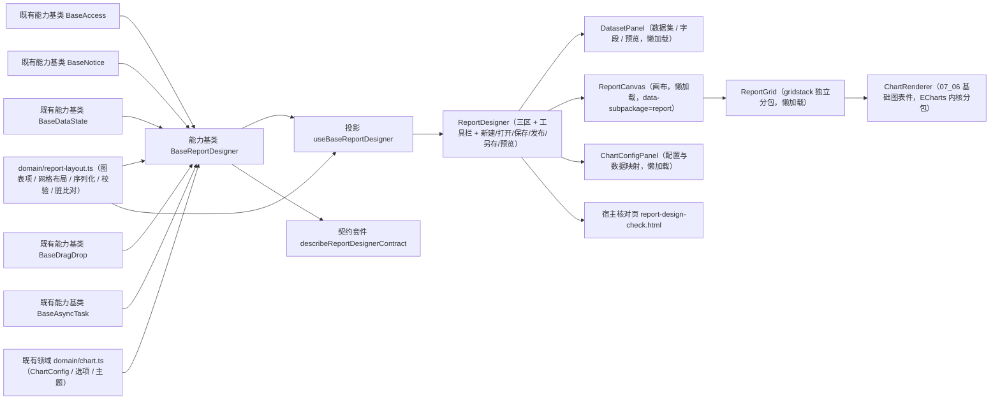

# 01 详细设计 · 报表设计器

> 前端组件库 · 08 交互类 · 09 报表设计器与大屏设计器与播放 · 嵌套子任务 01（需求 08-9）· 详细设计

[文档首页](../../../../../../../文档首页.md) › [08 交互类](../../../08_交互类.md) › [09 报表设计器与大屏设计器与播放](../../08_交互类_09_报表设计器与大屏设计器与播放.md) › 详细设计　|　[← 任务](../08_交互类_09_报表设计器与大屏设计器与播放_01_报表设计器.md)

## 1. 设计目标与范围 <a id="goal"></a>

交付[需求 08-9](../../../../../需求/08_需求_交互类.md#r08-9) 与[子任务 08-9-1](../08_交互类_09_报表设计器与大屏设计器与播放_01_报表设计器.md) 的**报表设计器**：

- **数据集选择与字段映射**：元数据驱动的数据集面板（搜索 / 字段清单 / 参数 / 样例数据预览 / 停用提示）与图表配置面板（类型 / 维度·度量·系列映射 / 常用样式 / 高级配置）。
- **图表配置与实时渲染**：图表配置面板产物落 `ChartConfig`（07_06 领域契约），画布内通过基础图表件 `ChartRenderer`（07_06）实时渲染，色板与主题随令牌。
- **12 列网格布局与画布**：`gridstack` 承载网格拖拽 / 缩放 / 选中联动，图表卡增删 / 复制 / 居中；布局序列化为 `layout`。
- **数据预览与保存发布**：设计态预览取数（只读从库口径，经注入取数函数）、保存 / 发布 / 另存为 / 新建 / 打开 / 预览查看态、脏基线拦截。
- **独立分包**：`gridstack` 经 `ReportGrid` 独立分包懒加载，`ECharts` 复用 `07_06` 内核分包；首屏不加载。

### 1.1 口径与依从 <a id="positioning"></a>

- **架构铁律**：报表设计器编排（数据集取数 / 图表项增删改 / 布局 / 脏基线 / 保存发布）为**横切功能**，落为**继承链上的能力基类** `BaseReportDesigner`（父 `BaseComponent`）+ **领域纯函数** `domain/report-layout.ts`；件层只做渲染与投影。
- **继承链**：`BaseComponent` → 能力基类 `BaseReportDesigner`（依赖 `access` / `notice` / `data-state` / `drag-drop` / `async-task`）→ 具体件（经 `useBaseReportDesigner` 投影挂链）。
- **复用 07_06 渲染契约**：图表配置与选项生成复用核心 `domain/chart.ts`（`ChartConfig` / `buildChartOption` / `buildChartTheme`），画布图表卡复用基础图表件 `ChartRenderer`；**不重定义渲染契约、不重复取色**。
- **对外契约冻结**：`ReportDesigner`（三区 + 工具栏，`08_01_03` 冻结）与 `ReportCanvas`（`data-subpackage="report"`）的导出名、既有 Props / 事件 / 插槽 / `data-test` / 分包入口**保持 `08_01_03` 冻结形状**，本次只**向后兼容新增**可选 Props / 事件 / 插槽。
- **数据通路注入式**：取数 / 保存 / 发布 / 另存为 / 打开处理函数由宿主注入；**未注入即占位**（不发请求、返回 `undefined`、按钮禁用 + 占位文案），与 `08_01_03` 冻结语义一致，真实接口联调随报表 BI 窗口。
- **端范围**：**仅 PC**（`ui-ep`）；移动端不提供设计器（报表查看/数据查询按移动端渲染）。
- **工时**：本子任务 16h；因新增 1 个能力基类、1 份领域纯函数、1 套契约套件、1 套投影、1 个网格分包件与 2 个面板件、宿主核对页与 `gridstack` 依赖接入，实际上浮在实施记录登记。

## 2. 交付物清单 <a id="deliver"></a>

| # | 交付物 | 落点 |
| --- | --- | --- |
| 1 | 报表布局领域纯函数与数据模型（新增） | `core/src/domain/report-layout.ts` |
| 2 | 报表设计器编排能力基类（新增） | `core/src/capabilities/report-designer.ts` |
| 3 | 能力依赖登记（新增 `report-designer` 一键） | `core/src/capabilities/manifest.ts` |
| 4 | 核心导出面登记 | `core/src/index.ts` |
| 5 | 契约套件 `describeReportDesignerContract`（新增） | `core/testing/report-designer.ts`、`core/testing/index.ts` |
| 6 | 核心用例（领域 + 能力基类） | `core/tests/domain-report-layout.spec.ts`、`core/tests/report-designer.spec.ts` |
| 7 | 报表设计器投影（新增） | `ui-ep/src/composables/useBaseReportDesigner.ts` |
| 8 | 报表设计器（迁移 + 真实实现） | `ui-ep/src/components/report/ReportDesigner.vue` |
| 9 | 报表画布（迁移 + 真实实现，独立分包） | `ui-ep/src/components/report/ReportCanvas.vue` |
| 10 | 网格画布（新增，gridstack 独立分包入口） | `ui-ep/src/components/report/ReportGrid.vue` |
| 11 | 数据集面板（新增，独立分包） | `ui-ep/src/components/report/DatasetPanel.vue` |
| 12 | 图表配置面板（新增，独立分包） | `ui-ep/src/components/report/ChartConfigPanel.vue` |
| 13 | 导出面登记（旧路径移除） | `ui-ep/src/index.ts` |
| 14 | 插件依赖（网格内核） | `ui-ep/package.json`（`gridstack`） |
| 15 | 用例（投影 + 四件 + 分包 / 序列化 / 拖拽落点） | `ui-ep/tests/interaction-report-designer.spec.ts` |
| 16 | 宿主核对页（`vite build` 不含） | `apps/desktop/report-design-check.html`、`apps/desktop/src/dev/{reportDesignCheck.ts,ReportDesignCheck.vue}` |
| 17 | 分包命名（gridstack vendor 块） | `apps/desktop/vite.config.ts` |
| 18 | 登记回写（基类清单 / 组件设计 / 上游 / 计划与状态） | 见第 6 节 |



## 3. 接口 / 契约与边界 <a id="contract"></a>

### 3.1 核心：`domain/report-layout.ts`（新增纯函数与数据模型） <a id="domain"></a>

```ts
/** 报表设计权限码。 */
export const REPORT_DESIGN_PERM = 'rpt:design'
/** 报表查看权限码。 */
export const REPORT_VIEW_PERM = 'rpt:view'
/** 报表设计器占位文案。 */
export const REPORT_DESIGNER_PLACEHOLDER_TEXT = '报表设计器未就绪（占位）'
/** 网格列数。 */
export const REPORT_GRID_COLUMNS = 12
/** 图表卡默认尺寸。 */
export const REPORT_DEFAULT_CELL = { w: 6, h: 4 }
/** 图表卡最小 / 最大尺寸。 */
export const REPORT_MIN_CELL = { w: 2, h: 2 }
export const REPORT_MAX_CELL = { w: 12, h: 12 }

/** 数据集字段。 */
export interface ReportField { name: string; type: string }
/** 数据集（与冻结契约同形）。 */
export interface ReportDataset {
  id: string
  code: string
  name: string
  status: 'enabled' | 'disabled'
  fields?: ReportField[]
  /** 数据集声明的参数（设计态可填样例值预览）。 */
  params?: { name: string; label?: string; defaultValue?: unknown }[]
}
/** 图表项（与冻结契约同形；`config` 为 `ChartConfig`）。 */
export interface ReportChartItem {
  id: string
  datasetId: string
  chartType: string
  title?: string
  config?: Record<string, unknown>
  layout: { x: number; y: number; w: number; h: number }
}
/** 报表定义（保存载荷）。 */
export interface ReportDefinition {
  code: string
  name: string
  charts: ReportChartItem[]
}
/** 校验问题。 */
export interface ReportValidationIssue {
  kind: 'empty' | 'unknown-dataset' | 'disabled-dataset' | 'missing-mapping' | 'invalid-config' | 'overlap'
  chartId?: string
  message: string
}
/** 校验结果。 */
export interface ReportValidationResult { valid: boolean; errors: ReportValidationIssue[]; message: string }

normalizeCell(input: unknown): { w: number; h: number }
normalizeChartItem(value: unknown, fieldsByDataset?: Record<string, readonly ReportField[]>): ReportChartItem | undefined
normalizeReportCharts(value: unknown, fieldsByDataset?): ReportChartItem[]
nextChartId(items: readonly ReportChartItem[]): string
addChartItem(items: readonly ReportChartItem[], input: { datasetId: string; chartType: string; id?: string }): ReportChartItem[]
removeChartItem(items: readonly ReportChartItem[], id: string): ReportChartItem[]
updateChartItem(items: readonly ReportChartItem[], id: string, patch: { title?: string; config?: Record<string, unknown>; chartType?: string }): ReportChartItem[]
moveChartItem(items: readonly ReportChartItem[], id: string, x: number, y: number): ReportChartItem[]
resizeChartItem(items: readonly ReportChartItem[], id: string, w: number, h: number): ReportChartItem[]
centerChartItem(items: readonly ReportChartItem[], id: string): ReportChartItem[]
duplicateChartItem(items: readonly ReportChartItem[], id: string, existingDatasets?): ReportChartItem[]
findChartItem(items: readonly ReportChartItem[], id: string): ReportChartItem | undefined
hasOverlap(items: readonly ReportChartItem[], id: string): boolean
countCharts(items: readonly ReportChartItem[]): number
collectUsedDatasets(items: readonly ReportChartItem[]): string[]
fieldsOf(datasets: readonly ReportDataset[], datasetId: string): ReportField[]
datasetOptions(datasets: readonly ReportDataset[]): { value: string; label: string; disabled: boolean }[]
buildItemConfig(item: ReportChartItem, fields: readonly ReportField[]): Record<string, unknown>
resolveChartTitle(item: ReportChartItem): string
validateReport(charts: readonly ReportChartItem[], datasets: readonly ReportDataset[]): ReportValidationResult
serializeReport(code: string, name: string, items: readonly ReportChartItem[]): string
serializeReportLayout(items: readonly ReportChartItem[]): Record<string, unknown>
serializeChartConfigs(items: readonly ReportChartItem[]): Record<string, unknown>
reportChartsEqual(a: readonly ReportChartItem[], b: readonly ReportChartItem[]): boolean
isReportDirty(current: readonly ReportChartItem[], baseline: readonly ReportChartItem[] | undefined): boolean
```

| 行为 | 口径 |
| --- | --- |
| 尺寸归一 | `normalizeCell` 把 `w/h` 夹取到 `[min, max]`（列数上限 12）、取整；缺失回落默认 `6×4` |
| 图表项归一 | `normalizeChartItem`：补 `id`（缺失丢弃 / 空串丢弃）、`datasetId` 必填、`chartType` 未知回落 `line`（复用 `normalizeChartKind`）、`layout` 经归一、`config` 若为对象则原样保留（渲染侧 `normalizeChartConfig` 再归一）；**脏引用（字段清单外）不抛错** |
| 新增 | `addChartItem`：追加一项，`id` 缺省 `chart-{n}` 递增且不冲突，尺寸取默认 `6×4`，位置取下一个空位（12 列内首个可放下位置；放不下则新起一行） |
| 删除 / 复制 | `removeChartItem` 不存在时原样返回（幂等）；`duplicateChartItem` 复制项并偏移定位、新 `id` |
| 移动 / 缩放 | `moveChartItem` / `resizeChartItem` 均夹取（`x∈[0, 12-w]`、`y≥0`、`w/h` 经 `normalizeCell`）；**不可变返回**、目标缺失原样返回 |
| 居中 | `centerChartItem`：`x = floor((12 - w) / 2)`，`y` 保持 |
| 重叠 | `hasOverlap` 判定该项与其它项网格相交；用于**提示不阻断**（设计保存校验把重叠列为 `overlap` 警告项） |
| 字段清单 | `fieldsOf` / `datasetOptions`：停用数据集 `disabled=true`；字段来自 `dataset.fields` |
| 配置生成 | `buildItemConfig`：由项的类型 + 数据集字段生成默认 `ChartConfig`（`defaultMapping`）；`resolveChartTitle` 取 `title` 或 `图表 {id}` |
| 校验 | `validateReport`：空报表 / 数据集不存在 / 数据集停用 / 映射缺失 / 配置非法 / 重叠逐项入 `errors`；`valid` 为 `errors` 为空（重叠为警告，`valid` 仍以阻断项为准——本条按「警告不阻断」口径单独列出） |
| 序列化 | `serializeReportLayout` / `serializeChartConfigs` 产出稳定结构（键序无关）；`serializeReport` 打包 `{ code, name, chart_configs, layout }`；`reportChartsEqual` / `isReportDirty` 经 `stableStringify` 逐字比对 |
| 纯数据 | 不触 DOM、不请求、不依赖渲染框架与第三方库；同输入同输出 |

### 3.2 核心：能力基类 `BaseReportDesigner`（新增） <a id="base"></a>

```ts
/** 设计阶段。 */
export type ReportPhase = 'idle' | 'loading' | 'saving' | 'publishing' | 'done' | 'failed'
/** 取数快照。 */
export interface ReportSnapshot { code: string; name: string; charts?: readonly ReportChartItem[] }
/** 保存结果。 */
export interface ReportSaveResult { recordVersion?: number }
/** 注入的处理函数集（未注入即占位不请求）。 */
export interface ReportJobs {
  load?: (input: { code?: string }) => Promise<ReportSnapshot | undefined>
  save?: (input: ReportDefinition) => Promise<ReportSaveResult | undefined>
  publish?: (input: { code: string }) => Promise<void>
  saveAs?: (input: ReportDefinition) => Promise<ReportSaveResult | undefined>
  preview?: (input: { chartId: string; datasetId: string; params?: Record<string, unknown> }) => Promise<{ columns: ReportField[]; rows: Record<string, unknown>[] } | undefined>
}
/** 脏数据拦截场景。 */
export type ReportBlockAction = 'new' | 'open' | 'leave'

export abstract class BaseReportDesigner extends BaseComponent {
  readonly identifier: string = 'report-designer'
  override readonly depends = ['access', 'notice', 'data-state', 'drag-drop', 'async-task']
  ready = false
  requestCount = 0
  reportCode = ''
  reportName = ''
  datasets: ReportDataset[] = []
  datasetId = ''
  charts: ReportChartItem[] = []
  baseline: ReportChartItem[] | undefined
  selectedId = ''
  phase: ReportPhase = 'idle'
  errorMessage = ''
  jobs: ReportJobs = {}
  access: BaseAccess | undefined
  notice: BaseNotice | undefined
  dataState: BaseDataState | undefined
  drag: BaseDragDrop | undefined
  asyncTask: BaseAsyncTask | undefined

  get degraded(): boolean
  get readonly(): boolean
  get busy(): boolean
  get dirty(): boolean
  get canSave(): boolean
  get validation(): ReportValidationResult
  get selectedItem(): ReportChartItem | undefined
  get currentDataset(): ReportDataset | undefined
  get currentFields(): ReportField[]

  setReady(value: boolean): void
  setJobs(jobs: ReportJobs): void
  setAccess(access: BaseAccess | undefined): void
  setNotice(notice: BaseNotice | undefined): void
  setDataState(state: BaseDataState | undefined): void
  setDrag(drag: BaseDragDrop | undefined): void
  setAsyncTask(task: BaseAsyncTask | undefined): void
  setDatasets(datasets: readonly ReportDataset[]): void
  setReportCode(code: string, name?: string): boolean
  selectDataset(datasetId: string): boolean
  addChart(input: { datasetId?: string; chartType?: string }): ReportChartItem | undefined
  removeChart(id: string): boolean
  duplicateChart(id: string): boolean
  moveChart(id: string, x: number, y: number): boolean
  resizeChart(id: string, w: number, h: number): boolean
  centerChart(id: string): boolean
  selectChart(id: string | null): void
  updateChart(id: string, patch: { title?: string; config?: Record<string, unknown>; chartType?: string }): boolean
  markBaseline(): void
  discard(): boolean
  needsBlock(action: ReportBlockAction): boolean
  load(input?: { code?: string }): Promise<ReportSnapshot | undefined>
  preview(chartId: string, params?: Record<string, unknown>): Promise<{ columns: ReportField[]; rows: Record<string, unknown>[] } | undefined>
  save(): Promise<ReportSaveResult | undefined>
  publish(): Promise<boolean>
  saveAs(code: string, name?: string): Promise<ReportSaveResult | undefined>
}
```

| 行为 | 口径 |
| --- | --- |
| 占位语义 | `ready === false` → `degraded` / `readonly` 为真；取数 / 预览 / 保存 / 发布 / 另存 **零请求**（`requestCount` 恒 0），保持 `08_01_03` 冻结口径 |
| 只读 | `readonly = !ready ∨ 未持 REPORT_DESIGN_PERM`；只读时结构操作返回 `false` / `undefined` 且不改状态（**不写脏**） |
| 取数 | `load` 未注入 / 未就绪 → 占位不动作；注入后调 `jobs.load`，装载 `code` / `name` / `charts`（经 `normalizeReportCharts`）并 `markBaseline()`；`requestCount += 1`；失败置 `failed` + `errorMessage` |
| 结构操作 | 全部经 `domain/report-layout.ts` 改写 `charts` 并 `notifyLifecycle('update')`；成功即刷新 `dirty`；只读 / 占位时不动作 |
| 拖拽 | `moveChart` / `resizeChart` 接件层适配后的落点，经领域函数落点后 `drag.emitDrag({ phase: 'drop', ... })` 广播（未注入仍完成落点） |
| 数据预览 | `preview` 取当前项数据集字段；未就绪 / 未注入 → 不请求；注入后取数（只读从库口径），仅用于设计态预览展示 |
| 脏基线 | `markBaseline` 记当前图表项集；`dirty = isReportDirty(charts, baseline)`；`discard` 回滚到基线并清脏 |
| 拦截 | `needsBlock(action)`：`dirty` 为真返回 `true`；件层上抛 `dirty-block`（含 `action`），宿主决定确认策略 |
| 切换报表 | `setReportCode`：脏时**不切换**返回 `false`；通过后清选中 / 清基线 / 重置数据集 |
| 保存 | `canSave` = 就绪 ∧ 可编辑 ∧ `validation.valid`；覆盖式提交 `ReportDefinition`；成功后 `markBaseline()`、`phase='done'`、提示「已保存」；失败保留本地与脏标记 |
| 发布 | 保存成功后触发（件层「发布」先 `save()`，失败不发 `publish`）；`phase='publishing'` → 调处理函数 → `phase='done'` |
| 另存为 | `saveAs(code,name)`：以当前图表项新建报表定义并提交（保留当前编辑态） |
| 防重复 | `busy` 期间动作直接返回 `undefined` / `false`（件层同时禁用按钮） |
| 纯数据 | 不触 DOM、不请求；状态变更经生命周期 `update` 通知 |

- 依赖登记：`report-designer: ['access', 'notice', 'data-state', 'drag-drop', 'async-task']`。
- 不含：图表渲染内核（`ChartRenderer` + `echartsKernel`）、网格内核（`ReportGrid` + `gridstack`）、数据集 SQL 建模与安全执行（后端）、报表查看页参数逻辑（页面）、大屏自由画布（`08-9-2`）。

### 3.3 核心：契约套件 `describeReportDesignerContract`（`@bms/core/testing`） <a id="testing"></a>

| 契约面（结构化接口） | 断言要点 |
| --- | --- |
| `ready` / `degraded` / `readonly` / `busy` / `dirty` / `phase` / `requestCount` / `charts()` / `selectedId` / `validation()` | 未就绪占位为零请求；就绪但未注入处理函数仍零请求；只读下结构操作不动作不写脏 |
| `setReady` / `setJobs` / `setDatasets` / `setReportCode` / `selectDataset` / `addChart` / `removeChart` / `duplicateChart` / `moveChart` / `resizeChart` / `centerChart` / `selectChart` / `updateChart` / `markBaseline` / `discard` / `needsBlock` / `load` / `preview` / `save` / `publish` / `saveAs` | 取数装载与基线；增删改与网格夹取；选择联动；脏判定与拦截；保存成功清脏、失败保留；发布依赖保存；另存为新定义；预览不越权；防重复提交 |

- 契约目标约定：数据集 `d1`（含 `month`/`receipt` 字段），`charts` 初始一项；处理函数集返回快照与保存结果；核心用例与 `ui-ep` 用例共用同一套断言。

### 3.4 插件层：投影 `useBaseReportDesigner`（新增） <a id="projection"></a>

```ts
export interface UseBaseReportDesignerOptions {
  ready?: boolean
  reportCode?: string
  reportName?: string
  datasets?: readonly ReportDataset[]
  charts?: readonly ReportChartItem[]
  selectedId?: string
  jobs?: ReportJobs
  access?: BaseAccess
  notice?: BaseNotice
  dataState?: BaseDataState
  drag?: BaseDragDrop
  asyncTask?: BaseAsyncTask
}
export interface UseBaseReportDesignerResult {
  designer: BaseReportDesigner
  ready: Ref<boolean>
  degraded: Ref<boolean>
  readonly: Ref<boolean>
  busy: Ref<boolean>
  dirty: Ref<boolean>
  phase: Ref<ReportPhase>
  datasets: Ref<ReportDataset[]>
  charts: Ref<ReportChartItem[]>
  selectedId: Ref<string>
  selectedItem: Ref<ReportChartItem | undefined>
  validation: Ref<ReportValidationResult>
  errorMessage: Ref<string>
  setReady(value: boolean): void
  setJobs(jobs: ReportJobs): void
  setDatasets(datasets: readonly ReportDataset[]): void
  setReportCode(code: string, name?: string): boolean
  selectDataset(datasetId: string): boolean
  addChart(input?: { datasetId?: string; chartType?: string }): ReportChartItem | undefined
  removeChart(id: string): boolean
  duplicateChart(id: string): boolean
  moveChart(id: string, x: number, y: number): boolean
  resizeChart(id: string, w: number, h: number): boolean
  centerChart(id: string): boolean
  selectChart(id: string | null): void
  updateChart(id: string, patch: { title?: string; config?: Record<string, unknown>; chartType?: string }): boolean
  markBaseline(): void
  discard(): boolean
  needsBlock(action: ReportBlockAction): boolean
  load(input?: { code?: string }): Promise<ReportSnapshot | undefined>
  preview(chartId: string, params?: Record<string, unknown>): Promise<{ columns: ReportField[]; rows: Record<string, unknown>[] } | undefined>
  save(): Promise<ReportSaveResult | undefined>
  publish(): Promise<boolean>
  saveAs(code: string, name?: string): Promise<ReportSaveResult | undefined>
}
```

- 薄适配（核心实例 ↔ Vue 响应式）；协作者经 `markRaw(toRaw(x))` 隔离；`onScopeDispose` 解除订阅并 `dispose`。

### 3.5 插件层：件族（`ui-ep/src/components/report/`） <a id="components"></a>

件族迁入专题目录 `ui-ep/src/components/report/`（同 `form-design/`、`chart/` 先例），**对外导出名、既有 Props / 事件 / 插槽 / `data-test` / 分包入口不变**，旧路径 `components/interaction/ReportDesigner.vue`、`ReportCanvas.vue` 删除。

#### 3.5.1 `ReportDesigner.vue`（迁移 + 真实实现） <a id="c-designer"></a>

| 面 | 内容 |
| --- | --- |
| 数据面（既有，保持） | `ready`（缺省 `false`）/ `reportCode` / `datasets` / `charts` / `selectedId` / `dirty` / `readOnly` / `degradeText` |
| 数据面（新增，全部可选） | `reportName` / `datasetId` / `jobs` / `access` / `notice` / `dataState` / `drag` / `asyncTask` |
| 事件（既有，保持） | `change` / `select` / `add-chart` / `remove-chart` / `save` / `publish` / `save-as` / `preview` / `retry` |
| 事件（新增） | `new` / `open`（`{ code }`）/ `loaded`（`ReportSnapshot`）/ `saved`（`ReportSaveResult`）/ `failed`（`{ message }`）/ `dirty-block`（`{ action }`）/ `dataset-change`（`datasetId`）/ `chart-update`（`{ id, patch }`） |
| 插槽（既有，保持） | `degrade` / `empty` / `live` / `toolbar` / `dataset-panel` / `config-panel` |
| 插槽（新增） | `report-list`（报表定义列表抽屉，宿主自备） |
| `data-test`（既有，保持） | `placeholder` / `toolbar` / `report-code` / `save` / `publish` / `save-as` / `preview` / `dirty` / `dataset-panel` / `dataset-{id}` / `canvas` / `config-panel` / `config-selected` / `config-empty` |
| `data-test`（新增） | `new` / `open` / `report-name` / `readonly-hint` / `validation-error` |

**事件与注入双轨**：点击一律**保留既有事件上抛**；**仅当宿主注入 `jobs`** 时件内才驱动真实编排（避免重复执行）。现有冻结用例（未注入 `jobs`）断言不变即通过。

**取值口径**：`readOnly` 受控优先；就绪 / 降级由 `BaseReportDesigner` 与 `useInteractionPlaceholder` 共同决定（降级仍用占位语义）；三区布局（左数据集面板 / 中画布 / 右配置面板）由 `dataset-panel` / `canvas` / `config-panel` 插槽承载，缺省渲染三个懒加载件。

#### 3.5.2 `ReportCanvas.vue`（迁移 + 真实实现，独立分包） <a id="c-canvas"></a>

| 面 | 内容 |
| --- | --- |
| 数据面（既有，保持） | `charts` / `selectedId` / `readOnly` |
| 数据面（新增，可选） | `datasets` / `dirty` |
| 事件（既有，保持） | `select`（`id`）/ `remove-chart`（`id`） |
| 事件（新增） | `move-chart`（`{ id, x, y }`）/ `resize-chart`（`{ id, w, h }`）/ `duplicate-chart`（`id`）/ `center-chart`（`id`）/ `update-chart`（`{ id, patch }`） |
| `data-test`（既有，保持） | `report-canvas`（`data-subpackage="report"`）/ `canvas-empty` / `chart-{id}`（`data-selected`）/ `remove-{id}` |
| `data-test`（新增） | `chart-duplicate-{id}` / `chart-center-{id}` / `chart-resize-{id}` / `chart-renderer-{id}` |

- **网格**：由 `ReportGrid`（gridstack 独立分包）承载 12 列网格，卡片内渲染基础图表件 `ChartRenderer`（复用 07_06 ECharts 分包）；拖拽 / 缩放结束上抛落点，由设计器经领域函数回写并广播。
- **选中联动**：点击卡片选中并高亮（`data-selected`）；卡头操作（复制 / 居中 / 删除）。
- **空态**：无图表时渲染 `canvas-empty`（占位 + 「添加图表」入口）。
- **只读**：`readOnly` 时禁拖拽 / 缩放与卡头操作。

#### 3.5.3 `ReportGrid.vue`（新增，gridstack 独立分包入口） <a id="c-grid"></a>

| 面 | 内容 |
| --- | --- |
| 数据面 | `charts` / `selectedId` / `readOnly` / `columns`（缺省 12）/ `datasets` |
| 事件 | `select` / `remove-chart` / `duplicate-chart` / `center-chart` / `move-chart` / `resize-chart` |
| `data-test` | `report-grid`（`data-subpackage="gridstack"`）/ `grid-item-{id}` |

- **gridstack 唯一落点**：`import 'gridstack/dist/gridstack.min.css'` + `import { GridStack } from 'gridstack'`（**本件为独立分包入口**，静态引入使 gridstack 落于本异步块、不进首屏）；实例挂载 / 更新 / 销毁（`destroy`）与容器尺寸重算（网格缩放结束由 gridstack 事件触发，件内不逐帧刷新）。
- **载荷**：`change` 事件适配为 `{ id, x, y, w, h }` 落点，经领域函数回写；`readOnly` 时 `disable()`。
- jsdom 用例对 gridstack 行为以适配桩核验（真实拖拽由浏览器核对页验证）。

#### 3.5.4 `DatasetPanel.vue`（新增，独立分包） <a id="c-dataset"></a>

| 面 | 内容 |
| --- | --- |
| 数据面 | `datasets` / `datasetId` / `readOnly` / `previewColumns` / `previewRows` / `previewLoading` |
| 事件 | `update:datasetId` / `preview`（`{ datasetId, params }`）/ `select-field`（`{ datasetId, field }`） |
| `data-test` | `dataset-panel` / `dataset-search` / `dataset-{id}`（`data-status`）/ `field-{name}` / `dataset-params` / `preview-table` / `preview-empty` / `dataset-disabled-hint` |

- 数据集搜索（编码 / 名称）、字段清单（名称 · 类型）、参数样例值、样例数据预览（`{ columns, rows }`）、**停用数据集不可选并提示**。
- 字段点击上抛，供配置面板做数据映射。

#### 3.5.5 `ChartConfigPanel.vue`（新增，独立分包） <a id="c-config"></a>

| 面 | 内容 |
| --- | --- |
| 数据面 | `item`（当前图表项）/ `fields`（当前数据集字段）/ `readOnly` / `disabled` |
| 事件 | `update`（`{ patch }`）/ `preview-data`（`{ chartId }`） |
| `data-test` | `chart-config-panel` / `config-empty` / `config-type` / `config-title` / `config-dimension` / `config-metrics` / `config-series` / `config-legend` / `config-axis-name` / `config-smooth` / `config-stacked` / `config-label` / `config-palette` / `config-override` / `config-error` |

- 图表类型（全场景，对齐 `CHART_KINDS`）、标题、**维度 / 度量（多选）/ 系列**映射、常用样式（图例 / 轴名 / 平滑 / 堆叠 / 数据标注 / 色板序号）、高级配置 JSON（非法忽略并提示）。
- 配置产物经 `normalizeChartConfig` 归一为 `ChartConfig` 写入图表项 `config`；实时联动画布。

### 3.6 分包入口与依赖 <a id="chunk"></a>

| 入口 | 宿主 | 说明 |
| --- | --- | --- |
| `ReportCanvas` | `ReportDesigner` | 画布（`data-subpackage="report"`） |
| `ReportGrid`（gridstack 独立分包） | `ReportCanvas` | gridstack 网格内核；静态引入 gridstack，本件为独立异步块 |
| `DatasetPanel` / `ChartConfigPanel` | `ReportDesigner` | 数据集面板 / 图表配置面板（各自独立分包懒加载） |
| `ChartRenderer`（ECharts 内核分包） | `ReportGrid` | 复用 07_06 基础图表件 |

- 四个懒加载件均用 `defineAsyncComponent(() => import(...))`；`ReportGrid` / `DatasetPanel` / `ChartConfigPanel` **不进 `ui-ep` 根出口**（否则静态引入使动态导入无法分包）；用例用 `vi.dynamicImportSettled()` 等待解析。
- `apps/desktop/vite.config.ts` `manualChunks` 为 `gridstack` 命名独立 vendor 块（异步块，不进首屏）。
- 新增依赖：`gridstack@^13.3.0`（npmmirror 源）；**不进核心**。

### 3.7 宿主核对页 <a id="check"></a>

`apps/desktop/report-design-check.html` + `src/dev/{reportDesignCheck.ts,ReportDesignCheck.vue}`（`vite build` 不含）。自检项 12 项：

1. 三区渲染（数据集面板 / 画布 / 配置面板）与占位降级；
2. 数据集搜索与停用数据集不可选提示；
3. 字段清单与样例数据预览；
4. 新增图表卡（选数据集 + 类型）与默认网格落位；
5. 图表配置（类型 / 标题 / 维度·度量·系列；
6. 常用样式（图例 / 轴名 / 平滑 / 堆叠 / 标注 / 色板）与高级配置 JSON 覆盖；
7. 网格拖拽 / 缩放落点回写与选中联动；
8. 复制 / 居中 / 删除图表卡；
9. 数据预览取数（只读从库口径）与停用数据集校验拦截；
10. 脏基线（改动置脏、撤销回不脏）；
11. 保存 / 发布 / 另存为（幂等覆盖式）与失败保留本地；
12. 新建 / 打开（脏数据拦截）与分包（gridstack / ECharts 独立块）。

以 chromium headless `--dump-dom` 核验；懒加载件以 `waitFor` 轮询等待到位后再断言。

## 4. 失败分支与边界 <a id="edge"></a>

| 边界 / 失败场景 | 处置 |
| --- | --- |
| 数据通路未就绪（`ready` 为假） | 占位：降级 + 禁用 + 取数 / 保存 / 发布零请求（保持 `08_01_03` 冻结口径） |
| 处理函数未注入 | 占位：不请求、返回 `undefined` / `false`；按钮禁用 + 占位文案 |
| 无 `rpt:design` | 只读：结构操作不动作、保存 / 发布 / 另存禁用 |
| 数据集停用 / 不存在 | 不可选并提示；已引用的图表项校验报「数据集停用 / 不存在」 |
| 字段映射缺失 | 校验项 `missing-mapping`，保存拦截并提示 |
| 配置非法（高级 JSON） | 忽略覆盖并提示（保留主题与生成结果） |
| 空报表 | 校验项 `empty`，保存拦截（画布空态 + 添加入口） |
| 多图表重叠 | 提示不阻断（网格约束）；校验列为警告 |
| 网格越界（x/y/w/h） | 领域函数夹取（`x∈[0, 12-w]`） |
| 脏数据下新建 / 打开 / 离开 | `needsBlock` 为真 → 件层上抛 `dirty-block`，宿主确认后再 `discard` 重试 |
| 保存失败 | `phase='failed'` + `errorMessage`，保留本地与脏标记可重试 |
| 保存 / 发布进行中重复提交 | `busy` 期间返回 `undefined` / `false`，件层禁用按钮 |
| 预览取数失败（90001 / 90003 / 90005 / 90006） | 预览区错误提示（按 i18n `error.900xx`），不影响画布 |
| 懒加载分包件 / gridstack 加载失败 | 降级提示（沿用反馈件口径） |
| 移动端 | 不提供设计器 |

## 5. 测试设计与验收映射 <a id="test"></a>

| 验收点（需求 08-9 / 子任务 08-9-1） | 用例 |
| --- | --- |
| 图表项归一、新增 / 删除 / 复制、网格移动 / 缩放夹取 / 居中 / 重叠 | `core/tests/domain-report-layout.spec.ts` |
| 字段与数据集选项（停用不可选）、配置生成、校验、序列化与脏比对 | 同上 |
| 设计器编排：占位零请求、就绪门控、取数装载与基线、结构操作、脏拦截、保存发布另存、预览、防重复 | `core/tests/report-designer.spec.ts` + `describeReportDesignerContract` |
| 契约套件（同契约多实现） | `describeReportDesignerContract`（核心 + `ui-ep` 适配） |
| 投影薄适配 | `ui-ep/tests/interaction-report-designer.spec.ts` |
| 四件真实实现：三区渲染、数据集选择与停用提示、新增图表、配置与映射、视图联动、拖拽落点、复制居中删除、脏拦截、保存发布另存 | 同上 |
| 分包边界（`data-subpackage="report"` / `gridstack`，`vi.dynamicImportSettled`） | 同上 |
| 既有 `interaction-placeholder-3.spec.ts`（`08_01_03` 冻结契约） | 未改动即通过 |
| 能力登记对账 / 注释 / 核心框架无关 / 组件挂链 | `guard-manifest.spec.ts`、`guard-jsdoc.spec.ts`、`guard-core-framework-agnostic.spec.ts`、`guard-component-inheritance.spec.ts` |
| 开发态核对页 12 项自检 | chromium headless `--dump-dom` |
| `vue-tsc`、ESLint、Vitest 全通过 | 根 `pnpm run check` + 宿主 `vue-tsc -b` / `lint` / `test` / `build` / `budget` |
| 文档链接与基座校验 | `check-links.py`、`check-base.py` |

- 既有 `ui-ep/tests/interaction-placeholder-3.spec.ts`（`08_01_03` 冻结契约）**不得改动**，须原样通过。
- Kiwi 用例 1 条（一任务一条，编号于测试步登记后回填；分类「平台骨架」、优先级 P2、状态 `CONFIRMED`、标签「自动化」）。

## 6. 登记落点 <a id="register"></a>

| 内容 | 落点 |
| --- | --- |
| 新增能力基类 `BaseReportDesigner`（能力键 `report-designer`，父 `BaseComponent`，依赖 `access` / `notice` / `data-state` / `drag-drop` / `async-task`） | 《[前端基类清单](../../../../../../../前端基类清单.md)》§2.1 插入行 + §2 继承链总览 + §5.2 能力基类表 + `capabilities/manifest.ts` |
| 领域纯函数 `domain/report-layout.ts` | 同上 §9「核心」（`domain/`） |
| 契约套件 `describeReportDesignerContract` | 同上 §9（`core/testing/`） |
| 投影 `useBaseReportDesigner`、件族 `components/report/`（五件） | 同上 §9「PC 插件」 |
| 组件设计回写（3 项） | 《组件设计 · 报表设计器》§10.2：① 报表设计器交互与配置结构 → 《概要设计 · 报表中心》「数据模型与表设计」「接口设计」；② 设计器与图表渲染共用与分包 → 《架构设计 · 报表BI》《架构设计 · 前端架构》「技术要点」「前端性能」；③ 预览取数与数据范围口径 → 《概要设计 · 报表中心》「业务规则」 |
| 任务 / 父任务 / 域任务 / 计划状态 | [任务](../08_交互类_09_报表设计器与大屏设计器与播放_01_报表设计器.md)、[父任务](../../08_交互类_09_报表设计器与大屏设计器与播放.md)、[计划](../../../../../计划/01_计划_前端组件库.md) |

## 7. 边界与开放项 <a id="open"></a>

- **不在本期**：真实接口联调（报表定义取数 / 保存 / 发布 / 另存 / 数据集取数预览，随报表 BI 窗口）；大屏设计器与播放（`08-9-2`）；报表查看页参数逻辑（页面）；数据集 SQL 建模与安全执行（后端）；移动端设计器。
- **协同契约**：取数 / 保存 / 发布 / 另存 / 预览处理函数由宿主注入；权限上下文与提示由宿主注入；**未注入即占位零请求**。
- **复用 07_06**：图表配置 `ChartConfig` / 选项生成 / 主题 / 基础图表件由 07_06 前置交付；本任务不重定义渲染契约，避免两处漂移。
- **gridstack**：本期唯一新增运行时依赖；网格拖拽 / 缩放真实行为由浏览器核对页核验，jsdom 用例经适配桩断言载荷。
- **Kiwi 用例编号**：本任务平台登记后回填代码 `// kiwi_id: <编号>` 与实施 / 测试记录。

## 8. 决策记录 <a id="decision"></a>

| # | 决策项 | 结论 |
| --- | --- | --- |
| 1 | 实施窗口 | 现在推进（前端真实实现 + 注入式数据通路；真实联调归口报表 BI 窗口），前置 07_06 已交付 |
| 2 | 编排落点 | 新增能力基类 `BaseReportDesigner` + 领域纯函数 `domain/report-layout.ts` + 契约套件 |
| 3 | 依赖登记 | 父 `BaseComponent`，依赖 `access` / `notice` / `data-state` / `drag-drop` / `async-task` |
| 4 | 网格内核 | `gridstack`（12 列），经 `ReportGrid` 异步件独立分包 |
| 5 | 图表渲染 | 复用 07_06 `ChartRenderer` + `echartsKernel`（ECharts 独立分包），不重复取色与渲染 |
| 6 | 图表类型与应用 | 与图表卡类型集对齐（全场景），数据映射完整（维度 / 多度量 / 系列） |
| 7 | 件族落点 | 迁入专题族 `ui-ep/src/components/report/`（`ReportDesigner` / `ReportCanvas` 迁移；新增 `ReportGrid` / `DatasetPanel` / `ChartConfigPanel`），对外契约不变 |
| 8 | 工具栏 | 对齐原型 + 组件设计：新建 / 打开（新增可选事件 + `report-list` 插槽）/ 添加图表 / 预览 / 保存 / 发布 / 另存为 |
| 9 | 分包入口 | `ReportCanvas`（`data-subpackage="report"`）+ `ReportGrid`（gridstack）+ 两个面板件独立分包 |
| 10 | 上游回写 | 本次一并回写组件设计 §10.2 三项 + 架构 / 概要同步 |
| 11 | 本次范围 | 仅 08-9-1；`08-9-2` 大屏设计器与播放随后单独设计与提交 |

## 9. 参考文档 <a id="ref"></a>

- [需求 08-9](../../../../../需求/08_需求_交互类.md#r08-9)、[任务 08-9-1](../08_交互类_09_报表设计器与大屏设计器与播放_01_报表设计器.md)、[父任务](../../08_交互类_09_报表设计器与大屏设计器与播放.md)
- 《组件设计》[08 报表设计器](../../../../../../../设计/组件设计/08_交互类/08_组件设计_报表设计器/08_组件设计_报表设计器.md)（含[可交互原型](../../../../../../../设计/组件设计/08_交互类/08_组件设计_报表设计器/08_原型设计_报表设计器.html)，原型即验收基准）
- 《概要设计》[报表中心](../../../../../../../设计/概要设计/27_概要设计_报表中心.md)、《架构设计》[报表 BI](../../../../../../../设计/架构设计/23_架构设计_子系统_报表BI.md)、[前端架构](../../../../../../../设计/架构设计/08_架构设计_前端架构.md)、[前端组件体系](../../../../../../../设计/架构设计/05_架构设计_前端组件体系.md)
- [《前端基类清单》](../../../../../../../前端基类清单.md)、《[前端开发规范](../../../../../../../规范/前端开发规范.md)》、《[文档生成规范](../../../../../../../规范/文档生成规范.md)》
- [08_01_03 报表大屏与 AI 占位](../../../08_交互类_01_占位版交付/08_交互类_01_占位版交付_03_报表大屏与AI占位/08_交互类_01_占位版交付_03_报表大屏与AI占位.md)（冻结对外契约与占位语义）、[07_06 图表卡](../../../../07_展示类/07_展示类_06_图表卡/07_展示类_06_图表卡.md)（前置交付：`BaseChart` / `ChartRenderer` / `echartsKernel`）

> 本文档依《[文档生成规范](../../../../../../../规范/文档生成规范.md)》编写
