# 02 实施 · 大屏设计器与播放

> 前端组件库 · 08 交互类 · 09 报表设计器与大屏设计器与播放 · 嵌套子任务 02（需求 08-9）· 实施记录

[文档首页](../../../../../../../文档首页.md) › [08 交互类](../../../08_交互类.md) › [09 报表设计器与大屏设计器与播放](../../08_交互类_09_报表设计器与大屏设计器与播放.md) › 实施记录　|　[← 详细设计](../设计/02_详细设计_02_大屏设计器与播放.md)　[测试记录 →](../测试/02_测试_02_大屏设计器与播放.md)

## 1. 实施信息 

| 项 | 值 |
| --- | --- |
| 任务 | 08-9-2 大屏设计器与播放（[任务](../08_交互类_09_报表设计器与大屏设计器与播放_02_大屏设计器与播放.md)） |
| 对应需求 | [08-9](../../../../../需求/08_需求_交互类.md#r08-9) |
| 详细设计 | [02_详细设计_02_大屏设计器与播放.md](../设计/02_详细设计_02_大屏设计器与播放.md)（定稿提交 `f7de9c22`） |
| 前置任务 | [08_09_01 报表设计器](../../08_交互类_09_报表设计器与大屏设计器与播放_01_报表设计器/08_交互类_09_报表设计器与大屏设计器与播放_01_报表设计器.md)（同族先例）、[07_06 图表卡](../../../../07_展示类/07_展示类_06_图表卡/07_展示类_06_图表卡.md)（`BaseChart` / `ChartRenderer` / `echartsKernel` 已交付） |
| 实施日期 | 2026-09-20 |
| 实施人 | minjian |
| 实施环境 | Ubuntu 开发机 · Node（workspace `@bms/core` + `@bms/ui-ep` + `apps/desktop`）· Vitest 5 / jsdom · Vue 3.5 / TypeScript 严格模式 · chromium headless（核对页） |
| Kiwi 用例 | 777（分类「平台骨架」/ P2 / CONFIRMED / 标签「自动化」） |
| 提交 | 见任务收尾提交（feat `ef1e4c5e`） |
| 结论 | 完成标准达标（设计器可配置并保存发布、播放器多页轮播与自适应正常、分包生效；核对页 12/12） |

```mermaid
flowchart LR
    A["Kiwi 用例登记（777）"] --> B["核心领域 screen-layout / screen-play（页面 · 组件 · 画布 · 轮播 · 缩放）"]
    B --> C["能力基类 BaseScreenDesigner（编排 / 占位 / 只读 / 预览 / 保存发布另存）"]
    B --> D["能力基类 BaseScreenPlayer（定义取数 / 轮播 / 按组件取数 / 自适应）"]
    C --> E["契约套件 describeScreenDesignerContract"]
    D --> F["契约套件 describeScreenPlayerContract"]
    E --> G["《前端基类清单》登记（53/54）+ 依赖表新增两键"]
    F --> G
    G --> H["投影 useBaseScreenDesigner / useBaseScreenPlayer"]
    H --> I["专题族七件：ScreenDesigner / ScreenCanvas / ScreenPlayer / ScreenStage / ComponentPalette / ScreenPropertyPanel / ScreenWidget"]
    I --> J["vue-flow 单一落点 utils/vueFlow.ts（独立分包）+ 复用 07_06 ChartRenderer / 07_01 DataTable"]
    J --> K["导出面登记（旧路径移除）"]
    K --> L["用例（核心 + ui-ep）与宿主核对页 12/12"]
    L --> M["门禁验证（根 check + 宿主 lint / test / build / budget + 基座校验）"]
    M --> N["登记回写（基类清单 / 组件设计三项上游 / 计划与状态）"]
```

## 2. 实施概览 

结果小结：新增 2 份领域纯函数、2 个能力基类、2 套契约套件、2 套投影、7 件组件（4 迁移 + 3 新增，含 vue-flow 与播放舞台两个独立分包入口）与 `utils/vueFlow.ts`；`core` 62 文件 / 739 用例、`ui-ep` 47 文件 / 604 用例全绿（本次新增 4 文件 / 50 条 + 1 文件 / 38 条）。

## 3. 实施过程 

1. **Kiwi 先行**：经容器内 Django shell 登记用例，取得编号 **777**（平台既有编号至 776）；四个用例文件首行标注 `// kiwi_id: 777`。
2. **依赖引入**：`ui-ep` 新增 `@vue-flow/core@^1.48.2` / `@vue-flow/background@^1.3.2` / `@vue-flow/controls@^1.1.3`（npmmirror 源）；`ECharts` 复用 07_06 已引入的分包内核、通用表格复用 07_01。
3. **核心领域**（`core/src/domain/screen-layout.ts`、`screen-play.ts`）：权限码 / 占位文案 / 分辨率与尺寸常量；`ScreenPage` / `ScreenComponent`（与 `08_01_03` 冻结契约同形 + 向后兼容可选 `config` / `props` / `style`）/ `ScreenCanvasConfig` / `ScreenDefinition` / 校验类型；纯函数：分辨率 / 画布 / 页 / 组件归一（未知类型回落 `text` / 缺标识丢弃 / 最小尺寸夹取）、组件增删改与移动缩放、层级重排（`z = 1..n`）、页增删改移与设默认页（保底一页）、组件面板分组、越界 / 停用数据集 / 缺映射校验（`overflow` 为警告不阻断）、`canvas_config` 序列化与稳定脏比对；播放领域：轮播切页（环回 / 端点）、单页时长、间隔归一、CSS transform 等比 `contain` / `cover` 缩放。
4. **能力基类**（`core/src/capabilities/screen-designer.ts`、`screen-player.ts`）：设计器键 `screen-designer`（父 `BaseComponent`，依赖 `access` / `notice` / `data-state` / `drag-drop` / `async-task`）——占位零请求、只读不动作不写脏、取数装载与基线、页面与组件结构操作、层级重排、拖拽落点广播 `drop`、预览取数（只读从库口径）、保存 / 发布 / 另存为、脏基线与拦截、防重复；播放器键 `screen-player`（父 `BaseComponent`，依赖 `access` / `notice` / `data-state` / `async-task`）——占位零请求、定义装载、多页环回切页、播放态与间隔归一、**按组件并行取数与整页刷新（单组件失败不阻断）**、查看权限门控。
5. **契约套件**（`core/testing/screen-designer.ts`、`screen-player.ts`）：`describeScreenDesignerContract`（12 条）与 `describeScreenPlayerContract`（8 条）+ 处理函数桩；核心用例 4 文件 50 条（含契约驱动）。
6. **登记**：`CAPABILITY_MANIFEST` 新增 `screen-designer` / `screen-player` 两键；核心导出面新增两能力基类与全部领域导出（`nextPageId` 生成器与导航函数消歧：生成器导出为 `nextScreenPageId`，导航 `nextPageId` / `prevPageId` 保留原名；`collectUsedDatasets` 与报表领域同名，导出为 `collectUsedScreenDatasets`）；《前端基类清单》§2.1 插入行（**编号 53 / 54**，父 `BaseComponent`、「已交付」，其后 53~79 顺延为 55~81）+ §2 继承链总览 + §5.2 能力基类表 + §9「PC 插件」补 `components/screen/`、两投影与 `utils/vueFlow.ts`。
7. **投影**（`ui-ep/src/composables/useBaseScreenDesigner.ts`、`useBaseScreenPlayer.ts`）：薄适配（`markRaw(toRaw(x))` 隔离；`onScopeDispose` 解除订阅并 `dispose`）。
8. **专题族七件**（`ui-ep/src/components/screen/`）：
   - `ScreenDesigner`（迁移 + 真实实现）：三区 + 工具栏（新建 / 打开 / 新增页 / 保存 / 发布 / 预览播放 / 多页）+ 内置预览舞台 + 脏拦截上抛；**对外契约保持 `08_01_03` 冻结形状**，仅向后兼容新增可选 Props（`screenName` / `canvas` / `datasets` / `jobs` / `access` / `notice`）、事件（`new` / `open` / `loaded` / `saved` / `failed` / `dirty-block` / `page-add` / `page-remove` / `page-rename` / `component-update` / `canvas-change` / `dataset-preview`）与插槽（`screen-list`）；`defineExpose` 暴露设计器实例供核对与调试；事件与注入双轨；
   - `ScreenCanvas`（迁移 + 真实实现，**vue-flow 独立分包入口**）：经 `utils/vueFlow.ts` 动态装载 vue-flow（`ResizeObserver` 不可用或装载失败则降级为普通绝对定位列表并置 `data-degraded`），节点拖拽 `node-drag-stop` 上抛落点、右下角手柄指针缩放、选中联动；旧路径 `components/interaction/ScreenCanvas.vue` 删除；
   - `ScreenPlayer`（迁移 + 真实实现）：控制条 + 多页圆点 + 自适应舞台；`setTimeout` 按**单页停留时长**调度轮播，`visibilitychange` 暂停调度；按组件取数随切页刷新；全屏切换；事件与注入双轨；
   - `ScreenStage`（迁移 + 真实实现，**播放舞台独立分包入口**）：按设计分辨率绝对定位 + `computeScale` 等比 `contain` CSS transform 自适应，经 `ResizeObserver` 重算，当前页只渲染当前页组件；
   - `ComponentPalette`（新增，同步件）：按分组渲染七类组件，点击 / 拖拽上抛，只读禁用；
   - `ScreenPropertyPanel`（新增，同步件）：选中组件的位置 / 尺寸 / 层级 / 类型 / 文案 / 数据集 / 图表类型，未选中时画布级分辨率 / 背景 / 主题；
   - `ScreenWidget`（新增，按类型分发）：`chart` → 07_06 `ChartRenderer`、`table` → 07_01 通用表格、`metric` / `text` / `image` / `time` / `decor` 轻量自绘。
9. **分包与导出**：`ScreenCanvas` 保持 `data-subpackage="screen"`、`ScreenStage` 保持 `data-subpackage="screen-player"`；`utils/vueFlow.ts` 为 `@vue-flow/*` 唯一落点；`apps/desktop/vite.config.ts` 为 `@vue-flow/*` 命名独立 `vendor-vue-flow` 块（异步块，不进首屏）；导出面由 `components/interaction/Screen*.vue` 改为 `components/screen/Screen*.vue`（导出名与类型保持），新增两投影导出。
10. **用例**：核心 4 文件 50 条 + `ui-ep/tests/interaction-screen.spec.ts` 38 条（两套契约同实现 + 两投影 + 七件 + 分包边界）；既有 `interaction-placeholder-3.spec.ts`（`08_01_03` 冻结契约）**未改动即通过**。
11. **宿主核对页**：`apps/desktop/screen-design-check.html` + `src/dev/{screenDesignCheck.ts,ScreenDesignCheck.vue}`（12 项自检：三区 / 新增组件 / 位置回写 / 层级置顶 / 删除 / 多页新增与切换 / 画布主题回写 / 图表复用渲染 / 预览取数 / 脏基线撤销 / 保存发布另存 / 脏拦截与分包），`vite build` 不包含；chromium headless `--dump-dom` 核验 **12/12**。

## 4. 问题与处置 

| # | 问题 | 处置 |
| --- | --- | --- |
| 1 | 两个领域均导出 `nextPageId`（设计态为「生成新页标识」、播放态为「导航下一页标识」），核心导出面命名冲突 | 设计态生成器导出为 `nextScreenPageId`，播放态导航 `nextPageId` / `prevPageId` 保留原名；能力基类各自直接 import 领域文件不受影响 |
| 2 | 设计态 `collectUsedDatasets` 与报表领域同名 | 核心导出面改名 `collectUsedScreenDatasets`，避免与 `domain/report-layout` 冲突 |
| 3 | vue-flow 依赖 `ResizeObserver`，jsdom 无此 API，直接装载可能异常 | `ScreenCanvas` 以 `supportsVueFlow()` 判定（`ResizeObserver` + `document`）后**动态 import + try/catch**，不可用即降级为绝对定位列表（`data-degraded`）；单测断言分包标记与节点，真实拖拽 / 缩放由浏览器核对页验证 |
| 4 | 属性面板的位置 / 尺寸 / 层级不属于 `updateComponent` 的补丁面（落点应经 `move` / `resize` / `reorder`） | `ScreenPropertyPanel` 拆 `move` / `resize` / `reorder` / `update` / `canvas-update` 五类事件，设计器分别接 `BaseScreenDesigner` 对应方法；详细设计 §3.7.6 回写 |
| 5 | 核对页首轮 10/12：⑧⑨ 失败——检查 ⑥ 切到新增空页后未切回，画布已无 `component-c1` | 检查 ⑥ 后补 `selectPage('p1')` 切回首屏，复跑 12/12 |
| 6 | 检查组件的 lint 报 `vue/no-dupe-keys` 风险（computed 名与 Props 同名） | 件内改名 `pagesValue` / `componentsValue` / `selectedValue` / `readonlyFlag` / `dirtyFlag`（沿用 `08_06` 坑记录） |
| 7 | 宿主核对页 `designerRef.value.designer` 无 `components` 属性 | 设计器实例页用 `activeComponents`（核心 getter），核对页接口同步改正 |
| 8 | 宿主核对页 `playerRef` 仅作模板 ref 绑定，`vue-tsc` 报未使用 | 移除未深用的播放实例 ref，播放自检改为选择器断言 |

## 5. 验证结果 

| 命令 | 结果 |
| --- | --- |
| `npm run check`（core + vue + ui-ep） | 62 + 2 + 47 文件 / 739 + 5 + 604 用例全绿（core 新增 4 文件 / 50、ui-ep 新增 1 文件 / 38） |
| 宿主 `npx vue-tsc -b` / `npm run lint` | 通过 |
| 宿主 `npm run test` | 通过（10 文件 / 35 用例） |
| 宿主 `npm run build` / `npm run budget` | 通过（首屏入口块合计 119.5 KB / 预算 260 KB；首屏最大单文件 104.1 KB / 预算 150 KB） |
| 开发态核对页（chromium headless `--dump-dom`） | **12 / 12** 自检项通过（`data-check-done="pass"`） |
| 既有 `ui-ep/tests/interaction-placeholder-3.spec.ts`（`08_01_03` 冻结契约） | 未改动即通过（占位降级、就绪三区与事件透传、分包断言保持） |
| `python3 scripts/tools/base-check/check-links.py` | 通过（断链 0、失效锚点 0） |
| `python3 scripts/tools/base-check/check-base.py` | 通过（基座跨层引用 0、措辞残留 0、清单一致、跨文档编号引用 0） |

对照完成标准：设计器可配置并保存发布（保存 / 发布 / 另存为经注入处理函数，覆盖式）、播放器多页轮播与自适应正常（多页环回 + 单页时长调度 + CSS transform 等比 contain）、分包生效（vue-flow 独立块 + `data-subpackage="screen"` / `"screen-player"`，首屏预算通过）；Vitest 覆盖配置序列化与播放切换分支；`vue-tsc` / ESLint / Vitest 全通过。

## 6. 偏差与遗留 

- **工时偏差**：名义 16h；因新增 2 个能力基类、2 份领域纯函数、2 套契约套件、2 套投影、7 件组件（4 迁移 + 3 新增）、`vue-flow` 三依赖与 `vendor-vue-flow` 分包块、宿主核对页与两处命名消歧，实际上浮，明细见第 4 节。
- **对外契约扩展**（向后兼容）：`ScreenDesigner` 新增可选 Props（`screenName` / `canvas` / `datasets` / `jobs` / `access` / `notice`）、事件（`new` / `open` / `loaded` / `saved` / `failed` / `dirty-block` / `page-add` / `page-remove` / `page-rename` / `component-update` / `canvas-change` / `dataset-preview`）与插槽（`screen-list`）；`ScreenPlayer` 新增可选 Props（`canvas` / `datasets` / `jobs` / `access` / `notice`）与事件（`loaded` / `failed` / `page-change` / `data-refresh`）；四件迁入 `components/screen/`，导出名与既有 Props / 事件 / 插槽 / `data-test` / 分包入口**不变**，旧路径删除。
- **vue-flow**：本期唯一新增运行时依赖组；`utils/vueFlow.ts` 为其唯一落点（`ScreenCanvas` 动态装载，独立分包）；jsdom 用例经降级路径核验，真实拖拽 / 缩放 / 平移行为由浏览器核对页验证。
- **真实接口联调**：大屏定义取数 / 保存 / 发布 / 另存 / 播放定义与组件取数接口未就绪，处理函数由宿主注入，未注入即占位零请求；真实联调随报表 BI 窗口（阶段十六）。
- **播放取数口径**：按组件并行取数，单组件失败降级占位不阻断整屏；同数据集多组件合并请求留作性能优化项（后续可在 `BaseScreenPlayer` 扩展）。
- **设计态预览分发**：设计器预览取数结果按组件标识分发到画布对应组件，不做缓存，后续可细化。
- **独立播放路由**：`/screen/play/{code}` 与后端权限、分享配置归宿主 / 后端，本任务只交付组件契约。
- **移动端**：不提供大屏设计器与播放。
- **Kiwi 用例台账**：用例 777 已在平台登记（test 仓《Kiwi 用例台账》按该台账维护节奏补记）。

> 本文档依《[文档生成规范](../../../../../../../规范/文档生成规范.md)》编写
