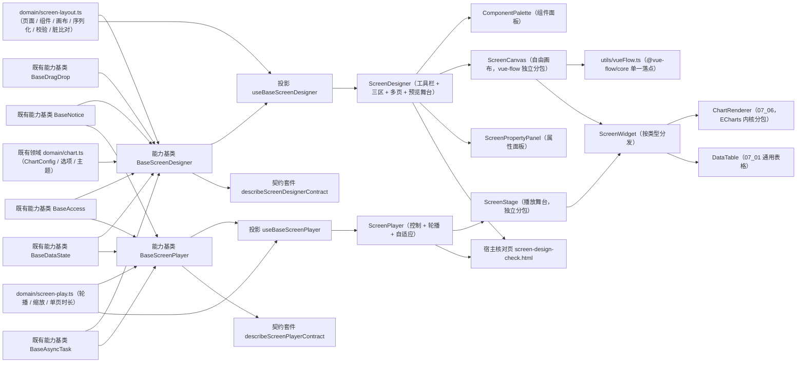

# 02 详细设计 · 大屏设计器与播放

> 前端组件库 · 08 交互类 · 09 报表设计器与大屏设计器与播放 · 嵌套子任务 02（需求 08-9）· 详细设计

[文档首页](../../../../../../../文档首页.md) › [08 交互类](../../../08_交互类.md) › [09 报表设计器与大屏设计器与播放](../../08_交互类_09_报表设计器与大屏设计器与播放.md) › 详细设计　|　[← 任务](../08_交互类_09_报表设计器与大屏设计器与播放_02_大屏设计器与播放.md)

## 1. 设计目标与范围 <a id="goal"></a>

交付[需求 08-9](../../../../../需求/08_需求_交互类.md#r08-9) 与[子任务 08-9-2](../08_交互类_09_报表设计器与大屏设计器与播放_02_大屏设计器与播放.md) 的**大屏设计器与播放**：

- **自由画布设计器**：组件面板（七类可拖放组件）→ 自由画布（vue-flow 承载绝对定位、拖拽/缩放、对齐吸附与层级）→ 属性面板（位置/尺寸/层级/样式/数据源），多页管理（增删/排序/设默认页），画布配置（分辨率/背景/主题）。
- **播放**：多页轮播（定时/手动/暂停）、按组件取数并定时刷新、自适应缩放（不同分辨率等比 contain，不变形）。
- **序列化与提交**：`canvas_config`（分辨率/背景/主题/多页/组件）序列化、脏基线拦截、保存 / 发布 / 另存为（占位态零请求，处理函数由宿主注入）。
- **图表渲染复用 07_06**：画布与播放的图表组件复用 `ChartRenderer`（`BaseChart`）与 ECharts 独立分包；数据表复用通用表格 `DataTable`；其余类型（指标卡 / 文本 / 图片 / 时间 / 装饰）轻量自绘。
- **独立分包**：`vue-flow` 与 `ECharts` 独立分包懒加载，首屏不加载。

### 1.1 口径与依从 <a id="positioning"></a>

- **架构铁律**：大屏设计器编排（页面 / 组件 / 画布 / 校验 / 保存发布 / 脏基线）与播放编排（轮播 / 切页 / 取数 / 自适应）为**横切功能**，各落为**继承链上的能力基类** `BaseScreenDesigner`、`BaseScreenPlayer`（父 `BaseComponent`）+ **领域纯函数** `domain/screen-layout.ts`、`domain/screen-play.ts`；件层只做渲染与投影。
- **画布选型**：自由画布用 **vue-flow**（[《架构设计 · 前端架构》](../../../../../../../设计/架构设计/08_架构设计_前端架构.md)「技术要点」：大屏画布 vue-flow、网格布局 gridstack、列表排序 SortableJS 三者分工不混用）；vue-flow 唯一落点 `ScreenCanvas`（异步分包），`ScreenStage` 播放态为**纯绝对定位 + CSS transform 等比缩放**（不引入图编辑语义）。
- **复用 07_06 渲染契约**：图表配置与选项生成复用核心 `domain/chart.ts`（`ChartConfig` / `normalizeChartConfig`），图表渲染复用基础图表件 `ChartRenderer`；**不重定义渲染契约、不重复取色**。
- **对外契约冻结**：`ScreenDesigner` / `ScreenPlayer`（`08_01_03` 冻结）与 `ScreenCanvas`（`data-subpackage="screen"`）/ `ScreenStage`（`data-subpackage="screen-player"`）的导出名、既有 Props / 事件 / 插槽 / `data-test` / 分包入口**保持 `08_01_03` 冻结形状**，本次只**向后兼容新增**可选 Props / 事件 / 插槽。
- **数据通路注入式**：设计器（取数 / 保存 / 发布 / 另存 / 预览）与播放器（定义取数 / 组件取数）处理函数由宿主注入；**未注入即占位**（不发请求、返回 `undefined` / `false`、按钮禁用 + 占位文案），真实接口联调随报表 BI 窗口。
- **端范围**：**仅 PC**（`ui-ep`）；移动端不提供大屏设计器与播放。
- **工时**：本子任务 16h；因新增 2 个能力基类、2 份领域纯函数、2 套契约套件、2 套投影、7 件组件（4 迁移 + 3 新增，含 vue-flow / 播放舞台分包）、宿主核对页与 vue-flow 依赖接入，实际上浮在实施记录登记。

## 2. 交付物清单 <a id="deliver"></a>

| # | 交付物 | 落点 |
| --- | --- | --- |
| 1 | 大屏布局领域纯函数与数据模型（新增） | `core/src/domain/screen-layout.ts` |
| 2 | 大屏播放领域纯函数（新增） | `core/src/domain/screen-play.ts` |
| 3 | 大屏设计器编排能力基类（新增） | `core/src/capabilities/screen-designer.ts` |
| 4 | 大屏播放编排能力基类（新增） | `core/src/capabilities/screen-player.ts` |
| 5 | 能力依赖登记（新增 `screen-designer` / `screen-player` 两键） | `core/src/capabilities/manifest.ts` |
| 6 | 核心导出面登记 | `core/src/index.ts` |
| 7 | 契约套件 `describeScreenDesignerContract`（新增） | `core/testing/screen-designer.ts`、`core/testing/index.ts` |
| 8 | 契约套件 `describeScreenPlayerContract`（新增） | `core/testing/screen-player.ts`、`core/testing/index.ts` |
| 9 | 核心用例（领域 + 两能力基类） | `core/tests/domain-screen-layout.spec.ts`、`core/tests/domain-screen-play.spec.ts`、`core/tests/screen-designer.spec.ts`、`core/tests/screen-player.spec.ts` |
| 10 | 大屏设计器投影（新增） | `ui-ep/src/composables/useBaseScreenDesigner.ts` |
| 11 | 大屏播放投影（新增） | `ui-ep/src/composables/useBaseScreenPlayer.ts` |
| 12 | 大屏设计器（迁移 + 真实实现） | `ui-ep/src/components/screen/ScreenDesigner.vue` |
| 13 | 自由画布（迁移 + 真实实现，vue-flow 独立分包） | `ui-ep/src/components/screen/ScreenCanvas.vue` |
| 14 | 大屏播放（迁移 + 真实实现） | `ui-ep/src/components/screen/ScreenPlayer.vue` |
| 15 | 播放舞台（迁移 + 真实实现，自适应缩放独立分包） | `ui-ep/src/components/screen/ScreenStage.vue` |
| 16 | 组件面板（新增） | `ui-ep/src/components/screen/ComponentPalette.vue` |
| 17 | 属性面板（新增） | `ui-ep/src/components/screen/ScreenPropertyPanel.vue` |
| 18 | 大屏组件渲染件（新增，按类型分发，画布与舞台共用） | `ui-ep/src/components/screen/ScreenWidget.vue` |
| 19 | vue-flow 单一落点与样式（新增） | `ui-ep/src/utils/vueFlow.ts` |
| 20 | 导出面登记（旧路径移除） | `ui-ep/src/index.ts` |
| 21 | 插件依赖（画布内核） | `ui-ep/package.json`（`@vue-flow/core` / `@vue-flow/background` / `@vue-flow/controls`） |
| 22 | 用例（两投影 + 七件 + 分包 / 序列化 / 轮播 / 缩放） | `ui-ep/tests/interaction-screen.spec.ts` |
| 23 | 宿主核对页（`vite build` 不含） | `apps/desktop/screen-design-check.html`、`apps/desktop/src/dev/{screenDesignCheck.ts,ScreenDesignCheck.vue}` |
| 24 | 分包命名（vue-flow vendor 块） | `apps/desktop/vite.config.ts` |
| 25 | 登记回写（基类清单 / 组件设计 / 上游 / 计划与状态） | 见第 6 节 |



## 3. 接口 / 契约与边界 <a id="contract"></a>

### 3.1 核心：`domain/screen-layout.ts`（新增纯函数与数据模型） <a id="domain-layout"></a>

```ts
/** 大屏设计权限码。 */
export const SCREEN_DESIGN_PERM = 'rpt:design'
/** 大屏查看权限码。 */
export const SCREEN_VIEW_PERM = 'rpt:view'
/** 大屏设计器占位文案。 */
export const SCREEN_DESIGNER_PLACEHOLDER_TEXT = '大屏设计器未就绪（占位）'
/** 大屏播放占位文案。 */
export const SCREEN_PLAYER_PLACEHOLDER_TEXT = '大屏播放未就绪（占位）'
/** 默认画布分辨率。 */
export const SCREEN_DEFAULT_RESOLUTION = { width: 1920, height: 1080 }
/** 组件默认尺寸。 */
export const SCREEN_DEFAULT_COMPONENT_SIZE = { w: 320, h: 200 }
/** 组件最小尺寸。 */
export const SCREEN_MIN_COMPONENT_SIZE = { w: 40, h: 32 }
/** 组件类型集（组件库）。 */
export const SCREEN_COMPONENT_TYPES: ScreenComponentType[]

/** 大屏页。 */
export interface ScreenPage { id: string; name: string; duration?: number }
/** 组件类型。 */
export type ScreenComponentType = 'chart' | 'table' | 'metric' | 'text' | 'image' | 'time' | 'decor'
/** 大屏组件（绝对定位，与冻结契约同形 + 向后兼容可选字段）。 */
export interface ScreenComponent {
  id: string
  type: ScreenComponentType
  x: number
  y: number
  w: number
  h: number
  z: number
  datasetId?: string
  chartType?: string
  text?: string
  config?: Record<string, unknown>
  props?: Record<string, unknown>
  style?: Record<string, unknown>
}
/** 画布配置。 */
export interface ScreenCanvasConfig {
  width: number
  height: number
  background?: { color?: string; image?: string }
  theme?: 'light' | 'dark' | 'auto'
  properties?: Record<string, unknown>
}
/** 大屏定义（保存载荷；`componentsByPage` 键为页标识）。 */
export interface ScreenDefinition {
  code: string
  name: string
  canvas: ScreenCanvasConfig
  pages: ScreenPage[]
  componentsByPage: Record<string, ScreenComponent[]>
  defaultPageId?: string
}
/** 校验问题种类。 */
export type ScreenIssueKind = 'empty' | 'unknown-dataset' | 'disabled-dataset'
  | 'missing-mapping' | 'overflow' | 'duplicate-page' | 'invalid-page'
/** 校验问题。 */
export interface ScreenValidationIssue { kind: ScreenIssueKind; pageId?: string; componentId?: string; message: string }
/** 校验结果。 */
export interface ScreenValidationResult { valid: boolean; errors: ScreenValidationIssue[]; message: string }

normalizeResolution(input: unknown): { width: number; height: number }
normalizeCanvasConfig(input: unknown): ScreenCanvasConfig
normalizePage(value: unknown): ScreenPage | undefined
normalizePages(value: unknown): ScreenPage[]
normalizeComponentType(value: unknown): ScreenComponentType
normalizeComponent(value: unknown): ScreenComponent | undefined
normalizeComponents(value: unknown): ScreenComponent[]
normalizeComponentsByPage(value: unknown, pageIds?: readonly string[]): Record<string, ScreenComponent[]>
normalizeScreenDefinition(value: unknown): ScreenDefinition

nextComponentId(components: readonly ScreenComponent[]): string
nextPageId(pages: readonly ScreenPage[]): string
findComponent(components: readonly ScreenComponent[], id: string): ScreenComponent | undefined
findPage(pages: readonly ScreenPage[], id: string): ScreenPage | undefined
componentsOf(definition: ScreenDefinition, pageId: string): ScreenComponent[]
collectUsedDatasets(definition: ScreenDefinition): string[]

addComponent(components: readonly ScreenComponent[], input: { type: ScreenComponentType; id?: string; x?: number; y?: number; w?: number; h?: number }): ScreenComponent[]
removeComponent(components: readonly ScreenComponent[], id: string): ScreenComponent[]
updateComponent(components: readonly ScreenComponent[], id: string, patch: Partial<Pick<ScreenComponent, 'type' | 'text' | 'chartType' | 'datasetId' | 'config' | 'props' | 'style'>>): ScreenComponent[]
moveComponent(components: readonly ScreenComponent[], id: string, x: number, y: number): ScreenComponent[]
resizeComponent(components: readonly ScreenComponent[], id: string, w: number, h: number): ScreenComponent[]
bringToTop(components: readonly ScreenComponent[], id: string): ScreenComponent[]
sendToBottom(components: readonly ScreenComponent[], id: string): ScreenComponent[]
raiseComponent(components: readonly ScreenComponent[], id: string): ScreenComponent[]
lowerComponent(components: readonly ScreenComponent[], id: string): ScreenComponent[]
sortByZ(components: readonly ScreenComponent[]): ScreenComponent[]

addPage(pages: readonly ScreenPage[], input: { id?: string; name?: string; duration?: number }): ScreenPage[]
removePage(pages: readonly ScreenPage[], id: string): ScreenPage[]
renamePage(pages: readonly ScreenPage[], id: string, name: string): ScreenPage[]
movePage(pages: readonly ScreenPage[], id: string, index: number): ScreenPage[]
setDefaultPage(definition: ScreenDefinition, pageId: string): ScreenDefinition

paletteGroups(): { category: string; items: { type: ScreenComponentType; label: string }[] }[]
componentLabel(type: ScreenComponentType): string
canvasStyle(component: ScreenComponent): Record<string, string | number>

validateScreen(definition: ScreenDefinition, datasets: readonly ReportDataset[]): ScreenValidationResult
serializeCanvasConfig(definition: ScreenDefinition): Record<string, unknown>
serializeScreenDefinition(definition: ScreenDefinition): Record<string, unknown>
serializeScreen(definition: ScreenDefinition): string
screenDefinitionsEqual(a: ScreenDefinition, b: ScreenDefinition): boolean
isScreenDirty(current: ScreenDefinition | undefined, baseline: ScreenDefinition | undefined): boolean
```

| 行为 | 口径 |
| --- | --- |
| 分辨率归一 | `normalizeResolution` 取正数并取整，缺失回落 `1920×1080` |
| 画布归一 | `normalizeCanvasConfig`：分辨率归一、背景对象保留（颜色 / 图片）、主题限 `light/dark/auto`（其它回落 `auto`） |
| 页归一 | `normalizePage`：`id` 缺失即丢弃、`name` 缺省 `页 {id}`、`duration` 仅接受正数 |
| 组件归一 | `normalizeComponent`：`id` 缺失丢弃、类型未知回落 `text`、坐标 / 尺寸取整（`w/h` 夹取到最小尺寸）、`z` 取整非负、可选字段对象化保留；**脏引用（数据集不存在）不抛错** |
| 组件新增 | `addComponent`：追加一项，`id` 缺省 `c-{n}` 递增不冲突，尺寸取默认 / 入参（夹取），落位为画布内**阶梯偏移**（`(n % 8) × 24`），`z` 取当前最大 +1 |
| 移动 / 缩放 | `moveComponent` / `resizeComponent` 仅夹取非负与最小尺寸（**允许越界，由校验提示 `overflow`**）；不可变返回、目标缺失原样返回 |
| 层级 | `raiseComponent` / `lowerComponent` / `bringToTop` / `sendToBottom` 调整数组顺序并**重排 `z = 1..n`**（稳定、无重复）；`sortByZ` 返回按 `z` 升序副本 |
| 页操作 | `addPage` 追加（`id` 缺省 `p-{n}`）、`removePage` 保底一页（删到最后一页返回原数组）、`renamePage` / `movePage` 夹取索引、`setDefaultPage` 不存在时不改 |
| 组件面板 | `paletteGroups` 分组：图表 / 数据表 / 指标卡 / 文本 / 图片 / 时间 / 装饰；`componentLabel` 中文名 |
| 校验 | `validateScreen`：无页 / 页无组件（`empty`）、图表·表格·指标卡引用数据集不存在（`unknown-dataset`）/ 停用（`disabled-dataset`）、图表缺度量映射（`missing-mapping`）、组件越界（`overflow`）、页标识重复（`duplicate-page`）、默认页不存在（`invalid-page`）；`valid` 以 `empty` 与阻断项为准，`overflow` 为警告不阻断 |
| 序列化 | `serializeCanvasConfig` 产 `{ version, resolution, background, theme, pages, components }`；`serializeScreen` 经 `stableStringify` 打包 `{ code, name, canvas_config: ... }`（键序无关）；`screenDefinitionsEqual` / `isScreenDirty` 逐字比对（基线缺失视为不脏） |
| 纯数据 | 不触 DOM、不请求、不依赖渲染框架与第三方库；同输入同输出 |

### 3.2 核心：`domain/screen-play.ts`（新增纯函数） <a id="domain-play"></a>

```ts
/** 默认轮播间隔（毫秒）。 */
export const SCREEN_DEFAULT_PLAY_INTERVAL = 5000
/** 轮播间隔下限（毫秒）。 */
export const SCREEN_MIN_PLAY_INTERVAL = 1000
/** 缩放模式。 */
export type ScreenScaleMode = 'contain' | 'cover'
/** 等比缩放结果（设计坐标 → 显示层，不改坐标）。 */
export interface ScreenScaleTransform { scale: number; offsetX: number; offsetY: number }

normalizePlayInterval(input: unknown, fallback?: number): number
pageIds(pages: readonly ScreenPage[]): string[]
nextPageId(pages: readonly ScreenPage[], currentId: string, loop?: boolean): string
prevPageId(pages: readonly ScreenPage[], currentId: string, loop?: boolean): string
pageDuration(page: ScreenPage | undefined, fallback?: number): number
isRotationDue(elapsed: number, interval: number): boolean
computeScale(design: { width: number; height: number }, container: { width: number; height: number }, mode?: ScreenScaleMode): ScreenScaleTransform
```

| 行为 | 口径 |
| --- | --- |
| 间隔归一 | `normalizePlayInterval`：非正 / 非数回落缺省 `5000`，小于下限取 `1000`，取整 |
| 切页 | `nextPageId` / `prevPageId`：按页序前进 / 后退；`loop` 为真时首尾环回（缺省环回），为假时到端点返回原值；当前页不在列表时取首页 |
| 单页时长 | `pageDuration`：页自定义 `duration` 优先，否则取 `fallback`（缺省间隔） |
| 轮播判定 | `isRotationDue(elapsed, interval)`：`elapsed >= interval` |
| 缩放 | `computeScale`：`contain` 取 `min(设计比, 容器比)`、`cover` 取 `max`；`scale > 0`，`offsetX/offsetY` 为按模式居中后的偏移；容器或设计为 0 时返回 `{ scale: 1, offsetX: 0, offsetY: 0 }` |
| 纯数据 | 不触 DOM、不请求；同输入同输出 |

### 3.3 核心：能力基类 `BaseScreenDesigner`（新增） <a id="base-designer"></a>

```ts
/** 设计阶段。 */
export type ScreenDesignerPhase = 'idle' | 'loading' | 'saving' | 'publishing' | 'done' | 'failed'
/** 取数快照。 */
export interface ScreenSnapshot { code: string; name: string; definition?: Partial<ScreenDefinition> }
/** 保存结果。 */
export interface ScreenSaveResult { recordVersion?: number }
/** 预览取数结果。 */
export interface ScreenPreviewResult { columns: ReportField[]; rows: Record<string, unknown>[] }
/** 注入的处理函数集（未注入即占位不请求）。 */
export interface ScreenDesignerJobs {
  load?: (input: { code?: string }) => Promise<ScreenSnapshot | undefined>
  save?: (input: ScreenDefinition) => Promise<ScreenSaveResult | undefined>
  publish?: (input: { code: string }) => Promise<void>
  saveAs?: (input: ScreenDefinition) => Promise<ScreenSaveResult | undefined>
  preview?: (input: { componentId: string; datasetId: string; params?: Record<string, unknown> }) => Promise<ScreenPreviewResult | undefined>
}
/** 脏数据拦截场景。 */
export type ScreenBlockAction = 'new' | 'open' | 'leave'

export abstract class BaseScreenDesigner extends BaseComponent {
  readonly identifier = 'screen-designer'
  override readonly depends = ['access', 'notice', 'data-state', 'drag-drop', 'async-task']
  ready = false
  requestCount = 0
  screenCode = ''
  screenName = ''
  canvas: ScreenCanvasConfig
  pages: ScreenPage[]
  componentsByPage: Record<string, ScreenComponent[]>
  activePageId = ''
  selectedId = ''
  baseline: ScreenDefinition | undefined
  phase: ScreenDesignerPhase = 'idle'
  errorMessage = ''
  jobs: ScreenDesignerJobs = {}
  access / notice / dataState / drag / asyncTask: ...

  get degraded(): boolean
  get readonly(): boolean
  get canEdit(): boolean
  get busy(): boolean
  get dirty(): boolean
  get validation(): ScreenValidationResult
  get definition(): ScreenDefinition
  get activePage(): ScreenPage | undefined
  get activeComponents(): ScreenComponent[]
  get selectedComponent(): ScreenComponent | undefined
  get canSave(): boolean

  setReady(value): void
  setJobs(jobs): void
  setAccess / setNotice / setDataState / setDrag / setAsyncTask(...)
  setScreenCode(code, name?): boolean
  setCanvas(patch: Partial<ScreenCanvasConfig>): boolean
  setPages(pages): boolean
  selectPage(pageId): boolean
  addPage(input?): ScreenPage | undefined
  removePage(pageId): boolean
  renamePage(pageId, name): boolean
  movePage(pageId, index): boolean
  setDefaultPage(pageId): boolean
  addComponent(input): ScreenComponent | undefined
  removeComponent(id): boolean
  updateComponent(id, patch): boolean
  moveComponent(id, x, y): boolean
  resizeComponent(id, w, h): boolean
  raiseComponent(id) / lowerComponent(id) / bringToTop(id) / sendToBottom(id): boolean
  selectComponent(id: string | null): void
  markBaseline(): void
  discard(): boolean
  needsBlock(action: ScreenBlockAction): boolean
  load(input?): Promise<ScreenSnapshot | undefined>
  preview(componentId, params?): Promise<ScreenPreviewResult | undefined>
  save(): Promise<ScreenSaveResult | undefined>
  publish(): Promise<boolean>
  saveAs(code, name?): Promise<ScreenSaveResult | undefined>
}
```

| 行为 | 口径 |
| --- | --- |
| 占位语义 | `ready === false` → `degraded` / `readonly` 为真；取数 / 预览 / 保存 / 发布 / 另存 **零请求**（`requestCount` 恒 0），保持 `08_01_03` 冻结口径 |
| 只读 | `readonly = !ready ∨ 未持 SCREEN_DESIGN_PERM`；只读时结构操作返回 `false` / `undefined` 且不改状态（**不写脏**） |
| 取数 | `load` 未注入 / 未就绪 → 占位不动作；注入后调 `jobs.load`，装载 `code/name` 与 `definition`（经 `normalizeScreenDefinition`；缺定义回落空画布 + 一页），`activePageId` 取默认页或首页，`markBaseline()`；`requestCount += 1`；失败置 `failed` + `errorMessage` |
| 结构操作 | 页面 / 组件 / 画布操作均经 `domain/screen-layout.ts` 改写状态并 `notifyLifecycle('update')`；成功即刷新 `dirty`；只读 / 占位不动作 |
| 组件新增 | `addComponent` 落到**当前页**，`z` 取当前页最大 +1，成功后选中新组件 |
| 层级 | 四个层级操作作用于当前页并重排 `z`；不可变返回 |
| 页切换 | `selectPage` 校验存在性并清选中；`setPages` 后当前页失效时回落默认页 / 首页 |
| 拖拽 | `moveComponent` / `resizeComponent` 接件层落点，经领域函数落点后 `drag?.emitDrag({ phase: 'drop', source: id, crossZone: false })` 广播（未注入仍完成落点） |
| 数据预览 | `preview(componentId)` 取组件数据集，未就绪 / 未注入 → 不请求；注入后取数（只读从库口径），仅用于设计态预览展示 |
| 脏基线 | `markBaseline` 记当前 `definition` 深拷贝；`dirty = isScreenDirty(definition, baseline)`；`discard` 回滚到基线并清脏；`definition` 为 `canvas + pages + componentsByPage + defaultPageId` 的稳定结构 |
| 拦截 | `needsBlock(action)`：`dirty` 为真返回 `true`；件层上抛 `dirty-block`（含 `action`），宿主决定确认策略 |
| 切换大屏 | `setScreenCode`：脏时不切换返回 `false`；通过后清选中 / 清基线 / 重置页与组件 |
| 保存 / 发布 / 另存 | 对齐 `08-9-1`：`canSave` = 就绪 ∧ 可编辑 ∧ `validation.valid`；覆盖式提交 `ScreenDefinition`；成功后 `markBaseline()`、`phase='done'`；失败保留本地与脏标记；「发布」先 `save()` 成功再 `publish`；`saveAs` 以当前定义新建 |
| 防重复 | `busy` 期间动作返回 `undefined` / `false`（件层同时禁用按钮） |
| 纯数据 | 不触 DOM、不请求；状态变更经生命周期 `update` 通知 |

- 依赖登记：`screen-designer: ['access', 'notice', 'data-state', 'drag-drop', 'async-task']`。
- 不含：vue-flow 画布内核（`ScreenCanvas` + `utils/vueFlow.ts`）、图表渲染内核（`ChartRenderer` + `echartsKernel`）、大屏播放（`BaseScreenPlayer` / `ScreenPlayer`）、数据集 SQL 建模与安全执行（后端）。

### 3.4 核心：能力基类 `BaseScreenPlayer`（新增） <a id="base-player"></a>

```ts
/** 播放快照（定义取数结果）。 */
export interface ScreenPlaySnapshot {
  code: string
  name?: string
  canvas?: ScreenCanvasConfig
  pages?: ScreenPage[]
  componentsByPage?: Record<string, ScreenComponent[]>
  defaultPageId?: string
}
/** 注入的处理函数集（未注入即占位不请求）。 */
export interface ScreenPlayerJobs {
  load?: (input: { code?: string }) => Promise<ScreenPlaySnapshot | undefined>
  componentData?: (input: { pageId: string; componentId: string; datasetId: string; params?: Record<string, unknown> }) => Promise<ScreenPreviewResult | undefined>
}
/** 播放阶段。 */
export type ScreenPlayerPhase = 'idle' | 'loading' | 'ready' | 'failed'

export abstract class BaseScreenPlayer extends BaseComponent {
  readonly identifier = 'screen-player'
  override readonly depends = ['access', 'notice', 'data-state', 'async-task']
  ready = false
  requestCount = 0
  screenCode = ''
  canvas: ScreenCanvasConfig
  pages: ScreenPage[]
  componentsByPage: Record<string, ScreenComponent[]>
  activePageId = ''
  playing = false
  interval = SCREEN_DEFAULT_PLAY_INTERVAL
  fullscreen = false
  data: Record<string, ScreenPreviewResult | undefined>
  phase: ScreenPlayerPhase = 'idle'
  errorMessage = ''
  jobs: ScreenPlayerJobs = {}
  access / notice / dataState / asyncTask: ...

  get degraded(): boolean
  get busy(): boolean
  get activePage(): ScreenPage | undefined
  get currentComponents(): ScreenComponent[]
  get pageCount(): number
  get hasPrev(): boolean
  get hasNext(): boolean
  get currentInterval(): number

  setReady(value): void
  setJobs(jobs): void
  setAccess / setNotice / setDataState / setAsyncTask(...)
  setCanvas(canvas): void
  setPages(pages): void
  setComponents(componentsByPage): void
  setPlaying(value): void
  setInterval(value): number
  setFullscreen(value): void
  selectPage(pageId): boolean
  next(): string
  prev(): string
  toggle(force?): boolean
  markLoaded(): void
  load(input?): Promise<ScreenPlaySnapshot | undefined>
  queryComponent(componentId, pageId?): Promise<ScreenPreviewResult | undefined>
  refreshPage(pageId?): Promise<number>
}
```

| 行为 | 口径 |
| --- | --- |
| 占位语义 | `ready === false` → `degraded` 为真；`load` / `queryComponent` / `refreshPage` **零请求**（`requestCount` 恒 0） |
| 取数 | `load` 注入后调 `jobs.load`，装载 `canvas/pages/componentsByPage`（归一），`activePageId` 取默认页或首页，`phase='ready'`；失败置 `failed` + `errorMessage`；`markLoaded()` 用于宿主自行装载时计数 |
| 轮播 | `next` / `prev` 经 `domain/screen-play` 切页并结算（返回新页标识，占位 / 空页返回原值且不改）；`toggle` 切换播放态并返回新值（`force` 可显式设定）；`setInterval` 经 `normalizePlayInterval` 返回生效值 |
| 单页时长 | `currentInterval` = `pageDuration(activePage, interval)`；件层以 `setTimeout` 按单页时长调度（非固定 `setInterval`），页面不可见（`visibilitychange`）时暂停调度 |
| 按组件取数 | `queryComponent(componentId, pageId?)`：仅对图表 / 表格 / 指标卡等带 `datasetId` 的组件请求；调 `jobs.componentData` 后按组件标识写入 `data`；`requestCount += 1` |
| 整页刷新 | `refreshPage(pageId?)`：遍历当前页带数据集组件**并行** `queryComponent`，返回请求数；单组件失败不阻断整页（保留其余结果，置该组件 `undefined`） |
| 只读 / 权限 | 播放默认需 `SCREEN_VIEW_PERM`（`access` 未注入视为有权）；无权时 `load` 不动作 + 件层提示 |
| 防重复 | `busy` 期间 `load` 返回 `undefined`；切页不阻塞 |
| 纯数据 | 不触 DOM、不请求（除注入处理函数）；状态变更经生命周期 `update` 通知 |

- 依赖登记：`screen-player: ['access', 'notice', 'data-state', 'async-task']`。
- 不含：路由跳转与全屏 API（件层 / 宿主）、自适应缩放的 DOM 计算（件层调 `domain/screen-play` 纯函数）、图表渲染内核（`ChartRenderer`）。

### 3.5 核心：契约套件（`@bms/core/testing`） <a id="testing"></a>

| 套件 | 契约面 | 断言要点 |
| --- | --- | --- |
| `describeScreenDesignerContract` | `ready` / `degraded` / `readonly` / `busy` / `dirty` / `phase` / `requestCount` / `pages()` / `components()` / `selectedId()` / `activePageId()` / `validation()` + `setReady` / `setOperators` / `setJobs` / `setCanvas` / `setPages` / `selectPage` / `addPage` / `removePage` / `renamePage` / `movePage` / `addComponent` / `removeComponent` / `updateComponent` / `moveComponent` / `resizeComponent` / `bringToTop` / `sendToBottom` / `selectComponent` / `markBaseline` / `discard` / `needsBlock` / `load` / `preview` / `save` / `publish` / `saveAs` | 占位零请求；就绪未注入仍零请求；取数装载与基线；只读不动作不写脏；组件增删改 / 移动缩放 / 层级重排；页增删改与切换；脏判定与拦截与撤销；保存成功清脏、失败保留；发布依赖保存；另存为新定义；预览不越权；防重复 |
| `describeScreenPlayerContract` | `ready` / `degraded` / `busy` / `phase` / `requestCount` / `pages()` / `activePageId()` / `components()` / `playing` / `interval` / `data()` + `setReady` / `setJobs` / `setOperators` / `setPages` / `setComponents` / `selectPage` / `next` / `prev` / `toggle` / `setPlaying` / `setInterval` / `load` / `queryComponent` / `refreshPage` | 占位零请求；就绪装载定义；切页环回与端点；播放态切换；间隔归一；按组件取数计入请求数；整页并行刷新与单组件失败容错 |

- 契约目标约定：设计器用页 `p1`（含文本组件 `c1`）/ `p2`，数据集 `d1`（`month`/`receipt`）；播放器用 `p1`/`p2` 两页、图表组件 `c1` 引用 `d1`；处理函数集返回快照与保存结果；核心用例与 `ui-ep` 用例共用同一套断言。

### 3.6 插件层：投影（新增） <a id="projection"></a>

```ts
useBaseScreenDesigner(options?: UseBaseScreenDesignerOptions): UseBaseScreenDesignerResult
useBaseScreenPlayer(options?: UseBaseScreenPlayerOptions): UseBaseScreenPlayerResult
```

- 薄适配（核心实例 ↔ Vue 响应式）；协作者经 `markRaw(toRaw(x))` 隔离；`onScopeDispose` 解除订阅并 `dispose`；返回面与核心方法一一对应（含 `screen-code` / `pages` / `components` / `canvas` / `activePageId` / `selectedId` / `dirty` / `validation` / `requestCount` 等响应式引用）。

### 3.7 插件层：件族（`ui-ep/src/components/screen/`） <a id="components"></a>

件族落 `ui-ep/src/components/screen/`（同 `report/`、`form-design/`、`chart/` 先例），**对外导出名、既有 Props / 事件 / 插槽 / `data-test` / 分包入口不变**，旧路径 `components/interaction/{ScreenDesigner,ScreenPlayer,ScreenCanvas,ScreenStage}.vue` 删除；新增 `ComponentPalette` / `ScreenPropertyPanel` / `ScreenWidget`。

#### 3.7.1 `ScreenDesigner.vue`（迁移 + 真实实现） <a id="c-designer"></a>

| 面 | 内容 |
| --- | --- |
| 数据面（既有，保持） | `ready`（缺省 `false`）/ `screenCode` / `pages` / `activePageId` / `components` / `selectedId` / `dirty` / `readOnly` / `degradeText` |
| 数据面（新增，全部可选） | `screenName` / `canvas` / `jobs` / `access` / `notice` / `drag` / `asyncTask` |
| 事件（既有，保持） | `change` / `select` / `add-component` / `remove-component` / `page-change` / `save` / `publish` / `preview-play` / `retry` |
| 事件（新增） | `new` / `open`（`{ code }`）/ `loaded` / `saved` / `failed`（`{ message }`）/ `dirty-block`（`{ action }`）/ `page-add`（`{ id }`）/ `page-remove`（`{ id }`）/ `page-rename`（`{ id, name }`）/ `component-update`（`{ id, patch }`）/ `canvas-change`（`ScreenCanvasConfig`）/ `dataset-preview`（`{ componentId, result }`） |
| 插槽（既有，保持） | `degrade` / `empty` / `live` / `toolbar` / `component-panel` / `property-panel` |
| 插槽（新增） | `screen-list`（大屏定义列表抽屉，宿主自备）/ `preview-stage`（内置预览舞台替换） |
| `data-test`（既有，保持） | `placeholder` / `toolbar` / `screen-code` / `page-{id}` / `save` / `publish` / `preview-play` / `dirty` / `component-panel` / `palette-{type}` / `canvas` / `property-panel` / `properties-selected` / `properties-empty` |
| `data-test`（新增） | `new` / `open` / `screen-name` / `page-add` / `page-remove-{id}` / `page-rename` / `canvas-resolution` / `canvas-theme` / `validation-error` / `readonly-hint` / `preview-stage` / `preview-close` |

**事件与注入双轨**：点击一律**保留既有事件上抛**；**仅当宿主注入 `jobs`** 时件内才驱动真实编排（避免重复执行）。现有冻结用例（未注入 `jobs`）断言不变即通过。

**取值口径**：`readOnly` 受控优先；就绪 / 降级由 `BaseScreenDesigner` 决定（降级仍用占位语义）；三区布局（左组件面板 / 中自由画布 / 右属性面板）由 `component-panel` / `canvas` / `property-panel` 插槽承载，缺省渲染 `ComponentPalette`（同步）与懒加载 `ScreenCanvas`；属性面板同步内联（`ScreenPropertyPanel`）。工具栏含新建 / 打开 / 保存 / 发布 / 预览播放 / 多页管理（增删 / 改名 / 设默认）/ 画布分辨率与主题。内置预览舞台为**同一 `ScreenStage` 异步件**（`data-test="preview-stage"`），由 `preview-play` 切换显示，关闭后回到设计态。

#### 3.7.2 `ScreenCanvas.vue`（迁移 + 真实实现，vue-flow 独立分包） <a id="c-canvas"></a>

| 面 | 内容 |
| --- | --- |
| 数据面（既有，保持） | `components` / `selectedId` / `readOnly` / `activePageId` |
| 数据面（新增，可选） | `canvas`（分辨率 / 背景 / 主题）/ `datasets` |
| 事件（既有，保持） | `select`（`id`）/ `remove-component`（`id`） |
| 事件（新增） | `move-component`（`{ id, x, y }`）/ `resize-component`（`{ id, w, h }`）/ `raise-component`（`id`）/ `lower-component`（`id`）/ `bring-top`（`id`）/ `send-bottom`（`id`）/ `update-component`（`{ id, patch }`） |
| `data-test`（既有，保持） | `screen-canvas`（`data-subpackage="screen"`）/ `canvas-empty` / `component-{id}`（`data-selected`）/ `remove-{id}` |
| `data-test`（新增） | `canvas-node-{id}` / `canvas-resize-{id}` / `canvas-raise-{id}` / `canvas-lower-{id}` / `canvas-degrade` |

- **vue-flow 唯一落点**：经 `ui-ep/src/utils/vueFlow.ts` 单一入口（`import '@vue-flow/core/dist/style.css'` + `@vue-flow/core` / `@vue-flow/background` / `@vue-flow/controls`），本件**动态装载** `utils/vueFlow.ts`（`try/catch` 失败置 `degraded` 并退化为普通绝对定位列表），保持 `ScreenCanvas` 为独立异步块、vue-flow 落于其异步块与 `vendor-vue-flow` 块（不进首屏）。
- **载荷**：画布容器按设计分辨率铺底、按容器宽度等比缩放显示（缩放比不改组件坐标）；节点落位写 `x/y/w/h`，拖拽 / 缩放结束上抛落点，由设计器经领域函数回写并广播；选中联动与层级操作对齐组件设计第 4 节。
- **组件渲染**：节点内渲染 `ScreenWidget`（按类型分发）；`readOnly` 时禁拖拽 / 缩放与卡头操作。
- jsdom 用例对 vue-flow 行为以适配桩核验（`data-subpackage="screen"` 与节点存在），真实拖拽由浏览器核对页验证。

#### 3.7.3 `ScreenPlayer.vue`（迁移 + 真实实现） <a id="c-player"></a>

| 面 | 内容 |
| --- | --- |
| 数据面（既有，保持） | `ready`（缺省 `false`）/ `screenCode` / `pages`（`ScreenPlayerPage[]`）/ `activePageId` / `components` / `interval` / `autoplay` / `fullscreen` / `degradeText` |
| 数据面（新增，可选） | `canvas` / `jobs` / `access` / `notice` |
| 事件（既有，保持） | `update:activePageId` / `next` / `prev` / `toggle`（`playing`）/ `refresh` / `retry` |
| 事件（新增） | `loaded` / `failed`（`{ message }`）/ `page-change`（`{ pageId }`）/ `data-refresh`（`{ pageId, count }`） |
| 插槽（既有，保持） | `degrade` / `empty` / `live` |
| 插槽（新增） | `toolbar`（自定义控制区） |
| `data-test`（既有，保持） | `placeholder` / `controls` / `prev` / `toggle` / `next` / `refresh` / `task-status` / `task-progress` / `screen-stage`（`data-subpackage="screen-player"`）/ `stage-empty` / `stage-{id}` |
| `data-test`（新增） | `screen-code` / `page-dots` / `dot-{id}` / `autoplay-hint` / `readonly-hint` |

- **轮播**：`setTimeout` 按**单页时长**（`currentInterval`）调度 `next()`，播放态由 `autoplay` / `toggle` 控制；`document.visibilitychange` 隐藏时暂停调度、可见时恢复；手动上下页与圆点切页即重置计时。
- **自适应**：舞台 `ScreenStage` 按 `computeScale(设计分辨率, 容器尺寸, 'contain')` 以 CSS `transform: scale()` 渲染（只影响显示层，不改坐标）；`ResizeObserver` 监听容器尺寸重算（结束才重算，防抖）。
- **按组件取数**：就绪后对当前页带数据集组件 `refreshPage()` 取数，并随轮播切页刷新；数据按组件标识传入 `ScreenWidget`。
- **全屏**：`fullscreen` 受控优先级；件内提供全屏切换（`requestFullscreen` 可用时）与降级（不可用时只铺满容器）。

#### 3.7.4 `ScreenStage.vue`（迁移 + 真实实现，独立分包） <a id="c-stage"></a>

| 面 | 内容 |
| --- | --- |
| 数据面 | `activePageId` / `components` / `playing` / `interval` / `canvas` / `data` / `canvasWidth` / `canvasHeight` |
| 事件 | 无（纯渲染） |
| `data-test` | `screen-stage`（`data-subpackage="screen-player"`）/ `stage-empty` / `stage-{id}` / `stage-scale` |

- 画布按设计分辨率绝对定位渲染组件（`z-index` 按 `z`），外层 `transform: scale()` 等比自适应；当前页只渲染当前页组件，非当前页不渲染；组件经 `ScreenWidget` 渲染（图表复用 `ChartRenderer`，ECharts 内核独立分包）。

#### 3.7.5 `ComponentPalette.vue`（新增） <a id="c-palette"></a>

| 面 | 内容 |
| --- | --- |
| 数据面 | `readOnly` / `disabled` |
| 事件 | `add`（`type`）/ `drag-start`（`type`） |
| `data-test` | `component-palette` / `palette-group-{category}` / `palette-{type}` |

- 按 `paletteGroups()` 分组渲染可拖放组件；点击上抛 `add`，`dragstart` 上抛 `drag-start`（由设计器转 `BaseDragDrop` 广播）；`readOnly` / 占位时禁用。**同步件**（冻结用例同步点击 `palette-{type}` 断言）。

#### 3.7.6 `ScreenPropertyPanel.vue`（新增） <a id="c-property"></a>

| 面 | 内容 |
| --- | --- |
| 数据面 | `component`（当前选中，缺省显示画布级配置）/ `canvas` / `datasets` / `readOnly` |
| 事件 | `move`（`{ id, x, y }`）/ `resize`（`{ id, w, h }`）/ `reorder`（`{ id, action }`）/ `update`（`{ id, patch }`，类型 / 文案 / 数据集 / 图表类型）/ `canvas-update`（`Partial<ScreenCanvasConfig>`） |
| `data-test` | `property-panel-detail` / `prop-x` / `prop-y` / `prop-w` / `prop-h` / `prop-z` / `prop-raise` / `prop-lower` / `prop-top` / `prop-bottom` / `prop-type` / `prop-text` / `prop-dataset` / `prop-chart-type` / `prop-background` / `prop-theme` / `prop-resolution` |

- 选中组件：位置 / 尺寸 / 层级 / 类型 / 文案 / 数据源（数据集 + 图表类型）/ 样式（字号 / 颜色 / 背景 / 边框 / 圆角，引用设计令牌）；未选中：画布级分辨率 / 背景 / 主题。**同步件**（冻结用例断言 `properties-selected` / `properties-empty`）。

#### 3.7.7 `ScreenWidget.vue`（新增，按类型分发） <a id="c-widget"></a>

| 面 | 内容 |
| --- | --- |
| 数据面 | `component` / `datasets` / `data` / `readOnly` / `mode`（`design` / `play`） |
| 事件 | 无（纯渲染）；图表交互事件透传 |
| `data-test` | `widget-{type}` / `widget-chart` / `widget-table` / `widget-metric` / `widget-text` / `widget-image` / `widget-time` / `widget-decor` |

- 按类型分发：`chart` → `ChartRenderer`（复用 07_06，`ChartConfig` 经 `normalizeChartConfig` 生成）；`table` → 通用表格 `DataTable`（只读）；`metric` → 指标卡（大数字 + 单位）；`text` → 文本；`image` → 图片（对象存储 URL）；`time` → 当前时间（按租户时区，经格式化能力）；`decor` → 纯样式装饰。空 / 错误态与降级复用既有状态口径。

### 3.8 分包入口与依赖 <a id="chunk"></a>

| 入口 | 宿主 | 说明 |
| --- | --- | --- |
| `ScreenCanvas` | `ScreenDesigner` | 自由画布（`data-subpackage="screen"`；vue-flow 经本件异步块） |
| `ScreenStage` | `ScreenPlayer` / `ScreenDesigner`（预览） | 播放舞台（`data-subpackage="screen-player"`；自适应缩放） |
| `utils/vueFlow.ts` | `ScreenCanvas` | vue-flow 单一落点（`@vue-flow/core` / `background` / `controls` + 样式） |
| `ChartRenderer`（ECharts 内核分包） | `ScreenWidget` | 复用 07_06 基础图表件 |
| `ComponentPalette` / `ScreenPropertyPanel` / `ScreenWidget` | `ScreenDesigner` / `ScreenCanvas` / `ScreenStage` | 同步件（不单独分包） |

- `ScreenCanvas` / `ScreenStage` 用 `defineAsyncComponent(() => import(...))`；二者**不进 `ui-ep` 根出口**（否则静态引入使动态导入无法分包）；用例用 `vi.dynamicImportSettled()` 等待解析。
- `apps/desktop/vite.config.ts` `manualChunks` 为 `@vue-flow/*` 命名独立 `vendor-vue-flow` 块（异步块，不进首屏）。
- 新增依赖：`@vue-flow/core` / `@vue-flow/background` / `@vue-flow/controls`（npmmirror 源，实测 `1.48.2` / `1.3.2` / 同源）；**不进核心**。

### 3.9 宿主核对页 <a id="check"></a>

`apps/desktop/screen-design-check.html` + `src/dev/{screenDesignCheck.ts,ScreenDesignCheck.vue}`（`vite build` 不含）。自检项 12 项：

1. 设计器三区渲染（组件面板 / 自由画布 / 属性面板）与占位降级；
2. 组件面板分组与新增组件（默认落位与选中联动）；
3. 属性面板位置 / 尺寸 / 层级回写；
4. 组件层级上移 / 下移 / 置顶 / 置底（`z` 重排）；
5. 组件删除与空态；
6. 多页增删 / 改名 / 设默认页与页切换；
7. 画布配置（分辨率 / 背景 / 主题）回写；
8. 图表组件复用 `ChartRenderer` 渲染（数据集 + 图表类型）；
9. 设计态预览取数（按组件取数接线）；
10. 脏基线（改动置脏、撤销回不脏）；
11. 保存 / 发布 / 另存为（幂等覆盖式）与失败保留本地；
12. 新建 / 打开（脏数据拦截）与分包（vue-flow / ECharts 独立块）。

以 chromium headless `--dump-dom` 核验；懒加载件以 `waitFor` 轮询等待到位后再断言。

## 4. 失败分支与边界 <a id="edge"></a>

| 边界 / 失败场景 | 处置 |
| --- | --- |
| 数据通路未就绪（`ready` 为假） | 占位：降级 + 禁用 + 取数 / 保存 / 发布零请求（保持 `08_01_03` 冻结口径） |
| 处理函数未注入 | 占位：不请求、返回 `undefined` / `false`；按钮禁用 + 占位文案 |
| 无 `rpt:design` | 只读：结构操作不动作、保存 / 发布 / 另存禁用 |
| 无 `rpt:view` | 播放不取数 + 提示（后端兜底） |
| 数据集停用 / 不存在 | 校验项 `unknown-dataset` / `disabled-dataset`，保存拦截并提示；组件降级占位 |
| 图表缺度量映射 | 校验项 `missing-mapping`，保存拦截 |
| 组件越界（x/y/w/h 超画布） | 校验警告 `overflow`（不阻断）；拖拽允许越界、给层级 |
| 组件重叠 | 允许重叠（自由画布语义），层级调节；不校验阻断 |
| 空页 / 无页 | 校验项 `empty`；播放页空页渲染 `stage-empty` |
| 页标识重复 / 默认页不存在 | 校验项 `duplicate-page` / `invalid-page`；`removePage` 保底一页 |
| 脏数据下新建 / 打开 / 离开 | `needsBlock` 为真 → 件层上抛 `dirty-block`，宿主确认后再 `discard` 重试 |
| 保存失败 | `phase='failed'` + `errorMessage`，保留本地与脏标记可重试 |
| 保存 / 发布进行中重复提交 | `busy` 期间返回 `undefined` / `false`，件层禁用按钮 |
| 取数失败（90001 / 90003 / 90005 / 90006） | 按 i18n `error.900xx` 提示；单组件降级占位，不阻断整屏 |
| 单页轮播间隔非法 | `normalizePlayInterval` 夹取到 `[1000, ∞)`，缺失回落 5000 |
| 播放页容器尺寸为 0 / 设计分辨率为 0 | `computeScale` 回落 `{ scale: 1, offsetX: 0, offsetY: 0 }`，不崩 |
| vue-flow / ECharts 加载失败 | 降级：画布退化绝对定位列表、图表降级占位；`data-degrade` 标记 |
| 移动端 | 不提供大屏设计器与播放 |

## 5. 测试设计与验收映射 <a id="test"></a>

| 验收点（需求 08-9 / 子任务 08-9-2） | 用例 |
| --- | --- |
| 组件 / 页 / 画布归一、新增 / 删除 / 移动 / 缩放 / 层级 / 页操作 / 校验 / 序列化与脏比对 | `core/tests/domain-screen-layout.spec.ts` |
| 轮播切页 / 环回 / 单页时长 / 间隔归一 / 等比缩放 | `core/tests/domain-screen-play.spec.ts` |
| 设计器编排：占位零请求、就绪门控、取数装载与基线、结构操作、脏拦截、保存发布另存、预览、防重复 | `core/tests/screen-designer.spec.ts` + `describeScreenDesignerContract` |
| 播放编排：占位零请求、定义装载、切页环回、播放态、按组件取数、整页刷新容错 | `core/tests/screen-player.spec.ts` + `describeScreenPlayerContract` |
| 契约套件（同契约多实现） | 两套契约（核心 + `ui-ep` 适配） |
| 投影薄适配 | `ui-ep/tests/interaction-screen.spec.ts` |
| 七件真实实现：三区渲染、组件面板分组、属性回写、层级、多页、画布配置、组件类型渲染、预览取数、脏拦截、保存发布另存、播放轮播与自适应 | 同上 |
| 分包边界（`data-subpackage="screen"` / `screen-player"`，`vi.dynamicImportSettled`） | 同上 |
| 既有 `interaction-placeholder-3.spec.ts`（`08_01_03` 冻结契约） | 未改动即通过 |
| 能力登记对账 / 注释 / 核心框架无关 / 组件挂链 | `guard-manifest.spec.ts`、`guard-jsdoc.spec.ts`、`guard-core-framework-agnostic.spec.ts`、`guard-component-inheritance.spec.ts` |
| 开发态核对页 12 项自检 | chromium headless `--dump-dom` |
| `vue-tsc`、ESLint、Vitest 全通过 | 根 `pnpm run check` + 宿主 `vue-tsc -b` / `lint` / `test` / `build` / `budget` |
| 文档链接与基座校验 | `check-links.py`、`check-base.py` |

- 既有 `ui-ep/tests/interaction-placeholder-3.spec.ts`（`08_01_03` 冻结契约）**不得改动**，须原样通过。
- Kiwi 用例 1 条（一任务一条，编号于测试步登记后回填；分类「平台骨架」、优先级 P2、状态 `CONFIRMED`、标签「自动化」）。

## 6. 登记落点 <a id="register"></a>

| 内容 | 落点 |
| --- | --- |
| 新增能力基类 `BaseScreenDesigner`（能力键 `screen-designer`，父 `BaseComponent`，依赖 `access` / `notice` / `data-state` / `drag-drop` / `async-task`） | 《[前端基类清单](../../../../../../../前端基类清单.md)》§2.1 插入行 + §2 继承链总览 + §5.2 能力基类表 + `capabilities/manifest.ts` |
| 新增能力基类 `BaseScreenPlayer`（能力键 `screen-player`，父 `BaseComponent`，依赖 `access` / `notice` / `data-state` / `async-task`） | 同上 |
| 领域纯函数 `domain/screen-layout.ts`、`domain/screen-play.ts` | 同上 §9「核心」（`domain/`） |
| 契约套件 `describeScreenDesignerContract` / `describeScreenPlayerContract` | 同上 §9（`core/testing/`） |
| 投影 `useBaseScreenDesigner` / `useBaseScreenPlayer`、件族 `components/screen/`（七件）、`utils/vueFlow.ts` | 同上 §9「PC 插件」 |
| 组件设计回写（3 项） | 《组件设计 · 大屏设计器与播放》§10.2：① 大屏设计器交互与 `canvas_config` 结构 → 《概要设计 · 报表中心》「数据模型与表设计」「接口设计」；② 播放口径与自适应 → 《概要设计 · 报表中心》「业务规则」「页面清单」；③ 大屏前端选型与分包 → 《架构设计 · 报表BI》《架构设计 · 前端架构》「技术要点」「前端性能」 |
| 任务 / 父任务 / 域任务 / 计划状态 | [任务](../08_交互类_09_报表设计器与大屏设计器与播放_02_大屏设计器与播放.md)、[父任务](../../08_交互类_09_报表设计器与大屏设计器与播放.md)、[计划](../../../../../计划/01_计划_前端组件库.md) |

## 7. 边界与开放项 <a id="open"></a>

- **不在本期**：真实接口联调（大屏定义取数 / 保存 / 发布 / 另存 / 播放定义与组件取数，随报表 BI 窗口）；大屏真实路由 `/screen/play/{code}` 与后端权限（宿主 / 后端）；数据集 SQL 建模与安全执行（后端）；移动端大屏。
- **协同契约**：设计器取数 / 保存 / 发布 / 另存 / 预览与播放器定义取数 / 组件取数处理函数由宿主注入；权限上下文与提示由宿主注入；**未注入即占位零请求**。
- **复用 07_06 / 07_01**：图表渲染 `ChartConfig` / 选项 / 主题 / `ChartRenderer` 由 07_06 前置交付；数据表复用通用表格 `DataTable`（07_01）；本任务不重定义渲染契约，避免两处漂移。
- **vue-flow**：本期唯一新增运行时依赖组；`ScreenCanvas` 为其唯一落点（独立分包），播放态不引入图编辑语义；真实拖拽 / 缩放行为由浏览器核对页核验，jsdom 用例经降级路径断言分包标记与节点。
- **按组件取数**：播放取数按组件并行发起，单组件失败不阻断整屏；同数据集多组件合并请求留作性能优化项（可后续在 `BaseScreenPlayer` 扩展）。
- **设计态预览分发**：设计器预览取数结果按组件标识分发到画布对应组件；已取数结果不做缓存，后续可细化。
- **Kiwi 用例编号**：本任务平台登记后回填代码 `// kiwi_id: <编号>` 与实施 / 测试记录。

## 8. 决策记录 <a id="decision"></a>

| # | 决策项 | 结论 |
| --- | --- | --- |
| 1 | 实施窗口 | 现在推进（前端真实实现 + 注入式数据通路；真实联调归口报表 BI 窗口），前置 07_06 / 08-9-1 已交付 |
| 2 | 画布内核 | `vue-flow`（`@vue-flow/core` + `background` + `controls`），经 `ScreenCanvas` 异步件独立分包 |
| 3 | 编排落点 | 两个能力基类 `BaseScreenDesigner` / `BaseScreenPlayer` + 两份领域纯函数 + 两套契约套件 |
| 4 | 依赖登记 | 设计器父 `BaseComponent`，依赖 `access` / `notice` / `data-state` / `drag-drop` / `async-task`；播放器父 `BaseComponent`，依赖 `access` / `notice` / `data-state` / `async-task` |
| 5 | 领域划分 | `domain/screen-layout.ts`（设计态）+ `domain/screen-play.ts`（播放态）分文件 |
| 6 | 图表渲染 | 复用 07_06 `ChartRenderer` + `echartsKernel`（ECharts 独立分包）、07_01 通用表格 `DataTable`，不重复取色与渲染 |
| 7 | 组件类型 | 七类全支持（图表 / 数据表 / 指标卡 / 文本 / 图片 / 时间 / 装饰），其余轻量自绘 |
| 8 | 件族落点 | 迁入专题族 `ui-ep/src/components/screen/`（四件迁移；新增组件面板 / 属性面板 / 组件渲染件），对外契约不变 |
| 9 | 播放取数 | 按组件取数（并行、单组件失败不阻断），随轮播切页刷新 |
| 10 | 自适应 | 播放态 CSS `transform: scale()` 等比 contain（只影响显示层，不改坐标） |
| 11 | 预览播放 | 保留冻结 `preview-play` 事件上抛 + 件内内置预览舞台（同一 `ScreenStage`） |
| 12 | 分包入口 | `ScreenCanvas`（`data-subpackage="screen"`）+ `ScreenStage`（`data-subpackage="screen-player"`）+ `vendor-vue-flow` 独立块 |
| 13 | 上游回写 | 本次一并回写组件设计 §10.2 三项 + 架构 / 概要同步 |
| 14 | 本次范围 | 仅 08-9-2；完成后 `08_09` 父任务及域 08 主线收口 |

## 9. 参考文档 <a id="ref"></a>

- [需求 08-9](../../../../../需求/08_需求_交互类.md#r08-9)、[任务 08-9-2](../08_交互类_09_报表设计器与大屏设计器与播放_02_大屏设计器与播放.md)、[父任务](../../08_交互类_09_报表设计器与大屏设计器与播放.md)
- 《组件设计》[09 大屏设计器与播放](../../../../../../../设计/组件设计/08_交互类/09_组件设计_大屏设计器与播放/09_组件设计_大屏设计器与播放.md)（含[可交互原型](../../../../../../../设计/组件设计/08_交互类/09_组件设计_大屏设计器与播放/09_原型设计_大屏设计器与播放.html)，原型即验收基准）
- 《概要设计》[报表中心](../../../../../../../设计/概要设计/27_概要设计_报表中心.md)、《架构设计》[报表 BI](../../../../../../../设计/架构设计/23_架构设计_子系统_报表BI.md)、[前端架构](../../../../../../../设计/架构设计/08_架构设计_前端架构.md)、[前端组件体系](../../../../../../../设计/架构设计/05_架构设计_前端组件体系.md)
- [《前端基类清单》](../../../../../../../前端基类清单.md)、《[前端开发规范](../../../../../../../规范/前端开发规范.md)》、《[文档生成规范](../../../../../../../规范/文档生成规范.md)》
- [08_01_03 报表大屏与 AI 占位](../../../08_交互类_01_占位版交付/08_交互类_01_占位版交付_03_报表大屏与AI占位/08_交互类_01_占位版交付_03_报表大屏与AI占位.md)（冻结对外契约与占位语义）、[08_09_01 报表设计器](../../08_交互类_09_报表设计器与大屏设计器与播放_01_报表设计器/08_交互类_09_报表设计器与大屏设计器与播放_01_报表设计器.md)（同族先例）、[07_06 图表卡](../../../../07_展示类/07_展示类_06_图表卡/07_展示类_06_图表卡.md)（前置交付：`BaseChart` / `ChartRenderer` / `echartsKernel`）

> 本文档依《[文档生成规范](../../../../../../../规范/文档生成规范.md)》编写
