# 01 实施 · AI 助手

> 前端组件库 · 08 交互类 · 10 AI 助手（需求 08-10）· 实施记录

[文档首页](../../../../../../文档首页.md) › [08 交互类](../../08_交互类.md) › [10 AI 助手](../08_交互类_10_AI助手.md) › 实施记录　|　[← 详细设计](../设计/01_详细设计_10_AI助手.md)　[测试记录 →](../测试/01_测试_10_AI助手.md)

## 1. 实施信息 

| 项 | 值 |
| --- | --- |
| 任务 | 08_10 AI 助手（[任务](../08_交互类_10_AI助手.md)） |
| 对应需求 | [08-10](../../../../需求/08_需求_交互类.md#r08-10) |
| 详细设计 | [01_详细设计_10_AI助手.md](../设计/01_详细设计_10_AI助手.md) |
| 实施日期 | 2026-09-20 |
| 实施人 | minjian |
| 实施环境 | Ubuntu 开发机 · Node（workspace `@bms/core` + `@bms/ui-ep` + `apps/desktop`）· Vitest 5 / jsdom · Vue 3.5 / TypeScript 严格模式 · chromium headless（核对页） |
| Kiwi 用例 | 960（分类「平台骨架」/ P2 / CONFIRMED / 标签「自动化」） |
| 结论 | 完成标准达标（四模式可用、流式输出与停止正确、自动执行二次确认与撤销生效、分包生效、失败可重试；契约套件与核心 / 插件用例齐全；核对页 12/12） |

```mermaid
flowchart LR
    A["Kiwi 用例登记（960）"] --> B["核心领域纯函数 domain/ai-chat.ts"]
    B --> C["能力基类 BaseAiAssistant（父 BaseComponent）"]
    C --> D["契约套件 describeAiAssistantContract"]
    D --> E["核心用例（domain + ai-assistant，新增 2 文件 / 36 用例）"]
    E --> F["投影 useBaseAiAssistant + 工具 aiStream / aiMarkdown"]
    F --> G["ai 专题族六件（AiAssistant / AiChatPanel 迁入 + 四件新增）"]
    G --> H["导出面 + 设计令牌（--bms-ai-*）+ marked 依赖与分包"]
    H --> I["ui-ep 用例（interaction-ai，31 用例）"]
    I --> J["宿主核对页 ai-check（12 项自检）"]
    J --> K["门禁验证（根 check + 宿主 lint / cov / build / budget + 基座校验）"]
    K --> L["登记回写（基类清单 / 组件设计 / 布局 / 计划与状态）"]
```

## 2. 实施概览 

结果小结：新增 1 个能力基类、1 份领域纯函数、1 套契约套件、1 套投影、2 个插件工具、六件组件（2 迁入 + 4 新增）与 1 个宿主核对页；`core` 74 文件 / 914 用例、`ui-ep` 53 文件 / 730 用例全绿（本次 core 新增 2 文件 / 36 用例，ui-ep 新增 1 文件 / 31 用例）。

## 3. 实施过程 

1. **Kiwi 先行**：经容器内 Django shell 登记用例，取得编号 **960**（平台既有编号至 959）；两个核心用例文件与插件用例文件首行标注 `// kiwi_id: 960`。
2. **核心领域纯函数 `domain/ai-chat.ts`**：模式 / 角色 / 消息状态 / 引用 / 结果归一，会话归一与排序筛选，流式状态机（`startStreamMessage` / `appendStreamChunk` / `finishMessage` / `failMessage` / `stopMessage` / `reduceStream`，迟到帧忽略），发送 / 停止 / 重生成判定，自动执行与自动审批门控，二次确认与撤销状态机，错误码 10201 ~ 10216 文案，幂等键（`ai:{fnv1aHex}`），内容分段（围栏代码）。
3. **新增能力基类 `BaseAiAssistant`（`capabilities/ai-assistant.ts`）**：四模式与会话 / 消息状态、流式接收（注入式 `AiStreamAdapter`）、非流式兜底（`jobs.chat`）、停止、重生成、结果 / 引用 / 风险 / 审计合并、自动执行二次确认与撤销、权限门控（`ai:chat` / `ai:manage`）、数据集经选项源、释放中止在途流。占位态（`ready=false`）零请求。
4. **能力依赖登记与导出面**：`manifest.ts` 新增 `ai-assistant: ['access', 'notice', 'data-state', 'option-source', 'async-task']`；`core/src/index.ts` 新增领域模块与能力基类导出。
5. **契约套件 `describeAiAssistantContract`**（`core/testing/ai-assistant.ts`）：占位零请求、就绪未注入仍零请求、会话 / 消息取数、发送进入流式并组装消息、片段追加与结果 / 审计合并、停止保留内容与 abort、流式失败与重生成、非流式兜底、二次确认与撤销状态机、开关门控（10208）、不可撤销（10212）、无 `ai:chat` 不发、新建 / 切换会话、释放中止在途流；核心与 `ui-ep` 各传适配器跑同一套断言。
6. **核心用例**：`domain-ai-chat.spec.ts`（归一 / 流式状态机 / 会话排序筛选 / 判定 / 状态机 / 错误码 / 幂等 / 分段 / 重生成取原问题）与 `ai-assistant.spec.ts`（契约驱动 + 身份依赖 + 权限门控 + 选项源接入 + 待确认动作注入）。
7. **投影与工具**：`useBaseAiAssistant`（核心实例 ↔ Vue 响应式薄适配，含权限便捷入口、选项源、释放）；`utils/aiStream.ts`（浏览器原生 SSE 适配器：`fetch` + `ReadableStream`，POST / 请求头 / 中止 / 失败降级，单一落点）；`utils/aiMarkdown.ts`（`marked` 动态加载 + `sanitizeHtml` 白名单清洗，加载失败降级纯文本）。
8. **ai 专题族六件**（`ui-ep/src/components/ai/`）：
   - `AiAssistant`（自 `components/interaction/` 迁入 + 真实实现）：四模式页签 / 会话列表 / 对话面板（独立分包）/ 输入区 / 自动执行二次确认装配；**既有 Props / 事件 / 插槽 / `data-test` 保持 `08_01_03` 冻结形状**，仅向后兼容新增；事件与注入双轨（注入 `jobs` / `stream` 才驱动能力基类）；旧路径删除；
   - `AiChatPanel`（迁入 + 真实实现）：消息流渲染、空 / 错误态、重试；独立分包 `data-subpackage="ai"`；
   - `AiSessionList`（新增）：按更新时间降序、模式筛选、关键字搜索、新建 / 切换 / 删除、空态；
   - `AiMessageItem`（新增）：用户 / 助手气泡、Markdown（代码走只读高亮）、图表 / 表格结果、引用 / 风险 / 审计、重新生成 / 复制；
   - `AiComposer`（新增）：多行输入（回车发送、Shift+回车换行）、发送 / 停止、数据集选择、附件、模式与字数、快捷问题、超长提示；
   - `AiActionConfirm`（新增）：`ElDialog` 承载、待确认内容展示、强制二次确认、撤销。
9. **导出面与令牌**：`ui-ep/src/index.ts` 迁移 `AiAssistant` 路径并新增四件与投影 / 工具导出（`AiChatPanel` 不作根出口静态导出）；`apps/desktop/src/styles/tokens.scss` 新增 `--bms-ai-*` 七项（亮 / 暗两套，只增不改）；`apps/desktop/vite.config.ts` 为 `marked` 命名 `vendor-marked` 独立异步块；`ui-ep/package.json` 新增 `marked`（npmmirror 源）。
10. **用例**：`ui-ep/tests/interaction-ai.spec.ts` 31 条（契约套件适配 + 投影 + 六件 + SSE 适配器（桩 `fetch`）+ Markdown 清洗 + 分包边界）；既有 `ui-ep/tests/interaction-placeholder-3.spec.ts`（`08_01_03` 冻结契约）**未改动即通过**。
11. **宿主核对页**：`apps/desktop/ai-check.html` + `src/dev/{aiCheck.ts,AiCheck.vue}`（12 项自检），`vite build` 不包含；chromium headless（`--virtual-time-budget`）`--dump-dom` 核验 **12/12**（连续 3 次稳定）。

## 4. 验证结果 

| 命令 | 结果 |
| --- | --- |
| 根 `npm run check`（core + vue + ui-ep） | 74 + 2 + 53 文件 / 914 + 5 + 730 用例全绿（core 新增 2 文件 / 36 用例，ui-ep 新增 1 文件 / 31 用例） |
| 宿主 `npx vue-tsc -b` / `npm run lint` | 通过 |
| 宿主 `npm run test:cov` | 通过（10 文件 / 35 用例） |
| 宿主 `npm run build` / `npm run budget` | 通过（首屏合计 119.8 KB / 预算 260 KB；首屏最大单文件 104.2 KB / 预算 150 KB；`marked` 落 `vendor-marked` 异步块，不进首屏） |
| 开发态核对页（chromium headless `--dump-dom`，连续 3 次） | **12 / 12** 自检项通过 |
| 既有 `ui-ep/tests/interaction-placeholder-3.spec.ts`（`08_01_03` 冻结契约） | 未改动即通过（占位降级 / 四模式 / 会话 / 分包面板 / 发送 / 停止 / 确认 / 撤销断言保持） |
| `python3 scripts/tools/base-check/check-links.py` / `check-base.py` / `check-status.py --stage 04_前端组件库` | 通过（断链 0、失效锚点 0；基座清单与磁盘一致；状态检查硬规则不合规 0） |

对照完成标准：四模式可用；流式逐帧追加、停止（中断在途流、保留内容）与失败重试正确；自动执行待确认内容展示 + 强制二次确认 + 撤销生效；`AiChatPanel` 独立分包、首屏不加载；Vitest 覆盖流式状态机与确认分支；`vue-tsc` / ESLint / Vitest 全通过。

## 5. 偏差与遗留 

- **工时偏差**：名义 24h；因新增 1 个能力基类、1 份领域纯函数、1 套契约套件、1 套投影、2 个插件工具、六件组件（含 `marked` 依赖与 AI 独立分包）与 12 项自检核对页，实际上浮。
- **对外契约扩展**（向后兼容）：`AiMessage.result` 新增可选 `title` / `columns`，`AiMessage` 新增可选 `createdAt`；`AiAssistant` 新增可选 Props（`jobs` / `stream` / `accessCodes` / `pendingAction` / `errorCode` / `errorText` / `shortcuts` / `engineFactory`）与事件（`loaded` / `failed` / `session-created` / `messages-loaded` / `action-confirmed` / `action-revoked`）与插槽（`session-list` / `composer` / `action-confirm` / `input` / `message`）；既有 Props / 事件 / 插槽 / `data-test` 不变（迁移至 `components/ai/`，导出名不变，旧路径删除）。
- **核心面新增**（只增不改）：新增能力基类 `BaseAiAssistant` 与领域 `domain/ai-chat.ts`；`manifest.ts` 新增 `ai-assistant` 能力键；不动既有基类。
- **口径出入（有意偏差）**：组件设计 §12.2 三项上游变更（助手前端交互与消息 / 引用结构、流式对话传输协议、助手前端分包与复用）**待对应窗口确认后由上游文档同步**，本任务按「前端先行、注入式」落实现侧冻结，未擅自修改上游概要 / 架构文档；已在《组件设计 · AI 助手》补「实现落定」注。
- **真实链路**：会话 / 消息 / 对话 / 停止 / 重生成 / 确认 / 撤销经 `AiJobs` 注入，流式经 `AiStreamAdapter`（`ui-ep` 交付浏览器原生 SSE 适配器，未注入即占位零请求）；**真实 AI 服务联调归口阶段十九 AI 能力窗口**（换通路不动组件对外契约）。
- **Markdown**：新增 `marked`（AI 分包内动态加载、`vendor-marked` 独立块）+ 既有 DOMPurify 白名单清洗；如需替换内核只换 `utils/aiMarkdown.ts` 单一落点。
- **附件 / 数据集**：数据集经 `BaseOptionSource`（注入式）；文档问答附件沿用 `files` 注入 + `attach` 事件，文件库 / 上传编排归 `06_07` 与宿主。
- **审批辅助入口**：本节点提供 `approval` 模式对话能力；审批页「AI 辅助」入口与上下文装配归宿主审批页任务。
- **移动端**：本期仅 PC；契约套件 `describeAiAssistantContract` 就位供后续同契约多实现。
- **Kiwi 用例台账**：用例 960 已在平台登记（test 仓《Kiwi 用例台账》按该台账维护节奏补记）。

> 本文档依《[文档生成规范](../../../../../../规范/文档生成规范.md)》编写
