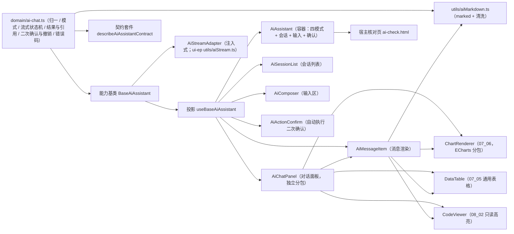

# 01 详细设计 · AI 助手

> 前端组件库 · 08 交互类 · 10 AI 助手（需求 08-10）· 详细设计

[文档首页](../../../../../../文档首页.md) › [08 交互类](../../08_交互类.md) › [10 AI 助手](../08_交互类_10_AI助手.md) › 详细设计　|　[← 任务](../08_交互类_10_AI助手.md)

## 1. 设计目标与范围 <a id="goal"></a>

交付[需求 08-10](../../../../需求/08_需求_交互类.md#r08-10) 与[任务 10](../08_交互类_10_AI助手.md) 的 **AI 助手**：

- **四模式对话**：问答（`ask`）/ 智能问数（`report`）/ 审批辅助（`approval`）/ 文档问答（`doc_qa`），会话列表与历史（新建 / 切换 / 删除 / 搜索）。
- **流式体验**：流式逐帧追加、停止（中断在途流，保留已接收内容）、失败降级提示与「重新生成」；流式状态机（`streaming → done / error / stopped`）可断言。
- **结果渲染**：问数结果图表化复用图表卡 `07_06`（`ChartRenderer`）；表格结果复用 `07_05` 通用表格（`DataTable`）；文档问答展示**引用来源**；审批辅助展示**风险提示**；每条助手消息展示**审计标识**（`ai_chat_log`）。
- **自动执行安全**：AI 生成执行内容 → 展示待确认内容 → **强制二次确认** → 执行；可撤销动作提供**撤销**入口；开关未开 / 白名单外 / 缺确认 / 不可撤销按错误码提示（10208 ~ 10212）。
- **分包**：AI 面板（`AiChatPanel`）独立分包懒加载、首屏不加载；`08_01_03` 冻结的对外契约（导出名 / Props / 事件 / 插槽 / `data-test` / 分包入口）**只增不改**。
- **通路注入式**：会话 / 消息 / 对话 / 停止 / 重生成 / 确认 / 撤销 / 删除一经纪注入式处理函数 `AiJobs`；流式经注入式适配器 `AiStreamAdapter`；**未注入即占位零请求**（保持 `08_01_03` 冻结口径）。

### 1.1 口径与依从 <a id="positioning"></a>

- **架构铁律**：会话与消息状态、四模式、流式状态机、自动执行二次确认与撤销为**横切功能**，落为**继承链上的能力基类** `BaseAiAssistant`（父 `BaseComponent`）+ **领域纯函数** `domain/ai-chat.ts`；件层只做渲染与交互回传，**不得链外挂接、不得重复实现流式状态机与确认分支**。
- **继承链（唯一权威见《前端基类清单》）**：`BaseComponent`（组件根）→ `BaseAiAssistant`（新增 AI 助手编排能力基类）→ 具体件（经投影 `useBaseAiAssistant` 挂链）。
- **核心框架无关（强制）**：核心包不得依赖 Vue / DOM / 浏览器 API；流式以**注入式适配器** `AiStreamAdapter` 接入，浏览器 `fetch` 流（SSE）与 Markdown 渲染归 `ui-ep`。
- **取数与交互分离**：**取数归使用方**（会话 / 消息 / 对话 / 确认 / 撤销经注入式 `AiJobs`）；件**不自行发请求**；**未注入即占位零请求**。
- **流式口径**：核心冻结 `AiStreamAdapter` 接口与流式状态机纯函数；`ui-ep` 交付浏览器原生 SSE 适配器 `utils/aiStream.ts`（`fetch` + `ReadableStream`，支持 POST / 请求头 / 中止）；**未注入适配器即占位**（`send` 仅本地追加、不发请求）。
- **自动执行安全**：强制二次确认（缺确认拒绝 10211）、撤销（不可撤销 10212）；`ai.auto_approve` 依赖 `ai.auto_execute`（前端不放开依赖）；`ai.auto_execute` 未开时按钮隐藏 / 提示（10208 / 10209）；白名单外拒绝（10210）。
- **权限口径**：`ai:chat` 控入口与发送；`ai:manage` 可查全量审计会话（普通用户仅本人），经 `BaseAccess` 判定。
- **令牌（强制）**：气泡底 / 流式光标 / 风险提示 / 引用底走新增 `--bms-ai-*` 令牌组；**禁止硬编码色值**。
- **端范围**：**仅 PC**（`ui-ep`）；移动端本期不落实现（问答机器人复用对话接口，未来按同契约实现）。
- **工时**：本任务 24h；因新增 1 个能力基类、1 份领域纯函数、1 套契约套件、1 套投影、2 个插件工具、六件组件（2 迁移 + 4 新增）与宿主核对页，实际上浮在实施记录登记。

## 2. 交付物清单 <a id="deliver"></a>

| # | 交付物 | 落点 |
| --- | --- | --- |
| 1 | AI 对话领域纯函数与数据模型（新增） | `core/src/domain/ai-chat.ts` |
| 2 | AI 助手编排能力基类 `BaseAiAssistant`（新增） | `core/src/capabilities/ai-assistant.ts` |
| 3 | 能力依赖登记（新增 `ai-assistant` 一键） | `core/src/capabilities/manifest.ts` |
| 4 | 核心导出面登记 | `core/src/index.ts` |
| 5 | 契约套件 `describeAiAssistantContract`（新增） | `core/testing/ai-assistant.ts`、`core/testing/index.ts` |
| 6 | 核心用例（领域 + 能力基类） | `core/tests/domain-ai-chat.spec.ts`、`core/tests/ai-assistant.spec.ts` |
| 7 | AI 助手投影（新增） | `ui-ep/src/composables/useBaseAiAssistant.ts` |
| 8 | 浏览器 SSE 流适配器（新增，单一落点） | `ui-ep/src/utils/aiStream.ts` |
| 9 | Markdown 渲染与清洗工具（新增，单一落点） | `ui-ep/src/utils/aiMarkdown.ts` |
| 10 | AI 助手容器（迁移 + 真实实现） | `ui-ep/src/components/ai/AiAssistant.vue`（旧 `components/interaction/AiAssistant.vue` 删除） |
| 11 | 对话面板（迁移 + 真实实现，独立分包） | `ui-ep/src/components/ai/AiChatPanel.vue`（旧 `components/interaction/AiChatPanel.vue` 删除） |
| 12 | 会话列表（新增） | `ui-ep/src/components/ai/AiSessionList.vue` |
| 13 | 消息渲染件（新增） | `ui-ep/src/components/ai/AiMessageItem.vue` |
| 14 | 输入区（新增） | `ui-ep/src/components/ai/AiComposer.vue` |
| 15 | 自动执行二次确认件（新增） | `ui-ep/src/components/ai/AiActionConfirm.vue` |
| 16 | 导出面登记（路径迁移 + 四件新增 + 投影 / 工具） | `ui-ep/src/index.ts` |
| 17 | 设计令牌（新增 `--bms-ai-*` 组，亮 / 暗两套） | `apps/desktop/src/styles/tokens.scss` |
| 18 | 插件依赖（Markdown 渲染） | `ui-ep/package.json`（`marked`） |
| 19 | 用例（投影 + 六件 + 流式 / 停止 / 重试 / 二次确认与撤销 / 分包） | `ui-ep/tests/interaction-ai.spec.ts` |
| 20 | 宿主核对页（`vite build` 不含） | `apps/desktop/ai-check.html`、`apps/desktop/src/dev/{aiCheck.ts,AiCheck.vue}` |
| 21 | 登记回写（基类清单 / 组件设计 / 架构 / 布局 / 需求 / 计划与状态） | 见第 6 节 |



```text
ui-ep/src/components/
├── ai/                                  # 新增专题族（AI 助手；同 notice/ report/ screen/ 先例）
│   ├── AiAssistant.vue                  # 容器（自 interaction/ 迁入 + 真实实现：四模式 / 会话 / 输入 / 确认装配）
│   ├── AiChatPanel.vue                  # 对话面板（自 interaction/ 迁入 + 真实实现；独立分包 data-subpackage="ai"）
│   ├── AiSessionList.vue                # 会话列表（新增：新建 / 切换 / 删除 / 搜索 / 按模式）
│   ├── AiMessageItem.vue                # 消息渲染件（新增：Markdown / 代码 / 图表 / 表格 / 引用 / 风险 / 审计）
│   ├── AiComposer.vue                   # 输入区（新增：多行输入 / 发送 / 停止 / 附件 / 字数 / 快捷问题）
│   └── AiActionConfirm.vue              # 自动执行二次确认（新增：待确认内容 / 强制确认 / 撤销）
└── interaction/                         # 迁出后其余件不动
```

## 3. 接口 / 契约与边界 <a id="contract"></a>

### 3.1 核心：`domain/ai-chat.ts`（新增纯函数与数据模型） <a id="domain"></a>

```ts
/** AI 对话权限码（对话 / 问数 / 审批辅助 / 文档问答入口）。 */
export const AI_CHAT_PERM = 'ai:chat'
/** AI 审计与模型管理权限码（全量审计会话）。 */
export const AI_MANAGE_PERM = 'ai:manage'
/** AI 助手占位文案。 */
export const AI_PLACEHOLDER_TEXT = 'AI 助手未就绪（占位）'
/** 流式通道未就绪文案。 */
export const AI_STREAM_PLACEHOLDER_TEXT = '流式通道未就绪（占位）'
/** 自动执行未开启文案。 */
export const AI_AUTO_EXECUTE_DISABLED_TEXT = '自动执行未开启'
/** 缺二次确认文案。 */
export const AI_CONFIRM_REQUIRED_TEXT = '自动执行需二次确认'
/** 不可撤销文案。 */
export const AI_REVOKE_UNAVAILABLE_TEXT = '该动作不可撤销'
/** 消息内容长度上限（码点，与 08_07 / 08_08 口径统一为 4000）。 */
export const AI_MESSAGE_MAX = 4000
/** 问题输入长度上限（码点）。 */
export const AI_PROMPT_MAX = 2000
/** 会话列表页长缺省与上限。 */
export const AI_SESSION_PAGE_SIZE_DEFAULT = 20
export const AI_SESSION_PAGE_SIZE_MAX = 200

/** 助手模式。 */
export type AiMode = 'ask' | 'report' | 'approval' | 'doc_qa'
/** 助手模式集合。 */
export const AI_MODES: readonly AiMode[]
/** 消息角色。 */
export type AiRole = 'user' | 'assistant'
/** 消息状态。 */
export type AiMessageStatus = 'streaming' | 'done' | 'error' | 'stopped'
/** 消息状态集合。 */
export const AI_MESSAGE_STATUSES: readonly AiMessageStatus[]
/** 结果种类。 */
export type AiResultKind = 'chart' | 'table'
/** 引用来源类型。 */
export type AiCitationType = 'file' | 'article' | 'record'
/** 自动执行动作状态。 */
export type AiActionState = 'pending' | 'confirmed' | 'executed' | 'revoked' | 'failed'

/** 引用来源。 */
export interface AiCitation { type: AiCitationType; title: string; id: string }
/** 结果列。 */
export interface AiResultColumn { name: string; type?: string; label?: string }
/** 结果（`columns` / `title` 为本次向后兼容新增可选字段）。 */
export interface AiResult {
  kind: AiResultKind
  chartType?: string
  datasetId?: string
  title?: string
  columns?: AiResultColumn[]
  rows?: Record<string, unknown>[]
}
/** 消息（`createdAt` 为新增可选字段）。 */
export interface AiMessage {
  id: string
  role: AiRole
  status: AiMessageStatus
  content: string
  result?: AiResult
  citations?: AiCitation[]
  risks?: string[]
  auditId?: string
  createdAt?: string
}
/** 会话。 */
export interface AiSession {
  id: string
  title: string
  mode: AiMode
  updatedAt: string
}
/** 待确认动作（自动执行 / 自动审批）。 */
export interface AiPendingAction {
  id: string
  title: string
  summary?: string
  content?: string
  state: AiActionState
  confirmable: boolean
  revocable: boolean
  auditId?: string
}
/** 流式事件（状态机输入）。 */
export type AiStreamEvent =
  | { type: 'start' }
  | { type: 'chunk'; delta: string }
  | { type: 'done'; patch?: Partial<AiMessage> }
  | { type: 'error'; message?: string }
  | { type: 'stop' }

normalizeAiMode(value): AiMode
normalizeAiRole(value): AiRole
normalizeAiMessageStatus(value): AiMessageStatus
normalizeAiCitationType(value): AiCitationType
normalizeAiCitation(value): AiCitation | undefined
normalizeAiCitations(value): AiCitation[]
normalizeAiResultColumn(value): AiResultColumn | undefined
normalizeAiResultColumns(value): AiResultColumn[]
normalizeAiResult(value): AiResult | undefined
normalizeAiMessage(value): AiMessage | undefined
normalizeAiMessages(value): AiMessage[]
normalizeAiSession(value): AiSession | undefined
normalizeAiSessions(value): AiSession[]
normalizePendingAction(value): AiPendingAction | undefined
normalizeAiSessionsPage(value): { items: AiSession[]; total: number }

modeLabel(mode): string
messageStatusLabel(status): string
citationTypeLabel(type: AiCitationType): string
resolveAiSemantic(status): StatusSemantic

nextSessionId(sessions): string
nextMessageId(messages): string
deriveSessionTitle(content, max?): string
sortSessions(sessions): AiSession[]
filterSessions(sessions, query: { mode?: AiMode | 'all'; keyword?: string }): AiSession[]

/** 流式状态机（对单条消息做不可变迁移）。 */
startStreamMessage(input: { id: string; role: AiRole; content?: string; createdAt?: string }): AiMessage
appendStreamChunk(message: AiMessage, delta: string): AiMessage
finishMessage(message: AiMessage, patch?: Partial<AiMessage>): AiMessage
failMessage(message: AiMessage, message?: string): AiMessage
stopMessage(message: AiMessage): AiMessage
reduceStream(message: AiMessage, event: AiStreamEvent): AiMessage

canSend(ready, content, streaming, hasPerm): boolean
canStop(streaming): boolean
canRegenerate(message): boolean
validatePrompt(content): { valid: boolean; message?: string }
countAiCodePoints(text): number

canAutoExecute(autoExecute, hasPerm): boolean
autoApproveAvailable(autoExecute, autoApprove): boolean
requiresConfirm(action): boolean
canRevokeAction(action): boolean
applyActionConfirm(action): AiPendingAction
applyActionExecute(action, patch?): AiPendingAction
applyActionRevoke(action): AiPendingAction
applyActionFail(action): AiPendingAction
resolveActionState(action): AiActionState

isAiErrorCode(value): boolean
resolveAiErrorText(code): string
deriveAiKey(input): string
splitContentSegments(content): { type: 'text' | 'code'; text: string; lang?: string }[]
resolveRegenerateInput(messages, messageId): { content: string; mode: AiMode } | undefined
```

| 行为 | 口径 |
| --- | --- |
| 模式归一 | `normalizeAiMode`：非白名单回落 `ask` |
| 消息归一 | `normalizeAiMessage`：`id` / `content` 缺失视为脏项剔除（助手流式占位允许空 `content`）；`status` 非白名单回落 `done`；`role` 非白名单回落 `assistant`；`result` / `citations` / `risks` / `auditId` 归一后按需保留 |
| 结果归一 | `normalizeAiResult`：`kind` 非 `chart` / `table` 视脏项丢弃；`rows` 非数组回落 `undefined`；`columns` 逐项归一（缺 `name` 丢弃）；`chartType` / `title` / `datasetId` 去空保留 |
| 会话归一 | `normalizeAiSession`：`id` 缺失丢弃；`title` 缺省「新会话」；`mode` 归一；`updatedAt` 缺省空串 |
| 流式状态机 | `startStreamMessage` 置 `streaming`；`appendStreamChunk` 仅 `streaming` 追加（防迟到帧污染已停止消息）；`finishMessage` 置 `done` 并合并结果 / 引用 / 风险 / 审计；`failMessage` 置 `error`；`stopMessage` 置 `stopped` 并保留已接收内容；`reduceStream` 按 `AiStreamEvent` 分派 |
| 发送判定 | `canSend`：就绪 ∧ 持 `ai:chat` ∧ 非流式中 ∧ 内容非空且未超 `AI_PROMPT_MAX` |
| 重生成判定 | `canRegenerate`：助手消息且状态为 `error` / `stopped` |
| 会话排序 / 筛选 | `sortSessions` 按 `updatedAt` 降序（缺失视为最旧、稳定保序）；`filterSessions` 按 `mode`（`all` 不过滤）与 `keyword`（标题包含，空串不过滤） |
| 二次确认 | `requiresConfirm`：动作 `state === 'pending'` 且 `confirmable`；`canRevokeAction`：`state === 'executed'` 且 `revocable`；`applyActionConfirm` → `confirmed`；`applyActionExecute` → `executed`（可回传 `auditId` / `revocable`）；`applyActionRevoke` → `revoked`；`applyActionFail` → `failed` |
| 自动执行门控 | `canAutoExecute`：持 `ai:chat` 且开关开启；`autoApproveAvailable`：`ai.auto_approve` 依赖 `ai.auto_execute`（未开自动执行时自动审批不可用） |
| 错误码 | `isAiErrorCode` 落在 `10201 ~ 10216`；`resolveAiErrorText` 出中文（模型不可用 10201 / 调用超时 10202 / 输出校验 10203 / 预算超限 10204 / 租户无端点 10205 / 数据集白名单 10206 / SQL 校验 10207 / 自动执行未开 10208 / 自动审批未开 10209 / 白名单外 10210 / 缺确认 10211 / 不可撤销 10212 / 文件未分段 10213 / 审计失败 10216；未知回落通用文案） |
| 幂等键 | `deriveAiKey`：`ai:{fnv1aHex(stableStringify(input))}`（自动执行 / 审批提交用，内容派生） |
| 内容分段 | `splitContentSegments`：按围栏代码块（```lang）切分 `text` / `code` 段，供消息渲染件分别走 Markdown 与只读高亮 |
| 纯数据 | 不触 DOM、不请求、不依赖渲染框架与第三方库；同输入同输出 |

### 3.2 核心：能力基类 `BaseAiAssistant`（新增） <a id="base"></a>

```ts
/** 对话请求载荷（与后端 `POST /api/v1/ai/chat` 同源）。 */
export interface AiChatRequest {
  mode: AiMode
  content: string
  sessionId?: string
  datasetId?: string
  fileIds?: string[]
}
/** 注入的处理函数集（未注入即占位不请求）。 */
export interface AiJobs {
  loadSessions?: (input: { mode?: AiMode | 'all'; keyword?: string }) => Promise<unknown>
  loadMessages?: (input: { sessionId: string }) => Promise<unknown>
  chat?: (input: AiChatRequest) => Promise<unknown>
  stop?: (input: { sessionId?: string; messageId?: string }) => Promise<boolean | undefined>
  regenerate?: (input: { sessionId?: string; messageId: string }) => Promise<unknown>
  confirmAction?: (input: { actionId: string; payload?: Record<string, unknown> }) => Promise<{ revocable?: boolean; auditId?: string } | undefined>
  revokeAction?: (input: { actionId: string }) => Promise<boolean | undefined>
  removeSession?: (id: string) => Promise<boolean | undefined>
}
/** 流式完成载荷。 */
export interface AiStreamDonePayload {
  auditId?: string
  result?: unknown
  citations?: unknown
  risks?: unknown
}
/** 流式回调。 */
export interface AiStreamHandlers {
  onChunk(chunk: string): void
  onDone(payload?: AiStreamDonePayload): void
  onError(error: unknown): void
}
/** 流式适配器接口（宿主注入；核心不依赖浏览器 API）。 */
export interface AiStreamAdapter {
  /** 发起一次流式对话，返回可中止句柄。 */
  start(input: { request: AiChatRequest; handlers: AiStreamHandlers }): { abort(): void }
}
/** 助手阶段。 */
export type AiAssistantPhase = 'idle' | 'loading' | 'streaming' | 'ready' | 'error'

export abstract class BaseAiAssistant extends BaseComponent {
  readonly identifier: string = 'ai-assistant'
  override readonly depends = ['access', 'notice', 'data-state', 'option-source', 'async-task']
  ready = false
  requestCount = 0
  mode: AiMode = 'ask'
  sessions: AiSession[] = []
  activeSessionId = ''
  messages: AiMessage[] = []
  streaming = false
  streamingMessageId = ''
  autoExecute = false
  autoApprove = false
  pendingAction: AiPendingAction | undefined
  phase: AiAssistantPhase = 'idle'
  errorMessage = ''
  errorCode: number | undefined
  jobs: AiJobs = {}
  stream: AiStreamAdapter | undefined
  access / notice / dataState / optionSource / asyncTask: ...

  get degraded(): boolean
  get busy(): boolean
  get canChat(): boolean
  get canManage(): boolean
  get activeSession(): AiSession | undefined
  get canSend(): boolean
  get canStopStreaming(): boolean
  get canAutoExecute(): boolean
  get autoApproveAvailable(): boolean

  setReady(value): void
  setJobs(jobs): void
  setStream(adapter): void
  setAccess / setNotice / setDataState / setOptionSource / setAsyncTask(...)
  setMode(mode): boolean
  setSessions(sessions): void
  setMessages(messages): void
  selectSession(id): boolean
  newSession(mode?): AiSession
  removeSession(id): Promise<boolean>
  appendLocalMessage(message): AiMessage | undefined
  setAutoExecute(value): void
  setAutoApprove(value): void
  loadSessions(input?): Promise<AiSession[] | undefined>
  loadMessages(sessionId?): Promise<AiMessage[] | undefined>
  send(input: { content: string; datasetId?: string; fileIds?: string[] }): Promise<AiMessage | undefined>
  appendChunk(delta: string): void
  stop(): Promise<boolean>
  regenerate(messageId?): Promise<AiMessage | undefined>
  retry(): Promise<AiMessage | undefined>
  setPendingAction(action): void
  confirmAction(actionId?): Promise<boolean>
  revokeAction(actionId?): Promise<boolean>
  refreshDatasets(): Promise<void>
}
```

| 行为 | 口径 |
| --- | --- |
| 占位语义 | `ready === false` → `degraded` 为真；会话 / 消息取数、`send`、`stop`、`regenerate`、确认 / 撤销**零请求**（`requestCount` 恒 0） |
| 权限 | `canChat` = `access === undefined ∨ has(AI_CHAT_PERM)`；`canManage` = `has(AI_MANAGE_PERM)`；无 `ai:chat` → 件层只读 + 提示 |
| 就绪 / 装载 | `loadSessions` / `loadMessages` 注入后调 `jobs.*`（`requestCount += 1`），归一装载；失败置 `error` + `errorMessage` + `errorCode` |
| 发送 | `send`：未就绪 / 无权 / 流式中 / 内容非法 → 不动作；否则追加用户消息 + 助手占位消息（`streaming`），`streaming = true`、`phase = 'streaming'`；**注入 `stream`** → `adapter.start`（`onChunk` → `appendChunk`；`onDone` → `finishMessage` + 审计 / 结果 / 引用 / 风险；`onError` → `failMessage` + 错误码）；**未注入但注入 `jobs.chat`** → 非流式兜底填充；**皆未注入** → 仅本地占位消息（不发请求，可件层自测） |
| 停止 | `stop`：`streaming` 为真时中止在途句柄、助手消息置 `stopped`（保留内容）；注入 `jobs.stop` 则通知后端；返回是否生效 |
| 重生成 | `regenerate(messageId?)`：取该消息对应的原始用户输入（`resolveRegenerateInput`），删 / 复用后续助手消息并重发（等价 `send`，`requestCount += 1` 若走 `jobs.chat`） |
| 重试 | `retry`：对最近 `error` / `stopped` 消息重生成 |
| 会话 | `newSession`：生成稳定 id（`nextSessionId`）并置于最前；`selectSession` 校验存在性并清空 / 重新装载消息；`removeSession`：本地即时移除 + 注入时提交（失败回滚） |
| 数据集 / 附件 | `refreshDatasets` 经 `optionSource` 加载（未注入加载器零请求）；附件经宿主 `files` 注入，能力侧只传 `fileIds` |
| 自动执行 | `confirmAction`：`requiresConfirm` 为真才动作（缺确认 → 错误码 10211 提示）；注入 `jobs.confirmAction` 则提交，成功置 `executed`（可撤销）；`revokeAction`：`canRevokeAction` 为真才动作，成功置 `revoked`（不可撤销 → 10212）；开关未开 → 10208 / 10209，白名单外 → 10210 |
| 防重复 | `busy`（`phase === 'loading'`）/ `streaming` 期间重复 `send` 返回 `undefined` |
| 释放 | 随 `BaseComponent` 释放时中止在途流句柄，防泄漏 |
| 纯数据 | 不触 DOM、不请求（除注入处理函数与适配器）；状态变更经生命周期 `update` 通知 |

- 依赖登记：`ai-assistant: ['access', 'notice', 'data-state', 'option-source', 'async-task']`。
- 不含：浏览器 SSE 实现（`utils/aiStream.ts`）、Markdown 渲染与清洗（`utils/aiMarkdown.ts`）、模型适配 / RAG / NL2SQL 生成与执行 / 审计与预算（后端）、模型配置页、移动端。

### 3.3 核心：契约套件 `describeAiAssistantContract`（`@bms/core/testing`） <a id="testing"></a>

| 契约面（结构化接口） | 断言要点 |
| --- | --- |
| `ready` / `degraded` / `requestCount` / `phase` / `mode` / `sessions` / `activeSessionId` / `messages` / `streaming` / `streamingMessageId` / `autoExecute` / `autoApprove` / `pendingAction` / `canSend` / `canStopStreaming` / `canAutoExecute` | 占位态降级且零请求（`loadSessions` / `loadMessages` / `send` / `stop` / `regenerate` / 确认 / 撤销后仍为 0）；就绪后不再降级 |
| `setReady` / `setJobs` / `setStream` / `setMode` / `setSessions` / `setMessages` / `selectSession` / `newSession` / `removeSession` / `loadSessions` / `loadMessages` / `send` / `appendChunk` / `stop` / `regenerate` / `retry` / `setPendingAction` / `confirmAction` / `revokeAction` | 就绪未注入处理函数仍零请求；会话与消息取数装载；发送进入流式并追加用户 + 助手消息；`appendChunk` 逐帧追加；`stop` 置 `stopped` 保留内容；`regenerate` 复用原输入；流式 `done` 合并结果 / 引用 / 风险 / 审计；错误置 `error`；确认 / 撤销状态机与错误码；无 `ai:chat` 不发；防重复 |

- 契约目标约定：会话 `s1`（`ask`）；历史消息 `m1`（助手 `done`）；流式适配器为**桩适配器**（记录调用并派发 chunk / done / error）；核心用例与 `ui-ep` 用例共用同一套断言（「同契约多实现」）。
- 复用 `describePlaceholderInteractionContract`（`08_01_01` 冻结）：真实实现继续跑同一套件，断言不改动即通过。

### 3.4 插件层：投影 `useBaseAiAssistant`（新增） <a id="projection"></a>

```ts
useBaseAiAssistant(options?: UseBaseAiAssistantOptions): UseBaseAiAssistantResult
```

- 薄适配（核心实例 ↔ Vue 响应式）；协作者经 `markRaw(toRaw(x))` 隔离；`onScopeDispose` 解除订阅并 `dispose`；返回面与核心方法一一对应（含 `ready` / `degraded` / `phase` / `mode` / `sessions` / `activeSessionId` / `messages` / `streaming` / `pendingAction` / `requestCount` 等响应式引用）。
- 选项：`ready` / `mode` / `sessions` / `messages` / `autoExecute` / `autoApprove` / `jobs` / `stream` / `access` / `notice` / `dataState` / `optionSource` / `asyncTask`。

### 3.5 插件层：工具（新增） <a id="utils"></a>

```ts
// ui-ep/src/utils/aiStream.ts
/** 浏览器原生 SSE 流适配器选项。 */
export interface SseStreamAdapterOptions {
  /** 流式端点（缺省 `/api/v1/ai/chat/stream`）。 */
  endpoint?: string
  /** 请求头（含鉴权，由宿主注入）。 */
  headers?: Record<string, string> | (() => Record<string, string>)
  /** 流协议解析（缺省按 `data:` 行 JSON 解析 `{ delta | done | auditId | result | citations | risks | error }`）。 */
  parse?: (line: string) => AiStreamDonePayload | { delta: string } | undefined
}
/** 创建浏览器原生 SSE 流适配器（`fetch` + `ReadableStream`，POST；未注入即不使用）。 */
export function createSseStreamAdapter(options?: SseStreamAdapterOptions): AiStreamAdapter

// ui-ep/src/utils/aiMarkdown.ts
/** 渲染 Markdown 为安全 HTML（marked + DOMPurify 白名单清洗；Markdown 经 AI 分包内动态加载）。 */
export function renderAiMarkdown(content: string): Promise<string>
/** 分段：文本段与围栏代码段（供代码高亮分工）。 */
export function splitAiContent(content: string): { type: 'text' | 'code'; text: string; lang?: string }[]
```

| 行为 | 口径 |
| --- | --- |
| SSE 适配器 | `fetch(endpoint, { method: 'POST', headers, body, signal })`；按行读 `ReadableStream`，`data:` 行经 `parse` 分发 `onChunk` / `onDone` / `onError`；`abort()` 触发 `AbortController.abort()`（幂等）；网络 / 解析失败 → `onError`；`fetch` 不可用（测试 / SSR）→ 立即 `onError` 降级（不抛错） |
| Markdown | `renderAiMarkdown`：`marked.parse` 产 HTML → 既有 `sanitizeHtml` 白名单清洗（禁脚本 / 事件属性 / 危险协议）；`marked` 经 UI 分包内动态加载（不进首屏） |
| 落点 | **浏览器 API（`fetch` / `ReadableStream` / `AbortController` / `DOMParser`）只出现在本两工具与件层**，核心与投影判定逻辑不触 DOM |

### 3.6 插件层：件族（`ui-ep/src/components/ai/`） <a id="components"></a>

件族落 `ui-ep/src/components/ai/`（同 `notice/`、`report/`、`screen/` 先例），**对外导出名、既有 Props / 事件 / 插槽 / `data-test` / 分包入口不变**，旧路径 `components/interaction/{AiAssistant,AiChatPanel}.vue` 删除；新增 `AiSessionList` / `AiMessageItem` / `AiComposer` / `AiActionConfirm`。

#### 3.6.1 `AiAssistant.vue`（迁移 + 真实实现） <a id="c-assistant"></a>

| 面 | 内容 |
| --- | --- |
| 数据面（既有，保持） | `ready`（缺省 `false`）/ `mode` / `sessions`（`AiSession[]`）/ `activeSessionId` / `messages`（`AiMessage[]`）/ `streaming` / `datasets`（`ReportDataset[]`）/ `files`（`{ id, name }[]`）/ `autoExecute` / `autoApprove` / `degradeText` |
| 数据面（新增，全部可选） | `jobs` / `stream` / `access` / `notice` / `optionSource` / `pendingAction` / `errorCode` / `errorText` |
| 事件（既有，保持） | `update:mode` / `send`（`{ mode, content, datasetId?, fileIds?, sessionId? }`）/ `stop` / `regenerate`（`messageId`）/ `select-session`（`sessionId`）/ `new-session` / `remove-session`（`sessionId`）/ `attach`（`fileIds`）/ `confirm-action`（`sessionId`）/ `revoke-action`（`sessionId`）/ `retry` |
| 事件（新增） | `loaded` / `failed`（`{ message, code? }`）/ `session-created`（`sessionId`）/ `messages-loaded`（`sessionId`）/ `action-confirmed`（`{ actionId }`）/ `action-revoked`（`{ actionId }`）/ `dataset-load` / `update:pendingAction` |
| 插槽（既有，保持） | `degrade` / `empty` / `live` / `sessions` / `input` |
| 插槽（新增） | `session-list`（替换内置会话列表）/ `message`（作用域 `{ message }`）/ `composer`（替换内置输入区）/ `action-confirm`（替换内置确认件） |
| `data-test`（既有，保持） | `placeholder` / `modes` / `mode-{mode}` / `topics` / `sessions` / `new-session` / `session-{id}` / `remove-session-{id}` / `chat` / `input-area` / `input` / `dataset-select` / `attach` / `send` / `stop` / `confirm-action` / `revoke-action` / `stream-buffer` |
| `data-test`（新增） | `ai-assistant`（`data-subpackage-host="ai"`）/ `session-list` / `composer` / `action-confirm` / `error-hint` / `readonly-hint` |

- **事件与注入双轨**：点击一律**保留既有事件上抛**；**仅当宿主注入 `jobs` / `stream`** 时件内才驱动真实编排（避免重复执行）。既有冻结用例（未注入）断言不变即通过。
- **取值口径**：`degraded` / `disabled` 由 `BaseAiAssistant`（经 `ready`）决定；`mode` / `sessions` / `messages` / `streaming` 受控优先、内部状态兜底；四模式页签、会话列表、对话面板、输入区装配；`autoExecute` 为真时渲染 `confirm-action` / `revoke-action`（兼容既有语义：点击上抛 `activeSessionId`），注入 `pendingAction` 时额外渲染 `AiActionConfirm`（真实二次确认）。
- **兼容流式元素**：未注入 `stream` 时沿用 `useBaseSubscription('ai.stream')` 占位（保持 `topics` / `stream-buffer` 元素与原有行为）；注入 `stream` 后由能力基类驱动 `messages` 流式追加。

#### 3.6.2 `AiChatPanel.vue`（迁移 + 真实实现，独立分包） <a id="c-panel"></a>

| 面 | 内容 |
| --- | --- |
| 数据面（既有，保持） | `messages`（`AiMessage[]`）/ `streaming` |
| 数据面（新增，可选） | `ready` / `mode` / `datasets` / `emptyText` / `degradeText` / `themeMode` |
| 事件（既有，保持） | `regenerate`（`messageId`） |
| 事件（新增） | `retry` / `citation-click`（`{ citation }`）/ `copy`（`{ messageId }`）/ `confirm-action`（`{ actionId }`） |
| 插槽（既有，保持） | —（占位版无插槽） |
| 插槽（新增） | `empty` / `message`（作用域 `{ message }`）/ `footer` |
| `data-test`（既有，保持） | `chat-panel`（`data-subpackage="ai"`）/ `chat-empty` / `message-{id}`（`data-role` / `data-status`）/ `message-content` / `message-result` / `message-audit` / `message-citation` / `message-risk` / `regenerate` |
| `data-test`（新增） | `message-list` / `message-chart` / `message-table` / `message-code` / `message-streaming` / `message-stopped` / `message-error` / `chat-error` / `chat-retry` |

- **消息渲染**：每条消息用 `AiMessageItem`（既有 `message` 插槽优先）；文本走 `renderAiMarkdown` + 白名单清洗；围栏代码走 `CodeViewer`（只读高亮）；`result.kind === 'chart'` → `ChartRenderer`（`normalizeChartConfig(chartType + columns/rows)`，ECharts 内核独立分包）；`result.kind === 'table'` → `DataTable`（只读）；引用来源 / 风险提示 / 审计标识分组展示。
- **流式与状态**：`streaming` 时展示流式光标（`message-streaming`）；`stopped` / `error` 消息展示「重新生成」（`regenerate`）；整体失败展示 `chat-error` + `chat-retry`。
- **既有冻结断言**：`data-subpackage="ai"`、`chat-empty`、`message-content` / `message-result` / `message-audit` / `message-citation` / `message-risk`、`regenerate` 元素与行为保持。

#### 3.6.3 `AiSessionList.vue`（新增 · 会话列表） <a id="c-sessions"></a>

| 面 | 内容 |
| --- | --- |
| 数据面 | `sessions`（`AiSession[]`）/ `activeSessionId` / `mode`（`AiMode | 'all'`）/ `keyword` / `showSearch` / `showRemove` / `disabled` |
| 事件 | `select`（`sessionId`）/ `create` / `remove`（`sessionId`）/ `update:mode` / `update:keyword` |
| 插槽 | `default`（整体替换）/ `item`（作用域 `{ session }`）/ `empty` |
| `data-test` | `session-list` / `session-search` / `session-filter` / `new-session` / `session-{id}`（`data-active`）/ `remove-session-{id}` / `session-empty` |

- 按 `sortSessions` 排序渲染；模式筛选与关键字搜索上抛 `update:*`（不自行取数，由使用方决定重查）；`ai:manage` 由宿主决定是否放开全量审计（件内只展示传入集合）。

#### 3.6.4 `AiMessageItem.vue`（新增 · 消息渲染件） <a id="c-message"></a>

| 面 | 内容 |
| --- | --- |
| 数据面 | `message`（`AiMessage`，必填）/ `mode` / `datasets` / `themeMode` / `streaming`（是否正在流式）/ `compact` / `showAudit`（缺省 `true`）/ `showRisks`（缺省 `true`）/ `showCitations`（缺省 `true`） |
| 事件 | `regenerate`（`messageId`）/ `citation-click`（`{ citation }`）/ `copy`（`{ messageId }`） |
| 插槽 | `default`（整体替换）/ `content` / `result` / `citations` / `risks` / `actions` |
| `data-test` | `ai-message-{id}`（`data-role` / `data-status`）/ `message-content` / `message-streaming` / `message-result` / `message-chart` / `message-table` / `message-code` / `message-citation` / `message-risk` / `message-audit` / `message-regenerate` / `message-copy` |

- 用户气泡与助手气泡分形态；助手内容 Markdown 渲染 + 代码只读高亮；结果图表 / 表格复用既有件；引用来源按类型标注 + 点击上抛；风险提示列表（审批辅助）；审计标识展示 / 复制。
- **不硬编码色值**：气泡底 / 流式光标 / 风险提示 / 引用底走 `--bms-ai-*` 令牌。

#### 3.6.5 `AiComposer.vue`（新增 · 输入区） <a id="c-composer"></a>

| 面 | 内容 |
| --- | --- |
| 数据面 | `mode` / `modelValue`（输入内容，`v-model`）/ `streaming` / `disabled` / `ready` / `datasets` / `datasetId` / `files` / `showAttach` / `placeholder` / `maxLength`（缺省 `AI_PROMPT_MAX`）/ `shortcuts`（快捷问题）/ `errorText` |
| 事件 | `update:modelValue` / `update:datasetId` / `send` / `stop` / `attach`（`fileIds`）/ `shortcut`（`text`）/ `retry` |
| 插槽 | `default`（整体替换）/ `toolbar` / `hint` |
| `data-test` | `ai-composer` / `input` / `send` / `stop` / `attach` / `dataset-select` / `composer-count` / `composer-shortcuts` / `composer-error` / `composer-retry` |

- 多行输入（回车发送、Shift+回车换行）、发送 / 停止、附件（文档问答）、模式提示、字数统计（码点）与敏感 / 超长提示、快捷问题；`disabled` / 占位时禁用；流式中「发送」换「停止」。

#### 3.6.6 `AiActionConfirm.vue`（新增 · 自动执行二次确认） <a id="c-action"></a>

| 面 | 内容 |
| --- | --- |
| 数据面 | `modelValue`（显隐，`v-model`）/ `action`（`AiPendingAction | null`）/ `ready` / `loading` / `degradeText` |
| 事件 | `update:modelValue` / `confirm`（`{ actionId }`）/ `revoke`（`{ actionId }`）/ `close` |
| 插槽 | `default`（待确认内容）/ `footer` |
| `data-test` | `ai-action-confirm` / `action-title` / `action-summary` / `action-content` / `action-confirm` / `action-revoke` / `action-state` / `action-placeholder` |

- **强制二次确认**：展示 AI 生成的执行内容 / 审批结论，点击「确认执行」才上抛 `confirm`（缺确认拒绝由能力基类把关，错误码 10211）；`state === 'executed'` 且 `revocable` 时展示「撤销」（`revoke`）；不可撤销时禁用并提示（10212）。
- 基于 `ElDialog` 承载，视觉与交互复用弹窗抽屉表单口径；占位 / 未就绪降级不发请求。

### 3.7 分包入口与依赖 <a id="chunk"></a>

| 入口 | 宿主 | 说明 |
| --- | --- | --- |
| `AiChatPanel` | `AiAssistant` | 对话面板与消息流（`data-subpackage="ai"`）；`ChartRenderer`（ECharts 内核分包）/ `CodeViewer`（highlight 分包）/ `marked`（AI 分包内）随其懒加载 |
| `marked` | `AiChatPanel` / `AiMessageItem` | Markdown 渲染（AI 分包内动态加载，不进首屏） |
| `AiSessionList` / `AiMessageItem` / `AiComposer` / `AiActionConfirm` | `AiAssistant` | 同步件（不单独分包） |

- `AiChatPanel` 用 `defineAsyncComponent(() => import(...))`；**不进 `ui-ep` 根出口**（否则静态引入使动态导入无法分包）；用例用 `vi.dynamicImportSettled()` 等待解析。
- `apps/desktop/vite.config.ts` `manualChunks` 为 `node_modules/marked` 命名独立 `vendor-marked` 块（异步块，不进首屏）。
- 新增依赖：`marked`（npmmirror 源）；**不进核心**。

### 3.8 设计令牌（新增） <a id="tokens"></a>

`apps/desktop/src/styles/tokens.scss` 新增（亮色 `:root` 与暗色 `[data-theme='dark']` 两套）：

```scss
:root {
  --bms-ai-bubble-assistant-bg: #f5f7fa;   // 助手气泡底
  --bms-ai-bubble-user-bg: var(--bms-color-primary);  // 用户气泡底
  --bms-ai-stream-cursor: var(--bms-color-primary);   // 流式光标色
  --bms-ai-risk-bg: #fdf6ec;               // 风险提示底
  --bms-ai-risk-border: var(--bms-color-warning);     // 风险提示边
  --bms-ai-citation-bg: #ecf5ff;           // 引用来源底
  --bms-ai-audit-color: var(--bms-color-text-secondary); // 审计标识色
}
```

- 暗色仅覆盖对比度相关项；**令牌只增不改**，既有令牌不变；登记《[布局设计 · 设计令牌](../../../../../../设计/布局设计/02_布局设计_设计令牌.html)》。

### 3.9 宿主核对页 <a id="check"></a>

`apps/desktop/ai-check.html` + `src/dev/{aiCheck.ts,AiCheck.vue}`（`vite build` 只构建 `index.html`，核对页不进产物）。自检项 12 项：

1. 占位降级与就绪切换（`ready` 驱动、占位零请求）；
2. 四模式页签切换与会话列表（新建 / 切换 / 删除 / 搜索）；
3. 发送消息（用户 + 助手占位）与流式逐帧追加（桩适配器）；
4. 停止（保留已接收内容、状态 `stopped`）与「重新生成」；
5. 流式失败降级（`error`）与重试；
6. 问数结果图表渲染复用 `ChartRenderer`（图表类型 + 列 / 行）；
7. 表格结果复用 `DataTable`；
8. 引用来源 / 风险提示 / 审计标识展示；
9. 自动执行待确认内容展示与**强制二次确认**（缺确认提示）；
10. 撤销（可撤销）与不可撤销提示；
11. 权限门控（无 `ai:chat` 只读提示）与自动执行开关（10208 / 10209 / 10210）；
12. 分包边界（`AiChatPanel` 的 `data-subpackage="ai"`；`marked` / ECharts 异步块）。

以 chromium headless `--dump-dom` 核验全部自检项；异步与流式相关项以 `waitFor` 轮询等待到位后再断言。

## 4. 失败分支与边界 <a id="edge"></a>

| 边界 / 失败场景 | 处置 |
| --- | --- |
| 数据通路未就绪（`ready` 为假） | 占位：降级 + 禁用 + 零请求（保持 `08_01_03` 冻结口径） |
| 处理函数 / 流适配器未注入 | 占位：不请求；`send` 仅本地追加占位消息；会话 / 消息渲染传入数据 |
| 无 `ai:chat` | 只读：入口禁用 + `readonly-hint`，`send` / 确认 / 撤销不动作 |
| 流式通道失败 | 助手消息置 `error`，展示错误提示 + 「重新生成」；不自动重试风暴（后端超时重试一次后熔断） |
| 流式中页面卸载 / 切换会话 | 中止在途句柄；保留已接收内容 |
| 流式迟到帧（停止后到达） | `appendStreamChunk` 仅对 `streaming` 生效，忽略迟到帧 |
| 重复发送 / 流式中发送 | `busy` / `streaming` 期间返回 `undefined`，件层禁用「发送」 |
| 消息内容空 / 超长 | `validatePrompt` 拦截并提示（`AI_PROMPT_MAX` 码点） |
| 模型不可用 / 未配置（10201） | 按错误码提示（i18n `error.102xx`） |
| 调用超时（10202） | 提示 + 「重新生成」 |
| 输出校验未通过（10203） | 提示，不展示未通过内容 |
| 预算超限（10204） | 前置提示，不发起请求（后端兜底） |
| 租户无端点（10205） | 提示（租户无可用模型端点） |
| 数据集白名单外（10206） / SQL 校验拒绝（10207） | 提示拒绝原因（前端只展示结果） |
| 自动执行未开（10208） / 自动审批未开（10209） | 入口隐藏或提示 |
| 白名单外（10210） | 拒绝执行并提示 |
| 缺二次确认（10211） | 拒绝执行并提示（强制二次确认） |
| 不可撤销（10212） | 撤销入口禁用并提示 |
| 文件未分段（10213） | 文档问答降级提示（可降级关键词检索，后端） |
| 审计落库失败（10216） | 提示，消息仍展示 |
| 无引用 / 无风险 / 无审计标识 | 对应分组不渲染（不报错） |
| 结果缺列信息 | 图表缺列时降级为表格 / 空态；表格无列时展示空态 |
| 图表 / 代码 / Markdown 内核加载失败 | 降级：图表占位、代码纯文本、Markdown 纯文本展示（`data-degrade` 标记） |
| 附件 / 数据集未注入 | 选择器禁用 / 隐藏，零请求 |
| `fetch` / `ReadableStream` 能力缺失 | SSE 适配器立即 `onError` 降级（不抛错） |
| 移动端 | 本期不落实现；契约套件 `describeAiAssistantContract` 就位供同契约多实现 |

## 5. 测试设计与验收映射 <a id="test"></a>

| 验收点（需求 08-10 / 任务 10） | 用例 |
| --- | --- |
| 模式 / 角色 / 状态归一、结果与引用归一、流式状态机、会话排序筛选、发送 / 停止 / 重生成判定、二次确认与撤销状态机、错误码、内容分段、幂等键 | `core/tests/domain-ai-chat.spec.ts` |
| 能力基类：占位零请求、会话 / 消息取数、发送与流式追加、停止、重生成、结果 / 引用 / 风险 / 审计合并、确认 / 撤销、权限门控、防重复、释放 | `core/tests/ai-assistant.spec.ts` + `describeAiAssistantContract` |
| 契约套件（同契约多实现） | `describeAiAssistantContract`（核心 + `ui-ep` 适配） |
| 投影薄适配（响应式面与同步、流式与确认驱动、销毁中止） | `ui-ep/tests/interaction-ai.spec.ts` |
| 六件真实实现：占位降级、四模式、会话列表、消息渲染（Markdown / 代码 / 图表 / 表格 / 引用 / 风险 / 审计）、输入区、二次确认与撤销 | 同上 |
| 浏览器 SSE 适配器（桩 `fetch`：chunk / done / error / abort）与 Markdown 清洗（脚本剔除） | 同上 |
| 分包边界（`data-subpackage="ai"`，`vi.dynamicImportSettled`） | 同上 |
| 既有 `interaction-placeholder-3.spec.ts`（`08_01_03` 冻结契约） | 未改动即通过 |
| 能力登记对账 / 注释 / 核心框架无关 / 组件挂链 | `guard-manifest.spec.ts`、`guard-jsdoc.spec.ts`、`guard-core-framework-agnostic.spec.ts`、`guard-component-inheritance.spec.ts` |
| 开发态核对页 12 项自检 | chromium headless `--dump-dom` |
| `vue-tsc`、ESLint、Vitest 全通过 | 根 `npm run check` + 宿主 `vue-tsc -b` / `lint` / `test:cov` / `build` / `budget` |
| 文档链接与基座校验 | `check-links.py`、`check-base.py` |

- 既有 `ui-ep/tests/interaction-placeholder-3.spec.ts`（`08_01_03` 冻结契约）**不得改动**，须原样通过。
- Kiwi 用例 1 条（一任务一条，编号于测试步登记后回填；分类「平台骨架」、优先级 P2、状态 `CONFIRMED`、标签「自动化」）。

## 6. 登记落点 <a id="register"></a>

| 内容 | 落点 |
| --- | --- |
| 新增能力基类 `BaseAiAssistant`（能力键 `ai-assistant`，父 `BaseComponent`，依赖 `access` / `notice` / `data-state` / `option-source` / `async-task`） | 《[前端基类清单](../../../../../../前端基类清单.md)》§2.1 插入行 + §2 继承链总览 + §5.2 能力基类表 + `capabilities/manifest.ts` |
| 领域纯函数与数据模型 `domain/ai-chat.ts` | 同上 §9「核心」（`domain/` 领域纯函数） |
| 契约套件 `describeAiAssistantContract` | 同上 §9（`core/testing/`） |
| 投影 `useBaseAiAssistant`、件族 `components/ai/`（六件）、工具 `utils/aiStream.ts` / `aiMarkdown.ts` | 同上 §9「PC 插件」（组件目录与 `composables/`、`utils/` 清单） |
| 设计令牌 `--bms-ai-*` 组 | 《[布局设计 · 设计令牌](../../../../../../设计/布局设计/02_布局设计_设计令牌.html)》（登记项）；`apps/desktop/src/styles/tokens.scss` |
| 组件设计回写（3 项上游变更） | 《[组件设计 · AI 助手](../../../../../../设计/组件设计/08_交互类/10_组件设计_AI助手/10_组件设计_AI助手.md)》§12.2：① 助手前端交互与消息 / 引用结构（消息结构补 `title` / `columns` / `createdAt`、审计标识）→《概要设计 · AI 能力》「接口设计」「功能分解与业务流程」；② 流式对话传输协议（服务端事件流：token 片段 / 结束 / 错误 / 审计标识；前端停止 / 重试口径）→《架构设计 · AI 服务》「协作」「接口」；③ 助手前端分包与复用（`AiChatPanel` 独立分包、复用图表卡 / 通用表格 / 代码高亮 / 富文本清洗）→《架构设计 · 前端架构》「技术要点」「前端性能」 |
| 任务 / 父任务 / 域任务 / 计划与状态 | [任务](../08_交互类_10_AI助手.md)、[父任务](../../08_交互类.md)、[计划](../../../../计划/01_计划_前端组件库.md)（`08_10` 由「搁置（AI 服务窗口）」改「阶段四窗口内推进（前端先行、通路注入式）」并入 §2；§1 域 08 与工时台账同步；甘特移除本节点） |
| 需求文档 | 不承载进度（状态只在任务与计划两处一致）；遗留归口写在实施 / 测试记录与计划 |

## 7. 边界与开放项 <a id="open"></a>

- **不在本期**：真实 AI 服务联调（对话 / 流式 / 停止 / 重生成 / 确认 / 撤销 / 会话取数经 `AiJobs` 与 `AiStreamAdapter` 注入，归口阶段十九 AI 能力窗口）；模型配置页（`ai:manage`）；帮助中心 AI 生成草稿（归帮助管理）；移动端问答机器人；RAG 上下文权限与数据范围（后端过滤，前端不感知越权内容）。
- **协同契约**：`POST /api/v1/ai/chat`（`module` / `content` / `dataset_id` / `file_ids` / `session_id`）、`POST /api/v1/ai/report/query`、`POST /api/v1/ai/approval/suggest`、`POST /api/v1/ai/actions/{action_id}/confirm|revoke`、`GET /api/v1/ai/chat/logs` 与流式端点契约为回写对象；错误码 10201 ~ 10216。
- **与 `08_01_03` 协同**：件名与对外契约由 `08_01_03` 冻结，本次只向后兼容新增；`describePlaceholderInteractionContract` 由真实实现继续复用。
- **与 `07_06` / `07_05` / `08_02` 协同**：问数结果图表复用 `ChartRenderer`（`ChartConfig` / 选项 / 令牌主题与 `07_06` 同源）、数据表复用 `DataTable`（`07_05`）、代码只读高亮复用 `CodeViewer`（`08_02`）；本任务不重定义渲染契约。
- **Markdown**：新增 `marked`（AI 分包内动态加载）+ 既有 `sanitizeHtml` 白名单清洗；如需替换为其他 Markdown 内核只换 `utils/aiMarkdown.ts` 单一落点。
- **审批辅助入口**：本节点提供 `approval` 模式的对话能力；审批页「AI 辅助」入口与上下文装配归宿主审批页任务。
- **Kiwi 用例编号**：本任务平台登记后回填代码 `// kiwi_id: <编号>` 与实施 / 测试记录。

## 8. 决策记录 <a id="decision"></a>

| # | 决策项 | 结论 |
| --- | --- | --- |
| 1 | 实施窗口 | 现在推进（前端先行 + 通路注入式；真实 AI 联调归口阶段十九窗口） |
| 2 | 能力基类 | `BaseAiAssistant`（父 `BaseComponent`），能力键 `ai-assistant` |
| 3 | 能力依赖 | `access` / `notice` / `data-state` / `option-source` / `async-task`（按用户拍板加 `async-task`） |
| 4 | 组件落点 | 新建专题族 `components/ai/`，迁移 2 件（`AiAssistant` / `AiChatPanel`）+ 新增 4 件（`AiSessionList` / `AiMessageItem` / `AiComposer` / `AiActionConfirm`） |
| 5 | 核心交付物 | 能力基类 + 领域纯函数 + 契约套件 + 投影（同 `07_04` / `08_09` 先例） |
| 6 | Markdown | 新增 `marked`（AI 分包懒加载）+ DOMPurify 白名单清洗 |
| 7 | 流式通道 | 核心冻结注入式 `AiStreamAdapter`；`ui-ep` 交付浏览器原生 SSE 适配器 `utils/aiStream.ts` |
| 8 | 问数结果契约 | 向后兼容新增可选 `columns` / `title`（`ChartRenderer` 经 `normalizeChartConfig` 生成配置） |
| 9 | 二次确认件 | 新增 `AiActionConfirm` 专用件（展示待确认内容 + 强制二次确认 + 撤销） |
| 10 | 设计令牌 | 新增 `--bms-ai-*` 组（亮 / 暗两套，只增不改） |
| 11 | 数据集与附件 | 数据集经 `BaseOptionSource`（注入式）；附件沿用 `files` 注入 + `attach` 事件 |
| 12 | 权限与会话范围 | `ai:chat` 控入口与发送；`ai:manage` 可查全量审计会话（普通用户仅本人） |
| 13 | 核对页与移动端 | 新建 `ai-check.html`（12 项自检）；仅 PC，移动端不落实现、契约套件就位 |
| 14 | Kiwi 用例 | 登记 1 条（分类「平台骨架」/ P2 / `CONFIRMED` / 标签「自动化」），编号测试步回填 |

## 9. 参考文档 <a id="ref"></a>

- [需求 08-10](../../../../需求/08_需求_交互类.md#r08-10)
- 《组件设计》[10 AI 助手](../../../../../../设计/组件设计/08_交互类/10_组件设计_AI助手/10_组件设计_AI助手.md)（含[可交互原型](../../../../../../设计/组件设计/08_交互类/10_组件设计_AI助手/10_原型设计_AI助手.html)）
- [《架构设计 · 子系统 · AI 服务](../../../../../../设计/架构设计/26_架构设计_子系统_AI服务.md)》《[概要设计 · AI 能力](../../../../../../设计/概要设计/34_概要设计_AI能力.md)》
- [《前端基类清单》](../../../../../../前端基类清单.md)、[《前端开发规范》](../../../../../../规范/前端开发规范.md)
- [08_01_03 报表大屏与 AI 占位](../../08_交互类_01_占位版交付/08_交互类_01_占位版交付_03_报表大屏与AI占位/08_交互类_01_占位版交付_03_报表大屏与AI占位.md)（**前置契约已交付**：冻结 `AiAssistant` 对外契约与分包入口）
- [08_09_02 大屏设计器与播放](../../08_交互类_09_报表设计器与大屏设计器与播放/08_交互类_09_报表设计器与大屏设计器与播放_02_大屏设计器与播放/设计/02_详细设计_02_大屏设计器与播放.md)、[07_04 通知与消息](../../../07_展示类/07_展示类_04_通知与消息/设计/01_详细设计_04_通知与消息.md)（注入式与乐观回滚先例）

> 本文档依《[文档生成规范](../../../../../../规范/文档生成规范.md)》编写
