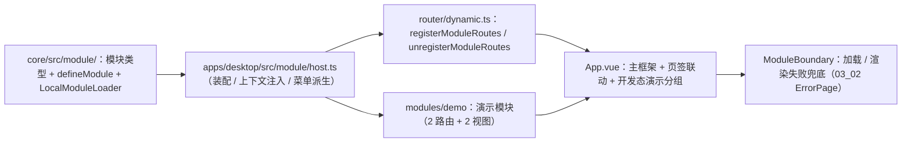

# 01 实施 · 宿主外壳与模块加载器

> 前端组件库 · 10 微前端骨架 · 子任务 01（需求 10-1）· 实施记录

[文档首页](../../../../../../文档首页.md) › [10 微前端骨架](../../10_微前端骨架.md) › [01 宿主外壳与模块加载器](../10_微前端骨架_01_宿主外壳与模块加载器.md) › 实施记录　|　[← 任务](../10_微前端骨架_01_宿主外壳与模块加载器.md)

## 1. 实施信息 

| 项 | 值 |
| --- | --- |
| 任务 | [01 宿主外壳与模块加载器](../10_微前端骨架_01_宿主外壳与模块加载器.md) |
| 对应需求 | [10-1](../../../../需求/10_需求_微前端骨架.md#r10-1) |
| 详细设计 | [01 详细设计](../设计/01_详细设计_01_宿主外壳与模块加载器.md) |
| 实施日期 | 2026-09-18 |
| 实施人 | minjian |
| 实施环境 | 本地开发机（Node v24.20.0 / npm 11.19.0，npmmirror） |
| 提交 | 设计 `0d8292f6`；实施 `f18620e3` |
| 结论 | 完成 |

## 2. 实施概览 

## 3. 实施过程 

1. **模块类型与定义（核心）**：`core/src/module/{types,define,loader}.ts` 落 `ModuleManifest` / `ModuleRouteDeclaration` / `ModuleRegistration` / `ModuleHostContext` / `ModuleDefinition` / `LoadedModule` / `ModuleLoader` 与 `defineModule`（名 / 版本校验并冻结，非法抛 `BaseError`）；`LocalModuleLoader` 实现加载 / 挂载 / 卸载（未登记报 `10002`、重复挂载拒重、卸载幂等）。
2. **宿主装配**：`apps/desktop/src/module/host.ts` 构造本地加载器（含演示模块），`mountModule(name, context)` 注入宿主上下文（`router` / Pinia / 用户 / 租户，**不含 `token`**）→ 注册模块路由；`unmountModule` 逆序卸载；`moduleMenuNodes` 由注册声明 `meta.title` 派生菜单节点。
3. **路由衔接**：`router/dynamic.ts` 扩展 `registerModuleRoutes`（跳过 `/` 与已存在路由名，返回**路由名**清单）/ `unregisterModuleRoutes`（按名卸载）；与 `BaseDynamicRoutes` 的路径构建口径一致。
4. **演示模块**：`apps/desktop/src/modules/demo/` 声明 `defineModule({ name: 'demo', version: '0.1.0', setup })`，提供 `/demo`（复用页面容器 / 分区容器 / 四态容器）与 `/demo/toolbox`（复用虚拟列表 / 滚动容器 / 可视区纯函数）两条路由；**不进生产菜单**。
5. **模块边界**：`components/ModuleBoundary.vue` 以 `onErrorCaptured` 写入模块错误态，渲染 `ErrorPage(500)`（带模块名与版本）+ 重试；包裹 `router-view`。
6. **入口装配**：`main.ts` 在 `app.mount` 前 `mountModule('demo', …)`（失败写模块错误态并仍然挂载应用）；`App.vue` 于开发态把演示分组追加到侧边菜单，走既有菜单 → 路由 → 页签链路。

## 4. 问题与处置 

| # | 问题 / 现象 | 原因 | 处置 |
| --- | --- | --- | --- |
| 1 | 卸载后模块路由仍存在 | `router.removeRoute` 需按**路由名**卸载，原按路径卸载无效 | `registerModuleRoutes` 返回路由名清单、`unregisterModuleRoutes` 按名卸载 |
| 2 | 核心注释护栏拦截 | `LocalModuleLoader` 私有字段缺 JSDoc | 补私有字段注释（守卫要求类成员含私有均需注释） |
| 3 | 模块视图不纳入覆盖率 | 路由组件为动态 `import`，测试不执行 | 记录为覆盖口径说明（宿主编译与体积预算均通过） |

## 5. 验证结果 

| 验证点 | 方法 | 结果 |
| --- | --- | --- |
| 类型检查 / Lint | 根 `npm run check`（core / vue / ui-ep） | 通过 |
| 单测（核心） | `core` `npm test` | 27 文件 / 148 用例全通过（新增 5：模块契约与加载器） |
| 单测（宿主） | `apps/desktop` `test:cov` | 7 文件 / 22 用例通过（新增 3：模块宿主）；覆盖率 83.44%（阈值 70%） |
| 宿主构建 / 体积 | `apps/desktop` `build` / `budget` | 通过；合计 108.2 KB（预算 260 KB），最大单文件 89.7 KB（预算 150 KB） |

## 6. 偏差与遗留 

- **偏差**：无（按详细设计实施）。
- **遗留**：① 远端加载（Module Federation）、模块清单 / 版本校验 / 超时 / `shared` singleton 随阶段五（本期接口已预留 `entry` / `version`）；② 模块契约（注入清单 / 注册声明 / 5 注册表）随 `10_02`；③ 模块视图覆盖率随契约测试补齐（`10_02`）。

> 本文档依《[文档生成规范](../../../../../../规范/文档生成规范.md)》编写
