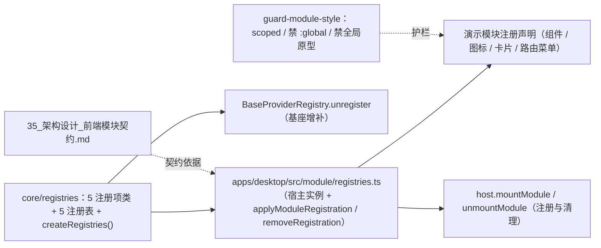

# 02 实施 · 模块契约与注册表基座

> 前端组件库 · 10 微前端骨架 · 子任务 02（需求 10-2）· 实施记录

[文档首页](../../../../../../文档首页.md) › [10 微前端骨架](../../10_微前端骨架.md) › [02 模块契约与注册表基座](../10_微前端骨架_02_模块契约与注册表基座.md) › 实施记录　|　[← 任务](../10_微前端骨架_02_模块契约与注册表基座.md)

## 1. 实施信息 

| 项 | 值 |
| --- | --- |
| 任务 | [02 模块契约与注册表基座](../10_微前端骨架_02_模块契约与注册表基座.md) |
| 对应需求 | [10-2](../../../../需求/10_需求_微前端骨架.md#r10-2) |
| 详细设计 | [02 详细设计](../设计/02_详细设计_01_模块契约与注册表基座.md) |
| 实施日期 | 2026-09-18 |
| 实施人 | minjian |
| 实施环境 | 本地开发机（Node v24.20.0 / npm 11.19.0，npmmirror） |
| 提交 | 设计 `c6619dd4`；实施 `7a902e11`；契约文档与登记 `ea080700` |
| 结论 | 完成 |

## 2. 实施概览 

## 3. 实施过程 

1. **注册项与注册表（核心）**：`core/src/registries/` 落 5 类注册项（`RouteMenuProvider` / `ComponentProvider` / `FieldRendererProvider` / `IconProvider` / `WorkbenchCardProvider`，均继承 `BaseProvider`）与 5 个注册表（均继承 `BaseProviderRegistry`），并提供 `createRegistries()` 工厂；校验：路由路径须以 `/` 开头、其余键须为命名空间键（`REGISTRY_KEY_PATTERN`）、同键唯一性拒重。
2. **注册表基座增补**：`BaseProviderRegistry` 增补 `unregister(key)`（幂等，返回是否命中），供模块卸载清理（兼容增强，基座语义不变）。
3. **宿主装配**：`apps/desktop/src/module/registries.ts` 导出共享注册表实例，`applyModuleRegistration(moduleName, registration)` 逐项倒入（键须以 `<模块名>:` 前缀，否则 `CAPABILITY_VIOLATION`）并返回登记键清单；`removeRegistration` 逆序清理；`host.mountModule / unmountModule` 接入（路由按名注册 / 卸载，注册项按组注销）。
4. **演示模块使用契约**：`demo` 模块注册声明新增 `components`（`demo:toolbox`）/ `icons`（`demo:sparkles`）/ `cards`（`demo:summary`），路由经 `RouteMenuRegistry` 登记；均在开发态菜单与宿主装配中生效。
5. **一致性基础**：演示模块直接复用 `@bms/ui-ep` 组件与 `--bms-*` 令牌变量；新增护栏 `apps/desktop/tests/guard-module-style.spec.ts`（模块与 `ui-ep` 组件 `<style>` 须 `scoped`、禁 `:global`、禁改全局原型）。
6. **契约文档化**：新增架构节点《[前端模块契约](../../../../../../设计/架构设计/35_架构设计_前端模块契约.md)》（`35_架构设计_前端模块契约.md`：注入清单 / 注册声明与校验 / 一致性基础 / 阶段五衔接），登记进[文档首页](../../../../../../文档首页.md) §7.1，并在《[前端架构](../../../../../../设计/架构设计/08_架构设计_前端架构.md)》§9 与《[前端基类清单](../../../../../../前端基类清单.md)》§9 回写。

## 4. 问题与处置 

| # | 问题 / 现象 | 原因 | 处置 |
| --- | --- | --- | --- |
| 1 | 具体注册表类型报缺 `pluginKey` / `pluginName` | `BasePluggable` 抽象成员 | 各注册表补 `pluginKey` / `pluginName`（与 `CapabilityRegistry` 同口径） |
| 2 | 注释护栏拦截（19 项） | 注册项构造参数属性与 `providerKey` 缺 JSDoc | 参数属性改为显式字段并逐项注释；`providerKey` 补方法注释 |
| 3 | 卸载后注册项仍在 | `'component:demo:greeting'.split(':', 2)` 只返回两段（`demo`），键被截断 | 改用 `indexOf` 切分，保留命名空间键完整 |
| 4 | 契约文档落地编号冲突 | 架构节点 11 已被子系统占用 | 顺延为 `35_架构设计_前端模块契约.md`，文档首页登记 |

## 5. 验证结果 

| 验证点 | 方法 | 结果 |
| --- | --- | --- |
| 类型检查 / Lint | 根 `npm run check`（core / vue / ui-ep） | 通过 |
| 单测（核心） | `core` `npm test` | 28 文件 / 153 用例全通过（新增 5：注册表） |
| 单测（宿主） | `apps/desktop` `test:cov` | 9 文件 / 30 用例通过（新增 8：注册装配 + 样式护栏） |
| 文档校验 | `check-base.py` / `check-links.py` | 通过 / 0 断链 |
| 宿主构建 / 体积 | `apps/desktop` `build` / `budget` | 通过（预算内） |

## 6. 偏差与遗留 

- **偏差**：架构节点编号由设计写的 11 顺延为 35（避免与既有子系统编号冲突）；已同步设计 §3.5。
- **遗留**：① 隔离增强 / 版本协商 / 模块清单治理随阶段五；② 字段渲染器 / 工作台卡片的实际消费方（展示域 / 首页工作台）随后续域；③ 注册表按模块归因观测随治理后补项。

> 本文档依《[文档生成规范](../../../../../../规范/文档生成规范.md)》编写
