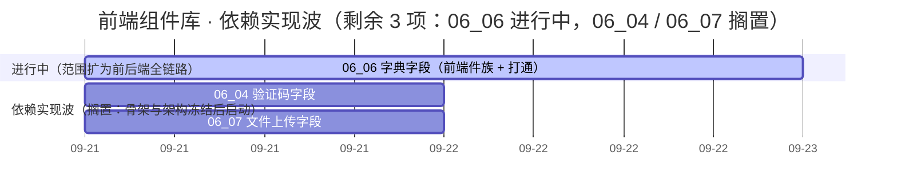

# 前端组件库计划

> BMS 基础管理系统 · 阶段四（前端组件库 / M4 组件库可用）排期计划：域 02 基础组件类 7 项 / 146h（已完成 7 项 / 全部完成）、域 03 布局组件类 5 项 / 58h（已完成 5 项 / 全部完成）、域 04 容器组件类 1 项 / 24h（已完成 1 项 / 全部完成）、域 10 微前端骨架 2 项 / 24h（已完成 2 项 / 全部完成）、域 05 基础控件类 1 项 / 24h（已完成 1 项 / 全部完成）、域 06 字段类 7 项 / 166h（已完成 4 项 / 剩余 3 项，其中 `06_06` 进行中；含依赖窗口；`06_06` 因范围扩为前后端全链路重估 10h → 64h —— 后端部分挂后端基座 `02-4-27` 不计入本域）、域 07 展示类 7 项 / 112h（已完成 7 项 / 全部完成）、域 08 交互类 10 项 / 252h（已完成 10 项 / 全部完成），其余需求域随任务基线补排

[文档首页](../../../文档首页.md) › 前端组件库计划　|　[任务基线 →](../任务/02_基础组件类/02_基础组件类.md)　[需求基线 →](../需求/00_需求_前端组件库.md)

## 1. 计划说明 

- **排期对象**：阶段四 40 条需求；**已建任务基线者**：需求域 02 基础组件类（[02 基础组件类](../任务/02_基础组件类/02_基础组件类.md)，7 个子任务 · 含 4 个嵌套子任务 · 146h）与需求域 03 布局组件类（[03 布局组件类](../任务/03_布局组件类/03_布局组件类.md)，5 个子任务 · 含 3 个嵌套子任务 · 58h，已完成 5 项（全部完成））与需求域 04 容器组件类（[04 容器组件类](../任务/04_容器组件类/04_容器组件类.md)，1 个子任务 · 含 3 个嵌套子任务 · 24h，已完成 1 项（全部完成））与需求域 10 微前端骨架（[10 微前端骨架](../任务/10_微前端骨架/10_微前端骨架.md)，2 个子任务 · 24h，已完成 2 项（全部完成））与需求域 05 基础控件类（[05 基础控件类](../任务/05_基础控件类/05_基础控件类.md)，1 个子任务 · 含 2 个嵌套子任务 · 24h，已完成 1 项（全部完成））与需求域 06 字段类（[06 字段类](../任务/06_字段类/06_字段类.md)，7 个子任务 · 含 8 个嵌套子任务 · 166h，已完成 4 项 / 剩余 3 项；`06_02` / `06_03` / `06_05` 阶段四窗口内已完成，`06_06` 进行中（范围扩为前后端全链路，后端挂 `02-4-27`），`06_04` / `06_07` 随阶段六 / 八；**仅 PC**）与需求域 07 展示类（[07 展示类](../任务/07_展示类/07_展示类.md)，7 个子任务 · 112h，已完成 7 项 / 全部完成；`07_01` ~ `07_03` 阶段四窗口内已完成（`07_03` 前端 + mock，真实接口联调随阶段八），`07_06` 图表卡已完成（2026-09-19，含组件基类 `BaseChart` 新增；ECharts 独立分包、真实取数经注入占位），`07_05` 数据呈现已完成（2026-09-20，前端先行 + 通路注入式：通用表格 / 查询筛选区 / 状态标签与描述列表 / 指标卡 + 列配置与查询方案持久化），`07_04` 通知与消息已完成（2026-09-20，前端先行 + 通路注入式：新增通知中心编排能力基类 `BaseNotificationCenter` + 四件 + 注入式实时适配器与轮询占位），`07_07` 全局搜索已完成（2026-09-21，前端先行 + 通路注入式：搜索族能力基类 `BaseGlobalSearch` + 组件基类 `BaseSearch` + 检索引擎插件基类与注册表 + 领域纯函数 + 契约套件 + 投影 + `components/search/` 六件与 13 项自检核对页；真实 ES 检索联调归口阶段十八）；**仅 PC**）与需求域 08 交互类（[08 交互类](../任务/08_交互类/08_交互类.md)，10 个子任务 · 含 14 个嵌套子任务 · 252h，已完成 10 项（全部完成）；`08_01`、`08_02` 已完成（2026-09-18），`08_03` 全部完成（`08_03_01` 向导与偏好设置、`08_03_02` 批量操作与主题租户、`08_03_03` 打印与导出 PDF 于 2026-09-19 完成），`08_04` 权限配置全部完成（2026-09-19，授权编排基类与领域 / 授权组件与宿主核对页两嵌套子任务；RBAC 真实联调随阶段七），`08_05` 导入导出全部完成（2026-09-19，导入导出编排基类与领域 / 组件与宿主核对页两嵌套子任务；真实接口联调随阶段八），`08_07` 国际化文案编辑器全部完成（2026-09-19，文案目录编排基类与领域 / 组件与宿主核对页两嵌套子任务；真实接口联调随阶段八），`08_08` 审批流展示与流程建模器全部完成（2026-09-19，两嵌套子任务；`bpmn-js` Viewer 只读图与 Modeler 画布、专题族九件、两个宿主核对页 12/12；真实接口联调归口阶段九），`08_09` 报表设计器与大屏设计器与播放全部完成（2026-09-20，嵌套 01 / 02；`BaseReportDesigner` / `BaseScreenDesigner` / `BaseScreenPlayer` 编排基类与领域 / 专题族十二件 / gridstack 与 vue-flow 独立分包 / 两个宿主核对页 12/12；真实接口联调归口阶段十六），`08_10` AI 助手已完成（2026-09-20，前端先行 + 通路注入式；新增 `BaseAiAssistant` 编排能力基类 + 领域纯函数 + 契约套件 + 投影 + 注入式 SSE 适配器 + `components/ai/` 六件与 12 项自检核对页；真实 AI 服务联调归口阶段十九），域 08 阶段四窗口内全部子任务收口；**仅 PC**）。域 09 随各自任务基线建立后补排（需求见[前端组件库需求总览](../需求/00_需求_前端组件库.md)）。
- **执行序（基座先行 + 链上逐级）**：`02_07 框架无关核心工程与契约保障`（工程脚手架与核心护栏先行）→ `02_01 总基类与固定三段` → `02_05 体系机制` → `02_02 组件根` → `02_03 能力基类族` → `02_04 组件基类族` → `02_06 基础类横切底座`；`02_07` 的契约用例工厂与清单对账护栏随 `02_03` / `02_04` 就位收口。
- **波次与依赖实现窗口**（自需求迁入）：**地基波 19 条**在阶段四窗口内闭环——`02_*`（7）、`03_*`（5）、`04-1`、`05-1`、`06-1` / `07-1` / `08-1`（占位版）、`10-1` / `10-2`；**依赖实现波 21 条**先交付占位版、真实实现随对应阶段——`06-2` / `06-3`、`07-2`、`08-2` / `08-3` 无后端强依赖（阶段四内推进）；`06-4` 验证码 ← 阶段六（认证与安全）；`08-4` 权限配置 ← 阶段七（RBAC）；**`06-5` 组织选择已完成（2026-09-21，前端先行 + 通路注入式：组件基类 `BaseOrgSelect` + 注入式组织数据源插件轨 + 契约套件 + 五件与表单渲染协同）**；`06-6` 字典 / `06-7` 文件上传 / `07-3` 文件预览与审计差异 / `08-5` 导入导出 / `08-6` 表单设计器与渲染器 / `08-7` 国际化文案编辑器 ← 阶段八（通用能力）；`07-4` 通知与消息 ← 阶段八 + 十（实时推送），**已完成（2026-09-20）**；`07-5` 数据呈现 ← 阶段八后 ~ 十五；`07-6` 图表卡 / `08-9` 报表与大屏设计器 ← 阶段十六（报表 BI）；**`07-6` 已完成（2026-09-19）**；`07-7` 全局搜索 ← 阶段十八（全文检索），**已完成（2026-09-21）**；`08-8` 审批流与流程建模 ← 阶段九（工作流引擎）；`08-10` AI 助手 ← 阶段十九（AI 能力）。
- **对齐口径**：域 02 按后端已跑通的基类体系做法落地（极简根系 / 能力域基类只做声明 / 占位三件 / 异步资源统一登记与逆序释放 / 插件中间层双轨登记 + 实例缓存 + 契约版本 / 提供者组合轨 / 错误码段位 / 逐基类 + contracts + crosscut 测试分层），任务参考只引文档（《[后端基类清单](../../../后端基类清单.md)》《[架构设计 · 后端基础类体系](../../../设计/架构设计/04_架构设计_后端基础类体系.md)》《[后端开发规范](../../../规范/后端开发规范.md)》）。
- **排期口径**：自 2026-09-18 起串行排期（单人兼职）；按 8h/日折算，2026-10-01 ~ 2026-10-07（国庆）不计入。
- **工时**：域 02 合计 146h（已全部完成）；**域 03 合计 58h（已全部完成）**；**域 04 合计 24h（已全部完成）**；**域 10 合计 24h（已全部完成）**；**域 05 合计 24h（已全部完成）**；**域 06 合计 166h（已完成 78h / 剩余 88h——`06_06` 重估 64h 进行中、`06_04` 8h、`06_07` 16h；含依赖窗口）**；**域 07 合计 112h（已全部完成）**；**域 08 合计 252h（已全部完成）**；阶段四合计随其余域任务基线补建后累计。
- **里程碑锚点**：M4 = **组件库可用**（《总体项目规划》「里程碑」节），门禁定义与逐项核对见[本计划 §5 M4 验收门禁](#accept)。
- **负责人**：minjian（兼职，单人）。

## 2. 已完成任务（2026-09-18 ~ 2026-09-20） 

| 编号 | 任务 | 工时（重估） | 完成日期 | 任务文件 | 偏差与遗留 |
| --- | --- | --- | --- | --- | --- |
| 02_01 | 总基类与固定三段 | 8h | 2026-09-18 | [02_01](../任务/02_基础组件类/02_基础组件类_01_总基类与固定三段/02_基础组件类_01_总基类与固定三段.md) | 无（三段就位：`BaseObject` / `BaseCapability` / `BasePluggable`；遗留见实施记录 §6） |
| 02_02 | 组件根 | 8h | 2026-09-18 | [02_02](../任务/02_基础组件类/02_基础组件类_02_组件根/02_基础组件类_02_组件根.md) | 无（令牌属性协议 / attrs 透传 / 生命周期多监听 / 机制装配点） |
| 02_03 | 能力基类族 | 40h | 2026-09-18 | [02_03](../任务/02_基础组件类/02_基础组件类_03_能力基类族/02_基础组件类_03_能力基类族.md) | 无（27 个能力基类分三批 + manifest 依赖登记与校验；`BaseOptionSource` / `BaseFormMeta` 数据版本字段改名 `dataVersion` 见实施记录 §4） |
| 02_04 | 组件基类族 | 22h | 2026-09-18 | [02_04](../任务/02_基础组件类/02_基础组件类_04_组件基类族/02_基础组件类_04_组件基类族.md) | 无（16 个组件基类；`BaseTable` 页长字段改名 `pageSize` 避根字段 `size`；`BaseChart` 本期不建类） |
| 02_05 | 体系机制 | 20h | 2026-09-18 | [02_05](../任务/02_基础组件类/02_基础组件类_05_体系机制/02_基础组件类_05_体系机制.md) | 无（注册表 / 工厂 / 资源 / 占位 / 错误 / 契约基类；`BaseEntity` 乐观锁字段改名 `recordVersion` 见实施记录 §4） |
| 02_06 | 基础类横切底座 | 24h | 2026-09-18 | [02_06](../任务/02_基础组件类/02_基础组件类_06_基础类横切底座/02_基础组件类_06_基础类横切底座.md) | 无（核心：格式化 / 校验 / 权限判定 / 令牌解析 / 请求契约；PC 宿主：`@bms/vue` 绑定 + `apps/desktop` Axios 请求层 / `v-perm` / `tokens.scss` / 格式化基准；移动端本阶段范围外） |
| 02_07 | 框架无关核心工程与契约保障 | 24h | 2026-09-18 | [02_07](../任务/02_基础组件类/02_基础组件类_07_框架无关核心工程与契约保障/02_基础组件类_07_框架无关核心工程与契约保障.md) | 无（工程骨架 + 护栏 + 错误码段位 + 契约 5 套件 + 清单对账护栏；收口见实施记录 §7） |
| 03_01 | 弹窗抽屉表单 | 12h | 2026-09-18 | [03_01](../任务/03_布局组件类/03_布局组件类_01_弹窗抽屉表单/03_布局组件类_01_弹窗抽屉表单.md) | 无（`ui-ep` 骨架 + 二次确认 + `FormDialog` / `FormDrawer` / `useFormModal` / `useModalShell`；仅 PC） |
| 03_02 | 异常与空状态 | 8h | 2026-09-18 | [03_02](../任务/03_布局组件类/03_布局组件类_02_异常与空状态/03_布局组件类_02_异常与空状态.md) | 无（错误页 / 空状态矩阵 / 骨架屏 / 遮罩 / `useFeedback` + 宿主 `/403` `/404` `/500` 接线；5 个 SVG 插画） |
| 03_03 | 结构布局 | 22h | 2026-09-18 | [03_03](../任务/03_布局组件类/03_布局组件类_03_结构布局/03_布局组件类_03_结构布局.md) | 无（多标签导航 + 双层页签 / `useTabNav` 会话持久化；树形主从 + 自研 `SplitPane`；基础布局件六件；ui-ep 49 用例） |
| 03_04 | 侧边菜单 | 6h | 2026-09-18 | [03_04](../任务/03_布局组件类/03_布局组件类_04_侧边菜单/03_布局组件类_04_侧边菜单.md) | 无（核心 `domain/menu.ts` 纯函数 + 占位菜单树；`useSideMenu` 经 `BaseDynamicRoutes`；`SideMenu` 递归渲染 / 搜索 / 徽标；宿主占位路由闭环） |
| 03_05 | 框架与容器 | 10h | 2026-09-18 | [03_05](../任务/03_布局组件类/03_布局组件类_05_框架与容器/03_布局组件类_05_框架与容器.md) | 无（主框架壳 / 表单框架壳 / 页面容器 + 能力投影 `useBaseContainer` / `useBaseDesignToken` / `useResponsive`；宿主装配主框架 + keep-alive） |
| 04_01 | 通用容器 | 24h | 2026-09-18 | [04_01](../任务/04_容器组件类/04_容器组件类_01_通用容器/04_容器组件类_01_通用容器.md) | 无（八件容器：滚动 / 自适应高度 / 分区 / 宽高比 / 全屏 / 懒加载 / 虚拟列表 / 四态；可视区纯函数下沉核心领域层） |
| 06_03 | 富文本与高级交互字段 | 24h | 2026-09-18 | [06_03](../任务/06_字段类/06_字段类_03_富文本与高级交互字段/06_字段类_03_富文本与高级交互字段.md) | 无（3 嵌套：富文本 TipTap+DOMPurify（内核独立分包）/ 穿梭框（异步+上限）/ 标签输入（建议+粘贴批量）） |
| 06_02 | 基础与数据源字段 | 30h | 2026-09-18 | [06_02](../任务/06_字段类/06_字段类_02_基础与数据源字段/06_字段类_02_基础与数据源字段.md) | 无（5 嵌套：日期时间 `Date` 值 / 数值与金额（定点纯函数 + 十进制字符串）/ 开关与枚举（内联回滚）/ 树选择（懒加载 + 路径回显）/ 级联（路径值 + 回显）） |
| 06_01 | 占位版交付 | 12h | 2026-09-18 | [06_01](../任务/06_字段类/06_字段类_01_占位版交付/06_字段类_01_占位版交付.md) | 无（占位契约套件 `describePlaceholderFieldContract` + 四件占位：字典 / 组织 / 文件 / 验证码；`ready` 驱动、占位零请求） |
| 05_01 | 基础控件 | 24h | 2026-09-18 | [05_01](../任务/05_基础控件类/05_基础控件类_01_基础控件/05_基础控件类_01_基础控件.md) | 无（八件控件：文本框 / 文本域 / 密码框 / 数字框 / 下拉框 / 单选 / 复选 / 开关；新增投影 `useBaseInput` / `useBaseField`） |
| 10_01 | 宿主外壳与模块加载器 | 8h | 2026-09-18 | [10_01](../任务/10_微前端骨架/10_微前端骨架_01_宿主外壳与模块加载器/10_微前端骨架_01_宿主外壳与模块加载器.md) | 无（核心模块契约类型 + `defineModule` + `LocalModuleLoader`；宿主装配 / 模块路由注册（按名卸载）/ `ModuleBoundary` 兜底；演示模块开发态可见） |
| 10_02 | 模块契约与注册表基座 | 16h | 2026-09-18 | [10_02](../任务/10_微前端骨架/10_微前端骨架_02_模块契约与注册表基座/10_微前端骨架_02_模块契约与注册表基座.md) | 无（5 注册表 + `createRegistries`；宿主注册装配（命名空间前缀校验 / 逆序清理）；模块契约架构节点 35；样式护栏） |
| 07_01 | 占位版交付（依赖后端展示件） | 12h | 2026-09-18 | [07_01](../任务/07_展示类/07_展示类_01_占位版交付/07_展示类_01_占位版交付.md) | 无（占位契约套件 `describePlaceholderDisplayContract` + 六件占位：通用表格 / 通知列表 / 文件预览 / 审计差异 / 图表卡 / 全局搜索；`ready` 驱动、占位零请求） |
| 07_02 | 轻量展示件 | 16h | 2026-09-18 | [07_02](../任务/07_展示类/07_展示类_02_轻量展示件/07_展示类_02_轻量展示件.md) | 无（四件：快捷入口 / 头像与用户信息 / 二维码 / 水印；投影 `useBaseUserDisplay` / `useBaseWatermark`；引入 `qrcode`（独立分包懒加载）、水印防篡改自动恢复；件名 `WatermarkOverlay`） |
| 07_03 | 文件预览与审计差异查看 | 14h | 2026-09-18 | [07_03](../任务/07_展示类/07_展示类_03_文件预览与审计差异查看/07_展示类_03_文件预览与审计差异查看.md) | 无（前端 + mock：文件类型分发 / 预签名失效重取 / 降级下载；审计字段级差异类型感知 + 脱敏 + 链字段校验；投影 `useBasePresignedUrl`；真实接口联调遗留阶段八） |
| 07_06 | 图表卡（含组件基类 `BaseChart` 新增） | 14h | 2026-09-19 | [07_06](../任务/07_展示类/07_展示类_06_图表卡/07_展示类_06_图表卡.md) | 偏差：名义 14h 因新增 1 个组件基类 `BaseChart`、1 份领域纯函数（37 导出）、1 套契约套件、1 套投影、1 个 ECharts 内核适配（独立分包）、2 件组件（`ChartRenderer` 新增 / `ChartCard` 迁入 `components/chart/` 真实实现）与 12 项自检核对页、体积预算脚本改造而上浮，明细见实施记录 §4；遗留：真实数据集取数接口联调（`POST /rpt/datasets/{id}/query`，归口报表 BI 窗口）、数据表视图升级为 `07_05` 真实通用表格、地图地理数据扩充、工作台页面集成、移动端实现 |
| 08_01 | 占位版交付（12 件后端依赖交互件，3 嵌套） | 20h | 2026-09-18 | [08_01](../任务/08_交互类/08_交互类_01_占位版交付/08_交互类_01_占位版交付.md) | 无（三嵌套完成：`08_01_01` 三件 + 共享占位套件；`08_01_02` 五件 + 五投影；`08_01_03` 四件 + 两投影；件数 10 → 12 见设计；真实数据通路随 `08_04` ~ `08_10`） |
| 08_02 | 图标选择器与代码表达式编辑器 | 20h | 2026-09-18 | [08_02](../任务/08_交互类/08_交互类_02_图标选择器与代码表达式编辑器/08_交互类_02_图标选择器与代码表达式编辑器.md) | 无（核心图标注册表扩展 + `IconRenderer`/`IconPicker`/`IconLibrary` + CodeMirror 6 / highlight.js 内核复用 + `SqlEditor`/`ExpressionEditor`/`CronEditor`/`CodeViewer`；自定义图标 CRUD 与 SQL 测试执行随后端） |
| 08_03 | 面板与工具（6 件，3 嵌套） | 36h | 2026-09-19 | [08_03](../任务/08_交互类/08_交互类_03_面板与工具/08_交互类_03_面板与工具.md) | 偏差：三个嵌套子任务（12h + 14h + 10h）因能力基类与契约套件扩张实际上浮，明细见各实施记录 §偏差与遗留；遗留：宿主顶栏与打印入口接入、租户 / 品牌 / 导出接口联调、完整深色适配与跨浏览器打印样式核验（归口阶段八与宿主布局任务） |
| 08_04 | 权限配置（2 嵌套） | 20h | 2026-09-19 | [08_04](../任务/08_交互类/08_交互类_04_权限配置/08_交互类_04_权限配置.md) | 偏差：两嵌套子任务（12h + 8h）因新增 1 个能力基类、1 份领域纯函数、1 套契约套件与五件组件实际上浮，明细见各实施记录 §偏差与遗留；遗留：RBAC 取数 / 全量覆盖提交 / 权限码取数真实联调（归口阶段七）、字段权限与布局叠加的运行时渲染（归口 `08_06`）、宿主「角色管理 → 授权页签」真实页面与远程主体搜索（归口宿主布局任务）、移动端实现 |
| 08_05 | 导入导出（2 嵌套） | 20h | 2026-09-19 | [08_05](../任务/08_交互类/08_交互类_05_导入导出/08_交互类_05_导入导出.md) | 偏差：两嵌套子任务（12h + 8h）因新增 3 个能力基类、2 份领域纯函数、2 套契约套件、3 套投影、四件迁移与真实实现、错误报告件与宿主核对页实际上浮，明细见各实施记录 §偏差与遗留；遗留：真实接口联调（模板下载 / 执行导入 / 错误明细 / 列表导出 / 后台任务轮询，归口阶段八）、事件与注入双轨的「二选一」使用约束、移动端实现 |
| 08_06 | 表单设计器与表单渲染器（2 嵌套） | 36h | 2026-09-19 | [08_06](../任务/08_交互类/08_交互类_06_表单设计器与表单渲染器/08_交互类_06_表单设计器与表单渲染器.md) | 偏差：两嵌套子任务（20h + 16h）因新增 2 个能力基类、2 份领域纯函数、3 套契约套件、2 套投影、1 个拖拽适配工具、1 个分发映射工具、六件组件（含三件新增）与两个宿主核对页实际上浮，明细见各实施记录 §偏差与遗留；遗留：真实接口联调（布局取数 / 保存 / 发布 / 恢复 / 自建字段 DDL 与重试 / 详情取数 / 提交，归口阶段八）、重控件真懒加载（需字段控件移出根出口，属对外契约变更）、异步唯一性校验防抖（归口阶段八）、明细区大数据分页与虚拟滚动（归口 `07_05` 或阶段八）、脱敏明文切换动作（归口字段权限能力）、设计器侧分组编辑交互、宿主「表单布局管理」真实页面、移动端实现；**已闭环**：`08_04` 字段权限运行时渲染、`08-6-1` 分组渲染侧口径 |
| 08_07 | 国际化文案编辑器（2 嵌套） | 16h | 2026-09-19 | [08_07](../任务/08_交互类/08_交互类_07_国际化文案编辑器/08_交互类_07_国际化文案编辑器.md) | 偏差：两嵌套子任务（8h + 8h）因新增 1 个能力基类、1 份领域纯函数、1 套契约套件、1 套投影、2 件新增（语言清单 / 筛选器）、2 件迁移与真实实现、宿主核对页实际上浮，明细见各实施记录 §偏差与遗留；遗留：真实接口联调（语言清单增改启停 / 文案维护取数 / 批量保存 / 缓存失效 / 语言包重载 / 语言包导入导出，归口阶段八通用能力 · 国际化）、引导式批量补齐缺失向导（后续基于缺失筛选扩展）、移动端不提供文案维护入口 |
| 08_08 | 审批流展示与流程建模器（2 嵌套） | 28h | 2026-09-19 | [08_08](../任务/08_交互类/08_交互类_08_审批流展示与流程建模器/08_交互类_08_审批流展示与流程建模器.md) | 偏差：两嵌套子任务（12h + 16h）因新增 2 个能力基类、2 份领域纯函数（含零依赖 BPMN 结构提取与往返等价）、2 套契约套件、2 套投影、**9 件组件**（4 件迁入专题族 + 5 件新增：进度 / 时间线 / 操作面板 / 只读图 / 元素调板 / 属性面板）、`bpmn-js@18.28.0` 依赖接入（Viewer + Modeler）、两个宿主核对页实际上浮；**契约口径经确认后调整**（五个动作事件合并为 `action`，已回写 `08_01_01` 设计与冻结用例）与 `08_07` 文案值长度口径统一为 4000 码点（连带改动 `08_07` 核心 + 用例 + 核对页 + 组件设计 11），明细见各实施记录 §偏差与遗留；遗留：真实接口联调（实例取数 / 审批记录 / 审批提交 / 转办 / 撤回 / 仅评论 / 取图址 / 定义取数 / 存草稿 / 发布 / 引擎预解析，归口阶段九）、待办角标与 `approval.todo` 实时订阅（归口阶段八 + 十）、宿主工作流路由页（流程实例详情 / 我的待办审批 / 流程建模页，归口宿主布局任务）、移动端审批详情与建模（设计节点明确不提供移动端建模） |
| 07_05 | 数据呈现（通用表格 / 查询筛选区 / 状态标签与描述列表 / 指标卡） | 30h | 2026-09-20 | [07_05](../任务/07_展示类/07_展示类_05_数据呈现/07_展示类_05_数据呈现.md) | 偏差：名义 30h 因新增 5 份领域纯函数、扩展 3 个既有组件基类（`BaseTable` 组合选中与列配置 / `BaseColumnConfig` / `BaseQueryScheme`）、4 套契约套件、2 套投影、4 件组件（`DataTable` 迁入 `components/data/` 真实实现 + 3 件新增）与 14 项自检核对页而上浮，明细见实施记录 §5；遗留：真实列表接口与查询方案远端读写联调（归口后续窗口，本期通路注入式）、列宽拖拽与固定列手势、移动端实现；**已闭环**：`08_06` 明细区大数据分页与虚拟滚动、`07_06` / `08_09` 数据表视图升级为真实通用表格 |
| 08_09 | 报表设计器与大屏设计器与播放（2 嵌套） | 32h | 2026-09-20 | [08_09](../任务/08_交互类/08_交互类_09_报表设计器与大屏设计器与播放/08_交互类_09_报表设计器与大屏设计器与播放.md) | 偏差：两嵌套子任务（16h + 16h）因新增 2 个组件基类（`BaseReportDesigner` / `BaseScreenDesigner` + `BaseScreenPlayer`）、2 份领域纯函数、2 套契约套件、2 套投影、12 件专题族组件与两个宿主核对页实际上浮，明细见各实施记录 §偏差与遗留；遗留：真实接口联调（数据集取数 / 报表与数据集保存发布 / 大屏定义保存与播放取数，归口阶段十六 报表 BI）、图表卡数据表视图升级为 `07_05` 真实通用表格、移动端实现 |
| 07_04 | 通知与消息（铃铛 / 列表 / 消息项 / 详情 + 通知中心编排基类） | 14h | 2026-09-20 | [07_04](../任务/07_展示类/07_展示类_04_通知与消息/07_展示类_04_通知与消息.md) | 偏差：名义 14h 因新增 1 个能力基类 `BaseNotificationCenter`（`BaseNotification` 父基类随之调整）、1 份领域纯函数 `domain/notification.ts`、1 套契约套件、1 套投影、2 个浏览器工具与四件组件（`NoticeList` 迁入 + 3 件新增）与 13 项自检核对页而上浮，明细见实施记录 §5；遗留：真实通知接口联调与 Socket.IO 客户端接入（归口阶段八 + 十窗口，本期注入式适配器 + 轮询占位）、消息内用户信息复用 `BaseUserDisplay`（本期按语义用 `07_05` 语义色）、工作台通知卡集成、移动端实现 |
| 08_10 | AI 助手（四模式 / 流式 / 结果渲染 + AI 助手编排基类） | 24h | 2026-09-20 | [08_10](../任务/08_交互类/08_交互类_10_AI助手/08_交互类_10_AI助手.md) | 偏差：名义 24h 因新增 1 个能力基类 `BaseAiAssistant`、1 份领域纯函数 `domain/ai-chat.ts`、1 套契约套件、1 套投影、2 个插件工具（SSE 适配器 / Markdown 工具）、六件组件（`AiAssistant` / `AiChatPanel` 迁入 + 4 件新增，含 `marked` 依赖与 AI 独立分包）与 12 项自检核对页而上浮，明细见实施记录 §5；遗留：真实 AI 服务联调（对话 / 流式 / 停止 / 重生成 / 确认 / 撤销 / 会话取数经注入式 `AiJobs` 与 `AiStreamAdapter`，归口阶段十九 AI 能力）、模型配置页与帮助草稿（归模型配置 / 帮助管理）、审批页「AI 辅助」入口（归宿主审批页）、移动端问答机器人 |
| 11 | 前端合规修复（继承链 / 单一落点 / 可替换实现 / 令牌消费 · 首审） | 40h | 2026-09-21 | [11](../任务/11_前端合规修复/11_前端合规修复.md) | 偏差：名义按合规修复评估；实际新增 1 个能力基类 `BasePlaceholderState`、3 域插件基类 + 注册表、6 个浏览器能力 utils、3 类机器护栏（含 fixture）与首审报告，并回写基类 / 资产清单 / 规范；遗留：实时通道 Socket.IO 与 AI 流式真实联调（归阶段十 / 十九，经注册表登记）、件内定时器与 `CodeEditor` DOM 查询（机会项）、平台 Kiwi 用例补登、清单对账护栏（候选） |
| 07_07 | 全局搜索（顶栏入口 / 命令面板 / 结果页 + 搜索族基类与检索引擎插件轨） | 12h | 2026-09-21 | [07_07](../任务/07_展示类/07_展示类_07_全局搜索/07_展示类_07_全局搜索.md) | 偏差：名义 12h 因新增 1 个能力基类 `BaseGlobalSearch`（父 `BasePlaceholderState`）、1 个组件基类 `BaseSearch`、1 个插件基类 / 注册项 / 注册表（`BaseSearchEngine` / `SearchEngineProvider` / `SearchEngineRegistry`）、1 份领域纯函数 `domain/search.ts`、1 套契约套件 `describeSearchContract`、1 套投影 `useBaseSearch`、2 个插件工具（高亮清洗 / HTTP 引擎）与六件组件（`GlobalSearch` 迁入 + 5 件新增）与 13 项自检核对页而上浮，明细见实施记录 §5；遗留：真实 ES 检索联调（`suggest` / `searchGlobal` / `searchLogs` / `searchFiles` 经注入式 `SearchEngineAdapter` 注入，归口阶段十八全文检索窗口）、移动端实现 |
| 06_05 | 组织选择字段（人员 / 岗位 / 组织复合 + 部门树 + 组件基类与组织数据源插件轨） | 12h | 2026-09-21 | [06_05](../任务/06_字段类/06_字段类_05_组织选择字段/06_字段类_05_组织选择字段.md) | 偏差：名义 12h 因选项源能力重挂值链（`BaseOptionSource` 父基类 `BaseComponent` → `BaseField`）、`BaseUserDisplay` 向后兼容扩展花名册、新增 1 个组件基类 `BaseOrgSelect`、1 套插件基类 / 注册项 / 注册表（`BaseOrgSource` / `OrgSourceProvider` / `OrgSourceRegistry`）、1 份领域纯函数 `domain/org.ts`、1 套契约套件 `describeOrgSelectContract`、1 套投影 `useBaseOrgSelect`、2 个插件工具（HTTP 数据源 / 防抖）与五件组件（`OrgSelectField` 真实实现 + 4 件新增）与表单渲染 `dept` → `org-select` 协同、12 项自检核对页而上浮，明细见实施记录 §5；遗留：真实 RBAC 取数 / 数据范围过滤 / 字段脱敏联调（归口阶段七窗口，本期注入式 `OrgSourceAdapter` + 组织主数据出口 `/api/v1/org/*`）、宿主「组织相关 store」版数据源（经注册表登记接入）、移动端实现 |

## 3. 剩余任务排期（自 2026-09-18） 

| 编号 | 任务 | 工时 | 依赖 | 排期窗口 | 备注 | 偏差与遗留 |
| --- | --- | --- | --- | --- | --- | --- |
| 06_04 | 验证码字段 | 8h | 阶段六（认证与安全） | 搁置（阶段六窗口） | 图形 / 滑块 / 短信；保持 `06_01` 冻结契约 | 未到窗口 |
| 06_06 | 字典字段（前端件族 + 前后端打通） | 64h | `02-4-27`（后端字典真实取数与缓存，已提前立项）、06_01、02_03 | 2026-09-21 ~ 2026-09-22 | 前端先行 + 后端真实取数（用户拍板扩范围）：领域纯函数 / `BaseDictStore` / `BaseDictSelect` / `BaseDictQuery` / 插件轨 / 契约套件 / 投影 / 四件 + 条件组构建件（含虚拟滚动与高级查询）/ 表单协同 / 令牌 / 核对页（含 `?source=http` 真实模式）；后端部分挂后端基座 `02-4-27`（需求 02-56），计后端计划 | 无 |
| 06_07 | 文件上传字段 | 16h | 阶段八（通用能力·文件存储） | 搁置（阶段八窗口） | 分片 / 秒传 / 断点续传 / 预签名回显 | 未到窗口 |

> 域 02 / 03 / 04 / 05 / 10 已全部完成；域 06 阶段四窗口部分已完成、其余随依赖窗口；域 07 已建基线并完成 `07_01` ~ `07_03`（2026-09-18）、`07_06` 图表卡（2026-09-19，含组件基类 `BaseChart` 新增）与 `07_05` 数据呈现（2026-09-20，前端先行 + 通路注入式；`BaseTable` 组合选中集合与列配置基类、`BaseColumnConfig` 与 `BaseQueryScheme` 扩展、5 份领域纯函数、4 套契约套件、`components/data/` 四件与 14 项自检核对页）与 `07_04` 通知与消息（2026-09-20，前端先行 + 通路注入式；新增通知中心编排能力基类 `BaseNotificationCenter`、1 份领域纯函数、1 套契约套件、1 套投影、2 个浏览器工具、`components/notice/` 四件与 13 项自检核对页；实时经注入式适配器 + 轮询占位）与 `07_07` 全局搜索（2026-09-21，前端先行 + 通路注入式：搜索族能力基类 `BaseGlobalSearch` + 组件基类 `BaseSearch` + 检索引擎插件基类与注册表 + 1 份领域纯函数 + 1 套契约套件 + 1 套投影 + 2 个插件工具 + `components/search/` 六件与 13 项自检核对页；真实 ES 检索联调归口阶段十八），域 07 全部子任务收口并移入 §2；域 08 已建基线并完成 `08_01` 占位版交付（2026-09-18，12 件后端依赖交互件占位契约冻结）、`08_02` 图标选择器与代码表达式编辑器（2026-09-18）、`08_03` 面板与工具（2026-09-19，三个嵌套子任务全部完成）、`08_04` 权限配置（2026-09-19，授权编排基类与领域 / 授权组件与宿主核对页两嵌套子任务；RBAC 真实联调归口阶段七）与 `08_05` 导入导出（2026-09-19，两嵌套子任务；真实接口联调归口阶段八）与 `08_06` 表单设计器与表单渲染器（2026-09-19，两嵌套子任务 `08-6-1` / `08-6-2` 均已完成；共享元数据契约按需向后兼容扩展，`08_04` 字段权限运行时渲染与分组渲染侧口径两项遗留闭环）与 `08_07` 国际化文案编辑器（2026-09-19，两嵌套子任务；文案目录编排基类与领域 / 组件与宿主核对页，真实接口联调归口阶段八）与 `08_08` 审批流展示与流程建模器（2026-09-19，两嵌套子任务 `08-8-1` / `08-8-2` 均已完成；`bpmn-js@18.28.0` Viewer 只读图与 Modeler 可编辑画布接入、专题族 `components/approval/` 九件、两个宿主核对页 12/12；动作事件口径经确认后由五个合并为 `action` 并回写 `08_01_01` 设计与冻结用例；文案值与审批意见长度口径统一为 4000 码点），阶段四窗口内域 08 主线（`08_01` ~ `08_08`）收口；`08_09` 报表设计器与大屏设计器与播放已完成（2026-09-20，两嵌套子任务；`08-9-1` 报表设计器、`08-9-2` 大屏设计器与播放，Kiwi 776 / 777）与 `08_10` AI 助手已完成（2026-09-20，前端先行 + 通路注入式；新增 `BaseAiAssistant` 编排能力基类 + 领域纯函数 + 契约套件 + 投影 + 注入式 SSE 适配器 + `components/ai/` 六件与 12 项自检核对页，Kiwi 960；真实 AI 服务联调归口阶段十九），域 08 阶段四窗口内全部子任务（`08_01` ~ `08_10`）收口并全部移入 §2；域 09 **无独立需求文档**（基础类三节点已并入 `02_06` 并完成，见[需求总览 §4](../需求/00_需求_前端组件库.md#map)），**无待排任务**。剩余 3 项全部为「依赖实现波」，见下表。域 06 已完成 `06_01` ~ `06_03` 与 `06_05`（组织选择字段 2026-09-21，Kiwi 962；前端先行 + 通路注入式：组件基类 `BaseOrgSelect` + 注入式组织数据源插件轨 + 契约套件 + 五件 + 表单渲染协同），`06_06` 字典字段进行中（2026-09-21，范围扩为前后端全链路：前端件族 + 与后端 `02-4-27` 真实接口打通；用户拍板把原归阶段八的后端字典真实取数与缓存提前落地并登记于后端基座），剩余 `06_04` / `06_07`。

> **落地顺序口径（2026-09-20 用户拍板）**：本阶段**依赖后端业务能力的件**（`06_04` ~ `06_07`、`07_04`、`07_07`、`08_10`）与已交付件的**真实接口联调**，其**后端真实落地**（业务 REST 端点、落库与真实取数）**待「骨架」完成后再启动**——「骨架」= 阶段一 ~ 三（含阶段二 后端基座真实实现）+ 本阶段**地基波**（域 02 / 03 / 04 / 05 / 10）+ 阶段五（前端插件化），且架构冻结。**在此之前前端先行**：按已交付的**占位契约做通路注入式开发**（未注入即占位、零请求）；**已冻结的对外契约不改**；若发现契约缺口，**前端可自行冻结新契约并同步登记后端需求**（只增不改，由后续阶段实现）。实施序沿用组件依赖序 `06_06 → 06_07 → 06_04`（`07_05` 数据呈现、`07_04` 通知与消息、`08_10` AI 助手、`07_07` 全局搜索、`06_05` 组织选择均已完成）。
>
> **口径修订（2026-09-21 用户拍板 · 仅 `06_06`）**：字典字段为重要组件、要求前后端必须打通、落地、可跑——其**后端真实取数与缓存**（需求 02-56）按补充六**提前落地**并登记于**后端基座**（任务 `02-4-27`，阶段一计划），不再等阶段八窗口；`06_06` 前端与 `02-4-27` 端到端联调。其余件（`06_04` / `06_07` 等）仍按上段口径。

## 4. 排期甘特图 

> 域 02 / 03 / 04 / 05 / 10 已全部完成（2026-09-18）；域 06 阶段四窗口部分见下（`06_05` 组织选择已完成 2026-09-21；`06_06` 字典字段进行中——范围扩为前后端全链路，后端 `02-4-27` 提前落地；`06_04` / `06_07` 随阶段六 / 八），域 07 已完成 `07_01` ~ `07_03`（2026-09-18）、`07_06`（2026-09-19）、`07_05` 数据呈现（2026-09-20）与 `07_07` 全局搜索（2026-09-21），域 08 已完成 `08_01`、`08_02`（2026-09-18）与 `08_03`、`08_04`、`08_05`、`08_06`、`08_07`、`08_08`（2026-09-19）与 `08_09` 报表设计器与大屏设计器与播放（2026-09-20，嵌套 01 / 02 全部完成）；域 09 无独立需求（三节点已并入 `02_06`，无待排任务）。**剩余 3 项已在下图列出（`06_06` 进行中；`06_04` / `06_07` 搁置：骨架与架构冻结后启动，实施序见 §3 备注）**。

> 甘特为串行保守基线；嵌套子任务并入其直属父任务行（见《[计划文档规范](../../../规范/计划文档规范.md)》「嵌套子任务」节）。

## 5. M4 验收门禁（域 02 ~ 08 贡献路径） 

M4 门禁定义与逐项核对见[本计划 §5 M4 验收门禁](#accept)；域 02（基础组件类）、域 03（布局组件类）、域 04（容器组件类）与域 05 / 06 / 07 / 08（基础控件类 / 字段类 / 展示类 / 交互类）的贡献路径：

| 验收点 | 对应任务 | 达成路径 |
| --- | --- | --- |
| 基类体系可用 | 02_01 ~ 02_07 | 固定前三段 / 组件根 / 能力基类族 / 组件基类族 / 体系机制就位，基础类横切底座可用，核心框架无关护栏与清单对账可查 |
| 组件单测通过（链上契约） | 02_01 ~ 02_07 | Vitest 覆盖三段 / 组件根 / 能力基类 / 组件基类 / 机制 / 请求 / 权限 / 格式化 / 令牌契约 |
| 地基波组件可用（布局） | 03_01 ~ 03_05 | 弹窗抽屉表单 / 异常与空状态 / 结构布局 / 侧边菜单 / 框架与容器就位；页面可由「布局壳 + 页面容器 + 通用组件」组装 |
| 地基波组件可用（容器） | 04_01 | **达标（2026-09-18）**：八件容器就位；虚拟列表定高 / 动态高度两路径与全屏 / 交叉观察器 / 宽高比能力缺失降级均生效 |
| 地基波组件可用（基础控件） | 05_01 | **达标（2026-09-18）**：八件基础控件就位；受控 / 三态 / 禁用合并 / 校验触发在 `useBaseInput` / `useBaseField` 统一定义；字段壳待字段壳族组装 |
| 地基波组件可用（字段类） | 06_01 ~ 06_03 | **达标（2026-09-18）**：占位契约冻结、基础与数据源字段、富文本与高级交互字段就位；`06_04` ~ `06_07` 随依赖窗口 |
| 字段类组织选择（含组件基类与数据源插件轨） | 06_05 | **达标（2026-09-21）**：选项源能力重挂值链（`BaseOptionSource` 父基类改 `BaseField`）、`BaseUserDisplay` 向后兼容扩展成员花名册；新增组件基类 `BaseOrgSelect`（父 `BaseOptionSource`）+ 插件基类 / 注册项 / 注册表（`BaseOrgSource` / `OrgSourceProvider` / `OrgSourceRegistry`，注入面 `OrgSourceAdapter`）+ 领域纯函数 `domain/org.ts` + 契约套件 `describeOrgSelectContract` + 投影 `useBaseOrgSelect` + 工具（`utils/orgSource.ts` HTTP 内建数据源默认键 `http` / `utils/debounce.ts`）；`components/field/` 五件（`OrgSelectField` 真实实现保持 `06_01` 冻结契约 + `UserSelectField` / `PostSelectField` / `DeptTreeSelectField` / `OrgCompositePicker` 新增）；统一走组织主数据出口 `/api/v1/org/*`（查询与批量回显分列，批量避免 N+1），前端不二次过滤（数据范围与脱敏出口实现侧强制）；表单渲染协同（`dept` → `org-select` + `kind` 透传 + 多选语义单一来源）；设计令牌 `--bms-org-*`；宿主核对页 12/12；真实 RBAC 联调归口阶段七 |
| 地基波组件可用（展示类占位版） | 07_01 ~ 07_02 | **达标（2026-09-18）**：`07_01` 依赖后端展示件占位契约冻结（通用表格 / 通知 / 文件预览 / 审计差异 / 图表卡 / 全局搜索，占位零请求）；`07_02` 轻量展示件就位（快捷入口 / 头像与用户信息 / 二维码 / 水印） |
| 展示类数据通路（前端 + mock） | 07_03 | **达标（2026-09-18）**：文件预览类型分发 / 预签名失效重取 / 降级下载，审计字段级差异类型感知 + 脱敏 + 链字段校验；真实接口联调登记遗留随阶段八 |
| 展示类图表卡（含组件基类） | 07_06 | **达标（2026-09-19）**：组件基类 `BaseChart`（父 `BaseDataState`，注入式引擎适配器）+ 领域纯函数 `domain/chart.ts`（13 类型 / 映射 / 令牌主题 / 选项生成 / 合并与节流）+ 契约套件 `describeChartContract` + 投影 `useBaseChart`；图表族 `components/chart/`（`ChartCard` 迁入真实实现 / `ChartRenderer` 新增纯渲染，保持 `07_01` 冻结对外契约）；ECharts 内核经 `utils/echartsKernel.ts` 动态装载（独立分包、按需注册、地图地理数据懒加载）；设计令牌图表色板落地；首屏体积预算改为入口块口径；宿主核对页 12/12 |
| 展示类通知与消息（含编排基类） | 07_04 | **达标（2026-09-20）**：新增通知中心编排能力基类 `BaseNotificationCenter`（父 `BaseNotice`，`BaseNotification` 父基类随之调整）+ 领域纯函数 `domain/notification.ts`（归一 / 角标 / 最近 N / 去重 / 乐观回滚 / 轮询判定）+ 契约套件 `describeNotificationContract` + 投影 `useBaseNotification` + 浏览器工具（轮询 / 可见性 / `BroadcastChannel` 多标签）；通知族 `components/notice/` 四件（`NoticeList` 迁入真实实现 / `NoticeBell` / `NoticeMessageItem` / `NoticeDetail`，保持 `07_01` 冻结对外契约）；实时经注入式适配器 + 轮询占位 + 断线补偿；角标「本地乐观 + 三处校准 + 失败回滚」；设计令牌 `--bms-notice-*`；宿主核对页 13/13 |
| 展示类全局搜索（含搜索族基类与插件轨） | 07_07 | **达标（2026-09-21）**：搜索族能力基类 `BaseGlobalSearch`（父 `BasePlaceholderState`，依赖 `placeholder-state` / `access` / `persisted-state`）+ 组件基类 `BaseSearch`（父 `BaseGlobalSearch`）+ 检索引擎插件基类 / 注册项 / 注册表（`BaseSearchEngine` / `SearchEngineProvider` / `SearchEngineRegistry`）+ 领域纯函数 `domain/search.ts`（域 / 命中归一、域权限过滤、查询参数、分组与 Top N、日志范围校验、最近搜索、降级与错误码 10101~10107）+ 契约套件 `describeSearchContract` + 投影 `useBaseSearch` + 高亮清洗 `utils/searchHighlight.ts`（关键词 `<em>` 包裹 + `sanitizeHtml` 白名单）+ HTTP 内建引擎 `utils/searchEngine.ts`；搜索族 `components/search/` 六件（`GlobalSearch` 迁入真实实现 + `SearchEntry` / `SearchPalette` / `SearchHitItem` / `SearchLogTab` / `SearchFileTab` 新增，保持 `07_01` 冻结对外契约）；域权限宿主传入 + `BaseAccess` 二次过滤、`log:query` / `file:query` 页签门控、降级条 + 替代入口；设计令牌 `--bms-search-*`；宿主核对页 13/13；真实 ES 检索联调归口阶段十八 |
| 交互类占位与无依赖件 | 08_01 ~ 08_07 | **08_01 达标（2026-09-18）**：12 件后端依赖交互件占位契约冻结（`08_01_01` 三件、`08_01_02` 五件、`08_01_03` 四件），复用共享占位套件（`describePlaceholderInteractionContract`）与能力投影、含 bpmn/图表/画布/AI 分包入口；`08_02` 图标与代码编辑器已完成（2026-09-18）；**`08_03` 面板与工具达标（2026-09-19）**：三个嵌套子任务全部完成（向导与偏好设置 / 批量操作与主题租户 / 打印与导出 PDF，核对页 9/9、10/10、12/12）；**`08_04` 权限配置达标（2026-09-19）**：授权编排能力基类 + 领域纯函数 + 契约套件 `describePermissionConfigContract` + 五件组件 + 核对页 12/12；**`08_05` 导入导出达标（2026-09-19）**：三条能力基类 + 两份领域纯函数 + 两套契约套件 + 三套投影 + 四件迁入专题目录并填充真实编排 + 错误报告件与下载触发工具 + 核对页 12/12；**`08_06` 表单设计器与渲染器达标（2026-09-19）**：两嵌套子任务、共享元数据契约（设计 → 渲染同形）、两套契约套件 + 核对页 12/12；**`08_08` 审批流展示与流程建模器达标（2026-09-19）**：两嵌套子任务 `08-8-1` / `08-8-2` 均已完成（`BaseApprovalFlow` / `BaseProcessModeler` + 两份领域纯函数 + 两套契约套件 + 两套投影 + 专题族 `components/approval/` 九件 + `bpmn-js@18.28.0` Viewer 只读图与 Modeler 画布 + 两个宿主核对页 12/12；两个异步入口共用同一 `bpmn` 分包；真实接口联调归口阶段九）；**`08_07` 国际化文案编辑器达标（2026-09-19）**：文案目录编排能力基类 + 领域纯函数 + 契约套件 `describeMessageCatalogContract` + 投影 + 专题族四件（语言清单 / 筛选器 / 文案网格独立分包）+ 宿主核对页 12/12，`08_01_02` 冻结对外契约与分包入口全部保持（真实接口联调归口阶段八） |
| 报表与大屏设计器（含报表编排基类） | 08_09 嵌套 01 / 02 | **达标（2026-09-19 / 2026-09-20）**：嵌套 01 报表设计器——报表编排能力基类 `BaseReportDesigner`（父 `BaseComponent`，注入式取数 / 保存 / 发布 / 另存 / 预览）+ 领域纯函数 `domain/report-layout.ts`（12 列网格 / 校验 / 序列化 / 脏比对）+ 契约套件 `describeReportDesignerContract` + 投影 `useBaseReportDesigner` + 专题族五件（`ReportDesigner` / `ReportCanvas` / `ReportGrid`（gridstack 独立分包）/ `DatasetPanel` / `ChartConfigPanel`，保持 `08_01_03` 冻结对外契约）+ 复用 `07_06` `ChartRenderer`；嵌套 02 大屏设计器与播放——`BaseScreenDesigner` / `BaseScreenPlayer` + 领域纯函数 + 契约套件 + 投影 + 专题族七件（vue-flow 独立分包）+ 多页轮播与自适应；两个宿主核对页均 12/12 |
| AI 助手（含编排基类） | 08_10 | **达标（2026-09-20）**：AI 助手编排能力基类 `BaseAiAssistant`（父 `BaseComponent`，依赖 `access` / `notice` / `data-state` / `option-source` / `async-task`；注入式 `AiJobs` 与 `AiStreamAdapter`）+ 领域纯函数 `domain/ai-chat.ts`（模式与角色归一 / 流式状态机 / 会话排序筛选 / 结果与引用 / 二次确认与撤销 / 错误码 10201~10216 / 内容分段 / 幂等键）+ 契约套件 `describeAiAssistantContract` + 投影 `useBaseAiAssistant` + 浏览器原生 SSE 适配器 `utils/aiStream.ts` + Markdown 渲染 `utils/aiMarkdown.ts`（`marked` 懒加载 + DOMPurify 清洗）；专题族 `components/ai/` 六件（`AiAssistant` / `AiChatPanel`（独立分包 `data-subpackage="ai"`）迁入真实实现 + `AiSessionList` / `AiMessageItem` / `AiComposer` / `AiActionConfirm` 新增，保持 `08_01_03` 冻结对外契约）；问数结果复用 `07_06` `ChartRenderer` / `07_05` `DataTable`、代码只读高亮复用 `08_02` `CodeViewer`；设计令牌 `--bms-ai-*`；宿主核对页 12/12；真实 AI 服务联调归口阶段十九 |
| 微前端骨架就位 | 10_01 ~ 10_02 | **达标（2026-09-18）**：宿主薄壳 + 模块加载器接口（本地演示模块）；模块契约（注入 / 注册声明 / 样式约束）+ 5 注册表最小实现（模块与平台共用）；契约文档见《[前端模块契约](../../../设计/架构设计/35_架构设计_前端模块契约.md)》 || 原型一致 | 03_01 ~ 03_05、域 04 ~ 08 | 布局件交互与视觉对照《布局设计》与《组件设计》各节点原型；其余组件随对应域任务实现 |

## 6. 风险与对策 

| 风险 | 影响 | 对策 |
| --- | --- | --- |
| 能力基类族 / 组件基类族体量大（合计 62h） | 域 02 滑期，阻塞域 03+ | 按《前端基类清单》逐链推进、小步提交；先落公共段与占位，再补横切契约；必要时拆嵌套子任务 |
| 契约用例工厂与清单对账护栏滞后 | 「同接口多实现」保障不足、登记漂移 | 护栏项随 02_03 / 02_04 就位同步收口；对账脚本纳入 CI 门禁 |
| 基类身份 / 继承关系与《前端基类清单》口径漂移 | 返工（本体系已有三次口径修正教训） | 新增 / 调整基类一律「候选 → 设计节点 → 评审 → 清单登记 → 代码登记 + 契约用例」；以《前端基类清单》为唯一权威 |
| 设计令牌与渲染实现主题映射需联调 | 视觉不一致 / 硬编码残留 | 令牌先登记后使用；属性协议选择器与组件根联动；硬编码色值护栏拦截 |
| `ui-ep` 工程骨架与 CI 挂回一次性成本 | 域 03 起步阻塞 | `03_01` 前置完成骨架并把根门禁 / CI 挂回 `core + vue + ui-ep`；组件随骨架就位后落地 |
| 结构布局交互复杂（树形主从 / 分栏 / 双层页签） | 域 03 滑期 | `03_03` 拆 3 嵌套子任务分批交付；空态与确认复用 `03_01` / `03_02` |
| 虚拟列表 / 懒加载实现复杂且浏览器能力差异 | 域 04 滑期 | 虚拟列表自研轻量（定高快路径 + 动态高度缓存）；能力缺失一律降级不抛错；`04_01` 拆 3 嵌套子任务分批交付 |
| 微前端契约与阶段五运行时加载衔接 | 域 10 返工（契约为本地形态写死） | 加载器接口按远端模块预留（模块名 / 版本 / 挂载 / 卸载）；本期不引入 Module Federation 依赖，契约字段按《前端架构》「模块治理要求」表设计 |
| 八件基础控件各自实现受控 / 三态致行为发散 | 域 05 返工、字段类（域 06）连带 | 受控 / 三态 / `disabled` 合并 / `change` / 校验触发在投影层定义一次；逐件契约用例断言同一口径 |
| 占位契约在真实实现时被改动 | 域 06 返工并连带页面与字段壳 | `06_01` 先行冻结对外契约并入契约用例；`06_04` ~ `06_07` 只换数据通路，契约变更走版本升级 |
| 展示类占位契约在真实实现时被改动 | 域 07 返工并连带页面 | `07_01` 先行冻结对外契约并入契约用例；`07_03` ~ `07_07` 只换数据通路，契约变更走版本升级；列配置 / 查询方案偏好、分页排序、检索过滤契约先对齐设计节点 |
| 图表卡分包预算与深色主题、通知实时推送一致性 | 域 07 滑期 / 首屏体积膨胀 | `07_06` ECharts 与地图独立分包并纳入体积预算、令牌色板统一取色；`07_04` 实时 + 断线补偿与角标以「本地乐观 + 服务端重连 / 聚焦 / 批量响应三处校准」为口径，未就绪先轮询占位 |
| 交互类占位契约在真实实现时被改动 | 域 08 返工并连带页面 | `08_01` 先行冻结 12 件对外契约并入占位契约用例；`08_04` ~ `08_10` 只换数据通路，契约变更走版本升级 |
| 重交互件分包预算（bpmn-js / gridstack / vue-flow / CodeMirror / ECharts） | 域 08 滑期 / 首屏体积膨胀 | 占位阶段即确定独立分包与懒加载入口；纳入体积预算门禁，首屏不加载；内核（CodeMirror / ECharts）跨件复用 |
| 表单设计器与渲染器元数据契约漂移 | 域 08 返工 | `08_06` 设计器与渲染器共享同一份元数据契约；契约用例断言设计 → 渲染一致 |
| 权限配置与后端权限引擎判定偏差 | 域 08 越权 / 配置失效 | `08_04` 与权限计算引擎逐字段对齐，隐含推导与幂等纳入契约用例 |
| 单人兼职投入不稳 | M4 延期 | 串行保守排期；工程脚手架与固定三段先行保底，基类族与横切底座可顺延 |

> 本文档依《[文档生成规范](../../../规范/文档生成规范.md)》编写
