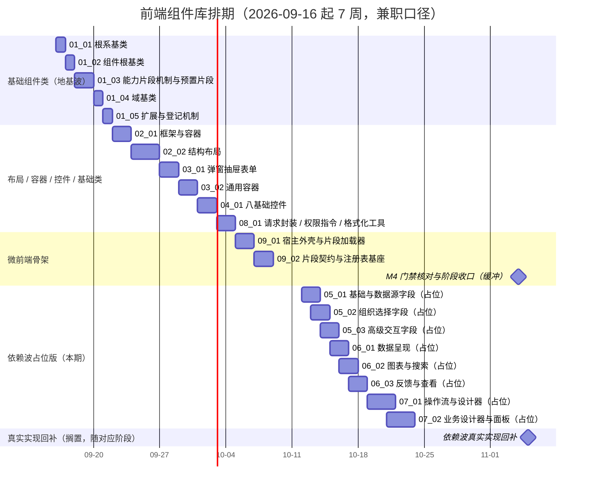

# 前端组件库计划

> BMS 基础管理系统 · 阶段四（前端组件库 / M4 组件库可用）排期计划：已完成 0 项，剩余 21 项（地基波 13 项本期实施；依赖回补波 8 项登记搁置，随对应后端阶段）

[文档首页](../../../文档首页.md) › 前端组件库计划　|　[任务基线 →](../任务/01_基础组件类/01_基础组件类.md)　[需求基线 →](../需求/00_需求_前端组件库.md)

## 1. 计划说明 

- **排期对象**：阶段四 21 条需求**已全部建任务基线**——9 个域父任务（[基础组件类](../任务/01_基础组件类/01_基础组件类.md)、[布局组件类](../任务/02_布局组件类/02_布局组件类.md)、[容器组件类](../任务/03_容器组件类/03_容器组件类.md)、[基础控件类](../任务/04_基础控件类/04_基础控件类.md)、[字段类](../任务/05_字段类/05_字段类.md)、[展示类](../任务/06_展示类/06_展示类.md)、[交互类](../任务/07_交互类/07_交互类.md)、[基础类](../任务/08_基础类/08_基础类.md)、[微前端骨架](../任务/09_微前端骨架/09_微前端骨架.md)）。
- **波次口径（M4）**：**地基波 13 条**（机制基类 / 能力片段 / 域基类、布局、容器、基础控件、基础类、微前端骨架）本期实施，合计 **152h**；**依赖回补波 8 条**（字段 / 展示 / 交互类）本期先交付**占位版**（空态 / 禁用态 + 占位契约测试，对齐后端 Null 占位模式）合计 **40h**，**真实实现**（合计 74h）随对应后端阶段（阶段六 / 七 / 八 / 九 / 十六 / 十八 / 十九）就绪后回补。
- **顺序口径（地基先行 + 递进 + 占位先行）**：基础组件类（根系 → 组件根 → 能力片段 → 域基类 → 扩展机制）→ 布局 / 容器 / 基础控件（依赖能力片段）→ 基础类 → 微前端骨架（宿主与注册表基座）→ 依赖波占位版；真实实现按回补窗口执行。
- **排期口径**：自 2026-09-16 起 7 周（至 2026-11-04，兼职口径，含 2 周缓冲与 M4 收口）；设计随任务启动逐个补建（视前序任务完成情况调整）。
- **工时**：已完成 0h；剩余 266h（地基波 152h + 依赖占位 40h + 依赖回补真实实现 74h）；阶段合计 266h。
- **里程碑锚点**：M4 = **组件库可用**（《总体项目规划》「里程碑」节），门禁见第 5 节。
- **负责人**：minjian（兼职，单人）。

## 2. 已完成任务 

| 编号 | 任务 | 工时（重估） | 完成日期 | 任务文件 | 偏差与遗留 |
| --- | --- | --- | --- | --- | --- |

## 3. 剩余任务排期 

| 编号 | 任务 | 工时 | 依赖 | 排期窗口 | 备注 | 偏差与遗留 |
| --- | --- | --- | --- | --- | --- | --- |
| 01_01 | 根系基类 | 6h | — | 2026-09-16 | 根系 `BaseFrontend` + 组合式 | 无 |
| 01_02 | 组件根基类 | 6h | 01_01 | 2026-09-17 | attrs / 尺寸密度 / 可访问性 / 片段组合入口 | 无 |
| 01_03 | 能力片段机制与预置片段 | 22h | 01_02 | 2026-09-18 ~ 2026-09-19 | 片段机制 + 预置 11 片段（开放新增） | 无 |
| 01_04 | 域基类 | 8h | 01_03 | 2026-09-20 | `BaseInput` / `BaseDisplay`（组合片段） | 无 |
| 01_05 | 扩展与登记机制 | 4h | 01_01~01_04 | 2026-09-21 | 候选→评审→登记；护栏用例 | 无 |
| 02_01 | 框架与容器 | 10h | 01_05 | 2026-09-22 ~ 2026-09-23 | `AppLayout` / `FormFrame` / `PageContainer` | 无 |
| 02_02 | 结构布局 | 20h | 01_05 | 2026-09-24 ~ 2026-09-26 | 八件结构组件 | 无 |
| 03_01 | 弹窗抽屉表单 | 12h | 01_05 | 2026-09-27 ~ 2026-09-28 | 三态 / 尺寸阶梯 / 脏数据拦截 | 无 |
| 03_02 | 通用容器 | 16h | 01_05 | 2026-09-29 ~ 2026-09-30 | 八件通用容器 | 无 |
| 04_01 | 八基础控件 | 16h | 01_04 | 2026-10-01 ~ 2026-10-02 | 受控 / 三态 / 校验触发统一 | 无 |
| 08_01 | 请求封装 / 权限指令 / 格式化工具 | 12h | 01_01 | 2026-10-03 ~ 2026-10-04 | 复用阶段一 `stableStringify` | 无 |
| 09_01 | 宿主外壳与片段加载器 | 10h | 01_05 | 2026-10-05 ~ 2026-10-06 | 薄壳 + 加载器 + 本地演示片段 | 无 |
| 09_02 | 片段契约与注册表基座 | 10h | 09_01 | 2026-10-07 ~ 2026-10-08 | 注入/注册声明契约 + 注册表基座最小实现 | 无 |
| 05_01 | 基础与数据源字段 | 16h（占位 6h + 回补 10h） | 04_01；后端：阶段八（字典） | 2026-10-12 ~ 2026-10-13 | **占位版本期**（空态 / 禁用态 + 占位契约测试）；真实实现回补阶段八后 | 无 |
| 05_02 | 组织选择字段 | 8h（占位 3h + 回补 5h） | 04_01；后端：阶段七（RBAC） | 2026-10-13 ~ 2026-10-14 | **占位版本期**；真实实现回补阶段七后 ~ 八 | 无 |
| 05_03 | 高级交互字段 | 12h（占位 5h + 回补 7h） | 04_01；后端：阶段六（验证码）/ 八（文件） | 2026-10-14 ~ 2026-10-15 | **占位版本期**；真实实现回补阶段六 ~ 八 | 无 |
| 06_01 | 数据呈现 | 14h（占位 5h + 回补 9h） | 后端：阶段八后（列表接口 / 偏好表） | 2026-10-15 ~ 2026-10-16 | **占位版本期**；真实实现回补阶段八后 ~ 十五 | 无 |
| 06_02 | 图表与搜索 | 8h（占位 3h + 回补 5h） | 后端：阶段十六（报表）/ 十八（检索） | 2026-10-16 ~ 2026-10-17 | **占位版本期**；真实实现回补阶段十六 / 十八 | 无 |
| 06_03 | 反馈与查看 | 12h（占位 4h + 回补 8h） | 后端：阶段八起（通知 / 文件 / 审计） | 2026-10-17 ~ 2026-10-18 | **占位版本期**；真实实现回补阶段八起 ~ 十八 | 无 |
| 07_01 | 操作流与设计器 | 24h（占位 8h + 回补 16h） | 后端：阶段七 ~ 九 | 2026-10-19 ~ 2026-10-21 | **占位版本期**；真实实现回补阶段七 ~ 九 | 无 |
| 07_02 | 业务设计器与面板 | 20h（占位 6h + 回补 14h） | 后端：阶段七 ~ 九 / 十六 / 十九 | 2026-10-21 ~ 2026-10-23 | **占位版本期**；真实实现回补阶段七 ~ 九 / 十六 / 十九 | 无 |

剩余合计 **266h**（地基波 152h + 依赖占位 40h + 依赖回补真实实现 74h）。

### 3.1 波次与回补口径 

| # | 事项 | 归口 | 处理动作 |
| --- | --- | --- | --- |
| 1 | 依赖波**真实实现**回补（8 条，合计 74h） | 本计划 §3 备注与各任务文档 | 占位版本期交付（对齐后端 Null 占位模式）；真实实现随对应阶段就绪后回补：设计 → 实施 → 记录 → Kiwi，并把窗口改为具体日期 |
| 2 | 组件原型一致性验收（原型即基准） | 各子任务完成标准 | 与《组件设计》可交互原型逐节点对齐（门禁第 5 项） |
| 3 | 设计随任务逐项补建 | 各子任务「详细设计随任务启动时补建」 | 按前序任务完成情况调整口径，先设计后编码 |

## 4. 排期甘特图 

> 依赖波占位版日期为本期名义排期；真实实现回补时间随对应后端阶段（回补时改具体日期）。全部日期为名义排期，实际按 AI 实施节奏推进并以任务记录回写。

## 5. M4 验收门禁 

门禁定义与逐项核对见[需求总览 · M4 验收门禁](../需求/00_需求_前端组件库.md#accept)（5 个验收点）；本计划下的达成路径：

| 验收点 | 对应任务 | 达成路径 |
| --- | --- | --- |
| 前端基类体系可用 | 01_01 ~ 01_05 | 根系 / 组件根 / 能力片段 / 域基类按角色落地 + 扩展登记机制（域一 5 条） |
| 地基波组件可用 | 02_01 / 02_02 / 03_01 / 03_02 / 04_01 / 08_01 | 布局 / 容器 / 基础控件 / 基础类组件可用，页面可由「布局壳 + 通用组件」组装 |
| 组件单测通过 | 地基波任务 + 依赖波占位版 | Vitest 覆盖基类 / 片段契约、关键交互与占位契约（空态 / 禁用态 / 降级）；覆盖率并入前端门禁（整体 ≥ 70%） |
| 微前端骨架就位 | 09_01 / 09_02 | 宿主薄壳与加载器接口就位、演示片段可加载与卸载；片段契约与注册表基座最小实现成文并使用 |
| 原型一致 | 地基波任务（占位版按占位语义对齐原型空态） | 组件交互与视觉与《组件设计》可交互原型一致（对齐 Element Plus 行为） |

## 6. 风险与对策 

| 风险 | 影响 | 对策 |
| --- | --- | --- |
| 能力片段划分随实施调整（新片段 / 边界变化） | 返工与接口漂移 | 片段按「候选 → 设计节点 → 评审 → 清单登记」流程新增；机制先行（01_03）后再开组件任务 |
| 依赖回补波与后端阶段错位 | 回补窗口漂移 | 登记搁置并随阶段任务对齐；回补时先设计再实施（同口径） |
| 组件数量多、原型一致性靠人工核对 | 验收遗漏 | 逐节点对照原型；组件单测 + 清单登记双护栏；M4 门禁第 5 项专核 |
| 单人兼职投入不稳 | M4 延期 | 地基波串行保守排期 + 2 周缓冲；机制先行保底，组件可分批交付 |

> 本文档依《文档生成规范》编写
