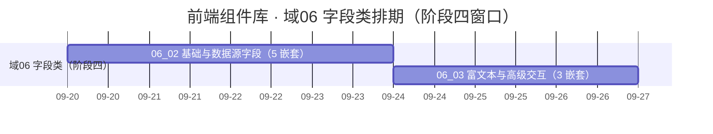

# 前端组件库计划

> BMS 基础管理系统 · 阶段四（前端组件库 / M4 组件库可用）排期计划：域 02 基础组件类 7 项 / 146h（已完成 7 项 / 全部完成）、域 03 布局组件类 5 项 / 58h（已完成 5 项 / 全部完成）、域 04 容器组件类 1 项 / 24h（已完成 1 项 / 全部完成）、域 10 微前端骨架 2 项 / 24h（已完成 2 项 / 全部完成）、域 05 基础控件类 1 项 / 24h（已完成 1 项 / 全部完成）、域 06 字段类 7 项 / 112h（已完成 1 项 / 剩余 6 项，含依赖窗口），其余需求域随任务基线补排

[文档首页](../../../文档首页.md) › 前端组件库计划　|　[任务基线 →](../任务/02_基础组件类/02_基础组件类.md)　[需求基线 →](../需求/00_需求_前端组件库.md)

## 1. 计划说明 

- **排期对象**：阶段四 40 条需求；**已建任务基线者**：需求域 02 基础组件类（[02 基础组件类](../任务/02_基础组件类/02_基础组件类.md)，7 个子任务 · 含 4 个嵌套子任务 · 146h）与需求域 03 布局组件类（[03 布局组件类](../任务/03_布局组件类/03_布局组件类.md)，5 个子任务 · 含 3 个嵌套子任务 · 58h，已完成 5 项（全部完成））与需求域 04 容器组件类（[04 容器组件类](../任务/04_容器组件类/04_容器组件类.md)，1 个子任务 · 含 3 个嵌套子任务 · 24h，已完成 1 项（全部完成））与需求域 10 微前端骨架（[10 微前端骨架](../任务/10_微前端骨架/10_微前端骨架.md)，2 个子任务 · 24h，已完成 2 项（全部完成））与需求域 05 基础控件类（[05 基础控件类](../任务/05_基础控件类/05_基础控件类.md)，1 个子任务 · 含 2 个嵌套子任务 · 24h，已完成 1 项（全部完成））与需求域 06 字段类（[06 字段类](../任务/06_字段类/06_字段类.md)，7 个子任务 · 含 8 个嵌套子任务 · 112h，已完成 1 项 / 剩余 6 项；`06_02` / `06_03` 阶段四窗口内推进，`06_04` ~ `06_07` 随阶段六 / 七 / 八；**仅 PC**）。域 07 ~ 09 随各自任务基线建立后补排（需求见[前端组件库需求总览](../需求/00_需求_前端组件库.md)）。
- **执行序（基座先行 + 链上逐级）**：`02_07 框架无关核心工程与契约保障`（工程脚手架与核心护栏先行）→ `02_01 总基类与固定三段` → `02_05 体系机制` → `02_02 组件根` → `02_03 能力基类族` → `02_04 组件基类族` → `02_06 基础类横切底座`；`02_07` 的契约用例工厂与清单对账护栏随 `02_03` / `02_04` 就位收口。
- **波次与依赖实现窗口**（自需求迁入）：**地基波 19 条**在阶段四窗口内闭环——`02_*`（7）、`03_*`（5）、`04-1`、`05-1`、`06-1` / `07-1` / `08-1`（占位版）、`10-1` / `10-2`；**依赖实现波 21 条**先交付占位版、真实实现随对应阶段——`06-2` / `06-3`、`07-2`、`08-2` / `08-3` 无后端强依赖（阶段四内推进）；`06-4` 验证码 ← 阶段六（认证与安全）；`06-5` 组织选择 / `08-4` 权限配置 ← 阶段七（RBAC）；`06-6` 字典 / `06-7` 文件上传 / `07-3` 文件预览与审计差异 / `08-5` 导入导出 / `08-6` 表单设计器与渲染器 / `08-7` 国际化文案编辑器 ← 阶段八（通用能力）；`07-4` 通知与消息 ← 阶段八 + 十（实时推送）；`07-5` 数据呈现 ← 阶段八后 ~ 十五；`07-6` 图表卡 / `08-9` 报表与大屏设计器 ← 阶段十六（报表 BI）；`07-7` 全局搜索 ← 阶段十八（全文检索）；`08-8` 审批流与流程建模 ← 阶段九（工作流引擎）；`08-10` AI 助手 ← 阶段十九（AI 能力）。
- **对齐口径**：域 02 按后端已跑通的基类体系做法落地（极简根系 / 能力域基类只做声明 / 占位三件 / 异步资源统一登记与逆序释放 / 插件中间层双轨登记 + 实例缓存 + 契约版本 / 提供者组合轨 / 错误码段位 / 逐基类 + contracts + crosscut 测试分层），任务参考只引文档（《[后端基类清单](../../../后端基类清单.md)》《[架构设计 · 后端基础类体系](../../../设计/架构设计/04_架构设计_后端基础类体系.md)》《[后端开发规范](../../../规范/后端开发规范.md)》）。
- **排期口径**：自 2026-09-18 起串行排期（单人兼职）；按 8h/日折算，2026-10-01 ~ 2026-10-07（国庆）不计入。
- **工时**：域 02 合计 146h（已全部完成）；**域 03 合计 58h（已全部完成）**；**域 04 合计 24h（已全部完成）**；**域 10 合计 24h（已全部完成）**；**域 05 合计 24h（已全部完成）**；**域 06 合计 112h（已完成 12h / 剩余 100h；含依赖窗口）**；阶段四合计随其余域任务基线补建后累计。
- **里程碑锚点**：M4 = **组件库可用**（《总体项目规划》「里程碑」节），门禁定义与逐项核对见[本计划 §5 M4 验收门禁](#accept)。
- **负责人**：minjian（兼职，单人）。

## 2. 已完成任务（2026-09-18） 

| 编号 | 任务 | 工时（重估） | 完成日期 | 任务文件 | 偏差与遗留 |
| --- | --- | --- | --- | --- | --- |
| 02_01 | 总基类与固定三段 | 8h | 2026-09-18 | [02_01](../任务/02_基础组件类/02_基础组件类_01_总基类与固定三段/02_基础组件类_01_总基类与固定三段.md) | 无（三段就位：`BaseObject` / `BaseCapability` / `BasePluggable`；遗留见实施记录 §6） |
| 02_02 | 组件根 | 8h | 2026-09-18 | [02_02](../任务/02_基础组件类/02_基础组件类_02_组件根/02_基础组件类_02_组件根.md) | 无（令牌属性协议 / attrs 透传 / 生命周期多监听 / 机制装配点） |
| 02_03 | 能力基类族 | 40h | 2026-09-18 | [02_03](../任务/02_基础组件类/02_基础组件类_03_能力基类族/02_基础组件类_03_能力基类族.md) | 无（27 个能力基类分三批 + manifest 依赖登记与校验；`BaseOptionSource` / `BaseFormMeta` 数据版本字段改名 `dataVersion` 见实施记录 §4） |
| 02_04 | 组件基类族 | 22h | 2026-09-18 | [02_04](../任务/02_基础组件类/02_基础组件类_04_组件基类族/02_基础组件类_04_组件基类族.md) | 无（16 个组件基类；`BaseTable` 页长字段改名 `pageSize` 避根字段 `size`；`BaseChart` 本期不建类） |
| 02_05 | 体系机制 | 20h | 2026-09-18 | [02_05](../任务/02_基础组件类/02_基础组件类_05_体系机制/02_基础组件类_05_体系机制.md) | 无（注册表 / 工厂 / 资源 / 占位 / 错误 / 契约基类；`BaseEntity` 乐观锁字段改名 `recordVersion` 见实施记录 §4） |
| 02_06 | 基础类横切底座 | 24h | 2026-09-18 | [02_06](../任务/02_基础组件类/02_基础组件类_06_基础类横切底座/02_基础组件类_06_基础类横切底座.md) | 无（核心：格式化 / 校验 / 权限判定 / 令牌解析 / 请求契约；PC 宿主：`@bms/vue` 绑定 + `apps/desktop` Axios 请求层 / `v-perm` / `tokens.scss` / 格式化基准；移动端本阶段范围外） |
| 02_07 | 框架无关核心工程与契约保障 | 24h | 2026-09-18 | [02_07](../任务/02_基础组件类/02_基础组件类_07_框架无关核心工程与契约保障/02_基础组件类_07_框架无关核心工程与契约保障.md) | 无（工程骨架 + 护栏 + 错误码段位 + 契约 5 套件 + 清单对账护栏；收口见实施记录 §7） |
| 03_01 | 弹窗抽屉表单 | 12h | 2026-09-18 | [03_01](../任务/03_布局组件类/03_布局组件类_01_弹窗抽屉表单/03_布局组件类_01_弹窗抽屉表单.md) | 无（`ui-ep` 骨架 + 二次确认 + `FormDialog` / `FormDrawer` / `useFormModal` / `useModalShell`；仅 PC） |
| 03_02 | 异常与空状态 | 8h | 2026-09-18 | [03_02](../任务/03_布局组件类/03_布局组件类_02_异常与空状态/03_布局组件类_02_异常与空状态.md) | 无（错误页 / 空状态矩阵 / 骨架屏 / 遮罩 / `useFeedback` + 宿主 `/403` `/404` `/500` 接线；5 个 SVG 插画） |
| 03_03 | 结构布局 | 22h | 2026-09-18 | [03_03](../任务/03_布局组件类/03_布局组件类_03_结构布局/03_布局组件类_03_结构布局.md) | 无（多标签导航 + 双层页签 / `useTabNav` 会话持久化；树形主从 + 自研 `SplitPane`；基础布局件六件；ui-ep 49 用例） |
| 03_04 | 侧边菜单 | 6h | 2026-09-18 | [03_04](../任务/03_布局组件类/03_布局组件类_04_侧边菜单/03_布局组件类_04_侧边菜单.md) | 无（核心 `domain/menu.ts` 纯函数 + 占位菜单树；`useSideMenu` 经 `BaseDynamicRoutes`；`SideMenu` 递归渲染 / 搜索 / 徽标；宿主占位路由闭环） |
| 03_05 | 框架与容器 | 10h | 2026-09-18 | [03_05](../任务/03_布局组件类/03_布局组件类_05_框架与容器/03_布局组件类_05_框架与容器.md) | 无（主框架壳 / 表单框架壳 / 页面容器 + 能力投影 `useBaseContainer` / `useBaseDesignToken` / `useResponsive`；宿主装配主框架 + keep-alive） |
| 04_01 | 通用容器 | 24h | 2026-09-18 | [04_01](../任务/04_容器组件类/04_容器组件类_01_通用容器/04_容器组件类_01_通用容器.md) | 无（八件容器：滚动 / 自适应高度 / 分区 / 宽高比 / 全屏 / 懒加载 / 虚拟列表 / 四态；可视区纯函数下沉核心领域层） |
| 06_01 | 占位版交付 | 12h | 2026-09-18 | [06_01](../任务/06_字段类/06_字段类_01_占位版交付/06_字段类_01_占位版交付.md) | 无（占位契约套件 `describePlaceholderFieldContract` + 四件占位：字典 / 组织 / 文件 / 验证码；`ready` 驱动、占位零请求） |
| 05_01 | 基础控件 | 24h | 2026-09-18 | [05_01](../任务/05_基础控件类/05_基础控件类_01_基础控件/05_基础控件类_01_基础控件.md) | 无（八件控件：文本框 / 文本域 / 密码框 / 数字框 / 下拉框 / 单选 / 复选 / 开关；新增投影 `useBaseInput` / `useBaseField`） |
| 10_01 | 宿主外壳与模块加载器 | 8h | 2026-09-18 | [10_01](../任务/10_微前端骨架/10_微前端骨架_01_宿主外壳与模块加载器/10_微前端骨架_01_宿主外壳与模块加载器.md) | 无（核心模块契约类型 + `defineModule` + `LocalModuleLoader`；宿主装配 / 模块路由注册（按名卸载）/ `ModuleBoundary` 兜底；演示模块开发态可见） |
| 10_02 | 模块契约与注册表基座 | 16h | 2026-09-18 | [10_02](../任务/10_微前端骨架/10_微前端骨架_02_模块契约与注册表基座/10_微前端骨架_02_模块契约与注册表基座.md) | 无（5 注册表 + `createRegistries`；宿主注册装配（命名空间前缀校验 / 逆序清理）；模块契约架构节点 35；样式护栏） |

## 3. 剩余任务排期（自 2026-09-18） 

| 编号 | 任务 | 工时 | 依赖 | 排期窗口 | 备注 | 偏差与遗留 |
| --- | --- | --- | --- | --- | --- | --- |
| 06_02 | 基础与数据源字段 | 30h | 02_04 / 02_06 / 05_01 | 2026-09-18 ~ 2026-09-22 | 含 5 嵌套（日期时间 / 数值金额 / 开关枚举 / 树选择 / 级联）各 6h | 进行中：日期时间 / 数值与金额 / 开关与枚举 / 树选择字段已交付（2026-09-18） |
| 06_03 | 富文本与高级交互字段 | 24h | 02_04 / 02_06 / 05_01 / 06_01 | 2026-09-24 ~ 2026-09-26 | 含 3 嵌套（富文本 10h / 穿梭框 8h / 标签输入 6h） | 无 |
| 06_04 | 验证码字段 | 8h | 阶段六（认证与安全） | 搁置（阶段六窗口） | 图形 / 滑块 / 短信；保持 `06_01` 冻结契约 | 未到窗口 |
| 06_05 | 组织选择字段 | 12h | 阶段七（RBAC） | 搁置（阶段七窗口） | 用户 / 岗位 / 组织 / 部门树；批量回显 | 未到窗口 |
| 06_06 | 字典字段 | 10h | 阶段八（通用能力·字典） | 搁置（阶段八窗口） | 字典下拉 / 级联 / 标签回显；store 缓存 | 未到窗口 |
| 06_07 | 文件上传字段 | 16h | 阶段八（通用能力·文件存储） | 搁置（阶段八窗口） | 分片 / 秒传 / 断点续传 / 预签名回显 | 未到窗口 |

> 域 02 / 03 / 04 / 05 / 10 已全部完成；域 07 ~ 09 待各自任务基线建立后补排。

> 域 02、域 03、域 04、域 10 已全部完成；域 06 ~ 09 待各自任务基线建立后补排。

## 4. 排期甘特图 

> 域 02 / 03 / 04 / 05 / 10 已全部完成（2026-09-18）；域 06 阶段四窗口部分见下（`06_04` ~ `06_07` 随阶段六 / 七 / 八，域 07 ~ 09 待任务基线补排后更新）。

> 甘特为串行保守基线；嵌套子任务并入其直属父任务行（见《[计划文档规范](../../../规范/计划文档规范.md)》「嵌套子任务」节）。

## 5. M4 验收门禁（域 02 / 03 / 04 贡献路径） 

M4 门禁定义与逐项核对见[本计划 §5 M4 验收门禁](#accept)；域 02（基础组件类）、域 03（布局组件类）与域 04（容器组件类）的贡献路径：

| 验收点 | 对应任务 | 达成路径 |
| --- | --- | --- |
| 基类体系可用 | 02_01 ~ 02_07 | 固定前三段 / 组件根 / 能力基类族 / 组件基类族 / 体系机制就位，基础类横切底座可用，核心框架无关护栏与清单对账可查 |
| 组件单测通过（链上契约） | 02_01 ~ 02_07 | Vitest 覆盖三段 / 组件根 / 能力基类 / 组件基类 / 机制 / 请求 / 权限 / 格式化 / 令牌契约 |
| 地基波组件可用（布局） | 03_01 ~ 03_05 | 弹窗抽屉表单 / 异常与空状态 / 结构布局 / 侧边菜单 / 框架与容器就位；页面可由「布局壳 + 页面容器 + 通用组件」组装 |
| 地基波组件可用（容器） | 04_01 | **达标（2026-09-18）**：八件容器就位；虚拟列表定高 / 动态高度两路径与全屏 / 交叉观察器 / 宽高比能力缺失降级均生效 |
| 地基波组件可用（基础控件） | 05_01 | **达标（2026-09-18）**：八件基础控件就位；受控 / 三态 / 禁用合并 / 校验触发在 `useBaseInput` / `useBaseField` 统一定义；字段壳待字段壳族组装 |
| 地基波组件可用（字段类） | 06_01 ~ 06_03 | **占位契约已冻结（2026-09-18）**；基础与数据源字段、富文本与高级交互字段待实施；`06_04` ~ `06_07` 随依赖窗口 |
| 微前端骨架就位 | 10_01 ~ 10_02 | **达标（2026-09-18）**：宿主薄壳 + 模块加载器接口（本地演示模块）；模块契约（注入 / 注册声明 / 样式约束）+ 5 注册表最小实现（模块与平台共用）；契约文档见《[前端模块契约](../../../设计/架构设计/35_架构设计_前端模块契约.md)》 |
| 原型一致 | 03_01 ~ 03_05、域 04 ~ 08 | 布局件交互与视觉对照《布局设计》与《组件设计》各节点原型；其余组件随对应域任务实现 |

## 6. 风险与对策 

| 风险 | 影响 | 对策 |
| --- | --- | --- |
| 能力基类族 / 组件基类族体量大（合计 62h） | 域 02 滑期，阻塞域 03+ | 按《前端基类清单》逐链推进、小步提交；先落公共段与占位，再补横切契约；必要时拆嵌套子任务 |
| 契约用例工厂与清单对账护栏滞后 | 「同接口多实现」保障不足、登记漂移 | 护栏项随 02_03 / 02_04 就位同步收口；对账脚本纳入 CI 门禁 |
| 基类身份 / 继承关系与《前端基类清单》口径漂移 | 返工（本体系已有三次口径修正教训） | 新增 / 调整基类一律「候选 → 设计节点 → 评审 → 清单登记 → 代码登记 + 契约用例」；以《前端基类清单》为唯一权威 |
| 设计令牌与渲染实现主题映射需联调 | 视觉不一致 / 硬编码残留 | 令牌先登记后使用；属性协议选择器与组件根联动；硬编码色值护栏拦截 |
| `ui-ep` 工程骨架与 CI 挂回一次性成本 | 域 03 起步阻塞 | `03_01` 前置完成骨架并把根门禁 / CI 挂回 `core + vue + ui-ep`；组件随骨架就位后落地 |
| 结构布局交互复杂（树形主从 / 分栏 / 双层页签） | 域 03 滑期 | `03_03` 拆 3 嵌套子任务分批交付；空态与确认复用 `03_01` / `03_02` |
| 虚拟列表 / 懒加载实现复杂且浏览器能力差异 | 域 04 滑期 | 虚拟列表自研轻量（定高快路径 + 动态高度缓存）；能力缺失一律降级不抛错；`04_01` 拆 3 嵌套子任务分批交付 |
| 微前端契约与阶段五运行时加载衔接 | 域 10 返工（契约为本地形态写死） | 加载器接口按远端模块预留（模块名 / 版本 / 挂载 / 卸载）；本期不引入 Module Federation 依赖，契约字段按《前端架构》「模块治理要求」表设计 |
| 八件基础控件各自实现受控 / 三态致行为发散 | 域 05 返工、字段类（域 06）连带 | 受控 / 三态 / `disabled` 合并 / `change` / 校验触发在投影层定义一次；逐件契约用例断言同一口径 |
| 占位契约在真实实现时被改动 | 域 06 返工并连带页面与字段壳 | `06_01` 先行冻结对外契约并入契约用例；`06_04` ~ `06_07` 只换数据通路，契约变更走版本升级 |
| 单人兼职投入不稳 | M4 延期 | 串行保守排期；工程脚手架与固定三段先行保底，基类族与横切底座可顺延 |

> 本文档依《[文档生成规范](../../../规范/文档生成规范.md)》编写
