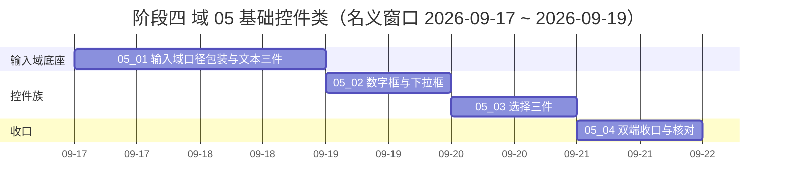

# 前端组件库计划

> BMS 基础管理系统 · 阶段四（前端组件库 / M4 组件库可用）排期计划：**域 02 基础组件类（6 项 / 88h）、域 03 布局组件类（6 子任务含 3 嵌套 / 62h）与域 04 容器组件类（4 子任务 / 25h）均已全部完成（2026-09-16，合计 175h）**；**域 05 基础控件类（4 子任务 / 24h）任务基线已建（2026-09-17，待实施）**；其余域（06 ~ 10）随任务基线建立后补排

[文档首页](../../../文档首页.md) › 前端组件库计划　|　[任务基线 →](../任务/03_布局组件类/03_布局组件类.md)　[需求基线 →](../需求/00_需求_前端组件库.md)

## 1. 计划说明 

- **排期对象**：阶段四需求基线 39 条中**已建任务基线的需求域 02（6 项 / 88h）、域 03（6 子任务 62h，含 3 个嵌套子任务）与域 04（容器组件类 / 需求 04-1 / 4 子任务 25h）**——均已全部完成（2026-09-16）；**域 05 基础控件类（需求 05-1 / 4 子任务 24h）任务基线已建（2026-09-17），待实施**；其余域（06 ~ 10）随其任务基线建立后补排。
- **波次口径**：域 02（地基波首段）与域 03（地基波：弹窗表单、异常与空状态、结构布局、侧边菜单、框架与容器 + 基础令牌）均已完成并实际装配（宿主 / 守卫 / 菜单路由 / keep-alive）；域 04（地基波：通用容器八件，同接口多实现）已完成——**容器八件齐**；**域 05（地基波：八基础控件 + 输入域口径包装，双端同契约）任务基线已建（2026-09-17），待实施**；依赖回补波（21 条需求）先交占位版、真实实现随对应阶段回补。
- **顺序口径**：域 02：基础类体系；域 03：基础令牌 → 弹窗抽屉表单 → 异常与空状态 → 结构布局 → 侧边菜单 → 框架与容器；域 04：滚动容器 → 懒加载与虚拟列表 → 视口与自适应 → 状态与分区（均已完成）；**域 05：输入域口径包装与文本三件 → 数字框与下拉框 → 选择三件 → 双端收口与核对**；**每项只依赖排期在其之前的任务**（域内递进；全部任务的前置契约——域 02 基类体系与预置 31 能力、请求封装 / 权限指令 / 格式化工具、容器能力 `container`（投影 `useContainer`）、异常与空状态件——已交付；域 05 另依赖 `02_07` 框架无关核心重构全链收口（2026-09-17）与 `@bms/core` 输入域能力 `field` + `input-control` / `@bms/vue` 投影 `useField` / `useValue`）。
- **排期口径**：域 02 窗口 2026-09-16 ~ 09-23、域 03 窗口 2026-09-17 ~ 09-24（名义）——均于 2026-09-16 当日闭环（AI 实施节奏，实际回写任务记录）；**域 04 窗口 2026-09-25 ~ 09-27（名义）——亦于 2026-09-16 当日闭环**；**域 05 窗口 2026-09-17 ~ 09-19（名义，2026-09-17 建任务时确认）**；详细设计随任务启动逐个补建。
- **工时**：已完成 **339h**（域 02 88h + 域 03 62h + 域 04 25h + `02_07` 164h 草案口径）；`02_07` 框架无关核心重构（设计变更专项，2026-09-16 追加）**六阶段 S0 ~ S5 + 收尾批次 S6 ~ S10（desktop 旧层收口 / 包级 ESLint / 目录对称化 / 文档对齐三波 / CI 分层放行）全链完成（2026-09-16 ~ 09-17，过程见各批实施记录 01 ~ 27）**；**域 05 待做 24h**（域包装 3h + 文本三件 6h + 数字与下拉 5h + 选择三件 6h + 双端收口 4h）；阶段合计 **363h**（阶段四合计 317h 口径见《[架构设计 · 前端组件体系](../../../设计/架构设计/05_架构设计_前端组件体系.md)》「阶段落地（地基波 + 回补）」节，其余域随补排累加）；**待做**：域 06+ 任务基线、移动端缺口清单批次、域 05 实施（24h）。
- **里程碑锚点**：M4 = **组件库可用**（《[总体项目规划](../../../规划/总体项目规划.md)》「里程碑」节）；本计划覆盖 M4 的域 02、域 03、域 04（均已完成）与域 05（基线已建，待实施），门禁见第 5 节，其余域随补排。
- **负责人**：minjian（兼职，单人）。

## 2. 已完成任务（2026-09-16 ~ 2026-09-17） 

| 编号 | 任务 | 工时（重估） | 完成日期 | 任务文件 | 偏差与遗留 |
| --- | --- | --- | --- | --- | --- |
| 02_01 | 根系基类 | 6h | 2026-09-16 | [02_01](../任务/02_基础组件类/02_基础组件类_01_根系基类/02_基础组件类_01_根系基类.md) | 偏差：根系落点三处口径不一致（按《组件设计》节点落地，回写前端基类清单 §7 / 架构 08 §8）；遗留：请求封装完整能力（归 `02_06`）、其余 7 个机制基类文件口径（归 `02_02` / `02_03`）、《概要设计 · 系统参数》「前端配置」节上游待补（归阶段六 / 八）；开放项（`dispose()` 后是否静默、`getConfig` 点分键）不立归口 |
| 02_02 | 组件根基类 | 12h | 2026-09-16（提前一日） | [02_02](../任务/02_基础组件类/02_基础组件类_02_组件根基类/02_基础组件类_02_组件根基类.md) | 偏差：组合式命名与《前端开发规范》§3.1 不一致（统一核心能力类命名 `BaseXxx`，四处文档回写）、`BaseError` 继承口径（改 `extends Error` + 挂接机制层）、令牌落点超本任务边界（按拍板顺带交付最小令牌文件）；遗留：基础令牌（color/font/space/radius）、错误码段位与命名口径、架构 08 登记、护栏升级评估（均归 `02_05`）；订阅真实来源 → 阶段五；四态与重试 → `02_03` / `02_06` |
| 02_03 | 能力机制与预置能力 | 40h | 2026-09-16 | [02_03](../任务/02_基础组件类/02_基础组件类_03_能力机制与预置能力/02_基础组件类_03_能力机制与预置能力.md) | 偏差：注册表命名按需求口径确立为 `BaseRegistry` / `RegistryItemLike`（回写节点 06 / 清单 / 规范 §3.1）、能力旧名（`useFieldPermission` / `usePreference`）按节点与清单回写、`option-source` 依赖按「协作不入 depends」口径由 `value` + `field` 收紧为 `value`（设计文档与平台用例 707 正文同步修订）；遗留：静态护栏与错误码段位对齐（归 `02_05`）、`BaseXxx.vue` 能力包装（按需随组件任务）、对账脚本前端标记缺口（测试资产仓待排期） |
| 02_04 | 域基类 | 11h | 2026-09-16 | [02_04](../任务/02_基础组件类/02_基础组件类_04_域基类/02_基础组件类_04_域基类.md) | 偏差：设计节点为 Element Plus 集成口径，按拍板「同接口多实现·框架无关」落地（原生元素兜底 + 子类接入 UI 库）；补充域能力类命名（`BaseXxx`，落 `frontend/packages/core/src/capabilities/`）与字段壳能力（字段上下文语义，`BaseFieldShell`，非能力表新增）；遗留：`BaseChart` 实现（随 `07_06`）、名义格式化器分发（归 `02_06`）、具体控件接入（各组件任务）、概要设计 36 / 布局设计 html 上游登记（归 `02_05`） |
| 02_05 | 扩展与登记机制 | 4h | 2026-09-16 | [02_05](../任务/02_基础组件类/02_基础组件类_05_扩展与登记机制/02_基础组件类_05_扩展与登记机制.md) | 偏差：护栏实现形态按拍板全落 Vitest（`frontend/packages/core/tests/guard-core-framework-agnostic.spec.ts` + `frontend/packages/core/tests/contracts/*.spec.ts`，随 CI `test:cov`，未改流水线）；继承护栏由文本扫描升级为 AST（已装依赖）；错误码按拍板改常量（未实现 `10001` → `19001` 前端保留子段、能力声明违规 → `10001`、注册表冲突 → `10003`），历史记录留痕不改；遗留：基础令牌（随布局域令牌任务）、「不注册不可用」（`10_02`）、概要设计 36 / 布局设计 html 登记项（本轮已随 `02_04` 行归口 `02_05`，护栏任务未涉及设计资产，维持归对应设计更新） |
| 02_06 | 基础类横切底座 | 15h | 2026-09-16 | [02_06](../任务/02_基础组件类/02_基础组件类_06_基础类横切底座/02_基础组件类_06_基础类横切底座.md) | 偏差：请求层按拍板拆分文件 + 适配注入 + 401 占位降级、`useListPage.query` 改 reactive（兼容扩展）、权限 store 内包 `useAccess`（回写任务口径）、注册表落能力层（`formatters.ts`）、构建体积预算因 `ElMessage` 放宽 85 / 63 → 100 / 75 KB；遗留：后端 `/auth/*` 与菜单 / 权限接口（认证 / 菜单任务）、登录页 / 403 页与路由守卫（页面任务）、移动端适配注入（移动端任务）、字段组件格式化接入（字段类任务）——均见 §3.1 第 21 ~ 29 行 |
| 03_06 | 基础令牌落地 | 4h | 2026-09-16 | [03_06](../任务/03_布局组件类/03_布局组件类_06_基础令牌落地/03_布局组件类_06_基础令牌落地.md) | 偏差：实施期补全 EP `--el-color-*-rgb` 五色静态映射（透明场景；设计 §4.3 与对齐记录已同步）；遗留：租户动态主色覆盖时 rgb / 色阶跟随 → 品牌化任务（§3.1 第 38 行） |
| 03_01 | 弹窗抽屉表单 | 12h | 2026-09-16 | [03_01](../任务/03_布局组件类/03_布局组件类_01_弹窗抽屉表单/03_布局组件类_01_弹窗抽屉表单.md) | 偏差：实施新增内部共享壳 `useModalShell.ts`、`openCreate` 补标题参数、i18n 标题键改 `title*`、`vitest.config` 增 EP 内联（均回写设计）；遗留：《概要设计》弹窗承载 / 页脚权限（上游待补，§3.1 第 39 行）、移动端 `van-popup`（移动端任务） |
| 03_02 | 异常与空状态 | 8h + 6h（嵌套子任务 03-2-1） | 2026-09-16 | [03_02](../任务/03_布局组件类/03_布局组件类_02_异常与空状态/03_布局组件类_02_异常与空状态.md) | 偏差：实施新增 `types.ts`、`useFeedback` 将 `loader` 返回 `null` 视为空数据（均回写设计）；构建体积预算 100 / 75 → **130 / 90 KB**（规范 §14）；**嵌套子任务 03-2-1 移动端反馈件（2026-09-17 补齐）**：`@bms/ui-vant` 四件（Vant 映射 + 契约套件同一套断言全绿）+ 宿主 `useFeedback`，Kiwi 751 ~ 755；移动端预算 140 KB 内（128.9）；遗留：全局运行时错误处理器（阶段十二）、通用表格 / 图表卡内态（回补波）、真机视觉核对（`03_05`） |
| 03_03 | 结构布局 | 22h | 2026-09-16 | [03_03](../任务/03_布局组件类/03_布局组件类_03_结构布局/03_布局组件类_03_结构布局.md) | 偏差：删除过渡单例 `utils/useTabs.ts`（Kiwi 23 正文修订）、受控标签拖拽仅受控生效、主从 `master-select` 事件移除（改插槽状态 + 主树 select）、懒加载签名适配、上下文文件与类名修正（均回写设计）；遗留：宿主编排与 keep-alive 接线（`03_05`）、动态菜单路由白名单（`03_04`）、`Collapse` 图标位置视觉增强（样式任务）、真机核对（`03_05`） |
| 03_04 | 侧边菜单 | 6h | 2026-09-16 | [03_04](../任务/03_布局组件类/03_布局组件类_04_侧边菜单/03_布局组件类_04_侧边菜单.md) | 偏差：`collapse-change` 事件移除、叶子点击统一 `el-menu select`、图标降级取「不渲染」、受控数据源统一过滤排序（均回写设计）；遗留：真实菜单接口与权限下发（阶段七 ~ 八）、菜单 → 路由接线（`03_05`）、`IconDisplay` / 顶栏 / 暗色主题（回补波 / 品牌化） |
| 03_05 | 框架与容器 | 10h | 2026-09-16 | [03_05](../任务/03_布局组件类/03_布局组件类_05_框架与容器/03_布局组件类_05_框架与容器.md) | 偏差：keep-alive 落地为 `:include` 精确缓存（已开标签签）+ `:max` 兜底 + 关闭标签即时释放（2026-09-16 复盘修正：原「`:include` 未命中」为测试装置层级错位误判）、菜单引导动态导入（`menuBootstrap`）、表单框架刷新时序（均回写设计）；构建体积预算 130 / 90 → **200 / 100 KB**（规范 §14）；遗留：真实菜单 / 权限下发与登录页（阶段七 ~ 八 / 页面任务）、顶栏元素与详情表单本体（回补波）、真机全站核对 |
| 04_01 | 滚动容器 | 4h | 2026-09-16 | [04_01](../任务/04_容器组件类/04_容器组件类_01_滚动容器/04_容器组件类_01_滚动容器.md) | 偏差：`threshold` 双用途（IO `rootMargin` 与 scroll 容差共用）、位置恢复 `nextTick` + 一次 rAF 重试（均回写设计）；三项上游登记已回写（布局设计 04 / 设计令牌 02 / 架构 08）；遗留：session 位置适配器预留、移动端与真机视觉核对（域 04 收口）；同接口多实现交付（`frontend/apps/desktop` 49/313、`frontend/apps/mobile` 31/226） |
| 04_02 | 懒加载与虚拟列表 | 10h | 2026-09-16 | [04_02](../任务/04_容器组件类/04_容器组件类_02_懒加载与虚拟列表/04_容器组件类_02_懒加载与虚拟列表.md) | 偏差：懒加载默认占位由 `SkeletonBlock` 改内置轻量骨架（mobile 无域 03 空态件）、虚拟列表统一前缀和路径（定高 = 估值特例）、补偿基准取可视区真实起点、RO 首屏补 observe（均回写设计）；上游登记已回写（架构 08 / 设计令牌 02 / 布局设计 07）；遗留：动态高度抖动已知限制、移动端与真机核对（域 04 收口）；同接口多实现（`frontend/apps/desktop` 51/324、`frontend/apps/mobile` 33/237） |
| 04_03 | 视口与自适应 | 6h | 2026-09-16 | [04_03](../任务/04_容器组件类/04_容器组件类_03_视口与自适应/04_容器组件类_03_视口与自适应.md) | 偏差：全屏态改 `isActive` 响应式缓存（`document` 状态非响应式）、上游落点调整（布局 01 无「大屏/放大」节 → §6 公共设计基础；规范无「浏览器兼容」节 → §9 新增「浏览器能力降级」）、`AspectRatio` 降级样式待页面接入回归（均回写设计）；遗留：真机核对与移动端人工核对（域 04 收口）；同接口多实现（`frontend/apps/desktop` 54/337、`frontend/apps/mobile` 36/250） |
| 04_04 | 状态与分区 | 5h | 2026-09-16 | [04_04](../任务/04_容器组件类/04_容器组件类_04_状态与分区/04_容器组件类_04_状态与分区.md) | 偏差：四态依赖口径经方案澄清改「内置轻量形态 + 插槽组合」（原「移植域 03 反馈件到 mobile」因 EP 专有依赖与「同接口多实现」口径冲突不可行）、状态类命名 `is-*`、能力档位映射仅区域属性（均回写设计）；上游登记已回写（布局 12 / 08、设计令牌 02、架构 08）；遗留：域 03 反馈件移动端本体（移动端任务）、真机与移动端核对（域 04 收口）；同接口多实现（`frontend/apps/desktop` 56/346、`frontend/apps/mobile` 38/259） |
| 02_07 | 框架无关核心重构（设计变更专项） | 164h（草案·待评审） | 2026-09-17 | [02_07](../任务/02_基础组件类/02_基础组件类_07_框架无关核心重构/02_基础组件类_07_框架无关核心重构.md) | 偏差：S0 分包门禁未接 → S1 已闭环（S10 CI 分层放行）；遗留：域 05 实施（含输入域口径包装重建）与真机核对批次（见 §3.1 第 48 行） |

## 3. 剩余任务排期（自 2026-09-17） 

> 表内按**执行顺序**排列；每项的依赖均排在它之前，可顺序推进。嵌套子任务不单列计划行（并入其直属父任务统计）。

| 编号 | 任务 | 工时 | 依赖 | 排期窗口 | 备注 | 偏差与遗留 |
| --- | --- | --- | --- | --- | --- | --- |
| 05_01 | 输入域口径包装与文本三件 | 9h | 02_07（已收口）/ 域 02 输入域能力 | 2026-09-17 ~ 2026-09-18 | 输入域口径包装（core 契约 + `@bms/vue` 投影 + 双插件包装件）+ 文本框 / 文本域 / 密码框；双端同契约；Kiwi 756 | 无 |
| 05_02 | 数字框与下拉框 | 5h | 05_01 | 2026-09-18 | 纯数字（精度 / 范围 / 步进 / 千分位）与静态选项下拉（`OptionItem` 原语）；字典 / 枚举继承点留字段类；Kiwi 757 | 无 |
| 05_03 | 选择三件 | 6h | 05_01 | 2026-09-18 ~ 2026-09-19 | 单选（三形态）/ 复选（两形态 + 全选 + 数量上下限）/ 开关（三态 + 危险确认 + 1-0 归一）；Kiwi 758 | 无 |
| 05_04 | 双端收口与核对 | 4h | 05_01 / 05_02 / 05_03 | 2026-09-19 | 跨件一致性收口 + 8 节点原型对照 + 收口核对记录 + 双端门禁复核；Kiwi 759；域 05 收官 | 无 |

> **域 02 全部任务已完成（2026-09-16，6 项 / 88h）**；**设计变更专项 `02_07`（框架无关核心重构，164h 草案口径）已于 2026-09-17 全链收口（S0 ~ S5 + 收尾批次 S6 ~ S10，见第 2 节）**；**域 03（6 子任务含 3 嵌套 / 62h）全部任务已完成（2026-09-16）**；**域 04（4 子任务 / 25h）任务基线已建（2026-09-16），自 2026-09-25 起顺序实施**——`04_01` 滚动容器（4h）、`04_02` 懒加载与虚拟列表（10h）与 `04_03` 视口与自适应（6h）**已完成（2026-09-16）**，**域 04（4 子任务 / 25h）全部完成（2026-09-16）**——`04_01` 滚动容器 4h、`04_02` 懒加载与虚拟列表 10h、`04_03` 视口与自适应 6h、`04_04` 状态与分区 5h；**通用容器八件齐（同接口多实现交付）**；**域 05 基础控件类（需求 05-1 / 4 子任务 / 24h）任务基线已建（2026-09-17）**，剩余排期 **24h**（名义窗口 2026-09-17 ~ 09-19），待实施；其余域（06 ~ 10）随其任务基线建立后补排。

### 3.1 波次与后续域口径 

| # | 事项 | 归口 | 处理动作 |
| --- | --- | --- | --- |
| 1 | 其余域（06 ~ 10）任务与计划补排 | 本计划 §1 / §3 与阶段四需求基线 | 域 03 / 域 04 任务基线已建并完成（2026-09-16）；**域 05 任务基线已建（2026-09-17，待实施）**；其余域（06 ~ 10）随其任务基线建立后补排（地基波其余子任务与依赖回补波占位条），补排后回写本计划与[README](../README.md) |
| 2 | 依赖回补波（21 条需求）占位版与真实实现 | 各域需求「完成标准」 | 占位版随地基波交付（不发请求 + 空态 / 禁用态 / 降级 + 占位契约测试）；真实实现随对应阶段回补，回补窗口逐条写在需求内 |
| 3 | 组件原型一致性验收（原型即基准） | 各子任务完成标准 | 与《组件设计》各节点可交互原型逐项对齐 |
| 4 | 详细设计随任务逐个补建 | 各子任务目录 `设计/` | 先设计后编码；按前序任务完成情况调整口径 |
| 5 | 任务与计划的留痕 | 子任务目录 `实施/`、`测试/` | 任务完成时生成实施记录；有自动化 / 冒烟测试的生成测试记录（用例含 Kiwi 编号） |
| 6 | 上游待补：《概要设计 · 系统参数》「前端配置」节（前端可读配置 / 环境来源） | 上游文档（阶段六 / 八） | 出处 `02_01`；当前按「构建期 `import.meta.env` + 运行期 `configureFrontendBase()` 可注入」落地，不阻塞后续任务 |
| 7 | 请求封装完整能力（统一错误提示 / token 注入 / 401 静默刷新）与权限指令 | `02_06`（基础类横切底座） | 出处 `02_01`；根系出口、`BaseApi` 继承与 `request()` 上报已交付，完整能力归 `02_06`（任务文档已标前置契约） |
| 8 | 其余 7 个机制基类文件口径（组件根 / 能力机制 / 占位 / 异步资源 / 注册表 / 错误 / 订阅） | `02_02` / `02_03` | 出处 `02_01`；按各自《组件设计》节点 §2「位置」列落地并登记（任务文档已标前置契约） |
| 9 | 根系的后续消费方（域 03 ~ 08 的组件与任务） | 各自任务（随任务基线建立补排） | 出处 `02_01`；域 03 已建（任务文档已标「前置契约（已交付）：`frontend/packages/core/src/base/` 根系」）；域 04 ~ 08 建任务时补同类标注 |
| 10 | 基础令牌（`--color-*` / `--font-*` / `--space-*` / `--radius-*`）落地 | **已闭环（2026-09-16，`03_06`）** | 出处 `02_02`；五组基础令牌（含阴影）已落地、`tokens.scss` 已改引用，EP / Vant 映射与未定义令牌告警同批交付（实施记录见 `03_06`） |
| 11 | 错误码**段位数值**对齐（`10001` 未实现 / `30001` 权限） | **已闭环（2026-09-16）** | 出处 `02_02`；最终码值：未实现 `19001`（前端保留子段 `19xxx`）、能力声明违规 `10001`、注册表冲突 `10003`、限流 `10005`、权限 `30001`（命名规范 §9 与后端清单 §9.1 已登记） |
| 12 | 机制未挂接「是否升级构建期硬失败」评估 | **已闭环（2026-09-16）** | 出处 `02_02`；结论：**保持开发态告警**（再评估触发条件见 `02_05` 详细设计 §4.6） |
| 13 | 组件根与四机制基类的消费方（`02_03` ~ `02_06` 已标前置契约；域 03 已建；域 04 ~ 08 组件任务待建后回引） | 各自任务 | 出处 `02_02`；域 03 建任务时已补「前置契约（已交付）：组件根 + 四机制基类」；域 04 ~ 08 建任务时补同类标注 |
| 14 | 静态护栏（继承 / 依赖方向 / 清单对账）与错误码段位对齐（`10002` 注册表唯一性 / `10003` 能力声明违规） | **已闭环（2026-09-16）** | 出处 `02_03`；`frontend/packages/core/tests/guard-core-framework-agnostic.spec.ts` + `frontend/packages/core/tests/contracts/*.spec.ts` 随 CI `test:cov`（错误码新值同第 11 行） |
| 15 | `BaseXxx.vue` 能力包装（约 20 余个，如 `BaseInteractive.vue` / `BaseFormPage.vue`） | 各具体组件任务（按需交付） | 出处 `02_03`；本轮按拍板只交契约与最小可用实现 |
| 16 | 对账脚本前端标记缺口（`--reconcile` 只扫 `.py`，前端 `describe('…（Kiwi N）')` 需手工核对） | 测试资产仓（工具改进，待排期） | 出处 `02_03` 测试记录；缺口见 `test/scripts/kiwi/README.md` §2.2 |
| 17 | ~~归 `02_05` 的文档类登记项~~ **已于 2026-09-16 全量回写** | 本轮补写 | 出处 `02_01` / `02_02` / `02_03`：命名规范（注册表命名 / `BaseRegistry` / 能力 `key` / `error.{code}` / 事件名 / 能力层落点）、架构 08 §8 登记表与 §9 注册表基座、后端基类清单 §9.1 前端镜像、概要设计总览 §4.3 待补节点、组件设计根系节点开放项；**仍归 `02_05`**：错误码段位数值、基础令牌落地、静态护栏与升级评估 |
| 18 | `BaseChart`（图表域）实现与用例 | `07_06`（展示类图表卡） | 出处 `02_04`；新增域规则与登记口径已就位（清单 §6），实现随图表卡演练新增（ECharts 独立分包） |
| 19 | 名义格式化器名称分发收敛（金额 / 日期 / 枚举 / 布尔） | **已闭环（2026-09-16）** | 出处 `02_04`；`02_06_03` 已收敛：内置 amount / number / percent / date / datetime / boolean 经能力层注册表 `formatters.ts` 分发（随展示域回补波按新体系重建；枚举待选项源接入，见第 37 行） |
| 20 | 5 个域基类节点 §6.2 上游登记项（《概要设计 · 表单定制》/《布局设计》html） | 对应设计更新（上游设计资产任务） | 出处 `02_04`；不在代码任务回写面内（`02_05` 护栏任务未涉及设计资产，维持归对应设计更新） |
| 21 | 后端 `/auth/login` / `/auth/refresh` 真实链路接入（401 刷新实链路） | 认证阶段 | 出处 `02_06_01`；当前 401 按会话失效占位降级，接入后注入 `refreshHandler` 即可 |
| 22 | 登录页 / 403 页（路由与页面） | 页面任务 | 出处 `02_06_01`；路由占位约定 `/login?redirect=` / `/403` |
| 23 | 移动端 HTTP 适配注入（Vant 轻提示） | 移动端任务 | 出处 `02_06_01`；核心同接口多实现，提示 / 跳转待移动端入口注入 |
| 24 | 路由守卫注册（登录态 + `meta.perm` + 403 跳转） | **已闭环（2026-09-16，`03_04`）** | 出处 `02_06_02`；`src/router/guard.ts` 已注册（登录页未就绪时占位放行，登录页本体归页面任务） |
| 25 | 菜单 / 权限接口接入（`configureLoader` 注入） | 认证 / 菜单任务（真实接口随阶段七 ~ 八） | 出处 `02_06_02`；菜单占位 loader 与路由注册已就位（`menuBootstrap`，`03_04` / `03_05`），当前占位空集（无权限降级） |
| 26 | `PermButton` 皮肤包装（Element Plus 按钮） | 组件任务 | 出处 `02_06_02`；本轮为框架无关最小版 |
| 27 | 用户时区 / locale 偏好接口（`sys_user.timezone` / `locale`） | 认证 / 个人中心任务 | 出处 `02_06_03`；当前占位：localStorage / 浏览器 |
| 28 | `useTabs` UI / 路由联动与 dirty 拦截 | **已闭环（2026-09-16，`03_03`）** | 出处 `02_06_03`；`TabsNav` / `FormFrameTabs` + 能力 `tabs`（投影 `useTabs`）已交付（含 UI / 路由联动 / dirty 确认）；宿主编排 keep-alive 缓存口径见第 40 行 |
| 29 | 字段组件格式化接入（日期 / 金额字段展示与校验规则） | 字段类任务 | 出处 `02_06_03`；本任务只提供纯函数与规则 |
| 30 | 具体控件接入（`el-input` / `el-tree` / Vant / 真实编辑器内核；域基类与能力保持框架无关，由子类接入） | 各组件任务（基础控件类 / 字段类 / 展示类） | 出处 `02_04`；任务文档已标「前置契约（已交付）：域能力 4 项 + 字段壳能力（`BaseFieldShell`）」 |
| 31 | 护栏扫描范围扩面（具体组件目录规则表增行） | 组件任务接入时增行 | 出处 `02_05`；扫描核心 `frontend/packages/core/tests/`（规则表可按目录追加） |
| 32 | 契约测试套件（规范 §3.5 第 3 类）随实现同步 | 各任务 | 出处 `02_05`；`02_02` ~ `02_06` 已按契约覆盖，新任务随实现补 |
| 33 | 「注册表不注册不可用」（扩展点经注册表生效） | `10_02`（微前端骨架） | 出处 `02_05`；宿主薄壳任务建立后回引（注册表基座 `BaseRegistry` 已交付） |
| 34 | 幂等键后端拦截（Redis SETNX 前置 + 唯一约束兜底） | 后端任务 | 出处 `02_06_01`；前端已按契约自动生成 `Idempotency-Key`（UUID v4） |
| 35 | 错误码文案全量（前端当前为最小集） | 随后端错误码总表接入 | 出处 `02_06_01`；i18n `error.{code}` 总表补齐后替换最小集 |
| 36 | 大响应体流式 / 导出、同 key 读请求共享在途 Promise | 导入导出任务 / 字典批量任务 | 出处 `02_06_01`；设计 §10 边界（本任务不含） |
| 37 | 枚举文本分发（依赖选项源数据） | 字段 / 展示任务 | 出处 `02_06_03`；经 `registerFormatter` 接入能力层注册表（内置不含 enum） |
| 38 | EP `--el-color-*-rgb` 与色阶的**租户动态覆盖**（运行时重设） | 主题与租户品牌化任务（交互类 17 节点，回补波） | 出处 `03_06`；本次静态映射 + 默认主题闭环，租户主色动态跟随随品牌化任务（届时同步 Vant / 暗色） |
| 39 | 《概要设计 · 表单定制》弹窗承载与字段子集（`layout_config.modal_fields`）、《菜单管理》弹窗页脚动作权限口径 | 对应设计更新（概要设计资产） | 出处 `03_01`（组件设计节点 §10.2 登记项②③）；随概要对齐上游文档时同步 |
| 40 | keep-alive 精确缓存（`:include` 按签）与关闭标签即时释放 | **已闭环（2026-09-16，`03_05` 复盘后补齐）** | 出处 `03_05`；`:include`（已开标签签）+ `:max` 兜底 + 内容 key 落地，关闭标签即时释放；复盘修正：原「`:include` 未命中」为测试装置层级错位误判（路由组件类用例须经根 router-view 挂载，设计对齐记录 9） |
| 41 | 占位视图与占位菜单替换（真实页面 / 菜单接入） | 认证阶段 + 阶段十五页面任务 | 出处 `03_05`；`PlaceholderView` 与 `PLACEHOLDER_MENU` 随真实菜单树下发与页面交付替换 |
| 42 | 容器件交互机会项（分区折叠高度动画、`LoadingContainer` 最小显示时长 `minShowTime`） | 机会项（按需评估，页面任务后） | 出处 `04_04`；当前折叠为 `v-if` 按需渲染（无动画）、四态切换即时（仅 `delay` 防闪烁） |
| 43 | 容器件覆盖点令牌化（`--bms-lazy-min-height` / `--bms-loading-min-height` / `--bms-fullscreen-bg`） | 品牌化 / 暗色任务（评估后登记为正式令牌或维持覆盖点） | 出处 `04_02` / `04_03` / `04_04`；当前均为「未登记覆盖点 + 基础令牌缺省」口径 |
| 44 | 内容异步渲染下的滚动位置恢复精度（`ScrollContainer.keepPosition`） | 机会项（页面任务后按实际场景评估；当前 `nextTick` + 一次 rAF 重试） | 出处 `04_01`；已知限制 |
| 45 | 真机触摸项（iOS 元素全屏 / 触屏惯性 / 上拉加载手感）与 `AspectRatio` 降级样式的生产产物回归 | 页面任务 / 移动端任务（届时抽查并回写） | 出处 `04_03` / 域 04 收口核对；浏览器层已核（见收口核对记录 §3） |
| 46 | 域 03 反馈件移动端本体（`EmptyState` / `ErrorPage` / `SkeletonBlock` / `LoadingMask` / `useFeedback`） | 移动端任务 | 出处 `04_04`（容器件按「内置轻量形态 + 插槽组合」零依赖交付，不阻塞） |
| 47 | 组件内置图形与骨架 / 加载形态尺寸令牌化评估（徽标内边距 / 圆角 / 行高、旋转圈、骨架行高、分栏手柄、抽屉宽、下拉最小宽、标签微调内边距等） | 品牌化 / 令牌任务评估 | 出处 基类与能力合规审计（2026-09-16）；当前按规范 §3.1「尺寸硬编码白名单」豁免，护栏已拦色值 |
| 48 | 框架无关核心重构（设计变更专项 `02_07`） | **已闭环（2026-09-17，见第 2 节）** | 出处 用户决策（2026-09-16）：框架（Vue / EP / Vant）混入基类层是「逐字复制 / 不可移植 / 缺件」等技术冲突的根因；已按「纯 TS/JS 框架无关核心 + 可替换渲染插件」落地（S0 ~ S5 六阶段 + 收尾批次 S6 ~ S10 全链收口）；设计见架构 05「框架无关核心与插件架构」节与任务 `02_07`；**遗留**：域 05 实施（含输入域口径包装重建，见本表第 1 行归口）、真机核对批次 |

## 4. 排期甘特图 

> 域 02、域 03、域 04 全部任务已于 2026-09-16 完成（原甘特图撤销）；下表为**域 05 名义排期**（2026-09-17 ~ 09-19，实际按 AI 实施节奏当日闭环并回写任务记录）；其余域（06 ~ 10）随其任务基线建立后补排。

## 5. 阶段四验收门禁（M4） 

门禁定义与逐项核对见[需求总览 · M4 验收门禁](../需求/00_需求_前端组件库.md#accept)（5 个验收点）；本计划只覆盖已排域的达成路径：

| 验收点 | 对应任务 | 达成路径 |
| --- | --- | --- |
| 基础类体系可用 | `02_01` ~ `02_06`（已完成） | 根系 / 组件根 / 能力机制与预置 31 能力 / 域基类按角色落地于核心 `frontend/packages/core/src/{base,mechanisms,capabilities}/`；扩展登记机制与基础类横切底座可用 |
| 地基波组件可用 | `03_01` ~ `03_05`、`04_01` ~ `04_04`（域 03 / 04，**均已完成 2026-09-16**）；域 05（八基础控件，基线已建 2026-09-17）、域 10 待补排 | 弹窗表单、异常与空状态、结构布局、侧边菜单、框架与容器（域 03）已交付并实际装配（宿主 / 守卫 / 菜单路由 / keep-alive / 壳组件）；**通用容器八件齐**（域 04：滚动 / 懒加载 / 虚拟列表 / 全屏 / 自适应高度 / 宽高比 / 加载遮罩 / 分区，同接口多实现）；八基础控件（域 05）任务基线已建（2026-09-17）、待实施；页面可由「主框架布局壳 + 页面容器 + 通用组件」组装 |
| 组件单测通过 | `02_03` ~ `02_06`、`03_01` ~ `03_05`、`04_01` ~ `04_04`（域 03 / 04，**均已完成 2026-09-16**）；域 05（基线已建 2026-09-17，待实施）/ 域 10 待补排 | Vitest + `@vue/test-utils` 覆盖基类 / 能力契约与布局 / 容器组件关键交互；当前全量 **56 文件 / 346 用例**（`frontend/apps/mobile` 38 / 259），覆盖率 87.86 / 79.1（整体 ≥ 70% 达标） |
| 微前端骨架就位 | 待后续域任务补排（域 10） | 宿主薄壳与模块契约；注册表基座最小实现复用本域 `02_03` 的注册表基类 |
| 原型一致 | `02_03` ~ `02_06`、`03_01` ~ `03_05`、`04_01` ~ `04_04`（域 03 / 04，**均已完成 2026-09-16**）；域 05（基线已建 2026-09-17，待实施）/ 域 10 待补排 | 组件交互与视觉与《组件设计》各节点可交互原型一致（对齐 Element Plus / Vant 行为）；域 03 / 04 逐节点对照完成；**域 04 收口核对已完成（2026-09-16，浏览器层：八件容器 + 双端移动视口 + 降级路径，证据见[收口核对记录](../任务/04_容器组件类/测试/02_收口核对_容器组件类.md)）**；**域 05 八节点原型对照随 `05_04` 交付（《测试/02_收口核对_基础控件类.md》）**；真机触摸项与生产产物降级样式回归随页面 / 移动端任务抽查 |

## 6. 风险与对策 

| 风险 | 影响 | 对策 |
| --- | --- | --- |
| 能力划分随实施调整（新能力 / 边界变化） | 返工与接口漂移 | 能力按「候选 → 设计节点 → 评审 → 清单登记」流程新增；机制先行（`02_03`）后再开组件任务 |
| 预置 31 能力工作量大且集中（30h） | 排期挤压 | 先落能力机制与注册表基类（机制层），能力分批交付；占位语义纳入契约测试 |
| 基础类横切底座被后续域依赖 | 后续域无法开工 | 本域排在阶段四首段（2026-09-16 ~ 09-23），请求封装与权限指令先行 |
| 域 03 组件集中依赖域 02 基类与能力 | 接口漂移波及全部布局组件 | **已闭环**：域 02 / 03 均收口（150h 完成），域 03 按已交付契约实施、偏差全部回写设计；后续域（04 / 05）复用同一护栏（`frontend/packages/core/tests/guard-core-framework-agnostic.spec.ts` + `frontend/packages/core/tests/contracts/*.spec.ts`）与偏差回写口径 |
| 弹窗 / 结构布局交互面大（脏数据拦截、双层标签、树形主从、响应式） | 单任务工期与原型一致性风险 | **已闭环**：`03_01` / `03_02` 先行（`03_03` 依赖复用），每任务 Vitest 覆盖关键交互 + 原型逐节点对照；后续域沿用该实施顺序 |
| 域 04 虚拟列表动态高度测量与滚动补偿（ResizeObserver）在 jsdom 下不能真实渲染 | 测量用例失真、动态高度回归风险 | 定高公式与可视区计算为必测核心（纯计算可测）；动态高度以测量缓存单元 + 边界用例覆盖（IO / RO mock），真机滚动流畅性与触底表现并入收口核对项 |
| 域 04 同接口多实现约束与依赖（反馈件仅 `frontend/apps/desktop`） | 依赖缺口与口径冲突 | **已闭环**：容器件零跨域依赖（内置轻量形态 + 插槽组合，04_02 / 04_04 先例）；域 03 反馈件移动端本体归移动端任务 |
| 域 05 输入域口径包装是八件与字段类的共同前置，包装层口径漂移会波及八件与字段类继承点 | 返工与接口漂移 | 包装先行（`05_01` 与文本三件同任务交付）、八件统一派生不重复实现；契约套件双端同一套断言（`@bms/core/testing`）；偏差回写设计节点、《前端基类清单》与《前端开发规范》继承链 |
| 单人兼职投入不稳 | M4 延期 | 串行保守排期 + 缓冲；机制先行保底，能力可分批交付 |

> 本文档依《[文档生成规范](../../../规范/文档生成规范.md)》编写
