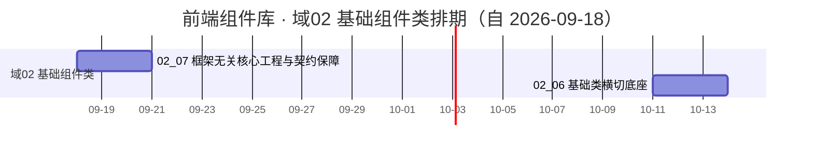

# 前端组件库计划

> BMS 基础管理系统 · 阶段四（前端组件库 / M4 组件库可用）排期计划：域 02 基础组件类 7 项 / 146h（已完成 5 项 / 剩余 2 项），其余需求域随任务基线补排

[文档首页](../../../文档首页.md) › 前端组件库计划　|　[任务基线 →](../任务/02_基础组件类/02_基础组件类.md)　[需求基线 →](../需求/00_需求_前端组件库.md)

## 1. 计划说明 

- **排期对象**：阶段四 40 条需求；**本次已建任务基线者为需求域 02 基础组件类**（[02 基础组件类](../任务/02_基础组件类/02_基础组件类.md)，7 个子任务 · 含 4 个嵌套子任务 · 146h，待实施）；域 03 ~ 10 随各自任务基线建立后补排（需求见[前端组件库需求总览](../需求/00_需求_前端组件库.md)）。
- **执行序（基座先行 + 链上逐级）**：`02_07 框架无关核心工程与契约保障`（工程脚手架与核心护栏先行）→ `02_01 总基类与固定三段` → `02_05 体系机制` → `02_02 组件根` → `02_03 能力基类族` → `02_04 组件基类族` → `02_06 基础类横切底座`；`02_07` 的契约用例工厂与清单对账护栏随 `02_03` / `02_04` 就位收口。
- **波次与依赖实现窗口**（自需求迁入）：**地基波 19 条**在阶段四窗口内闭环——`02_*`（7）、`03_*`（5）、`04-1`、`05-1`、`06-1` / `07-1` / `08-1`（占位版）、`10-1` / `10-2`；**依赖实现波 21 条**先交付占位版、真实实现随对应阶段——`06-2` / `06-3`、`07-2`、`08-2` / `08-3` 无后端强依赖（阶段四内推进）；`06-4` 验证码 ← 阶段六（认证与安全）；`06-5` 组织选择 / `08-4` 权限配置 ← 阶段七（RBAC）；`06-6` 字典 / `06-7` 文件上传 / `07-3` 文件预览与审计差异 / `08-5` 导入导出 / `08-6` 表单设计器与渲染器 / `08-7` 国际化文案编辑器 ← 阶段八（通用能力）；`07-4` 通知与消息 ← 阶段八 + 十（实时推送）；`07-5` 数据呈现 ← 阶段八后 ~ 十五；`07-6` 图表卡 / `08-9` 报表与大屏设计器 ← 阶段十六（报表 BI）；`07-7` 全局搜索 ← 阶段十八（全文检索）；`08-8` 审批流与流程建模 ← 阶段九（工作流引擎）；`08-10` AI 助手 ← 阶段十九（AI 能力）。
- **对齐口径**：域 02 按后端已跑通的基类体系做法落地（极简根系 / 能力域基类只做声明 / 占位三件 / 异步资源统一登记与逆序释放 / 插件中间层双轨登记 + 实例缓存 + 契约版本 / 提供者组合轨 / 错误码段位 / 逐基类 + contracts + crosscut 测试分层），任务参考只引文档（《[后端基类清单](../../../后端基类清单.md)》《[架构设计 · 后端基础类体系](../../../设计/架构设计/04_架构设计_后端基础类体系.md)》《[后端开发规范](../../../规范/后端开发规范.md)》）。
- **排期口径**：自 2026-09-18 起串行排期（单人兼职）；按 8h/日折算，2026-10-01 ~ 2026-10-07（国庆）不计入。
- **工时**：域 02 合计 146h（已完成 98h / 剩余 48h，其中 `02_07` 24h 为部分完成）；阶段四合计随其余域任务基线补建后累计。
- **里程碑锚点**：M4 = **组件库可用**（《总体项目规划》「里程碑」节），门禁见[需求总览 · M4 验收门禁](../需求/00_需求_前端组件库.md#accept)与本文第 5 节。
- **负责人**：minjian（兼职，单人）。

## 2. 已完成任务（2026-09-18） 

| 编号 | 任务 | 工时（重估） | 完成日期 | 任务文件 | 偏差与遗留 |
| --- | --- | --- | --- | --- | --- |
| 02_01 | 总基类与固定三段 | 8h | 2026-09-18 | [02_01](../任务/02_基础组件类/02_基础组件类_01_总基类与固定三段/02_基础组件类_01_总基类与固定三段.md) | 无（三段就位：`BaseObject` / `BaseCapability` / `BasePluggable`；遗留见实施记录 §6） |
| 02_05 | 体系机制 | 20h | 2026-09-18 | [02_05](../任务/02_基础组件类/02_基础组件类_05_体系机制/02_基础组件类_05_体系机制.md) | 无（注册表 / 工厂 / 资源 / 占位 / 错误 / 契约基类；`BaseEntity` 乐观锁字段改名 `recordVersion` 见实施记录 §4） |
| 02_02 | 组件根 | 8h | 2026-09-18 | [02_02](../任务/02_基础组件类/02_基础组件类_02_组件根/02_基础组件类_02_组件根.md) | 无（令牌属性协议 / attrs 透传 / 生命周期多监听 / 机制装配点） |
| 02_03 | 能力基类族 | 40h | 2026-09-18 | [02_03](../任务/02_基础组件类/02_基础组件类_03_能力基类族/02_基础组件类_03_能力基类族.md) | 无（27 个能力基类分三批 + manifest 依赖登记与校验；`BaseOptionSource` / `BaseFormMeta` 数据版本字段改名 `dataVersion` 见实施记录 §4） |
| 02_04 | 组件基类族 | 22h | 2026-09-18 | [02_04](../任务/02_基础组件类/02_基础组件类_04_组件基类族/02_基础组件类_04_组件基类族.md) | 无（16 个组件基类；`BaseTable` 页长字段改名 `pageSize` 避根字段 `size`；`BaseChart` 本期不建类） |

## 3. 剩余任务排期（自 2026-09-18） 

| 编号 | 任务 | 工时 | 依赖 | 排期窗口 | 备注 | 偏差与遗留 |
| --- | --- | --- | --- | --- | --- | --- |
| 02_07 | 框架无关核心工程与契约保障 | 24h | — | 2026-09-18 ~ 2026-09-20 | 本域首务；护栏与契约用例工厂随 02_03 / 02_04 收口 | 无 |
| 02_06 | 基础类横切底座 | 24h | 02_01/02_03/02_05 | 2026-10-11 ~ 2026-10-13 | 含 4 嵌套（请求 / 权限 / 格式化 / 令牌） | 无 |

## 4. 排期甘特图 

> 甘特为串行保守基线；嵌套子任务并入其直属父任务行（见《[计划文档规范](../../../规范/计划文档规范.md)》「嵌套子任务」节）。

## 5. M4 验收门禁（域 02 贡献路径） 

M4 门禁定义与逐项核对见[需求总览 · M4 验收门禁](../需求/00_需求_前端组件库.md#accept)；本域（基础组件类）的贡献路径：

| 验收点 | 对应任务 | 达成路径 |
| --- | --- | --- |
| 基类体系可用 | 02_01 ~ 02_07 | 固定前三段 / 组件根 / 能力基类族 / 组件基类族 / 体系机制就位，基础类横切底座可用，核心框架无关护栏与清单对账可查 |
| 组件单测通过（链上契约） | 02_01 ~ 02_07 | Vitest 覆盖三段 / 组件根 / 能力基类 / 组件基类 / 机制 / 请求 / 权限 / 格式化 / 令牌契约 |
| 地基波组件可用 | 域 03 ~ 05、10 | **不在本域**：布局 / 容器 / 基础控件 / 微前端骨架，随对应域任务基线补排 |
| 微前端骨架就位 | 域 10 | **不在本域**：宿主薄壳与模块契约，随域 10 任务基线补排 |
| 原型一致 | 域 03 ~ 08 | **不在本域**：组件语义与视觉对照《组件设计》各节点原型，随对应域任务实现 |

## 6. 风险与对策 

| 风险 | 影响 | 对策 |
| --- | --- | --- |
| 能力基类族 / 组件基类族体量大（合计 62h） | 域 02 滑期，阻塞域 03+ | 按《前端基类清单》逐链推进、小步提交；先落公共段与占位，再补横切契约；必要时拆嵌套子任务 |
| 契约用例工厂与清单对账护栏滞后 | 「同接口多实现」保障不足、登记漂移 | 护栏项随 02_03 / 02_04 就位同步收口；对账脚本纳入 CI 门禁 |
| 基类身份 / 继承关系与《前端基类清单》口径漂移 | 返工（本体系已有三次口径修正教训） | 新增 / 调整基类一律「候选 → 设计节点 → 评审 → 清单登记 → 代码登记 + 契约用例」；以《前端基类清单》为唯一权威 |
| 设计令牌与渲染实现主题映射需联调 | 视觉不一致 / 硬编码残留 | 令牌先登记后使用；属性协议选择器与组件根联动；硬编码色值护栏拦截 |
| 单人兼职投入不稳 | M4 延期 | 串行保守排期；工程脚手架与固定三段先行保底，基类族与横切底座可顺延 |

> 本文档依《[文档生成规范](../../../规范/文档生成规范.md)》编写
