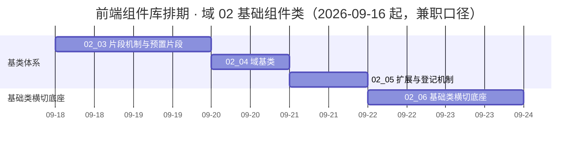

# 前端组件库计划

> BMS 基础管理系统 · 阶段四（前端组件库 / M4 组件库可用）排期计划：已完成 2 项，剩余 4 项（需求域 02 基础组件类；其余域随任务基线建立后补排）

[文档首页](../../../文档首页.md) › 前端组件库计划　|　[任务基线 →](../任务/02_基础组件类/02_基础组件类.md)　[需求基线 →](../需求/00_需求_前端组件库.md)

## 1. 计划说明 

- **排期对象**：阶段四需求基线 39 条中**已建任务基线的需求域 02（基础组件类，需求 02-1 ~ 02-6）**——1 个域父任务 + 6 个子任务（其中子任务 03、06 含嵌套子任务，共 11 份任务文档）；其余域（03 ~ 10）随其任务基线建立后补排。
- **波次口径**：本计划属阶段四**地基波首段**（基类体系与基础类横切底座先行），是后续全部组件任务与前端页面开发的前置；依赖回补波（21 条需求）先交占位版、真实实现随对应阶段回补。
- **顺序口径**：根系 → 组件根 → 片段机制与预置片段 → 域基类 → 扩展与登记机制 → 基础类横切底座；**每项只依赖排期在其之前的任务**。
- **排期口径**：自 2026-09-16 起至 2026-09-23（8 个日历日，兼职口径）；详细设计随任务启动逐个补建（`任务/…/设计/`），先设计后编码。
- **工时**：已完成 18h；剩余 70h（域 02 四项）；阶段合计 **88**h（域 02 部分；阶段四合计 317h 口径见《[架构设计 · 前端组件体系](../../../设计/架构设计/05_架构设计_前端组件体系.md)》「阶段落地（地基波 + 回补）」节，其余域随补排累加）。
- **里程碑锚点**：M4 = **组件库可用**（《[总体项目规划](../../../规划/总体项目规划.md)》「里程碑」节）；本计划只覆盖 M4 中的域 02 部分，门禁见第 5 节。
- **负责人**：minjian（兼职，单人）。

## 2. 已完成任务（2026-09-16） 

| 编号 | 任务 | 工时（重估） | 完成日期 | 任务文件 | 偏差与遗留 |
| --- | --- | --- | --- | --- | --- |
| 02_01 | 根系基类 | 6h | 2026-09-16 | [02_01](../任务/02_基础组件类/02_基础组件类_01_根系基类/02_基础组件类_01_根系基类.md) | 偏差：根系落点三处口径不一致（按《组件设计》节点落地，回写前端基类清单 §7 / 架构 08 §8）；遗留：请求封装完整能力（归 `02_06`）、其余 7 个机制基类文件口径（归 `02_02` / `02_03`）、《概要设计 · 系统参数》「前端配置」节上游待补（归阶段六 / 八）；开放项（`dispose()` 后是否静默、`getConfig` 点分键）不立归口 |
| 02_02 | 组件根基类 | 12h | 2026-09-16（提前一日） | [02_02](../任务/02_基础组件类/02_基础组件类_02_组件根基类/02_基础组件类_02_组件根基类.md) | 偏差：组合式命名与《前端开发规范》§3.1 不一致（统一 `useXxxBase`，四处文档回写）、`BaseError` 继承口径（改 `extends Error` + 挂接机制层）、令牌落点超本任务边界（按拍板顺带交付最小令牌文件）；遗留：基础令牌（color/font/space/radius）、错误码段位与命名口径、架构 08 登记、护栏升级评估（均归 `02_05`）；订阅真实来源 → 阶段五；四态与重试 → `02_03` / `02_06` |

## 3. 剩余任务排期（自 2026-09-16） 

> 表内按**执行顺序**排列；每项的依赖均排在它之前，可顺序推进。嵌套子任务不单列计划行（并入其直属父任务统计）。

| 编号 | 任务 | 工时 | 依赖 | 排期窗口 | 备注 | 偏差与遗留 |
| --- | --- | --- | --- | --- | --- | --- |
| 02_03 | 片段机制与预置片段 | 40h | 02_02 | 2026-09-18 ~ 2026-09-19 | 片段机制与注册表基类（`02_03_01` 10h）+ 预置 31 片段（`02_03_02` 30h），嵌套并入本行统计 | 无 |
| 02_04 | 域基类 | 11h | 02_03 | 2026-09-20 | `BaseInput` / `BaseDisplay` / `BaseTree` / `BaseEditor`；`BaseChart` 随 `07_06` 演练新增 | 无 |
| 02_05 | 扩展与登记机制 | 4h | 02_01 ~ 02_04 | 2026-09-21 | 候选 → 设计节点 → 评审 → 清单登记；继承 / 依赖方向 / 清单对账护栏 | 无 |
| 02_06 | 基础类横切底座 | 15h | 02_01、02_03 | 2026-09-22 ~ 2026-09-23 | 请求封装（`02_06_01` 8h）/ 权限指令（`02_06_02` 3h）/ 格式化工具（`02_06_03` 4h），嵌套并入本行统计 | 无 |

剩余合计 **70h**（域 02 四项）。

### 3.1 波次与后续域口径 

| # | 事项 | 归口 | 处理动作 |
| --- | --- | --- | --- |
| 1 | 其余域（03 ~ 10）任务与计划补排 | 本计划 §1 / §3 与阶段四需求基线 | 随各域任务基线建立后补排（地基波其余子任务与依赖回补波占位条），补排后回写本计划与[README](../README.md) |
| 2 | 依赖回补波（21 条需求）占位版与真实实现 | 各域需求「完成标准」 | 占位版随地基波交付（不发请求 + 空态 / 禁用态 / 降级 + 占位契约测试）；真实实现随对应阶段回补，回补窗口逐条写在需求内 |
| 3 | 组件原型一致性验收（原型即基准） | 各子任务完成标准 | 与《组件设计》各节点可交互原型逐项对齐 |
| 4 | 详细设计随任务逐个补建 | 各子任务目录 `设计/` | 先设计后编码；按前序任务完成情况调整口径 |
| 5 | 任务与计划的留痕 | 子任务目录 `实施/`、`测试/` | 任务完成时生成实施记录；有自动化 / 冒烟测试的生成测试记录（用例含 Kiwi 编号） |
| 6 | 上游待补：《概要设计 · 系统参数》「前端配置」节（前端可读配置 / 环境来源） | 上游文档（阶段六 / 八） | 出处 `02_01`；当前按「构建期 `import.meta.env` + 运行期 `configureFrontendBase()` 可注入」落地，不阻塞后续任务 |
| 7 | 请求封装完整能力（统一错误提示 / token 注入 / 401 静默刷新）与权限指令 | `02_06`（基础类横切底座） | 出处 `02_01`；根系出口、`BaseApi` 继承与 `request()` 上报已交付，完整能力归 `02_06`（任务文档已标前置契约） |
| 8 | 其余 7 个机制基类文件口径（组件根 / 片段机制 / 占位 / 异步资源 / 注册表 / 错误 / 订阅） | `02_02` / `02_03` | 出处 `02_01`；按各自《组件设计》节点 §2「位置」列落地并登记（任务文档已标前置契约） |
| 9 | 根系的后续消费方（域 03 ~ 08 的组件与任务） | 各自任务（随任务基线建立补排） | 出处 `02_01`；建任务时补「前置契约（已交付）：`src/base/` 根系三件」标注 |
| 10 | `--color-*` / `--font-*` / `--space-*` / `--radius-*` 基础令牌未落（本次只落 size / density 与属性协议） | `02_05`（登记） | 出处 `02_02`；随布局域令牌任务落地后 `src/styles/tokens.scss` 改为引用基础令牌 |
| 11 | 错误码段位对齐（`10001` 未实现 / `30001` 权限）与命名口径（i18n `error.{code}`、事件名点分小写） | `02_05`（上游登记） | 出处 `02_02`；与《后端基类清单》《命名规范》统一登记 |
| 12 | 《架构设计 · 前端架构》§8 登记表与机制未挂接「是否升级构建期硬失败」评估 | `02_05`（护栏） | 出处 `02_02`；与继承 / 依赖 / 清单对账护栏一并处理 |
| 13 | 组件根与四机制基类的消费方（`02_03` ~ `02_06` 已标前置契约；域 03 ~ 08 组件任务待建后回引） | 各自任务 | 出处 `02_02`；建任务时补「前置契约（已交付）：组件根 + 四机制基类」 |

## 4. 排期甘特图 

## 5. 阶段四验收门禁（M4） 

门禁定义与逐项核对见[需求总览 · M4 验收门禁](../需求/00_需求_前端组件库.md#accept)（5 个验收点）；本计划只覆盖已排域的达成路径：

| 验收点 | 对应任务 | 达成路径 |
| --- | --- | --- |
| 基础类体系可用 | `02_03` ~ `02_06`（`02_01` / `02_02` 已完成） | 根系 / 组件根 / 片段机制与预置 31 片段 / 域基类按角色落地于 `src/base/` 与 `src/components/base/<能力域>/`；扩展登记机制与基础类横切底座可用 |
| 地基波组件可用 | 待后续域任务补排（域 03 ~ 05、07、10） | 弹窗表单、异常与空状态、通用容器、结构布局、侧边菜单、框架与容器、八基础控件 |
| 组件单测通过 | `02_03` ~ `02_06`（`02_01` / `02_02` 已完成；其余待补排） | Vitest + `@vue/test-utils` 覆盖基类与片段契约；覆盖率并入前端门禁（整体 ≥ 70%） |
| 微前端骨架就位 | 待后续域任务补排（域 10） | 宿主薄壳与片段契约；注册表基座最小实现复用本域 `02_03` 的注册表基类 |
| 原型一致 | `02_03` ~ `02_06`（`02_01` / `02_02` 已完成；其余待补排） | 组件交互与视觉与《组件设计》各节点可交互原型一致（对齐 Element Plus 行为） |

## 6. 风险与对策 

| 风险 | 影响 | 对策 |
| --- | --- | --- |
| 能力片段划分随实施调整（新片段 / 边界变化） | 返工与接口漂移 | 片段按「候选 → 设计节点 → 评审 → 清单登记」流程新增；机制先行（`02_03`）后再开组件任务 |
| 预置 31 片段工作量大且集中（30h） | 排期挤压 | 先落片段机制与注册表基类（`02_03_01`），片段分批交付；占位语义纳入契约测试 |
| 基础类横切底座被后续域依赖 | 后续域无法开工 | 本域排在阶段四首段（2026-09-16 ~ 09-23），请求封装与权限指令先行 |
| 单人兼职投入不稳 | M4 延期 | 串行保守排期 + 缓冲；机制先行保底，片段可分批交付 |

> 本文档依《[文档生成规范](../../../规范/文档生成规范.md)》编写
