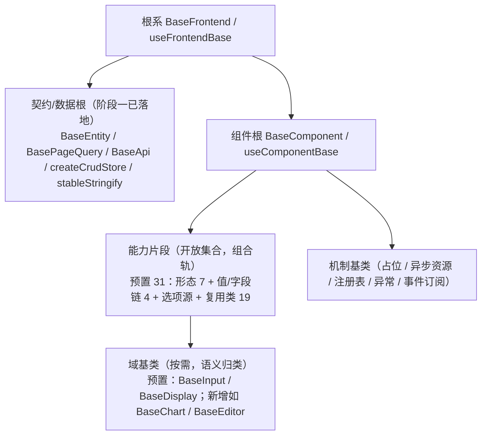

# 基础组件类需求

> BMS 基础管理系统 · 阶段四（前端组件库 / M4 组件库可用）· 需求域一：前端基类体系（开放式，5 条）

[文档首页](../../../文档首页.md) › [前端组件库总览](00_需求_前端组件库.md) › 基础组件类　|　[← 00 总览](00_需求_前端组件库.md)　[02 布局组件类 →](02_需求_布局组件类.md)

## 1. 域说明 

本域对应阶段四「基础组件类」（WBS 01，组件设计 `02_基础组件类/`），是全组件库的根：**公共字段/方法只在对应基类或能力片段维护，任何组件与模块不得重复实现**。体系**对齐后端基类体系**，按**角色 + 开放扩展**组织（不做固定层号 / 数量枚举）：

| 角色 | 需求 | 内容 | 本阶段口径 |
| --- | --- | --- | --- |
| 根系 | `01-1` | `BaseFrontend` / `useFrontendBase` | **落地** |
| 契约/数据根 | —（复用） | `BaseEntity` / `BasePageQuery` / `BaseApi` / `createCrudStore` / `stableStringify` | 阶段一已落地，**复用不重复建设** |
| 组件根 | `01-2` | `BaseComponent` / `useComponentBase` | **落地** |
| 机制基类 | （并入 `01-2` / `01-3`） | `BasePlaceholder` + `usePlaceholder`（占位）、`useAsyncResource`（异步资源）、`BaseRegistry` + `BaseRegistryItem`（注册表 / 注册项）、`BaseError`（异常）、`useSubscription`（事件订阅）——对齐后端基类体系（占位 / 生命周期 / 注册表 / 异常 / 事件域） | **落地（机制基类）** |
| 能力片段 | `01-3` | 片段机制 `useCapabilityBase` + 预置 31 片段（开放集合） | **落地（预置）**；新增随需 |
| 域基类 | `01-4` | 预置 `BaseInput` / `BaseDisplay`；新增域按需 | **落地（预置）**；新增随需 |
| 扩展与登记 | `01-5` | 候选 → 评审 → 登记机制；组合轨默认；兼容性；双端同款 | **落地** |

**命名规则（强制）**：基类一律 `Base` 打头（`BaseFrontend` / `BaseComponent` / `BaseValue` / `BaseField` / `BaseInput` / `BaseDisplay`）；非 `Base` 打头为具体组件（命名自由，如 `UserForm` / `DeptTree`）；能力片段统一 `useXxx`（`useInteractive` / `useValue` / `useField` 等）；组合式辅助统一 `useXxxBase` / `useXxx`。详见《[命名规范](../../../规范/命名规范.md)》「前端命名」节。

**依赖方向（强制）**：只准上层依赖下层（具体组件 → 域基类 / 能力片段 → 组件根 → 根系）；基类不得依赖具体组件；片段之间依赖须单向并登记；**层次由依赖关系决定，不设层数上限**。Vue 3 无类多继承，统一以**组合式函数 + 组件包装**实现：**组件默认组合多个能力片段（组合轨）**，需要语义归类时再派生域基类（可选）。

**依据**：《项目规划说明》「前端页面清单与菜单机制」节、《前端开发规范》「前端基类体系（开放式，强制）」节、《架构设计 · 前端组件体系》「前端基类体系（开放式）」节、《前端基类清单》、《组件设计》`02_基础组件类` 各节点。

**占位口径**：片段 / 域基类对依赖后端能力的行为先以**占位语义**落地（不请求、空结果 / 降级 / 禁用态）并纳入契约测试；真实能力随对应阶段回补（对齐后端 Null 占位模式）。
**用例口径**：本域用例入 Kiwi TCMS，自动化用例标注用例编号（随任务实施登记）。
**目标**：根系 / 组件根 / 能力片段 / 域基类按角色落地于 `frontend/src/base/` 与 `frontend/src/components/base/<能力域>/`；组合轨默认与依赖方向符合规范；契约/数据根复用阶段一成果；扩展登记机制可用（新增片段 / 域基类不改根）。

## 2. 需求 01-1：根系基类 BaseFrontend 

优先级：2（高）　|　状态：未开始　|　完成日期：—

**角色关系**：`BaseFrontend` / `useFrontendBase`（无父层）——一切前端基类之根；`契约/数据根 → 根系`、`组件根 → 根系`。

**背景与动机**：组件库承载上百个组件与海量字段，若每个组件各写一套命名空间、日志、错误上报、配置读取、i18n、生命周期钩子，行为会发散。必须先把「所有基类之根」立起来，后续基类与片段才有统一的继承起点。

**内容**（《前端开发规范》「前端基类体系」节、《组件设计》`01_机制基类/01_组件设计_根系基类`）：

1. 根系 `BaseFrontend`（类）+ `useFrontendBase`（组合式）：通用字段（命名空间、版本/标识）与通用方法（日志、错误上报、配置/环境读取、i18n 取词、生命周期钩子）
2. 约束：不含 UI 或业务语义；只放「所有基类共有」的横切能力；契约/数据根与组件根的特有逻辑不得上提
3. 落地 `src/base/base.ts`（规划）；组合式与类能力等价（Vue 以组合式模拟继承）
4. 登记：同步《前端基类清单》根系行与《组件设计》对应节点

**完成标准**：根系类与组合式就位并被契约/数据根、组件根引用；通用字段/方法契约符合组件设计节点；组件单测覆盖（命名空间、日志、错误上报去重、配置读取、i18n 委托、生命周期钩子）；文档登记同步。

**参考文档**：《架构设计 · 前端组件体系》「前端基类体系」节；《组件设计》`02_基础组件类/01_机制基类/01_组件设计_根系基类`

## 3. 需求 01-2：组件根基类 BaseComponent 

优先级：2（高）　|　状态：未开始　|　完成日期：—

**角色关系**：`BaseComponent` / `useComponentBase` → 根系；一切 UI 组件基类 / 能力片段的公共父。

**背景与动机**：所有 UI 组件共享 attrs 透传、根元素约定、尺寸/密度/主题令牌、i18n、可访问性、loading/disabled…若组件各自实现，样式与行为必发散；组件根把这一类横切能力收敛一处。

**内容**（《组件设计》`01_机制基类/02_组件设计_组件根基类`）：

1. `BaseComponent`（类）+ `useComponentBase`（组合式）：attrs 透传（`id` / `class` / `style` / `data-*`）与根元素约定、尺寸 `size` / 密度 `density` / 主题令牌消费、i18n 取词与样式命名空间、生命周期埋点与错误上报、可访问性（aria / 键盘焦点）与 `ref` / `expose` 规范、通用 `loading` / `disabled` / 显隐态
2. 机制基类组合入口（对齐后端基类体系）：占位 `BasePlaceholder` / `usePlaceholder`（占位标记 + `describe` + 空态·禁用·降级语义）、异步资源 `useAsyncResource`（订阅 / 定时器 / AbortController 自动释放）、异常基座 `BaseError`（错误码 + 提示映射 + 上报钩子）、事件订阅 `useSubscription`（解耦来源，便于占位与替换）
3. 组合机制：提供片段组合入口（片段声明 / 依赖登记 / 开发告警的公共约定由片段机制承载）；机制基类由组件根统一挂接
4. 约束：不含具体形态与业务语义；组件只依赖组件根，不直接依赖具体组件
5. 落地 `src/base/component.ts` 与机制基类文件（`placeholder.ts` / `resource.ts` / `error.ts` / `subscription.ts`，规划）；登记清单与组件设计节点

**完成标准**：组件根基类与组合式就位；能力片段与具体组件可组合 / 派生；attrs 透传与合并（`disabled` / `loading`）、尺寸密度令牌、可访问性契约符合节点；组件单测覆盖；文档登记同步。

**参考文档**：《架构设计 · 前端组件体系》「前端基类体系」节；《组件设计》`02_基础组件类/01_机制基类/02_组件设计_组件根基类`

## 4. 需求 01-3：能力片段机制与预置片段 

优先级：2（高）　|　状态：未开始　|　完成日期：—

**角色关系**：片段机制 `useCapabilityBase` + 预置 31 片段 + 注册表基类——组合轨核心；组件按需组合多个片段（正交、可复用）。

**背景与动机**：形态与能力是正交的：一个组件可能同时具备「输入形态 + 字段语义 + 权限」；固定层级无法表达组合，且新类型（图表 / 编辑器 / 画布…）不应被既有枚举挡在门外。因此能力以**片段**承载，**开放集合、新增即登记**。

**内容**（《前端基类清单》「能力片段」节、《组件设计》「能力片段」组各篇）：

1. 片段机制 `useCapabilityBase`：片段标识 / 依赖声明 / 单向依赖校验 / 开发态告警（落地 `src/base/capability.ts`）
2. 预置片段（31：形态 7 + 值 / 字段链 4 + 选项源 1 + 复用类 19）：
   - `useInteractive`（可点击 / disabled / 焦点 / 键盘触发）
   - `useInputControl`（输入形态：值绑定、前后缀插槽、清空、只读，不含字段语义）
   - `useDisplayControl`（展示形态：密度、令牌、空值、省略）
   - `useContainer`（插槽 / 折叠 / 分栏 / 区域）
   - `useFormContainer`（表单 / 分区 / 校验汇总）
   - `useMedia`（图片 / 音视频 / 文件预览）
   - `useLayout`（栅格 / 断点、间距 / 对齐令牌、根元素与透传、显隐）
   - `useValue`（值语义：值归一、格式化调度、三态、`change`）
   - `useFieldShell`（字段壳：label / 必填 / 帮助 / 错误 / 栅格跨度 / 只读回显）
   - `useFieldPerm`（字段权限：`visible` / `editable` / `required` / 脱敏）
   - `useField`（字段编排：组合值语义 + 字段壳 + 字段权限 + 校验触发 + `fieldKey`）
   - `useOptionSource`（远程选项源：加载 / 缓存与版本比对 / 搜索 / 回显；字典 / 组织 / 枚举 / 树 / 级联共用，依赖后端能力占位降级）
   - 复用类（7）：`useUploadEngine`（上传引擎：分片/秒传/断点/进度/取消）、`useAsyncTask`（异步任务：提交/轮询进度/取消/结果下载）、`useTabs`（页签状态）、`usePersistedState`（偏好持久化：本地 + 远端同步）、`useEditorKernel`（编辑器内核：懒加载/销毁/内容协议）、`useTreeData`（树数据；归 `BaseTree` 域）、`useUserDisplay`（用户/组织展示）、`useDynamicRoutes`（动态路由注册）、`useFormMeta`（表单元数据）、`usePresignedUrl`（预签名）、`useDragDrop`（拖拽基座）、`useDesignToken`（设计令牌）、`useFormPage`（表单页组合）、`useLocale`（语言上下文）、`useAccess`（权限上下文）、`useColumnConfig`（列配置）、`useQueryScheme`（查询方案）、`useWatermark`（水印）、`useFragmentContext`（片段上下文）
3. 注册表基类：`BaseRegistry` + `BaseRegistryItem`（注册项 `key` + `describe`；唯一性 / 未命中 / 查询；对齐后端 `BaseProviderRegistry` / `BaseProvider`），供路由·菜单、组件、字段渲染器、图标、工作台卡片注册复用（09-2 落地）
4. 开放扩展：新增能力 = 新增片段（`src/components/base/<能力域>/index.ts` + 登记），不改根系 / 组件根，不扩充封闭枚举
5. 组合约束：片段正交可组合（如展示域 = 展示形态 + 受控值）；片段依赖单向登记

**完成标准**：片段机制与 11 个预置片段就位；组件可组合多个片段且行为符合各片段设计节点；新增片段流程可验证（不触碰根系 / 组件根）；组件单测覆盖片段契约（受控值 / 三态 / 权限脱敏 / 校验触发等）；文档登记同步。

**参考文档**：《前端基类清单》「能力片段」节；《组件设计》`02_基础组件类/02_能力片段/` 各节点

## 5. 需求 01-4：域基类与新增规则 

优先级：2（高）　|　状态：未开始　|　完成日期：—

**角色关系**：域基类（按需，语义归类）——预置 `BaseInput`（输入域，组合输入形态 + 字段链）/ `BaseDisplay`（展示域，组合展示形态 + 受控值）；后续如 `BaseChart` / `BaseEditor` 按需新增。

**背景与动机**：域基类用于归一并细化「同类组件」的语义（如输入域细化与展示域细化），是**可选**的语义层；组件组合片段即可工作，域基类只是让同类组件共享更贴近域的契约，且**新增域不受既有枚举限制**。

**内容**（《组件设计》「域基类」组各篇 + 新增规则）：

1. `BaseInput`（输入域）：组合 `useInputControl` + `useField`，统一受控绑定、`modelValue` / `update:modelValue` / `change` / `focus` / `blur`、`disabled` / `readonly` / `size` / `placeholder` / `clearable`、插槽与透传；供基础控件类与字段类使用
2. `BaseDisplay`（展示域）：组合 `useDisplayControl` + `useValue`，统一只读回显、值格式化调度、空值占位、密度；供展示类与字段只读回显使用
3. 新增域规则：新域基类按需新增——示例：`BaseTree`（树域：组合 `useTreeData`，树选择 / 组织树 / 权限树共用）、`BaseChart`（图表域，随图表卡）、`BaseEditor`（编辑器域：组合 `useEditorKernel`）等；只做语义归类与最终细化，**不设域枚举上限**，新增走登记流程
4. 约束：域基类不得依赖具体组件；被组件组合 / 派生而不反向依赖

**完成标准**：输入域 / 展示域基类就位并被基础控件类 / 字段类 / 展示类使用；新增域演练（文档级）验证规则可行；组件单测覆盖域契约；文档登记同步。

**参考文档**：《前端基类清单》「域基类」节；《组件设计》`02_基础组件类/03_域基类/` 各节点

## 6. 需求 01-5：扩展与登记机制 

优先级：2（高）　|　状态：未开始　|　完成日期：—

**角色关系**：机制性需求——约束「新增片段 / 域基类 / 机制基类」的流程与兼容口径，保证体系**可无限扩展且不失控**（对齐后端基类候选与登记机制）。

**背景与动机**：开放扩展若无登记与评审，会退化为「每个组件各写一套」；后端基类体系通过「候选 → 评审 → 落地 → 基类清单登记」保持秩序。前端需要同一套机制。

**内容**：

1. 扩展流程（强制）：候选 → 设计节点（组件设计，契约与原型）→ 评审确认 →《[前端基类清单](../../../前端基类清单.md)》登记 → 同步《架构设计 · 前端组件体系》与《前端开发规范》
2. 组合轨默认：组件以组合片段为主；派生域基类仅作语义归类（可选）；机制变更（根系 / 组件根 / 片段机制）须评估全链影响
3. 兼容性口径：新增片段 / 基类为兼容变更；调整既有片段契约（行为 / 参数 / 事件）须评估使用方并升主版本标注
4. 双端同款基线：frontend 与 frontend-mobile 同步扩展，不得只在单端加基类能力
5. 目录与命名：机制层 `src/base/`（`base.ts` / `component.ts` / `capability.ts`）、能力域 `src/components/base/<能力域>/index.ts`；基类 `BaseXxx`、片段 `useXxx` 遵循《命名规范》
6. 护栏：禁止组件 / 模块重复实现基类或片段已提供的公共能力；禁止基类依赖具体组件；禁止片段反向依赖

**完成标准**：扩展流程与兼容口径成文并被至少一次新增演练（文档级 + 单测目录约定）验证；《前端基类清单》《前端开发规范》《架构设计 · 前端组件体系》三者口径一致；后续新增片段 / 域基类按此执行。

**参考文档**：《前端基类清单》「扩展与演进」「维护约定」节；《前端开发规范》「扩展规则」节；《架构设计 · 前端组件体系》「前端基类体系」「渲染器与扩展点注册机制」节

> 本文档按《文档生成规范》编写 · 关键决策逐项确认
