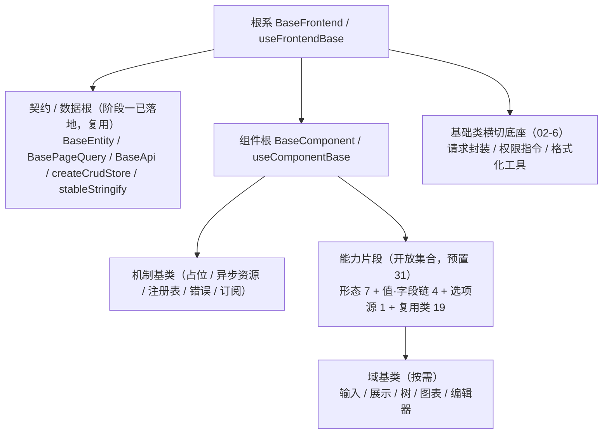

# 基础组件类需求

> BMS 基础管理系统 · 阶段四（前端组件库 / M4 组件库可用）· 需求域 02：开放式基类体系与基础类横切底座（6 条）

[文档首页](../../../文档首页.md) › [前端组件库总览](00_需求_前端组件库.md) › 基础组件类　|　[03 布局组件类 →](03_需求_布局组件类.md)

## 1. 域说明 

本域对应[《组件设计》](../../../设计/组件设计/01_组件设计_总览.md)「基础组件类」（`02_基础组件类/`，44 节点：机制基类 8 + 能力片段 31 + 域基类 5），是全组件库的根：**公共字段 / 方法只在对应基类或能力片段维护，任何组件与模块不得重复实现**。体系对齐后端基类体系，按**角色 + 开放扩展**组织（不做固定层号 / 数量枚举）：

| 需求 | 内容 | 本阶段口径 |
| --- | --- | --- |
| `02-1` | 根系 `BaseFrontend` / `useFrontendBase` | 落地 |
| `02-2` | 组件根 `BaseComponent` / `useComponentBase` + 机制基类（占位 / 异步资源 / 错误 / 订阅） | 落地 |
| `02-3` | 片段机制 `BaseCapability` / `useCapabilityBase` + 预置 31 片段 + 注册表基类 `BaseRegistry` / `BaseRegistryItem` | 落地（预置），新增随需 |
| `02-4` | 域基类（输入 / 展示 / 树 / 图表 / 编辑器）与新增规则 | 落地（预置），新增随需 |
| `02-5` | 扩展与登记机制（候选 → 设计节点 → 评审 → 清单登记） | 落地 |
| `02-6` | 基础类横切底座：请求封装 / 权限指令 / 格式化工具 | 落地 |

- **归属说明**：`02-6` 的契约节点属[《组件设计》](../../../设计/组件设计/01_组件设计_总览.md)「基础类」（`09_基础类/`，3 节点）；因其为全组件库横切底座，按执行顺序并入本域先行（编号 02-6），使弹窗抽屉表单、八基础控件、数据呈现等后继需求只依赖编号更小的条目。
- **命名规则（强制）**：基类（机制基类 / 域基类 / 片段组件包装）一律 `Base` 打头；能力片段统一 `useXxx`（不带 `Base` 后缀）；机制层组合式 `useXxxBase`；非 `Base` 打头为具体组件。详见《[命名规范](../../../规范/命名规范.md)》「前端命名」节与《[前端开发规范](../../../规范/前端开发规范.md)》「前端基类体系（开放式，强制）」节。
- **依赖方向（强制）**：只准上层依赖下层（具体组件 → 域基类 / 能力片段 → 组件根 → 根系）；基类不得依赖具体组件；片段之间依赖须单向并登记；层次由依赖关系决定，不设层数上限。Vue 3 无类多继承，实现统一以**组合式函数 + 组件包装**落地，**组合轨默认**，需要语义归类时再派生域基类。
- **契约 / 数据根复用**：`BaseEntity` / `BasePageQuery` / `BaseApi` / `createCrudStore` / `stableStringify` 已在**阶段一**落地，本阶段复用，不重复建设。
- **依据**：《[项目规划说明](../../../规划/项目规划说明.md)》「前端页面清单与菜单机制」节、《[总体项目规划](../../../规划/总体项目规划.md)》「阶段内容与完成标准」节（阶段四）、《[架构设计 · 前端组件体系](../../../设计/架构设计/05_架构设计_前端组件体系.md)》「前端基类体系（开放式，对齐后端基类体系）」「执行护栏（机器强制）」节、《[前端基类清单](../../../前端基类清单.md)》、《[前端开发规范](../../../规范/前端开发规范.md)》、《[组件设计 · 总览](../../../设计/组件设计/01_组件设计_总览.md)》。
- **用例口径**：本域用例入 Kiwi TCMS，自动化用例标注用例编号（随任务实施登记）。
- **目标**：根系 / 组件根 / 片段机制 / 能力片段 / 域基类按角色落地于 `frontend/src/base/` 与 `frontend/src/components/base/<能力域>/`；基础类横切底座可用；扩展登记机制可用（新增片段 / 域基类不改根）。

## 2. 需求 02-1：根系基类 

优先级：2（高）　|　状态：已完成　|　完成日期：2026-09-16

**背景与动机**：全站基类若无共同根系，命名空间、日志、错误上报、配置环境、i18n 与生命周期钩子会在每个基类与组件里各写一遍，改动无法一处生效；根系是「一切基类之根」，必须最先立住。

**内容**（《组件设计》基础组件类「01 根系基类」）：

1. `useFrontendBase`（机制层组合式，落 `src/base/base.ts`）：命名空间、日志、错误上报、配置与环境读取、i18n、生命周期钩子。
2. `BaseFrontend.vue`（可选组件包装）：以根系组合式装配，供需要统一根系行为的组件使用。
3. 派生约束：一切基类从根系派生；根系不依赖任何上层基类与具体组件，不承载业务语义。

**完成标准**：`useFrontendBase` / `BaseFrontend.vue` 就位；根系的通用字段与方法在后续基类 / 片段中不再重复实现（护栏用例可查）；组件单测覆盖根系契约；`vue-tsc`、ESLint、Vitest 全通过。

**参考文档**：《组件设计》[01_组件设计_根系基类](../../../设计/组件设计/02_基础组件类/01_机制基类/01_组件设计_根系基类/01_组件设计_根系基类.md)（含可交互原型）、《[前端开发规范](../../../规范/前端开发规范.md)》「前端基类体系（开放式，强制）」节、《[前端基类清单](../../../前端基类清单.md)》「根系与组件根」节

> 注：实现期要点——落点 `src/base/{BaseFrontend.ts,useFrontendBase.ts,BaseFrontend.vue}`（双端同款）；运行期配置 `resolveBuildConfig` / `configureFrontendBase` / `resetFrontendBaseConfig`（构建期 `VITE_APP_ENV` 与 `VITE_*` 归一为扁平键，运行期可注入覆盖）；日志与错误上报为统一出口 + 指纹去重限流（窗口 5000ms、`repeat` 计数）+ sink 可注入（默认 console；后端上报随阶段八 / 十三）；契约 / 数据根接根系（`BaseApi` 继承、`createCrudStore` 组合、`request()` 业务错误与 401 上报）。用例：Kiwi 698（frontend）/ 699（frontend-mobile），断言并入 Kiwi 21 / 22、25 / 26。遗留去向：请求封装完整能力 → `02_06`；其余 7 个机制基类文件口径 → `02_02` / `02_03`；《概要设计 · 系统参数》「前端配置」节 → 阶段六 / 八（计划 §3.1，第 6 行）；开放项（`dispose()` 后是否静默、`getConfig` 点分键）不立归口，按「新增片段 / 兼容变更」流程另开。

## 3. 需求 02-2：组件根基类 

优先级：2（高）　|　状态：已完成　|　完成日期：2026-09-16

**背景与动机**：所有 UI 组件共有 attrs 透传、尺寸 / 密度 / 主题令牌、i18n 与命名空间、生命周期埋点、可访问性、`loading` / `disabled` / `visible` 一组行为；这些若由各组件自实现，组件库的一致性无法保证，也会让后续每个组件任务都要重复一遍。

**内容**（《组件设计》基础组件类「02 组件根基类」「04 占位基类」「05 异步资源基类」「07 错误基类」「08 订阅基类」）：

1. `useComponentBase` / `BaseComponent.vue`：attrs 透传、尺寸与密度、主题令牌、i18n 与命名空间、生命周期埋点、可访问性与 `expose`、`loading` / `disabled` / `visible`。
2. 占位基类 `BasePlaceholder` + `usePlaceholderBase`：依赖后端能力未就绪时的占位语义（空态 / 降级 / 禁用态）。
3. 异步资源基类 `useAsyncResourceBase`：异步资源（订阅 / 定时器 / 请求 / 实例）的**登记、逆序释放、幂等释放与释放钩子**（对齐后端 `BaseAsyncResource` / `ResourceManager`）；**订阅句柄与请求取消（`AbortController`）登记后随组件卸载自动释放**。（「加载 / 成功 / 失败 / 空四态与重试」不属本基类——归异步任务片段 `useAsyncTask`（需求 `02-3`）与请求层（需求 `02-6`））
4. 错误基类 `BaseError`：错误分类、错误边界与上报。
5. 订阅基类 `useSubscriptionBase`：事件订阅与销毁（与后端事件域对齐）。

**完成标准**：组件根与四类机制基类就位并被后续组件 / 片段组合使用；占位语义成为依赖波组件的统一降级口径；组件单测覆盖组件根契约与机制基类分支；`vue-tsc`、ESLint、Vitest 全通过。

**参考文档**：《组件设计》[02_组件设计_组件根基类](../../../设计/组件设计/02_基础组件类/01_机制基类/02_组件设计_组件根基类/02_组件设计_组件根基类.md)、[04_组件设计_占位基类](../../../设计/组件设计/02_基础组件类/01_机制基类/04_组件设计_占位基类/04_组件设计_占位基类.md)、[05_组件设计_异步资源基类](../../../设计/组件设计/02_基础组件类/01_机制基类/05_组件设计_异步资源基类/05_组件设计_异步资源基类.md)、[07_组件设计_错误基类](../../../设计/组件设计/02_基础组件类/01_机制基类/07_组件设计_错误基类/07_组件设计_错误基类.md)、[08_组件设计_订阅基类](../../../设计/组件设计/02_基础组件类/01_机制基类/08_组件设计_订阅基类/08_组件设计_订阅基类.md)（均含可交互原型）

> 注：实现期要点——组件根落点 `src/base/{BaseComponent.ts,useComponentBase.ts,BaseComponent.vue}`（双端同款）；令牌属性协议 `data-size` / `data-density` / `data-test`（视觉由 `src/styles/tokens.scss` 属性选择器映射，双端 `main.ts` 导入）；`mechanisms` 装配点挂接机制基类并在组件根释放时联动取消订阅 / 释放资源；四机制基类落 `src/base/{placeholder.ts,resource.ts,error.ts,subscription.ts}`（组合式 `usePlaceholderBase` / `useAsyncResourceBase` / `useSubscriptionBase`；`BaseError extends Error` + 上报委托根系）。用例：Kiwi 700（组件根）/ 701（占位）/ 702（异步资源）/ 703（错误）/ 704（订阅），双端共用编号，断言集一致。遗留去向：基础令牌（color / font / space / radius）→ **已闭环（`03_06`，2026-09-16）**：五组基础令牌 + size/density 改引用 + EP·Vant 映射 + `useDesignToken` 未定义令牌告警（计划 §3.1 第 10 行）；错误码段位与命名规范口径、架构 08 登记、护栏升级评估 → `02_05`（**已闭环**：错误码段位对齐 `19001` / `10001` / `10003` / `10005` / `30001`，静态护栏与升级评估见需求 02-5）；订阅真实来源 → 阶段五。

## 4. 需求 02-3：片段机制与预置片段 

优先级：2（高）　|　状态：已完成　|　完成日期：2026-09-16

**背景与动机**：组件的横切能力（受控值、字段壳、权限、值格式化、选项源、上传、页签、偏好持久化等）若落在组件里，会随组件数量线性复制；能力片段是「正交可组合」的唯一落点，也是本组件库与后端基类体系同构的关键。

**内容**（《组件设计》基础组件类「03 片段机制」「06 注册表基类」与能力片段 31 节点）：

1. 片段机制 `BaseCapability` + `useCapabilityBase`：片段标识、依赖声明、单向依赖校验、开发态告警。
2. 预置 31 个能力片段（开放集合，可新增）：
   - 形态 7：`useInteractive`（交互）、`useInputControl`（输入形态）、`useDisplayControl`（展示形态）、`useContainer`（容器）、`useFormContainer`（表单容器）、`useMedia`（媒体）、`useLayout`（布局）
   - 值·字段链 4：`useValue`（受控值 / 格式化 / 三态）、`useField`（字段编排：壳 + 权限 + 校验）、`useFieldShell`（字段壳）、`useFieldPerm`（字段权限）
   - 选项源 1：`useOptionSource`
   - 复用类 19：`useUploadEngine`、`useAsyncTask`、`useTabs`、`usePersistedState`、`useEditorKernel`、`useTreeData`、`useUserDisplay`、`useDynamicRoutes`、`useFormMeta`、`usePresignedUrl`、`useDragDrop`、`useDesignToken`、`useFormPage`、`useLocale`、`useAccess`、`useColumnConfig`、`useQueryScheme`、`useWatermark`、`useFragmentContext`
3. 注册表基类 `BaseRegistry` + `BaseRegistryItem` + `useRegistryBase`（注册项 `key` + `describe`；唯一性拒重 / 未命中返回 `undefined` / 保序 / 只读快照；对齐后端同职责基类 `BaseProviderRegistry` / `BaseProvider`），供路由·菜单、组件、字段渲染器、图标、工作台卡片注册复用（域 10 微前端骨架承接最小实现落地）。
4. 组合约束：片段正交可组合（如展示域 = 展示形态 + 受控值）；片段依赖单向并登记；新增能力 = 新增片段，不改根系 / 组件根。

**完成标准**：片段机制与 31 个预置片段就位；组件可组合多个片段且行为符合各片段设计节点；新增片段流程可验证（不触碰根系 / 组件根）；组件单测覆盖片段契约（受控值 / 三态 / 权限脱敏 / 校验触发等）；文档登记同步。

**参考文档**：《组件设计》[03_组件设计_片段机制](../../../设计/组件设计/02_基础组件类/01_机制基类/03_组件设计_片段机制/03_组件设计_片段机制.md)、[06_组件设计_注册表基类](../../../设计/组件设计/02_基础组件类/01_机制基类/06_组件设计_注册表基类/06_组件设计_注册表基类.md)（含可交互原型）、《组件设计》`02_基础组件类/02_能力片段/` 下 31 个片段节点、《[前端基类清单](../../../前端基类清单.md)》「能力片段（开放集合，预置 31）」节

> 注：实现期要点——片段机制 `src/base/capability.ts`（`BaseCapability` + `useCapabilityBase`；已知片段表由片段层 `src/components/base/fragments.ts` 注入，开发态校验「依赖已登记 / 无循环 / key 合法」，`strict` 抛 `BaseError` 码 `10001`）；注册表基座 `src/base/provider.ts`（`BaseRegistry` + `BaseRegistryItem` + `useRegistryBase`；唯一性拒重码 `10003`、未命中返回 `undefined`、保序、冻结快照、作用域自动注销；数量取 `count`）；预置 31 片段落 `src/components/base/<能力域>/useXxx.ts`（一域一目录 + 域内 `index.ts` + 总出口 `index.ts`），`key` / `depends` 权威表见《前端基类清单》§5（`option-source` → `value`；`field` → `value` / `field-shell` / `field-perm`；`media` / `upload-engine` → `presigned-url`；`layout` → `design-token`；`column-config` / `query-scheme` → `persisted-state`）。占位先行：选项源 / 上传 / 异步任务 / 预签名 / 用户展示 / 表单元数据 / 偏好远端 / 权限码 / 动态路由菜单源在后端就绪前按占位语义运行（不请求），占位契约纳入门禁。用例：Kiwi 705（片段机制）/ 706（注册表基座）/ 707（核心 12 片段）/ 708（复用 19 片段），双端共用编号。遗留去向：静态护栏（继承 / 依赖方向 / 清单对账）与错误码段位对齐（`10002` / `10003`）→ `02_05`（**已闭环**，最终码值：片段声明违规 `10001`、注册表冲突 `10003`、未实现 `19001`）；`BaseXxx.vue` 片段包装按需随具体组件任务交付。

## 5. 需求 02-4：域基类与新增规则 

优先级：2（高）　|　状态：已完成　|　完成日期：2026-09-16

**背景与动机**：同类组件（输入族、展示族、树族、图表族、编辑器族）需要共享更贴近域的契约（受控绑定、只读回显、树数据、图表生命周期、编辑器内核）；但域基类是**可选**的语义层，组件组合片段即可工作，因此既要预置常用域，又要保证新增域不受既有枚举限制。

**内容**（《组件设计》基础组件类「域基类」5 节点）：

1. `BaseInput`（输入域）：组合输入形态片段 + 字段编排片段，统一受控绑定、`modelValue` / `update:modelValue` / `change` / `focus` / `blur`、`disabled` / `readonly` / `size` / `placeholder` / `clearable`、插槽与透传；供基础控件类与字段类使用。
2. `BaseDisplay`（展示域）：组合展示形态片段 + 受控值片段，统一只读回显、值格式化调度、空值占位、密度；供展示类与字段只读回显使用。
3. `BaseTree`（树域）：组合树数据片段，树选择 / 组织树 / 权限树共用。
4. `BaseChart`（图表域）：随图表卡（`07-6`）演练新增。
5. `BaseEditor`（编辑器域）：组合编辑器内核片段，富文本 / Markdown / 代码编辑器共用。
6. 新增域规则：新域基类按需新增，只做语义归类与最终细化，不设域枚举上限，新增走登记流程；域基类不得依赖具体组件。

**完成标准**：五个域基类就位并被基础控件类 / 字段类 / 展示类 / 交互类使用；新增域演练验证规则可行；组件单测覆盖域契约；文档登记同步。

**参考文档**：《组件设计》[01_组件设计_输入域基类](../../../设计/组件设计/02_基础组件类/03_域基类/01_组件设计_输入域基类/01_组件设计_输入域基类.md)、[02_组件设计_展示域基类](../../../设计/组件设计/02_基础组件类/03_域基类/02_组件设计_展示域基类/02_组件设计_展示域基类.md)、[03_组件设计_树域基类](../../../设计/组件设计/02_基础组件类/03_域基类/03_组件设计_树域基类/03_组件设计_树域基类.md)、[04_组件设计_图表域基类](../../../设计/组件设计/02_基础组件类/03_域基类/04_组件设计_图表域基类/04_组件设计_图表域基类.md)、[05_组件设计_编辑器域基类](../../../设计/组件设计/02_基础组件类/03_域基类/05_组件设计_编辑器域基类/05_组件设计_编辑器域基类.md)（均含可交互原型）、《[前端基类清单](../../../前端基类清单.md)》「域基类（按需）」节

> 注：实现期要点——域基类落 `src/components/base/{input,display,tree,editor}/`（`BaseXxx.vue` + `useXxxBase.ts` + 域内 `index.ts`，双端同款、**框架无关**：`el-input` / `el-tree` / 编辑器内核由子类接入）；字段上下文机制 `useFieldContext` 随本任务交付（`field-shell/` 域内，**非片段**、不占清单 §5 片段表）；`BaseChart` 只落**新增域规则与登记口径**（清单 §6），实现随 `07_06` 图表卡演练新增；名义格式化器未注册名回退 `String(value)`（随 `02_06` 收敛）；5 个设计节点 §6.2 的《概要设计 · 表单定制》/《布局设计》html 登记项 → `02_05` 或对应设计更新。用例：Kiwi **709**（输入域）/ **710**（展示域）/ **711**（树域）/ **712**（编辑器域），双端共用编号。

## 6. 需求 02-5：扩展与登记机制 

优先级：2（高）　|　状态：已完成　|　完成日期：2026-09-16

**背景与动机**：开放式体系若无登记与评审，会退化为「每个组件各写一套」；后端基类体系靠「候选 → 评审 → 落地 → 清单登记」保持秩序，前端需要同一套机制，并为继承与依赖方向提供机器护栏。

**内容**：

1. 扩展流程（强制）：候选 → 设计节点（组件设计，契约与原型）→ 评审确认 →《[前端基类清单](../../../前端基类清单.md)》登记 → 同步[《架构设计 · 前端组件体系》](../../../设计/架构设计/05_架构设计_前端组件体系.md)与《[前端开发规范](../../../规范/前端开发规范.md)》。
2. 组合轨默认：组件以组合片段为主；派生域基类仅作语义归类（可选）；机制变更（根系 / 组件根 / 片段机制）须评估全链影响。
3. 兼容性口径：新增片段 / 基类为兼容变更；调整既有片段契约（行为 / 参数 / 事件）须评估使用方并升主版本标注。
4. 双端同款基线：`frontend/` 与 `frontend-mobile/` 同步扩展，不得只在单端加基类能力。
5. 目录与命名：机制层 `src/base/`，能力域 `src/components/base/<能力域>/index.ts`；基类 `BaseXxx`、片段 `useXxx` 遵循《[命名规范](../../../规范/命名规范.md)》。
6. 护栏（落点：本需求 + `10-2`）：CI 继承护栏、依赖边界测试、契约测试套件、清单对账脚本、注册表「不注册不可用」。

**完成标准**：扩展流程与兼容口径成文并被至少一次新增演练（文档级 + 单测目录约定）验证；《前端基类清单》《前端开发规范》《架构设计 · 前端组件体系》三者口径一致；护栏用例可查（继承、依赖方向、清单对账）；后续新增片段 / 域基类按此执行。

**参考文档**：《[前端基类清单](../../../前端基类清单.md)》「扩展与演进」「维护约定」节、《[前端开发规范](../../../规范/前端开发规范.md)》「扩展规则」「执行护栏（指引）」节、《[架构设计 · 前端组件体系](../../../设计/架构设计/05_架构设计_前端组件体系.md)》「前端基类体系（开放式，对齐后端基类体系）」「执行护栏（机器强制）」节

> 注：实现期要点——三类静态护栏全部落 **Vitest 用例**（随 CI `npm run test:cov` 执行，不改流水线）：继承护栏 AST 扫描（`tests/guard-inheritance.spec.ts`；`@vue/compiler-sfc` + `typescript` 零新依赖）、依赖边界四类（`tests/guard-dependency.spec.ts`：机制层不反向 / 基类不依赖具体组件与 UI 库 / 片段单向与无环 / 横切库不重复实现）、清单对账双向（`tests/guard-manifest.spec.ts`）；新增流程演练 `tests/guard-evolution.spec.ts`（违规 fixture 可拦截 + 清单 §8 步骤 + `02_04` 真实案例）。**错误码段位已对齐**：`19001` 未实现（前端保留子段 `19xxx`，登记《命名规范》§9 与《后端基类清单》§9.1）、`10001` 片段声明违规（PARAM）、`10003` 注册表冲突（CONFLICT）；`10005` / `30001` 维持。**机制未挂接评估结论**：保持开发态告警、不升级构建期硬失败（再评估触发条件见详细设计 §4.6）。例外：基础令牌（color / font / space / radius）维持「随布局域令牌任务落地」（计划 §3.1 第 10 行）；「不注册不可用」归微前端骨架（`10_02`）。用例：Kiwi **713**（继承）/ **714**（依赖边界）/ **715**（清单对账）/ **716**（演练与错误码），双端共用编号。

## 7. 需求 02-6：基础类横切底座（请求封装 / 权限指令 / 格式化工具） 

优先级：2（高）　|　状态：已完成　|　完成日期：2026-09-16

**背景与动机**：页面取数、按钮权限与展示格式化是全站横切能力；若各页各写 axios 调用、权限判断与日期 / 金额格式化，会出现 401 处理不一致、权限显隐口径不一、金额与时间展示各异的问题。它们是弹窗表单提交、基础控件校验、数据呈现与宿主外壳的共同前置，必须先于这些需求交付。

**内容**（《组件设计》基础类「01 请求封装」「02 权限指令」「03 格式化工具」、《[API接口规范](../../../规范/API接口规范.md)》）：

1. 请求封装：`src/api/http.ts`（Axios 实例：token 注入、401 静默刷新、统一响应 `{code, message, data}` 解析与错误提示）+ `useRequest`（loading / 错误 / 重试 / 取消）+ `useListPage`（分页 / 筛选 / 排序 / 导出的列表页组合式）。
2. 权限指令：`v-perm="'业务:动作'"` / `hasPerm` / `canAccess`——按钮与动作权限渲染契约；权限码集合与路由·菜单过滤统一经权限上下文片段 `useAccess`（`02-3`）；字段权限不在本项（属字段权限片段）。
3. 格式化工具：`formatDateTime`（用户时区）、`formatAmount`（金额 / 千分位）、`validators`（通用校验）；`stableStringify` 阶段一已交付，本项**复用不重复建设**。
4. 与契约衔接：`ApiResponse<T>` / `PageResponse<T>` 类型与 openapi-typescript 生成的类型保持一致；错误码文案按 i18n key 映射。

**完成标准**：`useRequest` / `useListPage` 可用并被列表页类需求复用；`v-perm` 与 `hasPerm` 显隐生效；格式化工具在时区 / 金额口径上与后端一致；Vitest 覆盖请求拦截与格式化分支；`vue-tsc`、ESLint、Vitest 全通过。

**参考文档**：《组件设计》[01_组件设计_请求封装](../../../设计/组件设计/09_基础类/01_组件设计_请求封装/01_组件设计_请求封装.md)、[02_组件设计_权限指令](../../../设计/组件设计/09_基础类/02_组件设计_权限指令/02_组件设计_权限指令.md)、[03_组件设计_格式化工具](../../../设计/组件设计/09_基础类/03_组件设计_格式化工具/03_组件设计_格式化工具.md)（均含可交互原型）、《[API接口规范](../../../规范/API接口规范.md)》、《[架构设计 · 前端组件体系](../../../设计/架构设计/05_架构设计_前端组件体系.md)》「取数与缓存协作」节

> 注：实现期要点（嵌套 01 请求封装，2026-09-16 交付）——请求层落 `src/api/{http,request,error,token,adapter,axios-extensions}.ts`（双端同款、框架无关）+ `src/utils/{useRequest,useListPage}.ts`（`query` 为 reactive）；提示 / 登录与 403 跳转 / 刷新处理器经 `configureHttpAdapter` 注入（PC 入口注入 `ElMessage` 与路由）；**401 未注入 `refreshHandler` 时按会话失效占位**（清会话 + 跳登录、不请求，后端 `/auth` 就绪后注入即接）；业务错误码在 `request` 层判定并抛 `ApiError`（继承 `BaseError`），文案走 i18n `error.{code}`（最小集已补）；`BaseApi` 写方法自动生成 `Idempotency-Key`；**构建体积预算**因统一提示（`ElMessage`）由 85 / 63 调至 **100 / 75 KB**（《前端开发规范》§14 记录）。遗留去向：后端 `/auth/*` 真实链路 → 认证阶段；登录页 / 403 页 → 页面任务；移动端适配注入（Vant）→ 移动端任务（计划 §3.1 第 21 ~ 23 行）。用例：Kiwi **717**（请求层）/ **718**（组合式），双端共用编号。

> 注：实现期要点（嵌套 02 权限指令，2026-09-16 交付）——`usePermissionStore`（`src/stores/permission.ts`）**内包 `useAccess` 片段**（权限码集合 / 判定 / 菜单过滤唯一来源；store 仅应用态汇聚与加载编排，不重复实现判定）；`v-perm`（`src/directives/perm.ts`）支持数组 anyOf（默认）/ `.all` / `.not`，无权限移除 DOM（注释锚点，权限恢复原位回插），`permVersion` 版本监听重评；`hasPerm` / `canAccess`（`src/utils/perm.ts`）脚本判断；`PermButton.vue`（框架无关最小版，`fallback: hide / disable` + 禁用提示）；双端入口注册指令。遗留去向：路由守卫注册（登录态 + `meta.perm` + 403 跳转）→ 登录页 / 菜单任务；菜单 / 权限接口接入（`configureLoader`）→ 认证 / 菜单任务；`PermButton` 皮肤包装 → 组件任务（计划 §3.1 第 24 ~ 26 行）。用例：Kiwi **719**（指令）/ **720**（判定与 store），双端共用编号。

> 注：实现期要点（嵌套 03 格式化工具，2026-09-16 交付，**域 02 收尾**）——格式化纯函数落 `src/utils/format.ts`（日期时间按用户时区 + `Intl`、数值 / 金额（只格式化不运算）/ 百分比 / 文件大小 / 时长 / 相对时间 / 脱敏；空值 / 非法值占位 `—`；`Intl` 实例按 `{locale, timezone, options}` 缓存；默认基准经 `configureFormatDefaults` 注入）；`useTimezone`（`src/utils/useTimezone.ts`）读取 / 切换用户时区（占位：localStorage `bms_timezone` > 浏览器，`sys_user.timezone` 接口随后端接入）；名义格式化器注册表**落片段层** `src/components/base/formatters.ts`（内置 amount / number / percent / date / datetime / boolean + `registerFormatter` 扩展），`useDisplayBase` 名称分发接入（未注册名仍回退 `String`，`02_04` 遗留收敛）；`validators` 补 `lengthRange` / `email` / `phone` / `url` / `amount` / `numberRange` / `codePattern`。遗留去向：用户时区 / locale 偏好接口 → 认证 / 个人中心任务；`useTabs` UI / 路由联动 → 布局任务；字段组件格式化接入 → 字段类任务（计划 §3.1 第 27 ~ 29 行）。用例：Kiwi **721**（格式化）/ **722**（注册表与校验器），双端共用编号。**域 02 六项子任务至此全部完成（88h）。**

> 本文档按《[文档生成规范](../../../规范/文档生成规范.md)》编写 · 关键决策逐项确认
