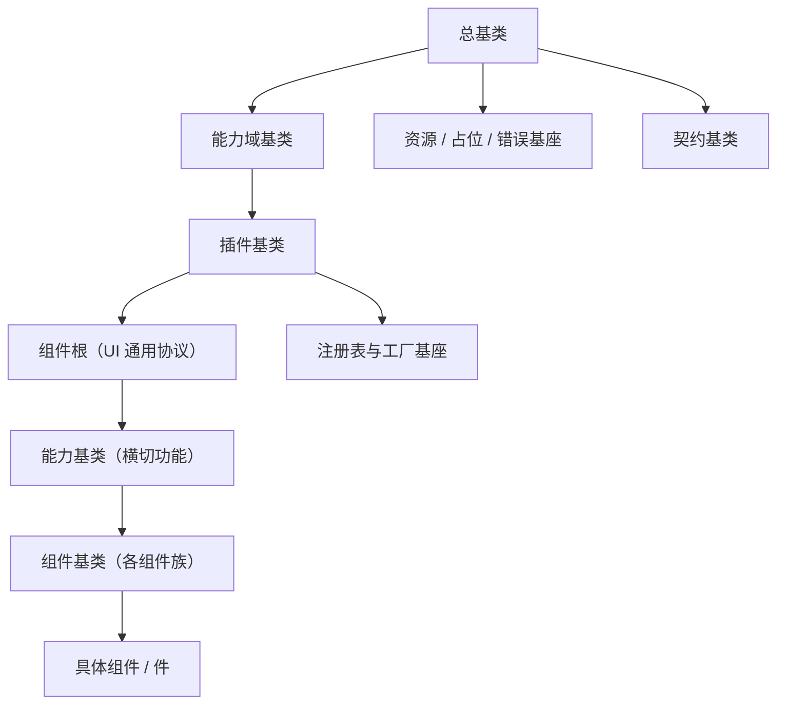

# 基础组件类需求

> BMS 基础管理系统 · 阶段四（前端组件库 / M4 组件库可用）· 需求域 02：基类体系与基础类横切底座（7 条）

[文档首页](../../../文档首页.md) › [前端组件库总览](00_需求_前端组件库.md) › 基础组件类　|　[03 布局组件类 →](03_需求_布局组件类.md)

## 1. 域说明 

本域对应[《组件设计》](../../../设计/组件设计/01_组件设计_总览.md)「基础组件类」（`02_基础组件类/`，44 节点：机制基类 8 + 能力类 31 + 域基类 5），是全组件库的根：**公共字段 / 方法只在链上对应基类维护，任何组件与模块不得重复实现**。体系**与后端基类体系同构**——固定前三段（总基类 → 能力域基类 → 插件基类）+ 组件侧（组件根 → 能力基类 → 组件基类 → 具体组件 / 件）；**主体内建走继承轨**（横切功能即链上的基类），**平台之外的定制走组合轨**（注册通道接入、不继承平台基类）。**继承链唯一权威为《[前端基类清单](../../../前端基类清单.md)》**，本域只写需求与完成标准，不重复登记继承关系。

| 需求 | 内容 | 本阶段口径 |
| --- | --- | --- |
| `02-1` | 总基类与固定三段（总基类 / 能力域基类 / 插件基类） | 落地 |
| `02-2` | 组件根 `BaseComponent`（UI 通用协议） | 落地 |
| `02-3` | 能力基类族（横切功能基类，开放集合） | 落地 |
| `02-4` | 组件基类族（各组件族，开放集合） | 落地 |
| `02-5` | 体系机制（注册表与工厂 / 资源占位错误 / 契约基类） | 落地 |
| `02-6` | 基础类横切底座：请求封装 / 权限指令 / 格式化工具 / 设计令牌 | 落地（宿主层与核心，两宿主同契约） |
| `02-7` | 框架无关核心工程与契约保障 | 落地 |

- **归属说明**：`02-6` 的契约节点属[《组件设计》](../../../设计/组件设计/01_组件设计_总览.md)「基础类」（`09_基础类/`，3 节点）；因其为全组件库横切底座，按执行顺序并入本域先行（编号 `02-6`）；设计令牌同为一域能力，一并纳入。**本次为全新构建，不涉及旧口径迁移。**
- **命名（强制）**：核心基类一律 `Base` 打头；**通用基类与后端同名同职责**，前端特有族按功能命名；组合式投影一律 `useXxx` 且只落绑定包（`frontend/packages/vue/src/bindings/`）。详见《[命名规范](../../../规范/命名规范.md)》「前端命名」节与《[前端开发规范](../../../规范/前端开发规范.md)》「前端基类体系（强制）」节。
- **依赖方向（强制）**：宿主 → 插件（`ui-ep` / `ui-vant` / `vue`）→ 核心（`core`）；核心不得依赖 Vue / UI 库 / 插件 / 宿主（核心护栏）；插件之间不互相依赖；基类之间依赖由继承关系确定、单向并在登记表声明；层数不设上限，不在链外自由挂接功能。
- **依据**：《[项目规划说明](../../../规划/项目规划说明.md)》「前端页面清单与菜单机制」节、《[总体项目规划](../../../规划/总体项目规划.md)》（WBS 阶段四、阶段内容与完成标准）、《[架构设计 · 前端组件体系](../../../设计/架构设计/05_架构设计_前端组件体系.md)》（「前端基类体系（开放式，对齐后端基类体系）」「框架无关核心与插件架构」「执行护栏（机器强制）」节）、《[前端基类清单](../../../前端基类清单.md)》、《[前端开发规范](../../../规范/前端开发规范.md)》。
- **用例口径**：本域用例入 Kiwi TCMS，自动化用例标注用例编号（随任务实施登记）。
- **目标**：固定前三段 / 组件根 / 能力基类族 / 组件基类族 / 体系机制按《前端基类清单》落地于 `frontend/packages/*`（核心 + 绑定 + 插件），基础类横切底座在宿主侧可用，扩展登记机制与核心护栏可用。

## 2. 需求 02-1：总基类与固定三段 

优先级：2（高）　|　状态：未开始　|　完成日期：—

**背景与动机**：全站基类若无共同根系，命名空间、日志、错误上报、配置读取与生命周期钩子会在每个基类与组件里各写一遍，改动无法一处生效；可替换实现的装配语义若缺公共承载，能力替换将无处收口。固定前三段（与后端同名同序）是整个体系的稳定骨架，必须最先立住。

**内容**（《组件设计》基础组件类「01 根系基类」「03 能力机制」，按《[前端基类清单](../../../前端基类清单.md)》目标态）：

1. **总基类**（`BaseObject`）：命名空间 / 版本、日志、错误上报、配置读取、生命周期（`dispose`）——**公共方法唯一落点**；**一切基类从其派生（零例外）**；只放「所有基类共有」的横切职责，不含 UI 与业务语义。
2. **能力域基类**（`BaseCapability`，继承总基类）：能力键声明（kebab-case）、依赖登记、单向校验（依赖已登记 / 无环 / 键名合法）、开发态告警、`describe` 元信息；只做「能力如何声明与登记」，不含 UI 或业务语义；登记源为能力依赖登记表（`capabilities/manifest.ts`）。
3. **插件基类**（`BasePluggable`，继承能力域基类）：能力键 / 实现名 / 契约版本 / 注册与解析 / 生命周期 / `describe`；不注册不可用，插件基类只承载装配语义、不含具体实现。
4. 纯 TS 实现，落核心包；不依赖渲染框架 / UI 库 / 插件 / 宿主。
5. 派生约束：组件根、注册表与工厂、资源 / 占位 / 错误、契约基类均从固定三段派生；错误基座以**多重继承**入链（总基类 + 原生错误的唯一有理由多重继承）。

**完成标准**：固定三段就位且与后端同名同序；一切基类由其派生（含错误基座多重继承）；能力声明 / 依赖登记 / 开发态校验可用；核心用例覆盖三段契约；核心框架无关护栏通过；`vue-tsc`、ESLint、Vitest 全通过。

**参考文档**：《组件设计》[01_组件设计_根系基类](../../../设计/组件设计/02_基础组件类/01_机制基类/01_组件设计_根系基类/01_组件设计_根系基类.md)、[03_组件设计_能力机制](../../../设计/组件设计/02_基础组件类/01_机制基类/03_组件设计_能力机制/03_组件设计_能力机制.md)（均含可交互原型）、《[前端基类清单](../../../前端基类清单.md)》「固定前三段」节、《[前端开发规范](../../../规范/前端开发规范.md)》「架构铁律」与「前端基类体系（强制）」节、《[后端基类清单](../../../后端基类清单.md)》（同名同序对照）

## 3. 需求 02-2：组件根 

优先级：2（高）　|　状态：未开始　|　完成日期：—

**背景与动机**：所有 UI 组件共有标识与命名空间类名、尺寸 / 密度、令牌属性协议、attrs 透传、生命周期通知与 `loading` / `disabled` 一组行为；这些若由各组件自实现，组件库的一致性无法保证，也会让每个组件任务重复一遍。组件根是所有 UI 组件的公共协议入口。

**内容**（《组件设计》基础组件类「02 组件根基类」，按《[前端基类清单](../../../前端基类清单.md)》目标态）：

1. **组件根**（`BaseComponent`，继承插件基类）：标识（`identifier`）与命名空间类名（`nsClass`）、尺寸 / 密度、`loading` / `disabled` / 显隐、**令牌属性协议**（`data-size` / `data-density` / `aria-*` + 状态类，`rootAttrs`）、attrs 透传（`passthroughAttrs`，保留键过滤）、运行期字段（`setProps`）、生命周期通知（`notifyLifecycle`）、机制装配点（`mechanisms`）。
2. 约束：**纯数据输出**（不触 DOM、不依赖渲染框架）；档位只写根元素属性、状态只加状态类；组件只消费令牌语义变量，**不得硬编码色值与尺寸**（豁免项见《[前端开发规范](../../../规范/前端开发规范.md)》「前端基类体系」节）。
3. 派生约束：能力基类从组件根派生、组件基类从能力基类派生；UI 组件必须挂到组件根之上、经能力基类 → 组件基类链派生，不得绕过链层另起炉灶。

**完成标准**：组件根就位并被能力基类 / 组件基类继承；令牌属性协议与 attrs 透传生效（属性选择器映射设计令牌）；核心用例覆盖组件根契约；`vue-tsc`、ESLint、Vitest 全通过。

**参考文档**：《组件设计》[02_组件设计_组件根基类](../../../设计/组件设计/02_基础组件类/01_机制基类/02_组件设计_组件根基类/02_组件设计_组件根基类.md)（含可交互原型）、《[前端基类清单](../../../前端基类清单.md)》「组件侧：组件根」节

## 4. 需求 02-3：能力基类族 

优先级：2（高）　|　状态：未开始　|　完成日期：—

**背景与动机**：组件的横切功能（值语义、字段、尺寸、数据状态、浮层、通知、标签、校验、偏好持久化、令牌、可点击、拖拽、页签、语言、权限、上下文、异步任务、上传、编辑器内核、选项源、预签名、水印、用户展示、动态路由、表单元数据、表单页）若落在组件里，会随组件数量线性复制。**横切功能即链上的能力基类**，是统一管理的唯一落点；两条链出现公共段即提取能力基类承前启后。

**内容**（《组件设计》基础组件类「02 能力类」31 节点，按《[前端基类清单](../../../前端基类清单.md)）》§5.2 目标态）：

1. **能力基类族**（挂组件根或已有能力基类；开放集合、可新增）：值语义 `BaseValue`、字段语义 `BaseField`、尺寸档位 `BaseSized`、数据状态 `BaseDataState`、浮层 `BaseOverlay`、提示通知 `BaseNotice`、标签语义 `BaseLabeled`、校验 `BaseValidatable`、偏好持久化 `BasePersistedState`、可挂载 `BaseMounted`、设计令牌 `BaseDesignToken`、可点击 `BaseClickable`、拖拽 `BaseDragDrop`、页签 `BaseTabs`、语言上下文 `BaseLocale`、权限上下文 `BaseAccess`、模块上下文 `BaseModuleContext`、异步任务 `BaseAsyncTask`、上传引擎 `BaseUploadEngine`、编辑器内核 `BaseEditorKernel`、选项源 `BaseOptionSource`、预签名 `BasePresignedUrl`、水印 `BaseWatermark`、用户 / 组织展示 `BaseUserDisplay`、动态路由 `BaseDynamicRoutes`、表单元数据 `BaseFormMeta`、表单页组合 `BaseFormPage`。
2. **提取规则**：两个基类出现公共部分 → 提取能力基类（仍有公共部分则继续提取，如 `BaseSized` 承载容器 / 布局 / 媒体的尺寸档位）；不设层数上限、不做封闭枚举。
3. **新增规则**：新增横切功能 = 新增能力基类（定父基类 + 登记）——候选 → 组件设计节点 → 评审确认 →《[前端基类清单](../../../前端基类清单.md)》登记 → 代码登记（`capabilities/manifest.ts`）+ 契约用例。
4. **占位先行**：选项源 / 上传 / 异步任务 / 预签名 / 用户展示 / 表单元数据 / 偏好远端 / 权限码 / 动态路由菜单源在后端就绪前按占位语义运行（不请求），占位契约纳入门禁（与 `02-5` 占位基座一致）。
5. 组件可继承多个能力基类（字段链、尺寸链等），链间依赖由继承关系确定、单向并登记。

**完成标准**：能力基类族就位并被相应组件基类继承；新增能力基类流程可验证（不改固定三段与组件根）；核心用例覆盖横切契约（受控值 / 三态 / 权限判定 / 校验触发等）；登记同步。

**参考文档**：《组件设计》`02_基础组件类/02_能力类/` 下 31 个节点（如[受控值能力](../../../设计/组件设计/02_基础组件类/02_能力类/08_组件设计_受控值能力/08_组件设计_受控值能力.md)、[字段编排能力](../../../设计/组件设计/02_基础组件类/02_能力类/09_组件设计_字段编排能力/09_组件设计_字段编排能力.md)、[字段壳能力](../../../设计/组件设计/02_基础组件类/02_能力类/10_组件设计_字段壳能力/10_组件设计_字段壳能力.md)、[选项源能力](../../../设计/组件设计/02_基础组件类/02_能力类/12_组件设计_选项源能力/12_组件设计_选项源能力.md)，均含可交互原型）、《[前端基类清单](../../../前端基类清单.md)》§5.2「能力基类」节、《[前端开发规范](../../../规范/前端开发规范.md)》「扩展规则」节

## 5. 需求 02-4：组件基类族 

优先级：2（高）　|　状态：未开始　|　完成日期：—

**背景与动机**：同类组件（输入族、展示族、表格 / 列表 / 树族、模态族、表单容器族、容器 / 布局 / 媒体族、反馈 / 通知族、列配置 / 查询方案族、字段壳 / 字段权限族）需要共享更贴近族的契约（受控绑定、只读回显、树数据、模态语义、栅格与校验、尺寸档位、反馈状态机、持久化、字段壳与权限）。**组件基类**是族的身份骨架与统一契约，具体组件只负责自身特性。

**内容**（《组件设计》基础组件类「03 域基类」5 节点与「02 能力类」中的形态类节点，按《[前端基类清单](../../../前端基类清单.md)》§5.3 目标态）：

1. **组件基类族**（继承相应能力基类；开放集合）：输入族 `BaseInput`（父 `BaseField`）、展示族 `BaseDisplay`（父 `BaseValue`）、表格 / 列表 / 树族 `BaseTable` / `BaseList` / `BaseTreeData`（父 `BaseDataState`）、模态族 `BaseModalShell`（父 `BaseOverlay`）、表单容器族 `BaseFormContainer`（父 `BaseValidatable`）、容器 / 布局 / 媒体族 `BaseContainer` / `BaseLayout` / `BaseMediaContent`（父 `BaseSized`）、反馈 / 通知族 `BaseFeedback` / `BaseNotification`（父 `BaseNotice`）、列配置 / 查询方案族 `BaseColumnConfig` / `BaseQueryScheme`（父 `BasePersistedState`）、字段壳 / 字段权限族 `BaseFieldShell` / `BaseFieldPerm`（父 `BaseLabeled` / `BaseFieldShell`）。
2. **取消「域基类」口径**：原「输入 / 展示 / 树 / 图表 / 编辑器域基类」按族归入组件基类；「图表域」改为组件基类 `BaseChart`（父 `BaseDataState`），随图表卡（`07-6`）演练新增。
3. **族基类即具体组件派生起点**：具体组件 / 件继承对应族基类（如文本框 → `BaseInput`；标签 → `BaseDisplay`；表格 → `BaseTable`；权限树 → `BaseTreeData`），各族**同契约多实现**，一致性由契约用例工厂（同一套断言）保证。
4. **字段链汇入**：字段件同时具备值语义与字段壳 / 权限——值链 `BaseValue → BaseField → BaseInput` 与字段侧 `BaseLabeled → BaseFieldShell → BaseFieldPerm` 在**具体字段件**处汇入。
5. **新增规则**：新增组件族 = 新增组件基类（继承相应能力基类；无合适能力基类时先补能力基类）+ 登记。

**完成标准**：组件基类族就位并被具体组件沿链派生；字段链汇入口径落地；新增组件族演练验证规则可行；核心用例覆盖各组件基类契约（受控绑定 / 只读回显 / 树数据 / 四态等）；文档登记同步。

**参考文档**：《组件设计》[01_组件设计_输入域基类](../../../设计/组件设计/02_基础组件类/03_域基类/01_组件设计_输入域基类/01_组件设计_输入域基类.md)、[02_组件设计_展示域基类](../../../设计/组件设计/02_基础组件类/03_域基类/02_组件设计_展示域基类/02_组件设计_展示域基类.md)、[03_组件设计_树域基类](../../../设计/组件设计/02_基础组件类/03_域基类/03_组件设计_树域基类/03_组件设计_树域基类.md)、[04_组件设计_图表域基类](../../../设计/组件设计/02_基础组件类/03_域基类/04_组件设计_图表域基类/04_组件设计_图表域基类.md)、[05_组件设计_编辑器域基类](../../../设计/组件设计/02_基础组件类/03_域基类/05_组件设计_编辑器域基类/05_组件设计_编辑器域基类.md)（均含可交互原型）、《[前端基类清单](../../../前端基类清单.md)》§5.3「组件基类」节与 §11.3「加层演练」节

## 6. 需求 02-5：体系机制（注册表与工厂 / 资源占位错误 / 契约基类） 

优先级：2（高）　|　状态：未开始　|　完成日期：—

**背景与动机**：纵向可替换实现（能力域基类 → 插件基类 → 注册表）需要统一的注册与解析基座；异步释放、占位降级与错误承载是跨组件机制；模块 API 与数据契约（实体 / 分页查询 / 值对象）需要统一基类。这些机制若不统一，会出现各域各写映射、释放遗漏、占位请求副作用与契约漂移。

**内容**（《组件设计》基础组件类「04 占位基类」「05 异步资源基类」「06 注册表基类」「07 错误基类」「08 订阅基类」，按《[前端基类清单](../../../前端基类清单.md)》目标态）：

1. **注册表与工厂**（继承插件基类）：统一提供者注册表基座（同键唯一性拒重——严格域抛错 / 一般域告警保留首个、未命中返回 `undefined`、保序、只读快照）、能力注册表、注册项公共契约（抽象键 + 自描述）、工厂基类（创建入口标识 / 参数校验 / 产出物释放登记）；各扩展点注册表（路由·菜单 / 通用组件 / 字段渲染器 / 图标 / 工作台卡片）一律基于统一基座扩展，**不得另起映射登记实现**。
2. **异步资源与订阅**（挂总基类）：异步资源登记 / **逆序释放** / 幂等 / 释放后拒绝登记；订阅主题点分小写（与后端事件同源）、来源解耦、取消函数登记为异步资源（卸载自动取消）。
3. **占位三件**（挂总基类）：占位标记（三类原因 `pending` / `null` / `stub` × 三类降级 `empty` / `disabled` / `hidden`）、空实现（Null Object，无副作用、恒定返回）、未实现桩（统一抛错）；**占位不请求、不写缓存、无副作用**。
4. **错误基座**（多重继承，入链）：`code` / `userMessage`、提示映射（i18n `error.{code}`）、上报委托总基类；保留原生 `instanceof Error` 与堆栈；错误码段位对齐平台（参数 / 未登记 / 冲突 / 限流 / 权限），前端保留自有子段，不自造段位、不复用平台已发布码。
5. **契约基类**（挂总基类）：模块 API（路径前缀 / 请求方法 / 自动幂等键，继承总基类）；数据对象（不可变语义 / 字段声明 / 归一 / 稳定序列化）→ 实体（标识 / 版本 / 软删除回显）与分页查询（页码 / 页长 / 排序 / 筛选）。

**完成标准**：注册表与工厂基座、资源 / 占位 / 错误基座、契约基类就位并被各域复用；各扩展点注册表基于同一基座且行为一致；占位语义成为依赖波组件的统一降级口径；错误码段位对齐；核心用例覆盖注册唯一性 / 未命中 / 释放 / 占位 / 错误映射契约；`vue-tsc`、ESLint、Vitest 全通过。

**参考文档**：《组件设计》[04_组件设计_占位基类](../../../设计/组件设计/02_基础组件类/01_机制基类/04_组件设计_占位基类/04_组件设计_占位基类.md)、[05_组件设计_异步资源基类](../../../设计/组件设计/02_基础组件类/01_机制基类/05_组件设计_异步资源基类/05_组件设计_异步资源基类.md)、[06_组件设计_注册表基类](../../../设计/组件设计/02_基础组件类/01_机制基类/06_组件设计_注册表基类/06_组件设计_注册表基类.md)、[07_组件设计_错误基类](../../../设计/组件设计/02_基础组件类/01_机制基类/07_组件设计_错误基类/07_组件设计_错误基类.md)、[08_组件设计_订阅基类](../../../设计/组件设计/02_基础组件类/01_机制基类/08_组件设计_订阅基类/08_组件设计_订阅基类.md)（均含可交互原型）、《[前端基类清单](../../../前端基类清单.md)》「插件基类族与注册表」「资源、占位与错误基座」「契约基类」节、《[架构设计 · 前端组件体系](../../../设计/架构设计/05_架构设计_前端组件体系.md)》「渲染器与扩展点注册机制」节

## 7. 需求 02-6：基础类横切底座（请求封装 / 权限指令 / 格式化工具 / 设计令牌） 

优先级：2（高）　|　状态：未开始　|　完成日期：—

**背景与动机**：页面取数、按钮权限、展示格式化与设计令牌是全站横切底座；若各页各写请求、权限判断与日期 / 金额格式化，会出现 401 处理不一致、权限显隐口径不一、金额与时间展示各异、色值与尺寸硬编码。它们是弹窗表单提交、基础控件校验、数据呈现与宿主外壳的共同前置，必须先于这些需求交付。

**内容**（《组件设计》基础类「01 请求封装」「02 权限指令」「03 格式化工具」、《[API接口规范](../../../规范/API接口规范.md)》；宿主层与核心，两宿主同契约）：

1. **请求封装**：统一请求实例（token 注入、401 静默刷新、统一响应 `{code, message, data}` 解析与错误提示）+ 请求组合式（loading / 错误 / 重试 / 取消）与分页列表组合式（分页 / 筛选 / 刷新）；模块 API 继承契约层的模块 API 基类，禁止绕过基类裸用请求库；写接口自动带幂等键。
2. **权限指令**：`v-perm`（默认任一满足 / 支持全部满足 / 取反）、脚本判定与 `canAccess`——按钮与动作权限渲染契约；**权限码集合与判定唯一来源为核心权限能力**（`BaseAccess`），应用态 store 只做集合 / 菜单 / 版本 / 加载编排；脚本场景经宿主权限工具 → 插件注入点（宿主装配注入）；字段权限不在本项（属字段权限能力）。
3. **格式化工具**：日期时间（用户时区 + `Intl`）、金额 / 数值 / 百分比 / 文件大小 / 时长 / 相对时间 / 脱敏（空值与非法值占位）、通用校验器（必填独立、空值跳过）；格式化入口与默认基准经宿主注入。
4. **设计令牌**：宿主令牌文件为基础令牌唯一来源——基础令牌五组（色 / 字 / 间距 / 圆角 / 阴影）+ 尺寸 / 密度档位 + 语义变量 + 属性协议选择器 + 组件库主题映射；组件只消费令牌语义变量，**不得硬编码色值与尺寸**；新增令牌先登记后使用。
5. **与契约衔接**：统一响应类型与分页响应类型与后端 OpenAPI 生成类型一致；错误码文案按 i18n key 映射；业务错误继承核心错误基座。

**完成标准**：请求组合式与分页列表组合式可用并被列表页类需求复用；`v-perm` 与脚本判定经注入点显隐生效；格式化工具在时区 / 金额口径上与后端一致；设计令牌可被组件与模块复用、硬编码色值被护栏拦截；Vitest 覆盖请求拦截、权限判定与格式化分支；`vue-tsc`、ESLint、Vitest 全通过。

**参考文档**：《组件设计》[01_组件设计_请求封装](../../../设计/组件设计/09_基础类/01_组件设计_请求封装/01_组件设计_请求封装.md)、[02_组件设计_权限指令](../../../设计/组件设计/09_基础类/02_组件设计_权限指令/02_组件设计_权限指令.md)、[03_组件设计_格式化工具](../../../设计/组件设计/09_基础类/03_组件设计_格式化工具/03_组件设计_格式化工具.md)（均含可交互原型）、《[API接口规范](../../../规范/API接口规范.md)》、《[架构设计 · 前端组件体系](../../../设计/架构设计/05_架构设计_前端组件体系.md)》「取数与缓存协作」节、《[架构设计 · 前端架构](../../../设计/架构设计/08_架构设计_前端架构.md)》「动态菜单与权限渲染」节

## 8. 需求 02-7：框架无关核心工程与契约保障 

优先级：2（高）　|　状态：未开始　|　完成日期：—

**背景与动机**：开放式体系若无登记与评审，会退化为「每处各写一套」；框架无关核心与可替换渲染插件的分层若缺工程护栏，核心会悄悄依赖渲染框架，同一契约的多实现会漂移。本需求把工程分包、核心护栏、契约用例工厂与扩展登记机制一次性立住，作为全组件库的机器保障。

**内容**（《[架构设计 · 前端组件体系](../../../设计/架构设计/05_架构设计_前端组件体系.md)》「框架无关核心与插件架构」「执行护栏（机器强制）」节、《[前端开发规范](../../../规范/前端开发规范.md)》「执行护栏（指引）」节）：

1. **工程分包（单仓多包 workspace）**：核心（纯 TS：固定三段 + 注册表与工厂 + 组件侧 + 资源占位错误 + 契约与领域逻辑）/ 渲染绑定（组合式投影、指令、令牌样式）/ 渲染实现插件（PC / 移动端各一套 UI 实现）/ 宿主装配（路由 / 菜单运行时 / 页面 / 注入接线）。
2. **依赖方向与核心护栏**：宿主 → 插件 → 核心；核心不得依赖渲染框架 / UI 库 / 插件 / 宿主（核心护栏，核心包运行时依赖面为空）；插件之间不互相依赖。
3. **契约用例工厂**：核心契约（确认 / 权限 / 容器件 / 权限按钮 / 反馈件 / 输入控件等）由各渲染插件跑**同一套断言**——「同接口多实现」的机器保障；新增契约先落核心与契约用例。
4. **扩展与登记机制**：候选 → 组件设计节点（契约与原型）→ 评审确认 →《[前端基类清单](../../../前端基类清单.md)》登记 → 代码登记（能力依赖登记表 `capabilities/manifest.ts`）+ 契约用例 → 同步《[架构设计 · 前端组件体系](../../../设计/架构设计/05_架构设计_前端组件体系.md)》与《[前端开发规范](../../../规范/前端开发规范.md)》；兼容性口径（新增为兼容变更，调整既有契约升主版本标注）。
5. **护栏**：核心框架无关护栏、能力登记与依赖校验（开发态告警）、契约测试套件、清单对账护栏（实现侧登记 ↔ 清单 ↔ 插件导出 ↔ 组件清单双向校验）、注册表「不注册不可用」。
6. **错误码段位**：前端内建码对齐平台段位，前端保留自有子段；不得自造段位或复用平台已发布码。

**完成标准**：单仓多包 workspace 就位、依赖方向与核心护栏可查；契约用例工厂可对全部实现跑同一套断言；扩展流程成文并被至少一次新增演练验证；清单对账护栏可查（漏登记 / 僵尸条目）；错误码段位成文并被错误基座与请求层遵循；`vue-tsc`、ESLint、Vitest 全通过。

**参考文档**：《[架构设计 · 前端组件体系](../../../设计/架构设计/05_架构设计_前端组件体系.md)》「框架无关核心与插件架构」「执行护栏（机器强制）」节、《[前端基类清单](../../../前端基类清单.md)》「维护约定」「扩展与演进」节、《[前端开发规范](../../../规范/前端开发规范.md)》「执行护栏（指引）」「扩展规则」节、《[架构设计 · 子系统 · 扩展点与插件化](../../../设计/架构设计/10_架构设计_子系统_扩展点与插件化.md)》「前端插件化」节

> 本文档按《[文档生成规范](../../../规范/文档生成规范.md)》编写 · 关键决策逐项确认
