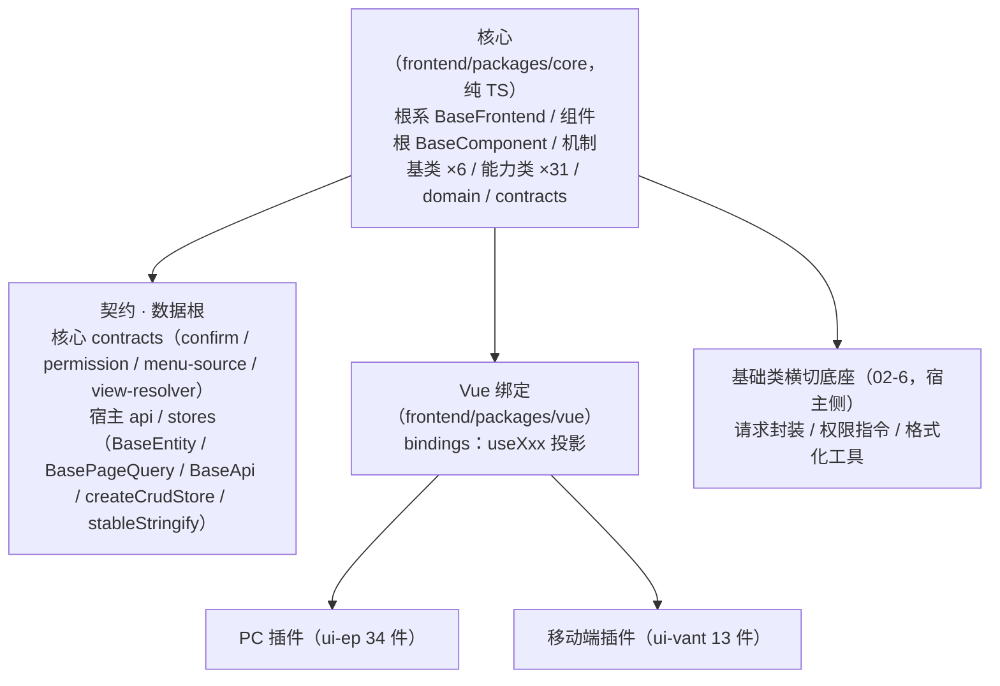

# 基础组件类需求

> BMS 基础管理系统 · 阶段四（前端组件库 / M4 组件库可用）· 需求域 02：开放式基类体系与基础类横切底座（6 条）

[文档首页](../../../文档首页.md) › [前端组件库总览](00_需求_前端组件库.md) › 基础组件类　|　[03 布局组件类 →](03_需求_布局组件类.md)

## 1. 域说明 

本域对应[《组件设计》](../../../设计/组件设计/01_组件设计_总览.md)「基础组件类」（`02_基础组件类/`，44 节点：根系 / 组件根 2 + 机制基类 6 + 能力类 31 + 域基类 5），是全组件库的根：**公共字段 / 方法只在对应基类或能力维护，任何组件与模块不得重复实现**。体系对齐后端基类体系，按**角色 + 开放扩展**组织（不做固定层号 / 数量枚举）；**现行口径为「纯 TS/JS 框架无关核心 + 可替换渲染插件」**（专项 `02_07` S0 ~ S8 已落地，见第 8 节）。

| 需求 | 内容 | 本阶段口径 |
| --- | --- | --- |
| `02-1` | 根系 `BaseFrontend`（+ 投影 `useFrontendBase`） | 落地 |
| `02-2` | 组件根 `BaseComponent`（+ 投影 `useComponentBase`）+ 机制基类（能力机制 / 占位 / 异步资源 / 订阅 / 注册表 / 错误） | 落地 |
| `02-3` | 能力机制 `BaseCapability` + 预置 31 能力类 + 注册表基类 `BaseRegistry` / `RegistryItemLike` | 落地（预置 31/31），新增随需 |
| `02-4` | 域基类（输入 / 展示 / 树 / 图表 / 编辑器）与新增规则 | 能力已交付；域包装按新体系回补波重建 |
| `02-5` | 扩展与登记机制（候选 → 设计节点 → 评审 → 清单登记 → 代码登记 + 契约用例） | 落地 |
| `02-6` | 基础类横切底座：请求封装 / 权限指令 / 格式化工具 | 落地（宿主层，两宿主同契约） |

- **归属说明**：`02-6` 的契约节点属[《组件设计》](../../../设计/组件设计/01_组件设计_总览.md)「基础类」（`09_基础类/`，3 节点）；因其为全组件库横切底座，按执行顺序并入本域先行（编号 02-6），使弹窗抽屉表单、八基础控件、数据呈现等后继需求只依赖编号更小的条目。
- **命名规则（强制）**：核心类（根系 / 组件根 / 机制基类 / 能力类 / 域基类）一律 `Base` 打头；能力 `key` kebab-case；**组合式投影一律 `useXxx` 且只落 `frontend/packages/vue/src/bindings/`**（`useFrontendBase` / `useComponentBase` 为固定名）。详见《[命名规范](../../../规范/命名规范.md)》「前端命名」节与《[前端开发规范](../../../规范/前端开发规范.md)》「前端基类体系（开放式，强制）」节。
- **依赖方向（强制）**：宿主 → 插件（`ui-ep` / `ui-vant` / `vue`）→ 核心（`core`）；核心不得依赖 Vue / UI 库 / 插件 / 宿主（护栏）；插件之间不互相依赖；能力之间依赖须单向并登记（`capabilities/manifest.ts`）；层次由依赖关系决定，不设层数上限。UI 组件经 `useComponentBase` 投影挂组件根，**组合轨默认**，需要语义归类时再派生域基类。
- **契约 / 数据根**：核心契约与领域逻辑落 `frontend/packages/core/src/{contracts,domain}`；`BaseEntity` / `BasePageQuery` / `BaseApi` / `createCrudStore` / `stableStringify` 为**宿主层**数据根（`frontend/apps/*/src`），两宿主同契约（`BaseApi` 继承核心 `BaseFrontend`）。
- **依据**：《[项目规划说明](../../../规划/项目规划说明.md)》「前端页面清单与菜单机制」节、《[总体项目规划](../../../规划/总体项目规划.md)」阶段四、《[架构设计 · 前端组件体系](../../../设计/架构设计/05_架构设计_前端组件体系.md)》（「框架无关核心与插件架构」与「执行护栏」节）、《[前端基类清单](../../../前端基类清单.md)》、《[前端开发规范](../../../规范/前端开发规范.md)》、《[组件设计 · 总览](../../../设计/组件设计/01_组件设计_总览.md)》。
- **用例口径**：本域用例入 Kiwi TCMS，自动化用例标注用例编号（随任务实施登记）。
- **目标**：根系 / 组件根 / 机制基类 / 能力类 / 域基类按角色落地于 `frontend/packages/*`（核心 + 绑定 + 插件），基础类横切底座在宿主侧可用，扩展登记机制可用（新增能力 / 域基类不改根）。

## 2. 需求 02-1：根系基类 

优先级：2（高）　|　状态：已完成　|　完成日期：2026-09-16（新体系口径回写 2026-09-17）

**背景与动机**：全站基类若无共同根系，命名空间、日志、错误上报、配置读取与生命周期钩子会在每个基类与组件里各写一遍，改动无法一处生效；根系是「一切基类之根」，必须最先立住。

**内容**（《组件设计》基础组件类「01 根系基类」，现行落点）：

1. `BaseFrontend`（核心类，`frontend/packages/core/src/base/BaseFrontend.ts`）：命名空间 / 版本、日志（`log`）、错误上报（`reportError`）、配置读取（`getConfig`）、生命周期钩子（`dispose`）；纯 TS，不依赖 Vue / UI 库 / 宿主。
2. `useFrontendBase`（Vue 投影，`frontend/packages/vue/src/bindings/useFrontendBase.ts`）：核心实例 ↔ 组合式（宿主 stores / 请求层消费）。
3. 派生约束：一切基类从根系派生（组件根 / 机制基类 / 能力类）；根系不依赖任何上层基类与具体组件，不承载业务语义。

**完成标准**：`BaseFrontend` / `useFrontendBase` 就位；根系的通用字段与方法在后续基类 / 能力类中不再重复实现（核心护栏与用例可查）；`vue-tsc`、ESLint、Vitest 全通过。

**参考文档**：《组件设计》[01_组件设计_根系基类](../../../设计/组件设计/02_基础组件类/01_机制基类/01_组件设计_根系基类/01_组件设计_根系基类.md)（含可交互原型）、《[前端开发规范](../../../规范/前端开发规范.md)》「前端基类体系（开放式，强制）」节、《[前端基类清单](../../../前端基类清单.md)》「根系」「契约与横切底座」节

> 注：实现期要点——**原实现落 `src/base/`（双端同款），`02_07` S4a / S4c / S6 后收敛为核心 `BaseFrontend` + `@bms/vue` 投影**（宿主 `frontend/apps/*/src/adapters/host-base.ts` 提供宿主 sink 出口）；运行期配置由宿主装配注入（构建期 `VITE_*` 归一随宿主入口）；日志与错误上报为统一出口 + sink 可注入（默认 console；后端上报随阶段八 / 十三）；契约 / 数据根接根系（宿主 `BaseApi` 继承核心 `BaseFrontend`、`createCrudStore` 组合、`request()` 业务错误与 401 上报）。用例：Kiwi 698 / 699（双端断言集，apps 侧保留）；核心侧新增用例随 `02_07`（`packages/core/tests`）。遗留去向：请求封装完整能力 → `02_06`；其余机制基类口径 → `02_02` / `02_03`；《概要设计 · 系统参数》「前端配置」节 → 阶段六 / 八。

## 3. 需求 02-2：组件根基类 

优先级：2（高）　|　状态：已完成　|　完成日期：2026-09-16（新体系口径回写 2026-09-17）

**背景与动机**：所有 UI 组件共有 attrs 透传、尺寸 / 密度、令牌属性协议、命名空间类名、生命周期通知与 `loading` / `disabled` 一组行为；这些若由各组件自实现，组件库的一致性无法保证，也会让后续每个组件任务都要重复一遍。

**内容**（《组件设计》基础组件类「02 组件根基类」「04 占位基类」「05 异步资源基类」「06 注册表基类」「07 错误基类」「08 订阅基类」，现行落点）：

1. `BaseComponent`（核心类）+ `useComponentBase`（Vue 投影）：标识与命名空间类名（`identifier` / `nsClass`）、尺寸与密度、令牌属性协议（`rootAttrs`：`data-size` / `data-density` / 状态类 / `aria-*`）、attrs 透传（`passthroughAttrs` 保留键过滤）、运行期字段（`setProps`）、生命周期通知、机制装配点 `mechanisms`。
2. 能力机制 `BaseCapability` + 注册（`registerKnownCapabilities` / `CapabilityRegistry`）：能力的 `key` 声明、依赖登记与开发态校验（见 `02-3`）。
3. 占位基类 `BasePlaceholder`：依赖后端能力未就绪时的占位语义（三类原因 × 三类降级；占位不请求）。
4. 异步资源基类 `BaseAsyncResource`：异步资源（订阅 / 定时器 / 请求 / 实例）的**登记、逆序释放、幂等释放与释放钩子**（对齐后端 `BaseAsyncResource` / `ResourceManager`）。
5. 注册表基类 `BaseRegistry<T>` + `RegistryItemLike`：唯一性拒重 / 未命中返回 `undefined` / 保序 / 只读快照（对齐后端 `BaseProviderRegistry` / `BaseProvider`）。
6. 错误基类 `BaseError` + `ErrorCodes`（`extends Error`）：`code` / `userMessage`、提示映射与上报委托；宿主 `ApiError` 继承之。
7. 订阅基类 `BaseSubscription`（`extends BaseAsyncResource`）：事件订阅与销毁（与后端事件域对齐；`topic` 点分小写同源）。

**完成标准**：组件根与机制基类就位并被后续组件 / 能力类组合使用；占位语义成为依赖波组件的统一降级口径；核心用例覆盖组件根契约与机制基类分支；`vue-tsc`、ESLint、Vitest 全通过。

**参考文档**：《组件设计》[02_组件设计_组件根基类](../../../设计/组件设计/02_基础组件类/01_机制基类/02_组件设计_组件根基类/02_组件设计_组件根基类.md)、[04_组件设计_占位基类](../../../设计/组件设计/02_基础组件类/01_机制基类/04_组件设计_占位基类/04_组件设计_占位基类.md)、[05_组件设计_异步资源基类](../../../设计/组件设计/02_基础组件类/01_机制基类/05_组件设计_异步资源基类/05_组件设计_异步资源基类.md)、[06_组件设计_注册表基类](../../../设计/组件设计/02_基础组件类/01_机制基类/06_组件设计_注册表基类/06_组件设计_注册表基类.md)、[07_组件设计_错误基类](../../../设计/组件设计/02_基础组件类/01_机制基类/07_组件设计_错误基类/07_组件设计_错误基类.md)、[08_组件设计_订阅基类](../../../设计/组件设计/02_基础组件类/01_机制基类/08_组件设计_订阅基类/08_组件设计_订阅基类.md)（均含可交互原型）

> 注：实现期要点——**原实现落 `src/base/`（双端同款），`02_07` S2 / S4a / S4c / S6 后收敛为 `frontend/packages/core/src/{base,mechanisms}/` 的纯 TS 类**；令牌属性协议由核心类产出、宿主 `tokens.scss` 属性选择器映射（双端 `main.ts` 导入）；`mechanisms` 装配点挂接机制并随释放联动；机制层组合式（`usePlaceholderBase` / `useAsyncResourceBase` / `useRegistryBase` / `useSubscriptionBase`）随旧层删除，如需新的投影入口按「核心类 + `@bms/vue` 投影」口径按需补。用例：Kiwi 700（组件根）/ 701（占位）/ 702（异步资源）/ 703（错误）/ 704（订阅），apps 侧断言集保留；核心侧用例随 `02_07`（`packages/core/tests`，含护栏与行为用例）。遗留去向：基础令牌 → **已闭环（`03_06`）**；错误码段位与护栏 → `02_05`（**已闭环**：`10001` / `10002` / `10003` / `10005` / `30001` / `19001`）；订阅真实来源 → 阶段五。

## 4. 需求 02-3：能力机制与预置能力类 

优先级：2（高）　|　状态：已完成　|　完成日期：2026-09-16（新体系口径回写 2026-09-17）

**背景与动机**：组件的横切能力（受控值、字段壳、权限、值格式化、选项源、上传、页签、偏好持久化等）若落在组件里，会随组件数量线性复制；**能力（原「片段」）是「正交可组合」的唯一落点**，也是本组件库与后端基类体系同构的关键。设计变更后，能力由「Vue 组合式片段」重做为「**纯 TS 能力类（`BaseXxx extends BaseCapability`）+ 按需的 Vue 投影（`useXxx`）**」。

**内容**（《组件设计》基础组件类「03 片段机制」「06 注册表基类」与能力节点 31 项）：

1. 能力机制 `BaseCapability`：能力 `key` 声明、依赖登记（`frontend/packages/core/src/capabilities/manifest.ts`）、单向依赖校验、开发态告警（违规默认告警；「不得依赖上层」由核心护栏把关）。
2. 预置 **31 个能力类**（开放集合，可新增；key / depends 权威表见 `manifest.ts` 与《前端基类清单》§6）：
   - 值·字段链 4：`BaseValue`（`value`）、`BaseFieldShell`（`field-shell`）、`BaseFieldPerm`（`field-perm`）、`BaseField`（`field`）
   - 形态 7：`BaseInteractive`、`BaseInputControl`、`BaseDisplayControl`、`BaseContainer`、`BaseFormContainer`、`BaseMedia`、`BaseLayout`
   - 复用 20：`BaseTabs`、`BasePersistedState`、`BaseOptionSource`、`BaseUploadEngine`、`BaseAsyncTask`、`BaseEditorKernel`、`BaseTreeData`、`BaseUserDisplay`、`BaseDynamicRoutes`、`BaseFormMeta`、`BasePresignedUrl`、`BaseDragDrop`、`BaseDesignToken`、`BaseFormPage`、`BaseLocale`、`BaseAccess`、`BaseColumnConfig`、`BaseQueryScheme`、`BaseWatermark`、`BaseFragmentContext`
3. Vue 投影（按需，`frontend/packages/vue/src/bindings/useXxx.ts`）：已交付 `useValue` / `useField` / `useContainer` / `useTabs` / `usePersistedState` / `useAccess` / `useDynamicRoutes`（+ 容器域 `useVirtualRange`）；其余能力由组件按需经 `createCapability` 实例化或随使用方补投影。
4. `BaseRegistry<T>` + `RegistryItemLike`（机制基类，`mechanisms/registry.ts`）：唯一性拒重 / 未命中返回 `undefined` / 保序 / 只读快照；供路由·菜单、组件、字段渲染器、图标、工作台卡片注册复用（域 10 微前端骨架承接最小实现落地）。
5. 组合约束：能力正交可组合（如展示域 = 展示形态 + 受控值）；能力依赖单向并登记；新增能力 = 新增能力类 + 登记 + 契约用例，不改根系 / 组件根。

**完成标准**：能力机制与 31 个预置能力类就位（**31/31 登记**）；组件可组合多个能力且行为符合各能力设计节点；新增能力流程可验证（不触碰根系 / 组件根）；核心用例覆盖能力契约（受控值 / 三态 / 权限 / 校验触发等）；文档登记同步。

**参考文档**：《组件设计》[03_组件设计_片段机制](../../../设计/组件设计/02_基础组件类/01_机制基类/03_组件设计_片段机制/03_组件设计_片段机制.md)、[06_组件设计_注册表基类](../../../设计/组件设计/02_基础组件类/01_机制基类/06_组件设计_注册表基类/06_组件设计_注册表基类.md)（含可交互原型）、《组件设计》`02_基础组件类/02_能力片段/` 下 31 个节点、《[前端基类清单](../../../前端基类清单.md)》「能力（开放集合，预置 31）」节

> 注：实现期要点——**原实现落 `src/components/base/<能力域>/useXxx.ts` + `fragments.ts`（双端同款），`02_07` S2 类化后收敛为 `frontend/packages/core/src/capabilities/<域>.ts`（31 类）+ `manifest.ts` 登记（`option-source` → `value`；`field` → `value` / `field-shell` / `field-perm`；`media` / `upload-engine` → `presigned-url`；`layout` → `design-token`；`column-config` / `query-scheme` → `persisted-state`）**；投影只落 `frontend/packages/vue/src/bindings/`（`useXxx` 只存在于此）。占位先行：选项源 / 上传 / 异步任务 / 预签名 / 用户展示 / 表单元数据 / 偏好远端 / 权限码 / 动态路由菜单源在后端就绪前按占位语义运行（不请求），占位契约纳入门禁。用例：Kiwi 705（片段机制 → 能力机制）/ 706（注册表基座）/ 707（核心 12 能力）/ 708（复用 19 能力），apps 侧断言集保留；核心侧契约用例随 `02_07`（`packages/core/tests/contracts`）。遗留去向：静态护栏与错误码 → `02_05`（**已闭环**）；旧 `BaseXxx.vue` 片段包装随旧层删除，域 05+ 回补波按新体系重建。

## 5. 需求 02-4：域基类与新增规则 

优先级：2（高）　|　状态：已完成　|　完成日期：2026-09-16（新体系口径回写 2026-09-17）

**背景与动机**：同类组件（输入族、展示族、树族、图表族、编辑器族）需要共享更贴近域的契约（受控绑定、只读回显、树数据、图表生命周期、编辑器内核）；但域基类是**可选**的语义层，组件组合能力即可工作，因此既要预置常用域，又要保证新增域不受既有枚举限制。

**内容**（《组件设计》基础组件类「域基类」5 节点，现行口径）：

1. 输入域：核心能力 `field` + `input-control`（+ 字段权限 / 字段壳）已交付；域包装（原 `BaseInput` + `useInputBase`）随旧层删除，按「核心能力 + 投影 + 插件包装」重建，统一受控绑定、`modelValue` / `update:modelValue` / `change` / `focus` / `blur`、`disabled` / `readonly` / `size` / `placeholder` / `clearable`、插槽与透传；供基础控件类与字段类使用。
2. 展示域：核心能力 `value` + `display-control` 已交付；域包装重建后统一只读回显、值格式化调度、空值占位、密度；供展示类与字段只读回显使用。
3. 树域：核心能力 `tree-data` 已交付；域包装重建后供树选择 / 组织树 / 权限树共用。
4. 图表域：**规则与登记已就位**，实现随图表卡（`07-6`）演练新增。
5. 编辑器域：核心能力 `editor-kernel` 已交付；域包装重建后供富文本 / Markdown / 代码编辑器共用。
6. 新增域规则：新域基类按需新增（核心能力 + 投影 + 插件包装），只做语义归类与最终细化，不设域枚举上限，新增走登记流程；域基类不得依赖具体组件。

**完成标准**：五个域的能力与契约就位（域包装随回补波重建）并被基础控件类 / 字段类 / 展示类 / 交互类使用；新增域演练验证规则可行；核心用例覆盖域能力契约；文档登记同步。

**参考文档**：《组件设计》[01_组件设计_输入域基类](../../../设计/组件设计/02_基础组件类/03_域基类/01_组件设计_输入域基类/01_组件设计_输入域基类.md)、[02_组件设计_展示域基类](../../../设计/组件设计/02_基础组件类/03_域基类/02_组件设计_展示域基类/02_组件设计_展示域基类.md)、[03_组件设计_树域基类](../../../设计/组件设计/02_基础组件类/03_域基类/03_组件设计_树域基类/03_组件设计_树域基类.md)、[04_组件设计_图表域基类](../../../设计/组件设计/02_基础组件类/03_域基类/04_组件设计_图表域基类/04_组件设计_图表域基类.md)、[05_组件设计_编辑器域基类](../../../设计/组件设计/02_基础组件类/03_域基类/05_组件设计_编辑器域基类/05_组件设计_编辑器域基类.md)（均含可交互原型）、《[前端基类清单](../../../前端基类清单.md)》「域基类（按需）」节

> 注：实现期要点——**原实现落 `src/components/base/{input,display,tree,editor}/`（`BaseXxx.vue` + `useXxxBase.ts`，双端同款），随旧层删除（S4c / S6）；域能力已在核心类化（`field` / `value` / `tree-data` / `editor-kernel` / `display-control` / `input-control` / `field-shell` / `field-perm`），域包装按新体系随域 05+ 回补波重建**（历史经 git 追溯）；字段上下文机制（原 `useFieldContext`）归回补波重建（拟落 `frontend/packages/vue/src/bindings/`，非能力、不占能力表）；`BaseChart` 只落**新增域规则与登记口径**（清单 §7），实现随 `07_06` 图表卡演练新增；名义格式化器未注册名回退 `String(value)`（随展示域回补波收敛）；5 个设计节点 §6.2 的《概要设计 · 表单定制》/《布局设计》html 登记项 → `02_05` 或对应设计更新。用例：Kiwi **709**（输入域）/ **710**（展示域）/ **711**（树域）/ **712**（编辑器域），apps 侧断言集保留；域包装重建批次另补用例。

## 6. 需求 02-5：扩展与登记机制 

优先级：2（高）　|　状态：已完成　|　完成日期：2026-09-16（新体系口径回写 2026-09-17）

**背景与动机**：开放式体系若无登记与评审，会退化为「每个组件各写一套」；后端基类体系靠「候选 → 评审 → 落地 → 清单登记」保持秩序，前端需要同一套机制，并以机器护栏守住依赖方向与「同接口多实现」一致性。

**内容**：

1. 扩展流程（强制）：候选 → 设计节点（组件设计，契约与原型）→ 评审确认 →《[前端基类清单](../../../前端基类清单.md)》登记 → **代码登记（`capabilities/manifest.ts`）+ 契约用例** → 同步[《架构设计 · 前端组件体系》](../../../设计/架构设计/05_架构设计_前端组件体系.md)与《[前端开发规范](../../../规范/前端开发规范.md)》。
2. 组合轨默认：组件以组合能力为主；派生域基类仅作语义归类（可选）；机制变更（根系 / 组件根 / 能力机制）须评估全链影响。
3. 兼容性口径：新增能力 / 基类为兼容变更；调整既有能力契约（行为 / 参数 / 事件）须评估使用方（含多插件实现）并升主版本标注。
4. **同一契约多实现**：基础能力先落核心（`frontend/packages/core` + `@bms/vue` 投影），再按需在各渲染插件（`ui-ep` / `ui-vant`）实现并跑**同一套契约断言**（`@bms/core/testing`），不得只在一端扩展导致契约漂移（替代原「双端同款基线」）。
5. 目录与命名：核心 `frontend/packages/core/src/{base,mechanisms,capabilities,domain,contracts}`；投影 `frontend/packages/vue/src/bindings/useXxx.ts`；组件 `frontend/packages/{ui-ep,ui-vant}/src/components/<域>/`；基类 `BaseXxx`、能力 `key` kebab-case、投影 `useXxx` 遵循《[命名规范](../../../规范/命名规范.md)》。
6. 护栏（落点：本需求 + `10-2`）：核心框架无关护栏、能力登记与依赖校验、契约测试套件、清单对账脚本（新体系版待重建）、注册表「不注册不可用」。

**完成标准**：扩展流程与兼容口径成文并被至少一次新增演练（文档级 + 单测目录约定 + 真实案例）验证；《前端基类清单》《前端开发规范》《架构设计 · 前端组件体系》三者口径一致；护栏用例可查（核心护栏 / 契约套件；清单对账待重建）；后续新增能力 / 域基类按此执行。

**参考文档**：《[前端基类清单](../../../前端基类清单.md)》「扩展与演进」「维护约定」节、《[前端开发规范](../../../规范/前端开发规范.md)》「扩展规则」「执行护栏（指引）」节、《[架构设计 · 前端组件体系](../../../设计/架构设计/05_架构设计_前端组件体系.md)》「框架无关核心与插件架构」「执行护栏（机器强制）」节

> 注：实现期要点——**原实现为双端 `tests/guard-*.spec.ts` 四类护栏（继承 / 依赖边界 / 清单对账 / 新增演练），随旧层删除（S4c / S6）；现行护栏为：核心框架无关（`frontend/packages/core/tests/guard-core-framework-agnostic.spec.ts`）+ 契约测试套件（`frontend/packages/core/testing/`，各插件同一套断言）+ 能力登记（`capabilities/manifest.ts`）**；清单对账护栏（新体系版）列入域 05+ 前工程化待办（候选：`manifest.ts` ↔ 清单 §6 ↔ 插件导出 ↔ 组件清单双向校验）。**错误码段位（现行）**：`10001` 能力声明违规（PARAM）、`10002` 未注册不可用、`10003` 注册表冲突（CONFLICT）、`10005` 限流、`30001` 权限、`19001` 未实现（`19xxx` 前端保留子段）。**机制未挂接评估结论**：保持开发态告警、不升级构建期硬失败（再评估触发条件随新护栏批次）。例外：「不注册不可用」归微前端骨架（`10_02`）。用例：Kiwi **713**（继承）/ **714**（依赖边界）/ **715**（清单对账）/ **716**（演练与错误码）——apps 侧断言集保留，核心护栏用例随 `02_07`。

## 7. 需求 02-6：基础类横切底座（请求封装 / 权限指令 / 格式化工具） 

优先级：2（高）　|　状态：已完成　|　完成日期：2026-09-16（新体系口径回写 2026-09-17）

**背景与动机**：页面取数、按钮权限与展示格式化是全站横切能力；若各页各写 axios 调用、权限判断与日期 / 金额格式化，会出现 401 处理不一致、权限显隐口径不一、金额与时间展示各异的问题。它们是弹窗表单提交、基础控件校验、数据呈现与宿主外壳的共同前置，必须先于这些需求交付。

**内容**（《组件设计》基础类「01 请求封装」「02 权限指令」「03 格式化工具」、《[API接口规范](../../../规范/API接口规范.md)》；**宿主层，两宿主同契约**）：

1. 请求封装：`frontend/apps/*/src/api/{http,request,error,token,adapter}.ts`（Axios 实例：token 注入、401 静默刷新、统一响应 `{code, message, data}` 解析与错误提示）+ `src/utils/{useRequest,useListPage}.ts`（loading / 错误 / 重试 / 取消；分页 / 筛选）。
2. 权限指令：`v-perm="'业务:动作'"` / `hasPerm` / `canAccess`——按钮与动作权限渲染契约；**判定经插件注入点 `checkPerm`**（宿主装配 `adapters/ui-bootstrap.ts`），权限码集合与判定唯一来源为核心能力 `BaseAccess` + `@bms/vue` `useAccess` 投影（`02-3`）；字段权限不在本项（属字段权限能力）。
3. 格式化工具：`formatDateTime`（用户时区）、`formatAmount`（金额 / 千分位）、`validators`（通用校验）落宿主 `src/utils/`；`stableStringify` 复用不重复建设；名义格式化器注册表随展示域回补波按新体系重建。
4. 与契约衔接：`ApiResponse<T>` / `PageResponse<T>` 类型与 openapi-typescript 生成的类型保持一致；错误码文案按 i18n key 映射；`ApiError` 继承核心 `BaseError`。

**完成标准**：`useRequest` / `useListPage` 可用并被列表页类需求复用；`v-perm` 与 `hasPerm` 显隐生效（经注入点判定）；格式化工具在时区 / 金额口径上与后端一致；Vitest 覆盖请求拦截与格式化分支；`vue-tsc`、ESLint、Vitest 全通过。

**参考文档**：《组件设计》[01_组件设计_请求封装](../../../设计/组件设计/09_基础类/01_组件设计_请求封装/01_组件设计_请求封装.md)、[02_组件设计_权限指令](../../../设计/组件设计/09_基础类/02_组件设计_权限指令/02_组件设计_权限指令.md)、[03_组件设计_格式化工具](../../../设计/组件设计/09_基础类/03_组件设计_格式化工具/03_组件设计_格式化工具.md)（均含可交互原型）、《[API接口规范](../../../规范/API接口规范.md)》、《[架构设计 · 前端组件体系](../../../设计/架构设计/05_架构设计_前端组件体系.md)》「取数与缓存协作」节

> 注：实现期要点（嵌套 01 请求封装，2026-09-16 交付；新体系口径 2026-09-17）——请求层落 `frontend/apps/*/src/api/`（两宿主同契约）+ `src/utils/{useRequest,useListPage}.ts`（`query` 为 reactive）；提示 / 登录与 403 跳转 / 刷新处理器经 `configureHttpAdapter` 注入（PC 入口注入 `ElMessage` 与路由）；**401 未注入 `refreshHandler` 时按会话失效占位**（清会话 + 跳登录、不请求）；业务错误码在 `request` 层判定并抛 `ApiError`（继承核心 `BaseError`），文案走 i18n `error.{code}`；`BaseApi` 继承核心 `BaseFrontend`，写方法自动生成 `Idempotency-Key`。遗留去向：后端 `/auth/*` 真实链路 → 认证阶段；登录页 / 403 页 → 页面任务；`refreshHandler` 注入 → 认证任务。用例：Kiwi **717**（请求层）/ **718**（组合式），双端断言集保留（apps 侧）。

> 注：实现期要点（嵌套 02 权限指令，2026-09-16 交付；新体系口径 2026-09-17）——`usePermissionStore`（`frontend/apps/*/src/stores/permission.ts`）经 `@bms/vue` `useAccess` 投影汇聚（权限码集合 / 判定 / 菜单过滤唯一来源，store 仅应用态汇聚与加载编排）；`v-perm`（`frontend/apps/*/src/directives/perm.ts`）支持数组 anyOf（默认）/ `.all` / `.not`，无权限移除 DOM（注释锚点，权限恢复原位回插），`permVersion` 版本监听重评；`hasPerm` / `canAccess`（`frontend/apps/*/src/utils/perm.ts`）脚本判断 → 插件注入点 `checkPerm`；`PermButton`（`ui-ep` / `ui-vant` 同契约，`fallback: hide / disable` + 禁用提示）。遗留去向：路由守卫注册（登录态 + `meta.perm` + 403 跳转）→ 登录页 / 菜单任务；菜单 / 权限接口接入（`configureLoader`）→ 认证 / 菜单任务。用例：Kiwi **719**（指令）/ **720**（判定与 store），apps 侧断言集保留（判定经注入点，S5c-2 / S4c 后）。

> 注：实现期要点（嵌套 03 格式化工具，2026-09-16 交付，**域 02 收尾**；新体系口径 2026-09-17）——格式化纯函数落 `frontend/apps/*/src/utils/format.ts`（日期时间按用户时区 + `Intl`、数值 / 金额（只格式化不运算）/ 百分比 / 文件大小 / 时长 / 相对时间 / 脱敏；空值 / 非法值占位 `—`；`Intl` 实例缓存；默认基准经 `configureFormatDefaults` 注入）；`useTimezone` 读取 / 切换用户时区（占位：localStorage `bms_timezone` > 浏览器）；名义格式化器注册表随展示域回补波按新体系重建（原片段层 `formatters.ts` 随旧层删除，历史经 git 追溯）；`validators` 补 `lengthRange` / `email` / `phone` / `url` / `amount` / `numberRange` / `codePattern`。遗留去向：用户时区 / locale 偏好接口 → 认证 / 个人中心任务；字段组件格式化接入 → 字段类任务。用例：Kiwi **721**（格式化）/ **722**（注册表与校验器），双端断言集保留（apps 侧）。**域 02 六项子任务至此全部完成（88h）。**

## 8. 设计变更（专项 02-7，已完成） 

> 前端基类体系已重做为「**纯 TS/JS 框架无关核心** + 可替换渲染插件」（Vue / Element Plus / Vant 均降为插件；移动端为同一核心的另一插件实现，**「双端同款」口径已废止**，改为「同接口多实现 + 契约测试同一套断言」）。原「片段」全部类化为核心能力类，`useXxx` 组合式只存在于 `frontend/packages/vue/src/bindings/`。
>
> 专项 [02-7](../任务/02_基础组件类/02_基础组件类_07_框架无关核心重构/02_基础组件类_07_框架无关核心重构.md) **S0 ~ S5 六阶段 + 收尾批次 S6（desktop 旧层收口）/ S7（包级 ESLint）/ S8（目录对称化）全链完成（2026-09-17）**：核心 `frontend/packages/core`（31 能力类 + 领域 + 契约 + 护栏）、Vue 绑定 `frontend/packages/vue`（投影 + 契约挂载适配）、渲染插件 `frontend/packages/ui-ep`（34 件）/ `ui-vant`（13 件）、契约用例工厂 `@bms/core/testing`；双端宿主（`frontend/apps/*`）全量切 `@bms/*`，旧体系（`src/base`、`src/components/base`）已删除（历史经 git 追溯）。设计与迁移见《[架构设计 · 前端组件体系](../../../设计/架构设计/05_架构设计_前端组件体系.md)》「框架无关核心与插件架构」节；本域各条正文已按新体系回写（2026-09-17，S9 文档对齐波 1）。

> 本文档按《[文档生成规范](../../../规范/文档生成规范.md)》编写 · 关键决策逐项确认
