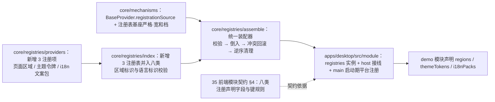

# 01 实施 · 扩展点注册表补齐与统一装配

> 前端插件化 · 01 扩展点与装配 · 子任务 01（需求 05-1）· 实施记录

[文档首页](../../../../../../文档首页.md) › [01 扩展点与装配](../01_扩展点与装配_01_扩展点注册表补齐与统一装配.md) › 实施记录　|　[← 任务](../01_扩展点与装配_01_扩展点注册表补齐与统一装配.md)　[测试记录 →](../测试/01_测试_01_扩展点注册表补齐与统一装配.md)

## 1. 实施信息 

| 项 | 值 |
| --- | --- |
| 任务 | [01 扩展点注册表补齐与统一装配](../01_扩展点与装配_01_扩展点注册表补齐与统一装配.md) |
| 对应需求 | [05-1](../../../../需求/01_需求_扩展点与装配.md#r05-1) |
| 详细设计 | [01 详细设计](../设计/01_详细设计_01_扩展点注册表补齐与统一装配.md) |
| 实施日期 | 2026-09-21 |
| 实施人 | minjian |
| 实施环境 | 本地开发机（Node v24.20.0 / npm 11.19.0，npmmirror） |
| 提交 | 设计 `1daeb816`；设计对齐 `5a4d0413`；口径回写 `e9647d22`；实施 `52e466de`；登记与记录随本次文档提交 |
| 结论 | 完成 |

## 2. 实施概览 

结果小结：八类扩展点注册表就位并统一基于注册表基座与注册项契约；平台自身注册与模块注册收敛到核心统一装配器（来源可查、无残留）；「不注册不可用」护栏含 fixture 拦截；演示模块实际使用三类新声明。

## 3. 实施过程 

1. **基座增强（兼容变更）**：`BaseProvider` 增可选可写字段 `registrationSource`（由装配器登记时打标）；`BaseProviderRegistry` 增公开 getter `duplicatePolicy`（缺省 `strict` 抛 `REGISTRY_CONFLICT`，`lenient` 告警保留首个），`register` 签名不变。
2. **注册项三类**（`core/src/registries/providers.ts`）：`PageAreaProvider(key, area, component, order?)`、`ThemeTokenProvider(key, tokens, mode?)`、`I18nPackProvider(key, messages)`（语言标识段自键派生并小写归一）；新增 `PAGE_AREA_ID_PATTERN`（点分区域标识）、`LOCALE_TAG_PATTERN`（小写 BCP-47）两个模式常量。
3. **注册表三类**（`core/src/registries/index.ts`）：`PageAreaRegistry`（`resolveByArea` / `areas`）、`ThemeTokenRegistry`（`resolve` / `byMode`）、`I18nPackRegistry`（`resolve` / `byLocale`，入参小写归一）；新增 `assertPageAreaId` / `assertLocaleTag`；`FrontendRegistries` 与 `createRegistries()` 扩到八类（顺序：路由·菜单 / 页面区域 / 通用组件 / 字段渲染器 / 图标 / 工作台卡片 / 主题令牌 / i18n 文案包）。
4. **统一装配器**（`core/src/registries/assemble.ts`，新增）：`assembleRegistrations(registries, source, registration)` 与 `releaseRegistrations(registries, keys)`；`PLATFORM_SOURCE = 'platform'`。
   - 两段式：`buildPlan` 先对全部声明校验（命名空间键 / 模块前缀 / 区域标识 / 语言标识 / icon key / 路由路径），校验全通过后再逐项倒入；
   - 倒入途中冲突即 `releaseRegistrations` 回滚本次已登记项后抛错（无残留）；
   - 登记键格式 `<分组>:<键>`（`route` / `component` / `icon` / `card` / `region` / `themeToken` / `i18nPack`）；清理按登记键**逆序**且幂等。
5. **模块声明扩展**（`core/src/module/types.ts`）：`ModuleRegistration` 增 `regions?` / `themeTokens?` / `i18nPacks?` 与对应结构声明接口（不引入 provider 实例，契约自包含）。
6. **宿主收敛**：`apps/desktop/src/module/registries.ts` 只保留八类注册表实例与 `PLATFORM_REGISTRATION`（移除 `applyModuleRegistration` / `removeRegistration`）；`host.ts` 改调核心装配器并新增 `installPlatformRegistrations()`；`main.ts` 在模块挂载前调用（时序：平台自身注册 → 模块注册 → 应用挂载）。
7. **演示模块**：`modules/demo/index.ts` 增 `regions`（`demo:hero` → `layout.header`）、`themeTokens`（`demo:brand`，`--bms-color-primary`）、`i18nPacks`（`demo:zh-cn` / `demo:en`）声明。
8. **用例（先登记后编码）**：Kiwi 登记 **976**（分类「平台骨架」/ P2 / CONFIRMED / 标签「自动化」），随后落 `core/tests/registries.spec.ts`（八域同一套契约断言 + 三类专有解析 + 拒重档位）、`core/tests/assemble.spec.ts`、`core/tests/guard-unregistered-provider.spec.ts`、`apps/desktop/tests/module-registration.spec.ts`（首行 `// kiwi_id: 976`）。
9. **契约与登记回写**：《前端模块契约》§4 / §7、《前端基类清单》§4 / §9、《前端架构》§9、《扩展点与插件化》§7.2、《概要设计 · 前端插件化》§2.1 / §5.2；需求 05-1、任务、README、计划的八类枚举同步补 i18n 文案包。

## 4. 问题与处置 

| # | 问题 / 现象 | 原因 | 处置 |
| --- | --- | --- | --- |
| 1 | `tsc` 报 `IconProvider` 的 `source` 与基类 `BaseProvider.source` 不兼容 | 「注册项来源」字段名与既有图标资源字段 `source` 撞名 | 基座字段改名 **`registrationSource`**，并同步回写详细设计 §3.3 / §8 决策 5（不改为改图标字段，避免动既有 API） |
| 2 | 需求 / 任务 / README / 计划写「八类」但括注只枚举 7 项；《概要设计》§5.2 / §8 列 8 项含 i18n 文案包 | 文档口径不一致（阶段五需求从概要「八类」计数派生时漏掉文案包） | **先报冲突后拍板**：取**真八类**——本期补三类（页面区域 / 主题令牌 / i18n 文案包），并同步回写四处枚举与两个架构节点扩展点清单 |
| 3 | i18n 文案包语言标识与统一键模式冲突（项目 locale 口径为 `zh-CN`，命名空间键模式仅允许小写） | 两处口径来源不同 | 拍板取**键内小写归一**（`zh-cn`）复用统一键模式；`byLocale` 入参先小写归一再比对，消费端零转换 |
| 4 | 装配中途校验失败 / 同键冲突会留下部分登记 | 单趟倒入无回滚 | 统一装配器改为**两段式**（先整体校验、后逐项倒入）+ 冲突回滚，并补两条用例（校验失败零登记 / 冲突回滚无残留） |

## 5. 验证结果 

| 验证点 | 方法 | 结果 |
| --- | --- | --- |
| 类型检查 / Lint（核心三包） | 根 `npm run check`（core / vue / ui-ep typecheck + lint + test） | 通过 |
| 单测（核心） | `npm run core:test` | 89 文件 / 1134 用例全通过（本轮新增 3 文件、扩写 1 文件） |
| 单测（宿主） | `apps/desktop` `test:cov` | 11 文件 / 38 用例全通过 |
| 宿主类型 / Lint / 构建 / 体积 | `vue-tsc -b` / `lint` / `build` / `budget` | 通过；首屏合计 128.4 KB（预算 260 KB），首屏最大单文件 112.1 KB（预算 150 KB） |
| 基座完整性 | `scripts/tools/base-check/check-base.py` | 通过（清单一致 171 / 171，跨文档编号引用 0 处） |
| 文档链接 | `scripts/tools/base-check/check-links.py` | 断链 0 / 失效锚点 0 |
| Kiwi 用例 | `register_cases.py` 登记并回读 | 976（新建 1 / 跳过 0 / 失败 0） |

## 6. 偏差与遗留 

- **偏差**：① 注册项来源字段由设计的 `source` 改为 `registrationSource`（与图标资源字段冲突，见问题 1）；② 按冲突拍板结果本期补**三类**扩展点（原需求内容清单列两类），详见问题 2，已同步需求 05-1 / 任务 / README / 计划 / 概要设计与两个架构节点。
- **遗留**：
  1. **宿主渲染消费未接线**——页面区域插槽渲染、主题令牌注入 `--bms-*`、模块文案并入宿主 i18n 均未落地（随 `01_02` 与全页面、国际化阶段），归口见本任务详细设计 §7；
  2. 注册表基座**宽和档**已具备但八类均未启用（分档依据待各域消费方明确）；
  3. 《概要设计 · 前端插件化》§5.2「注册表」列仍为语义标识（未改实现侧类名，符合《文档生成规范》§8.6 不写实现侧命名）；
  4. 注册表按模块归因观测与清单对账面扩展（`guard-base-registry`）随后续治理任务。

> 本文档依《[文档生成规范](../../../../../../规范/文档生成规范.md)》编写
