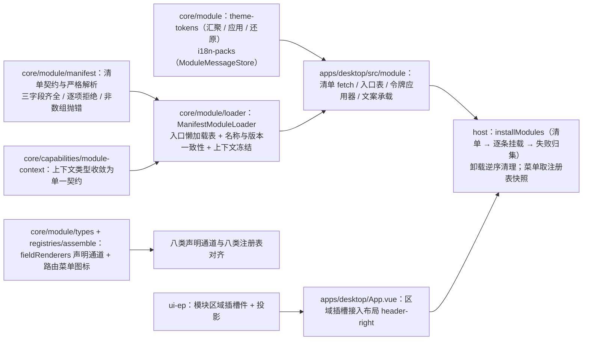

# 02 实施 · 宿主加载器运行时化与模块契约远端对接

> 前端插件化 · 01 扩展点与装配 · 子任务 02（需求 05-2）· 实施记录

[文档首页](../../../../../../文档首页.md) › [01 扩展点与装配](../01_扩展点与装配_02_宿主加载器运行时化与模块契约远端对接.md) › 实施记录　|　[← 任务](../01_扩展点与装配_02_宿主加载器运行时化与模块契约远端对接.md)　[测试记录 →](../测试/01_测试_01_扩展点与装配_02_宿主加载器运行时化与模块契约远端对接.md)

## 1. 实施信息 

| 项 | 值 |
| --- | --- |
| 任务 | [02 宿主加载器运行时化与模块契约远端对接](../01_扩展点与装配_02_宿主加载器运行时化与模块契约远端对接.md) |
| 对应需求 | [05-2](../../../../需求/01_需求_扩展点与装配.md#r05-2) |
| 详细设计 | [01 详细设计](../设计/01_详细设计_01_扩展点与装配_02_宿主加载器运行时化与模块契约远端对接.md) |
| 实施日期 | 2026-09-21 |
| 实施人 | minjian |
| 实施环境 | 本地开发机（Node v24.20.0 / npm 11.19.0，npmmirror） |
| 提交 | 设计 `69e88678`；实施 `0b040cfd`；登记与记录随本次文档提交 |
| 结论 | 完成 |

## 2. 实施概览 

结果小结：宿主加载器由「本地定义表」换为「**清单驱动**」（同 `ModuleLoader` 接口、装配不变）；清单缺字段 / 版本不匹配 / 加载失败一律拒绝加载并记错误状态，清单获取失败不阻塞启动；八类声明通道补齐**字段渲染器**；`01_01` 遗留的宿主渲染消费三项（区域插槽渲染 / 令牌注入 / 文案并入）接线闭环，随挂载生效、卸载还原；菜单来源收敛为路由·菜单注册表快照；演示模块改由清单加载（不再静态 `import`）。

## 3. 实施过程 

1. **清单契约与解析**（`core/src/module/manifest.ts`，新增）：`ModuleManifestEntry`（名称 / 入口 / 版本）+ `parseModuleManifest` 严格解析——整份非数组抛 `CAPABILITY_VIOLATION`，单项缺字段 / 名非法 / 重名逐项拒绝并给出原因，其余项照常。
2. **清单驱动加载器**（`core/src/module/loader.ts`）：新增 `ManifestModuleLoader`（清单为唯一来源、入口经 `ModuleEntryTable` 懒加载表解析）；`load` 校验序为「清单条目 → 入口登记 → 入口默认导出模块定义 → 名称与版本严格一致」，上下文 `Object.freeze({ ...context })` 后交 `setup`；`ModuleLoader` 接口仅补 `context` 可选参数（兼容既有实现），`LocalModuleLoader` 保留供构建期合并形态与既有用例。
3. **上下文契约收敛**（`core/src/capabilities/module-context.ts`）：删除与模块契约同形的 `ModuleContext`，`BaseModuleContext` 直接消费 `ModuleHostContext`（`ModuleContextKey = keyof ModuleHostContext`），`inject` 缺省空对象；核心入口移除 `ModuleContext` 导出。
4. **八类声明通道补齐**（`core/src/module/types.ts`、`core/src/registries/assemble.ts`）：`ModuleRegistration` 增 `fieldRenderers?`、统一装配器增 `fieldRenderer` 分组（键命名空间 + 前缀校验、登记键 `fieldRenderer:<键>`、可逆序清理）；路由·菜单装配补 `meta.icon`（供菜单派生直接消费）。
5. **令牌机制**（`core/src/module/theme-tokens.ts`，新增）：`collectThemeTokens`（按登记序合并，支持按模式筛选）、`applyThemeTokens`（返回已写入令牌名）、`releaseThemeTokens`（逆序还原）；写回目标 `ThemeTokenTarget` 由宿主注入——**核心不触 DOM**。
6. **模块文案承载**（`core/src/module/i18n-packs.ts`，新增）：`ModuleMessageStore`（语言标识自键派生并小写归一；`merge` 返回并入键、`restore` 逆序还原且幂等、`translate` / `messagesOf` / `locales`；未命中返回 `undefined`，不跨来源兜底）。
7. **区域插槽件**（`ui-ep/src/components/layout/ModuleAreaOutlet.vue` + `composables/useModuleArea.ts`，新增）：按区域标识读注册表、按顺序提示稳定排序渲染，未知区域 / 空区域渲染为空；挂接组件为函数时经 `defineAsyncComponent` 解析并缓存；经投影承接布局与容器组件基类（同「主框架布局壳」口径）；组件随装配版本号重算；`ui-ep/src/index.ts` 导出。
8. **宿主装配改造**（`apps/desktop/src/module/`）：
   - 新增 `manifest.ts`（清单 fetch，失败按空清单 + 原因返回）、`entries.ts`（`import.meta.glob` 入口懒加载表，清单 `entry` 即表键）、`themeTokens.ts`（根元素令牌应用器）、`i18n.ts`（文案承载实例）；
   - `registries.ts` 增装配版本号 `registriesRevision`（注册表实例非响应式，视图据此重算）；
   - `host.ts` 改为「`installModules`（清单 → 构造加载器 → 逐条挂载 → 失败归集）+ `mountModule`（加载 → 挂载 → 路由 → 注册表 → 令牌 → 文案，失败回滚本次接线）+ `unmountModule`（路由 → 文案 → 令牌 → 注册表 → 加载器，逆序幂等）+ `moduleMenuNodes()`（取路由·菜单注册表快照）」；
   - `public/modules.json`（清单外置）+ `App.vue`（`MainLayout` 的 `header-right` 插槽内渲染区域插槽件、菜单节点取自注册表）+ `main.ts`（`bootstrap()` 内 `await installModules(...)` 后再 `app.mount`）+ 演示模块入口补**默认导出**。
9. **用例（先登记后编码）**：Kiwi 登记 **977**（分类「平台骨架」/ P2 / CONFIRMED / 标签「自动化」），随后落 `core/tests/{module-manifest,module-loader,theme-tokens,i18n-packs}.spec.ts`、扩写 `core/tests/assemble.spec.ts`、新增 `ui-ep/tests/module-area-outlet.spec.ts`、新增 `apps/desktop/tests/module-manifest.spec.ts` 并改造 `module-hosting.spec.ts` / `module-registration.spec.ts`（首行 `// kiwi_id: 977`）。
10. **契约与登记回写**：《[前端模块契约](../../../../../../设计/架构设计/35_架构设计_前端模块契约.md)》§3 / §4 / §5 / §6、《[前端架构](../../../../../../设计/架构设计/08_架构设计_前端架构.md)》§9、《[扩展点与插件化](../../../../../../设计/架构设计/10_架构设计_子系统_扩展点与插件化.md)》§7.2、《[概要设计 · 前端插件化](../../../../../../设计/概要设计/38_概要设计_前端插件化.md)》§5.2、《[前端基类清单](../../../../../../前端基类清单.md)》§9、任务与计划状态、阶段 README。

## 4. 问题与处置 

| # | 问题 / 现象 | 原因 | 处置 |
| --- | --- | --- | --- |
| 1 | `defineAsyncComponent(component as () => Promise<unknown>)` 类型不通过 | 入参需 `AsyncComponentLoader` | 改为 `defineAsyncComponent(component as AsyncComponentLoader)`；用例侧假加载器改为**直接返回组件对象**（Vue 仅解包 ES 模块，普通 `{ default }` 形状不会被解包）——并在用例中注明模块声明的 `() => import('...')` 由 Vue 自动解包 |
| 2 | 清单重名口径歧义：前项自身被拒时，其后同名合法项是否也算重名 | 设计文字「保留首项」未区分前项是否校验通过 | 口径定为「**保留先通过项**，后续重名项拒绝；前项被拒不影响后续同名项」，并回写详细设计 §3.1 校验表 |
| 3 | 区域插槽件的继承链与「布局组件类」表述 | 组件设计总览表述布局组件类继承布局组件基类，而本件按容器语义承载 | 取**主链布局组件基类 + 容器语义复用容器组件基类**（与「主框架布局壳」同口径），回写详细设计 §3.8 / 决策 16 与组件设计节点「继承链」行 |
| 4 | 启动时序需「装载完成后挂应用」，但顶层 `await` 与构建目标耦合 | 主入口顶层 await 受构建目标限制 | `main.ts` 以 `bootstrap()` 异步函数包裹 `await installModules(...)` 后再 `app.mount(...)`（语义等价、与构建目标解耦） |
| 5 | 宿主覆盖：装配冲突回滚分支、清单未装载分支未执行 | 新失败分支无用例 | 补「装配冲突回滚本次接线」「清单未装载时挂载拒绝」「非 Error 异常」三条用例；`module/` 行覆盖回到 100% |
| 6 | 仓库级无 prettier 配置，改动文件格式口径不一 | 既有约定：用宿主 `.prettierrc.json` 手工跑 | 仅对本次改动文件执行 `npx prettier --config frontend/apps/desktop/.prettierrc.json --write`（未全库格式化，避免无关 diff） |

## 5. 验证结果 

| 验证点 | 方法 | 结果 |
| --- | --- | --- |
| 类型 / Lint / 单测（核心三包） | 根 `npm run check` | 通过（core 93 文件 / 1155 用例；vue 2 / 5；ui-ep 61 / 901） |
| 宿主类型 / Lint | `vue-tsc -b` / `lint` | 通过 |
| 宿主单测与覆盖率 | `test:cov` | 12 文件 / 47 用例全通过；宿主语句 87.71%（`module/` 100%） |
| 宿主构建 / 体积 | `build` / `budget` | 通过；首屏合计 130.6 KB（预算 260 KB）、首屏最大单文件 113.9 KB（预算 150 KB）；**演示模块独立 chunk**（异步块 18 个） |
| 基座完整性 | `scripts/tools/base-check/check-base.py` | 通过（清单一致 171 / 171，跨文档编号引用 0 处） |
| 文档链接 / 阶段状态 | `check-links.py` / `check-docs/check-status.py --stage 05_前端插件化 --strict` | 通过（断链 0 / 失效锚点 0；检查 96 项，硬规则不合规 0） |
| Kiwi 用例 | 平台登记并回读 | 977（新建 1 / 跳过 0 / 失败 0） |

## 6. 偏差与遗留 

- **偏差**：① 加载器实现类命名 `ManifestModuleLoader`（设计 §3.2 一致，`02_01` 的远端实现另取名）；② 区域插槽件继承链按「主链布局组件基类 + 容器语义复用」（见问题 3，设计已回写）；③ 清单重名口径细化（见问题 2，设计已回写）；④ 启动装载以 `bootstrap()` 异步包裹而非顶层 `await`（语义等价，见问题 4）。
- **遗留**：
  1. **远端入口形态**：本任务 `entry` 为模块源码标识（懒加载表键）；远端入口 URL / Module Federation container 归 `02_01`（加载器实现替换、清单结构与接口不变）；
  2. **清单治理**：清单唯一来源、版本发现、灰度 / 回滚归 `03_02`；
  3. **i18n 最终消费**：宿主尚未引入 vue-i18n（归国际化阶段）；`moduleI18n` 作为轻量承载，届时以适配层替换内部实现；
  4. **令牌模式维度**：`mode` 当前仅作检索标注，注入时不区分模式（模式化切换随主题 / 品牌化阶段）；
  5. **`LocalModuleLoader` 去留**：供构建期合并形态与既有用例使用，去留随 `02_01` 评估；
  6. **`01_01` 遗留条目**：宿主渲染消费三项已由本任务闭环，其余条目（注册表宽和档启用、按模块归因观测、清单对账面扩展）仍随后续治理任务。

> 本文档依《[文档生成规范](../../../../../../规范/文档生成规范.md)》编写
