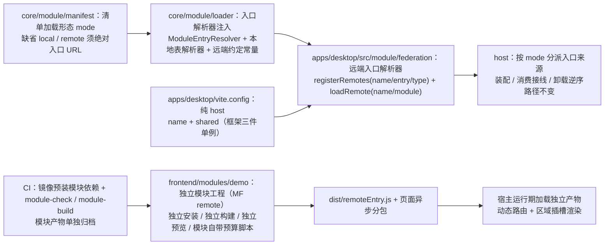

# 01 实施 · Module Federation 接入与模块独立构建

> 前端插件化 · 02 运行时加载 · 子任务 01（需求 05-3）· 实施记录

[文档首页](../../../../../../文档首页.md) › [02 运行时加载](../02_运行时加载_01_ModuleFederation接入与模块独立构建.md) › 实施记录　|　[← 任务](../02_运行时加载_01_ModuleFederation接入与模块独立构建.md)　[测试记录 →](../测试/01_测试_02_运行时加载_01_ModuleFederation接入与模块独立构建.md)

## 1. 实施信息 

| 项 | 值 |
| --- | --- |
| 任务 | [01 Module Federation 接入与模块独立构建](../02_运行时加载_01_ModuleFederation接入与模块独立构建.md) |
| 对应需求 | [05-3](../../../../需求/02_需求_运行时加载.md#r05-3) |
| 详细设计 | [01 详细设计](../设计/01_详细设计_02_运行时加载_01_ModuleFederation接入与模块独立构建.md) |
| 实施日期 | 2026-09-21 |
| 实施人 | minjian |
| 实施环境 | 本地开发机（Node v24.20.0 / npm 11.19.0，npmmirror）；宿主 Vite 8.2.2（Rolldown）；`@module-federation/vite` 1.22.1 + `@module-federation/runtime` 2.9.0（均精确锁定） |
| 提交 | 设计 `055a64df`；实施 `77255227`；格式对齐 `c20e15cf`；登记与记录随本次文档提交 |
| 结论 | 完成 |

## 2. 实施概览 

结果小结：宿主接入 Module Federation 作**纯 host**，远端地址来自模块清单、在**运行期**登记与加载（改清单不必重构建）；清单以新增的**加载形态**显式区分「构建期合并」与「运行时远端」，两者由**同一加载器**（入口来源经**解析器注入**）与同一校验链承接，装配 / 卸载路径完全一致；演示模块**整体迁出**为独立模块工程（独立安装、独立构建、独立产物、独立计量），宿主运行期加载其构建产物——动态路由生效、区域插槽渲染、宿主产物内**不含**模块页面代码（非构建期合并）。

## 3. 实施过程 

1. **清单加载形态**（`core/src/module/manifest.ts`）：新增 `ModuleLoadMode`（`local` / `remote`）与条目字段 `mode`（缺省归一为 `local`，解析后恒有值）；校验序为「名 → 入口 → 版本 → 形态取值合法 → `remote` 入口须为绝对 URL → 重名」；新增导出 `DEFAULT_LOAD_MODE` / `LOAD_MODES` / `REMOTE_ENTRY_PATTERN`。
2. **加载器入口解析器注入**（`core/src/module/loader.ts`）：新增 `ModuleEntryResolver`（`(entry) => Promise<ModuleEntryModule>`）与 `createModuleEntryTableResolver`（本地表单形态）；`ManifestModuleLoader` 第二参由「入口懒加载表」改为「入口解析器」，校验链（默认导出形状 → 名称与版本严格一致 → 上下文冻结 → `setup`）**原样保留**；`LocalModuleLoader` **删除**（实现收敛为一套，修订 `01_02` 决策 12）；新增远端约定常量 `MODULE_REMOTE_ENTRY_FILE` / `MODULE_EXPOSE_KEY` 与 `remoteEntryUrl` 拼接工具；核心入口导出同步更新。
3. **宿主接入 MF**（`apps/desktop/vite.config.ts`、`package.json`）：新增 `federation({ name: 'bms-desktop', shared })`——**纯 host**（不声明静态 `remotes` / `exposes`）；共享依赖初始为六件（框架三件 + UI 组件库 + 两个平台基座包），后按实测**收窄为框架三件**（见 §4 问题 1 / 2）；依赖精确锁定插件 1.22.1 与运行时 2.9.0。
4. **远端入口解析器**（`apps/desktop/src/module/federation.ts`，新增）：`registerRemotes([{ name, entry, type: 'module' }], { force: true })` 按清单名与入口 URL 登记容器（`force` 保证重入幂等），`loadRemote('<模块名>/module')` 按固定暴露键加载模块定义；**只登记与加载**，形状与版本校验交由加载器统一执行；导出本地演示远端 origin 常量。
5. **宿主按形态分派**（`apps/desktop/src/module/host.ts`、`entries.ts`、`public/modules.json`）：`entries.ts` 由「入口表」改为导出**本地入口解析器**（`import.meta.glob` 懒加载表，当前无存量模块）；`host.ts` 在 `installModules` 内构造「按 `mode` 分派」的解析器表（`local` → 本地表解析器、`remote` → 远端解析器）；演示清单改为远端条目（`mode: remote` + 绝对入口 URL）；删除宿主内演示模块 `src/modules/demo/**`。
6. **模块独立工程**（`frontend/modules/demo/`，新增）：与 `apps/desktop` 同构的独立工程——`package.json`（`@bms/module-demo`，`@bms/core` / `@bms/ui-ep` 以 `file:` 依赖链接源码直出包）、`package-lock.json`、`vite.config.ts`（MF remote：`name: demo` / `filename: remoteEntry.js` / `exposes: { './module': './src/index.ts' }` / 与宿主一致的 `shared`；预览端口 5002 且放开 CORS）、`vitest.config.ts`、`tsconfig*.json`、`eslint.config.js`、`.prettierrc.json`、`.npmrc`、`index.html`（独立预览壳 + 最小令牌兜底）、`src/{index.ts,standalone.ts,env.d.ts,views/}`、`tests/module-definition.spec.ts`；模块定义由宿主迁入并补齐**字段渲染器**声明（八类声明通道齐全）。
7. **模块产物单独计量**（`frontend/modules/demo/budget.json`、`scripts/check-bundle-budget.mjs`，新增）：入口块口径为**引用闭包**（自 `remoteEntry.js` 出发，种子追静态与动态引用、其余只追静态引用），校验「入口闭包 gzip 合计 / 单块上限 / 入口块数上限 / 入口闭包不得命中页面块命名特征 / 入口外异步块数下界」，并打印入口外块观察值；阈值取实测基线 + 20%。
8. **装配时序修正**（`apps/desktop/src/main.ts`）：路由安装（`app.use(router)`，Vue Router 在安装时即发起初始导航）后移至**模块装载完成之后**，保证首屏直连模块路由不被兜底 404 命中（见 §4 问题 4）。
9. **CI 接线**（`.gitlab-ci.yml`、`deploy/ci/Dockerfile.frontend`、`deploy/ci/build-base.sh`）：`ci-frontend` 镜像增装模块工程依赖（`/opt/ci/frontend/modules/<模块>`，并同置 `frontend/packages` 供 `file:` 依赖解析）；`ci-base-build` 哈希输入与触发路径纳入模块锁文件；新增 `module-check`（lint + typecheck + test）与 `module-build`（build + budget + 产物 `dist/` 归档）；宿主 job 路径规则已覆盖 `frontend/**/*`，无需改动。
10. **用例（先登记后编码）**：Kiwi 登记 **978**（分类「平台骨架」/ P2 / CONFIRMED / 标签「自动化」），随后落 `core/tests/{module-manifest,module-loader,module}.spec.ts` 扩写、新增宿主 `tests/module-federation.spec.ts` 与 `tests/support/module-fixture.ts`、改造宿主 `module-hosting` / `module-registration` / `module-manifest` 用例（MF 运行时常量经 `vi.mock` 替身）、新增模块工程 `tests/module-definition.spec.ts`。
11. **契约与登记回写**：《[前端模块契约](../../../../../../设计/架构设计/35_架构设计_前端模块契约.md)》§4 / §6 / §7、《[前端架构](../../../../../../设计/架构设计/08_架构设计_前端架构.md)》§9、《[扩展点与插件化](../../../../../../设计/架构设计/10_架构设计_子系统_扩展点与插件化.md)》§7.2、《[概要设计 · 前端插件化](../../../../../../设计/概要设计/38_概要设计_前端插件化.md)》§5.2、《[前端基类清单](../../../../../../前端基类清单.md)》§9、《[前端开发规范](../../../../../../规范/前端开发规范.md)》「构建体积预算」、任务与计划状态、阶段 README。

## 4. 问题与处置 

| # | 问题 / 现象 | 原因 | 处置 |
| --- | --- | --- | --- |
| 1 | 宿主共享 `element-plus` 后首屏 660.7 KB / 单块 334.5 KB（超预算 2.5 倍） | 插件为「宿主自身未静态引入的共享库」生成整库 share provider 块，并由宿主入口**静态引入**（首屏必下）；实测显式 `eager: false` 产物字节不变（无效） | 拍板**收窄 `shared` 为框架三件**（`vue` / `vue-router` / `pinia`）；UI 组件库共享归 `02_02`（需先解决插件启动期静态拉取），回写设计 §3.3 / §7 与决策 10 |
| 2 | 平台基座包（`@bms/core` / `@bms/ui-ep`）未进入共享面 | 宿主以 `resolve.alias` 源码直出消费，模块请求被改写为绝对路径，MF 探测不到 | 按设计 §7 既定口径**回退为双侧各自打包**（模块工程以 `file:` 依赖自带副本；装配器按键重建注册项、不做 `instanceof`，跨副本类实例安全）；登记为开放项 |
| 3 | 宿主运行期加载报 `#RUNTIME-001 Failed to get remoteEntry exports` | 运行期 `registerRemotes` 未声明远端入口类型，缺省按经典脚本容器处理 | 在 `registerRemotes` 显式声明 `type: 'module'`（Vite 产物为 ESM），并加用例断言与该常量的成文注释 |
| 4 | 首屏直连 `/demo` 落兜底 404（菜单点击进入则正常） | Vue Router 在 `app.use(router)` **安装时**即发起初始导航，而模块路由注册发生在其后，404 一旦命中不会自动重导 | `main.ts` 将路由安装后移至**模块装载之后**（`app.use(router)` → `app.mount`），并加注释说明；端到端实测直连模块路由可命中 |
| 5 | 模块工程类型检查报 `bpmn-moddle` 悬空类型（TS7016） | 该包自带类型不含构造器声明，`@bms/ui-ep` 源内的补声明文件不随包解析进入编译 | 模块工程补 `src/env.d.ts`（与 `packages/ui-ep/src/env.d.ts`、宿主 `src/env.d.ts` 同口径）；三方重复登记为遗留（归基座包发布治理） |
| 6 | 模块工程安装后缺 `echarts` / `bpmn-js` 等第三方依赖 | `file:` 依赖不安装被链接包自身的 `dependencies` | 经仓库根 workspace `node_modules` 向上解析（与宿主同机制）；CI 的模块 job 与 `desktop-build` 同口径复制 `/opt/ci/workspace/node_modules` 到仓库根 |
| 7 | 设计 §3.5 的入口块口径（`remoteEntry* + __federation_expose_module*`）与实际产物不符（暴露块按源文件命名） | 设计预判的产物命名假设不成立 | 改用**引用闭包**口径（自 `remoteEntry.js` 解析静态 + 动态引用，其余块只追静态引用），并补「入口块数上限 + 页面块命名特征」断言；回写设计 §3.5 与决策 9 |
| 8 | 宿主内演示模块源码未真正删除（首次删除命令未获批准已取消，`import.meta.glob` 仍收集到它） | 操作未落地即继续后续步骤 | 用文件删除工具完成删除并重建验证（宿主产物内不再含模块页面代码、首屏回落至 172.7 KB） |
| 9 | 模块工程构建生成 `.mf/diagnostics/latest.json` 等诊断产物 | MF 插件构建诊断目录 | `.gitignore` 补 `.mf/`（构建产物不入库） |
| 10 | 新增 / 改动文件格式与仓库口径不一致 | 模块工程为新建目录、宿主既有文件格式口径由 prettier 统一 | 仅对本次涉及文件按宿主 `.prettierrc.json` 执行 `prettier --write`（未全库格式化，避免无关 diff），另起 `style(02_01)` 提交 |

## 5. 验证结果 

| 验证点 | 方法 | 结果 |
| --- | --- | --- |
| 类型 / Lint / 单测（核心三包） | 根 `npm run check` | 通过（core 93 文件 / 1158 用例；vue 2 / 5；ui-ep 61 文件 / 901 用例） |
| 宿主类型 / Lint | `vue-tsc -b` / `lint` | 通过 |
| 宿主单测与覆盖率 | `test:cov` | 13 文件 / 53 用例全通过；语句 88.47%（`src/module/` 100%，其中 `federation.ts` 100%） |
| 宿主构建 / 首屏体积 | `build` / `budget` | 通过；首屏合计 **172.7 KB**（预算 260 KB）、首屏最大单文件 **76.6 KB**（预算 150 KB）；宿主产物内**不含**模块页面代码 |
| 模块工程门禁 | `typecheck` / `lint` / `test` / `build` / `budget` | 通过（用例 1 文件 / 4 用例）；产物含 `dist/remoteEntry.js`；容器入口闭包 **8.8 KB / 6 块**（预算 12 KB / 8 块 / 上限 8），页面异步块命中 `DemoHome` / `DemoToolbox` |
| 端到端运行时加载（需求完成标准 1 / 2） | 模块 `vite build` → `vite preview`（5002）供产物；宿主 `vite build` → `vite preview`（4173）经清单 `http://localhost:5002/remoteEntry.js` 运行期加载；无头浏览器渲染 `http://localhost:4173/demo` | 通过：页头区域插槽渲染远端区域项（`layout.header` → 虚拟列表 / 滚动容器），`/demo` 路由渲染远端模块页面（含「运行时远端模块 · 经 Module Federation 独立构建并由宿主加载」文案），**无 404**；宿主产物中无模块页面代码（非构建期合并） |
| 基座完整性 | `scripts/tools/base-check/check-base.py` | 通过（清单一致 171 / 171，跨文档编号引用 0 处） |
| 文档链接 / 阶段状态 | `check-links.py` / `check-docs/check-status.py --stage 05_前端插件化 --strict` | 通过（断链 0 / 失效锚点 0；硬规则不合规 0） |
| CI 配置 | `sh -n deploy/ci/build-base.sh` / YAML 解析 | 通过（新增 `module-check` / `module-build` 段解析正常） |
| Kiwi 用例 | 平台登记并回读 | **978**（新建 1 / 跳过 0 / 失败 0） |

## 6. 偏差与遗留 

- **偏差**：
  1. **`shared` 集合收窄**（框架三件）——设计原定六件，按实测（宿主共享 UI 组件库会整库拉入首屏）拍板收窄，已回写设计 §3.3 / §7 与决策 10；
  2. **入口块计量口径改为引用闭包**——设计 §3.5 原按产物命名假设，实测不成立，已回写；
  3. **远端入口类型常量新增**（`MODULE_REMOTE_ENTRY_TYPE = 'module'`）——设计未列，为运行期登记必需（否则 RUNTIME-001），已补入宿主解析器并成文；
  4. **宿主装配时序修正**——`main.ts` 路由安装后移（设计未列），为「首屏可命中模块路由」的既定口径所必需；
  5. **模块工程新增 `src/env.d.ts`**（`bpmn-moddle` 补声明）——设计未列，为类型检查通过所必需；
  6. **`prettier` 格式对齐另起提交**（`style(02_01)`）。

- **遗留**：
  1. **UI 组件库（`element-plus`）共享**：宿主共享会把整库以 share provider 块拉入首屏（+334.5 KB gzip），归 `02_02` 评估（`treeShaking.runtime-infer`、provider 懒加载、运行时手工 `init` 等，前提是解决插件启动期静态拉取）——**`02_02` 已闭环**：受控实测（`eager:false` + `treeShaking runtime-infer` 首屏门禁降至 131.5 KB，但启动期仍异步拉取 provider 284.9 KB + tree-shaking 148.3 KB ≈ 433 KB，属指标失真）判定不可行，**登记为受控非共享项**（含版本要求与模块产物体积阈值），复评条件见 `02_02` 实施记录 §6；
  2. **平台基座包共享**：`@bms/core` / `@bms/ui-ep` 经宿主 `resolve.alias` 消费时 MF 探测不到，本任务回退为双侧各自打包；**发布版本化 / 共享 scope 化**随基座包发布治理评估——**`02_02` 已闭环**：机制判定为「无从共享」（源码直出 + 别名消费，无 provider 块），按其登记为受控非共享项，共享前提（发布版本化 / 共享域化）作为开放项；
  3. **模块工程依赖解析依赖仓库根 workspace 依赖集**（`file:` 依赖不安装被链接包的第三方依赖）——已按宿主同机制在 CI 复制根依赖集，长期宜改为模块工程显式声明或基座包发布化；
  4. **`bpmn-moddle` 补声明三方重复**（`packages/ui-ep/src/env.d.ts` / 宿主 / 模块工程）——宜随基座包发布治理收敛为包内类型或共享声明；
  5. **清单治理**：清单唯一来源、版本发现、灰度 / 回滚、生产远端入口地址替换归 `03_02`（本任务为本地演示地址）——**已完成**：清单唯一来源 / 版本发现 / 发布回滚就位（清单指向版本目录）；**生产远端入口地址**经拍板调整为部署阶段（部署侧清单）；
  6. **可观测**：远端入口缓存 / 版本化 URL、sourcemap 口径、按模块体积与错误归因归 `03_03`；
  7. **隔离**：模块样式前缀与全局污染护栏、沙箱评估归 `03_01`；
  8. **`01_02` 遗留闭环**：遗留 1（远端入口形态）与遗留 5（`LocalModuleLoader` 去留）由本任务闭环；其余（注册表宽和档、按模块归因、清单对账面扩展）仍随后续治理任务。

> 本文档依《[文档生成规范](../../../../../../规范/文档生成规范.md)》编写
