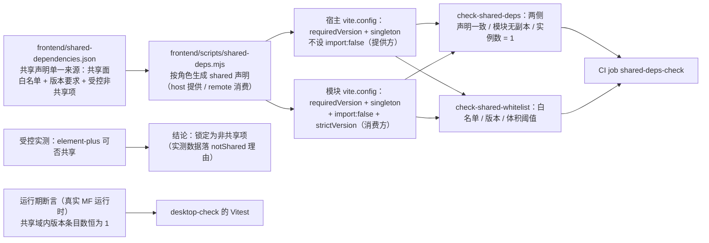

# 01 实施 · 依赖共享与版本偏斜治理

> 前端插件化 · 02 运行时加载 · 子任务 02（需求 05-4）· 实施记录

[文档首页](../../../../../../文档首页.md) › [02 运行时加载](../02_运行时加载_02_依赖共享与版本偏斜治理.md) › 实施记录　|　[← 任务](../02_运行时加载_02_依赖共享与版本偏斜治理.md)　[测试记录 →](../测试/01_测试_02_运行时加载_02_依赖共享与版本偏斜治理.md)

## 1. 实施信息 

| 项 | 值 |
| --- | --- |
| 任务 | [02 依赖共享与版本偏斜治理](../02_运行时加载_02_依赖共享与版本偏斜治理.md) |
| 对应需求 | [05-4](../../../../需求/02_需求_运行时加载.md#r05-4) |
| 详细设计 | [01 详细设计](../设计/01_详细设计_02_运行时加载_02_依赖共享与版本偏斜治理.md) |
| 实施日期 | 2026-09-21 |
| 实施人 | minjian |
| 实施环境 | 本地开发机（Node v24.20.0 / npm 11.19.0，npmmirror）；宿主 Vite 8.2.2（Rolldown）；`@module-federation/vite` 1.22.1 |
| 提交 | 设计 `f40a0800`；实施与文档随本次提交 |
| 结论 | 完成（含一处与大版本升级无关的既有遗留、一处需用户处置的临时进程） |

## 2. 实施概览 

结果小结：共享声明收归**单一来源**（`frontend/shared-dependencies.json`），宿主与模块两侧构建配置**都从它生成**；宿主为提供方、模块为消费方（**不打包本地回退副本**、版本不满足即拒绝）；新增**构建期**产物级断言与白名单 / 体积护栏，并以**运行期**用例（真实 Module Federation 运行时）断言共享域内每个依赖的版本条目数为 1；UI 组件库经受控实测后**锁定为非共享项**；升级契约成文（规范节 + 资料文档）。

## 3. 实施过程 

1. **共享声明单一来源**（`frontend/shared-dependencies.json`，新增）：`shared`（共享面白名单 + `requiredVersion` + `singleton`）、`remoteOverrides`（消费方覆写：`import: false` + `suppressMissingImportWarning`）、`notShared`（受控非共享项：包名 + 理由 + 可选版本要求与体积阈值）。
2. **单一来源读取工具**（`frontend/scripts/shared-deps.mjs` + `shared-deps.d.mts`，新增）：`loadSharedDependencies({ role })` 按角色生成声明；`resolveSourcePath()` 兼容构建配置（`import.meta.url`）与测试运行器（目录向上查找）两种解析环境；类型声明解决两侧配置在 TS 下引用 `.mjs` 的类型缺失（TS7016）。
3. **宿主编排改造**（`frontend/apps/desktop/vite.config.ts`）：`shared` 改为 `loadSharedDependencies({ role: 'host' })`；宿主持有 `requiredVersion` 与 `singleton`，不设 `import: false`、不设 `strictVersion`（拒绝权在消费方）。
4. **模块编排改造**（`frontend/modules/demo/vite.config.ts`）：`shared` 改为 `loadSharedDependencies({ role: 'remote' })`，每项带 `import: false` + `suppressMissingImportWarning` + `strictVersion: true`。
5. **模块构建目标拆分**（同上 + `frontend/modules/demo/package.json`）：原单一构建把**独立预览壳**（自带框架本地副本）并入了远端产物图，其块会随暴露模块的依赖提示被宿主预下载；现拆为两目标——缺省 `dist/`（远端产物：只含容器与暴露模块，入口显式声明、不带 HTML 壳）与 `build:standalone` → `dist-standalone/`（独立预览产物，带 HTML 壳与本地框架）。
6. **受控实测（共享面决策）**：以 `frontend/shared-dependencies.json` 为变量开关，实测 `element-plus` 共享可行性（数据见 §4 问题 1）；结论落 `notShared`（含两次实测数据与判据说明）。
7. **构建期产物级断言**（`frontend/scripts/check-shared-deps.mjs`，新增）：解析两侧产物中 MF 生成的共享声明块，断言「共享面一致 / 版本要求一致 / 宿主为提供方 / 模块 `import:false` 且本地取值抛『必须由宿主提供』/ 依赖实例数 = 1」。
8. **白名单与体积护栏**（`frontend/scripts/check-shared-whitelist.mjs`，新增）：断言「两侧构建配置取自单一来源（禁止手写 shared）/ 模块依赖落白名单 / 两侧实装版本满足 `requiredVersion` / 非共享项体积不破阈值」。
9. **运行期实例数断言**（`frontend/apps/desktop/tests/shared-dependencies.spec.ts`，新增，Kiwi **979**）：以真实 `@module-federation/runtime` 建实例，断言共享域内每个共享依赖**版本条目数恒为 1**、版本满足要求、major 不一致不被接受；共享声明角色差异（提供方 / 消费方）另有用例。
10. **CI 接线**（`.gitlab-ci.yml`）：`desktop-build` / `module-build` 增产物归档；新增 `shared-deps-check` job（stage `build`，`needs` 两侧产物 artifact，跑两个脚本；失败即红）。
11. **口径与契约成文**：《[前端开发规范](../../../../../../规范/前端开发规范.md)》新增「依赖共享与版本偏斜」节（强制口径）；新增资料《[微前端 · 依赖升级契约](../../../../../../资料/知识档案/微前端/09_微前端_依赖升级契约.md)》（分级 / 协同流程 / 兼容窗口 / 适配清单 / 回退）；《[前端模块契约](../../../../../../设计/架构设计/35_架构设计_前端模块契约.md)》「与阶段五的衔接」节回写共享依赖行；知识档案总览与《[基座文档清单](../../../../../../基座文档清单.md)》登记新文档。
12. **工程口径配套**：模块工程 ESLint 忽略新增产物目录与 MF 诊断目录（`dist-standalone` / `.mf`）；仓库 `.gitignore` 忽略 `dist-standalone/`；宿主工程新增 `budget:shared` / `guard:shared` 脚本入口。

## 4. 问题与处置 

| # | 问题 / 现象 | 原因 | 处置 |
| --- | --- | --- | --- |
| 1 | **共享面决策**：`element-plus` 能否纳入共享 | 见下「受控实测数据」 | 拍板分支为「压不住则锁定为非共享项」→ 锁定，实测数据写入 `notShared` 理由 |
| 2 | 宿主与模块 `vite.config.ts` 引用 `.mjs` 报 TS7016 | TS 无法为 `.mjs` 推断类型 | 新增同名类型声明 `frontend/scripts/shared-deps.d.mts` |
| 3 | 测试运行器下 `fileURLToPath(new URL(...))` 报「URL must be of scheme file」 | Vitest 转换后 `import.meta.url` 非 `file:` URL | 工具改为 `resolveSourcePath()`：优先本文件位置解析，失败则自运行目录向上查找 |
| 4 | 单一来源工具在测试环境解析失败（`Invalid Character '!'`） | 文件保留了 `#!/usr/bin/env node` shebang，转换成内联后语法非法 | 去掉 shebang（本文件只被导入，不经 shell 执行） |
| 5 | 远端产物把**独立预览壳**并入构建图，其块进入暴露模块的依赖提示（宿主会预下载） | 同一构建同时服务「远端容器」与「独立预览壳」两个目的 | 拆两个构建目标（见 §3.5）：远端产物不再含 HTML 壳；独立预览走 `build:standalone` → `dist-standalone/` |
| 6 | 模块工程 Lint 报 5889 处错误 | 新增的 `dist-standalone/` 产物目录未被 ESLint 忽略 | ESLint 忽略项补 `dist-standalone` 与 `.mf`；仓库 `.gitignore` 同步 |
| 7 | 运行期用例在共享域内取到的版本为 `0`（非实装版本） | 声明对象未带版本，运行时以 `0`（unknown）登记 | 用例按实装版本构造宿主声明（`installedVersion`，读各包 `package.json`） |
| 8 | 运行期「宿主未提供时拒绝加载」用例无法断言 | MF 共享域在**同一进程内为全局**，跨用例污染（前序实例已注册提供者） | 该路径改由**产物级断言**覆盖（模块侧声明 `import:false` + 本地取值函数抛「must be provided by host」），强度更高且稳定；用例注释说明 |
| 9 | 模块工程构建报 `[Module Federation DTS] #TYPE-001`（类型声明生成失败） | **既有问题**（以 `git stash` 对照旧配置复现，非本次引入） | 不影响构建产物与门禁（构建退出码 0、`@mf-types` 仍生成）；登记为遗留（归模块工程类型声明治理 / `04_01`） |
| 10 | 合并请求给产物级断言选用「构建清单（manifest）」判定块来源，实测信息不全 | Rolldown 下 manifest 多数块无 `src` 字段 | 改为解析 MF 生成的**共享声明块**（MF 权威记录），判定更精确且不依赖压缩串启发式 |

**受控实测数据（问题 1）**：

| 方案 | 宿主首屏（门禁口径） | 启动期实际下载 | 结论 |
| --- | --- | --- | --- |
| 不共享（现状） | 172.7 KB（预算 260 KB） | 172.7 KB（模块侧另带自身副本，单独计量） | 基线 |
| 朴素共享（`shared` 含 `element-plus`） | 660.7 KB / 单块 334.5 KB（`02_01` 实测） | 同左 | 超预算 2.5 倍，否决 |
| `eager: false` + `treeShaking: runtime-infer` | **131.5 KB**（门禁通过） | **约 433 KB**（provider 284.9 KB + tree-shaking 148.3 KB，实测为启动期异步拉取） | **判定不可行**：门禁数字下降属**指标失真**（门禁只统计 `index.html` 静态引用），实际启动下载量反超不共享基线 |
| 运行期实跑（上述两态） | 宿主首页与模块路由 `/demo` 均正常渲染（无错误特征） | — | 功能可用，但代价不成立 |

**判定**：`element-plus` 锁定为**受控非共享项**（登记版本要求与模块产物总量阈值）；平台基座包不参与实验（源码直出 + alias 消费，机制上无从共享）。

## 5. 验证结果 

| 验证点 | 方法 | 结果 |
| --- | --- | --- |
| 核心三包门禁 | 根 `npm run check` | 通过（core 93 文件、vue 2、ui-ep 61 全绿） |
| 宿主类型 / Lint / 单测与覆盖率 | `vue-tsc -b` / `lint` / `test:cov` | 通过；14 文件 / 60 用例全通过；语句 88.75%（`src/module/` 97.64%） |
| 宿主构建 / 首屏预算 | `build` / `budget` | 通过；首屏 **172.7 KB**（预算 260 KB）、单文件 76.6 KB（预算 150 KB） |
| 模块工程门禁 | `typecheck` / `lint` / `test` / `build` / `budget` | 通过（1 文件 / 4 用例）；远端产物入口闭包 **11.3 KB / 6 块**（预算 12 KB / 8 块 / 上限 8），页面异步块命中 `DemoHome` / `DemoToolbox` |
| 独立预览目标 | `npm run build:standalone` | 通过；产物 `dist-standalone/` 含 HTML 壳 |
| **构建期产物级断言** | `npm run budget:shared` | 通过：两侧声明一致、宿主为提供方、模块 `import:false`、**依赖实例数 = 1** |
| **白名单与体积护栏** | `npm run guard:shared` | 通过：白名单 6 项、依赖与实装版本合规、模块产物在阈值内（实测 454.8 KB / 阈值 546 KB） |
| **运行期实例数断言** | `vitest run tests/shared-dependencies.spec.ts` | 通过（7 用例）：共享域内每依赖版本条目数 = 1、版本满足要求、major 不一致被拒 |
| 端到端运行期加载 | 模块 `preview`(5002) + 宿主 `preview`(4173)，无头 Chromium 渲染 `/demo` 与首页 | 通过：宿主首页正常、`/demo` 渲染远端模块页面与区域项、无错误特征 |
| 基座完整性 / 文档链接 / 阶段状态 | `check-base.py` / `check-links.py` / `check-status.py --strict` | 通过（清单一致 172 / 172；断链 0、失效锚点 0；硬规则不合规 0） |
| CI 配置 | YAML 解析 | 通过（新增 `shared-deps-check` job 与产物归档解析正常） |
| Kiwi 用例 | 平台登记并回读 | **979**（一任务一条） |

## 6. 偏差与遗留 

- **偏差**：
  1. **共享面收窄为框架三件**——需求原文列「框架本体 / 路由 / 状态 / **UI 组件库** / **核心包**」，实测结论为后两类不可共享（UI 组件库见 §4 数据；核心包机制上无从共享），已按拍板口径锁定为非共享项，**需求措辞同步回写**；
  2. **模块构建目标拆分**——设计 §3.3 预判「独立预览可能受影响」，实测确认为「独立预览壳块随暴露模块依赖提示被宿主预下载」，按设计第 2 支拆为两目标（含新增 `build:standalone` 脚本）；
  3. **断言实现层调整**——设计 §3.5 预设按「产物特征串」判定副本，实测发现生产压缩后框架特征串不可靠（Vue 告警串被剥离）、构建清单 `src` 字段不全，改为解析 **MF 生成的共享声明块**（权威、精确）；「依赖实例数」在产物层的口径明确为「提供方份数（宿主 1 + 模块 0）」；
  4. **非共享项体积阈值口径**——设计写「element-plus 在模块产物中的体积」，实测无法用稳定标记界定其范围，改为**模块产物总量 gzip 阈值**（element-plus 为模块产物主要成本项），阈值取实测基线 454.8 KB 的 +20%（546 KB）；
  5. **运行期「宿主未提供即拒绝」路径**——由用例改由产物级断言覆盖（§4 问题 8）；
  6. **新增 ESLint 忽略项与 `.gitignore` 条目**（`dist-standalone` / `.mf`），为拆分构建目标所必需。

- **遗留**：
  1. **模块工程类型声明生成报错（`#TYPE-001`）**：既有问题（旧配置同样复现），不影响构建产物与门禁；宜随模块工程类型声明治理或 `04_01` 统一处置；
  2. **平台基座包共享**：`@bms/core` / `@bms/ui-ep` 源码直出 + 宿主 alias 消费 → MF 探测不到请求；共享前提为**基座包发布版本化 / 共享域化**，随基座包发布治理评估（`02_01` 遗留 2 的结论在本任务落地并闭环）；
  3. **`element-plus` 共享**：当前口径为受控非共享（登记理由与数据）；若后续平台改为整库静态引入或插件提供 provider 懒加载机制，可重新实测并回写（`02_01` 遗留 1 本任务闭环）；
  4. **清单治理**（生产远端入口地址、版本发现、灰度 / 回滚）归 `03_02`（**已完成**：版本发现与灰度 / 回滚已就位；**生产远端入口地址**经拍板调整为部署阶段——部署侧清单，避免内网信息入库）；**按模块归因与 sourcemap** 归 `03_03`；**样式隔离护栏**归 `03_01`（已完成）；共享依赖版本不匹配的**错误上报字段**随 `03_03` 接入（当前仅要求可被错误状态收集）；
  5. **依赖版本协商**（运行期多版本协商）不在本期口径内（本期为**单例 + 拒绝**），属演进路线；契约的分级与窗口见资料《微前端 · 依赖升级契约》；
  6. **临时进程待清理**：端到端验证启动的两个 `vite preview`（5002 / 4173）在收尾时因审批未显示未能停止，需用户或后续会话清理；
  7. **`02_01` 遗留 1 / 2 闭环**：本任务给出实测结论与登记落点（见上），`02_01` 实施记录 §6 已回写闭环状态。

> 本文档依《[文档生成规范](../../../../../../规范/文档生成规范.md)》编写
