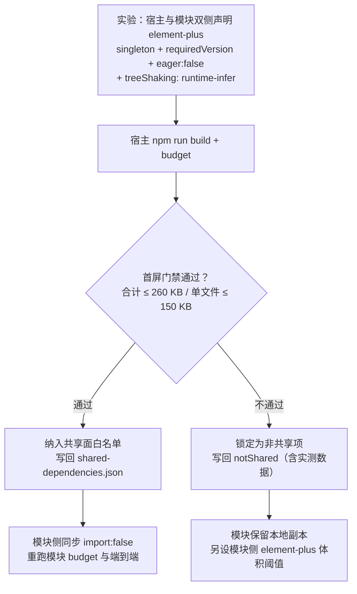

# 01 详细设计 · 依赖共享与版本偏斜治理

> 前端插件化 · 02 运行时加载 · 子任务 02（需求 05-4）· 详细设计

[文档首页](../../../../../../文档首页.md) › [02 运行时加载](../02_运行时加载_02_依赖共享与版本偏斜治理.md) › 详细设计　|　[← 任务](../02_运行时加载_02_依赖共享与版本偏斜治理.md)

## 1. 设计目标与范围 <a id="goal"></a>

在 [02_01](../../02_运行时加载_01_ModuleFederation接入与模块独立构建/02_运行时加载_01_ModuleFederation接入与模块独立构建.md)（**前置契约已交付**：宿主纯 host 接入、运行期远端登记与加载、`shared` 声明的两侧落点、框架三件单例基线、模块独立工程与独立计量）之上，把 `shared` 从「能跑起来的最小声明」推进为**可治理、可验证、可升级**的依赖共享闭环：

1. **共享声明单一来源**——共享面与版本要求落一份声明文件，宿主与模块构建配置**都从它生成**，不再各写一份；
2. **单例 + 版本要求**——共享项一律 `singleton: true` 并声明 `requiredVersion`；模块侧**不打包本地回退副本**（`import: false`），从产物层物理消灭「第二份实例」；
3. **版本偏斜处置**——不满足版本要求即**拒绝加载**（`strictVersion`）并记错误状态留痕；构建期另有两侧声明一致性断言，不等即构建失败；
4. **构建期验证**——脚本断言「模块产物无共享依赖副本」「宿主产物共享依赖恰一份」「两侧声明与单一来源一致」；
5. **运行期实例数断言**——以真实 Module Federation 运行时验证 share scope 内每个共享依赖的版本数为 1；
6. **白名单护栏**——模块依赖与 `shared` 声明须落在白名单内，防后续模块私自扩共享面；
7. **升级契约成文**——框架大版本升级 = 跨团队契约，升级流程与兼容窗口成文；
8. **UI 组件库与平台基座包的共享可行性**——按 `02_01` 实测结论做**一次受控实测**，据结果决定「纳入共享」或「锁定为非共享项」，结论与数据落文档。

**不在本期**：清单唯一来源 / 版本发现 / 灰度回滚（`03_02`）、样式与运行时隔离护栏（`03_01`）、按模块可观测与失败兜底（`03_03`）、模块工程脚手架定形（`04_01`）。

### 1.1 现状与缺口 <a id="gap"></a>

`02_01` 交付后的现状：

```text
frontend/
├── apps/desktop/
│   ├── vite.config.ts              # 纯 host；shared 内联三件（{ singleton: true }）      ← 本期 改读单一来源 + requiredVersion
│   ├── budget.json                 # 首屏预算（合计 260 KB / 单文件 150 KB）
│   └── src/module/federation.ts    # 远端入口解析器（运行期登记 + 加载）
├── modules/demo/
│   ├── vite.config.ts              # MF remote；shared 内联三件（{ singleton: true }）      ← 本期 改读单一来源 + requiredVersion + import:false
│   ├── budget.json                 # 模块产物单独计量（入口闭包 12 KB / 单块 8 KB）
│   ├── package.json                # element-plus / pinia / vue / vue-router 为常规依赖    ← 本期 加白名单护栏
│   └── src/standalone.ts           # 模块独立预览壳（不经宿主）                             ← 本期 评估 import:false 的影响
└── （本期新增）shared-dependencies.json   # 共享声明单一来源（共享面 + 版本要求）
    （本期新增）scripts/check-shared-deps.mjs  # 产物级断言脚本
    （本期新增）scripts/check-shared-whitelist.mjs  # 白名单护栏脚本
```

缺口：① 共享面与版本要求**两侧各写一份**，无单一来源、无版本要求，漂移不可见；② 模块产物仍含各共享依赖的**本地回退块**，运行期协商失败即静默出现第二份实例；③ 版本偏斜**无处置口径**（既不断言也不留痕）；④ 无任何**自动化断言**证明「实例数为 1」；⑤ 共享面变更无护栏，后续模块可自由扩面；⑥ 框架大版本升级无契约。

## 2. 交付物清单 <a id="deliver"></a>

| # | 交付物 | 落点 |
| --- | --- | --- |
| 1 | 共享声明单一来源（共享面白名单 + 版本要求 + 各形态差异） | `frontend/shared-dependencies.json`（新增） |
| 2 | 共享声明读取与构建配置生成工具（宿主 / 模块共用，零依赖 ESM） | `frontend/scripts/shared-deps.mjs`（新增） |
| 3 | 宿主构建配置改读单一来源并声明 `requiredVersion` | `frontend/apps/desktop/vite.config.ts` |
| 4 | 模块构建配置改读单一来源并声明 `requiredVersion` + `import: false` + `suppressMissingImportWarning` | `frontend/modules/demo/vite.config.ts` |
| 5 | 受控实测：UI 组件库共享可行性（实验记录 + 结论 + 分支落地） | 本任务 `实施/` 记录；结论落交付物 9 / 10 |
| 6 | 产物级断言脚本（模块无副本 / 宿主恰一份 / 两侧声明一致） | `frontend/scripts/check-shared-deps.mjs`（新增，挂 `npm run budget:shared`） |
| 7 | 白名单护栏脚本（模块依赖与 `shared` 声明 ∈ 白名单） | `frontend/scripts/check-shared-whitelist.mjs`（新增，挂 `npm run guard:shared`） |
| 8 | 运行期实例数断言（真实 MF 运行时，share scope 版本数 = 1 + `strictVersion` 拒绝） | `frontend/apps/desktop/tests/shared-dependencies.spec.ts`（新增） |
| 9 | 强制口径成文 | 《[前端开发规范](../../../../../../规范/前端开发规范.md)》新增「依赖共享与版本偏斜」节 |
| 10 | 升级契约（升级流程 / 兼容窗口 / 通告与协同） | `bms文档/资料/知识档案/微前端/09_微前端_依赖升级契约.md`（新增） |
| 11 | CI 接线：新增 `shared-deps-check` job（复用两侧构建产物 artifact） | `.gitlab-ci.yml` |
| 12 | 登记回写（模块契约 / 前端架构 / 概要设计 / 前端基类清单 / 需求措辞 / 任务与计划） | 见 §6 |
| 13 | 任务实施记录 / 测试记录 | 本目录 `实施/`、`测试/` |

## 3. 接口 / 契约与边界 <a id="contract"></a>

### 3.1 共享声明单一来源 <a id="source"></a>

新增 `frontend/shared-dependencies.json`（**唯一来源**：共享面白名单 + 版本要求；两侧构建配置都从它生成，不得各写一份）：

```json
{
  "shareScope": "default",
  "shared": {
    "vue": { "requiredVersion": "^3.5.41", "singleton": true },
    "vue-router": { "requiredVersion": "^4.6.4", "singleton": true },
    "pinia": { "requiredVersion": "^3.0.4", "singleton": true }
  },
  "notShared": {
    "element-plus": { "reason": "宿主共享会把整库拉入首屏（02_01 实测 +334.5 KB gzip）；待受控实测结论" },
    "@bms/core": { "reason": "源码直出包（版本 0.0.0），宿主以 alias 消费，MF 探测不到" },
    "@bms/ui-ep": { "reason": "同 @bms/core" }
  }
}
```

| 字段 | 口径 |
| --- | --- |
| `shared` | **共享面白名单**：键为包名，值声明 `requiredVersion`（semver 范围）与 `singleton`（恒 `true`）；**只有此表内的依赖允许出现在两侧 `shared` 声明中** |
| `notShared` | **受控非共享项**（显式登记，含理由）：出现在模块 `package.json` 依赖中是允许的，但**禁止**出现在 `shared` 声明中；受控方式见 §3.7（体积阈值 + 白名单断言） |
| `shareScope` | 共享域名称（两侧须一致；`default` 为 MF 缺省值） |

读取与生成（`frontend/scripts/shared-deps.mjs`，零依赖 ESM，Node ≥ 22）：

```js
/** 读取单一来源并生成构建配置用的 shared 声明。 */
export function loadSharedDependencies(options = {})
// options: { root?: string, role: 'host' | 'remote' }
// 返回：{ shareScope, shared }，其中 shared 为 MF 插件可直接消费的对象；role='remote' 时对每项追加
//      import: false 与 suppressMissingImportWarning: true（见 3.3）
```

- **不引入新的版本解析逻辑**：`requiredVersion` 为**手写维护的 semver 范围**（与两侧 `package.json` 的实装版本对齐由护栏断言保证，见 §3.7）；
- **单一来源的边界**：本文件管「共享面 + 版本要求」；`package.json` 仍管「实装哪个版本」——两者由护栏断言绑定，声明与实装不得长期偏离。

### 3.2 宿主侧声明（提供方） <a id="host-shared"></a>

`apps/desktop/vite.config.ts`：

```ts
import { loadSharedDependencies } from '../../scripts/shared-deps.mjs'

const { shared } = loadSharedDependencies({ role: 'host' })

export default defineConfig({
  plugins: [vue(), Components({ resolvers: [ElementPlusResolver()] }), federation({ name: 'bms-desktop', shared })],
})
```

| 项 | 口径 |
| --- | --- |
| `requiredVersion` | 由单一来源下发；宿主**自身版本必须满足**它（护栏断言） |
| `singleton` | `true`（共享面内全部） |
| `import` | **不设**（宿主是提供方，须打包并提供实例） |
| `strictVersion` | **不在宿主侧设置**：宿主是提供方，拒绝权在消费方（模块侧）判定更准确，避免宿主自锁 |
| 共享面之外 | `element-plus` / `@bms/*` **不进** `shared`（除非受控实测结论为「可共享」，届时改单一来源文件即可，两侧配置零改动） |

### 3.3 模块侧声明（消费方） <a id="remote-shared"></a>

`modules/demo/vite.config.ts`：

```ts
import { loadSharedDependencies } from '../../scripts/shared-deps.mjs'

const { shared } = loadSharedDependencies({ role: 'remote' })
// role='remote'：每项自动带 import: false + suppressMissingImportWarning: true
```

| 项 | 口径 |
| --- | --- |
| `import: false` | **不提供本地回退副本**——模块产物内不存在第二份；宿主未提供即**加载失败**（宁可失败，不要静默双实例） |
| `suppressMissingImportWarning` | 抑制「无本地依赖」告警（`import: false` 的配套开关） |
| `requiredVersion` | 与宿主**同源同值**（单一来源）；不满足即拒绝 |
| `strictVersion` | `true`——版本不满足时**拒绝**接受共享模块，不退回本地副本 |
| `singleton` | `true` |

**独立预览的边界（实测项）**：模块工程自带独立预览壳（`index.html` + `src/standalone.ts`，不经宿主）。`import: false` 的语义是「本构建不提供该依赖」——若插件把**独立预览入口**的依赖请求也改写为「消费共享域」，独立预览将失去 vue 来源而不可用。处置：

1. 实施时先实测主构建（`npm run build`）下独立预览页是否仍可用；
2. 若受影响 → 模块工程增设独立预览构建入口（`npm run build:standalone`，产物 `dist-standalone/`，其 `shared` 用**提供方语义**：`{ singleton: true, requiredVersion }` 不带 `import: false`），主构建 `dist/` 保持 `import: false`；
3. 无论走哪支，**结论与实测数据落实施记录**，并在《前端模块契约》登记「模块独立预览的共享语义」。

### 3.4 受控实测：UI 组件库共享可行性 <a id="experiment"></a>

按拍板结论执行一次**受控实验**，判定 `element-plus` 能否纳入共享面：



| 项 | 口径 |
| --- | --- |
| 变量 | 宿主 `shared['element-plus'] = { singleton: true, requiredVersion, eager: false, treeShaking: { mode: 'runtime-infer' } }`；模块侧 `import: false` |
| 判据 | **现有宿主首屏预算门禁**（`apps/desktop/budget.json`：合计 260 KB / 单文件 150 KB）——通过即算「压住」 |
| 对照 | 记录实验前后的首屏合计 / 单文件最大值 / 入口块数，与 `02_01` 实测值（660.7 KB / 334.5 KB）并列 |
| 分支结论 | 通过 → 进白名单；不通过 → 进 `notShared` 并写明实测数据与结论日期 |
| 平台基座包（`@bms/core` / `@bms/ui-ep`） | **不参与实验**：源码直出 + alias 消费 → MF 探测不到请求，机制上无从共享；按 `notShared` 登记，共享前提（基座包发布版本化 / 共享域化）作为开放项 |

### 3.5 构建期产物级断言 <a id="artifact-check"></a>

`frontend/scripts/check-shared-deps.mjs`（零依赖，读取两侧 `dist/`）：

| # | 断言 | 判据 |
| --- | --- | --- |
| 1 | 两侧 `shared` 声明与单一来源一致 | 从产物中解析 shared 声明（模块侧读 `dist/remoteEntry.js` 内嵌的 shared 配置；宿主侧读构建元数据/产物块内的 shared 声明），逐项比对包名集合、`requiredVersion`、`singleton` |
| 2 | 模块产物**不含**共享依赖副本 | ① 模块产物共享项声明须含 `import: false`；② `dist/**/*.js` 文本中不得命中共享依赖的**特征串**（vue / vue-router / pinia 各自的特征标记），命中即判定存在副本 |
| 3 | 宿主产物共享依赖**恰一份** | 共享依赖特征串在宿主 `dist` 中**仅出现在一个块**内（块内出现多次视为同一实例，不判失败） |
| 4 | 非共享项受控 | `notShared` 中的依赖若被检出（模块侧允许存在，宿主侧允许存在），须**只在一侧**出现且模块侧体积不超 §3.7 阈值 |

- 特征串表落脚本内常量并**注释说明来源**（取自各库产物中的稳定标识，不写版本号）；
- 退出码 1 = 门禁红；输出命中块清单（便于定位）。

### 3.6 运行期实例数断言 <a id="runtime-check"></a>

`apps/desktop/tests/shared-dependencies.spec.ts`（Vitest，jsdom；**用真实 MF 运行时**，不走 `vi.mock` 替身）：

| # | 用例 | 断言 |
| --- | --- | --- |
| 1 | 共享声明生成正确 | `loadSharedDependencies` 的产物：包名集合 = 共享面白名单；每项 `singleton === true` 且 `requiredVersion` 与单一来源一致；`role='remote'` 时每项带 `import: false` |
| 2 | share scope 内版本数 = 1 | 以宿主声明建实例（`createInstance`）并注册宿主提供者后，`shareScopeMap[shareScope]` 内**每个共享依赖的版本条目数 = 1**；`loadShare(name)` 解析出的版本 = 宿主版本 |
| 3 | 版本不满足即拒绝 | 消费方声明 `requiredVersion` 不满足宿主版本 + `strictVersion: true` → `loadShare` 拒绝（不返回宿主版本、不静默接受） |
| 4 | 偏斜留痕 | 拒绝路径产生的错误/告警可被宿主错误状态收集（带模块名与版本）；与 `03_03` 的错误上报口径衔接 |

**风险与退路**：`@module-federation/runtime` 在 Vitest/jsdom 下能否直接运行需实测；若不可运行 → 降级为「以运行时的共享协商纯函数（`satisfy`）做版本判定断言 + `strictVersion` 语义用例」，并在实施记录登记该退路（不改门禁强度）。

### 3.7 白名单与体积护栏 <a id="guard"></a>

`frontend/scripts/check-shared-whitelist.mjs`：

| # | 断言 | 判据 |
| --- | --- | --- |
| 1 | 模块依赖落白名单 | 模块 `package.json` 的 `dependencies` 中，除 `@bms/*`（`file:` 链接平台包）外，每个包须 ∈（共享面 ∪ `notShared`）；出现表外包名即失败 |
| 2 | 模块 `shared` 声明落白名单 | 模块构建配置生成的 `shared` 键集合 ⊆ 共享面白名单（**禁止**把 `notShared` 项偷偷加进共享面） |
| 3 | 版本要求与实装一致 | 宿主与模块 `package.json` 中对应包的实际版本**均满足**单一来源的 `requiredVersion`；不满足即失败（防声明与实装长期偏离） |
| 4 | 非共享项体积阈值 | 模块侧 `notShared` 依赖（如 `element-plus`）在模块产物中的体积不超单一来源登记的阈值（防「不共享」演化为无限膨胀） |

### 3.8 CI 接线 <a id="ci"></a>

| 项 | 口径 |
| --- | --- |
| 新增 job | `shared-deps-check`（stage `verify` / 或与 `module-build` 同 stage，实施时按最小改动定） |
| 依赖产物 | 复用 `desktop-build` 的宿主产物与 `module-build` 的模块产物 → **两侧 job 增 `artifacts`（`dist/`）**，本 job 以 `needs` 拉取后断言 |
| 脚本入口 | 宿主 / 模块工程各加 `budget:shared`、`guard:shared` 脚本；CI 与本地同口径 |
| 运行期断言 | 随现有 `desktop-check`（`test:cov`）运行，不新增 job |
| 触发路径 | 与前端 job 同口径（`frontend/**/*`、`package.json`、`package-lock.json`、`deploy/**`、`.gitlab-ci.yml`） |
| 阻断性 | 失败即红（不得 `allow_failure`） |

### 3.9 升级契约成文 <a id="upgrade"></a>

| 落点 | 内容 |
| --- | --- |
| 《[前端开发规范](../../../../../../规范/前端开发规范.md)》新增「依赖共享与版本偏斜」节 | **强制口径**：共享面与版本要求取自单一来源、共享项一律单例、模块侧不得打包回退副本、偏斜不满足即拒绝加载、共享面变更须走白名单护栏、新增依赖须先登记共享面或 `notShared` |
| `bms文档/资料/知识档案/微前端/09_微前端_依赖升级契约.md`（新增） | **升级流程与兼容窗口**：大版本升级的发起与评估、平台与模块的协同顺序与窗口、兼容期内的双版本并存规则、通告与回滚口径、模块侧适配清单模板 |

## 4. 失败分支与边界 <a id="edge"></a>

| 边界 / 失败场景 | 处置 |
| --- | --- |
| 模块构建时共享依赖版本不满足 `requiredVersion` | 构建期白名单护栏失败（CI 红），阻断发布 |
| 运行期宿主版本不满足模块 `requiredVersion` | 模块**拒绝加载**（`strictVersion`），宿主记错误状态（带模块名与版本），菜单无该项、其余模块照常 |
| 宿主未提供共享依赖（供应缺失） | 加载失败（`import: false` 无本地副本可退）→ 错误边界兜底；**不得**静默回落 |
| 模块产物意外包含副本 | 产物级断言失败（CI 红） |
| 两侧声明漂移（有人在配置里手改） | 两侧声明一致性断言失败（CI 红）——声明只允许改单一来源文件 |
| 单例语义被破坏（同依赖出现两个版本条目） | 运行期断言失败（CI 红） |
| 受控实测通过（`element-plus` 可共享） | 单一来源文件把它移入 `shared`，两侧配置**零改动**生效；模块预算阈值同步复测 |
| 受控实测不通过 | 进 `notShared`（写实测数据与理由），模块保留本地副本并由 §3.7 阈值守住体积 |
| 模块独立预览因 `import: false` 不可用 | 增设独立预览构建入口（§3.3 第 2 支），主构建语义不变 |
| 平台基座包共享诉求 | 机制上不成立（alias 消费）→ 登记为开放项，归基座包发布治理 |
| 模块工程依赖解析依赖仓库根 workspace 依赖集 | 沿用 `02_01` 机制（CI 复制根 `node_modules`），不作为本任务范围 |

## 5. 测试设计与验收映射 <a id="test"></a>

| 验收点（需求 05-4 完成标准） | 用例 / 验证 |
| --- | --- |
| 1 共享依赖声明成文，`singleton` + `requiredVersion` 生效 | 单一来源文件 + 《前端开发规范》新节 + 《前端模块契约》登记（成文）；`apps/desktop/tests/shared-dependencies.spec.ts` 用例 1（声明生成正确） |
| 2 生产构建无重复实例；CI 依赖实例数断言可执行且纳入门禁 | `check-shared-deps.mjs`（产物级，断言 1~4）+ `shared-dependencies.spec.ts` 用例 2（share scope 版本数 = 1）+ `shared-deps-check` job（CI 阻断） |
| 3 版本不一致场景有明确处置与用例 | `shared-dependencies.spec.ts` 用例 3（`strictVersion` 拒绝）+ 用例 4（留痕）；构建期护栏断言 3（实装与要求不符即红） |
| 4 升级契约（大版本协同升级流程）成文 | 《前端开发规范》「依赖共享与版本偏斜」节 + 知识档案《依赖升级契约》 |
| 白名单护栏生效（拍板追加项） | `check-shared-whitelist.mjs` 断言 1~4 |
| UI 组件库共享结论明确（拍板追加项） | 受控实测记录（实施记录）+ 单一来源文件中 `shared` / `notShared` 的最终归属 |
| 既有门禁不回归 | 根 `npm run check`；宿主 `npx vue-tsc -b` + `lint` + `test:cov` + `build` + `budget`；模块工程 `typecheck` + `lint` + `test` + `build` + `budget`；端到端（模块 preview → 宿主 preview 加载）复测 |
| Kiwi 用例关联 | 一任务一条，**先登记取号（以平台回读编号为准）**再回填代码标注 |

文档门禁：`scripts/tools/base-check/check-base.py`、`check-links.py`、`check-docs/check-status.py --stage 05_前端插件化 --strict`。

## 6. 登记落点 <a id="register"></a>

| 内容 | 落点 |
| --- | --- |
| 共享面白名单 + 版本要求 + 非共享项（含理由与实测数据） | `frontend/shared-dependencies.json`（单一来源，权威） |
| 共享依赖的强制口径（单例 / 无回退副本 / 偏斜拒绝 / 白名单变更流程） | 《[前端开发规范](../../../../../../规范/前端开发规范.md)》新增「依赖共享与版本偏斜」节 |
| 升级流程与兼容窗口 | 知识档案 · 微前端新增《前端模块依赖升级契约》（落点见 §2 交付物 10；实施时创建后再补相对链接） |
| 模块独立预览的共享语义（若走独立构建支路） | 《[前端模块契约](../../../../../../设计/架构设计/35_架构设计_前端模块契约.md)》§6 |
| 共享面与版本要求的治理语义（不写实现细节） | 《[架构设计 · 前端架构](../../../../../../设计/架构设计/08_架构设计_前端架构.md)》§9 治理表「依赖共享与版本偏斜」行（按需补语义） |
| 概要口径（共享依赖治理已成文） | 《[概要设计 · 前端插件化](../../../../../../设计/概要设计/38_概要设计_前端插件化.md)》§5.2 |
| 单一来源文件与共享断言脚本的目录落点 | 《[前端基类清单](../../../../../../前端基类清单.md)》§9「目录与依赖」 |
| 需求 05-4 措辞（共享面范围与实测结论对齐） | `需求/02_需求_运行时加载.md`（**仅在实测不支持 UI 组件库 / 基座包共享时**按结论回写措辞，不承载进度） |
| 工时（12h → 16h）与任务 / 计划状态 | 任务信息表 + 父任务子任务清单 + 计划 §1 工时口径 / §2 / §3 |
| `02_01` 遗留闭环（遗留 1 UI 组件库共享、遗留 2 基座包共享） | `02_01` 实施记录 §6 回写闭环状态 + 本任务实施记录 |

## 7. 边界与开放项 <a id="open"></a>

- **平台基座包共享**（`@bms/core` / `@bms/ui-ep`）：机制上不成立（源码直出 + alias 消费，MF 探测不到请求）；共享前提是「基座包发布版本化 / 共享域化」，随基座包发布治理评估——**本任务只登记结论与前提，不改发布形态**；
- **清单治理**：生产远端入口地址、版本发现、灰度 / 回滚归 `03_02`；
- **可观测**：偏斜拒绝与加载失败的按模块归因、错误上报字段归 `03_03`（本任务只保证错误可被错误状态收集）；
- **隔离**：模块样式前缀与全局污染护栏归 `03_01`；
- **移动端**：本期仅 PC（`frontend/apps/desktop` + `frontend/modules/*`）；移动端接入时复用同一单一来源文件（`shareScope` 与版本要求按端再评估）；
- **`strictVersion` 的宿主侧语义**：宿主作为提供方不设拒绝，拒绝权在消费方；若后续出现「宿主被模块拖入不兼容版本」的场景，再评估宿主侧开关（登记为观察项）；
- **模块工程脚手架定形**：本任务对模块工程的配置改动（读单一来源）为 `04_01` 首个样例的基座，样例实施时可能据实调整。

## 8. 决策记录 <a id="decision"></a>

| # | 决策项 | 结论 |
| --- | --- | --- |
| 1 | 共享面范围 | **先做一次受控实测再定**：`element-plus` 用 `treeShaking: runtime-infer` + `eager: false` 实测，首屏门禁通过则纳入共享，否则锁定为非共享项；平台基座包不参与实验、直接登记非共享（机制不成立） |
| 2 | 版本单一来源 | 新增 `frontend/shared-dependencies.json`（共享面 + 版本要求 + 非共享项）；两侧构建配置都从它生成，护栏断言两侧实装版本满足要求 |
| 3 | 模块侧回退副本 | **禁止**：`import: false` + `suppressMissingImportWarning`；宿主未提供即加载失败 |
| 4 | 版本偏斜处置 | `singleton: true` + `requiredVersion` + 模块侧 `strictVersion: true`：不满足即拒绝加载并记错误状态；构建期另做两侧声明一致性断言 |
| 5 | 实例数断言 | **双层**：构建期产物级脚本 + 运行期 Vitest（真实 MF 运行时，share scope 版本数 = 1） |
| 6 | CI 接线 | 新增独立 job `shared-deps-check`，复用两侧构建产物 artifact |
| 7 | 白名单护栏 | 加：模块依赖与 `shared` 声明须 ∈ 白名单；非共享项设体积阈值 |
| 8 | 升级契约落点 | 《前端开发规范》新增节（强制口径）+ 知识档案新增《依赖升级契约》（流程与窗口） |
| 9 | 工时 | 12h → **16h**（拍板重估） |

## 9. 参考文档 <a id="ref"></a>

- [需求 05-4](../../../../需求/02_需求_运行时加载.md#r05-4)
- 本域 [02_01 Module Federation 接入与模块独立构建](../../02_运行时加载_01_ModuleFederation接入与模块独立构建/02_运行时加载_01_ModuleFederation接入与模块独立构建.md) 与其[实施记录](../../02_运行时加载_01_ModuleFederation接入与模块独立构建/实施/01_实施_02_运行时加载_01_ModuleFederation接入与模块独立构建.md) §4 / §6（**前置契约与实测结论**）
- 《[架构设计 · 前端架构](../../../../../../设计/架构设计/08_架构设计_前端架构.md)》§9 治理表「依赖共享与版本偏斜」
- 《[架构设计 · 前端模块契约](../../../../../../设计/架构设计/35_架构设计_前端模块契约.md)》§6「与阶段五的衔接」（共享依赖行）
- 《[架构设计 · 测试与质量](../../../../../../设计/架构设计/32_架构设计_测试与质量.md)》（依赖与构建、门禁口径）
- 《[概要设计 · 前端插件化](../../../../../../设计/概要设计/38_概要设计_前端插件化.md)》§5.2
- 《[前端开发规范](../../../../../../规范/前端开发规范.md)》「构建体积预算」节（预算口径）
- 知识档案《[微前端 · 04 隔离与治理](../../../../../../资料/知识档案/微前端/04_微前端_隔离与治理.md)》§4「依赖共享与版本偏斜」（治理清单）
- 知识档案《[微前端 · 07 常见误区](../../../../../../资料/知识档案/微前端/07_微前端_常见误区.md)》
- 《[Module Federation 共享依赖配置](https://module-federation.io/configure/shared.html)》（`singleton` / `requiredVersion` / `strictVersion` / `import` / `treeShaking`）
- 《[测试规范](../../../../../../规范/测试规范.md)》§5「用例管理」、《[Kiwi TCMS 部署使用说明](../../../../../../资料/开发服务器/linux/KiwiTCMS部署使用说明.md)》§5.3

> 本文档依《[文档生成规范](../../../../../../规范/文档生成规范.md)》编写
