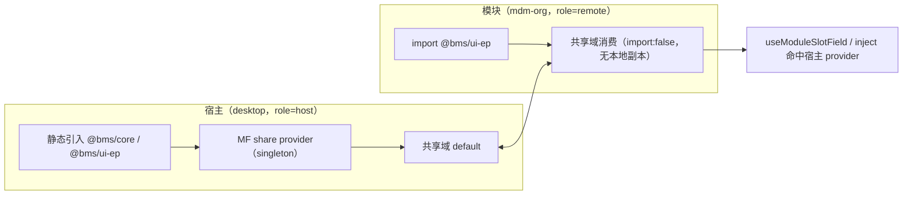

# 01 详细设计 · 基座包发布版本化与共享域化

> 前端插件化 · 02 运行时加载 · 子任务 03（需求 `05-14`）

[文档首页](../../../../../../文档首页.md) › [02 运行时加载](../../02_运行时加载.md) › [03 基座包发布版本化与共享域化](../02_运行时加载_03_基座包发布版本化与共享域化.md) › 详细设计

## 1. 背景与现状 

- **既有判定（父任务 `02`）**：`@bms/core` / `@bms/ui-ep` 为**源码直出**（`exports` 指 `src`、版本 `0.0.0`）且宿主以 `resolve.alias` 消费 ⇒ MF **探测不到模块请求**、无 provider 块 ⇒ 两侧各自打包；判定为**受控非共享项**，共享前提（发布版本化 / 共享域化）登记为开放项。
- **真机证据（2026-10-09，阶段七 RBAC `02_02` 用户记录页「用户分配」）**：mdm 插件经 `sys.user.detail.tabs` **真挂接成功**（三子页签 角色分配 10 / 岗位分配 20 / 部门分配 30 渲染通过），但插件侧 `useModuleSlotField('userId')` 与宿主注入的提交器通道取值**失败**（面板示「当前页面未提供实体标识」）。
- **机制根因**：显式上下文通道以 `MODULE_SLOT_CONTEXT_KEY`（`Symbol`）为注入键；两侧各一份 `@bms/ui-ep` ⇒ **两个不同的 Symbol** ⇒ `inject` 取不到 ⇒ 上下文为 `undefined`。同理，注册表实例、模块 `api` 注入、`moduleI18n`、主题令牌等依赖「模块级单例」的机制具同一失效条件。
- **为什么此前未暴露**：父任务已按「装配器按键重建注册项、不做 `instanceof`」化解**跨副本类实例**问题，但**注入键的 Symbol 同一性**不在该对策覆盖内；既有样例模块未消费宿主上下文（首个消费方为 2026-10-08 后接入的 mdm 插件）。

## 2. 目标与非目标 

**目标**：两包进入共享域（宿主提供方 / 模块消费方），使依赖模块级单例的机制跨模块边界成立；共享面单一来源与护栏同步；体积与首屏有实测结论。

**非目标**：生产 / 部署形态（制品库、CDN、部署侧清单）与**版本协商机制**（保持「单例 + 拒绝」）；基座包 API 重组与语义变更（本期**只改发布形态**，不改导出面）。

## 3. 方案总览 

要点：**同一份实例**（宿主 provider）被两侧解析 ⇒ `Symbol` / 类原型 / 注册表引用**同一** ⇒ `inject`、`instanceof`、注册表共享全部成立。

## 4. 详细设计 

### 4.1 包产物形态与版本 

| 项 | 现状 | 目标 |
| --- | --- | --- |
| `exports` | 指 `src/*.ts`（直出） | 指 `dist/*.js`（ESM）+ `types` 指 `dist/*.d.ts` |
| `version` | `0.0.0` | 语义版本，起于 `0.1.0`（两包独立演进，共享域内各自 `requiredVersion`） |
| 构建 | 无 | 包内 `build`（`tsc` 或 Vite lib 模式；**保留 `import type` 擦除**，不改变导出面） |
| `files` | — | `["dist"]`（发布面只含产物） |

**开发体验代价（登记）**：改造后改基座包源码**须重建产物**方可被宿主 / 模块看到（不再源码热更）；以工作区脚本 `pnpm -r --filter @bms/core --filter @bms/ui-ep build` + watch 构建缓解，代价入实施记录。

### 4.2 共享声明单一来源改造 

- `frontend/shared-dependencies.json`：
  - `shared` 增 `@bms/core` / `@bms/ui-ep`（`{ requiredVersion: '^0.1.0', singleton: true }`）；
  - `notShared` 内两条**移除**（原理由保留为迁移说明，见 §4.6）；
  - `remoteOverrides`（`import:false` + `suppressMissingImportWarning`）沿用——模块**不打包本地回退副本**。
- `frontend/scripts/shared-deps.mjs`：版本来源支持「从包 `package.json` 读 `version`」（兼容产物包形态）；`shared` / `notShared` / `remoteOverrides` 结构不变（**单一来源**口径不破）。
- 宿主与模块的 Vite 配置**无需逐仓改**（均经 `loadSharedDependencies({ role })`）；模块工程把基座包依赖由 `file:` 副本改为**工作区包依赖**。

### 4.3 宿主侧（provider） 

- `resolve.alias` 中两包的**运行期映射收敛**（保留 `@` 业务别名与 TS 路径映射；包请求交回包解析，使 MF 可探测）。
- `eager` 取舍：宿主本已静态引入两包（首屏既有成本），共享仅**暴露**已加载模块；**但** `ui-ep` 若被朴素共享为整库 provider，仍可能把未使用件纳入 provider 块——与 `element-plus` 的差异须**实测确认**（§5），必要时对 `ui-ep` 采用 `eager:false` 并按需异步拉取；取**体积更优且首屏不回退**者，结论写入实施记录。

### 4.4 模块侧（consumer） 

- 各模块工程（平台 `frontend/modules/*` 与 mdm `modules/org`）沿用 `role: 'remote'` 声明；**移除基座包 `file:` 副本依赖**（改为工作区包依赖 + 满足 `requiredVersion`）。
- 类型解析仍走产物 `types`（`vue-tsc` 通过为准）；`strictVersion` 保留（版本不满足即拒绝加载、不静默双实例）。

### 4.5 单例机制验收清单 

| # | 机制 | 验收方式（真机） |
| --- | --- | --- |
| 1 | 显式上下文注入（`useModuleSlotField` / `registerSubmitter`） | 阶段七 RBAC `02_02/_01`：mdm 岗位 / 部门插件取到 `userId`；改动进草稿并随宿主「保存」提交 |
| 2 | 区域项 / 组件注册表引用 | 插件经同一注册表注册项，宿主按区域解析渲染（同槽并列、缺失即隐藏） |
| 3 | 模块 `api` 注入（`api.get` / `api.product`） | 插件经宿主注入的 `api` 取数成功（无自建客户端） |
| 4 | `moduleI18n` / 主题令牌 | 插件文案与令牌随宿主切换生效（不回退本地副本） |
| 5 | 依赖实例数 = 1 | 共享域内两条目各自恒 1（构建期产物断言 + 运行期断言） |

### 4.6 迁移与兼容 

- **迁移序**：两包产物化 → 共享声明改单一来源 → 宿主提供方 → 模块消费方（平台样例 → mdm 模块）→ 重建 / 重发布全部模块产物 → 真机验收。
- **原「受控非共享项」理由的处置**：原判定「源码直出 + alias ⇒ MF 探测不到 ⇒ 无从共享」在**产物化后不再成立**，故迁移；`element-plus` 的**非共享结论与体积阈值不变**（其理由是体积，非机制）。
- **升级契约**：基座包升版本 ⇒ 宿主与模块 `requiredVersion` 同步升级（沿用父任务升级契约）；`strictVersion` 拒绝加载即留痕，不回退静默双实例。
- **回退**：口径回退＝共享声明退回 `notShared` + 还原宿主 alias 与模块 `file:` 依赖（保留双向说明，便于按需回滚）。

## 5. 体积与首屏实测方案 

1. 复刻父任务实测方法（宿主入口静态引用 + 启动期异步拉取分别计量），对 `eager` 两档各测一次；
2. 指标：宿主入口 gzip、provider 块 gzip、启动拉取量、模块产物 gzip（**期望模块侧显著下降**：不再自带组件库副本）；
3. 门禁阈值：沿用共享白名单护栏的体积阈值口径；若首屏回退超阈值 ⇒ 采用 `eager:false` 或收窄共享面（先只共享 `@bms/core`、`@bms/ui-ep` 另议），**结论必登记**。

## 6. 门禁与用例 

| 项 | 内容 |
| --- | --- |
| 构建期断言 | 两侧共享声明一致 / 产物内无副本 / 依赖实例数 = 1（含两包） |
| 运行期断言 | 真实 MF 运行时共享域条目数恒 1（含两包） |
| 护栏 | `check-shared-deps` / `check-shared-whitelist` / `check-module-isolation` 口径同步；`ui-ep` 样式隔离护栏不变 |
| Kiwi 用例 | **先登记后编码**：① 共享声明含两包且实例数 = 1；② 上下文字段跨模块可达（含提交器通道）；③ 版本不满足拒绝加载；④ 体积实测断言（记录型） |

## 7. 风险与对策 

| # | 风险 | 对策 |
| --- | --- | --- |
| 1 | `ui-ep` 共享把未使用件拉入 provider ⇒ 首屏回退（`element-plus` 前车之鉴） | §5 实测两档；必要时收窄共享面或 `eager:false`；结论登记 |
| 2 | 源码直出改产物 ⇒ 开发期热更体验下降、易「改了没生效」 | 提供 watch 构建脚本 + 文档提示；实施记录登记代价 |
| 3 | 跨仓模块产物全部需重建 / 重发布 | 迁移序先平台样例后产品模块；发布留痕与回滚工具（`03_02`）已就位 |
| 4 | 类型解析（`types` → `dist`）变化致 `vue-tsc` 报错 | 包内 `types` 与 `exports` 同步生成；`typecheck` 纳入门禁 |

## 8. 参考文档 

[需求 05-14](../../../../需求/02_需求_运行时加载.md#r05-14) · [父任务 02 依赖共享与版本偏斜治理](../../02_运行时加载_02_依赖共享与版本偏斜治理/02_运行时加载_02_依赖共享与版本偏斜治理.md) · [06_03 上下文注入通道](../../../06_具名插槽与插件挂接/06_具名插槽与插件挂接_03_具名插槽显式上下文注入通道/06_具名插槽与插件挂接_03_具名插槽显式上下文注入通道.md) · 《[架构设计 · 前端架构](../../../../../设计/架构设计/08_架构设计_前端架构.md)》§9

> 本文档依《[文档生成规范](../../../../../../规范/文档生成规范.md)》编写
