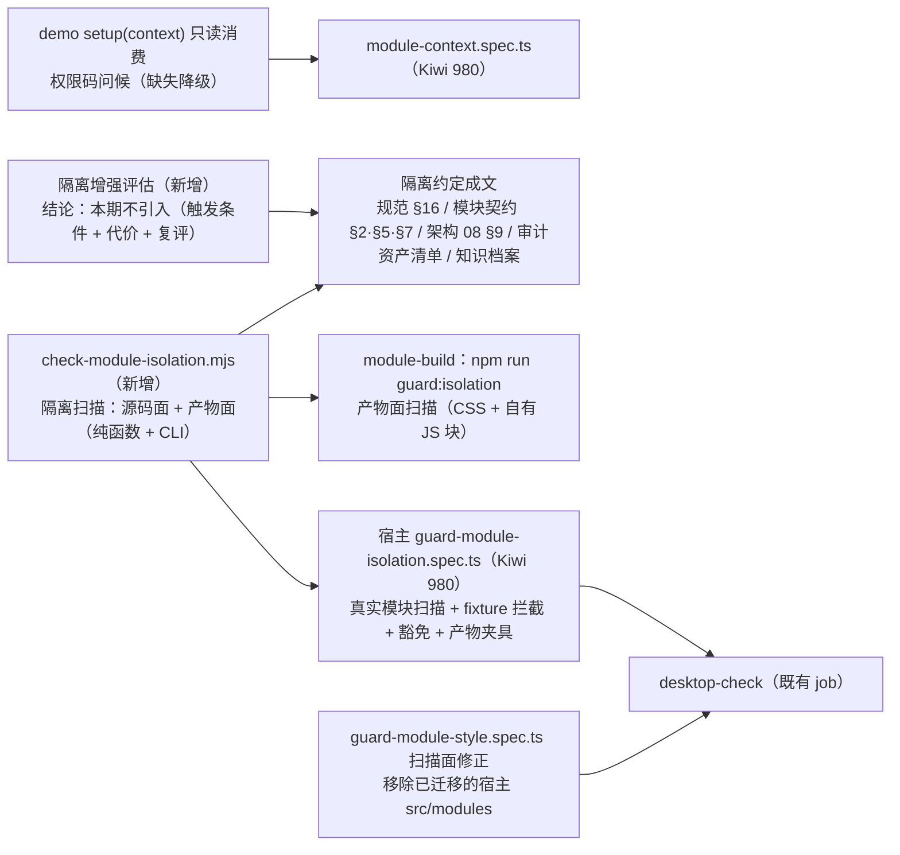

# 01 实施 · 样式与运行时隔离

> 前端插件化 · 03 隔离与治理 · 子任务 01（需求 05-5）· 实施记录

[文档首页](../../../../../../文档首页.md) › [03 隔离与治理](../03_隔离与治理_01_样式与运行时隔离.md) › 实施记录　|　[← 任务](../03_隔离与治理_01_样式与运行时隔离.md)　[测试记录 →](../测试/01_测试_03_隔离与治理_01_样式与运行时隔离.md)

## 1. 实施信息 

| 项 | 值 |
| --- | --- |
| 任务 | [01 样式与运行时隔离](../03_隔离与治理_01_样式与运行时隔离.md) |
| 对应需求 | [05-5](../../../../需求/03_需求_隔离与治理.md#r05-5) |
| 详细设计 | [01 详细设计](../设计/01_详细设计_03_隔离与治理_01_样式与运行时隔离.md)、[02 隔离增强评估](../设计/02_隔离增强评估.md) |
| 实施日期 | 2026-09-21 |
| 实施人 | minjian |
| 实施环境 | 本地开发机（Node v24.20.0 / npm 11.19.0，npmmirror）；宿主 Vite 8.2.2（Rolldown）；`@module-federation/vite` 1.22.1 |
| 提交 | 设计 `f261d6eb`；实施与文档随本次提交 |
| 结论 | 完成（无阻塞遗留；两处实现层微调见 §4） |

## 2. 实施概览 

结果小结：模块隔离落为「**约定成文 + 平台侧机器护栏**」——新增零依赖平台扫描（源码面：模块工程 `src/**` 与宿主构建期合并模块目录；产物面：远端产物 CSS 与**模块自有 JS 块**），宿主护栏用例含 fixture 拦截与豁免不误判；演示模块补一处**只读上下文消费**（缺失降级）；隔离增强评估成文（本期不引入）；规范、契约、架构、审计与知识档案同步回写。

## 3. 实施过程 

1. **平台隔离扫描**（`frontend/scripts/check-module-isolation.mjs` + `check-module-isolation.d.mts`，新增）：零依赖 ESM，导出纯函数（`scanSourceFiles` / `scanProductFiles`）与收集器（`collectModuleSourceFiles` / `collectProductTargets` / `listModuleDirs` / `scanModuleSources` / `scanModuleProducts`），CLI 支持 `--source`（缺省）/ `--product` / `--module <目录>`；源码面规则 `S1~S5`（scoped / `:global` / 全局选择器 / 脚本引样式 / 硬编码色值）与 `G1~G4`、`R1~R2`（全局原型 / 全局事件 / 全局变量赋值 / 根节点直控 / 自建宿主实例 / 持久化 API）；产物面规则 `P1~P4`；豁免：`standalone.ts`（独立预览壳）、`tokens.scss`（令牌定义源）、`?inline` 样式导入、动态色值 `hsl(${` / `rgb(${`。
2. **产物自有块识别**（同文件）：**暴露块** = `remoteEntry.js` 动态引用中排除 `_virtual_mf-`（MF 平台虚拟块）；**页面块** = 命中模块 `budget.json` `pageChunkHints` 的 JS 块；MF 运行时 / 平台辅助块 / 第三方依赖块不扫（避免误报）；CSS 扫描全部产物。
3. **宿主护栏用例**（`frontend/apps/desktop/tests/guard-module-isolation.spec.ts`，新增，Kiwi **980**）：真实源码扫描零违规（含扫描文件数断言）、五类全局污染 fixture、样式与令牌 fixture、运行时约束 fixture、豁免不误判 fixture、产物夹具（CSS + 自有 JS 块）、`dist` 存在时的真实产物扫描与自有块识别断言。
4. **既有护栏扫描面修正**（`guard-module-style.spec.ts`）：移除已随 `02_01` 迁移的宿主 `src/modules` 目标（空目录、失效目标），保留 `ui-ep` 组件的 scoped / `:global` / 全局原型规则；模块目录由新护栏承接。
5. **样例模块上下文只读消费**（`frontend/modules/demo/src/index.ts`）：`setup(context)` 经只读快照读取 `context.user`（宿主当前以权限码承载），生成问候文案并入 i18n 包；缺失降级为固定文案；不直连宿主实例、不持久化。
6. **模块侧用例**（`frontend/modules/demo/tests/module-context.spec.ts`，新增，Kiwi **980**）：空上下文降级 / 带上下文计数两种情形。
7. **CI 接线**（`.gitlab-ci.yml` + 模块 `package.json`）：`module-build` 构建与预算后追加 `npm run guard:isolation`（`node ../../scripts/check-module-isolation.mjs --product`）；源码面随既有 `desktop-check`（不新增 job）。
8. **隔离增强评估**（`设计/02_隔离增强评估.md`，新增）：现状基线 → 方案对比（Shadow DOM / Proxy 沙箱 / 快照沙箱 / with 作用域 / iframe / 约定 + 护栏）→ **结论：本期不引入** → 触发条件（异构技术栈 / 不可信代码 / 同页多模块强隔离 / 第三方全局冲突 / 合规要求）→ 代价清单 → 复评机制。
9. **口径与登记回写**：《[前端开发规范](../../../../../../规范/前端开发规范.md)》新增「运行时模块隔离（强制）」节；《[前端模块契约](../../../../../../设计/架构设计/35_架构设计_前端模块契约.md)》§2 / §5 / §7 补运行时约束、机器护栏与检查项；《[前端架构](../../../../../../设计/架构设计/08_架构设计_前端架构.md)》§9 治理表与模块契约指引回写；《[前端资产清单](../../../../../../审计/01_审计_前端资产清单.md)》新增 B13「模块隔离」维度；《[前端基类清单](../../../../../../前端基类清单.md)》§9 登记隔离扫描脚本与模块工程护栏落点；知识档案《[微前端 · 04](../../../../../../资料/知识档案/微前端/04_微前端_隔离与治理.md)》§9 现状回写。

## 4. 问题与处置 

| # | 问题 / 现象 | 原因 | 处置 |
| --- | --- | --- | --- |
| 1 | 护栏用例导入平台脚本路径解析失败（`Failed to resolve import`） | 相对路径少退一级（`tests/` → `frontend/` 需三级） | 修正为 `../../../scripts/check-module-isolation.mjs` |
| 2 | 脚本在 Vitest 下报 `The URL must be of scheme file` | 经 Vite / Vitest 载入时 `import.meta.url` 非 `file:` 协议，`fileURLToPath` 不适用 | `FRONTEND_DIR` 推断改为「`file:` 按脚本位置、否则按测试工程目录（`apps/desktop` / `modules/<模块名>` 均为 `frontend/` 下两级）」；直跑判定加 `file:` 前置条件 |
| 3 | 产物面若按「入口闭包」整包扫描会误报 | MF 运行时块（`remoteEntry.js`）自身含 `prototype` 与全局赋值特征（平台生成，非模块代码） | 自有块识别收窄为**暴露块 + 页面块**（设计 §3.3 口径），平台块 / vendor 块不扫 |
| 4 | 压缩产物中 `createPinia` / `createRouter` 绑定名可能被改写 | 导入绑定名可被压缩重命名（`import { createPinia as e }`） | 该两项**不列入产物判据**（源码面已拦），产物面保留不可重命名的全局特征（原型 / 事件 / 根节点 / 存储 / cookie） |
| 5 | 既有 `guard-module-style.spec.ts` 的模块目标已失效 | `02_01` 已把演示模块迁出宿主 `src/modules`（目录为空） | 扫描面修正为 `ui-ep` 组件；模块源码 / 产物由新护栏承接（规则不重复实现） |

## 5. 验证结果 

| 验证点 | 方法 | 结果 |
| --- | --- | --- |
| 核心三包门禁 | 根 `npm run check` | 通过（core 93 文件 / 1158 用例、vue 2 / 5、ui-ep 61 / 901） |
| 宿主类型 / Lint / 单测与覆盖率 | `vue-tsc -b` / `lint` / `test:cov` | 通过；15 文件 / 69 用例全通过；语句 88.75%（阈值 70%） |
| 宿主构建 / 首屏预算 | `build` / `budget` | 通过；首屏 **172.7 KB**（预算 260 KB）、单文件 76.6 KB（预算 150 KB） |
| **源码面隔离扫描** | `node frontend/scripts/check-module-isolation.mjs` | 通过：扫描 5 个文件，零违规 |
| **产物面隔离扫描** | `cd frontend/modules/demo && npm run guard:isolation` | 通过：CSS 2 个 / 模块自有 JS 块 3 个（暴露块 + 页面块），零违规 |
| 隔离护栏用例 | `vitest run tests/guard-module-isolation.spec.ts` | 通过（9 用例）：真实源码零违规 + 五类 fixture 拦截 + 豁免 + 产物夹具 + 真实产物（`dist` 存在时） |
| 模块工程门禁 | `lint` / `typecheck` / `test` / `build` / `budget` | 通过（2 文件 / 6 用例）；容器入口 **11.4 KB / 6 块**（预算 12 KB / 8 块 / 上限 8），页面异步块命中 `DemoHome` / `DemoToolbox` |
| 负向路径（护栏可拦） | 临时模块目录注入 `Object.prototype` 改写 / 缺产物跑 `--product` | 源码面退出码 1 并报 `G1`；缺产物明确报错退出 1（不静默跳过） |
| 基座完整性 / 文档链接 / 阶段状态 | `check-base.py` / `check-links.py` / `check-status.py --strict` | 通过（清单一致 172 / 172；断链 0、失效锚点 0；硬规则不合规 0） |
| CI 配置 | YAML 解析 | 通过（`module-build` 追加 `guard:isolation`） |
| Kiwi 用例 | 平台登记并回读 | **980**（一任务一条） |

## 6. 偏差与遗留 

- **偏差**：
  1. **产物面自有块识别收窄**——设计预留「入口闭包」口径，实测 `remoteEntry.js`（MF 运行时，平台生成）含 `prototype` / 全局赋值特征，按设计第 3 支收窄为「暴露块 + 页面块」；
  2. **`createPinia` / `createRouter` 不列入产物判据**——压缩产物绑定名可能被改写，改由源码面拦截（设计 §3.3 已按此口径落表）；
  3. **`FRONTEND_DIR` 推断适配测试运行器**——经 Vite / Vitest 载入时 `import.meta.url` 非 `file:` 协议，按测试工程目录回退（不影响显式传目录的调用方）。
- **遗留**：
  1. **持久化能力开放**：模块一律禁持久化 API；后续确需（如列表偏好）由平台能力开放并回写规范与契约（不在本期）；
  2. **`user` 语义**：宿主当前以权限码承载 `user`（`session.codes`），样例按只读消费 + 缺失降级；宿主 `user` 语义完善时模块契约接口不变；
  3. **接入指南**：业务页面按模块形态接入的自检清单（含隔离检查项）随 `04_01` 沉淀；本任务已在模块契约 §7 给检查项；
  4. **`03_02` / `03_03` 接收项**：清单发布治理与回滚（`03_02`）、按模块可观测与 sourcemap（`03_03`）与本任务无交叉，契约结构不变。

> 本文档依《[文档生成规范](../../../../../../规范/文档生成规范.md)》编写
