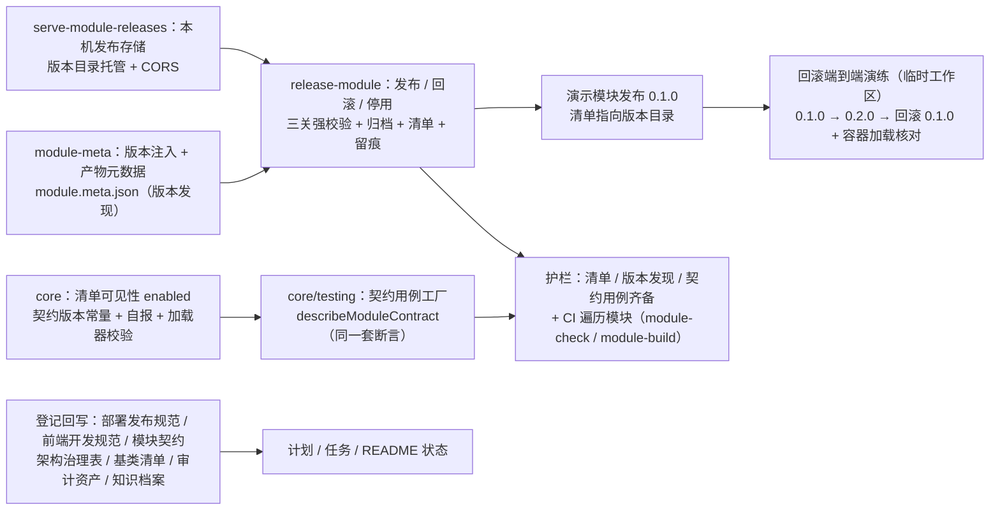

# 02 实施 · 模块清单与发布治理

> 前端插件化 · 03 隔离与治理 · 子任务 02（需求 05-6）· 实施记录

[文档首页](../../../../../../文档首页.md) › [03 隔离与治理](../03_隔离与治理_02_模块清单与发布治理.md) › 实施记录　|　[← 任务](../03_隔离与治理_02_模块清单与发布治理.md)　[测试记录 →](../测试/01_测试_03_隔离与治理_02_模块清单与发布治理.md)

## 1. 实施信息 

| 项 | 值 |
| --- | --- |
| 任务 | [02 模块清单与发布治理](../03_隔离与治理_02_模块清单与发布治理.md) |
| 对应需求 | [05-6](../../../../需求/03_需求_隔离与治理.md#r05-6) |
| 详细设计 | [01 详细设计](../设计/01_详细设计_03_隔离与治理_02_模块清单与发布治理.md) |
| 实施日期 | 2026-09-22 |
| 实施人 | minjian |
| 实施环境 | 本地开发机（Node v24.20.0 / npm 11.19.0，npmmirror）；宿主 Vite 8.2.2（Rolldown）；`@module-federation/vite` 1.22.1 |
| 提交 | 设计 `0f3e7bf4`；实施 `706c14f1`；登记回写与记录随本次提交 |
| 结论 | 完成（无阻塞遗留；六处实现层微调见 §4） |

## 2. 实施概览 

结果小结：清单扩为「名称 / 入口 / 版本 / 加载形态 / **可见性**」并成为加载与回滚**唯一来源**；**版本发现**（清单 = 产物元数据 = 源码）与**契约版本**（平台常量 + 模块自报，加载器 / 发布双端校验）落地；发布 / 回滚 / 停用工具（三关强校验 → 产物按版本归档 → 清单指向 → 发布记录）可执行并完成**端到端回滚演练**（清单版本回退生效、产物保留、归档容器可加载）；模块契约测试经 `@bms/core/testing` 契约工厂跑同一套断言，平台护栏保证契约用例齐备；发布留痕（JSON 真源 + Markdown 摘要）随仓库提交；本机发布存储服务与演示清单版本化指向就位。

## 3. 实施过程 

1. **清单可见性**（`core/src/module/manifest.ts`）：`ModuleManifestEntry` 增 `enabled`（解析后恒有值，缺省 `true`；非布尔逐项拒绝）；加载器（`loader.ts`）停用项不进可见集（`names()` 排除）且 `load` 拒绝（`PROVIDER_NOT_REGISTERED`，原因明示停用）；宿主 `installModules` 跳过停用项、汇总增 `disabled`（不记错误状态）。
2. **契约版本**（`core/src/module/contract.ts` 新增）：平台常量 `MODULE_CONTRACT_VERSION = 1`（递增口径：注入上下文 / 注册声明通道 / 清单字段语义 / 校验链的不兼容变更）；`ModuleManifest` 增 `contractVersion`（`defineModule` 校验正整数）；加载器形状校验含契约版本为数字、并校验「自报 = 平台常量」；`frontend/module-contract.json` 为脚本侧单一来源，与核心常量一致性由护栏用例（`guard-module-contract.spec.ts`）断言。
3. **产物元数据与版本注入**（`frontend/scripts/module-meta.mjs` 新增）：`loadModulePackage` / `moduleVersionDefine`（构建期注入 `__BMS_MODULE_VERSION__`）/ `loadModuleContractVersion` / `createModuleMetaPlugin`（构建结束 emit `dist/module.meta.json`：名称 / 版本 / 契约版本）；演示模块 `vite.config.ts`、`vitest.config.ts`、`src/env.d.ts`、`src/index.ts` 接入（版本不再手写）。
4. **契约用例工厂**（`core/testing/module.ts` 新增，导出 `describeModuleContract`）：七组断言——定义与契约版本 / 注入上下文只读消费 / 八类注册声明键规则 / 清单一致 / 版本单一来源 / 共享依赖零违规 / 样式约束零违规；核心包不触文件系统（共享与隔离事实由模块用例经平台脚本纯函数产出后传入）。
5. **发布 / 回滚 / 停用工具**（`frontend/scripts/release-module.mjs` 新增）：子命令 `publish` / `rollback` / `disable` / `enable` / `status`；发布 = 三关强校验（版本 / 隔离 / 共享，复用 `check-module-isolation` 与 `check-shared-whitelist` 纯函数）→ 归档 `dist/` 到 `releases/<模块名>/<版本>/` → 清单条目更新（`entry` 指向版本目录、写入产物版本、`mode` 置 `remote`）→ 追加发布记录；回滚 = 目标版本解析（`--to` 或发布记录上一版本）→ 产物保留与契约版本校验 → 清单回退；停用 / 启用改 `enabled` 并留痕；`--root` 支持临时工作区演练；`--force` 仅本地重发（记录 `republish`）。
6. **发布留痕**（`frontend/releases/release-log.json` 真源 + `release-log.md` 摘要）：记录字段（时间 / 操作者 / 动作 / 模块 / 版本 / 前版本 / 入口 / 契约版本）；摘要由脚本重生成；版本目录 gitignore、记录随仓库提交（`.gitignore` 加规则）。
7. **本机发布存储服务**（`frontend/scripts/serve-module-releases.mjs` 新增）：零依赖 `node:http` 静态服务（默认 5002、CORS、`no-cache`、MIME 映射、路径穿越防护、根索引列出模块与版本）。
8. **清单 / 版本发现 / 契约用例齐备护栏**（`frontend/scripts/check-module-manifest.mjs` 新增）：清单零拒绝 / 远端条目版本目录约定（路径版本 = 条目版本）/ 本地条目入口表存在 / 版本发现一致（工程与产物元数据）/ 契约用例齐备（每个模块工程存在契约用例并引用契约工厂）/ 留痕一致（最近记录版本 = 清单版本）。
9. **白名单护栏泛化**（`check-shared-whitelist.mjs` 重构 + `shared-deps.mjs` 支持 `root`）：遍历宿主与全部模块工程；导出纯函数（`checkSharedWhitelist`）供发布前强校验与模块契约用例复用；CLI 行为与输出口径不变。
10. **CI 接线与镜像**：`module-check` / `module-build` 遍历 `frontend/modules/*`（新增模块自动纳入）；`module-build` 追加 `check-module-manifest.mjs`；`deploy/ci/Dockerfile.frontend` 模块预装改遍历；`shared-deps-check` 不变（白名单脚本泛化后覆盖全部模块）。
11. **演示模块接入与发布**：演示模块契约用例（`tests/module-contract.spec.ts`，经工厂 + 事实断言）、定义用例收敛为模块专属断言；构建产出元数据后执行真实发布（清单指向 `http://localhost:5002/demo/0.1.0/remoteEntry.js`，发布记录登记）。
12. **回滚端到端演练**（临时工作区，见 §5）：发布 0.1.0 → 升 0.2.0 发布 → 回滚 0.1.0；发布存储服务托管两版本；回滚后清单指向 0.1.0、两版本产物保留、归档容器在 Node 中加载成功（自报版本 0.1.0）；停用 / 启用留痕核对。
13. **口径与登记回写**：《[部署发布规范](../../../../../../规范/部署发布规范.md)》新增「模块发布与回滚」节；《[前端开发规范](../../../../../../规范/前端开发规范.md)》新增「模块清单与发布治理（强制）」节；《[前端模块契约](../../../../../../设计/架构设计/35_架构设计_前端模块契约.md)》§4 / §5 / §6 / §7 回写；《[前端架构](../../../../../../设计/架构设计/08_架构设计_前端架构.md)》§9 治理表回写；《[前端基类清单](../../../../../../前端基类清单.md)》§9 登记新增脚本与文件；《[前端资产清单](../../../../../../审计/01_审计_前端资产清单.md)》新增 B14 维度；知识档案《[微前端 · 04](../../../../../../资料/知识档案/微前端/04_微前端_隔离与治理.md)》§9 现状回写。

## 4. 问题与处置 

| # | 问题 / 现象 | 原因 | 处置 |
| --- | --- | --- | --- |
| 1 | CLI 发布报 `path argument must be string`（`name` 为 undefined） | `parseOptions` 产出 `module` 键，而 `publishModule` 等接口收 `name`；用例直接调函数故未暴露 | `main` 统一映射（`name: options.module`），CLI 与函数接口对齐 |
| 2 | 平台脚本经 Vitest 载入报 `The URL must be of scheme file` | `import.meta.url` 在 Vite / Vitest 转换后非 `file:` 协议 | 与 `03_01` 同口径回退：`file:` 前置 + 按测试工程目录（`frontend/` 下两级）推断；模块用例改用 `import.meta.dirname` |
| 3 | 版本不可变口径过严：清单已有同版本（开发地址迁移为版本目录）被误判「已发布」 | 原实现以「清单版本相同」为判据 | 改为以**归档产物**为判据（已归档即拒绝；`--force` 本地重发例外）；`previousVersion` 仅在版本变化时记录（首次发布 / 同版本重发为 null） |
| 4 | 清单写回给全部条目补 `enabled: true`（夹带无关改动） | 写回使用归一化后的条目 | 改为**只修补目标条目**（`patchRawEntries`，保留未涉及条目与字段原值；新条目按远端形态写入、不写 `enabled`） |
| 5 | 回滚后清单护栏提示「清单版本 ≠ 模块工程 / 产物版本」 | 演练中源码已升 0.2.0、清单回退到 0.1.0——回滚后的真实状态 | 认定为预期并沉淀流程要点：回滚后须同步处理源码版本（回退或准备修复版本发布），已写入《部署发布规范》「模块发布与回滚」节 |
| 6 | 路径穿越用例期望「越界返回 undefined」不成立 | `/../x` 经 `normalize` 后落在根内（函数按构造即安全） | 用例改为断言「归一后一律落在发布存储根内」（含 `..` 与编码穿越三种输入） |
| 7 | 宿主停用项用例期望错误态为 `undefined` | 错误态初值为 `null` | 用例修正为 `toBeNull()` |
| 8 | 演示模块重建后本地 `dist/` 与已归档产物哈希不同 | 发布态以**归档产物**为准（清单指向版本目录） | 本地联调说明：模块迭代后须重发（同版本 `--force` 或升版本），已写入详细设计 §3.12 与发布流程口径 |

## 5. 验证结果 

| 验证点 | 方法 | 结果 |
| --- | --- | --- |
| 核心三包门禁 | 根 `npm run check` | 通过（core 95 文件 / 1172 用例、vue 2 / 5、ui-ep 61 / 901） |
| 宿主类型 / Lint / 单测与覆盖率 | `vue-tsc -b` / `lint` / `test:cov` | 通过；16 文件 / 92 用例全通过；语句 88.93%（阈值 70%） |
| 宿主构建 / 首屏预算 | `build` / `budget` | 通过；首屏 172.9 KB（预算 260 KB）、单文件 76.6 KB（预算 150 KB） |
| 模块工程门禁 | `lint` / `typecheck` / `test` / `build` / `budget` / `guard:isolation` | 通过（3 文件 / 11 用例）；容器入口 11.4 KB / 6 块；产物面隔离零违规 |
| 产物元数据与版本注入 | 构建后核对 `dist/module.meta.json` | `{ name: demo, version: 0.1.0, contractVersion: 1 }`（与 `package.json` / 平台常量一致） |
| 源码面隔离扫描 | `node frontend/scripts/check-module-isolation.mjs` | 通过：扫描 5 个文件零违规 |
| 共享白名单护栏（泛化） | `node frontend/scripts/check-shared-whitelist.mjs` | 通过：白名单合规、实装版本合规、模块产物体积在阈值内 |
| 清单 / 版本发现 / 契约用例齐备护栏 | `node frontend/scripts/check-module-manifest.mjs` | 通过：清单可解析、远端条目版本化、版本发现一致、契约用例齐备 |
| 演示模块真实发布 | `release-module.mjs publish --module demo` | 通过：归档 `releases/demo/0.1.0/`；清单指向 `http://localhost:5002/demo/0.1.0/remoteEntry.js`；发布记录登记 |
| **回滚端到端演练**（临时工作区） | 发布 0.1.0 → 升 0.2.0 发布 → 回滚 0.1.0；发布存储托管 + 容器加载核对 | 通过：回滚后清单指向 0.1.0；0.1.0 / 0.2.0 产物均保留；归档容器加载成功（自报 `{"name":"demo","version":"0.1.0","contractVersion":1}`）；发布记录含 publish / publish / rollback 与前后版本 |
| 可见性停用 / 启用 | 演练工作区 `disable` / `enable` | 通过：清单 `enabled` 切换并留痕（disable / enable 记录） |
| 回滚后不一致提示（预期） | 演练工作区 `check-module-manifest` | 如期提示「清单版本与模块工程 / 产物版本不一致」（见 §4 问题 5） |
| 基座完整性 / 文档链接 / 阶段状态 | `check-base.py` / `check-links.py` / `check-status.py --strict` | 通过（清单一致 172 / 172；断链 0、失效锚点 0；硬规则与软提示不合规 0） |
| CI 配置 | YAML 解析 | 通过（module-check / module-build 遍历模块 + 清单护栏） |
| Kiwi 用例 | 平台登记并回读 | **981**（一任务一条） |

## 6. 偏差与遗留 

- **偏差**：
  1. **发布存储只做本机形态**（按拍板）：mjbk / 生产部署形态（产物上传 + 部署侧清单 + 静态托管 / CDN）留部署阶段；
  2. **`check-shared-deps.mjs` 产物级断言仍为 demo 单模块口径**（白名单护栏已泛化并遍历模块；产物级断言的多模块泛化随 `04_01` 或后续）；
  3. **契约用例齐备性为「文本级护栏 + CI 遍历模块测试」双保证**（护栏断言用例文件存在且引用契约工厂；实际断言由模块工程测试执行），非运行期强制。
- **遗留**：
  1. **生产部署形态**：产物上传与部署侧清单（仓库内清单不写内网信息）归部署阶段；
  2. **灰度进阶**：按用户 / 租户 / 比例分流后补（本期仅「按清单指向切换」）；
  3. **sourcemap 与按模块可观测**：归 `03_03`；
  4. **回滚后源码处理**：为流程要求（回退源码版本或准备修复版本发布），护栏提示不一致；不自动回退源码；
  5. **`04_01` 接收项**：样例模块按本任务发布 / 回滚流程接入并沉淀接入指南；契约用例经同一工厂；接入指南引用《部署发布规范》「模块发布与回滚」节与模块契约 §7 检查项。

> 本文档依《[文档生成规范](../../../../../../规范/文档生成规范.md)》编写
