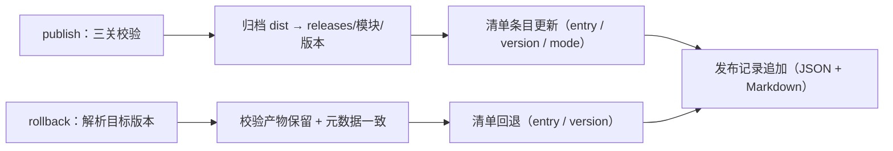

# 02 详细设计 · 模块清单与发布治理

> 前端插件化 · 03 隔离与治理 · 子任务 02（需求 05-6）· 详细设计

[文档首页](../../../../../../文档首页.md) › [03 隔离与治理](../03_隔离与治理_02_模块清单与发布治理.md) › 详细设计　|　[← 任务](../03_隔离与治理_02_模块清单与发布治理.md)

## 1. 设计目标与范围 <a id="goal"></a>

在 [01_02](../../../01_扩展点与装配/01_扩展点与装配_02_宿主加载器运行时化与模块契约远端对接/01_扩展点与装配_02_宿主加载器运行时化与模块契约远端对接.md)（清单结构与严格解析 / 加载器与拒绝口径）、[02_01](../../../02_运行时加载/02_运行时加载_01_ModuleFederation接入与模块独立构建/02_运行时加载_01_ModuleFederation接入与模块独立构建.md)（模块独立工程与独立产物 / 远端命名约定）、[03_01](../../03_隔离与治理_01_样式与运行时隔离/03_隔离与治理_01_样式与运行时隔离.md)（隔离护栏源码面 + 产物面）之上，把「模块能独立发布」推进为**可治理、可验证、可回滚**的发布闭环：

1. **模块清单**——清单字段扩为「名称 / 入口 / 版本 / 加载形态 / **可见性**」；清单是模块**加载与回滚的唯一来源**（加载器只认清单，发布 / 回滚只改清单）；
2. **版本发现**——模块构建产出**产物元数据**（`dist/module.meta.json`：名称 / 版本 / 契约版本）；发布与 CI 校验「清单版本 = 产物元数据 = 源码版本」，通过才可入清单；
3. **独立发布**——发布流程（**三关强校验**（版本 / 隔离 / 共享）→ 产物归档 → 清单更新 → 发布留痕）落为平台脚本，本地与 CI 同口径；
4. **回滚**——清单版本回退到上一版本（模块产物保留）；灰度 / 蓝绿仅保留「按清单指向切换」的最小能力；
5. **模块契约测试**——契约用例工厂 `describeModuleContract`（注入上下文 / 注册声明 / 共享依赖 / 样式约束）落 `@bms/core/testing`，各模块跑**同一套断言**，平台侧另有「契约用例齐备」发现性护栏；
6. **契约版本**——平台常量 `MODULE_CONTRACT_VERSION` + 模块自报 `contractVersion`（定义与产物元数据），加载器与发布 / 回滚双端校验，契约变更走版本升级；
7. **发布留痕**——发布记录（谁 / 何时 / 哪个版本 / 前后版本）落仓库内文件（JSON 真源 + Markdown 摘要），与既有「发布记录登记」口径一致；
8. **本地发布存储**——零依赖静态服务托管版本目录，回滚演练端到端可跑；演示清单指向版本化发布地址。

**不在本期**：生产 / mjbk 部署形态（产物上传与部署侧清单，归部署阶段）、灰度进阶（按用户 / 租户 / 比例分流）、按模块可观测与 sourcemap（`03_03`）、业务页面接入指南（`04_01`）。

### 1.1 现状与缺口 <a id="gap"></a>

```text
frontend/
├── apps/desktop/
│   ├── public/modules.json              # 清单（当前指向开发地址 http://localhost:5002/remoteEntry.js） ← 本期 发布后指向版本目录
│   ├── vite.config.ts                   # 宿主构建（纯 host）
│   └── src/module/                      # 清单获取 / 加载器装配 / 远端解析器                    ← 本期 装配汇总补「停用项」
├── modules/demo/
│   ├── package.json                     # 版本 0.1.0（与模块定义 / 清单三处重复）                ← 本期 package.json 为单一来源 + 构建注入
│   ├── vite.config.ts                   # MF remote（共享声明取自单一来源）                      ← 本期 +版本注入 +产物元数据插件
│   ├── src/index.ts                     # 模块定义（手写版本 0.1.0、无契约版本）                 ← 本期 版本注入 + contractVersion
│   └── tests/                           # 模块定义用例（各写各的断言）                          ← 本期 契约用例工厂 + 契约用例文件
├── packages/core/src/module/
│   ├── manifest.ts                      # 清单契约与严格解析（name/entry/version/mode）          ← 本期 +enabled
│   ├── loader.ts                        # 清单驱动加载器（形状 / 名称版本校验）                   ← 本期 +停用跳过 +契约版本校验
│   ├── define.ts                        # defineModule                                        ← 本期 +contractVersion 校验
│   └── contract.ts                      # （本期新增）平台契约版本常量
├── packages/core/testing/               # 契约用例工厂（`describeContract` 等）                  ← 本期 +describeModuleContract
├── scripts/                             # 共享声明 / 隔离扫描 / 白名单护栏                         ← 本期 +module-meta / release-module / serve / check-module-manifest
└── releases/                            # （本期新增）发布存储（版本目录 + 发布记录；产物 gitignore）
```

缺口：① 清单字段无**可见性**（停用须删条目，恢复成本高、留痕差）；② 版本在 package.json / 模块定义 / 清单**三处手写**，无「产物版本」权威与一致性校验；③ 模块发布 / 回滚**无工具、无流程**（手工拷贝与改清单，不可复现）；④ 回滚依赖「旧产物保留」与「清单指向」，两处均无机制与演练；⑤ 模块契约测试**各写各的**（无同一套断言、无覆盖保证）；⑥ 契约变更**无版本口径**（模块与平台错位只能在运行期以疑难问题暴露）；⑦ 发布**无留痕**（谁 / 何时 / 哪个版本不可追溯）；⑧ 本地无多版本托管（回滚演练不可端到端）。

## 2. 交付物清单 <a id="deliver"></a>

| # | 交付物 | 落点 |
| --- | --- | --- |
| 1 | 清单契约扩展：可见性 `enabled`（缺省 `true`）与严格解析 | `core/src/module/manifest.ts`、`core/src/index.ts` |
| 2 | 契约版本常量（平台侧） | `core/src/module/contract.ts`（新增）、`core/src/index.ts` |
| 3 | 模块定义增 `contractVersion`（校验正整数）与加载器校验（形状 + 契约版本 + 停用拒绝） | `core/src/module/types.ts`、`define.ts`、`loader.ts` |
| 4 | **契约用例工厂** `describeModuleContract`（注入上下文 / 注册声明 / 共享依赖 / 样式约束） | `core/testing/module.ts`（新增）、`core/testing/index.ts` |
| 5 | 契约版本单一来源（脚本消费）与 core 常量一致性护栏用例 | `frontend/module-contract.json`（新增）、`core/tests/guard-module-contract.spec.ts`（新增） |
| 6 | 产物元数据插件与版本注入（构建期；vite / vitest 同用） | `frontend/scripts/module-meta.mjs` + `.d.mts`（新增） |
| 7 | 模块工程接入（版本注入 + 元数据插件 + 契约用例 + 契约版本声明） | `modules/demo/vite.config.ts`、`vitest.config.ts`、`src/env.d.ts`、`src/index.ts`、`tests/module-contract.spec.ts`（新增）、`tests/module-definition.spec.ts` |
| 8 | **发布 / 回滚工具**（publish / rollback / status / disable / enable；三关强校验 + 归档 + 清单更新 + 留痕） | `frontend/scripts/release-module.mjs` + `.d.mts`（新增） |
| 9 | 发布记录（JSON 真源 + Markdown 摘要） | `frontend/releases/release-log.json`、`release-log.md`（新增，随仓库提交） |
| 10 | 本机发布存储静态服务（零依赖、CORS、版本目录托管） | `frontend/scripts/serve-module-releases.mjs`（新增） |
| 11 | 清单 / 版本发现 / 契约用例齐备护栏 | `frontend/scripts/check-module-manifest.mjs` + `.d.mts`（新增） |
| 12 | 白名单护栏泛化（多模块 + 纯函数导出，供契约用例与发布前强校验复用） | `frontend/scripts/check-shared-whitelist.mjs`、`shared-deps.mjs`（`readSharedSource` 支持 root） |
| 13 | 宿主装配：停用项跳过与汇总（`disabled`） | `apps/desktop/src/module/host.ts` |
| 14 | 演示清单指向版本化发布地址（发布后） | `apps/desktop/public/modules.json` |
| 15 | 核心用例（可见性 / 契约版本 / 契约工厂） | `core/tests/module-manifest.spec.ts`、`module-loader.spec.ts`、`module-contract.spec.ts`（新增）、`guard-module-contract.spec.ts`（新增） |
| 16 | 宿主用例（停用跳过 / 契约版本拒绝 / 发布回滚工具与护栏） | `apps/desktop/tests/module-hosting.spec.ts`、`module-release.spec.ts`（新增） |
| 17 | CI 接线（遍历模块 + 清单校验）与镜像多模块预装 | `.gitlab-ci.yml`、`deploy/ci/Dockerfile.frontend` |
| 18 | 回滚端到端演练（临时工作区 0.1.0 → 0.2.0 → 回滚 0.1.0） | 本目录 `实施/` 记录（含命令与证据） |
| 19 | 强制口径与流程成文（模块发布与回滚节 / 模块清单与发布治理节 / 模块契约回写） | 《[部署发布规范](../../../../../../规范/部署发布规范.md)》、《[前端开发规范](../../../../../../规范/前端开发规范.md)》、《[前端模块契约](../../../../../../设计/架构设计/35_架构设计_前端模块契约.md)》 |
| 20 | 登记回写（架构 / 基类清单 / 审计资产 / 知识档案 / 计划 / 任务 / README） | 见 §6 |
| 21 | 任务实施记录 / 测试记录 | 本目录 `实施/`、`测试/` |

## 3. 接口 / 契约与边界 <a id="contract"></a>

### 3.1 清单契约扩展：可见性 <a id="manifest"></a>

`ModuleManifestEntry` 增 `enabled`（**解析后恒有值**）：

```ts
/** 模块清单项。 */
export interface ModuleManifestEntry {
  /** 模块名（`MODULE_NAME_PATTERN`）。 */
  name: string
  /** 入口：`local` 为模块源码标识（宿主本地入口表键）；`remote` 为远端入口 URL。 */
  entry: string
  /** 版本（须与模块自报 `manifest.version` 严格相等）。 */
  version: string
  /** 加载形态（缺省 `local`；解析后恒有值）。 */
  mode: ModuleLoadMode
  /** 可见性（缺省 `true`；`false`＝停用：不加载、不挂载、不进菜单）。 */
  enabled: boolean
}
```

| 校验 | 口径 | 处置 |
| --- | --- | --- |
| `enabled` 取值 | 缺省按 `true` 归一；出现时须为**布尔** | 非法值该项**拒绝加载**并记入 `rejected`（原因含非法取值） |
| 其余校验 | 沿用 `01_02` / `02_01`（三字段 / `mode` / 远端绝对 URL / 重名） | 不变 |

- 语义：`enabled: false` 是**清单内停用**——保留入口与版本（恢复即改回 `true`），用于应急停用与灰度「按清单指向切换」的最小能力；
- 加载器（`ManifestModuleLoader`）：停用项**不进可加载集**（`names()` 只列可见项），`load()` 对停用项拒绝（`PROVIDER_NOT_REGISTERED`，原因明示「模块不可见（清单 enabled=false）」）；
- 宿主装配（`installModules`）：跳过停用项、**不记错误状态**（停用是预期状态），汇总增 `disabled: string[]`。

### 3.2 契约版本（contractVersion） <a id="contract-version"></a>

**平台常量**（`core/src/module/contract.ts`，新增）：

```ts
/**
 * 模块契约版本（平台侧唯一常量）。
 *
 * 递增口径（**不向后兼容**的契约变更）：注入上下文项增删改、注册声明通道增删、
 * 清单字段语义变更、加载校验链变化。模块经 `manifest.contractVersion` 自报构建时契约版本，
 * 加载器校验一致才允许加载（契约升级须模块适配并重新构建后发布）。
 */
export const MODULE_CONTRACT_VERSION = 1
```

| 面 | 口径 |
| --- | --- |
| 模块自报 | `ModuleManifest`（模块定义）增 `contractVersion: number`（`defineModule` 校验为正整数，否则 `CAPABILITY_VIOLATION`） |
| 加载器校验 | 形状校验含 `contractVersion` 为数字；随后校验 `definition.manifest.contractVersion === MODULE_CONTRACT_VERSION`，不一致即**拒绝加载**（`CAPABILITY_VIOLATION`，原因明示两侧版本） |
| 产物元数据 | `dist/module.meta.json` 含 `contractVersion`；发布与回滚校验「产物元数据 = 平台常量」，不一致即拒绝（契约升级未适配的产物不得入清单 / 不得回滚生效） |
| 清单条目 | **不新增字段**（避免同一信息三处出现）：契约版本是「产物属性」，经产物元数据发现，由加载器在运行期二次校验 |
| 单一来源 | 脚本侧读 `frontend/module-contract.json`（`{ "contractVersion": 1 }`）；core 常量与其一致性由护栏用例断言（`guard-module-contract.spec.ts`），防两处漂移 |

### 3.3 产物元数据与版本注入 <a id="meta"></a>

**单一来源**：模块工程 `package.json` 的 `version` 为模块版本唯一权威；构建期注入模块定义（定义不再手写版本），产物元数据在构建期生成。

`frontend/scripts/module-meta.mjs`（零依赖 ESM；类型声明 `.d.mts`）：

```js
/** 产物元数据文件名（发布与护栏的「产物版本」权威）。 */
export const MODULE_META_FILE = 'module.meta.json'
/** 构建期注入的版本常量名（模块定义经它取得 package.json 版本）。 */
export const MODULE_VERSION_DEFINE = '__BMS_MODULE_VERSION__'
/** 读取模块工程 package.json（版本单一来源）。 */
export function loadModulePackage(moduleDir)
/** 生成构建 define（vite / vitest 同用，缺一即测试与构建版本不一致）。 */
export function moduleVersionDefine(version)
/** 读取平台模块契约版本（单一来源 `frontend/module-contract.json`）。 */
export function loadModuleContractVersion(frontendDir)
/** 产物元数据插件（构建结束 emit `module.meta.json`：名称 / 版本 / 契约版本）。 */
export function createModuleMetaPlugin({ name, version, contractVersion })
```

模块工程接入（演示模块示范，`04_01` 照此）：

```ts
// vite.config.ts / vitest.config.ts
const pkg = loadModulePackage(MODULE_DIR)
const contractVersion = loadModuleContractVersion(FRONTEND_DIR)
export default defineConfig({
  define: moduleVersionDefine(pkg.version),
  plugins: [..., createModuleMetaPlugin({ name: MODULE_NAME, version: pkg.version, contractVersion })],
})
```

```ts
// src/env.d.ts
declare const __BMS_MODULE_VERSION__: string
// src/index.ts
import { MODULE_CONTRACT_VERSION, defineModule } from '@bms/core'
export const demoModule = defineModule({
  manifest: { name: 'demo', version: __BMS_MODULE_VERSION__, contractVersion: MODULE_CONTRACT_VERSION },
  ...
})
```

| 项 | 口径 |
| --- | --- |
| 元数据内容 | `{ "name", "version", "contractVersion" }`（不含构建时间——记录由发布留痕承载，保持产物可复现） |
| 生成时机 | 构建结束（`generateBundle`，`apply: 'build'`）；远端与独立预览两个构建目标均产出（发布只读 `dist/`） |
| 一致性断言 | 契约用例断言 `定义版本 = package.json 版本`；清单护栏断言 `产物元数据 = package.json = 清单版本`、`元数据契约版本 = 平台常量` |

### 3.4 发布前强校验（三关） <a id="guards"></a>

发布前串行执行**三关**，任一违规即拒绝发布（退出码 1，**不写任何文件**）：

| 关 | 判据 | 复用 |
| --- | --- | --- |
| ① 版本 | 产物存在（`dist/remoteEntry.js`）；元数据存在且 `name` / `version` / `contractVersion` 与模块工程、平台契约版本一致；同版本产物**不可变**（已归档即拒绝，`--force` 仅本地重发例外） | 本脚本 |
| ② 隔离 | 模块源码面（`modules/*/src/**` + 宿主本地模块目录）与产物面（CSS + 模块自有 JS 块）扫描零违规 | `check-module-isolation.mjs`（`scanModuleSources` / `scanModuleProducts`） |
| ③ 共享 | 构建配置取自单一来源；模块依赖落白名单；两侧实装版本满足版本要求；受控非共享项体积在阈值内 | `check-shared-whitelist.mjs`（泛化后的纯函数） |

> ②③ 是**同一实现**被发布入口与 CI 复用（不重复实现规则）：本地手工发布也不漏既有门禁；CI 仍保留独立 job（`desktop-check` / `module-build` / `shared-deps-check`）兜底。

### 3.5 发布 / 回滚工具 <a id="release"></a>

`frontend/scripts/release-module.mjs`（零依赖 ESM；类型声明 `.d.mts`；本地与 CI 同口径）：

```text
node frontend/scripts/release-module.mjs publish  --module <模块名> [--origin <基址>] [--by <操作者>] [--force] [--dry-run]
node frontend/scripts/release-module.mjs rollback --module <模块名> [--to <版本>] [--by <操作者>]
node frontend/scripts/release-module.mjs disable  --module <模块名> [--by <操作者>]
node frontend/scripts/release-module.mjs enable   --module <模块名> [--by <操作者>]
node frontend/scripts/release-module.mjs status   [--module <模块名>]
```

| 项 | 口径 |
| --- | --- |
| 路径根 | 全部路径由 `--root <frontend 目录>` 推导（缺省脚本位置推断）；`--root` 供**演练与测试**在临时工作区跑全流程，不污染仓库 |
| 操作者 | `--by` > `git config user.name` > 环境变量 `USER`（记录留痕用） |
| 发布 | 三关校验 → 归档 `dist/` 全量到 `releases/<模块名>/<版本>/` → 清单条目更新（`entry` 指向 `<origin>/<模块名>/<版本>/remoteEntry.js`、`version` 写入产物版本、`mode` 置 `remote`）→ 追加发布记录 |
| 基址 | `--origin` > 清单现有条目 origin > `http://localhost:5002`（生产清单由部署阶段替换为 nginx / CDN 基址） |
| 版本不可变 | 目标版本目录已存在即拒绝（**回滚依赖旧版本产物不被覆盖**）；`--force` 仅限本地开发重发（记录动作 `republish`；生产禁用，成文） |
| 形态边界 | 清单条目为 `mode: local` 时**拒绝发布**（发布即远端形态；避免隐式翻转加载形态） |
| 回滚 | 目标版本取 `--to`，缺省取发布记录中该模块**上一个版本**；校验目标产物存在、元数据名称 / 版本一致、契约版本 = 平台常量；更新清单 `entry` / `version`（`enabled` / `mode` 不动）→ 追加记录（动作 `rollback`，含前后版本） |
| 停用 / 启用 | 改清单 `enabled`（显式写入）→ 追加记录（动作 `disable` / `enable`）；停用不改入口与版本 |
| 状态 | 打印清单条目、已归档版本（含契约版本）、最近记录；供排障与演练核对 |
| 写序 | 校验 → 归档 → 清单 → 记录（清单与记录在归档成功后才写；中途失败不产生「清单指向不存在产物」的状态） |
| 清单写回 | 2 空格缩进 JSON + 末尾换行；**保留**未涉及字段原值；新条目写 `{ name, entry, version, mode: 'remote' }`（不写 `enabled`，缺省可见） |
| 退出码 | 违规 / 拒绝 → 1（打印违规清单）；成功 → 0 |

发布 / 回滚时序：



### 3.6 发布记录（留痕） <a id="log"></a>

| 项 | 口径 |
| --- | --- |
| 落点 | `frontend/releases/release-log.json`（**真源**）、`frontend/releases/release-log.md`（脚本生成的摘要）；两者随仓库提交，产物目录 gitignore |
| 记录字段 | `at`（ISO 时间）/ `by`（操作者）/ `action`（`publish` / `republish` / `rollback` / `disable` / `enable`）/ `module` / `version` / `previousVersion` / `entry` / `contractVersion` |
| 结构 | `{ "version": 1, "records": [ ... ] }`（追加式；不重写历史记录） |
| 摘要 | Markdown 表格（时间 / 操作者 / 动作 / 模块 / 版本 / 前版本 / 入口），由脚本从 JSON 重生成（防手工改 JSON 后摘要漂移） |
| 口径一致 | 与《部署发布规范》「发布记录（版本、时间、变更、负责人）登记」同口径；git 提交为第二重留痕（谁 / 何时 / 哪个版本） |

### 3.7 本机发布存储服务 <a id="serve"></a>

`frontend/scripts/serve-module-releases.mjs`（零依赖 `node:http`）：

```text
node frontend/scripts/serve-module-releases.mjs [--root <frontend 目录>] [--port 5002] [--host 127.0.0.1]
```

| 项 | 口径 |
| --- | --- |
| 托管 | `<root>/releases/**` 静态文件（URL 即 `/模块名/版本/remoteEntry.js`，与清单 `entry` 同构） |
| 响应 | 放开 CORS（`Access-Control-Allow-Origin: *`）、`Cache-Control: no-cache`（开发口径，避免旧版本缓存干扰演练）、常见 MIME（js / css / json / html / svg / png / woff2 / map 等） |
| 安全 | 路径穿越防护（解析后须落在 releases 根内）；仅 GET / HEAD（其余 405）；404 明确 |
| 索引 | 根路径输出版本目录清单（模块 → 版本），供演练核对 |
| 定位 | 本机演练与联调形态；生产由 nginx / CDN 托管版本目录（部署阶段落地），清单地址替换归部署流程 |

### 3.8 清单 / 版本发现 / 契约用例齐备护栏 <a id="manifest-guard"></a>

`frontend/scripts/check-module-manifest.mjs`（零依赖；挂 `module-build`，本地可复跑）：

| # | 断言 | 判据 |
| --- | --- | --- |
| 1 | 清单可解析 | 严格解析零拒绝（口径与 core 一致；一致性由宿主用例以 fixture 对照断言） |
| 2 | 远端条目版本化 | `mode: remote` 条目 `entry` 匹配 `<基址>/<名称>/<版本>/remoteEntry.js`，且路径版本 = 条目 `version`（版本目录约定） |
| 3 | 本地条目可解析 | `mode: local` 条目 `entry` 对应宿主本地入口表（`apps/desktop/src/modules/<entry>/index.ts` 存在） |
| 4 | 版本发现 | 模块工程存在时：`package.json` 版本 = 条目版本；`dist/` 存在时：产物元数据 = `package.json` = 条目版本、元数据契约版本 = 平台常量 |
| 5 | 契约用例齐备 | 每个模块工程 `tests/module-contract.spec.ts` 存在且引用 `describeModuleContract`（「全部注册实现跑同一套断言」的发现性保证） |
| 6 | 留痕一致 | 发布记录存在且有该模块记录时：最近一条记录的 `version` = 清单当前版本 |

> 归档产物存在性不在护栏内（`releases/` gitignore、CI 无归档）：由发布 / 回滚流程与记录保证，本地经 `status` 核对。

### 3.9 模块契约测试（同一套断言） <a id="contract-test"></a>

`@bms/core/testing` 新增契约用例工厂（与既有 `describeContract` / 各能力契约套件同体系）：

```ts
/** 模块契约用例工厂目标。 */
export interface ModuleContractTarget {
  /** 模块定义（入口默认导出产物）。 */
  definition: ModuleDefinition
  /** 宿主清单条目（提供时断言名称 / 版本一致与形态合法）。 */
  manifestEntry?: ModuleManifestEntry
  /** 事实断言（由平台护栏纯函数产出；提供时断言零违规）。 */
  facts?: {
    /** 模块工程 package.json 版本（版本单一来源）。 */
    packageVersion?: string
    /** 共享依赖护栏违规清单。 */
    sharedViolations?: string[]
    /** 隔离扫描违规清单（源码面 + 产物面）。 */
    isolationViolations?: string[]
  }
}
/** 登记模块契约用例套件（各模块传入自身实现，跑同一套断言）。 */
export function describeModuleContract(name: string, target: ModuleContractTarget): void
```

| 用例组 | 断言 |
| --- | --- |
| 定义与契约版本 | 定义冻结；名称合 `MODULE_NAME_PATTERN`；版本非空；`contractVersion === MODULE_CONTRACT_VERSION` |
| 清单一致（提供条目时） | 名称 / 版本与清单**严格相等**；`mode` 合法；`remote` 时入口为绝对 URL |
| 注入上下文 | `setup(Object.freeze({}))` 不抛错并返回声明对象（只读快照、缺失项自行降级，不假定存在） |
| 注册声明 | 八类通道：路由 `path` 以 `/` 开头、`component` 为函数、有标题；组件 / 字段渲染器 / 图标 / 卡片 / 区域 / 令牌 / 文案包键均带 `<模块名>:` 前缀；区域标识点分；语言标识小写；令牌键 `--bms-*` |
| 版本单一来源（提供 `packageVersion` 时） | 定义版本 = package.json 版本 |
| 共享依赖（提供 `sharedViolations` 时） | 违规清单为空 |
| 样式约束（提供 `isolationViolations` 时） | 违规清单为空 |

- 核心包**不触文件系统**：共享与隔离事实由模块用例调用平台脚本纯函数后传入（保持 core 框架无关）；
- 各模块工程 `tests/module-contract.spec.ts` 调用本工厂（演示模块示范，`04_01` 照此）；平台侧由 §3.8 断言 5 保证「全部注册实现」不遗漏；
- 契约变更（平台常量递增）时：模块须适配并升版本、重新构建发布（§3.2），契约用例在模块侧以同一套断言复验。

### 3.10 宿主装配改造 <a id="host"></a>

```ts
/** 清单装载结果汇总（成功项 / 停用项 / 失败项与原因）。 */
export interface ModuleInstallSummary {
  mounted: string[]
  /** 停用项（清单 `enabled: false`；不加载、不记错误状态）。 */
  disabled: string[]
  failures: { name: string; version: string; reason: string }[]
}
```

- `installModules`：清单获取 → 构造加载器 → 逐条挂载（**跳过停用项**）→ 归集失败；清单获取失败仍按「空清单 + 错误状态」不阻塞启动（沿用 `01_02`）；
- 菜单 / 路由 / 令牌 / 文案的消费与卸载还原不变（停用项从未挂载，天然无残留）。

### 3.11 CI 接线 <a id="ci"></a>

| 项 | 口径 |
| --- | --- |
| `module-check` | 遍历 `frontend/modules/*`（每模块 `lint` / `typecheck` / `test`，含契约用例）——后续新增模块自动纳入，`04_01` 加样例模块时 CI 零改动 |
| `module-build` | 遍历模块（`build` / `budget` / `guard:isolation`）后追加 `node frontend/scripts/check-module-manifest.mjs`（清单 / 版本发现 / 契约用例齐备） |
| CI 基础镜像 | `deploy/ci/Dockerfile.frontend` 的模块预装由硬编码 `demo` 改为遍历 `frontend/modules/*`（每模块 `npm ci`） |
| `shared-deps-check` | 不变（白名单脚本泛化后覆盖全部模块） |
| 触发路径 | 与前端 job 同口径（`frontend/**/*`、锁文件、`deploy/**`、`.gitlab-ci.yml`） |
| 本地复跑 | `node frontend/scripts/check-module-manifest.mjs`、`node frontend/scripts/check-module-isolation.mjs`、`node frontend/scripts/check-shared-whitelist.mjs` |

### 3.12 演示清单、本地联调与回滚演练 <a id="drill"></a>

**演示清单**（发布后提交）：`apps/desktop/public/modules.json`

```json
[{ "name": "demo", "entry": "http://localhost:5002/demo/0.1.0/remoteEntry.js", "version": "0.1.0", "mode": "remote" }]
```

**本地联调流程**：

```bash
cd frontend/modules/demo && npm run build                 # 1. 模块独立构建（产出 dist/ 与 module.meta.json）
node frontend/scripts/release-module.mjs publish --module demo   # 2. 发布（三关校验 → 归档 → 清单 → 留痕）
node frontend/scripts/serve-module-releases.mjs           # 3. 起发布存储（终端 A）
cd frontend/apps/desktop && npm run dev                   # 4. 起宿主（终端 B）
```

- 模块迭代：改代码 → `npm run build` → `publish --module demo --force`（同版本本地重发，记录动作 `republish`）；版本升级则先改 `package.json` 版本再发布（**版本目录不可变，回滚依赖旧产物**）；
- 生产禁用 `--force`（版本不可变），成文于《部署发布规范》「模块发布与回滚」节。

**回滚端到端演练**（临时工作区，不污染仓库）：`--root` 指向最小镜像（模块工程 + 清单 + 共享 / 契约声明 + 发布存储），执行「发布 0.1.0 → 升 0.2.0 发布 → 回滚 0.1.0」，起发布存储并核对清单指向与产物保留；命令、输出与清单前后状态落实施记录。

## 4. 失败分支与边界 <a id="edge"></a>

| 边界 / 失败场景 | 处置 |
| --- | --- |
| 清单 `enabled` 取值非法（非布尔） | 该项拒绝加载并记入 `rejected`（其余项照常） |
| 清单项停用（`enabled: false`） | 不加载、不挂载、不进菜单；汇总记入 `disabled`，不记错误状态 |
| 直接对停用项调用加载 | 拒绝（`PROVIDER_NOT_REGISTERED`，原因明示停用） |
| 模块定义缺 `contractVersion` / 非正整数 | `defineModule` 抛错（构建期暴露）；入口缺字段则形状校验拒绝（`CAPABILITY_VIOLATION`） |
| 模块契约版本 ≠ 平台常量 | 加载拒绝（`CAPABILITY_VIOLATION`，明示两侧版本）；发布 / 回滚同样拒绝（产物元数据校验） |
| 产物缺失 / 元数据缺失 / 名称版本不一致 | 发布拒绝（退出码 1，不写文件） |
| 同版本产物**已归档**再发布 | 拒绝（版本不可变，回滚依赖旧产物不被覆盖）；`--force` 例外（本地开发，记录 `republish`，生产禁用）——清单已有同版本但未归档（如开发地址迁移为版本目录）仍属首次发布 |
| 隔离扫描有违规 | 发布拒绝（列出违规清单）；CI 仍独立拦截 |
| 共享白名单 / 版本要求违规 | 发布拒绝；CI `shared-deps-check` 独立拦截 |
| 清单条目为 `mode: local` 时发布 | 拒绝（避免隐式翻转加载形态） |
| 清单解析出现被拒项 | 发布拒绝（先修清单） |
| 回滚无上一版本（仅发布过一次） | 拒绝并提示用 `--to` 指定或先发布新版本 |
| 回滚目标产物已被清理 | 拒绝（产物保留是回滚前提，提示重发或换目标版本） |
| 回滚目标契约版本 ≠ 平台常量 | 拒绝（旧产物不适配当前契约，须重新构建发布） |
| 停用 / 启用条目不存在 | 拒绝（清单未登记该模块） |
| 发布存储目录不存在 / 端口占用 | 服务脚本明确报错（不静默） |
| 发布中途失败（归档后清单写入前） | 清单未变（指向仍为旧版本）；重试发布时同版本已归档 → 用 `--force` 或改版本 |
| 清单获取失败 / 清单不可用（宿主运行期） | 沿用 `01_02`：不阻塞启动（空清单 + 错误状态） |
| 生产 / mjbk 部署形态 | 不在本期（产物上传 + 部署侧清单归部署阶段） |

## 5. 测试设计与验收映射 <a id="test"></a>

| 验收点（需求 05-6 完成标准） | 用例 / 验证 |
| --- | --- |
| 1 模块清单可用且字段与加载器口径一致 | `core/tests/module-manifest.spec.ts`（`enabled` 缺省 / 非法 / 停用）、`module-loader.spec.ts`（停用拒绝、`names()` 排除停用）、`apps/desktop/tests/module-hosting.spec.ts`（停用项跳过并计入 `disabled`） |
| 2 独立发布与**回滚**可执行并演练通过（清单版本回退生效） | `apps/desktop/tests/module-release.spec.ts`（发布 / 回滚 / 停用纯函数：归档、清单写回、版本不可变、记录与摘要、三关拒绝、回滚目标解析）；**回滚端到端演练**（临时工作区 0.1.0 → 0.2.0 → 回滚 0.1.0，起发布存储核对）证据落实施记录 |
| 3 模块契约测试覆盖全部注册实现（同一套断言） | `core/tests/module-contract.spec.ts`（工厂以最小实现跑通）、`modules/demo/tests/module-contract.spec.ts`（演示模块经工厂 + 事实断言）、`check-module-manifest.mjs` 断言 5（契约用例齐备发现性护栏） |
| 4 发布与回滚流程成文（含校验项与留痕要求） | 《部署发布规范》「模块发布与回滚」节、《前端开发规范》「模块清单与发布治理」节、《前端模块契约》§4 / §6 / §7 回写 |
| 版本发现（清单 = 产物 = 源码） | `check-module-manifest.mjs` 断言 4（CI）；`module-release.spec.ts`（版本不一致拒绝）；`module-meta` 注入与元数据产出（构建后 `module-build` 实跑断言） |
| 契约版本双端校验 | `core/tests/module-loader.spec.ts`（契约版本不匹配拒绝）、`guard-module-contract.spec.ts`（core 常量 = JSON 单一来源）、`module-release.spec.ts`（产物契约版本校验） |
| 清单解析口径与 core 一致 | `module-release.spec.ts` 以 fixture 对照 `parseManifest`（脚本）与 `parseModuleManifest`（core）逐项一致（含 `enabled` / `mode` / 非法值） |
| 护栏全绿 | `cd frontend/apps/desktop && npx vue-tsc -b && npm run lint && npm run test:cov && npm run build && npm run budget`；`cd frontend/modules/demo && npm run lint && npm run typecheck && npm run test && npm run build && npm run budget && npm run guard:isolation`；根 `npm run check`；三条平台脚本实跑 |
| Kiwi 用例关联 | 一任务一条，**先登记取号（以平台回读编号为准）**再回填代码标注 |

文档门禁：`scripts/tools/base-check/check-base.py`、`check-links.py`、`check-docs/check-status.py --stage 05_前端插件化 --strict`。

## 6. 登记落点 <a id="register"></a>

| 内容 | 落点 |
| --- | --- |
| 模块发布与回滚流程（校验项 / 留痕 / 版本不可变 / 灰度口径 / 契约变更协同升级） | 《[部署发布规范](../../../../../../规范/部署发布规范.md)》新增「模块发布与回滚」节 |
| 清单字段与唯一来源、版本发现、发布门禁、契约版本、契约用例齐备（强制口径） | 《[前端开发规范](../../../../../../规范/前端开发规范.md)》新增「模块清单与发布治理（强制）」节 |
| 清单字段（`enabled`）、契约版本、发布治理与检查项 | 《[前端模块契约](../../../../../../设计/架构设计/35_架构设计_前端模块契约.md)》§4 / §5 / §6 / §7 |
| 治理表「模块清单与发布治理」行回写落地 | 《[前端架构](../../../../../../设计/架构设计/08_架构设计_前端架构.md)》§9 |
| 新增脚本与文件落点（发布 / 服务 / 元数据 / 护栏） | 《[前端基类清单](../../../../../../前端基类清单.md)》§9「目录与依赖」`frontend/scripts/` 行 |
| 新护栏维度（清单与发布治理） | 《[前端资产清单](../../../../../../审计/01_审计_前端资产清单.md)》§2 新增维度行 |
| 本项目发布治理现状 | 知识档案《[微前端 · 04 隔离与治理](../../../../../../资料/知识档案/微前端/04_微前端_隔离与治理.md)》§9 |
| 需求 / 任务 / README / 计划表现（工时与状态） | `任务/03_隔离与治理/…`、`README.md`、`计划/01_计划_前端插件化.md`（工时 16h → 20h、窗口顺延、父任务合计 44h） |
| 任务 / 计划状态 | 任务信息表 + 父任务子任务清单 + 计划 §2 / §3 |
| 下游消费方（`04_01` 前置契约已交付） | `任务/04_首个模块样例/…` 参考文档补注；`03_01` 测试记录 §6 口径修正（清单结构按本任务扩展） |

## 7. 边界与开放项 <a id="open"></a>

- **生产 / mjbk 部署形态**：产物上传、部署侧清单（仓库内清单不写内网信息）、nginx 版本目录托管——归部署阶段（`04_01` / 阶段十三），本任务只落本机形态与流程口径；
- **灰度 / 蓝绿进阶**：本期仅「按清单指向切换」（版本指向 + `enabled` 开关）；按用户 / 租户 / 比例分流后补；
- **产物留存窗口**：模块产物保留窗口与平台镜像留存策略一致（架构 33 §9），清理机制随部署阶段落地；
- **sourcemap**：产物 sourcemap 归档与映射归 `03_03`；
- **契约版本递增维护**：`MODULE_CONTRACT_VERSION` 与 `frontend/module-contract.json` 的一致性由护栏用例守住；递增须同步《前端模块契约》与协同升级流程；
- **`--force` 重发**：仅本地开发（记录 `republish`）；生产禁用（版本不可变），若确需修复走新版本发布；
- **清单获取失败**：沿用「空清单 + 错误状态，不阻塞启动」（`01_02`）；
- **`04_01` 接收项**：样例模块按本任务发布 / 回滚流程接入并沉淀接入指南；契约用例经同一工厂。（**已闭环 2026-09-22**：sample 经同一契约工厂、端到端发布回滚演练、接入指南成文。）

## 8. 决策记录 <a id="decision"></a>

| # | 决策项 | 结论 |
| --- | --- | --- |
| 1 | 清单可见性 | 新增 `enabled` 布尔（缺省 `true`）：对宿主可见 / 参与加载；停用保留入口与版本 |
| 2 | 版本发现 | 模块构建产出 `dist/module.meta.json`（名称 / 版本 / 契约版本）；发布与 CI 以产物元数据为「产物版本」权威 |
| 3 | 发布 / 回滚工具 | 平台脚本 `release-module.mjs`（`publish` / `rollback` / `status` / `disable` / `enable`），全模块共用 |
| 4 | 产物归档 | `frontend/releases/<模块名>/<版本>/`（gitignore）；生产以 `--origin` 指向 nginx / CDN |
| 5 | 发布存储服务 | 本机零依赖静态服务（端口 5002、CORS、版本目录）；生产部署形态归部署阶段 |
| 6 | 发布留痕 | `release-log.json`（真源）+ `release-log.md`（生成摘要），随仓库提交 |
| 7 | 契约测试套件 | `@bms/core/testing` 的 `describeModuleContract` 契约工厂；各模块同一套断言；平台加契约用例齐备护栏 |
| 8 | 契约版本 | 平台常量 + 模块自报（定义与产物元数据）；加载器与发布 / 回滚双端校验；清单条目不新增字段 |
| 9 | 演示清单指向 | 发布后指向版本化地址 `http://localhost:5002/demo/0.1.0/remoteEntry.js` |
| 10 | 版本号单一来源 | 模块 `package.json` 为权威；构建期注入定义（`__BMS_MODULE_VERSION__`）；契约用例断言定义 = package.json |
| 11 | 发布前强校验 | 版本 + 隔离 + 共享三关，复用平台脚本纯函数；缺一拒绝发布 |
| 12 | CI 接线 | 复用既有 job：`module-check` / `module-build` 遍历 `frontend/modules/*`；`module-build` 追加清单护栏；镜像多模块预装 |
| 13 | 回滚演练 | 真实端到端（临时工作区 0.1.0 → 0.2.0 → 回滚 0.1.0；发布存储 + 清单核对），证据落实施记录 |
| 14 | 可见性操作入口 | 发布脚本 `disable` / `enable` 子命令（同工具、同留痕） |
| 15 | 契约版本单一来源（脚本侧） | `frontend/module-contract.json`；与 core 常量一致性由护栏用例断言 |
| 16 | 版本不可变 | 同版本归档存在即拒绝（回滚依赖旧产物）；`--force` 仅本地重发并留痕 |
| 17 | 清单写回 | 保留未涉及字段；新条目 `{ name, entry, version, mode: 'remote' }`；`enabled` 由停用 / 启用显式写入 |
| 18 | 契约用例齐备护栏 | `check-module-manifest.mjs` 断言每个模块工程存在契约用例文件并引用契约工厂 |
| 19 | 工时口径 | 本任务 **16h → 20h**，任务文档与计划 §1 / §3 / §4 同步回写 |
| 20 | 排期窗口 | 03_02：2026-10-08 ~ 10-10；03_03：10-11；04_01：10-12 ~ 10-14 |
| 21 | 白名单护栏泛化 | `check-shared-whitelist.mjs` 导出纯函数并遍历全部模块；CLI 行为不变；`readSharedSource` 支持 root（演练 / 测试隔离） |
| 22 | 部署范围 | 本次只做本机发布存储形态；mjbk / 生产部署留部署阶段（部署侧清单，避免内网信息入库） |

## 9. 参考文档 <a id="ref"></a>

- [需求 05-6](../../../../需求/03_需求_隔离与治理.md#r05-6)
- 《[架构设计 · 前端模块契约](../../../../../../设计/架构设计/35_架构设计_前端模块契约.md)》§4 / §5 / §6 / §7
- 《[架构设计 · 前端架构](../../../../../../设计/架构设计/08_架构设计_前端架构.md)》§9「模块治理要求」表与「运行时组合」节
- 《[架构设计 · 部署与运维](../../../../../../设计/架构设计/33_架构设计_部署与运维.md)》「版本与发布管理」节（模块发布与回滚、产物保留窗口）
- 《[架构设计 · 测试与质量](../../../../../../设计/架构设计/32_架构设计_测试与质量.md)》「CI 流水线」节（模块质量检查）
- 《[部署发布规范](../../../../../../规范/部署发布规范.md)》「发布流程」「回滚」节、《[前端开发规范](../../../../../../规范/前端开发规范.md)》§14 / §15 / §16
- 《[前端基类清单](../../../../../../前端基类清单.md)》§9「目录与依赖」、《[前端资产清单](../../../../../../审计/01_审计_前端资产清单.md)》
- 知识档案《[微前端 · 04 隔离与治理](../../../../../../资料/知识档案/微前端/04_微前端_隔离与治理.md)》§6（部署、版本与灰度）
- 本域 [01_02 宿主加载器运行时化与模块契约远端对接](../../../01_扩展点与装配/01_扩展点与装配_02_宿主加载器运行时化与模块契约远端对接/01_扩展点与装配_02_宿主加载器运行时化与模块契约远端对接.md)（**前置契约已交付**：清单结构与严格解析 / 加载器拒绝口径 / 装配与卸载）
- 域 02 [02_01 Module Federation 接入与模块独立构建](../../../02_运行时加载/02_运行时加载_01_ModuleFederation接入与模块独立构建/02_运行时加载_01_ModuleFederation接入与模块独立构建.md)（**前置契约已交付**：模块独立工程与独立产物 / 远端命名约定 / 单独计量）
- 域 02 [02_02 依赖共享与版本偏斜治理](../../../02_运行时加载/02_运行时加载_02_依赖共享与版本偏斜治理/02_运行时加载_02_依赖共享与版本偏斜治理.md)（**前置契约已交付**：共享声明单一来源 / 白名单护栏 / 升级契约口径）
- 本域 [03_01 样式与运行时隔离](../../03_隔离与治理_01_样式与运行时隔离/03_隔离与治理_01_样式与运行时隔离.md)（**前置契约已交付**：隔离扫描纯函数（源码面 + 产物面）与 fixture 拦截）
- 后续任务 [03_03 可观测与失败兜底](../../03_隔离与治理_03_可观测与失败兜底/03_隔离与治理_03_可观测与失败兜底.md)、[04_01 首个模块样例](../../../04_首个模块样例/04_首个模块样例_01_首个模块样例/04_首个模块样例_01_首个模块样例.md)
- 《[测试规范](../../../../../../规范/测试规范.md)》§5「用例管理」、《[Kiwi TCMS 部署使用说明](../../../../../../资料/开发服务器/linux/KiwiTCMS部署使用说明.md)》§5.2 / §5.3

> 本文档依《[文档生成规范](../../../../../../规范/文档生成规范.md)》编写
