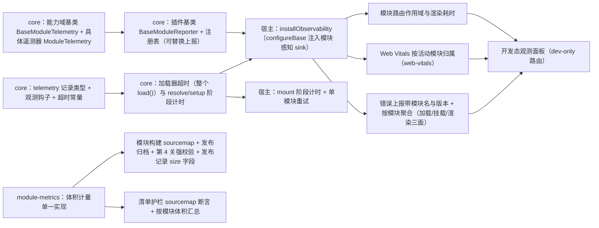

# 03 实施 · 可观测与失败兜底

> 前端插件化 · 03 隔离与治理 · 子任务 03（需求 05-7）· 实施记录

[文档首页](../../../../../../文档首页.md) › [03 隔离与治理](../03_隔离与治理_03_可观测与失败兜底.md) › 实施记录　|　[← 任务](../03_隔离与治理_03_可观测与失败兜底.md)　[测试记录 →](../测试/01_测试_03_隔离与治理_03_可观测与失败兜底.md)

## 1. 实施信息 

| 项 | 值 |
| --- | --- |
| 任务 | [03 可观测与失败兜底](../03_隔离与治理_03_可观测与失败兜底.md) |
| 对应需求 | [05-7](../../../../需求/03_需求_隔离与治理.md#r05-7) |
| 详细设计 | [01 详细设计](../设计/01_详细设计_03_隔离与治理_03_可观测与失败兜底.md) |
| 实施日期 | 2026-09-22 |
| 实施人 | minjian |
| 实施环境 | 本地开发机（Node v24.20.0 / npm 11.19.0，npmmirror）；宿主 Vite 8.2.2（Rolldown）；`@module-federation/vite` 1.22.1；`web-vitals` 6.2.2 |
| 提交 | 设计 `98866481`；实施 `8c2a256a`；登记回写与记录随本次提交 |
| 结论 | 完成（无阻塞遗留；设计层与实现层微调见 §4） |

## 2. 实施概览 

结果小结：模块加载设 **10s 超时**（整个 `load()` 计时）并拆 `resolve` / `setup` 阶段计时；失败 / 超时 / 初始化异常经模块边界 + 错误页降级（带模块名与版本），重试**仅重挂该模块**（不整页刷新、不自动重试）；观测能力入链（能力域基类 `BaseModuleTelemetry` + 插件基类 `BaseModuleReporter` 与注册表），宿主经 `configureBase` 注入**模块感知上报 sink**——错误统一携带模块名与版本、按模块聚合（加载 / 挂载 / 渲染三面）；加载三段 + 渲染耗时、产物体积按模块归因（体积随发布记录 `size` 留痕、CI 汇总）；**Web Vitals（LCP / CLS / INP）按活动模块归属**（非模块路由归 `platform`）；模块产物开**外部 sourcemap**、随发布按版本归档、发布前**第 4 关强校验**；开发态**观测面板**（dev-only）按模块查看耗时 / 错误 / Vitals。

## 3. 实施过程 

1. **遥测记录与观测钩子**（`core/src/module/telemetry.ts` 新增）：加载 / 渲染耗时（`kind: load`，阶段 `resolve` / `setup` / `mount` / `render`）、错误（`kind: error`，带模块名 / 版本 / 阶段）、Web Vitals（`kind: vital`，模块名可空）三类记录；`ModuleLoadObserver` 钩子与 `MODULE_LOAD_TIMEOUT_MS = 10_000`；按模块聚合快照类型。
2. **加载器超时与阶段计时**（`core/src/module/loader.ts`）：构造第三参 `{ observer?, timeoutMs? }`；`load(name, context, { timeoutMs? })` 对**整个 load()** 设超时（超时抛 `CAPABILITY_VIOLATION`，原因明示超时与模块名；原 Promise 后续结果被吞，不产生未处理拒绝）；`resolve` / `setup` 两段各自计时并经观测钩子记录（成败都记）。
3. **观测基类两层**（`core/src/capabilities/` 新增）：**能力域基类** `BaseModuleTelemetry`（能力键 `module-telemetry`，抽象 `record` / `snapshot` / `reset`）；**插件基类** `BaseModuleReporter` + `InMemoryModuleReporter`（缺省内存上报实现）+ `ModuleReporterProvider` / `ModuleReporterRegistry`（同键拒重、按名 / 缺省解析、未登记返回 `undefined`）；具体遥测器 `ModuleTelemetry`（内存环形记录 + 按模块聚合 + 转发上报实现，可 `useReporter` 替换）。能力依赖登记表登记 `module-telemetry`。
4. **宿主观测装配**（`apps/desktop/src/observability/` 新增）：`scope.ts`（活动模块作用域与 `withModuleScope`）、`reporter.ts`（模块感知 sink + 显式 `reportModuleError`）、`webVitals.ts`（官方 `web-vitals` 采集，缺浏览器能力静默降级）、`index.ts`（`installObservability`：注册内存上报实现 → `configureBase({ reporter })` → 安装 Web Vitals；`installModuleRouteScope`：路由就绪更新活动模块并记渲染耗时；遥测快照与重置）。
5. **宿主装配改造**（`apps/desktop/src/module/host.ts`）：装载时记录宿主上下文；加载器注入观测钩子；`mountModule` 计 `mount` 阶段耗时并登记「路由名 → 模块」；`retryModule`（卸载 → 清错误态 → 单模块重挂）；`resolveRouteModule`（路由名 → 模块）。
6. **模块边界与重试**（`ModuleBoundary.vue` / `module/boundary.ts`）：渲染异常按当前路由解析所属模块 → `reportModuleError` + 错误态（带模块名与版本）；重试调用单模块重挂（平台页面无模块可重挂时退回整页刷新）。
7. **启动接线**（`main.ts`）：`installObservability()` 先于 `installModules`；模块装载完成后 `installModuleRouteScope(router, resolveRouteModule)` 再安装路由。
8. **开发态观测面板**（`views/ModuleObservabilityView.vue` + `router/index.ts` DEV 分支）：按模块列模块清单 / 加载三段与渲染耗时 / 错误条数与明细 / Web Vitals；体积提示指向发布记录与 CI 汇总；生产构建条件恒假，不进产物。
9. **体积计量单一实现**（`frontend/scripts/module-metrics.mjs` 新增）：入口闭包口径（自 `remoteEntry.js` 出发；种子块追静态 + 动态，其余只追静态）抽为纯函数 `collectEntryClosure` / `measureModuleDist`；模块预算脚本、发布工具、清单护栏三处复用。
10. **sourcemap 与发布强校验**（`modules/demo/vite.config.ts` 开 `sourcemap: true`；`release-module.mjs`）：发布前校验新增 **sourcemap 关**（`dist/remoteEntry.js.map` 存在，缺则拒绝发布、不写文件）；发布记录增 `size`（入口 gzip 合计 / 最大块 / 块数 / 异步块数）与 `sourcemap` 标记；Markdown 摘要增体积列。
11. **清单护栏扩展**（`check-module-manifest.mjs`）：产物元数据存在时断言容器入口 sourcemap 存在；CLI 按模块打印体积汇总。
12. **演示模块重发**：构建（含 map）→ `publish --force`（本地重发，动作 `republish`）归档含 map、清单指向版本目录、发布记录含体积。
13. **口径与登记回写**：《[前端开发规范](../../../../../../规范/前端开发规范.md)》新增「模块可观测与失败兜底（强制）」节；《[部署发布规范](../../../../../../规范/部署发布规范.md)》「模块发布与回滚」节补 sourcemap 与体积小节（检查清单三关 → 四关）；《[前端模块契约](../../../../../../设计/架构设计/35_架构设计_前端模块契约.md)》§5 / §6 / §7 回写；《[前端架构](../../../../../../设计/架构设计/08_架构设计_前端架构.md)》§9 治理表对应行与《[架构设计 · 可观测性](../../../../../../设计/架构设计/27_架构设计_子系统_可观测性.md)》§3 现状回写；《[前端基类清单](../../../../../../前端基类清单.md)》§2.1 / §2.2 / §4 / §9 登记；《[前端资产清单](../../../../../../审计/01_审计_前端资产清单.md)》新增 B15 维度并更新 B14；知识档案《[微前端 · 04](../../../../../../资料/知识档案/微前端/04_微前端_隔离与治理.md)》§7 / §9 现状回写。

## 4. 问题与处置 

| # | 问题 / 现象 | 原因 | 处置 |
| --- | --- | --- | --- |
| 1 | `guard-jsdoc` 拦截加载器多行构造 / 方法签名与遥测快照内联泛型 | 护栏按「类 / 接口成员行须紧邻 JSDoc」启发式判定 | 加载器构造与 `load` 改单行签名；快照内联泛型抽为命名接口（`ModuleTelemetryModuleGroup` / `ModuleTelemetryPlatformGroup`） |
| 2 | `guard-manifest` 要求能力文件 `identifier` 与能力登记表一一对应 | `BaseModuleTelemetry` 原用 `key`，未落 `capabilities/*.ts` 的 `identifier` 口径 | `BaseModuleTelemetry` 改用 `readonly identifier` + `get key()`（与既有能力基类同口径） |
| 3 | 观测面板「体积」列需读发布台账，但宿主运行期不可读仓库文件系统 | 面板运行在浏览器，无法访问 `frontend/releases/` | **回写设计**：面板不读体积；体积按模块可见由**发布记录 `size`** 与 **CI `module-build` 汇总**承载，面板给出口径提示 |
| 4 | 观测用例 `sink.record is not a function` | 测试从 `observability/reporter` 导入了「接 sink」版 `reportModuleError`，却按「单例版」调用 | 测试改从 `observability` 索引导入单例版；`reporter` 版保留 `sink` 形参 |
| 5 | 观测面板 `revision.value` 触发 `no-unused-expressions` | 以表达式语句强制响应式依赖被 lint 拦截 | 改为 `ref(moduleSnapshot())` 快照 + `refresh()` 重新赋值 |
| 6 | 开 sourcemap 后重构建产物 chunk 名（哈希）变化、入口 gzip 11.4 → 11.6 KB | 构建非确定性 / 哈希变化（入口块数不变，仍 6 块） | 视为正常；重发归档（`--force`，动作 `republish`，发布记录留痕体积） |
| 7 | `web-vitals` v6 类型与采集入口 | 官方库类型随 `package.exports` 提供 | 用 `onCLS` / `onINP` / `onLCP` + `Metric` 类型；jsdom 无 `PerformanceObserver` 时 `try/catch` 静默降级 |

## 5. 验证结果 

| 验证点 | 方法 | 结果 |
| --- | --- | --- |
| 核心三包门禁 | 根 `npm run check` | 通过（core 96 文件 / 1179 用例、vue 2 / 5、ui-ep 61 / 901） |
| 宿主类型 / Lint / 单测与覆盖率 | `vue-tsc -b` / `lint` / `test:cov` | 通过；17 文件 / 101 用例全通过；语句 89.87% / 分支 77.03% / 函数 84.37% / 行 90.22%（阈值 70%） |
| 宿主构建 / 首屏预算 | `build` / `budget` | 通过；首屏 177.1 KB（预算 260 KB）、单文件 80.1 KB（预算 150 KB） |
| 模块工程门禁 | `lint` / `typecheck` / `test` / `build` / `budget` / `guard:isolation` | 通过（3 文件 / 11 用例）；容器入口 11.6 KB / 6 块；产物面隔离零违规；产物含外部 sourcemap |
| 加载超时与阶段计时 | `core/tests/module-loader.spec.ts` | 通过：超时注入 `timeoutMs` 拒绝；`resolve` / `setup` 阶段成败记录；`setup` 抛错记录 |
| 遥测聚合与上报注册表 | `core/tests/module-telemetry.spec.ts` | 通过：按模块聚合 / 平台归类 / 环形上限 / 可替换上报 / 同键拒重 |
| 错误上报带模块名与版本 | `apps/desktop/tests/module-observability.spec.ts` | 通过：活动模块作用域补名与版本；`configureBase` 通道归因；平台兜底；显式上报 |
| Web Vitals 按模块归属 | 同上（mock `web-vitals`） | 通过：回调按活动模块归属；非模块路由归 `platform` |
| 模块路由作用域与渲染耗时 | 同上 | 通过：路由就绪更新活动模块并记 `render`；平台路由清除 |
| 单模块重试 | `apps/desktop/tests/module-hosting.spec.ts` | 通过：失败后仅重挂该模块，路由与错误态恢复 |
| sourcemap 关与体积留痕 | `apps/desktop/tests/module-release.spec.ts` | 通过：缺 map 拒绝发布；发布记录含 `size` 与 `sourcemap`；清单护栏拦截缺 map |
| 平台脚本（本地与 CI 同口径） | `check-module-isolation.mjs` / `check-shared-whitelist.mjs` / `check-module-manifest.mjs` | 全通过；清单护栏按模块输出体积汇总 |
| 演示模块真实发布 | `release-module.mjs publish --module demo --force` | 通过：归档含 sourcemap；清单指向 `http://localhost:5002/demo/0.1.0/remoteEntry.js`；发布记录含体积 |
| 基座完整性 / 文档链接 / 阶段状态 | `check-base.py` / `check-links.py` / `check-status.py --strict` | 通过（硬规则与软提示不合规 0；阶段五 91 项检查） |
| Kiwi 用例 | 平台登记并回读 | **982**（一任务一条） |

## 6. 偏差与遗留 

- **偏差**：
  1. **观测面板体积列**：按设计回写改为不读文件系统（体积由发布记录与 CI 汇总承载，见 §4 问题 3）；
  2. **Web Vitals 归属**：按**回调时刻**活动模块归属（简洁可解释），不做跨模块指标切片；
  3. **超时配置面**：平台常量 + 测试注入参数，不开放清单 / 模块可配（避免契约面扩张）。
- **遗留**：
  1. **真实后端上报通道**：本期为可替换插件 + 内存记录（`BaseModuleReporter` 与注册表就位），接入可观测子系统时登记真实 reporter（不改宿主调用面）；
  2. **生产部署形态**：sourcemap 与产物的制品库 / 对象存储、私有化映射（map 不公开）、CDN 托管归部署阶段；
  3. **按模块 SLO 与告警阈值**：后补（需求域 03 不做项）；
  4. **移动端观测面板**：观测基类与遥测器在核心、可复用；面板本期为 PC 开发态，移动端后补；
  5. **`04_01` 接收项**：样例模块按 sourcemap / 体积 / 上报口径接入并沉淀接入指南；契约用例经同一工厂。

> 本文档依《[文档生成规范](../../../../../../规范/文档生成规范.md)》编写
