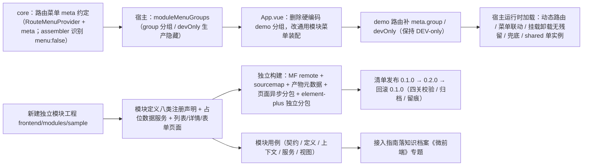

# 01 实施 · 首个模块样例

> 前端插件化 · 04 首个模块样例 · 子任务 01（需求 05-8）· 实施记录

[文档首页](../../../../../../文档首页.md) › [04 首个模块样例](../04_首个模块样例_01_首个模块样例.md) › 实施记录　|　[← 任务](../04_首个模块样例_01_首个模块样例.md)　[测试记录 →](../测试/01_测试_04_首个模块样例_01_首个模块样例.md)

## 1. 实施信息 

| 项 | 值 |
| --- | --- |
| 任务 | [04 首个模块样例](../04_首个模块样例_01_首个模块样例.md) |
| 对应需求 | [05-8](../../../../需求/04_需求_首个模块样例.md#r05-8) |
| 详细设计 | [01 详细设计](../设计/01_详细设计_04_首个模块样例_01_首个模块样例.md) |
| 实施日期 | 2026-09-22 |
| 实施人 | minjian |
| 实施环境 | 本地开发机（Node v24.20.0 / npm 11.19.0，npmmirror）；Vite 8.3.0（Rolldown）；`@module-federation/vite` 1.22.1 |
| 提交 | 详细设计 `6d0065ad`；实施 / 测试 / 登记回写 / 记录随本次提交 |
| 结论 | 完成（无阻塞遗留；设计层与实现层微调见 §4） |

## 2. 实施概览 

结果小结：新建独立模块工程 `frontend/modules/sample/`（示例数据管理：查询筛选 + 列表 + 详情 + 独立表单），模块定义**八类扩展点声明齐备**（路由·菜单 / 页面区域 / 通用组件 / 字段渲染器 / 图标 / 工作台卡片 / 主题令牌 / i18n 文案包），数据走**模块内占位服务**（异步签名对齐 `{ list, total, page, size }`，后续替换真实接口）；宿主菜单装配**泛化**（路由 `meta` 承载 `menu` / `group` / `groupIcon` / `devOnly`，核心装配器识别 `menu: false` 使详情 / 表单不进菜单），样例**进生产菜单**、demo 保持 DEV-only；模块**独立构建**（`remoteEntry.js` + `module.meta.json` + 外部 sourcemap + 页面异步分包 + `element-plus` 独立 vendor 块），经清单**独立发布**并**真跑回滚**（`0.1.0` → `0.2.0` → 回滚 `0.1.0`，产物按版本保留、发布留痕）；接入指南落《[微前端 · 10 业务模块接入指南](../../../../../../资料/知识档案/微前端/10_微前端_业务模块接入指南.md)》。

## 3. 实施过程 

1. **路由菜单 meta 约定**（`core/src/registries/providers.ts`、`assemble.ts`）：`RouteMenuProvider` 增可选 `meta`（登记前透传 `route.meta`）；装配器路由分组判据由「`meta.title === undefined` 跳过」扩为「或 `meta.menu === false` 跳过」——详情 / 表单页**不进菜单**、路由照常注册（向后兼容，不递增契约版本）。
2. **宿主菜单装配泛化**（`apps/desktop/src/module/host.ts`、`App.vue`）：新增 `moduleMenuGroups(dev)`——按 `meta.group` 归组（组节点取组内首项路径）、`meta.devOnly === true` 且非开发态剔除、未声明 `group` 者作顶级项；`App.vue` 删除硬编码「demo 分组 + 仅 DEV」逻辑，改 `[...sideMenu.menu.value, ...moduleMenuGroups(import.meta.env.DEV)]`（依赖 `registriesRevision` 响应模块挂载 / 卸载）。
3. **demo 路由补 meta**（`modules/demo/src/index.ts`）：`group: '演示模块'` / `groupIcon: 'sparkles'` / `devOnly: true`，保持 DEV-only 与分组外观；宿主用例夹具（`tests/support/module-fixture.ts`）同步。
4. **新建独立模块工程** `frontend/modules/sample/`：以 demo 工程为模板（`package.json` / 锁文件 / `vite.config.ts` / `vitest.config.ts` / `tsconfig*.json` / `eslint.config.js` / `.npmrc` / `.prettierrc.json` / `budget.json` / `index.html` / `scripts/check-bundle-budget.mjs`），模块名 `sample`、预览端口 `5003`、版本 `0.1.0`。
5. **模块源码**：`domain.ts`（类型与选项）、`runtime.ts`（宿主上下文只读消费派生状态）、`i18n/messages.ts`（文案真源，兼作 `i18nPacks` 载荷）、`composables/useSampleI18n.ts`、`services/sample-service.ts`（23 条 fixture + 模拟延迟 + 筛选 / 分页 / 增删改，未命中抛 `PROVIDER_NOT_REGISTERED`）、`components/`（优先级 / 状态标签、页头徽标、概览卡片）、`views/`（列表 / 详情 / 表单）、`index.ts`（八类声明 + 默认导出）、`standalone.ts`（独立预览壳）、`env.d.ts`。
6. **模块用例**（`tests/`）：`module-definition`（清单身份 / 八类声明键 / 路由 meta）、`module-context`（只读消费与降级）、`sample-service`（筛选 / 分页 / 增删改 / 未命中 / 种子开关）、`views`（列表渲染 / 表单必填校验）、`module-contract`（经 `describeModuleContract` 契约工厂跑同一套断言，含共享 / 隔离事实）。
7. **构建配置**：MF remote（`name: 'sample'` / `remoteEntry.js` / `./module`）、共享依赖取自单一来源（`import:false` + `strictVersion`）、版本注入 + 产物元数据插件、**外部 sourcemap**、两个构建目标；新增 `output.codeSplitting.groups` 将 `element-plus` 独立为 `vendor-element-plus` 块（见 §4 问题 1）。
8. **发布 / 回滚端到端演练**（仓内真跑）：`sample` 置 `0.1.0` → build → `publish`；置 `0.2.0` → build → `publish`；`rollback` 回 `0.1.0`；源码 / 锁回 `0.1.0` → 重新 build（终态三处一致 `0.1.0`）。清单新增 sample 条目；`releases/sample/{0.1.0,0.2.0}` 保留；`release-log` 记录 `publish → publish → rollback`。
9. **运行时加载验证**：起 `serve-module-releases.mjs`（5002）核对发布存储索引与 `remoteEntry.js`（HTTP 200 / `module.meta.json` / `remoteEntry.js.map` 可达）；宿主动态路由 / 菜单联动 / 挂载卸载 / 兜底 / shared 单实例由宿主用例以替身远端解析器覆盖（见测试记录）。
10. **接入指南**：《[微前端 · 10 业务模块接入指南](../../../../../../资料/知识档案/微前端/10_微前端_业务模块接入指南.md)》新增（目录结构 / 八类注册声明与路由菜单 meta / 构建与依赖 / 发布与回滚 / 自检清单）；《[技术栈知识档案总览](../../../../../../资料/知识档案/技术栈知识档案总览.md)》索引与计数同步。
11. **口径与登记回写**：《[前端模块契约](../../../../../../设计/架构设计/35_架构设计_前端模块契约.md)》§4 补「路由菜单 meta 约定」；《[前端基类清单](../../../../../../前端基类清单.md)》§9 模块工程行补首个真实形态样例；《[基座文档清单](../../../../../../基座文档清单.md)》补指南条目；`shared-dependencies.json` 非共享项阈值回写；README / 计划 / 任务 / 父任务状态回写；发布记录随仓库提交。
12. **Kiwi 用例**：平台「平台骨架」分类登记一条并回读编号 **983**，模块用例代码首行标注 `// kiwi_id: 983`（新增于 core / 宿主 spec 的断言亦标注）。

## 4. 问题与处置 

| # | 问题 / 现象 | 原因 | 处置 |
| --- | --- | --- | --- |
| 1 | 产物面隔离扫描报页面块「改全局原型 / 挂全局事件 / 直控根节点」 | 页面块直接静态引入的 `element-plus` 件（`ElPopconfirm` 的 popper、`ElMessage`）自带全局副作用，被 P4 判为「模块自有块污染」；Vite 8 走 Rolldown，`manualChunks` / `advancedChunks` 均被 MF 插件忽略 | 改用 **`output.codeSplitting.groups`**（MF 插件分包口径）将 `element-plus` 独立为 `vendor-element-plus` 块——页面块只余模块自有代码，产物面扫描零违规（与宿主同一分包口径） |
| 2 | 共享白名单体积关：模块产物 gzip 合计 564.9 KB 超 `element-plus.maxModuleGzipKb = 546` | 首个真实形态模块（查询筛选 + 列表 + 详情 + 表单）较契约演示复用更多 EP 件，非共享成本上升 | 按「实测基线 + 20%」将阈值调整为 **660 KB** 并回写 `shared-dependencies.json` 单一来源（注明为真实模块成本基线） |
| 3 | 视图用例报 `resolveComponent can only be used in render() / setup()` | 模块 `vitest.config.ts`（自 demo 复制）未内联 `element-plus`，jsdom 下组件解析失败 | 增 `test.server.deps.inline: ['element-plus']`（与 `@bms/ui-ep` 测试口径一致） |
| 4 | `DataTable` 无默认 / 操作列插槽，列表无法放「详情 / 编辑 / 删除」操作列 | 平台《前端开发规范》§8.3 约定「列表页无操作列，双击行打开详情」 | 列表页去掉操作列，**双击行进详情**；编辑 / 删除移到详情页（详情 `#extra` 按钮），新建在列表工具栏 |
| 5 | `Record<string, unknown>` 断言 `SampleRecord` 触发 TS2352 | 单元格插槽 `row` 为宽泛记录类型 | 经 `unknown` 两段断言（`row as unknown as SampleRecord`） |
| 6 | 列表视图未挂载时 `useRoute().params.id` 类型 | 路由参数可能为空 / 数组 | `String(route.params.id ?? '')` / `route.params.id === undefined` 判空 |
| 7 | `module-contract.spec` 在发布前 `manifestEntry` 为 `undefined`（清单一致性断言被跳过） | 清单尚未登记 `sample` | 发布后清单自动写入条目，契约用例同套断言随之生效（终态断言通过） |

## 5. 验证结果 

| 验证点 | 方法 | 结果 |
| --- | --- | --- |
| 核心包门禁 | `vue-tsc --noEmit` / `lint` / `vitest run` | 通过（96 文件 / 1180 用例；含新增 `assemble` 的 `menu:false` 与 `meta` 透传断言） |
| ui-ep 门禁 | `vue-tsc --noEmit` / `lint` / `vitest run` | 通过（61 文件 / 901 用例） |
| 宿主类型 / Lint / 单测 / 构建 / 预算 | `vue-tsc -b` / `lint` / `vitest run` / `build` / `budget` | 通过（29 文件 / 102 用例；首屏 177.3 KB（预算 260）、单文件 80.3 KB（预算 150）） |
| 模块工程门禁（sample） | `lint` / `typecheck` / `vitest run` / `build` / `budget` / `guard:isolation` | 通过（5 文件 / 21 用例）；容器入口 13.2 KB / 6 块；页面异步块命中 `SampleList` / `SampleDetail` / `SampleForm`；产物面隔离零违规 |
| 模块工程门禁（demo） | `typecheck` / `lint` / `test` / `guard:isolation` | 通过（3 文件 / 11 用例）；产物面隔离零违规（含 sample 一并扫描） |
| 清单 / 版本发现护栏 | `node frontend/scripts/check-module-manifest.mjs` | 通过：清单可解析、远端条目版本化、版本发现一致（清单 = 产物元数据 = 源码 = `0.1.0`）、sourcemap 就位、契约用例齐备；按模块输出体积（demo 11.6 KB / sample 13.2 KB） |
| 隔离 / 共享平台脚本 | `check-module-isolation.mjs`（源码 + 产物）/ `check-shared-whitelist.mjs` / `check-shared-deps.mjs` | 全通过；共享面三件、两侧声明一致、依赖实例数 = 1 |
| 发布 / 回滚端到端 | `release-module.mjs publish/rollback/status` | 通过：`0.1.0` → `0.2.0` → 回滚 `0.1.0`；清单终态 `sample@0.1.0`；`releases/sample/{0.1.0,0.2.0}` 保留；记录 `publish → publish → rollback` |
| 发布产物可达性 | `serve-module-releases.mjs` + HTTP 核对 | `/` 列出版本目录（demo `0.1.0` / sample `0.1.0`、`0.2.0`）；`sample/0.1.0/remoteEntry.js`（200 / 18780 B）、`module.meta.json`、`remoteEntry.js.map` 均可达 |
| 宿主运行时加载 | `apps/desktop/tests/module-hosting.spec.ts`（替身远端解析器） | 通过：`sample`/`demo` 经清单装载 → 动态路由注册 → 菜单分组出现（`moduleMenuGroups`）→ 卸载后路由 / 注册项 / 令牌 / 文案 / 区域项还原；`devOnly` 生产隐藏 |
| 基座 / 链接 / 阶段状态 | `check-base.py` / `check-links.py` / `check-status.py --strict` | 通过（基座清单 173/173；断链 0；阶段五 89 项检查硬规则与软提示 0） |
| Kiwi 用例 | 平台登记并回读 | **983**（分类「平台骨架」/ P2 / CONFIRMED / 标签「自动化」，一任务一条） |

## 6. 偏差与遗留 

- **偏差**：
  1. **第三方分包**（设计 §3.6 未列）：模块构建新增 `output.codeSplitting.groups` 将 `element-plus` 独立分包（见 §4 问题 1，已回写设计「实施对齐记录」）；
  2. **非共享项体积阈值**：`element-plus.maxModuleGzipKb` 546 → 660（见 §4 问题 2，已回写单一来源）；
  3. **列表无操作列**：按平台页面约定改为「双击行进详情」，编辑 / 删除移至详情页（见 §4 问题 4）。
- **遗留**：
  1. **真实后端接口**：模块内占位数据服务，联调时替换实现（页面 / 路由 / 清单无需改动）；
  2. **生产 / mjbk 部署形态**：产物上传、部署侧清单、nginx / CDN 版本目录托管归部署阶段；
  3. **组件 / 字段渲染器 / 工作台卡片 / 图标的深度消费**：本期完成声明与登记及路由菜单 / 页面区域 / 令牌 / 文案的消费接线；其余消费方随对应阶段接入；
  4. **模块菜单权限过滤**：本期只有 `meta.devOnly`「生产隐藏」；按权限码过滤随 RBAC / 动态菜单阶段；
  5. **回滚终态**：本任务终态 `0.1.0`（`0.2.0` 为演练版本、产物保留为回滚证据），不追改历史归档。

**上游「随 04_01」接收项闭环归口**：

| 上游 | 接收项 | 状态 |
| --- | --- | --- |
| `03_01` 隔离 | 隔离约定检查项并入接入指南 | **已闭环**：接入指南 §9 自检清单含隔离项（`guard:isolation` 源码面 + 产物面） |
| `03_02` 发布治理 | 样例按同一契约工厂接入、按《部署发布规范》发布 / 回滚并沉淀接入指南；`check-shared-deps.mjs` 多模块泛化 | **已闭环**：契约用例经 `describeModuleContract`；发布回滚端到端演练；`check-shared-deps.mjs` 实跑（demo + sample 两侧）通过 |
| `03_03` 可观测 | 样例按 sourcemap / 体积 / 上报口径接入 | **已闭环**：外部 sourcemap 随发布归档、清单护栏体积汇总、发布记录体积字段均覆盖 sample |
| `02_01` / `02_02` / `03_01` / `03_02` / `03_03` 测试记录 | 模块工程覆盖率门禁「随 `04_01` 统一口径」 | **转后续**：`04_01` 沿用 demo 口径（`vitest run` 断言 + 契约工厂，未启覆盖率阈值）；如需按模块覆盖率门禁，须引 `@vitest/coverage-v8` 并统一 `module-check` 口径——登记为后续 |

> 本文档依《[文档生成规范](../../../../../../规范/文档生成规范.md)》编写
