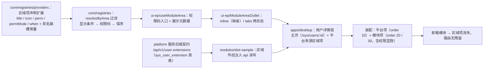

# 01 实施 · 具名插槽基座功能与前后端配套插件

> 前端插件化 · 06 具名插槽与插件挂接 · 子任务 01（需求 05-10）· 实施记录

[文档首页](../../../../../../文档首页.md) › [06 具名插槽与插件挂接](../06_具名插槽与插件挂接_01_具名插槽基座功能与前后端配套插件.md) › 实施记录　|　[← 任务](../06_具名插槽与插件挂接_01_具名插槽基座功能与前后端配套插件.md)　[测试记录 →](../测试/01_测试_06_具名插槽与插件挂接_01_具名插槽基座功能与前后端配套插件.md)

## 1. 实施信息 

| 项 | 值 |
| --- | --- |
| 任务 | [01 具名插槽基座功能与前后端配套插件](../06_具名插槽与插件挂接_01_具名插槽基座功能与前后端配套插件.md) |
| 对应需求 | [05-10](../../../../需求/06_需求_具名插槽与插件挂接.md#r05-10) |
| 详细设计 | [01 详细设计](../设计/01_详细设计_06_具名插槽与插件挂接_01_具名插槽基座功能与前后端配套插件.md) |
| 实施日期 | 2026-10-03 |
| 实施人 | minjian |
| 实施环境 | 本地开发机（Node v24.20.0 / pnpm 11.7.0 / Python 3.14 / uv，npmmirror + 阿里云源） |
| 提交 | 设计 `fcfde0da`（含数据表设计）；设计修订 `397a05b6` / `9891f79e`；后端契约 `98aaed7a`；前端基座 `830ba61c`；宿主 `52fae5a6` / `138590b8`；样例插件 `dce30796`；登记与记录随本次文档提交 |
| 结论 | 完成 |

## 2. 实施概览 

结果小结：具名插槽（`sys.user.detail.tabs`）在页面区域注册表之上落地为**可运营挂接机制**——区域项声明补齐展示名 / 图标 / 权限码 / 显示条件，解析侧按「显示条件 → 权限码」过滤并保序；区域插槽件新增 `tabs` 形态（`inline` 行为与既有实现一致）；宿主页只留槽、**不 import 具体插件**（护栏断言）；样例插件 `slot-sample` 与 platform 服务后端契约成套交付，独立构建发布并真跑通「留槽 → 注册 → 渲染 → 写操作 → 卸载还原 → 移除隐藏」。

## 3. 实施过程 

1. **前端基座 · 声明与命名**（`packages/core/src/registries/providers.ts`）：新增 `NAMED_SLOT_ID_PATTERN`（`{域}.{页面}.{区域}`，≥3 段）；`PageAreaProvider` 增 `title` / `icon` / `perm` / `permMode` / `when` 五项（构造签名第 5 参 `PageAreaProviderOptions`，均可选，缺省与声明一致）；`PAGE_AREA_ID_PATTERN`（≥2 段）与注册期校验**保持不变**（既有 `layout.header` 与已发布模块不受影响）。
2. **前端基座 · 声明通道**（`core/src/module/types.ts`、`core/src/registries/assemble.ts`）：`ModuleRegionDeclaration` 同名扩展；统一装配器从声明透传五项，平台来源与模块来源同一形状（**属向后兼容新增，不递增 `MODULE_CONTRACT_VERSION`**）。
3. **前端基座 · 解析过滤**（`core/src/registries/index.ts`）：新增 `ResolveAreaOptions`；`resolveByArea(area, options?)` 逐项判定「区域命中 → `when` 显示条件（求值 `false` 或抛错即剔除并上报）→ `perm` 权限码（复用核心 `evaluatePermission`，`permMode` 缺省 `any`；`perm` 缺省放行）」。
4. **前端基座 · 投影与插槽件**（`packages/ui-ep/src`）：`useModuleArea` 增 `permissionCodes` 选项并透传解析、返回面增 `title` / `icon`；`ModuleAreaOutlet` 增 `variant`（`inline` 缺省 / `tabs`）与 `permissionCodes`；`tabs` 形态以 `el-tabs` 逐项渲染（页签标题取展示名、缺省取键；图标经 `IconRenderer` 解析、未登记不渲染），装配变化后回落首项。
5. **宿主侧**（`apps/desktop/src`）：新增用户详情宿主页 `views/SysUserDetailView.vue`（路由 `/sys/users/:id`，静态路由不进菜单）——页面只留槽并经区域插槽件以 `variant="tabs"` 渲染，权限码取会话 store；平台自身注册增 `sys:user-detail-basic`（`title` 账号信息、`order` 10、异步件 `components/UserDetailBasicTab.vue`），演示**平台 / 模块同槽多来源**。
6. **后端契约**（`backend/services/platform/src/bms_platform`）：新增 `SysUserExtension` 模型（`sys_user_extension`，公共字段 + `user_id` / `label` / `remark`，同用户同标签复合唯一）+ `schemas/user_extension.py` + `repositories/user_extension.py`（按用户列示 / 同键探测）+ `services/user_extension.py` + `api/user_extensions.py`（`GET` 列表 / `POST` 新增 / `PUT` 更新；权限码 `sys:user-extension:query` / `sys:user-extension:update`），登记进 `api/router.py`。
7. **标识符与库**：`table_registry.py` 增 `sys_user_extension`（`owner=platform`、租户库、`enabled`）；迁移 `alembic/versions/platform/tenant/0006_sys_user_extension.py`（`platform:tenant` 链新头）；契约快照重生成 `deploy/contracts/platform.json`；覆盖率门禁 `check-coverage-threshold.py` 增「平台用户扩展契约」路径组（阈值 80%）并同步 `--self-test`。
8. **样例插件工程**（`frontend/modules/slot-sample`，新建独立模块工程）：模块定义只声明 `regions`（两项：`slot-sample:user-extension` order 20 无权限约束；`slot-sample:user-extension-detail` order 30 `perm: 'sys:user-extension:update'`）+ `i18nPacks`，**不声明路由**（无页面、不进菜单）；`runtime.ts` 只读消费注入上下文（记注入 `router`，经路由参数 `id` 取宿主页作用实体标识）；`services/user-extension-service.ts` 经注入 `api` 按「服务键 platform + 资源子路径」读写；两个区域件（列表 + 新增 / 更新；只读明细）；独立构建、体积预算、隔离扫描、独立发布。
9. **用例（先登记后编码）**：Kiwi 登记 **2238**（分类「平台骨架」/ P2 / CONFIRMED / 标签「自动化」，沿用阶段五先例），随后落前端 `core/tests/{registries,assemble}.spec.ts` 扩写、`ui-ep/tests/module-area-outlet.spec.ts` 扩写、`apps/desktop/tests/{guard-slot-host-isolation,module-registration}.spec.ts`、`modules/slot-sample/tests/{module-contract,module-definition,module-context,components}.spec.ts`，后端 `services/platform/tests/api/test_user_extensions.py`，并同步既有断言（迁移链新头 / 平台注册非空）。
10. **契约与登记回写**：《[前端模块契约](../../../../../../设计/架构设计/35_架构设计_前端模块契约.md)》§4 / §5 / §7、《[组件设计 · 模块区域插槽](../../../../../../设计/组件设计/03_布局组件类/12_组件设计_模块区域插槽/12_组件设计_模块区域插槽.md)》（形态 / 权限 / 上下文来源 / 上游登记）、《[微前端 · 业务模块接入指南](../../../../../../资料/知识档案/微前端/10_微前端_业务模块接入指南.md)》新增「具名插槽与前后端配套插件」节 + 自检清单条目、《数据库设计》表文件与总览登记、任务与计划状态、阶段 README。

## 4. 问题与处置 

| # | 问题 / 现象 | 原因 | 处置 |
| --- | --- | --- | --- |
| 1 | 后端样例契约的标识符登记与平台表归属校验**硬冲突**：`sample` 模块（`service_key` 空）的表既无法归属 platform（前缀须为 `sys_`），也无自身迁移链可取模型 | 表归属校验要求「表名前缀 ∈ 归属服务已登记前缀」且「`enabled` 表须进入**归属服务**链」；无独立服务工程的模块不满足 | **报冲突并重新确认**（Q14）：样例契约**归 `sys` 模块**——表 `sys_user_extension`（platform 共享前缀）、权限码 `sys:user-extension:query` / `sys:user-extension:update`，不新增服务目录行 / 事件域 / 错误码段；详细设计 §3.7 / §7 / §8（决策 14）与数据表文件同步回写（提交 `397a05b6`） |
| 2 | 写路径报 `sqlalchemy.exc.InvalidRequestError: A transaction is already begun on this Session.` | 服务先做唯一性探测（SELECT 触发 autobegin），再调 `BaseTransactionalService.create`（内部再次 `uow.begin()`） | 按平台既有 DB 写路径口径（对齐 org 服务）：写方法在**单次 `uow.begin()`** 内完成「探测 + 落库」；详细设计分层表同步更正为「服务经请求级工作单元构造（无需应用级装配）」（提交 `9891f79e`） |
| 3 | 契约整型字段（含 `user_id`）在 JSON 中为**字符串** | `BaseSchema` 统一序列化口径（防前端精度丢失） | 用例断言改按字符串（`str(_USER_ID)`）；实施记录留痕该口径 |
| 4 | `platform:tenant` 链新头导致既有迁移断言失败（`0005_sys_outbox_tenant_bigint` → 新头） | 新增迁移即新头，既有断言写死 | 同步更新 `libs/bms_core/tests/{alembic/test_alembic_chains,ops/test_migration_ops}.py` 的链头期望值 |
| 5 | 区域件包 `StatusContainer` 后内容不渲染（仅 `ready` 渲染内容位） | 状态容器语义：内容只在 `ready`（或缺省 `keepContent`）时呈现 | 区域件改用业务组件自带状态（`DataTable` 自带 loading / empty / error）；插件特有降级（未选实体 / 未注入 `api`）用显式提示段落 |
| 6 | 平台自身注册由空对象变为 1 项，既有「空声明不产生登记」用例失败 | 平台开始登记区域项（本任务新增平台来源项） | 用例改为断言平台注册**打标 platform** 且登记键可逆序清理；并新增「平台项与模块项同槽、排序、权限显隐、释放后无残留」用例 |
| 7 | 组件库输入件属性透传到**内层 `<input>`**，用例选择器 `[data-test=…] input` 取空 | Element Plus 输入件 `inheritAttrs` 语义（attrs 落到内层 input） | 用例选择器改为直接取 `[data-test=…]`（即 input 本身） |
| 8 | 组件设计节点原文「插槽不做权限过滤，不替模块裁决」与实现口径冲突 | 本任务把「按权限显隐」上收为**声明驱动过滤** | 回写组件设计节点 §3 / §7（权限行改为「区域项声明权限码、插槽过滤渲染；前端显隐非鉴权」）与 §6.2 上游登记 |
| 9 | `check-base.py` 报跨层引用：知识档案（`资料/`）不得用相对链接指向设计层 | 基座文件（`规范/` / `资料/`）不得相对链接设计层 | 指南正文改**纯文本**提及平台《架构设计 · 扩展点与插件化》§9 与《架构设计 · 前端模块契约》 |
| 10 | 覆盖率门禁新增路径组后自检数量不符 | `--self-test` 断言按问题条数硬编码 | 自检用例补平台组文件与「用户扩展契约组缺失」反例，期望值同步调整 |
| 11 | **框架页被演示模块整页 DOM 污染**（顶栏右侧只剩溢出碎片「模块数据 4~7 / 滚动项 1」；用户复核发现） | 演示模块把**整页** `DemoToolbox.vue` 注册进区域 `layout.header`——该区域在顶栏右侧、只有**一行高**，整页被塞进顶栏并溢出（实测残留节点 `y ≈ -103`，DOM 锚点 `header__header-right > div.bms-module-area-outlet > section.bms-page-container`）；对照 `sample` 注册的是**徽标件**（正确范式） | ① 模块改注册**紧凑入口件**（`DemoToolboxEntry.vue`：只做接线 → 进整页路由 `/demo/toolbox`；整页只服务菜单路由）；② **基座防呆**：`ModuleAreaOutlet` 的 `inline` 形态加尺寸约束（`max-height: 100%` + `overflow: hidden`），件头写明「区域项只应为紧凑件、整页走页面路由」，补用例（渲染 + 样式契约）；③ 台账第 17 项 |
| 12 | 同一入口件**违反「组件库件复用（强制）」**：模板内裸 `<button>` + 自绘 `scoped` 样式（用户复核指出：缺件应先新建组件并配文档，不得业务侧自绘） | 《前端开发规范》「组件库件复用（强制）」：业务侧（宿主应用与**运行时模块**）`.vue` 模板内不得出现裸原生交互元素，一律经组件库件 / Element Plus 基础件承载；**缺件先补进 `@bms/ui-ep` 并在《组件设计》登记**。护栏 `apps/desktop/tests/guard-library-components.spec.ts` **已覆盖运行时模块**，其替代件表明确 `button → Element Plus ElButton`；本任务自测时**漏跑宿主用例**，故未在提交前拦住 | 改用 **Element Plus `ElButton`**（`link` / `size="small"`）并**删除自绘样式**（入口件只做接线：读宿主注入 `context.router` + 跳整页）；复跑护栏 3 例通过（修复前实测被拦：`DemoToolboxEntry.vue:2：裸原生 <button> → 改用 Element Plus ElButton`）；模块依赖本已含 `element-plus`，未新增依赖。归口：本任务（样例插件）+ 04 域组件复用规范 |

## 5. 验证结果 

| 验证点 | 方法 | 结果 |
| --- | --- | --- |
| 根门禁（core / api-types / vue / ui-ep） | `pnpm run check` | 通过（core 104 文件 / 1274 用例、ui-ep 65 / 926、vue 2 / 5、api-types 1 / 2） |
| 宿主类型 / Lint / 单测 / 构建 | `vue-tsc -b` / `lint` / `test` / `build` | 通过（宿主 37 文件 / 230 用例）；`components.d.ts` 随新增件同步 |
| 样例插件 | `typecheck` / `lint` / `test` / `build` / `budget` / `guard:isolation` | 通过（4 文件 / 24 用例；入口闭包 12.1 KB（预算 16）/ 最大单块 6.2 KB（预算 8）/ 6 块（上限 8）；产物面隔离零违规） |
| 后端门禁 | `uv run pytest services/platform/tests`；`ruff check .` / `ruff format --check .` | 通过（platform 352 通过 / 1 跳过；全仓 ruff 零告警、格式化通过） |
| 后端基座校验 | `ops.check_tables` / `ops.check_modules` / `ops.check_contracts` / `ops.contract_snapshot check` | 全部通过（表归属 43 项；服务目录 16 项；契约快照与公开契约一致） |
| 覆盖率门禁 | `scripts/tools/base-check/check-coverage-threshold.py --self-test`；实测平台路径组 | 自检 6 用例通过；**平台用户扩展契约路径组实测 99.3%**（阈值 80%） |
| 发布与链路实跑 | `pnpm run build` → `release-module.mjs publish --module slot-sample` → 发布存储可达性核对 | 发布成功（`http://localhost:5002/slot-sample/0.1.0/remoteEntry.js`，入口 gzip 12.1 KB / 6 块）；发布存储实测 `200`（remoteEntry 18.8 KB）；`module.meta.json` = `{name: slot-sample, version: 0.1.0, contractVersion: 2}`；`check-module-manifest.mjs` 通过（清单版本化 / 版本发现一致 / sourcemap 就位 / 契约用例齐备） |
| 文档与基座校验 | `check-base.py` / `check-links.py` / `check-docs-scope.py` / `check-docs/check-status.py --stage 05_前端插件化 --strict` | 通过（断链 0 / 失效锚点 0；文档范围违规 0；阶段状态硬规则不合规 0、增补软提示按计划维护） |
| Kiwi 用例 | 平台登记并回读 | **2238**（新建 1 / 跳过 0 / 失败 0） |

## 6. 偏差与遗留 

- **偏差**：
  1. 后端样例契约的标识符口径由「独立 `sample` 模块」改为**归 `sys` 模块**（见问题 1；经确认后回写详细设计 §3.7 / §7 / §8 决策 14 与数据表文件）；
  2. 写路径实现细节为正**单次工作单元开启**（见问题 2；详细设计分层表已回写）；
  3. 区域件不包 `StatusContainer`（见问题 5），降级提示由插件自行呈现；
  4. 样例插件区域件命名为 `SlotExtensionTab` / `SlotExtensionDetailTab`，用例文件名由设计稿的 `views.spec.ts` 调整为 `components.spec.ts`（模块无页面，无 `views/`）。
- **遗留**（归口见计划 §7）：
  1. **「具名插槽上下文」注入通道**：本期以「宿主页实体标识放路由参数 + 插件经注入 `router` 只读读取」承担；后续出现非路由承载的宿主上下文需求时另立项（届时按契约变更升版本）；
  2. **浏览器实跑边界**：`VITE_AUTH_GUARD=off` 时宿主恒骨架屏（`session.ready` 仅由守卫 `ensureReady()` 触发），本地无 BMS 应用账号 → 登录态浏览器实测不可行；本期以自动化用例 + 「构建 → 发布 → 发布存储可达」链路为证据，浏览器走查待阶段七提供账号后补齐；
  3. **宿主页数据源**：用户详情页现取当前用户概要（identity `/auth/me`）作骨架，按 `:id` 取任意用户详情依赖 org → mdm 用户主数据契约（阶段七 / mdm 阶段）；
  4. **`frontend/modules/*` 覆盖率门禁**仍无阈值（沿阶段五遗留口径）；
  5. **插槽级观测与治理**（按插槽归因 / 插槽清单面板）仍以 dev 观测面板口径承载，未做按插槽治理。
