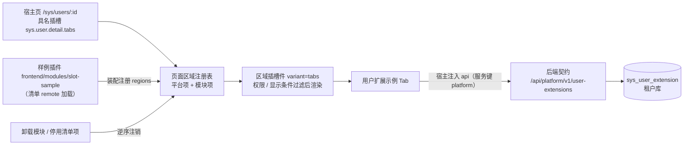

# 01 详细设计 · 具名插槽基座功能与前后端配套插件

> 前端插件化 · 06 具名插槽与插件挂接 · 子任务 01（需求 05-10）· 详细设计

[文档首页](../../../../../../文档首页.md) › [06 具名插槽与插件挂接](../06_具名插槽与插件挂接_01_具名插槽基座功能与前后端配套插件.md) › 详细设计　|　[← 任务](../06_具名插槽与插件挂接_01_具名插槽基座功能与前后端配套插件.md)

## 1. 设计目标与范围 <a id="goal"></a>

在阶段五已交付的**页面区域扩展点 + 区域插槽件 / `useModuleArea` 消费接线**（域 01 `01_01` / `01_02`，**前置契约均已交付**）之上，把「页面区域」细化为**可运营的具名插槽机制**，并用一个**平台内样例插件**端到端验证「前端模块 + 后端契约」成套挂接：

1. **具名插槽命名与声明**——稳定命名 `{域}.{页面}.{区域}`（首个落地 `sys.user.detail.tabs`）；插槽一律经**页面区域注册表**登记与解析（**不新造注册表**）；区域项声明补齐**展示名 / 权限码 / 显示条件**三个可运营维度。
2. **解析与降级**——解析侧按**权限**与**显示条件**过滤；未登记 / 未启用 / 提供方不可达时该项**不渲染**（插槽为空），宿主页其余部分正常（不报错、不阻塞）；加载失败按域 03 `03_03` 兜底口径处置。
3. **渲染形态**——区域插槽件新增 `tabs` 形态（多 Tab 同槽呈现），缺省 `inline` 形态与既有行为**完全一致**（不破坏既有消费方）。
4. **前后端配套约定**——成文「**数据归属方提供插件**」：插件 = **前端模块**（界面，注册为该插槽区域项，只经宿主注入 `api` 能力发请求）+ **后端契约**（取数与增删改查触发接口）；约定区域项**注册声明字段**与**后端契约路径 / 权限码归属**。
5. **平台内样例插件**——新建独立模块工程 `frontend/modules/slot-sample`（前端模块）+ platform 服务内新增真表后端契约（归 `sys` 模块，`/api/v1/user-extensions`），真跑通「宿主留槽 → 插件注册 → 挂载渲染 → 写操作 → 卸载还原 → 移除插件后隐藏」全链路，**不进入生产业务菜单**。
6. **护栏与文档**——机器护栏断言「宿主页不直连插件」「插槽项未登记不渲染」「插件移除后无残留注册项 / 无残留路由」；插件接入指南增补具名插槽与前后端配套节。

**不在本期**：具体业务插件（mdm 组织域「用户分配岗位」插件由 mdm 产品仓库提供）；移动端（`ui-vant`）；隔离增强（`Shadow DOM` / JS 沙箱）；模块灰度 / 蓝绿；注册表基座与既有八类注册表的改造。

### 1.1 现状与缺口 <a id="gap"></a>

```text
frontend/
├── packages/core/src/
│   ├── registries/
│   │   ├── providers.ts        # 八域注册项（含 PageAreaProvider：key/area/component/order） ← 本期 +title/icon/perm/permMode/when
│   │   ├── index.ts            # 八域注册表（PageAreaRegistry.resolveByArea 仅按 area 过滤） ← 本期 +权限过滤 +具名插槽常量
│   │   └── assemble.ts         # 统一装配器（八分组；区域项构造处透传新字段）        ← 本期 透传扩展字段
│   └── module/types.ts         # 模块契约（ModuleRegionDeclaration）                ← 本期 +title/icon/perm/permMode/when
├── packages/ui-ep/src/
│   ├── composables/useModuleArea.ts        # 区域项投影（读注册表 → 保序）        ← 本期 +permissionCodes 透传
│   └── components/layout/ModuleAreaOutlet.vue  # 区域插槽件（inline，flex 逐项）   ← 本期 +variant(tabs)/permissionCodes
├── apps/desktop/src/
│   ├── module/registries.ts    # 注册表实例 + 平台自身注册声明（现为空对象）        ← 本期 +平台区域项登记
│   ├── router/index.ts         # 静态路由（无 sys.* 页面）                        ← 本期 +用户详情宿主路由
│   └── views/                  # 平台页面                                        ← 本期 +用户详情宿主页（具名插槽宿主）
└── modules/                    # 运行时模块工程（demo / sample）                  ← 本期 +slot-sample 样例插件工程

backend/
├── libs/bms_core/src/bms_core/services/
│   └── table_registry.py       # TABLE_OWNERSHIP（无 sys_user_extension）         ← 本期 +表归属登记
└── services/platform/src/bms_platform/
    ├── models/ · schemas/ · repositories/ · services/ · api/                     ← 本期 +五层（真表）
    └── api/router.py · main.py                                                   ← 本期 +路由登记与依赖注入装配
```

缺口：① 具名插槽**只有机制雏形**（`area` 字符串 + `order`），无**展示名 / 权限码 / 显示条件**三个可运营维度，无法「多 Tab、按权限显隐」；② 插槽件只有 `inline` 一种形态，多 Tab 场景无处呈现；③ 无**具名插槽命名口径**（`{域}.{页面}.{区域}`）与校验常量；④ 缺**宿主页留槽的真实落点**（平台无用户详情页）；⑤ 前后端配套（数据归属方提供插件）**只有架构口径，无成文约定与样例**；⑥ 后端无「随插件走的公开契约」样例。

## 2. 交付物清单 <a id="deliver"></a>

| # | 交付物 | 落点 |
| --- | --- | --- |
| 1 | 具名插槽命名口径与常量（`{域}.{页面}.{区域}`，`NAMED_SLOT_ID_PATTERN`） | `frontend/packages/core/src/registries/providers.ts`、`.../index.ts` |
| 2 | 区域项声明扩展（`title` / `icon` / `perm` / `permMode` / `when`）与注册项同名持有 | `frontend/packages/core/src/module/types.ts`、`.../registries/providers.ts` |
| 3 | 区域项解析过滤（权限 + 显示条件；权限码缺省放行） | `frontend/packages/core/src/registries/index.ts`（`PageAreaRegistry.resolveByArea`） |
| 4 | 统一装配器透传扩展字段 | `frontend/packages/core/src/registries/assemble.ts` |
| 5 | 区域项投影权限码入口 | `frontend/packages/ui-ep/src/composables/useModuleArea.ts` |
| 6 | 区域插槽件 `tabs` 形态与权限入口 | `frontend/packages/ui-ep/src/components/layout/ModuleAreaOutlet.vue`、`ui-ep/src/index.ts` |
| 7 | 用户详情宿主页（具名插槽宿主）与路由 | `frontend/apps/desktop/src/views/SysUserDetailView.vue`、`apps/desktop/src/router/index.ts` |
| 8 | 平台自身区域项登记（平台来源件） | `frontend/apps/desktop/src/module/registries.ts`、`apps/desktop/src/components/UserDetailBasicTab.vue` |
| 9 | 样例插件前端模块工程 `slot-sample`（区域项声明 + 借用宿主 `api` 调用后端契约） | `frontend/modules/slot-sample/**` |
| 10 | 样例插件后端契约（模型 / 契约 / 仓储 / 服务 / 路由 / 迁移；归 `sys` 模块、platform 服务承载） | `backend/services/platform/src/bms_platform/{models,schemas,repositories,services,api}/`、`backend/alembic/versions/platform/tenant/` |
| 11 | 表归属登记（`sys_user_extension`，`owner=platform`） | `backend/libs/bms_core/src/bms_core/services/table_registry.py` |
| 12 | 数据表设计文件与总览登记 | `设计/数据库设计/数据表设计/sys_user_extension.md`、《数据库设计总览》§6.2 / §7.3 |
| 13 | 公开契约快照与覆盖率门禁路径组 | `deploy/contracts/platform.json`、`scripts/tools/base-check/check-coverage-threshold.py` |
| 14 | 机器护栏（宿主不直连插件 / 未登记不渲染 / 卸载无残留） | `frontend/apps/desktop/tests/guard-slot-host-isolation.spec.ts` 等（见 §3.9） |
| 15 | 机器护栏（样例插件契约与定义） | `frontend/modules/slot-sample/tests/module-contract.spec.ts`、`module-definition.spec.ts` |
| 16 | 后端用例（契约 / 服务 / 仓储 / 接口 / 冲突分支） | `backend/services/platform/tests/**` |
| 17 | 插件接入指南增补（具名插槽与前后端配套节） | `资料/知识档案/微前端/10_微前端_业务模块接入指南.md` |
| 18 | 架构 / 规范 / 清单 / 组件设计回写 | 《前端模块契约》§4 / §5、《扩展点与插件化》§9、《前端基类清单》§4、组件设计节点「模块区域插槽」 |
| 19 | 任务实施记录 / 测试记录 / 计划与任务状态回写 | 本目录 `实施/`、`测试/`；`项目/05_前端插件化/**` |
| 20 | 决策记录与偏差归口 | 本文档 §7 / §8；任务实施记录 §6 |

## 3. 接口 / 契约与边界 <a id="contract"></a>

### 3.1 具名插槽命名与声明字段 <a id="naming"></a>

**命名口径**：具名插槽标识为点分小写 `{域}.{页面}.{区域}`，**至少 3 段**——域 = 平台域或模块名（如 `sys`）、页面 = 宿主页标识（如 `user.detail`）、区域 = 区域语义（如 `tabs`）。首个落地 `sys.user.detail.tabs`。

```ts
/** 页面区域标识模式（点分 `<域>.<区域>`，≥2 段；既有口径不变，如 `layout.header`）。 */
export const PAGE_AREA_ID_PATTERN = /^[a-z][a-z0-9-]*(\.[a-z][a-z0-9-]*)+$/

/** 具名插槽标识模式（`{域}.{页面}.{区域}`，≥3 段；如 `sys.user.detail.tabs`）。 */
export const NAMED_SLOT_ID_PATTERN = /^[a-z][a-z0-9-]*(\.[a-z][a-z0-9-]*){2,}$/
```

- **注册期校验保持 `PAGE_AREA_ID_PATTERN`（≥2 段）不变**：既有 `layout.header` 等通用区域与已发布模块不受影响；具名插槽「≥3 段」口径由**文档约定 + 护栏用例断言**（不破坏兼容）。
- 具名插槽**不是新注册表**：一律经页面区域注册表登记区域项，键仍为命名空间键 `<来源>:<区域项>`（平台来源为 `platform`，模块来源须 `<模块名>:` 前缀）。

**区域项声明字段（本项目扩展后，全量）**：

```ts
/** 模块页面区域（具名插槽）声明。 */
export interface ModuleRegionDeclaration {
  /** 命名空间键（`<模块名>:<区域项>`）。 */
  key: string
  /** 插槽 / 区域标识（点分；具名插槽为 `{域}.{页面}.{区域}`）。 */
  area: string
  /** 挂接组件（组件对象或异步加载器）。 */
  component: unknown
  /** 同区域排序提示（缺省 0；同值保持登记序）。 */
  order?: number
  /** 展示名（`tabs` 形态页签标题；缺省取键）。 */
  title?: string
  /** 图标键（`tabs` 形态页签图标；经图标注册表解析，未登记不渲染）。 */
  icon?: string
  /** 权限码（单个或数组；缺省不限制——宿主按已持有权限码判定）。 */
  perm?: string | string[]
  /** 权限判定模式（缺省 `any`）：任一 / 全部 / 全不满足。 */
  permMode?: 'any' | 'all' | 'not'
  /** 显示条件谓词（同步；求值 `false` 即不渲染；缺省可见）。 */
  when?: () => boolean
}
```

`PageAreaProvider` 同名持有以上字段（构造签名扩展，新增参数均为可选、缺省值与声明一致）；字段由统一装配器从声明透传，**platform 来源与模块来源同一形状**。契约版本口径见 §8 决策 5——属**向后兼容新增**（老声明缺字段即为缺省语义），**不递增 `MODULE_CONTRACT_VERSION`**，既有 `demo` / `sample` 模块无需重发布。

### 3.2 区域项解析与过滤 <a id="resolve"></a>

```ts
/** 区域解析选项。 */
export interface ResolveAreaOptions {
  /** 已持有权限码（缺省空集合＝带权限约束的项一律不满足）。 */
  permissionCodes?: readonly string[]
}

/** 按区域标识解析（保序；未命中返回空数组，不替调用方兜底）。 */
resolveByArea(area: string, options?: ResolveAreaOptions): PageAreaProvider[]
```

判定序（逐项，任一不满足即**剔除**）：

| 步 | 判定 | 口径 |
| --- | --- | --- |
| 1 | 区域命中 | `provider.area === area` |
| 2 | 显示条件 | `when` 缺省 → 通过；存在则调用 `when()`，`false` → 剔除；**谓词抛错按「不渲染」处置**并上报（不阻塞区域其余项） |
| 3 | 权限码 | `perm` 缺省 → 通过；存在则 `evaluatePermission(permissionCodes, perm, permMode ?? 'any')`（复用核心纯函数 `domain/permission.ts`） |
| 4 | 保序 | 保留登记序；`tabs` / 渲染侧按 `order` 稳定排序（同值保持登记序） |

- **解析侧只读**：不修改登记、不参与冲突裁决、不做业务兜底（沿既有口径）。
- **未登记不渲染**：未登记项根本不在注册表内，解析自然不含——护栏断言（见 §3.9）。
- **降级**：插件未加载 / 未启用 / 提供方不可达 → 注册项不存在或区域为空 → **插槽该项不渲染**，宿主页其余部分照常。

### 3.3 区域插槽件形态与权限入口 <a id="outlet"></a>

`ModuleAreaOutlet`（`ui-ep/src/components/layout/ModuleAreaOutlet.vue`）props 扩展：

```ts
interface Props {
  /** 区域 / 插槽标识（点分）。 */
  area: string
  /** 宿主注册表集合。 */
  registries: FrontendRegistries
  /** 装配版本号（装配 / 释放后自增，用于重算）。 */
  revision?: number
  /** 形态（缺省 `inline`）。 */
  variant?: 'inline' | 'tabs'
  /** 已持有权限码（按权限显隐；缺省空集合）。 */
  permissionCodes?: string[]
}
```

| 形态 | 呈现 | 说明 |
| --- | --- | --- |
| `inline`（缺省） | 现状：单个容器内逐项渲染（flex 换行）；空区域渲染为空 | **行为与既有实现一致**，既有消费方（`App.vue` 顶栏右区）零改动 |
| `tabs` | `el-tabs` + 逐项 `el-tab-pane`；页签标题取 `title ?? key`，`icon` 存在时经图标注册表解析渲染于标题前（未登记不渲染） | 多 Tab 同槽；空区域渲染为空（不渲染空页签、不兜底） |

- 组件仍经基类投影组合式 `useModuleArea` 挂链（布局组件基类 `BaseLayout` + 容器语义 `BaseContainer`）；**`inline` 分支样式与结构不变**，`tabs` 分支新增样式只消费 `--bms-*` 令牌。
- `useModuleArea` 增可选 `permissionCodes`（`MaybeRefOrGetter<readonly string[]>`），透传至 `resolveByArea`；返回面 `ModuleAreaItem` 增 `title?` / `icon?`（供 `tabs` 分支渲染）。
- **区域项组件的上下文来源约定**：宿主页把**作用实体标识放路由参数**（如 `/sys/users/:id`，参数名 `id`）；区域项组件经**模块运行期持有的宿主注入 `router`（只读）**读取当前路由参数——`router` 由 `setup(context)` 注入（见《前端模块契约》§3），模块经运行期派生状态持有并在组件内只读消费。**不新增契约通道**，宿主与插件保持解耦（宿主不感知插件）。

### 3.4 宿主页与平台注册 <a id="host"></a>

| 项 | 落点与口径 |
| --- | --- |
| 宿主页 | `apps/desktop/src/views/SysUserDetailView.vue`；路由 `/sys/users/:id`（`meta: { title: '用户详情', keepAlive: false }`） |
| 页面结构 | 顶部**用户概要**（当前用户概要经 identity `GET /auth/me`；未登录态 / 取数失败按占位降级）+ `SectionContainer` 内**具名插槽**：`<module-area-outlet area="sys.user.detail.tabs" variant="tabs" :registries="registries" :revision="registriesRevision" :permission-codes="permissionCodes" />` |
| 菜单 | 静态路由不进路由·菜单注册表 → **不进生产菜单**（与「样例不进生产业务菜单」口径一致）；页面本身可达，供阶段七用户管理接管 |
| 平台区域项 | `apps/desktop/src/module/registries.ts` 的 `PLATFORM_REGISTRATION` 增 `regions: [{ key: 'sys:user-detail-basic', area: 'sys.user.detail.tabs', component: () => import('../components/UserDetailBasicTab.vue'), order: 10, title: '基本信息' }]` —— 以**平台来源**演示「同槽多来源」，并作为排序基准项 |
| 权限码入口 | 宿主页读 `getPermissionCodes()`（`apps/desktop/src/utils/perm.ts`）传入 `permission-codes`；随会话变化刷新（`watch` 会话权限码） |

### 3.5 前后端配套插件约定 <a id="pairing"></a>

**「数据归属方提供插件」**（沿架构 10 §9.2 口径成文）：

| 要素 | 约定 |
| --- | --- |
| 插件提供方 | **数据归属方**（谁拥有数据谁提供插件）；平台不自建主数据插件 |
| 前端部分 | 运行时模块（Module Federation remote）；向**具名插槽**注册区域项；**只经宿主注入 `api` 能力**发请求（禁自建 HTTP） |
| 后端部分 | 提供方**公开契约**（取数 + 增删改查触发接口），落提供方服务的公开 OpenAPI 契约快照；跨服务调用走服务间契约 / `/api/open` |
| 契约路径 | `/api/{service_key}/v1/{资源路径}`（本样例 `/api/platform/v1/user-extensions`）；**插件前端按「服务键 + 路径」经 `api` 调用**，不感知网关前缀 |
| 权限码归属 | 权限码归**后端契约归属方**（本样例 `sys:user-extension:query` / `sys:user-extension:update`）；前端区域项 `perm` 引用**同一权限码**——前后端同源同归属 |
| 显隐边界 | 宿主页与插槽项只做**前端显隐**（体验）；真正鉴权在后端（`require_permission`） |
| 降级 | 插件未注册 / 未启用 / 提供方不可达 → 插槽该项不渲染，宿主页其余正常 |

### 3.6 样例插件（`slot-sample`） <a id="sample"></a>

| 项 | 口径 |
| --- | --- |
| 模块工程 | `frontend/modules/slot-sample`，包名 `@bms/module-slot-sample`，MF 容器名 `slot-sample`，版本 `0.1.0`，预览端口 5004 |
| 注册声明 | 仅 `regions`（向 `sys.user.detail.tabs` 注册两项）+ `i18nPacks`（模块文案）；**不声明路由**（无页面、不进菜单） |
| 区域项 1 | `slot-sample:user-extension`（`title: '用户扩展示例'`，`order: 20`，无 `perm` / `when`）：扩展信息**列表（读）+ 新增 / 更新（写）**，写路径经宿主注入 `api` 调用 §3.7 契约 |
| 区域项 2 | `slot-sample:user-extension-detail`（`title: '扩展示例明细'`，`order: 30`，`perm: 'sys:user-extension:update'`，`permMode: 'any'`）：只读明细，演示**按权限显隐**（RBAC 未就绪、权限码为空集时**不渲染**） |
| 上下文 | 经注入 `router`（只读）读 `currentRoute.params.id` 作为 `user_id`（§3.3 约定）；缺失时降级提示 |
| 数据通路 | 模块内服务封装 `api.get('platform', '/user-extensions', { params: { user_id } })` / `api.post('platform', '/user-extensions', { ... })` / `api.put('platform', '/user-extensions/{id}', { ... })`；模块**不自建 HTTP**、不持久化 |
| 独立构建 / 发布 | 独立构建（`dist/` + `module.meta.json` + 外部 sourcemap）、体积预算、隔离扫描；`release-module.mjs publish --module slot-sample` 归档 `frontend/releases/slot-sample/0.1.0/` 并写宿主 `public/modules.json` |
| 生产菜单 | **不进入**（无路由菜单声明，且宿主仅按清单加载） |

端到端链路（真跑通）：



### 3.7 后端契约（`sys` 模块 · platform 服务承载） <a id="backend"></a>

**标识符口径**：样例契约不新设模块——归 **`sys` 模块**（platform 服务），表名用**平台共享前缀 `sys_`**，复用现有服务目录与迁移链。理由（实施期冲突核实结论）：平台表归属校验要求「表名前缀 ∈ 归属服务已登记前缀」且「`enabled` 表须进入**归属服务**链」——platform 归属的已登记前缀只有 `sys_`，而无独立服务工程的模块（`service_key=None`）其表既无法归属 platform、也无自身迁移链可取模型，故样例契约一律沿平台既有口径落地，**不新增服务目录行 / 事件域 / 错误码段**。

**表归属登记**（`table_registry.py::TABLE_OWNERSHIP` 追加）：`sys_user_extension`，`owner="platform"`，`datasource=tenant`，`status=enabled`（进 `platform:tenant` 迁移链，随 `sys` 模块平台前缀）。

**数据表 `sys_user_extension`**（字段级事实源＝[表文件](../../../../../../设计/数据库设计/数据表设计/sys_user_extension.md)）：

| 字段 | 类型 | 可空 | 约束 / 说明 |
| --- | --- | --- | --- |
| 公共字段 | — | — | 继承 `BaseModel`（雪花 ID / 审计 / 软删除 / 乐观锁），表文件不重复说明 |
| `user_id` | BIGINT | 否 | 用户主键（逻辑外键 `sys_user.id`，跨服务只持值） |
| `label` | VARCHAR(64) | 否 | 扩展标签 |
| `remark` | VARCHAR(255) | 是 | 备注 |
| 唯一约束 | — | — | `uq_sys_user_extension_user_label_deleted_at (user_id, label, deleted_at)` |
| 业务索引 | — | — | `idx_sys_user_extension_user_id (user_id)`（公共软删除索引由元数据约定生成，不重复列） |

**接口契约**（platform 服务，`BaseRouter(key='sys_user_extensions', prefix='/user-extensions')`，挂 `/api/v1`；经网关即 `/api/platform/v1/...`）：

| 方法 | 路径 | 语义 | 鉴权 / 权限码 | 失败分支 |
| --- | --- | --- | --- | --- |
| GET | `/api/v1/user-extensions` | 按 `user_id`（查询参数，必填）列扩展信息（保序） | `require_auth` + `sys:user-extension:query` | `user_id` 缺失 / 非正整数 → `ParamError`（10001） |
| POST | `/api/v1/user-extensions` | 新增一条扩展信息 | `require_auth` + `sys:user-extension:update` | 字段非法 → 10001；同 `user_id` + `label` 已存在 → `ConflictError`（10003） |
| PUT | `/api/v1/user-extensions/{extension_id}` | 更新一条扩展信息（`label` / `remark`） | `require_auth` + `sys:user-extension:update` | 记录不存在 → `NotFoundError`（10002）；字段非法 → 10001；改后与既有 `user_id` + `label` 冲突 → 10003 |

契约 schema（`schemas/user_extension.py`）：`UserExtensionCreateRequest`（`user_id` / `label` / `remark?`）、`UserExtensionUpdateRequest`（`label?` / `remark?`，至少一项）、`UserExtensionItem`（`id` / `user_id` / `label` / `remark` / `created_at` / `updated_at`）、`UserExtensionList`（`items`）。响应统一 `ApiResponse`。

分层（沿平台既有五层口径）：

| 层 | 落点 | 说明 |
| --- | --- | --- |
| 模型 | `models/system.py::SysUserExtension` | 随 `models/__init__.py::MODEL_MODULES` 既有声明导入（platform 服务模型） |
| 契约 | `schemas/user_extension.py` | Pydantic 请求 / 响应契约 |
| 仓储 | `repositories/user_extension.py::UserExtensionRepository` | `BaseDbRepository`；按 `user_id` 列（软删除过滤）、按 ID 取、同键探测 |
| 服务 | `services/user_extension.py::UserExtensionService` | `BaseTransactionalService`；唯一冲突与不存在处置 |
| 路由 | `api/user_extensions.py` + `api/router.py` 聚合路由登记 | 服务经请求级工作单元构造（无需应用级装配）；权限码依赖按端点挂 |
| 迁移 | `alembic/versions/platform/tenant/0006_sys_user_extension.py` | `platform:tenant` 链；四库兼容（不用方言专用类型） |

- **权限码前后端同源**：前端样例插件区域项 2 的 `perm` 与后端写端点权限码**同为 `sys:user-extension:update`**（RBAC 就绪前权限基座为 Null = 超管口径，鉴权自动收口）。
- **契约快照**：新增路由后重生成 `deploy/contracts/platform.json`（`ops.contract_snapshot export`）；平台 `CONTRACT_VERSION` 不升（纯新增、非破坏性变更）。

### 3.8 消费者视角 <a id="consumer"></a>

- **mdm 组织域「用户分配岗位」插件**（消费方，不在本任务内）：按本任务成文的「前后端配套插件约定」实现——前端模块挂 `sys.user.detail.tabs`，后端契约由 mdm 提供（写 `org_user_post`），权限码归 mdm；宿主页与平台基座零改动。
- 本任务交付后，任务文档 §4「消费方」条目回填「前置契约已交付」标注（见 §7 偏差处理）。

### 3.9 机器护栏 <a id="guard"></a>

| 护栏 | 落点 | 断言 |
| --- | --- | --- |
| 宿主页不直连插件 | `apps/desktop/tests/guard-slot-host-isolation.spec.ts` | 扫描 `apps/desktop/src/**`：除模块入口懒加载表（`module/entries.ts` 的 `import.meta.glob('../modules/*/index.ts')`）与清单获取外，**不得出现对 `modules/*` 或 `@bms/module-*` 的 import**（宿主页尤其不得直接 import 具体插件） |
| 插槽项未登记不渲染 | `packages/core/tests/guard-unregistered-provider.spec.ts`（扩展）、`ui-ep/tests/module-area-outlet.spec.ts`（扩展） | 未经 `assembleRegistrations` 的区域项在插槽解析中为空；未登记插槽在 `inline` / `tabs` 两形态下均渲染为空 |
| 卸载无残留 | `apps/desktop/tests/module-registration.spec.ts`（扩展） | 装配→卸载后区域项在插槽中消失（两形态）、路由表无残留、注册表回到不可解析 |
| 具名插槽命名口径 | `packages/core/tests/registries.spec.ts`（扩展） | `NAMED_SLOT_ID_PATTERN` 断言：`sys.user.detail.tabs` 命中，`layout.header`（2 段）不命中；页面区域**注册期仍按 ≥2 段**放行 |
| 解析过滤口径 | `packages/core/tests/registries.spec.ts`（扩展） | 权限三模式（`any` / `all` / `not`）、`perm` 缺省放行、`when` false 剔除、`when` 抛错剔除且不影响同区其余项、保序 |
| 样例插件契约 | `modules/slot-sample/tests/module-contract.spec.ts` | 经 `@bms/core/testing::describeModuleContract` 跑同一套断言（注入上下文 / 注册声明 / 共享依赖 / 样式约束） |
| 清单齐备与版本发现 | 既有 `check-module-manifest.mjs`（`module-build`） | `slot-sample` 契约用例齐备、清单版本 = 产物元数据 = 源码版本、远端版本目录约定 |
| 后端门禁 | 既有 `backend-test` + 覆盖率路径组 | 见 §5 |

## 4. 失败分支与边界 <a id="edge"></a>

| 边界 / 失败场景 | 处置 | 错误码 / 表现 |
| --- | --- | --- |
| 插件未注册 / 未启用 / 提供方不可达 | 插槽该项不渲染（区域为空），宿主页其余正常 | 无报错、不阻塞 |
| 插件加载失败 / 超时 | 宿主模块错误边界兜底（带模块名与版本）+ 手动单模块重试 | 沿 `03_03` 口径 |
| 区域项 `when` 谓词抛错 | 该项按「不渲染」处理，同时上报（不拖垮同区其余项） | 上报经总基类通道 |
| 区域项 `perm` 不满足（含权限码为空集） | 该项不渲染（宿主不做二次兜底） | — |
| 区域无任何登记项 / 插槽标识未知 | 区域渲染为空（`inline` 空容器 / `tabs` 不渲染空页签） | — |
| 区域项声明键非法 / 越权（无 `<模块名>:` 前缀） | 装配拒绝，**零登记**（回滚本次已登记项） | `CAPABILITY_VIOLATION` |
| 装配途中同键冲突 | 回滚本次已登记项后抛错（无残留） | `REGISTRY_CONFLICT` |
| 模块卸载（清单停用 / 手动卸载） | 区域项逆序注销 → 插槽内容消失、路由无残留 | 幂等 |
| 宿主页路由参数 `id` 缺失 / 非正整数 | 插件 Tab 内提示「未选择用户」，不发起请求 | 前端降级 |
| 插件请求后端失败（网络 / 4xx / 5xx） | 宿主请求层统一解包与提示（模块无 401 逻辑）；Tab 内呈现错误态与重试 | 后端错误码原样上抛 |
| 扩展信息唯一冲突（同 `user_id` + `label`） | 服务层判定并抛冲突 | 10003 |
| 扩展信息不存在（更新 / 删除目标缺失） | 服务层判定并抛不存在 | 10002 |
| `user_id` 缺失 / 非法 | 路由层校验 | 10001 |
| 权限校验不通过（RBAC 就绪后） | 后端拒绝 | 30001（403） |

## 5. 测试设计与验收映射 <a id="test"></a>

| 验收点（需求 05-10 完成标准） | 用例 |
| --- | --- |
| 1 具名插槽可挂多插件、可排序、按权限显隐；宿主页与插件无直接依赖 | `packages/core/tests/registries.spec.ts`（解析过滤 / 保序 / 命名口径）、`ui-ep/tests/module-area-outlet.spec.ts`（`tabs` 形态多页签与排序）、`apps/desktop/tests/guard-slot-host-isolation.spec.ts`（宿主不直连插件）、`apps/desktop/tests/module-registration.spec.ts`（平台项 + 模块项同槽多来源） |
| 2 插件缺失 / 不可达时插槽项隐藏、宿主页其余正常；挂载与卸载无残留 | `ui-ep/tests/module-area-outlet.spec.ts`（空区域 / 未登记 / `perm` 不满足，两形态）、`apps/desktop/tests/module-registration.spec.ts`（装配→卸载后区域项消失、路由无残留）、`apps/desktop/tests/module-hosting.spec.ts`（加载失败归集不阻塞） |
| 3 前后端配套约定成文；样例按约定实现 | 知识档案《微前端 · 业务模块接入指南》「具名插槽与前后端配套」节、《前端模块契约》§4 / §5 回写；`modules/slot-sample/tests/module-definition.spec.ts`（区域项字段与命名空间）、`tests/module-context.spec.ts`（只读消费注入上下文 / 经 `api` 调用） |
| 4 样例插件真跑通全链路（不进生产菜单） | `modules/slot-sample/tests/views.spec.ts`（Tab 列表 / 新增 / 更新）、`services/platform/tests/api/test_user_extensions.py`（后端三端点与失败分支端到端）；**发布实跑**：独立构建 → `release-module publish` → 宿主 dev 加载 → 走查 Tab 与写操作（产物与清单留痕，浏览器实跑边界见 §7） |
| 5 护栏含「宿主不直连插件」「未登记不渲染」「卸载无残留」 | §3.9 三行护栏用例 |
| 6 `vue-tsc`、ESLint、Vitest、模块契约测试与体积预算全通过 | 根 `pnpm run check`；`pnpm --filter @bms/desktop|@bms/core|@bms/ui-ep test`；`modules/slot-sample` 的 `typecheck` / `lint` / `test` / `build` / `budget` / `guard:isolation`；后端 `uv run ruff check .` / `ruff format --check .` / `pytest`（受变更影响定向） |
| 覆盖率 | `scripts/tools/base-check/check-coverage-threshold.py` 新增 `platform 用户扩展契约`路径组（阈值 80%），同步 `--self-test` |
| Kiwi 用例关联 | 一任务一条（或按用例条数若干），**先登记取号（以平台回读为准）**再回填代码标注 |

文档门禁：`scripts/tools/base-check/check-base.py`、`check-links.py`、`check-docs-scope.py`、`check-docs/check-status.py --stage 05_前端插件化 --strict`。

## 6. 登记落点 <a id="register"></a>

| 内容 | 落点 |
| --- | --- |
| 区域项声明字段（`title` / `icon` / `perm` / `permMode` / `when`）与键规则 | 《[前端模块契约](../../../../../../设计/架构设计/35_架构设计_前端模块契约.md)》§4「模块声明与注册」 |
| 具名插槽命名 / 解析过滤 / 降级口径 | 《前端模块契约》§5、《[扩展点与插件化](../../../../../../设计/架构设计/10_架构设计_子系统_扩展点与插件化.md)》§9.1 / §9.2 / §9.3 |
| 宿主不直连插件、插槽项渲染语义 | 《[前端架构](../../../../../../设计/架构设计/08_架构设计_前端架构.md)》§9；组件设计节点「[模块区域插槽](../../../../../../设计/组件设计/03_布局组件类/12_组件设计_模块区域插槽/12_组件设计_模块区域插槽.md)」（补 `tabs` 形态、权限 / 显示条件、宿主页上下文来源约定） |
| 前端基类清单 | 《[前端基类清单](../../../../../../前端基类清单.md)》§4「插件基类族与注册表」（具名插槽条补字段与形态；**不新增基类**） |
| 数据表 | [表文件](../../../../../../设计/数据库设计/数据表设计/sys_user_extension.md)、《数据库设计总览》§6.2「租户库表」与 §7.3「已设计数据表登记」 |
| 表归属登记（不新增服务目录行 / 事件域 / 错误码段） | `bms_core/services/table_registry.py::TABLE_OWNERSHIP`（单一来源；`ops/seed_tables.py` 播种） |
| 公开契约 | `deploy/contracts/platform.json`（重生成） |
| 插件接入指南 | `资料/知识档案/微前端/10_微前端_业务模块接入指南.md` 新增「具名插槽与前后端配套」节 + 自检清单条目 |
| 需求 / 任务 / README / 计划 | `需求/06_需求_具名插槽与插件挂接.md`、本任务与父任务文档、`项目/05_前端插件化/README.md`、`计划/01_计划_前端插件化.md`（状态 / 完成日期，**唯一进度落点**） |
| 覆盖率门禁路径组 | `scripts/tools/base-check/check-coverage-threshold.py` |

## 7. 边界与开放项 <a id="open"></a>

| # | 事项 | 归口 |
| --- | --- | --- |
| 1 | **「具名插槽上下文」注入通道**：本期以「宿主页实体标识放路由参数 + 插件经注入 `router` 只读读取」承担；后续若出现非路由承载的宿主上下文需求（多实体、非路由页面），另立项新增显式上下文注入通道（届时按契约变更升版本） | 后续前端阶段 / 微前端治理增强 |
| 2 | **插槽级观测与治理**：按插槽归因（哪个插槽挂了哪些来源项）与插槽清单面板仍以 dev 观测面板口径承载，未做按插槽治理 | 可观测子系统阶段 / 模块治理 |
| 3 | **样例契约无独立模块身份**：样例后端契约归 `sys` 模块（表 `sys_` 前缀、权限码 `sys:` 命名空间）——无独立服务工程的模块无法兼得「表归 platform + 前缀自有」；若后续需要为样例单设模块身份与服务链，按「新增服务工程 + 自有迁移链」另行立项 | 需求演进时 |
| 4 | **宿主页数据源**：用户详情页现取当前用户概要（identity `/auth/me`）作骨架；按 `:id` 取任意用户详情依赖 org → mdm 主数据迁移后的用户详情契约 | 阶段七用户管理 / mdm 主数据阶段 |
| 5 | **浏览器实跑边界**：`VITE_AUTH_GUARD=off` 时宿主恒骨架屏（`session.ready` 仅由守卫 `ensureReady()` 触发），本地无 BMS 应用账号 → **登录态浏览器实测不可行**；本期以自动化用例为主 + 「构建 → 发布 → 宿主 dev 加载」的链路实跑为证据，并为阶段七提供账号后补齐浏览器走查 | 阶段七（RBAC）+ 前端 E2E 阶段 |
| 6 | **模块覆盖率门禁**：`frontend/modules/*` 仍无覆盖率阈值（沿阶段五遗留口径） | 随《测试规范》前端门槛统一口径 |
| 7 | 具名插槽 `tabs` 形态的页签图标依赖图标注册表解析结果，未登记时不渲染图标（不兜底） | 本任务口径，已入组件设计节点 |

## 8. 决策记录 <a id="decision"></a>

| # | 决策项 | 结论 |
| --- | --- | --- |
| 1 | 宿主页落点 | 平台宿主新建用户详情页（`/sys/users/:id`，不进生产菜单；用户概要 + 具名插槽骨架） |
| 2 | 样例插件工程落点 | 新建独立模块工程 `frontend/modules/slot-sample`（独立构建 / 发布 / 计量） |
| 3 | 后端能力落点 | platform 服务内落地（`/api/v1/user-extensions`）；**不新设服务目录行**——样例契约归 `sys` 模块、平台共享前缀 |
| 4 | 后端资源语义 | `sys_user_extension`（`user_id` + `label` + `remark`）：读＝按 `user_id` 列列表，写＝新增 / 更新一条 |
| 5 | 权限显隐实现面 | 区域项增 `perm` / `permMode`；过滤落**注册表解析**（复用核心 `evaluatePermission`）；**向后兼容新增 → 不递增契约版本**，既有模块免重发 |
| 6 | 多 Tab 呈现 | 区域项增 `title` / `icon`；插槽件增 `variant`（`inline` 缺省 / `tabs`），宿主页用 `variant="tabs"` |
| 7 | 显示条件 | 区域项增可选谓词 `when: () => boolean`（求值 `false` 即不渲染；抛错按不渲染处置） |
| 8 | 具名插槽命名校验 | 新增 `NAMED_SLOT_ID_PATTERN`（≥3 段）用于具名插槽语义；**注册期校验保持 ≥2 段不变**（不破坏 `layout.header`） |
| 9 | 接入指南落点 | 在既有《微前端 · 业务模块接入指南》新增「具名插槽与前后端配套」整节 |
| 10 | Kiwi 用例 | 沿用阶段五先例参数登记；先取号（平台回读为准）再回填代码标注 |
| 11 | 覆盖率门禁 | 新增 platform 用户扩展契约路径组（阈值 80%）并同步 `--self-test` |
| 12 | 全链路验收 | 自动化用例为主 + 一次真实构建 → `release-module publish` → 宿主 dev 加载实跑；浏览器实跑边界如实记为开放项 |
| 13 | 插槽项上下文 | 约定「宿主页把作用实体标识放路由参数」，区域项经模块运行期持有的宿主注入 `router`（只读）读取；**不新增契约通道** |
| 14 | 标识符登记口径（实施期冲突核实后修订） | 样例契约归 **`sys` 模块**：表 `sys_user_extension`（`owner=platform`、租户库、`sys_` 前缀）、权限码 `sys:user-extension:query` / `sys:user-extension:update`；**不新增服务目录行 / 事件域 / 错误码段**（原「独立 `sample` 模块 + `sample_user_extension`」与平台表归属校验冲突，经确认改由此口径落地） |

## 9. 参考文档 <a id="ref"></a>

- [需求 05-10](../../../../需求/06_需求_具名插槽与插件挂接.md#r05-10)
- 《[架构设计 · 扩展点与插件化](../../../../../../设计/架构设计/10_架构设计_子系统_扩展点与插件化.md)》§8.2 / §9
- 《[架构设计 · 前端模块契约](../../../../../../设计/架构设计/35_架构设计_前端模块契约.md)》§3 ~ §6
- 《[架构设计 · 前端架构](../../../../../../设计/架构设计/08_架构设计_前端架构.md)》§9
- 《[组件设计 · 模块区域插槽](../../../../../../设计/组件设计/03_布局组件类/12_组件设计_模块区域插槽/12_组件设计_模块区域插槽.md)》
- 《[前端基类清单](../../../../../../前端基类清单.md)》§4 / §5 / §9
- 《[前端开发规范](../../../../../../规范/前端开发规范.md)》「具名插槽与插件挂接」条、《[数据库开发规范](../../../../../../规范/数据库开发规范.md)》、《[命名规范](../../../../../../规范/命名规范.md)》
- 《[数据库设计总览](../../../../../../设计/数据库设计/01_数据库设计_总览.md)》
- 《[微前端 · 业务模块接入指南](../../../../../../资料/知识档案/微前端/10_微前端_业务模块接入指南.md)》
- 本域前置任务：[`01_01` 扩展点注册表补齐与统一装配](../../../01_扩展点与装配/01_扩展点与装配_01_扩展点注册表补齐与统一装配/01_扩展点与装配_01_扩展点注册表补齐与统一装配.md)、[`01_02` 宿主加载器运行时化与模块契约远端对接](../../../01_扩展点与装配/01_扩展点与装配_02_宿主加载器运行时化与模块契约远端对接/01_扩展点与装配_02_宿主加载器运行时化与模块契约远端对接.md)
- 复用前置：域 02 [`02_01`](../../../02_运行时加载/02_运行时加载_01_ModuleFederation接入与模块独立构建/02_运行时加载_01_ModuleFederation接入与模块独立构建.md)、域 03 [`03_02`](../../../03_隔离与治理/03_隔离与治理_02_模块清单与发布治理/03_隔离与治理_02_模块清单与发布治理.md) [`03_03`](../../../03_隔离与治理/03_隔离与治理_03_可观测与失败兜底/03_隔离与治理_03_可观测与失败兜底.md)、域 04 [`04_01`](../../../04_首个模块样例/04_首个模块样例_01_首个模块样例/04_首个模块样例_01_首个模块样例.md)
- 《[测试规范](../../../../../../规范/测试规范.md)》、《[Kiwi TCMS 部署使用说明](../../../../../../资料/开发服务器/linux/KiwiTCMS部署使用说明.md)》

> 本文档依《[文档生成规范](../../../../../../规范/文档生成规范.md)》编写
