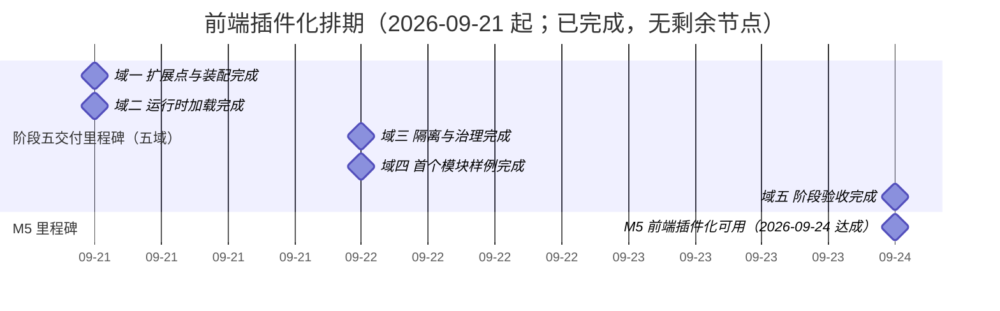

# 前端插件化计划

> BMS 基础管理系统 · 阶段五（前端插件化 / M5 前端插件化可用）排期计划：**已完成 9 项，剩余 0 项**（域 01 扩展点与装配 2 项 / 36h、域 02 运行时加载 2 项 / 40h、域 03 隔离与治理 3 项 / 44h、域 04 首个模块样例 1 项 / 24h、域 05 阶段验收 1 项 / 8h，合计 9 项 / **152h**；实际 2026-09-21 ~ 2026-09-24 收口）

[文档首页](../../../文档首页.md) › 前端插件化计划　|　[任务基线 →](../任务/01_扩展点与装配/01_扩展点与装配.md)　[需求基线 →](../需求/00_需求_前端插件化.md)

## 1. 计划说明 

- **排期对象**：阶段五 9 条需求、9 个子任务（域 01 扩展点与装配 2 / 域 02 运行时加载 2 / 域 03 隔离与治理 3 / 域 04 首个模块样例 1 / 域 05 阶段验收 1），任务基线见[域 01](../任务/01_扩展点与装配/01_扩展点与装配.md)、[域 02](../任务/02_运行时加载/02_运行时加载.md)、[域 03](../任务/03_隔离与治理/03_隔离与治理.md)、[域 04](../任务/04_首个模块样例/04_首个模块样例.md)、[域 05](../任务/05_阶段验收/05_阶段验收.md)。
- **执行序（承前启后）**：`01_01 扩展点注册表补齐与统一装配` → `01_02 宿主加载器运行时化与模块契约远端对接` → `02_01 Module Federation 接入与模块独立构建` → `02_02 依赖共享与版本偏斜治理` → `03_01 样式与运行时隔离` → `03_02 模块清单与发布治理` → `03_03 可观测与失败兜底` → `04_01 首个模块样例` → `05_01 阶段验收门禁核对与测试报告`（收口）。
- **承接口径**：阶段四已交付**宿主薄壳与模块加载器接口**（本地演示模块）、**模块契约**（注入上下文 / 注册声明 / 样式约束）、**统一注册表基座与注册项契约**、**五类注册表最小实现**（路由·菜单 / 通用组件 / 字段渲染器 / 图标 / 工作台卡片）；本阶段在其上**补齐八类扩展点、运行时化加载器、接入 Module Federation 并落地治理闭环**，不重复建设基座。
- **已定口径（2026-09-21 拍板）**：需求 8 条 / 4 域；`05-8` 样例落点为**平台内样例模块**；`05-6` 发布治理取**最小闭环**（清单驱动发布 + 清单版本回滚 + 契约测试，灰度 / 蓝绿仅保留按清单指向切换）；`05-5` 隔离增强**本期只出评估结论**（不引入 `Shadow DOM` / JS 沙箱）。
- **排期口径**：自 2026-09-21 起串行排期（单人兼职）；按 8h/日折算，2026-10-01 ~ 2026-10-07（国庆）不计入。
- **工时**：已完成 152h；剩余 0h；阶段合计 **152h**（域 01 36h = 01_01 16h + 01_02 20h、域 02 40h = 02_01 24h + 02_02 16h、域 03 44h = 03_01 12h + 03_02 20h + 03_03 12h、域 04 24h、域 05 8h）。**2026-09-24 域 05 05_01 完成（8h 转入已完成），阶段五 9 项 / 152h 全部转入已完成。**
- **里程碑锚点**：M5 = **前端插件化可用**（《总体项目规划》「里程碑」节），门禁 7 行逐项结论与证据索引见[本计划 §5 M5 验收门禁](#accept)。
- **负责人**：minjian（兼职，单人）。

## 2. 已完成任务（2026-09-21 ~ 2026-09-24） 

| 编号 | 任务 | 工时（重估） | 完成日期 | 任务文件 | 偏差与遗留 |
| --- | --- | --- | --- | --- | --- |
| 01_01 | 扩展点注册表补齐与统一装配（八类） | 16h | 2026-09-21 | [01_01](../任务/01_扩展点与装配/01_扩展点与装配_01_扩展点注册表补齐与统一装配/01_扩展点与装配_01_扩展点注册表补齐与统一装配.md) | 按拍板取真八类（补 i18n 文案包）；来源字段改名 `registrationSource`；宿主渲染消费未接线——**已由 `01_02` 接线闭环**（区域渲染 / 令牌注入 / 文案并入），详见 01_01 实施记录 §4 / §6 与 01_02 实施记录 §4 |
| 01_02 | 宿主加载器运行时化与模块契约远端对接（清单驱动加载 / 消费接线 / 区域插槽件） | 20h | 2026-09-21 | [01_02](../任务/01_扩展点与装配/01_扩展点与装配_02_宿主加载器运行时化与模块契约远端对接/01_扩展点与装配_02_宿主加载器运行时化与模块契约远端对接.md) | 工时 16h → 20h（拍板补消费接线与组件设计节点）；八类声明通道补齐字段渲染器；新增 ui-ep 区域插槽件（组件设计节点 + 原型）；远端入口形态与清单治理分别归 `02_01` / `03_02`，详见实施记录 §4 / §6——**`02_01` 已完成**：远端入口形态已接线（入口解析器注入）、`LocalModuleLoader` 去留已定（删除，实现收敛为一套） |
| 02_01 | Module Federation 接入与模块独立构建（清单 `mode` / 远端解析器注入 / 独立模块工程 / 单独计量 / CI 接线） | 24h | 2026-09-21 | [02_01](../任务/02_运行时加载/02_运行时加载_01_ModuleFederation接入与模块独立构建/02_运行时加载_01_ModuleFederation接入与模块独立构建.md) | 实测修订：`shared` 集合由六件**收窄为框架三件**（宿主共享 UI 组件库会把整库拉入首屏；平台基座包经 alias 消费时 MF 探测不到）——两者共享方案归 `02_02`；新增装配时序修正（路由安装后移至模块装载之后，首屏直连模块路由不再落兜底 404）；`LocalModuleLoader` 删除（入口解析器注入）；`01_02` 遗留 1 / 5 闭环，详见实施记录 §4 / §6——**遗留 1 / 2（UI 组件库共享、基座包共享）已由 `02_02` 闭环**（受控实测与机制判定后登记为受控非共享项） |
| 02_02 | 依赖共享与版本偏斜治理（共享声明单一来源 / 单例与版本要求 / 模块无回退副本 / 双层实例数断言 / 白名单护栏 / 升级契约） | 16h | 2026-09-21 | [02_02](../任务/02_运行时加载/02_运行时加载_02_依赖共享与版本偏斜治理/02_运行时加载_02_依赖共享与版本偏斜治理.md) | 工时 12h → 16h（拍板重估：新增受控实测、双层断言、白名单护栏、规范节与升级契约、CI job）；**共享面收窄为框架三件**——`element-plus` 经受控实测（朴素共享首屏 660.7 KB；`eager:false` + `treeShaking runtime-infer` 启动仍异步拉取约 433 KB，属指标失真）锁定为非共享项，基座包经 alias 消费机制上无从共享；模块构建拆「远端产物 / 独立预览产物」两目标；需求措辞已按结论回写，详见实施记录 §4 / §6 |
| 03_01 | 样式与运行时隔离（Scoped / 令牌 / 全局污染五类护栏 / 运行时约束 / 沙箱评估） | 12h | 2026-09-21 | [03_01](../任务/03_隔离与治理/03_隔离与治理_01_样式与运行时隔离/03_隔离与治理_01_样式与运行时隔离.md) | 按拍板：护栏取「平台脚本 + 宿主测试双接入」（源码面随 `desktop-check`、产物面随 `module-build`）；全局污染五类全拦；运行时严格（禁自建宿主实例 + 禁全部持久化 API）；产物面扫 CSS + 模块自有 JS 块（MF 运行时 / vendor 块不扫）；独立预览壳与令牌定义源豁免；demo 补只读上下文消费；隔离增强评估成文（本期不引入），详见实施记录 §4 / §6 |
| 03_02 | 模块清单与发布治理（清单可见性 / 版本发现 / 发布回滚工具 / 契约版本与契约用例工厂 / 发布留痕） | 20h | 2026-09-22 | [03_02](../任务/03_隔离与治理/03_隔离与治理_02_模块清单与发布治理/03_隔离与治理_02_模块清单与发布治理.md) | 工时 16h → 20h（拍板重估：新增契约版本机制、契约用例工厂、发布 / 回滚 / 服务三脚本、发布前强校验、CI 遍历模块与全套文档回写）；按拍板：清单可见性 `enabled`；版本发现以产物元数据为权威；发布存储本次只做本机形态（mjbk / 生产部署留部署阶段）；回滚真跑端到端演练（临时工作区 0.1.0 → 0.2.0 → 回滚 0.1.0）；模块契约测试经 `@bms/core/testing` 契约工厂同一套断言 + 契约用例齐备护栏；发现并记录「回滚后源码 / 清单版本可不一致，护栏提示须同步处理源码版本」，详见实施记录 §4 / §6 |
| 03_03 | 可观测与失败兜底（加载超时与降级重试 / 错误带模块名版本与按模块聚合 / 加载渲染耗时与体积归因 / Web Vitals 按模块 / sourcemap 归档映射） | 12h | 2026-09-22 | [03_03](../任务/03_隔离与治理/03_隔离与治理_03_可观测与失败兜底/03_隔离与治理_03_可观测与失败兜底.md) | 按拍板：观测能力入链（能力域基类 `BaseModuleTelemetry` + 插件基类 `BaseModuleReporter` 两层）；Web Vitals 用官方 `web-vitals`；错误上报经 `configureBase` sink 带模块名与版本；耗时拆 `resolve` / `setup` / `mount` + 渲染四段；体积随**发布记录**留痕（`module-metrics` 单一实现）；sourcemap 开外部 `.map` 且发布前强校验（**四关**：版本 / 隔离 / 共享 / sourcemap）；超时 10s（整个 `load()` 计时）、重试手动单模块；CI 扩展既有 job；观测面板 dev-only。详见实施记录 §4 / §6 |
| 04_01 | 首个模块样例（独立模块 `sample`：真实形态页面 + 独立发布回滚 + 接入指南） | 24h | 2026-09-22 | [04_01](../任务/04_首个模块样例/04_首个模块样例_01_首个模块样例/04_首个模块样例_01_首个模块样例.md) | 按拍板：新建独立模块工程（demo 保留基线）；模块名 `sample`（示例数据管理：查询筛选 + 列表 + 详情 + 独立表单）；模块内占位数据服务；样例进生产菜单 + 宿主菜单装配泛化（路由 `meta` 承载 `menu` / `group` / `devOnly`，核心装配器识别 `menu:false`）；仓内真跑发布回滚（0.1.0 → 0.2.0 → 回滚 0.1.0，终态 0.1.0）；接入指南落知识档案《微前端》专题。**实测对齐**：第三方 `element-plus` 经 `output.codeSplitting.groups` 独立分包（EP 全局副作用此前会被产物面隔离扫描误判）；`element-plus.maxModuleGzipKb` 546 → 660（真实模块成本基线 + 20%）；`02_02` 遗留 `#TYPE-001`（MF 类型声明生成）一并修复（demo / sample 双模块重发归档）；`02_02` 遗留临时预览进程已清理。详见实施记录 §4 / §6 |
| 05_01 | 阶段验收门禁核对与测试报告 | 8h | 2026-09-24 | [05_01](../任务/05_阶段验收/05_阶段验收_01_阶段验收门禁核对与测试报告/05_阶段验收_01_阶段验收门禁核对与测试报告.md) | 无（M5 门禁 7 行逐条有结论与证据、[阶段测试报告](../01_测试报告_前端插件化.md)归档、三类文档状态一致；新增计划 §7 遗留台账） |

## 3. 剩余任务排期（自 2026-09-21） 

> 阶段五 9 个子任务**已全部完成**（域 01 ~ 域 05），无剩余排期项；本阶段收官。本节保留表结构以维持计划两表契约。

| 编号 | 任务 | 工时 | 依赖 | 排期窗口 | 备注 | 偏差与遗留 |
| --- | --- | --- | --- | --- | --- | --- |

## 4. 排期甘特图 

> 阶段已收口：甘特不含已完成任务节点，只保留五域交付里程碑与 M5 达成；逐条门禁结论见 §5。

## 5. M5 验收门禁 

门禁定义见《[总体项目规划](../../../规划/总体项目规划.md)》「阶段内容与完成标准」节（阶段五行）；**逐项结论与证据索引见下表（7 行）**，阶段汇总见《[阶段测试报告](../01_测试报告_前端插件化.md)》。判定口径：本阶段门禁判「**机制与产物就位 + 首个样例真跑通**」，生产部署形态 / 灰度进阶待后续阶段的项在结论后以「（限定：…）」注明归口；**7 行全部达标，无未达标项**（2026-09-24 收口）。

| 验收点 | 对应任务 | 达成路径（结论与证据索引） |
| --- | --- | --- |
| 八类扩展点注册表可用 | 01_01 | **达标（2026-09-24）**：路由·菜单 / 页面区域 / 通用组件 / 字段渲染器 / 图标 / 工作台卡片 / 主题令牌 / i18n 文案包八域注册表统一基于注册表基座与注册项契约；注册 / 解析 / 拒重 / 未命中契约断言 + 「不注册不可用」护栏（Kiwi 976；`packages/core/tests/{registries,guard-unregistered-provider}.spec.ts`） |
| 宿主运行时加载模块 | 01_02 / 02_01 | **达标（2026-09-24）**：宿主按模块清单加载远端模块（清单驱动 + 远端入口解析器注入），动态路由生效、挂载与卸载无残留、区域渲染 / 令牌注入 / 文案并入挂载生效并卸载还原（Kiwi 977）；模块独立构建产物（非构建期合并）+ 端到端实跑 `/demo` 渲染远端页面、404 计数 0（Kiwi 978；收口复跑：宿主 17 文件 / 101 用例、`modules.json` 双模块 `mode: remote` 版本化） |
| `shared` 依赖单实例 | 02_02 | **达标（2026-09-24）**：共享面 `pinia` / `vue` / `vue-router` 双侧声明一致、宿主为提供方、模块 `import:false` + `strictVersion`；构建期产物级实例数断言与运行期断言双层（Kiwi 979；收口复跑 `check-shared-deps.mjs`：依赖实例数 = 1、提供方份数 宿主 1 / 模块 0；`check-shared-whitelist.mjs` 白名单 6 项通过） |
| 模块不污染宿主 | 03_01 | **达标（2026-09-24）**：平台隔离扫描源码面 + 产物面（纯函数 + CLI）+ 宿主护栏用例（全局原型 / 全局事件 / 全局样式等五类 fixture 拦截 + 豁免 + 产物夹具）（Kiwi 980）；收口复跑：源码面 20 文件零违规，demo 产物面 CSS 2 / 自有 JS 3、sample 产物面 CSS 3 / 自有 JS 4 零违规 |
| 模块清单与发布治理可用 | 03_02 | **达标（2026-09-24）**：清单（名称 / 入口 / 版本）可见性与版本发现、契约版本校验、发布 / 回滚 / 停用启用工具与三关强校验、契约用例工厂覆盖全部注册实现 + 齐备护栏（Kiwi 981）；回滚端到端演练（0.1.0 → 0.2.0 → 回滚 0.1.0）结论引用该任务测试记录 §3。**（限定：模块工程覆盖率门禁未启用 → 计划 §7 第 4 项）** |
| 失败可兜底、问题可按模块归因 | 03_03 | **达标（2026-09-24）**：加载超时（10s）与降级手动单模块重试、错误上报带模块名与版本并按模块聚合（复用总基类通道）、加载三段（`resolve` / `setup` / `mount`）与渲染耗时及产物体积按模块归因、Web Vitals 按活动模块归属、sourcemap 随发布按版本归档与发布前四关强校验、观测能力入链（`BaseModuleTelemetry` + `BaseModuleReporter`）（Kiwi 982） |
| 首个模块样例独立发布 | 04_01 | **达标（2026-09-24）**：`frontend/modules/sample` 真实形态页面（查询筛选 + 列表 + 详情 + 独立表单）经八类扩展点注册 + 路由 `meta` 菜单装配，独立构建产物（sourcemap / 体积预算 / 隔离扫描 / `element-plus` 独立分包）经清单发布并回滚（0.1.0 → 0.2.0 → 回滚 0.1.0），接入指南落知识档案《微前端》专题（Kiwi 983）。收口复跑：sample 5 文件 / 21 用例、容器入口 13.2 KB（预算 16 KB）、产物面隔离零违规。**（限定：生产 / mjbk 部署形态与灰度进阶 → 计划 §7 第 1 / 2 项）** |

**里程碑对照**（《总体项目规划》「里程碑」节）：

| 里程碑 | 基线（《总体项目规划》） | 本计划实际 | 说明 |
| --- | --- | --- | --- |
| M5 前端插件化可用 | 阶段五（排期 2026-09-21 起） | **2026-09-24 达成**（自 2026-09-21 起实际投入 4 日） | 7 行门禁全部达标；阶段测试报告归档；阶段五 9 项 / 152h 全部完成 |

## 6. 风险与对策 

| 风险 | 影响 | 对策 |
| --- | --- | --- |
| 新增扩展点域各自另起映射 | 统一拒重与清单对账失效、后续返工 | 一律基于注册表基座与注册项契约；沿用阶段四「清单对账」护栏口径扩展对账面 |
| MF 与既有构建（首屏体积预算 / 分包）冲突 | 首屏膨胀或构建失败 | 模块产物**单独计量**；动态导入强制分包；预算门禁与构建一起跑 |
| 共享依赖双实例（`shared` 遗漏 / 版本不匹配） | 运行时疑难问题（状态不通、上下文丢失） | `shared` + `singleton` + `requiredVersion` 声明；生产构建与 CI 依赖实例数断言；版本不一致明确处置 |
| 构建期合并与运行时加载两种形态共存配置歧义 | 加载路径混乱、排障困难 | 由模块清单显式区分并成文；加载器只认清单，不做隐式回退 |
| 隔离约束退化（无护栏则形同虚设） | 宿主样式 / 运行时被污染 | 隔离约定同步沉淀机器护栏 + fixture；并入模块接入检查项与审计维度 |
| 回滚只停留在纸面 | 模块发布事故无法快速回退 | 回滚必须**真跑一次**（清单版本回退演练）并留痕；清单为唯一发布来源 |
| 样例绕过机制（直接 import 主应用） | M5 验收失真 | 样例必须经注册声明 + 独立构建 + 运行时加载；核对页与加载日志作为证据 |
| 单人兼职投入不稳 | M5 延期 | 串行保守排期；先打通「注册 → 独立构建 → 运行时加载」主链，隔离与可观测可顺延补 |

## 7. 后续阶段待办 

| # | 事项 | 来源 | 归口 |
| --- | --- | --- | --- |
| 1 | 生产 / mjbk 部署形态（模块产物上传 + 部署侧清单 + 远端入口地址替换）与灰度 / 蓝绿进阶（按用户 / 租户 / 比例；本期只保留按清单指向切换） | 02_01 / 02_02 / 03_02 收口遗留 | 部署阶段 |
| 2 | 真实后端上报通道（本期为内存记录 + 可替换插件）、`BaseModuleReporter` 真实实现、按模块 SLO 与告警阈值、移动端观测面板 | 03_03 测试记录 §6 | 可观测子系统阶段 / 运维阶段 |
| 3 | 模块 sourcemap 与产物的制品库 / CDN 托管、私有化映射 | 03_03 测试记录 §6 | 生产部署阶段 |
| 4 | 模块工程（`frontend/modules/*`）覆盖率门禁未启用（现为 `typecheck` / `lint` / `test` + 构建产物断言） | 04_01 测试记录 §5；03_02 §5 | 随《测试规范》前端门槛统一口径 |
| 5 | **历史开放自动缺陷单 27 条**（`defect-auto`；含阶段五窗口 2 条：iid 27 / 28 对应流水线 #305 / #306）未随修复流转关闭，且「修复即流转关闭」流程存缺口 | 本任务缺陷核对（2026-09-24，GitLab 项目 2 查询） | 阶段收口清账 / 缺陷治理（经确认后按《测试规范》§9 逐条附修复依据关闭，并补治理脚本） |
| 6 | 主题令牌 / 文案包与既有 `BaseTheme` / `tokens.scss`、宿主 i18n 实例的接线口径；国际化阶段以适配层替换 `moduleI18n` 内部实现；令牌 `mode` 维度注入与主题品牌化对齐 | 01_01 / 01_02 测试记录 §6 | 国际化阶段 / 主题与品牌化阶段 |
| 7 | 注册表「宽和档」启用与否；注册表按模块归因观测与清单对账面扩展 | 01_01 测试记录 §6 | 各域消费方明确后 |
| 8 | 依赖版本协商（本期为「单例 + 拒绝」）；基座包发布版本化 / 共享域化后重估 `@bms/core` / `@bms/ui-ep` 的共享可行性并回写单一来源 | 02_02 测试记录 §6 | 演进路线（微前端治理增强） |
| 9 | 隔离增强（`Shadow DOM` / JS 沙箱）本期只出评估结论（不引入） | 03_01 测试记录 §6；需求范围外 | 微前端治理增强（按需） |
| 10 | 平台自身页面迁移为模块（保留构建期合并过渡形态）与移动端宿主 / 模块（`frontend/apps/mobile` / `ui-vant`） | 需求范围外 | 后续前端阶段（阶段十七） |
| 11 | 样例模块的真实接口联调、生产部署、字段渲染器 / 卡片消费、菜单权限过滤 | 04_01 实施记录 §6 | 对应业务阶段 / 权限阶段 |
| 12 | 浏览器级真机端到端（动态路由 / 菜单联动 / 挂载卸载 / 兜底 / shared 单实例）为人工步骤（宿主用例 + 产物可达性已覆盖） | 04_01 测试记录 §5 | 前端全页面 / E2E 阶段（阶段十五） |
| 13 | 测试资产仓《Kiwi 用例台账》§2 / §3 缺阶段五 `03_01` / `03_02` / `03_03` / `04_01` 四条登记（平台侧用例存在：**980 ~ 983**） | 本任务编号核对（2026-09-24，与平台对账发现） | 测试资产仓台账补齐（随下次用例批次维护） |

> **台账说明（2026-09-24 阶段五收口）**：上表汇总各任务实施 / 测试记录遗留与收口新增项（**共 13 项**），逐条给归口、无「无归口」条目；报告 §4 引用同一台账。第 5 项为收口新增（历史自动缺陷单待确认后处置）；第 13 项为收口新增（台账缺登记，与阶段二 §7 同口径）；第 4 项为模块工程覆盖率门禁口径缺口（限定期内已计入门禁结论）；其余各项随对应后续阶段推进。

> 本文档依《[文档生成规范](../../../规范/文档生成规范.md)》与《[计划文档规范](../../../规范/计划文档规范.md)》编写
