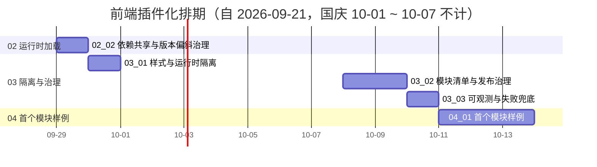

# 前端插件化计划

> BMS 基础管理系统 · 阶段五（前端插件化 / M5 前端插件化可用）排期计划：域 01 扩展点与装配 2 项 / 36h、域 02 运行时加载 2 项 / 36h、域 03 隔离与治理 3 项 / 40h、域 04 首个模块样例 1 项 / 24h，合计 8 项 / **136h**（含依赖窗口）

[文档首页](../../../文档首页.md) › 前端插件化计划　|　[任务基线 →](../任务/01_扩展点与装配/01_扩展点与装配.md)　[需求基线 →](../需求/00_需求_前端插件化.md)

## 1. 计划说明 

- **排期对象**：阶段五 8 条需求、8 个子任务（域 01 扩展点与装配 2 / 域 02 运行时加载 2 / 域 03 隔离与治理 3 / 域 04 首个模块样例 1），任务基线见[域 01](../任务/01_扩展点与装配/01_扩展点与装配.md)、[域 02](../任务/02_运行时加载/02_运行时加载.md)、[域 03](../任务/03_隔离与治理/03_隔离与治理.md)、[域 04](../任务/04_首个模块样例/04_首个模块样例.md)。
- **执行序（承前启后）**：`01_01 扩展点注册表补齐与统一装配` → `01_02 宿主加载器运行时化与模块契约远端对接` → `02_01 Module Federation 接入与模块独立构建` → `02_02 依赖共享与版本偏斜治理` → `03_01 样式与运行时隔离` → `03_02 模块清单与发布治理` → `03_03 可观测与失败兜底` → `04_01 首个模块样例`。
- **承接口径**：阶段四已交付**宿主薄壳与模块加载器接口**（本地演示模块）、**模块契约**（注入上下文 / 注册声明 / 样式约束）、**统一注册表基座与注册项契约**、**五类注册表最小实现**（路由·菜单 / 通用组件 / 字段渲染器 / 图标 / 工作台卡片）；本阶段在其上**补齐八类扩展点、运行时化加载器、接入 Module Federation 并落地治理闭环**，不重复建设基座。
- **已定口径（2026-09-21 拍板）**：需求 8 条 / 4 域；`05-8` 样例落点为**平台内样例模块**；`05-6` 发布治理取**最小闭环**（清单驱动发布 + 清单版本回滚 + 契约测试，灰度 / 蓝绿仅保留按清单指向切换）；`05-5` 隔离增强**本期只出评估结论**（不引入 `Shadow DOM` / JS 沙箱）。
- **排期口径**：自 2026-09-21 起串行排期（单人兼职）；按 8h/日折算，2026-10-01 ~ 2026-10-07（国庆）不计入。
- **工时**：域 01 36h（01_01 16h + 01_02 20h）、域 02 36h（02_01 24h + 02_02 12h）、域 03 40h（03_01 12h + 03_02 16h + 03_03 12h）、域 04 24h；**阶段五合计 136h**。
- **里程碑锚点**：M5 = **前端插件化可用**（《总体项目规划》「里程碑」节），门禁定义与逐项核对见[本计划 §5 M5 验收门禁](#accept)。
- **负责人**：minjian（兼职，单人）。

## 2. 已完成任务 

| 编号 | 任务 | 工时（重估） | 完成日期 | 任务文件 | 偏差与遗留 |
| --- | --- | --- | --- | --- | --- |
| 01_01 | 扩展点注册表补齐与统一装配（八类） | 16h | 2026-09-21 | [01_01](../任务/01_扩展点与装配/01_扩展点与装配_01_扩展点注册表补齐与统一装配/01_扩展点与装配_01_扩展点注册表补齐与统一装配.md) | 按拍板取真八类（补 i18n 文案包）；来源字段改名 `registrationSource`；宿主渲染消费未接线——**已由 `01_02` 接线闭环**（区域渲染 / 令牌注入 / 文案并入），详见 01_01 实施记录 §4 / §6 与 01_02 实施记录 §4 |
| 01_02 | 宿主加载器运行时化与模块契约远端对接（清单驱动加载 / 消费接线 / 区域插槽件） | 20h | 2026-09-21 | [01_02](../任务/01_扩展点与装配/01_扩展点与装配_02_宿主加载器运行时化与模块契约远端对接/01_扩展点与装配_02_宿主加载器运行时化与模块契约远端对接.md) | 工时 16h → 20h（拍板补消费接线与组件设计节点）；八类声明通道补齐字段渲染器；新增 ui-ep 区域插槽件（组件设计节点 + 原型）；远端入口形态与清单治理分别归 `02_01` / `03_02`，详见实施记录 §4 / §6——**`02_01` 已完成**：远端入口形态已接线（入口解析器注入）、`LocalModuleLoader` 去留已定（删除，实现收敛为一套） |
| 02_01 | Module Federation 接入与模块独立构建（清单 `mode` / 远端解析器注入 / 独立模块工程 / 单独计量 / CI 接线） | 24h | 2026-09-21 | [02_01](../任务/02_运行时加载/02_运行时加载_01_ModuleFederation接入与模块独立构建/02_运行时加载_01_ModuleFederation接入与模块独立构建.md) | 实测修订：`shared` 集合由六件**收窄为框架三件**（宿主共享 UI 组件库会把整库拉入首屏；平台基座包经 alias 消费时 MF 探测不到）——两者共享方案归 `02_02`；新增装配时序修正（路由安装后移至模块装载之后，首屏直连模块路由不再落兜底 404）；`LocalModuleLoader` 删除（入口解析器注入）；`01_02` 遗留 1 / 5 闭环，详见实施记录 §4 / §6 |

## 3. 剩余任务排期（自 2026-09-21） 

| 编号 | 任务 | 工时 | 依赖 | 排期窗口 | 备注 | 偏差与遗留 |
| --- | --- | --- | --- | --- | --- | --- |
| 02_02 | 依赖共享与版本偏斜治理 | 12h | 02_01 | 2026-09-29 | `shared` 单例与 `requiredVersion`、CI 依赖实例数断言、升级契约；**`02_01` 已交付框架三件 `shared` 声明与「UI 组件库 / 平台基座包共享」实测结论（宿主共享整库会拉入首屏、基座包经 alias 消费 MF 探测不到），本任务在此之上补齐治理** | 无 |
| 03_01 | 样式与运行时隔离 | 12h | 02_01 | 2026-09-30 | Scoped / 令牌 / 前缀 + 全局污染护栏；沙箱仅出评估结论 | 无 |
| 03_02 | 模块清单与发布治理 | 16h | 01_02 / 02_01 / 03_01 | 2026-10-08 ~ 2026-10-09 | 清单唯一来源、发布与回滚（清单版本回退）演练、模块契约测试 | 无 |
| 03_03 | 可观测与失败兜底 | 12h | 02_01 / 02_02 | 2026-10-10 | 超时与降级、按模块归因、Web Vitals 按模块、sourcemap 口径 | 无 |
| 04_01 | 首个模块样例（真实形态 + 独立发布 + 接入指南） | 24h | 01_01 ~ 03_03 | 2026-10-11 ~ 2026-10-13 | 平台内样例模块（已定）；M5 验收样例 | 无 |

> 排期说明：`2026-10-01 ~ 2026-10-07` 为国庆假，窗口跳过；`03_02` 起自 `2026-10-08` 续排。

## 4. 排期甘特图 

> 甘特为串行保守基线；不含已完成节点（`01_01` / `01_02` / `02_01` 已完成，见 §2）。

## 5. M5 验收门禁 

| 验收点 | 对应任务 | 达成路径 |
| --- | --- | --- |
| 八类扩展点注册表可用 | 01_01 | 路由·菜单 / 页面区域 / 通用组件 / 字段渲染器 / 图标 / 工作台卡片 / 主题令牌 / i18n 文案包各设注册表，统一基于注册表基座与注册项契约；注册 / 解析 / 拒重 / 未命中契约用例覆盖 |
| 宿主运行时加载模块 | 01_02 / 02_01 | 宿主按模块清单加载远端模块；动态路由生效、挂载与卸载正常；区域渲染 / 令牌注入 / 文案并入挂载生效、卸载还原（01_02）；模块独立构建产物（非构建期合并） |
| `shared` 依赖单实例 | 02_02 | `shared` 单例声明与 `requiredVersion`；生产构建与 CI 断言依赖实例数为 1 |
| 模块不污染宿主 | 03_01 | 样式前缀与 Scoped / 令牌约束；机器护栏拦截全局原型、全局事件与全局样式改写 |
| 模块清单与发布治理可用 | 03_02 | 清单（名称 / 入口 / 版本）可用、版本发现与回滚（清单版本回退）可执行、模块契约测试覆盖全部注册实现 |
| 失败可兜底、问题可按模块归因 | 03_03 | 加载失败兜底与超时生效；错误上报带模块名与版本；按模块归因（错误 / 性能 / 体积）与 sourcemap 映射 |
| 首个模块样例独立发布 | 04_01 | 首个业务页面按模块形态开发，独立构建并发布，经宿主运行时加载（动态路由 + 独立产物） |

## 6. 风险与对策 

| 风险 | 影响 | 对策 |
| --- | --- | --- |
| 新增扩展点域各自另起映射 | 统一拒重与清单对账失效、后续返工 | 一律基于注册表基座与注册项契约；沿用阶段四「清单对账」护栏口径扩展对账面 |
| MF 与既有构建（首屏体积预算 / 分包）冲突 | 首屏膨胀或构建失败 | 模块产物**单独计量**；动态导入强制分包；预算门禁与构建一起跑 |
| 共享依赖双实例（`shared` 遗漏 / 版本不匹配） | 运行时疑难问题（状态不通、上下文丢失） | `shared` + `singleton` + `requiredVersion` 声明；生产构建与 CI 依赖实例数断言；版本不一致明确处置 |
| 构建期合并与运行时加载两种形态共存配置歧义 | 加载路径混乱、排障困难 | 由模块清单显式区分并成文；加载器只认清单，不做隐式回退 |
| 隔离约束退化（无护栏则形同虚设） | 宿主样式 / 运行时被污染 | 隔离约定同步沉淀机器护栏 + fixture；并入模块接入检查项与审计维度 |
| 回滚只停留在纸面 | 模块发布事故无法快速回退 | 回滚必须**真跑一次**（清单版本回退演练）并留痕；清单为唯一发布来源 |
| 样例绕过机制（直接 import 主应用） | M5 验收失真 | 样例必须经注册声明 + 独立构建 + 运行时加载；核对页与加载日志作为证据 |
| 单人兼职投入不稳 | M5 延期 | 串行保守排期；先打通「注册 → 独立构建 → 运行时加载」主链，隔离与可观测可顺延补 |

> 本文档依《[文档生成规范](../../../规范/文档生成规范.md)》与《[计划文档规范](../../../规范/计划文档规范.md)》编写
