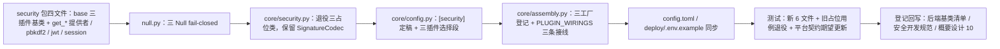

# 01 实施 · 安全原语真实实现与配置定稿

> 认证与安全 · 01 认证与会话 · 子任务 01（需求 01-1）· 实施记录

[文档首页](../../../../../../文档首页.md) › [01 认证与会话](../01_认证与会话_01_安全原语真实实现与配置定稿.md) › 实施记录　|　[← 任务](../01_认证与会话_01_安全原语真实实现与配置定稿.md)　[测试记录 →](../测试/01_测试_01_安全原语真实实现与配置定稿.md)

## 1. 实施信息 

| 项 | 值 |
| --- | --- |
| 任务 | [01 安全原语真实实现与配置定稿](../01_认证与会话_01_安全原语真实实现与配置定稿.md) |
| 对应需求 | [01-1](../../../../需求/01_需求_认证与会话.md#r01-1) |
| 详细设计 | [01 详细设计](../设计/01_详细设计_01_安全原语真实实现与配置定稿.md) |
| 实施日期 | 2026-09-26 |
| 实施人 | minjian |
| 实施环境 | 本地开发机（Python 3.14.4 / uv；依赖外置 `DEPS_DIR`）；joserfc 1.7.5 |
| 提交 | 详细设计 `6e6fb9c4`；实施 / 测试 / 登记回写 / 记录随本次提交 |
| 结论 | 完成（设计层两处微调已回写；无阻塞遗留） |

## 2. 实施概览 

## 3. 实施过程 

1. **`bms_core/security/` 新增包**：`base.py`（`BaseSecurity` 域中间层 + `BasePasswordHasher` / `BaseTokenCodec` / `BaseSessionSecurity` 三插件基类 + `get_password_hasher` / `get_token_codec` / `get_session_security` 提供者）；`pbkdf2.py`（自描述哈希串 `pbkdf2_sha256$600000$<salt_b64>$<hash_b64>`、`hmac.compare_digest` 常量时间比对、`needs_rehash`、工厂读 `[password_hasher].options.iterations` 且下限 100000）；`jwt.py`（joserfc + `oauth/keys.py` 复用、`active_kid` 签发 / 多密钥并行验签、`exp` 校验、工厂读 `[security].keys`）；`session.py`（雪花会话 id / HMAC 指纹 / `bms:global:token:blacklist:{jti}`）；`null.py`（三 Null fail-closed）。
2. **`core/security.py`**：`PasswordHasher` / `TokenCodec` / `SessionSecurity` 三占位类退役，`SignatureCodec` 改继承新 `BaseSecurity`（签名原语行为不变）。
3. **`core/config.py`**：`SecuritySettings` 定稿（`secret_key` / access 30 分钟 / refresh 14 天 / `active_kid` / `keys`，移除 `algorithm`）；`TokenKeySettings` 上移供服务 JWT 与用户令牌共用；`Settings` 增 `password_hasher` / `token_codec` / `session_security` 三插件选择段。
4. **`core/assembly.py`**：三工厂登记；`PLUGIN_WIRINGS` 补三条接线（端口 / 配置分区 / `app.state` 落点）。
5. **配置样例**：`config.toml` `[security]` 与三段插件配置重写；`deploy/.env.example` 增 `BMS_SECURITY__SECRET_KEY` / `BMS_SECURITY__KEYS` / `BMS_SECURITY__ACTIVE_KID` 注记。
6. **测试**：新增 `tests/security/` 五文件（`test_pbkdf2` / `test_jwt` / `test_session` / `test_null` / `test_providers`）；`tests/core/test_security.py` 退役占位用例、保留签名用例并加迁移核对；`tests/core/test_config.py` 断言改新口径；平台契约套件（`test_plugin_registration` / `test_plugin_contracts`）期望清单与接线一致。
7. **验证**：`uv run pytest -q` → **1369 passed / 37 skipped**；`uv run ruff check .` 通过；`uv run pyright` 0 错误；新包覆盖率 **100%**（245 语句 0 未覆盖）。
8. **登记回写**：《[后端基类清单](../../../../../../后端基类清单.md)》安全基座条目与继承链段；《[安全开发规范](../../../../../../规范/安全开发规范.md)》密码哈希口径（PBKDF2）；《[概要设计 · 系统参数](../../../../../../设计/概要设计/10_概要设计_系统参数.md)》补「前端配置边界」节（§4.3 待补节点登记同步）。

## 4. 问题与处置 

| # | 问题 / 现象 | 原因 | 处置与落点 |
| --- | --- | --- | --- |
| 1 | 插件注册表构建失败：`(password_hasher, pbkdf2)` / `(session_security, default)` 重名 | 真实实现零参可实例化 → 被自动登记，与显式工厂登记冲突 | 两实现构造函数改为**必填**参数（迭代次数 / 密钥），按其口径交由工厂注入，不进自动登记（与既有「需工厂的端口显式登记」一致）；见 `pbkdf2.py` / `session.py` 构造文档 |
| 2 | `test_null` 断言 `issubclass(Null*, BaseNullObject)` 失败 | `NullTokenCodec` / `NullSessionSecurity` 漏继承 `BaseNullObject` | 补继承（同时保证自动登记名回落 `null`） |
| 3 | `token_codec` 工厂原「keys 为空即拒」会让所有服务启动失败 | 装配期统一解析全部 `PLUGIN_WIRINGS`，无关服务未配用户令牌密钥 | 改为**空 keys 允许装配、使用时 fail-closed**（`encode` `ConfigError` / `decode` `AuthError`）；设计 §3.5 与「对齐记录」#14 回写 |
| 4 | 平台契约套件快照键集与 `PLUGIN_WIRINGS` 不一致 | 新增三能力域未进装配接线与期望清单 | `assembly.py` 补三条 `PluginWiring`；平台用例 `_EXPECTED_PLUGIN_KEYS` 补三项 |
| 5 | 文档 `password/base.py` 仍写旧落点 `app/core/security.py` | 迁移后注释过期 | 文档串更新为 `bms_core/security/` |

## 5. 验证结果 

| 项 | 方法 | 结果 |
| --- | --- | --- |
| 单元 / 集成全量 | `cd backend && uv run pytest -q` | 1369 passed，37 skipped |
| 安全域定向 | `uv run pytest libs/bms_core/tests/security tests/core/test_security.py` | 22 passed |
| 新增包覆盖率 | `--cov=bms_core.security --cov-report=term-missing` | 245 语句 / 0 未覆盖 = **100%** |
| 静态检查 | `uv run ruff check .` | All checks passed |
| 类型检查 | `uv run pyright` | 0 errors / 0 warnings |
| 契约与装配 | 平台契约套件（Kiwi 567 / 531 既有用例） | 全绿（新增三域已接线并登记） |

## 6. 偏差与遗留 

- **偏差（已回写设计）**：① 迭代次数配置落 `[password_hasher].options.iterations`（替代首轮「`[security]` 覆盖」表述）；② keys 空装配边界（见 §4 问题 3）。
- **遗留**：
  1. Kiwi 33（安全基座占位抛错用例）随占位退役，平台侧停用标记未办（**登记：测试资产仓台账随下次用例批次维护**）。
  2. 生产密钥生成 / 分发 / 轮换演练（**归口：运维 / K8s 阶段**，见设计 §7）。
  3. 指纹与黑名单键尚无消费方（**归口：01_03 / 01_04 消费**）；令牌业务语义（`aud` / `iss` / 轮换）归 01_02。
  4. `BaseSecurity` 为域中间层（无抽象方法、不进端口清单，符合平台契约套件「抽象端口」口径）。

> 本文档依《[文档生成规范](../../../../../../规范/文档生成规范.md)》编写
