# 02 实施 · 用户令牌自签与网关校验源切换

> 认证与安全 · 01 认证与会话 · 子任务 02（需求 01-2）· 实施记录

[文档首页](../../../../../../文档首页.md) › [01 认证与会话](../01_认证与会话_02_用户令牌自签与网关校验源切换.md) › 实施记录　|　[← 任务](../01_认证与会话_02_用户令牌自签与网关校验源切换.md)　[测试记录 →](../测试/01_测试_02_用户令牌自签与网关校验源切换.md)

## 1. 实施信息 

| 项 | 值 |
| --- | --- |
| 任务 | [02 用户令牌自签与网关校验源切换](../01_认证与会话_02_用户令牌自签与网关校验源切换.md) |
| 对应需求 | [01-2](../../../../需求/01_需求_认证与会话.md#r01-2) |
| 详细设计 | [02 详细设计](../设计/01_详细设计_02_用户令牌自签与网关校验源切换.md) |
| 实施日期 | 2026-09-26 |
| 实施人 | minjian |
| 实施环境 | 本地开发机（Python 3.14.4 / uv）；joserfc 1.7.5 本地生成 RSA 密钥；mjbk（Docker，APISIX 3.18.0）+ 开发机承载 identity 服务 |
| 提交 | 详细设计 `67bb9f65`；实施 / 测试 / 登记回写 / 记录随本次提交 |
| 结论 | 完成（12 项决策全按确认执行；设计层无偏差；新增模块覆盖率 100%） |

```mermaid
flowchart LR
    A["oauth/user_token.py：契约 + 常量 + 提供者"] --> B["oauth/user_jwt.py：JwtUserTokenIssuer + 工厂（kid 前缀强校验 / TTL 读 [security]）"]
    B --> C["oauth/keys.py：merge_jwks（kid 冲突即拒）"]
    C --> D["oauth/null.py：NullUserTokenIssuer（fail-closed）"]
    D --> E["oauth/verify.py：api 分支切本地用户 JWKS + 归一兼容 type / tenant_id"]
    E --> F["config.py / assembly.py / deps.py：[user_token] 配置 + 接线 + 导出"]
    F --> G["identity wellknown.py：JWKS 合并发布（冲突 503）"]
    G --> H["config.toml / deploy/.env.example：usr- 前缀样例"]
    H --> I["测试：新增 / 改造 5 文件 + 平台契约清单"]
    I --> J["门禁 + mjbk 冒烟 + 契约快照与前端类型重生成"]
```

## 2. 实施概览 

## 3. 实施过程 

1. **契约（`oauth/user_token.py`，新增）**：`BaseUserTokenIssuer`（`key = plugin_key = "user_token"`；异步 `issue_pair(UserTokenSpec) -> UserTokenPair` / `jwks()` / `verify(token, *, expected_type)`）+ `UserTokenSpec`（`subject` / `session_id` / `tenant_id` / `scopes`）/ `UserTokenPair`（双 token + `token_type` / `expires_in` / `refresh_expires_in` / `session_id` / `scopes`）+ 常量（`USER_TOKEN_KID_PREFIX = "usr-"` / `USER_TOKEN_TYPE_ACCESS` / `USER_TOKEN_TYPE_REFRESH` / `DEFAULT_USER_TOKEN_ISSUER = "bms"`）+ 提供者 `get_user_token_issuer`；`expected_type` 必填（防默认放行）。
2. **真实实现（`oauth/user_jwt.py`，新增）**：`JwtUserTokenIssuer`（joserfc，算法白名单 RS256 / ES256、`active_kid` 选键、多密钥并行轮换、access 30 分钟 / refresh 14 天来自 `[security]`）；构造期强校验 kid `usr-` 前缀（违者 `ConfigError` 拒绝装配）；`issue_pair` 一次签出双 token（`jti` 同值 = 会话 id、`aud=api` / `iss` 为 BMS、`type=access|refresh`、`tenant_id` / `scope` 可选）；`verify` 全校验后再查 `type` / `sub` / `jti`；`JwtUserTokenIssuerFactory` 读 `[user_token].issuer` 与 `[security]` 密钥 / TTL（空密钥允许构造、使用时 fail-closed）。
3. **JWKS 合并（`oauth/keys.py`）**：新增 `merge_jwks(*documents)`——逐文档归并公钥、按 kid 排序确定性输出、kid 冲突 / 结构非法即抛 `ConfigError`。
4. **Null 实现（`oauth/null.py`）**：新增 `NullUserTokenIssuer`（签发 `ConfigError` / 验签 `AuthError` / 空 JWKS，fail-closed），随模块导入自动登记。
5. **校验源切换（`oauth/verify.py`）**：`UnifiedTokenVerifier` 构造改注 `user_token_issuer`（替换 `identity_provider`）；`api` 分支改本地校验并强校验 `type=access`；`_from_claims` 兼容读取 `type`/`typ` 与 `tenant_id`/`tenant`（服务令牌归一结果不变）；工厂不再解析 `[identity_provider]`。
6. **配置与装配**：`core/config.py` 增 `UserTokenSettings`（`provider` / `issuer`）与 `Settings.user_token`；`core/assembly.py` 增 `PLUGIN_WIRINGS` 行与 `register_plugin("user_token", "jwt", JwtUserTokenIssuerFactory(settings))`；`api/deps.py` 导出 `get_user_token_issuer`。
7. **JWKS 端点（`bms_identity/api/wellknown.py`）**：`merge_jwks(service_token.jwks(), user_token.jwks())` 同端点发布两类公钥；`ConfigError` → 503（fail-closed）；返回类型保持 `dict[str, object]`（公开契约结构不变）。
8. **配置样例**：`config.toml` 增 `[user_token]` 段并更新 `[security.keys]` 注记（`usr-` 前缀）；`deploy/.env.example` 用户令牌示例改 `usr-k1`、服务令牌示例推荐 `svc-k1`。
9. **测试**：新增 `services/identity/tests/oauth/test_user_token.py`（签发 / 声明 / 类型强校验 / 轮换 / 前缀 / 失败分支 / Null / 工厂 / 环境注入）；改造 `test_token_verifier.py`（api 分支切本地、aud 隔离、类型与过期分支）与 `test_wellknown_jwks.py`（合并 / 冲突 503 / 空集 / 提供者探针）；`libs/bms_core/tests/core/test_config.py` 增 `[user_token]` 断言；平台契约套件 `_EXPECTED_PLUGIN_KEYS` 增 `user_token`。
10. **登记回写**：《[后端基类清单](../../../../../../后端基类清单.md)》oauth 行与 §10 继承链；架构 04「双类 JWT 签发与校验」能力域表述；架构 14 §2 签发方与 §7 服务身份；架构 36「边缘功能」认证行；《[后端开发规范](../../../../../../规范/后端开发规范.md)》双类 JWT 强制条；《[部署发布规范](../../../../../../规范/部署发布规范.md)》密钥与 JWKS 条 / 检查项；Keycloak 与 APISIX 部署说明口径。
11. **生成件**：`ops.contract_snapshot export` 更新 `deploy/contracts/identity.json`（仅 JWKS 端点 description 变化）→ `frontend/packages/api-types` 重生成 `src/identity.ts`（同描述注释），零漂移校验通过。
12. **验证**：`uv run pytest -q` → **1386 passed / 37 skipped**；新增 / 变更模块覆盖率 **100%**；`ruff check` / `ruff format --check` / `pyright` 全绿；`ops.gateway_config check` / `ops.contract_snapshot check` / `check-backend-base` / `preflight --fast` 全绿；mjbk 真机冒烟通过（见测试记录）。

## 4. 问题与处置 

| # | 问题 / 现象 | 原因 | 处置与落点 |
| --- | --- | --- | --- |
| 1 | identity 契约快照漂移（JWKS 端点） | 端点返回类型由 `dict[str, object]` 改 `Response` 后 OpenAPI 200 响应结构消失 | 改回 `dict[str, object]` 返回 + 冲突时 `HTTPException(503)`（结构不变）；仅有 docstring 描述更新，`deploy/contracts/identity.json` 与前端 `api-types` 重生成（零漂移通过） |
| 2 | `ruff format --check .` 报 `security/pbkdf2.py` 未格式化 | 01_01 遗留：ruff 0.16 对 Python 3.14 PEP 758 无括号 `except A, B:` 的格式口径（该文件当时未随 format 门禁） | 本次随门禁格式化该行（行为不变，安全原语用例回归通过）；记入本记录（01_01 门禁口径缺项） |
| 3 | 覆盖率暴露 `user_jwt.py` 的类型 / 声明缺失分支未覆盖 | 负向用例用「新密钥」伪造票据，验签即失败，未走到目标分支；`_claims` 的 `iat` 取 2100 年被 `JWS` 未来签发校验拦截 | 负向用例改为用签发者密钥构造伪造票据；`_claims` 改为相对当前时间生成；覆盖率达 100% |
| 4 | mjbk 冒烟的 `platform` 网络别名已被容器占用 | 服务已容器化（`bms-platform` 在跑），whoami 同别名会造成 DNS 轮询不确定 | 冒烟期间临时停 `bms-platform`、验后恢复（冒烟记录见测试记录 §4） |

## 5. 验证结果 

| 项 | 方法 | 结果 |
| --- | --- | --- |
| 单元 / 集成全量 | `cd backend && uv run pytest -q` | 1386 passed，37 skipped |
| 定向用例 | `uv run pytest services/identity/tests/oauth libs/bms_core/tests/core/test_config.py` | 73 passed |
| 新增 / 变更模块覆盖率 | `--cov=bms_core.oauth.user_token --cov=bms_core.oauth.user_jwt --cov=bms_core.oauth.keys --cov=bms_core.oauth.verify --cov=bms_core.oauth.null --cov=bms_identity.api.wellknown --cov-branch` | 332 语句 / 46 分支 / 0 未覆盖 = **100%** |
| 静态检查 | `uv run ruff check .` / `ruff format --check .` | All checks passed / 739 files already formatted |
| 类型检查 | `uv run pyright` | 0 errors / 0 warnings |
| 契约与生成件 | `ops.contract_snapshot check` / `ops.gateway_config check` / api-types `gen:check` | 全绿（网关生成件零漂移，刷新令牌链路无改动） |
| 基座与预检 | `check-backend-base.py` / `check-preflight.py --fast` | 全绿 |
| mjbk 真机冒烟 | 本地签发用户令牌 → mjbk 网关 `forward-auth` → 上游 echo | 通过（无凭证与 5 类伪造 401；本地令牌 200 + 身份头 + 网关服务 JWT；停 Keycloak 本地不受影响） |

## 6. 偏差与遗留 

- **偏差**：无（决策 1~12 全按确认执行，设计与实现一致）。附注两项非语义变化：① JWKS 端点 docstring 描述更新（契约结构未变，快照与前端类型同步重生成）；② 01_01 遗留的 `pbkdf2.py` 格式漂移随门禁一次性格式化。
- **遗留**：
  1. 登录 / 刷新 / 登出端点与 refresh 轮换、会话哈希比对（**归口：01_03 / 01_04**；本任务只交 `issue_pair` + `verify(expected_type)` + 会话 id 口径）。
  2. 登录态依赖 `require_auth` 真实化与租户解析（**归口：01_05**）。
  3. SSO 登录链路与 ID Token（复用用户令牌密钥体系，`kid` 代次 / `aud` 另立口径）（**归口：02_01 / 02_05**）。
  4. 生产密钥生成 / 分发 / 轮换演练与 K8s Secret（**归口：运维 / K8s 阶段**）。
  5. 认证内部端点独立鉴权 / mTLS、认证子调用与令牌校验缓存（**归口：K8s / 性能阶段**，承接 07_03 遗留）。
  6. `X-User-Id` 内部数字 id 填充（**归口：阶段六外部身份映射 / JIT 建号**）。

> 本文档依《[文档生成规范](../../../../../../规范/文档生成规范.md)》编写
