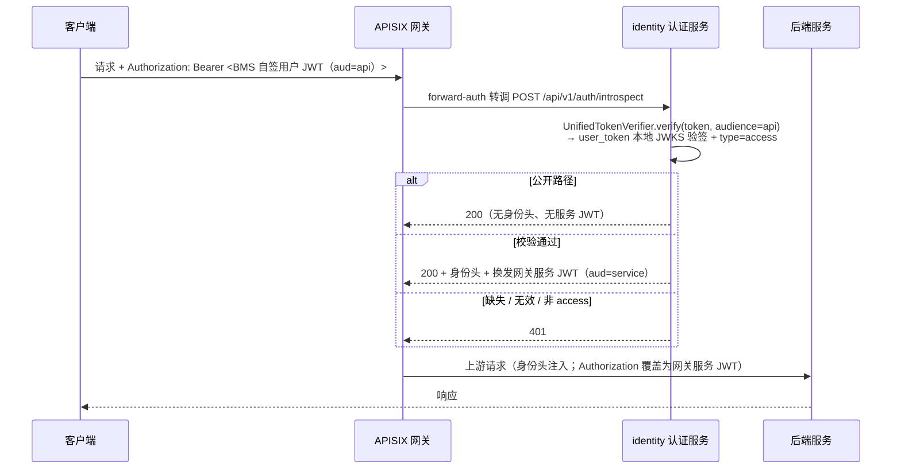

# 02 详细设计 · 用户令牌自签与网关校验源切换

> 认证与安全 · 01 认证与会话 · 子任务 02（需求 01-2）· 详细设计

[文档首页](../../../../../../文档首页.md) › [01 认证与会话](../01_认证与会话_02_用户令牌自签与网关校验源切换.md) › 详细设计　|　[← 任务](../01_认证与会话_02_用户令牌自签与网关校验源切换.md)　[需求 01-2 →](../../../../需求/01_需求_认证与会话.md#r01-2)

## 1. 设计目标与范围 <a id="goal"></a>

把用户 access / refresh 双 token 的签发方从外部 IdP（Keycloak）切到 **BMS 自签（identity 服务）**，并把统一校验器的 `aud=api` 校验源同步切到本地 JWKS：

1. **用户令牌签发**——新增 `user_token` 能力域（契约 / 真实实现 / fail-closed Null / 工厂），identity 服务用本服务密钥签发 access（30 分钟）与 refresh（14 天，滚动轮换代次归 01_03），`aud=api`、`iss` 为 BMS；
2. **JWKS 合并发布**——`identity` 的 `GET /.well-known/jwks.json` 同时发布服务令牌与用户令牌公钥，`kid` 以用途前缀区分，组装期冲突即拒（fail-closed）；
3. **校验源切换**——`UnifiedTokenVerifier` 的 `aud=api` 分支由 IdP JWKS 切到本地用户令牌 JWKS（不再依赖外部 IdP），网关 `forward-auth`（`/api/v1/auth/introspect`）链路与身份头换发**保持不变**；
4. **口径回写**——架构 14 §2、架构 36、后端开发规范、部署发布规范与 Keycloak / APISIX 部署说明按「BMS 自签」回写；服务 JWT（`aud=service`）链路不动。

**不在本期**：登录 / 刷新 / 登出端点与会话落库（`01_03` / `01_04`）、登录态依赖与租户解析（`01_05`）、外部 IdP 的 SSO 授权码链路（`02_01` ~ `02_06`）、生产密钥分发与轮换演练（运维 / K8s 阶段）、`X-User-Id` 内部数字 id 填充（等外部身份映射）。

**安全影响（SDL）**：涉及用户凭据载体（长时 refresh）与校验源切换——专项验收点：签名算法仅非对称白名单、私钥不入库 / 不入镜像 / 不落日志、refresh 不得当 access 用（类型强校验）、`aud` 隔离保持、JWKS 只含公钥且 kid 无歧义、外部 IdP 失效不影响本地校验。

### 1.1 现状与缺口 <a id="gap"></a>

```text
backend/libs/bms_core/src/bms_core/
├── security/                  # 01_01：通用安全原语（PBKDF2 / JwtTokenCodec / DefaultSessionSecurity）
│   └── jwt.py                 #   JwtTokenCodec：通用编解码（claims 由调用方给，aud/iss 不绑业务值）
├── oauth/
│   ├── token.py               # 服务 JWT 契约（TOKEN_AUDIENCE_API / service、ServiceTokenSpec、BaseServiceTokenIssuer）
│   ├── keys.py                # TokenKey / build_jwks / to_key_set（服务 JWT 密钥工具，可复用）
│   ├── jwt.py                 # JwtServiceTokenIssuer（aud=service 自签；无用户令牌能力）
│   ├── verify.py              # UnifiedTokenVerifier：service → 本地 JWKS；api → IdP JWKS（identity_provider）
│   └── null.py                # NullServiceTokenIssuer / NullTokenVerifier
└── services/identity/src/bms_identity/api/
    ├── auth.py                # /auth/introspect（forward-auth；用 UnifiedTokenVerifier 按 aud=api 校验）
    └── wellknown.py           # /.well-known/jwks.json（当前只发布 service_token 公钥）
```

缺口：① 用户 access / refresh 仍由 Keycloak 签发（本地登录与超管应急通道受制于外部 IdP）；② 统一校验器 `api` 分支依赖 `[identity_provider]`（IdP 不可达 → 503，本地登录无法独立）；③ JWKS 只发布服务令牌公钥，用户令牌无密钥体系与发布口径；④ 需求 01-2 拍板的「BMS 自签 + 校验源切换」在基座层无落点。消费方现状：`UnifiedTokenVerifier` 的消费方为 identity `introspect`（网关链路）与装配工厂 → 构造函数替换在本任务内收敛。

## 2. 交付物清单 <a id="deliver"></a>

```text
backend/libs/bms_core/src/bms_core/
├── oauth/
│   ├── user_token.py          # 新：用户令牌常量 + UserTokenSpec / UserTokenPair + BaseUserTokenIssuer + get_user_token_issuer
│   ├── user_jwt.py            # 新：JwtUserTokenIssuer（含 kid 前缀校验）+ JwtUserTokenIssuerFactory
│   ├── keys.py                # 改：merge_jwks（多 JWKS 文档合并、kid 冲突即拒、确定性排序）
│   ├── null.py                # 改：NullUserTokenIssuer（fail-closed）
│   ├── verify.py              # 改：UnifiedTokenVerifier api 分支切 user_token；_from_claims 兼容 type / tenant_id
│   ├── base.py                # 改：域说明（用户令牌自签）
│   └── __init__.py            # 改：域说明
├── core/
│   ├── config.py              # 改：UserTokenSettings（provider / issuer）+ Settings.user_token
│   └── assembly.py            # 改：PLUGIN_WIRINGS 增 user_token；register_plugin("user_token", "jwt", …)
├── api/deps.py                # 改：导出 get_user_token_issuer
└── services/identity/src/bms_identity/api/
    └── wellknown.py           # 改：JWKS 合并发布（service_token + user_token）
config.toml                    # 改：[user_token] 选择段
deploy/.env.example            # 改：用户令牌密钥 kid 前缀示例（usr-k1；服务令牌推荐 svc-*）

backend/libs/bms_core/tests/core/test_config.py                     # 改：断言 [user_token] 默认口径
backend/services/identity/tests/oauth/
├── test_user_token.py         # 新：签发 / claims / 类型强校验 / 轮换 / 前缀 / 失败分支 / Null / 工厂
├── test_token_verifier.py     # 改：api 分支切本地（IdP mock 用例退役为本地用例）
└── test_wellknown_jwks.py     # 改：合并发布 / 冲突 503 / 空集
backend/services/platform/tests/crosscut/test_plugin_registration.py # 改：_EXPECTED_PLUGIN_KEYS 增 user_token

bms文档/
├── 后端基类清单.md                                    # 改：oauth 行补 user_token 域；§10 继承链
├── 设计/架构设计/04_架构设计_后端基础类体系.md          # 改：oauth 能力域登记（用户令牌自签）
├── 设计/架构设计/14_架构设计_子系统_认证与会话.md        # 改：§2 签发方（BMS 自签 / JWKS 分发）
├── 设计/架构设计/36_架构设计_子系统_API网关与边缘.md     # 改：边缘认证（用户 JWT 校验源）
├── 规范/后端开发规范.md                                # 改：双类 JWT 强制条按自签口径回写
├── 规范/部署发布规范.md                                # 改：密钥与 JWKS 条扩为用户 / 服务双类
├── 资料/开发服务器/linux/Keycloak部署使用说明.md        # 改：不再承担本地用户令牌签发
├── 资料/开发服务器/linux/APISIX部署使用说明.md          # 改：网关认证接线校验源口径 + 本任务冒烟记录
└── 项目/06_认证与安全/…
    ├── 计划/01_计划_认证与安全.md                      # 改：§1 台账 / §2 已完成 / §3 移除 01_02 / §4 甘特
    ├── 任务/01_认证与会话/01_认证与会话.md              # 改：子任务表状态与完成日期
    └── 任务/…_02_…/                                  # 改：任务状态 / 完成日期 + 实施 / 测试记录

test/scripts/kiwi/cases|exports/…                      # 新：本任务用例登记输入与回读
```

## 3. 接口 / 契约与边界 <a id="contract"></a>

### 3.1 能力域与插件键 <a id="domains"></a>

| 能力域（插件键） | 端口基类 | 真实实现（`plugin_name`） | Null 实现 | 契约版本 | 配置分区 |
| --- | --- | --- | --- | --- | --- |
| `user_token` | `BaseUserTokenIssuer` | `JwtUserTokenIssuer`（`jwt`） | `NullUserTokenIssuer`（fail-closed） | `0.1.0` | `[user_token]` + `[security]` |

继承链（固定前三段 + 域中间层）：`BaseObject` → `BaseCapability` → `BasePluggable` → `BaseUserTokenIssuer`（端口；`key = plugin_key = "user_token"`）→ 真实 / Null 实现。与相邻域分工：`security/token_codec`（通用编解码原语，claims 由调用方给）、`oauth/service_token`（服务 JWT 自签）、`idp`（外部身份源客户端）各不重叠；本域承载**用户双 token 的业务语义**（受众 / 类型 / 时长 / 会话 id）。

### 3.2 契约签名 <a id="bases"></a>

```python
# oauth/user_token.py
USER_TOKEN_KID_PREFIX = "usr-"          # 用户令牌密钥 kid 前缀（与服务令牌区分用途）
USER_TOKEN_TYPE_ACCESS = "access"
USER_TOKEN_TYPE_REFRESH = "refresh"
DEFAULT_USER_TOKEN_ISSUER = "bms"

@dataclass(frozen=True)
class UserTokenSpec(BaseObject):
    subject: str                         # 用户主体（本地登录为内部用户标识；SSO 为映射后主体）
    session_id: str                      # 会话 id（雪花；access 与 refresh 的 jti 同值）
    tenant_id: str | None = None         # 租户编码（可选）
    scopes: tuple[str, ...] = ()         # 授权范围（可选；SSO 映射或后续 RBAC 权限码）

@dataclass(frozen=True)
class UserTokenPair(BaseObject):
    access_token: str
    refresh_token: str
    token_type: str = "Bearer"
    expires_in: int = 0                  # access 有效期（秒）
    refresh_expires_in: int = 0          # refresh 有效期（秒）
    session_id: str = ""                 # 会话 id（= jti，回显供调用方落会话记录）
    scopes: tuple[str, ...] = ()

class BaseUserTokenIssuer(BasePluggable, ABC):
    key: str = "user_token"
    plugin_key: str = "user_token"

    @abstractmethod
    async def issue_pair(self, spec: UserTokenSpec) -> UserTokenPair: ...
    @abstractmethod
    def jwks(self) -> Mapping[str, object]: ...
    @abstractmethod
    def verify(self, token: str, *, expected_type: str) -> IdentityClaims: ...

def get_user_token_issuer(request: Request) -> BaseUserTokenIssuer: ...
```

- `issue_pair` 异步（与服务 JWT `issue` 同形，为将来远程签发 / KMS 留位）；`verify` 同步（本地验签，无外呼）；`jwks` 同步（内存文档）。
- `verify` 的 `expected_type` **必填**（无默认值）：调用方必须显式声明期望类型（网关链路传 `access`，01_03 刷新端点传 `refresh`），杜绝「拿 refresh 当 access」的默认放行。
- 提供者经 `app/api/deps.py` 统一导出（`get_user_token_issuer`）。

### 3.3 真实实现口径 <a id="impl"></a>

**claims 固定契约（`JwtUserTokenIssuer`，`oauth/user_jwt.py`）**：

| claim | 取值 | 说明 |
| --- | --- | --- |
| `iss` | `[user_token].issuer`（默认 `bms`） | 签发方（BMS；可配稳定 URI） |
| `sub` | `spec.subject` | 用户主体（非空必填） |
| `aud` | `api`（`TOKEN_AUDIENCE_API`） | 用户受众（常量；服务令牌 `aud=service` 与之隔离） |
| `jti` | `spec.session_id` | 会话 id（access 与 refresh 同值；与 `sys_session` / Redis 会话标记口径一致） |
| `type` | `access` / `refresh` | 令牌类型（按需求与架构 14 口径用 `type`，非 `typ`） |
| `tenant_id` | `spec.tenant_id`（可选） | 租户编码（有则写） |
| `scope` | `" ".join(spec.scopes)`（可选） | 授权范围（有则写；空格分隔） |
| `iat` / `exp` | 签发时刻 / +TTL | access = `[security].access_token_expire_minutes` × 60（30 分钟）；refresh = `[security].refresh_token_expire_days` × 86400（14 天） |

构造：`JwtUserTokenIssuer(*, issuer, keys, active_kid="", access_ttl, refresh_ttl, algorithms=RS256/ES256, leeway=30)`；复用 `oauth/keys.py` 的 `TokenKey` / `to_key_set` / `build_jwks`（与 `JwtServiceTokenIssuer` 同引擎、同算法白名单、同容差）。

- **kid 前缀强校验**：构造时逐个校验密钥 `kid` 以 `usr-` 开头，违者 `ConfigError`（40001，拒绝装配）——`kid` 在 JWKS 中区分用途；服务令牌密钥（`[service_token].keys`）不受影响、kid 规则不变（推荐 `svc-*` 写入部署说明，不作强制）。
- **签发选键**：`active_kid` 优先；单私钥自动；多私钥未指定 / `active_kid` 未命中 / 无私钥 → `ConfigError`（与 `JwtServiceTokenIssuer` 同口径）。
- **`issue_pair` 入参校验**：`subject` / `session_id` 去空后为空 → `ParamError`（10001）；一次调用签出 access 与 refresh 两枚同 `jti` 票据。
- **`verify(token, expected_type)`**：`verify_jwt(token, key_set, issuer, audience=api, algorithms, leeway)` 全校验签名 / `exp` / `iss` / `aud`，再校验 `type == expected_type`、`sub` 与 `jti` 非空；任一不满足 → `AuthError`（20001，不对外区分原因）；密钥集为空时选键失败 → `AuthError`（fail-closed）。
- **密钥轮换**：多把 `usr-*` 公钥并行验签（旧 `kid` 票据在轮换期仍通过），签发只用 `active_kid`；密钥集空集允许构造（校验方只需公钥、签发时才拒，沿用 01_01 装配边界口径）。

**Null 实现（`oauth/null.py::NullUserTokenIssuer`）**：`issue_pair` 抛 `ConfigError`；`verify` 抛 `AuthError`；`jwks` 返回 `{"keys": []}`——与安全原语 Null 同为 fail-closed（配置缺失不误放行）。

**JWKS 合并（`oauth/keys.py::merge_jwks`）**：

```python
def merge_jwks(*documents: Mapping[str, object]) -> dict[str, object]:
    # 逐文档取 keys；按 kid 归并；重名即 raise ConfigError；输出按 kid 排序（确定性）
```

`identity` 的 `/.well-known/jwks.json` 改为 `merge_jwks(service_token.jwks(), user_token.jwks())`：同一端点发布两类公钥（`usr-*` / `svc-*` 由 kid 自证用途），只含公钥；文档结构非法或 kid 冲突 → `ConfigError` → 端点返回 503（fail-closed，不含半份文档）；两域均未接真实实现 / 无密钥时返回 `{"keys": []}`。

### 3.4 端到端链路（校验源切换后） <a id="flow"></a>



- **职责边界不变**：网关边缘强制与传输层替换、identity 票据校验与身份声明、后端只做信任判定与授权——本次只把 identity 的 `api` 校验源从「外部 IdP JWKS」换成「本地用户令牌 JWKS」，网关生成件与 `forward-auth` 配置**零改动**。
- **隔离保持**：用户令牌（`aud=api`）以 `service` 期望校验时，本地服务 JWKS 按 `kid` 选键失败 / `aud` 不符 → 拒；服务令牌（`aud=service`）以 `api` 期望校验时，本地用户 JWKS 选键失败 / `aud` 不符 → 拒。
- **外部 IdP 解耦**：`api` 分支不再解析 `[identity_provider]`；`[identity_provider]` 保留给 SSO 授权码流程（域 02），IdP 故障不再影响本地登录与超管应急通道。

### 3.5 校验内核改造（`oauth/verify.py`） <a id="verifier"></a>

| 项 | 现状 | 变更 |
| --- | --- | --- |
| `UnifiedTokenVerifier.__init__` | `service_issuer` + `identity_provider` | `service_issuer` + `user_token_issuer` |
| `api` 分支 | `await identity_provider.verify_token(token, audience=api)` | `user_token_issuer.verify(token, expected_type=USER_TOKEN_TYPE_ACCESS)`（本地、无外呼） |
| `_from_claims` 类型读取 | `payload["typ"]` | `payload["type"] or payload["typ"]`（兼容两类；服务令牌读数不变） |
| `_from_claims` 租户读取 | `payload["tenant"]` | `payload["tenant_id"] or payload["tenant"]`（用户读 `tenant_id`、服务读 `tenant`） |
| 工厂依赖 | 解析 `service_token` + `identity_provider` | 解析 `service_token` + `user_token`（`token_verifier` 不再依赖 IdP 配置） |
| 失败语义 | IdP 不可达 → `ServiceUnavailableError` | `api` 分支不再外呼（该异常不再由本分支产生）；`AuthError` / `ParamError` 语义不变 |

`VerifiedToken` 契约不变（`token_type` / `tenant` 字段承载归一后的类型与租户），消费方（`introspect` 身份头换发）零改动。

### 3.6 配置契约 <a id="config"></a>

```toml
[user_token]
# 用户令牌自签实现选择（插件化配置；空串 = null 占位 fail-closed；jwt = joserfc 真实自签）
provider = "jwt"
# 自签签发方（用户 JWT 的 iss；与服务令牌同源标识，可配稳定 URI）
issuer = "bms"
```

| 配置键 | 环境变量 | 定稿口径 |
| --- | --- | --- |
| `[user_token].provider` | `BMS_USER_TOKEN__PROVIDER` | 默认 `jwt`；空串回落 Null（fail-closed） |
| `[user_token].issuer` | `BMS_USER_TOKEN__ISSUER` | 默认 `bms`（与服务令牌同值，可配） |
| `[security].keys` | `BMS_SECURITY__KEYS` | 用户令牌签名密钥集（kid 必带 `usr-` 前缀）；私钥只走环境变量 / Secret |
| `[security].active_kid` | `BMS_SECURITY__ACTIVE_KID` | 当前签名密钥 kid（多把私钥时必填） |
| `[security].access_token_expire_minutes` | `BMS_SECURITY__ACCESS_TOKEN_EXPIRE_MINUTES` | **30**（access TTL 来源，01_01 已定稿） |
| `[security].refresh_token_expire_days` | `BMS_SECURITY__REFRESH_TOKEN_EXPIRE_DAYS` | **14**（refresh TTL 来源，01_01 已定稿） |

- `UserTokenSettings(PluginSelection)`（`issuer`）；`Settings.user_token`；`PLUGIN_WIRINGS` 增 `PluginWiring("user_token", BaseUserTokenIssuer, "user_token", "user_token")`；`register_platform_plugins` 增 `register_plugin("user_token", "jwt", JwtUserTokenIssuerFactory(settings))`。
- `deploy/.env.example`：用户令牌示例 kid 改 `usr-k1`（`BMS_SECURITY__ACTIVE_KID=usr-k1`）；服务令牌示例注释推荐 `svc-k1`（不强制，07_02 配置不变）。
- `[tenant]` / `[edge]` 豁免路径、网关生成件、契约快照**均无变更**。

### 3.7 失败分支与错误语义 <a id="failures"></a>

| 场景 | 行为 |
| --- | --- |
| 用户令牌签发：`subject` / `session_id` 为空 | `ParamError`（10001，调用方入参非法） |
| 用户令牌签发：keys 为空 / `active_kid` 未命中 / 无私钥 | `ConfigError`（40001；构造不拒、签发才拒） |
| 用户令牌密钥 kid 无 `usr-` 前缀 | 构造即 `ConfigError`（40001，拒绝装配） |
| JWKS 合并：两域 kid 重名 / 文档结构非法 | `ConfigError` → `/.well-known/jwks.json` **503**（fail-closed，不发半份文档） |
| `verify`：签名不符 / 过期 / `iss` 不符 / `aud` 不符 / 未知 kid / 算法非白名单 | `AuthError`（20001 / 401，不对外区分原因） |
| `verify`：`type` 与 `expected_type` 不符（refresh 当 access / access 当 refresh） | `AuthError`（20001 / 401） |
| `verify`：`sub` / `jti` 缺失 | `AuthError`（20001 / 401） |
| `[user_token].provider` 空（null 实现） | `issue_pair` → `ConfigError`；`verify` → `AuthError`（fail-closed） |
| 外部 IdP 不可达 / 停用 | 本地签发与校验不受影响（`api` 分支不解析 `[identity_provider]`） |
| 网关 `forward-auth` 链路 | 不变：无凭证 / 无效 → 401；认证服务不可达 → `status_on_error: 503`（fail-closed） |
| 达梦 / 三库方言 | 不涉及（令牌签发校验不直连数据库） |

## 4. 兼容性与消费方影响 <a id="compat"></a>

- **`UnifiedTokenVerifier` 构造签名变更**：`identity_provider` → `user_token_issuer`；消费方为装配工厂与测试（`test_token_verifier.py` 改造），**零业务消费方**。
- **`_from_claims` 读取兼容**：`type`/`typ`、`tenant_id`/`tenant` 双读，服务令牌（`typ=service` / `tenant`）归一结果不变。
- **`oauth/null.py` 新增 `NullUserTokenIssuer`**：随模块导入自动登记；`oauth` 既有 Null 契约不变。
- **`[security].keys` 消费方扩为两个**：`JwtTokenCodec`（通用原语）与 `JwtUserTokenIssuer`（用户令牌业务）；前者行为不变，后者新增 kid 前缀约束（配置尚未被真实部署消费，改造面可控）。
- **`token_verifier` 不再依赖 `[identity_provider]`**：本机默认配置（provider 空）也可解析真实统一校验器；SSO 域后续按需配置 IdP。
- **不改**：`oauth` 服务令牌链路（`BaseServiceTokenIssuer` / `JwtServiceTokenIssuer` / `[service_token]`）、网关生成件与 `apisix.yaml`、`deploy/keycloak/bms-realm.json`（SSO 演示保留 aud mapper）、identity `introspect` 端点契约与身份头、契约快照 `deploy/contracts/identity.json`、既有 Kiwi 用例号。

## 5. 测试设计与验收映射 <a id="test"></a>

用例**先登记 Kiwi TCMS 再编码**（本任务登记 1 条策展用例，编号以平台回读为准）。

| # | 用例 / 文件 | 断言要点 | 对应完成标准 |
| --- | --- | --- | --- |
| 1 | `services/identity/tests/oauth/test_user_token.py` | 签发往返：`issue_pair` 双票据 claims 完整（`iss` / `aud=api` / `sub` / `tenant_id` / `jti` 同值 / `type` / `scope` / `exp` / `iat`）；access=`expires_in` 1800、refresh=1209600（配置注入） | 本地签发双 token 可校验 |
| 2 | 同上 | 类型强校验：refresh 以 access 期望 / access 以 refresh 期望 / `type` 缺失 → `AuthError`；`sub` / `jti` 缺失 → `AuthError` | 拒绝分支齐全 |
| 3 | 同上 | 失败分支：过期 / 篡改 / 错签名 / `iss` 不符 / `aud` 不符 / 未知 kid → `AuthError`；`subject` / `session_id` 空 → `ParamError`；keys 空 / `active_kid` 未命中 / 无 `usr-` 前缀 → `ConfigError` | 伪造 `aud` / 过期 / 签名不符被拒 |
| 4 | 同上 | 轮换：两把 `usr-*` 密钥，旧 kid 票据在新集合下通过、未知 kid 拒绝、签发只用 `active_kid`；`jwks()` 只含公钥、按 kid 排序 | JWKS 可验服务与用户令牌 |
| 5 | 同上 | Null fail-closed（`issue_pair` `ConfigError` / `verify` `AuthError` / 空 JWKS / `BaseNullObject`）；工厂读 `[user_token].issuer` + `[security]` 密钥与 TTL；provider 空 → Null、默认 → 真实 | 依赖注入可解析 |
| 6 | `services/identity/tests/oauth/test_token_verifier.py` | `api` 分支本地校验：有效用户令牌 → `VerifiedToken`（`token_type=access` / `tenant`（源 `tenant_id`）/ scopes）；`aud` 隔离双向（用户令牌以 service 期望拒、服务令牌以 api 期望拒）；refresh 以 api 期望拒；`iss` 不符拒 | 校验源切换生效 |
| 7 | `services/identity/tests/oauth/test_wellknown_jwks.py` | 合并发布：同时含 `usr-*` 与 `svc-*` 公钥、无重复 kid、排序确定；kid 冲突 → 503；空集 → `{"keys": []}`；无统一响应包体、豁免租户 / 边缘 | JWKS 同时可验两类令牌 |
| 8 | `libs/bms_core/tests/core/test_config.py` | `[user_token]` 默认 `provider="jwt"` / `issuer="bms"`；`[security]` 口径回归（30 / 14） | 配置与文档一致 |
| 9 | `services/platform/tests/crosscut/test_plugin_registration.py` | `_EXPECTED_PLUGIN_KEYS` 与接线一致（`user_token` 在册）、Null 缺省登记 | 装配一致性 |
| 10 | 既有全量回归 | `pytest` / `ruff` / `pyright` / 契约快照 `check` / 基座校验全绿（网关生成件零漂移；`test_introspect.py` 不受影响） | 既有 forward-auth 用例回归全绿 |
| 11 | mjbk 真实冒烟（人工留痕） | 本机 identity 承载 + mjbk 网关：本地签发用户令牌经网关校验通过（身份头 + 网关服务 JWT）；伪造 `aud` / 过期 / 错签名 → 401；停止 Keycloak 后本地令牌仍通过；JWKS 端点合并公钥可达 | 经网关与 identity 校验通过；IdP 失效不影响 |

**验收映射**：需求 01-2「完成标准」四句逐条落在用例 1~6 / 7 / 3+11 / 10+11；`pytest`、`pyright`、`ruff`、契约门禁与基座校验全绿为准出门禁；新增模块（`oauth/user_token.py` / `oauth/user_jwt.py` / `wellknown.py` 变更）覆盖率 100%。

## 6. 登记落点 <a id="registry"></a>

| 内容 | 落点 |
| --- | --- |
| `user_token` 能力域条目（端口 / 实现 / Null / 数据契约 / 常量 / 提供者 / 状态） | 《[后端基类清单](../../../../../../后端基类清单.md)》oauth 行与 §10 继承链 |
| oauth 能力域登记（用户身份令牌自签语义） | 《[架构设计 · 后端基础类体系](../../../../../../设计/架构设计/04_架构设计_后端基础类体系.md)》 |
| 双 token 签发方（Keycloak → BMS 自签）与 JWKS 分发口径 | 《[架构设计 · 认证与会话](../../../../../../设计/架构设计/14_架构设计_子系统_认证与会话.md)》§2 |
| 边缘认证的用户 JWT 校验源（identity 自签 JWKS） | 《[架构设计 · API 网关与边缘](../../../../../../设计/架构设计/36_架构设计_子系统_API网关与边缘.md)》「边缘功能」节 |
| 双类 JWT 强制条（`api` 本地 JWKS、用户令牌经 `user_token` 基座签发） | 《[后端开发规范](../../../../../../规范/后端开发规范.md)》「架构铁律与依赖方向」节 |
| 密钥与 JWKS 检查项（用户 / 服务双类、kid 前缀、同端点发布） | 《[部署发布规范](../../../../../../规范/部署发布规范.md)》「身份源与密钥」节 |
| Keycloak 角色调整（不再承担本地用户令牌签发） | 《[Keycloak 部署使用说明](../../../../../../资料/开发服务器/linux/Keycloak部署使用说明.md)》「目的与适用范围」「验证」节 |
| 网关认证接线校验源与本任务冒烟记录 | 《[APISIX 部署使用说明](../../../../../../资料/开发服务器/linux/APISIX部署使用说明.md)》「声明式配置来源」「验证」节 |
| 任务 / 父任务 / 计划状态与工时 | 本任务文档、[父任务](../01_认证与会话.md)、[计划](../../../../计划/01_计划_认证与安全.md) |
| 消费方前置契约标注 | `01_03`（登录 / 刷新 / 登出：`issue_pair` + `verify(expected_type)` + 会话 id 口径）、`02_05`（ID Token 复用密钥体系）、`01_05`（登录态依赖消费 `VerifiedToken`） |
| Kiwi TCMS / 测试资产仓 | 登记本任务用例并回读编号；`test/scripts/kiwi/cases|exports/` 对应文件 |
| 实施 / 测试记录 | 本目录 `实施/`、`测试/` 各一份 |

## 7. 边界与开放项 <a id="boundary"></a>

- **归 01_03 / 01_04**：登录 / 刷新 / 登出端点、refresh 轮换与会话哈希比对、会话记录与 Redis 标记、踢出即时失效；本任务只交签发能力与校验源。
- **归 01_05**：`require_auth` 真实化与租户解析接线（消费本任务的 `VerifiedToken` 与 JWKS 分发）。
- **归 02_05**：BMS 兼作 IdP 的 ID Token / Discovery 复用用户令牌密钥体系（`kid` 代次与 `aud` 另立口径）。
- **归阶段十**：开放接口（Client Credentials）复用签发内核与密钥治理。
- **归运维 / K8s 阶段**：生产密钥生成 / 分发 / 轮换演练、K8s Secret、JWKS 端点网格化暴露。
- **开放项（kid 前缀强制面）**：用户令牌密钥强校验 `usr-` 前缀；服务令牌密钥不加约束（07_02 链路不动），仅以文档推荐 `svc-*` + 合并冲突检测兜底——若后续需要双向强制，随密钥治理阶段评估。
- **开放项（JWKS 缓存）**：合并文档每请求现算（内存字典，成本可忽略）；如后续分发量增大可加进程内缓存（不改契约）。
- **开放项（Keycloak 存量环境）**：`deploy/.env` 若已有用户令牌密钥（无 `usr-` 前缀）需按新口径改名；服务令牌密钥不受影响。

## 8. 对齐记录 <a id="align"></a>

| # | 事项 | 结论（2026-09-26 拍板） |
| --- | --- | --- |
| 1 | 签发能力落点 | 新增 `user_token` 能力域（镜像 `service_token`），identity 经依赖注入消费 |
| 2 | 配置归属 | `[user_token]` 选择段（provider / issuer）+ `[security]` 密钥与 TTL（01_01 定稿不动） |
| 3 | kid 与 JWKS | 用途前缀（用户 `usr-`、服务推荐 `svc-`）+ 合并期冲突检测 fail-closed |
| 4 | claims 口径 | `sub` / `tenant_id` / `jti` / `type=access|refresh`；`VerifiedToken` 归一层兼容读取 |
| 5 | 校验源 | `aud=api` 完全切本地 JWKS，不留 IdP 回退；`[identity_provider]` 保留给 SSO |
| 6 | 类型强校验 | `aud=api` 只接受 `type=access`；`expected_type` 必填供 01_03 校验 refresh |
| 7 | jti 语义 | access 与 refresh 同值 = 会话 id；轮换失效靠 `sys_session.refresh_token_hash`（01_04） |
| 8 | Keycloak 调整 | realm 文件与 aud mapper 保留，只回写文档口径（SSO 演示 / 测试仍用） |
| 9 | `iss` 默认 | `bms`（与服务令牌同值，可配稳定 URI） |
| 10 | scopes | `UserTokenSpec` 带可选 `scopes`，签发写 `scope`（缺省不写） |
| 11 | 任务边界 | 严格按任务文档：不含登录 / 刷新 / 登出端点与会话落库 |
| 12 | 验证深度 | 本机门禁 + mjbk 真机冒烟（本地令牌经网关、IdP 停用不影响） |
| 13 | 追加口径（设计对齐） | `verify` 的 `expected_type` 定为必填（防默认放行）；`issue_pair` 一次签双票据；kid 前缀在构造期强制（拒绝装配）而非使用期 |

> 详细设计定稿后按《[AI开发规范](../../../../../../规范/AI开发规范.md)》「单任务交付一条龙」自动续行：实施 → 测试（Kiwi 先登记）→ 验证 → 登记回写 → 记录 → 提交。
