# 03 实施 · 本地登录 / 刷新 / 登出链路

> 认证与安全 · 01 认证与会话 · 子任务 03（需求 01-3）· 实施记录

[文档首页](../../../../../../文档首页.md) › [01 认证与会话](../01_认证与会话_03_本地登录刷新登出链路.md) › 实施记录　|　[← 任务](../01_认证与会话_03_本地登录刷新登出链路.md)　[测试记录 →](../测试/01_测试_03_本地登录刷新登出链路.md)

## 1. 实施信息 

| 项 | 值 |
| --- | --- |
| 任务 | [03 本地登录 / 刷新 / 登出链路](../01_认证与会话_03_本地登录刷新登出链路.md) |
| 对应需求 | [01-3](../../../../需求/01_需求_认证与会话.md#r01-3) |
| 详细设计 | [03 详细设计](../设计/01_详细设计_03_本地登录刷新登出链路.md) |
| 实施日期 | 2026-09-26 |
| 实施人 | minjian |
| 实施环境 | 本地开发机（Python 3.14.4 / uv；fakeredis 2.38 单测替身）；mjbk 容器未随本任务重建（见 §6） |
| 提交 | 详细设计 `5307fa6a`；实施 / 测试 / 登记回写 / 记录随本次提交 |
| 结论 | 完成（16 项决策全按确认执行；新增 / 变更模块语句覆盖率 100%，含 3 处分支部分覆盖；设计层无偏差，唯真机冒烟按 §6 归口） |

```mermaid
flowchart LR
    A["bms_core：会话存储 Redis/Memory + build_session_key + 黑名单"] --> B["bms_core：限流 Redis/Memory + reset + 降级"]
    B --> C["bms_core：require_service + ServiceRequest.tenant + 错误码 20002~20004"]
    C --> D["sys_user / sys_session 表文件 + 总览登记 + 表归属 + 模型 + 迁移"]
    D --> E["org：凭据服务 + 仓储 + 内部端点（require_service）"]
    E --> F["identity：会话仓储 + org 客户端 + 登录/刷新/登出编排 + 端点"]
    F --> G["配置：service_client / session_store / rate_limiter / [login] + conftest 置空"]
    G --> H["契约快照 + 前端 api-types 重生成"]
    H --> I["测试 + 门禁 + 登记回写"]
```

## 2. 实施概览 

## 3. 实施过程 

1. **会话存储基座（`bms_core/session/`）**：`BaseSessionStore` 契约扩展 `tenant` 入参与黑名单方法（`blacklist` / `is_blacklisted`，键由 `BaseSessionSecurity.blacklist_key` 派生）；新增 `build_session_key`（`bms:{租户}:sess:{会话 id}`）、真实 `RedisSessionStore`（JSON + TTL、读取异常降级未命中）与 `MemorySessionStore`；Null 实现补齐新契约方法。
2. **限流基座（`bms_core/ratelimit/`）**：`BaseRateLimiter` 增 `reset`（成功路径清零）；新增真实 `RedisRateLimiter`（固定窗口 `INCR`+`EXPIRE`，Redis 异常降级 `MemoryRateLimiter`）与 `MemoryRateLimiter`；装配登记 `rate_limiter` / `session_store` 的 `redis` / `memory` 实现。
3. **入站服务身份依赖（`bms_core/api/base.py`）**：新增 `require_service(*allowed)` 依赖工厂——从 `Authorization: Bearer` 取令牌、`UnifiedTokenVerifier` 按 `aud=service` 全校验、校验签发方 `sub` 在白名单内；拒用户票据与网关服务票据（`sub=gateway`）。
4. **服务间调用租户透传（`bms_core/servicecall/`）**：`ServiceRequest` 增 `tenant` 字段，`HttpServiceClient` 签发服务 JWT 时带 `ServiceTokenSpec.tenant`。
5. **错误码（`bms_core/core/`）**：新增 `LOGIN_FAILED=20002` / `ACCOUNT_LOCKED=20003` / `ACCOUNT_DISABLED=20004` 与对应异常（`AuthError` 子类，HTTP 401）。
6. **数据库（《数据库开发规范》顺序）**：先建表文件 `sys_user.md` / `sys_session.md` 并在总览登记 → 表归属登记（`sys_user` 新增 org/TENANT/enabled；`sys_session` 由 planned 转 enabled）→ ORM 模型（`SysUser` / `SysSession`）→ Alembic 迁移（`org:tenant` `0001_sys_user`、`identity:tenant` `0001_sys_session`，含 `alembic.ini` 两个配置段）→ 回写状态两处；`test_alembic_chains` / `test_auto_create_tables` / `test_table_registry` 断言随新链与反例同步更新。
7. **org 内部凭据接口**：新增 `sys_user` 仓储 + `CredentialService`（`verify` 常量时间校验 + `needs_rehash` 同事务重哈希回写、`update_password` 写新哈希与历史、`apply_login_state` 成功清零 / 失败计数 / 锁定）+ 三端点 `/api/v1/org/internal/credentials/{verify,update-password,login-state}`，模块级 `require_service("identity")`，租户由服务 JWT claim 经全局租户中间件解析；计入公开契约。
8. **identity 登录链路**：新增 `SysSession` 仓储、`OrgCredentialClient`（经 `service_client` 调 org，非 2xx / 契约非法一律 `ServiceUnavailableError` fail-closed）、`LoginService`（登录：限流 → 验证码按策略 → org 校验 → 双 token 签发 → `sys_session` + Redis 标记 → 登录态写回；失败计数经限流基座累计、达阈值联动 `sys_user.locked_until`；刷新：验签 / 租户 / 黑名单 / 标记 / 记录 / 哈希比对 → 同会话 id 轮换；登出：黑名单 + `revoked_at` + 删标记，幂等）+ 端点 `/auth/login` `/auth/refresh` `/auth/logout`（access 在体、refresh 走 httpOnly cookie；登录租户请求上下文优先、body 指定经租户源校验后生效）。
9. **配置**：基线 `config.toml` 置 `[service_client] provider="http" + attach_service_token=true`、`[session_store]/[rate_limiter] provider="redis"`、新增 `[login]`（阈值 / 窗口 / `cookie_secure`）；`config.dev.toml` 关 `cookie_secure` 支持本地 http 联调；各服务测试套 `conftest` 显式置空 `BMS_SERVICE_CLIENT__PROVIDER` / `BMS_SESSION_STORE__PROVIDER` / `BMS_RATE_LIMITER__PROVIDER`（同 metrics / tracer 既有模式）。
10. **生成件**：`ops.contract_snapshot export` 重生成 `deploy/contracts/identity.json` / `org.json`（纯新增端点）；前端 `pnpm run api-types:gen` 重生成 9 份类型（identity / org 更新），零漂移校验通过。
11. **登记回写**：《后端基类清单》限流 / 会话存储 / 认证链路三处条目；《架构设计 · 接口与集成》错误码码位补 `20002~20004`；《架构设计 · 认证与会话》双 token 刷新 / 登出回写；《概要设计 · 会话管理》会话错误码避让至 `20011~20016`；数据库设计总览登记两表；计划 / 父任务 / 任务状态与工时。
12. **验证**：`uv run pytest -q` → **1431 passed / 37 skipped**；新增 / 变更模块 `--cov-branch` 语句覆盖率 100%（3 处分支部分覆盖）；`ruff check` / `ruff format --check` / `pyright` 全绿；`contract_snapshot check` / `gateway_config check` / `event_contracts check` / `api-types gen:check` / `check-backend-base` / `check-base` / `ops.check_tables` / `preflight --fast` 全绿。

## 4. 问题与处置 

| # | 问题 / 现象 | 原因 | 处置与落点 |
| --- | --- | --- | --- |
| 1 | 插件注册表构建失败：`(rate_limiter, memory) 重名` 等 4 条 | 新增实现类显式声明 `plugin_name` 且构造零参 → 被注册表自动收集，与显式工厂登记重复 | 实现类不声明 `plugin_name`（由工厂携带），与 `RedisCacheRegion` 既有口径一致 |
| 2 | 会话存储「同会话 id 跨轮换」与 `load(session_id)` 无租户维度无法定位键 | `BaseSessionStore.load` 无租户入参，键含租户段 | 契约扩展 `save` / `load` / `delete` 增 `tenant` 入参（显式优先、`save` 可从负载回落）；同步更新 Null / Memory / Redis |
| 3 | 服务层「读后写」触发 `A transaction is already begun on this Session` | 自动开启事务与 `BaseTransactionalService.update` 的显式 `begin()` 冲突 | 凭据服务改在单个 `async with uow.begin()` 内完成读 + 写（`LoginService.refresh` / `logout` 同）；不继承 `BaseTransactionalService`，改继承 `BaseService` 并显式持工作单元 |
| 4 | 登录失败第 5 次返回 20002 而非锁定 20003 | 限流 `check` 在 `count == limit` 时仍 `allowed=True`，`not allowed` 判定滞后一次 | `_record_failure` 改以 `remaining == 0` 判定锁定（`count >= limit` 即锁） |
| 5 | httpx 手动设置 refresh cookie 不随请求发送（重放 / 异常分支用例失效） | `client.cookies.set(domain=...)` 在本环境不被匹配发送 | 测试改以请求头 `Cookie` 显式携带（`headers={"Cookie": ...}`）并清空 cookie jar |
| 6 | `check-backend-base` 报 4 个直接继承 `BaseObject` 的类未登记 | 清单对账要求所有直接继承 `BaseObject` 的类出现在《后端基类清单》 | 认证链路四个类（`LoginService` / `OrgCredentialClient` / `LoginOutcome` / `RefreshOutcome`）在清单新增「本地登录 / 刷新 / 登出」条目登记 |

## 5. 验证结果 

| 项 | 方法 | 结果 |
| --- | --- | --- |
| 单元 / 集成全量 | `cd backend && uv run pytest -q` | 1431 passed，37 skipped |
| 新增 / 变更模块覆盖率 | `--cov=bms_core.session --cov=bms_core.ratelimit --cov=bms_identity.*auth/session --cov=bms_org.*credentials/user/internal --cov-branch` | 语句 100%（0 未覆盖）；分支 3 处部分（限流 / 会话 Redis 降级收尾、登录 IP 维度缺省） |
| 静态检查 | `uv run ruff check .` / `ruff format --check .` | All checks passed / 764 files already formatted |
| 类型检查 | `uv run pyright` | 0 errors / 0 warnings |
| 契约与生成件 | `ops.contract_snapshot check` / `ops.gateway_config check` / `ops.event_contracts check` / api-types `gen:check` | 全绿（identity / org 快照与前端类型零漂移） |
| 基座与预检 | `check-backend-base.py` / `check-base.py` / `ops.check_tables.py` / `check-preflight.py --fast` | 全绿 |
| ASGI 端到端（单测内） | 登录 → 刷新 → 登出；五类错误分支；org 直连伪造拒绝 | 通过（见测试记录） |

## 6. 偏差与遗留 

- **偏差**：
  1. 会话错误码由概要 14 原表 `20001~20006` 避让至 `20011~20016`（架构 09 已发布 `20001` 认证失效、`20101~20103` 验证码；登录类占 `20002~20004`）——已回写概要 14 §7 与架构 09「平台已发布码位」，需求 01-3 文本保持高层描述、以详细设计为准。
  2. `BaseSessionStore` 契约扩展（`tenant` 入参 + `blacklist` / `is_blacklisted` + `build_session_key`）为 01_04 会话管理与踢出提供统一出口；`BaseRateLimiter` 增 `reset`。
  3. `LoginService` 继承 `BaseService` 并显式持工作单元（而非 `BaseTransactionalService`），因「读后写 + 业务失败需回滚」语义（见 §4-3），已在实现注释与《后端基类清单》条目说明。
- **遗留**：
  1. 会话列表 / 详情 / 强制踢出 / 多端上限、`session.revoked` 广播占位（**归口：01_04**）。
  2. `require_auth` 真实登录态与每请求会话标记校验、租户解析接线（**归口：01_05**）。
  3. 验证码真实出题与连续失败强制分支、密码复杂度 / 有效期 / 历史策略、三型锁定与解锁审计（**归口：域三 03_04 / 03_05 / 03_07**）。
  4. `sys_login_log` 落库（异步 + 哈希链）、`session.revoked` 实时广播（**归口：阶段八**）。
  5. 登录响应的权限码 / 菜单概要（**归口：阶段七 RBAC**）。
  6. 真机容器冒烟（重建 identity / org 镜像 + 服务 JWT 密钥 + `sys_user` 种子）（**归口：01_04 / 01_05 或部署窗口**）——本期以 ASGI 端到端与单元 / 服务层用例覆盖。
  7. 生产密钥生成 / 分发 / 轮换与 `attach_service_token` 生产开启后的联调（**归口：运维 / K8s 阶段**）。

> 本文档依《[文档生成规范](../../../../../../规范/文档生成规范.md)》编写
