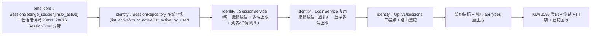

# 04 实施 · 会话管理与强制踢出

> 认证与安全 · 01 认证与会话 · 子任务 04（需求 01-4）· 实施记录

[文档首页](../../../../../../文档首页.md) › [01 认证与会话](../01_认证与会话_04_会话管理与强制踢出.md) › 实施记录　|　[← 任务](../01_认证与会话_04_会话管理与强制踢出.md)　[测试记录 →](../测试/01_测试_04_会话管理与强制踢出.md)

## 1. 实施信息 

| 项 | 值 |
| --- | --- |
| 任务 | [04 会话管理与强制踢出](../01_认证与会话_04_会话管理与强制踢出.md) |
| 对应需求 | [01-4](../../../../需求/01_需求_认证与会话.md#r01-4) |
| 详细设计 | [04 详细设计](../设计/01_详细设计_04_会话管理与强制踢出.md) |
| 实施日期 | 2026-09-26 |
| 实施人 | minjian |
| 实施环境 | 本地开发机（Python 3.14.4 / uv；SQLite 租户库 + fakeredis 替身）；mjbk 容器未随本任务重建（见 §6） |
| 提交 | 详细设计 `e6394d19` / 设计回写 `45d92fa4`；实施 / 测试 / 登记回写 / 记录随本次提交 |
| 结论 | 完成（14 项决策全按确认执行；新增 / 变更模块语句覆盖率 100%；设计层偏差 2 项已回写 / 登记） |

## 2. 实施概览 

## 3. 实施过程 

1. **配置与错误码（`bms_core/core/`）**：新增 `SessionSettings`（`[session].max_active`，默认 5）并挂 `Settings.session`；`error_codes.py` 增 `SESSION_NOT_FOUND=20011` / `SESSION_EXPIRED=20012` / `SESSION_REVOKED=20013` / `SESSION_SELF_KICK=20014` / `SESSION_LIMIT=20015` / `SESSION_FORBIDDEN=20016`；`exceptions.py` 增 `SessionError(AuthError)` 子段基与三子类（20011/404、20012/200、20013/200）。
2. **仓储（`bms_identity/repositories/session.py`）**：新增 `list_active`（在线分页 + user_id 精确 / device / ip 模糊 / 登录时间闭区间）、`count_active`（同口径总数）、`list_active_by_user`（按 `login_at ASC` + `id ASC`，多端上限作废最旧）与私有 `_active_conditions`（未撤销 + 未过期 + 可选筛选）。
3. **会话服务（`bms_identity/services/session.py`）**：`SessionService`（`BaseObject`）+ `SessionRevokeResult`（frozen dataclass）；统一撤销原语 `revoke`（三态：不存在 / 已撤销 / 本次撤销，幂等不重复写）、多端上限 `enforce_max_active`（`len - max_active + 1` 个最旧作废）、管理编排 `list_sessions` / `detail` / `kick`；`session.revoked` 广播经 `BaseRealtimePublisher.emit(RealtimeEvent(...))` 占位；结构化日志记动作 / 租户 / 操作者 / 结果。
4. **事务边界**：读 + 写在同一工作单元内（避免「读后写」触发会话重复开启事务），Redis 清理与广播移到提交后（见 §4-1）。
5. **登录链路（`bms_identity/services/auth.py`）**：`LoginService` 增 `session_settings` / `realtime_publisher` 入参并内部构造 `SessionService`；登录成功后（签发双 token 后、建会话前）调 `enforce_max_active`；`logout` 改为复用统一撤销原语（尽力而为 + 幂等，语义不变）。
6. **会话端点（`bms_identity/api/session.py` + `router.py`）**：`GET /api/v1/sessions`、`GET /api/v1/sessions/{session_id}`、`POST /api/v1/sessions/{session_id}/kick`；模块级 `require_auth`，端点级 `require_permission("session:query"/"session:kick")`（permission Null = RBAC 前平台超管口径）；`get_tenant` 缺失抛 `AuthError`（20001/401）。
7. **生成件**：`ops.contract_snapshot export` 重生成 `deploy/contracts/identity.json`（纯新增三端点，+434 行）；前端 `pnpm --filter @bms/api-types gen` 重生成 `identity.ts`，`gen:check` 零漂移。
8. **测试（Kiwi 2195 先登记）**：`tests/auth/` 新增 `session_helpers.py`（登录建会话 + 直连播种 + 替身装配）、`test_sessions.py`（列表 / 筛选 / 分页 / 详情 / 租户缺失）、`test_session_kick.py`（即时性 / refresh 失效 / 幂等 20013 / 20011 / 隔离 / 租户缺失）、`test_session_limit.py`（上限作废 / 默认 5 / 未超限）、`test_session_repo.py`（在线查询 / 分页 / 未命中）、`test_session_service.py`（原语三态 / 广播 / 过期 20012 / 无溢出）；`helpers.py` 增 `RecordingRealtimePublisher` 与 `wire_publisher`；新增 `tests/auth/conftest.py` 用例前清空 `sys_session`（落盘 SQLite 防累积）。
9. **验证**：`uv run pytest -q` → **1452 passed / 37 skipped**；新增 / 变更模块语句覆盖率 100%；`ruff check` / `ruff format --check` / `pyright` 全绿；`contract_snapshot check` / `api-types gen:check` / `check-backend-base` / `check-base` / `ops.check_tables` / `gateway_config check` / `event_contracts check` / `preflight --fast` 全绿。
10. **登记回写**：《后端基类清单》新增「会话管理与强制踢出」条目；《架构设计 14》§3 增接口 / 撤销一致性 / 配置落点；《架构设计 09》「平台已发布码位」补 `20011~20016`；《概要 14》§5 幂等口径与 §6 配置落点回写；计划 / 父任务 / 任务状态与工时。

## 4. 问题与处置 

| # | 问题 / 现象 | 原因 | 处置与落点 |
| --- | --- | --- | --- |
| 1 | 登录用例报 `A transaction is already begun on this Session` | `enforce_max_active` 先经仓储读、再在 `_revoke_record` 调 `uow.begin()`；读已隐式开启事务，`begin()` 冲突（01_03 §4-3 同源） | 读 + 写收敛到同一 `async with self._uow.begin()` 内，Redis 清理 / 广播移到提交后（`_after_revoke`）；`kick` / `revoke` / `enforce_max_active` 同口径 |
| 2 | 会话用例计数断言不稳定、播种报 `UNIQUE constraint failed: sys_session.id` | 租户库回落到落盘 SQLite `bms_tenant_demo.db`，会话跨用例 / 跨次运行累积 | 新增 `tests/auth/conftest.py`，每个用例前清空演示租户库 `sys_session` |
| 3 | 列表断言 `user_id` 为字符串 | `BigInteger` 主键 / 外键 JSON 序列化为字符串（防 JS 精度丢失） | 用例断言改 `int(item["user_id"])` |

## 5. 验证结果 

| 项 | 方法 | 结果 |
| --- | --- | --- |
| 单元 / 集成全量 | `cd backend && uv run pytest -q` | 1452 passed，37 skipped |
| 新增 / 变更模块覆盖率 | `--cov=bms_identity.services.session --cov=bms_identity.schemas.session --cov=bms_identity.repositories.session --cov=bms_identity.api.session --cov=bms_identity.services.auth` | 语句 100%（0 未覆盖） |
| 静态检查 | `uv run ruff check .` / `ruff format --check .` | All checks passed / 773 files already formatted |
| 类型检查 | `uv run pyright` | 0 errors / 0 warnings |
| 契约与生成件 | `ops.contract_snapshot check` / api-types `gen:check` | 全绿（identity 快照与前端类型零漂移） |
| 基座与预检 | `check-backend-base.py` / `check-base.py` / `ops.check_tables` / `check-preflight.py --fast` | 全绿 |
| ASGI 端到端（单测内） | 登录两次建两会话 → 列表 → 踢出其一 → 该会话 refresh 401、其余不受影响 | 通过（见测试记录） |

## 6. 偏差与遗留 

- **偏差**：
  1. 测试文件落点由设计 `tests/session/` 改为 `tests/auth/`（identity 测试包无 `tests/` 级 `__init__.py`，跨子包相对导入受限）——设计 §5 已回写（`45d92fa4`）。
  2. 《概要 14》§5「踢出接口携带 `Idempotency-Key`」改为**以 `revoked_at` 状态幂等**（重复踢出 20013），`Idempotency-Key` 归幂等基座真实化后接入——已回写概要 §5（拍板 #5）。
  3. `session.max_active` 配置落点由「`sys_config` 可配」明确为**平台配置 `[session].max_active`**，租户 `sys_config` 覆盖归后续——已回写概要 §6（拍板 #3）。
- **遗留**：
  1. 真机容器冒烟（重建 identity / org 镜像 + 服务 JWT 密钥 + `sys_user` 种子）（**归口：01_05 / 部署窗口**）——本期以 ASGI 端到端与单元 / 服务层用例覆盖。
  2. `session:query` / `session:kick` 真实权限判定与 `20014` / `20016` 越权判定（**归口：阶段七 RBAC**）；`20015` 登录响应上限提示（随域三 / 前端联调）。
  3. 踢出操作日志落库（**归口：阶段八**）、`session.revoked` 真实 Socket.IO 广播（**归口：阶段八**）。
  4. 踢出按用户维度限流（概要 §5；**归口：阶段七 RBAC 主体就绪后**）。
  5. 会话管理页面（列表 / 详情 / 踢出二次确认 / 踢自己跳登录）（**归口：阶段十五**）。
  6. 按用户批量撤销接口（重置密码失效全部会话用；本期统一撤销原语可循环复用）（**归口：03_06**）。
  7. 租户级 `max_active` 覆盖（`sys_config` 真实接入）（**归口：后续阶段**）。

> 本文档依《[文档生成规范](../../../../../../规范/文档生成规范.md)》编写
