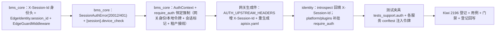

# 05 实施 · 登录态依赖真实化与租户解析接线

> 认证与安全 · 01 认证与会话 · 子任务 05（需求 01-5）· 实施记录

[文档首页](../../../../../../文档首页.md) › [01 认证与会话](../01_认证与会话_05_登录态依赖与租户解析接线.md) › 实施记录　|　[← 任务](../01_认证与会话_05_登录态依赖与租户解析接线.md)　[测试记录 →](../测试/01_测试_05_登录态依赖与租户解析接线.md)

## 1. 实施信息 

| 项 | 值 |
| --- | --- |
| 任务 | [05 登录态依赖真实化与租户解析接线](../01_认证与会话_05_登录态依赖与租户解析接线.md) |
| 对应需求 | [01-5](../../../../需求/01_需求_认证与会话.md#r01-5) |
| 详细设计 | [05 详细设计](../设计/01_详细设计_05_登录态依赖与租户解析接线.md) |
| 实施日期 | 2026-09-26 |
| 实施人 | minjian |
| 实施环境 | 本地开发机（Python 3.14.4 / uv；ASGI 内存客户端；SQLite 租户库 + 内存会话存储替身） |
| 提交 | 待用户确认后提交（本工作区 AGENTS.md 要求不擅自提交；设计 / 代码 / 文档分开提交） |
| 结论 | 完成（10 项决策全按确认执行；新增 / 变更代码全覆盖；全量 1465 passed / 37 skipped；设计层偏差 2 项已回写） |

## 2. 实施概览 

## 3. 实施过程 

1. **身份头契约（`bms_core/edge/headers.py` / `edge/base.py`）**：新增 `SESSION_ID_HEADER = "X-Session-Id"` 并纳入 `IDENTITY_HEADERS`（自动进 `STRIPPED_HEADERS`）；`EdgeIdentity` 增 `session_id` 字段与 `from_headers` 解析（缺失 None）。
2. **边缘中间件（`bms_core/api/middleware.py`）**：`EdgeGuardMiddleware` 剥除清单与规范身份头回写纳入 `X-Session-Id`（客户端伪造一律剥除、可信身份回写）。
3. **错误码与配置（`bms_core/core/`）**：`exceptions.py` 增 `SessionAuthError(SessionError)`（复用 `20012` / HTTP 401；与 01_04 `SessionExpiredError` 同码分场景）；`config.py` 的 `SessionSettings` 增 `device_check`（默认 false）。
4. **登录态依赖（`bms_core/api/base.py`）**：新增 frozen 身份契约 `AuthContext`（`subject` / `user_id` / `tenant` / `session_id` / `scopes` / `service_identity` / `source`）；`require_auth` 由同步占位改为**异步恒定强制依赖**——优先消费请求态可信边缘身份（网关路径），否则本地校验 `aud=api` Bearer 用户令牌；`_wire_tenant` 做租户接线（token 兜底 + 显式来源跨租户拒绝 + 写请求态与租户上下文）；`_verify_session` 做每请求会话标记存在性校验与可选设备 / IP 校验；`_write_context` 写 `current_user_id` / `current_tenant`；失败抛 `AuthError`（20001 / 401）或 `SessionAuthError`（20012 / 401）。
5. **网关接线（`services/gateway_catalog.py` + `deploy/gateway/apisix.yaml`）**：`AUTH_UPSTREAM_HEADERS` 增 `X-Session-Id`；`ops.gateway_config render` 重生成生成件（剥头清单 + 各路由 `upstream_headers`），`check` 零漂移。
6. **introspect 回填（`bms_identity/api/auth.py`）**：校验通过后响应头回填 `X-Session-Id = verified.token_id`（用户 access `jti`）。
7. **受保护路由切换（`bms_platform/api/plugins.py`）**：插件清单 / 聚合路由补挂 `Depends(require_auth)`；其余「登录即可」路由已挂，真实化后自动生效；公开端点与 `require_service` 内部端点不变。
8. **测试夹具（`backend/tests_support/auth.py` 新 + 各服务 `tests/conftest.py`）**：共享夹具生成进程内测试 RSA 密钥对、注入 `BMS_SECURITY__KEYS` / `ACTIVE_KEY`、签发真实 `aud=api` 用户 access；各服务 `client` 默认携带 `Authorization`，既有受保护路由用例在真实鉴权下基本零改动通过；`tests_support` 纳入 ruff `known-first-party` 与 pytest `pythonpath`。
9. **会话测试存储适配（`identity/tests/auth/session_helpers.py`）**：`wire_login` 改异步并预置默认测试会话标记（会话存储替身为进程内实现时，受保护路由默认令牌可命中；不干扰登录产生的会话计数）。
10. **用例编写**：新增 `libs/bms_core/tests/api/test_require_auth.py`（网关 / 本地 / 401 / 20012 / 跨租户 / device_check / 租户兜底全分支）、`services/identity/tests/auth/test_auth_dependency.py`（端到端 200 / 401 / 踢出即时 20012）；更新 `test_edge` / `test_middleware` / `test_gateway_catalog` / `test_introspect` / `test_router_base` 及既有受保护路由用例的令牌注入。
11. **验证**：`uv run pytest -q` → **1465 passed / 37 skipped**；`ruff check` / `ruff format --check` / `pyright` 全绿；`contract_snapshot check` / `api-types gen:check` / `gateway_config check` / `event_contracts check` / `check-backend-base` / `check-base` / `preflight --fast` 全绿。
12. **登记回写**：《后端基类清单》新增 01_05 条目 + 鉴权依赖条目真实化 + `AuthContext` 登记 + edge 链 `session_id`；《架构设计 14》§3 / §8、《架构设计 12》§2、《架构设计 09》码位、《概要 14》§5 / §6；计划 / 父任务 / 任务状态。

## 4. 问题与处置 

| # | 问题 / 现象 | 原因 | 处置与落点 |
| --- | --- | --- | --- |
| 1 | 全量运行大量 401 / 测试夹具报错，而单服务运行全绿 | 插件工厂**进程内只登记一次**（`register_platform_plugins` 幂等）：会话级首个装配应用的 `settings` 被工厂捕获；bms_core 套件先行装配时无用户令牌密钥 → 全局 `token_verifier` 工厂无密钥，后续服务用例的测试令牌验签失败 | bms_core 测试套件 `conftest` 注入测试用户令牌密钥（首个装配者固定密钥）；平台契约套件 `build_snapshot` 亦注入；断言「无密钥」基线的 `test_config` / `test_jwt` 显式清空该环境 / 传空密钥 |
| 2 | 全量运行 `PluginError: (token_verifier, stub) 重名` | 新增 `test_require_auth` 的替身校验器 `plugin_name="stub"` 与既有 `test_introspect` 同名，`BasePluggable.__init_subclass__` 汇入全局注册表构建即拒 | 替身改唯一 `plugin_name="stub-require-auth"`（测试替身命名须全局唯一） |
| 3 | 断言 `current_client_ip` 设备校验用例不生效 | 设备 / IP 上下文由 `RequestLoggingMiddleware` 从 `X-Forwarded-For` 写入上下文变量；单测未装配中间件时变量为空 | 用例显式 `set_current_client_ip(...)` 还原请求上下文（用例侧适配，不改实现） |
| 4 | 空密钥 JWKS 用例失败 | 测试夹具注入用户令牌密钥后 `Settings()` 默认非空密钥集，「无密钥返回空集」基线不再成立 | `test_jwks_route_empty_without_keys` 显式覆盖为空密钥签发者（`JwtServiceTokenIssuer(keys=[])` / `JwtUserTokenIssuer(keys=[])`），保留边界分支 |

## 5. 验证结果 

| 项 | 方法 | 结果 |
| --- | --- | --- |
| 单元 / 集成全量 | `cd backend && uv run pytest -q` | 1465 passed，37 skipped |
| require_auth 全分支 | `libs/bms_core/tests/api/test_require_auth.py` | 通过（网关 / 本地 / 401 / 20012 / 跨租户 / device_check / 租户兜底） |
| 登录态端到端（ASGI） | `services/identity/tests/auth/test_auth_dependency.py` | 通过（受保护接口 200；无效令牌 401/20001；踢出后下一请求 401/20012） |
| 新增 / 变更模块覆盖率 | `--cov=bms_core.edge.base --cov=bms_core.edge.headers --cov=bms_core.api.middleware --cov=bms_core.core.exceptions --cov=bms_core.services.gateway_catalog --cov=bms_identity.api.auth` | 100%（`bms_core.api.base` 全文件 96%，未覆盖为既有非本任务行 193/205/217-219/370/601；本次新增 `require_auth` 段全覆盖） |
| 静态检查 | `uv run ruff check .` / `ruff format --check .` | All checks passed / 全部已格式化 |
| 类型检查 | `uv run pyright` | 0 errors / 0 warnings |
| 网关生成件 | `uv run python -m ops.gateway_config check` | 通过（含 `X-Session-Id` 剥头与注入） |
| 契约与生成件 | `ops.contract_snapshot check` / api-types `gen:check` | 全绿（零漂移；新增仅响应头，不改 OpenAPI） |
| 基座与预检 | `check-backend-base.py` / `check-base.py` / `preflight --fast` | 全绿 |

## 6. 偏差与遗留 

- **偏差**：
  1. 网关路径会话 id 传递采用**新增 `X-Session-Id` 身份头**（原设计草案曾并列「服务 JWT `sid` claim」），需改 `edge/headers` + 网关生成件 + `introspect`；设计 §3.2 / 对齐 #2 已定稿。
  2. `require_auth` 由同步 `-> None` 改为**异步 `-> AuthContext`**（恒定强制），直接调用它的既有用例同步更新；设计 §3.3 / §4 已回写。
  3. 会话标记失效错误码取 **`20012` / 401**（区分踢出），复用 01_04 会话码位；设计 §3.7 / 对齐 #6 已明确。
  4. 全量测试首装配密钥隔离方案（测试套 `conftest` 注入 + 断言基线用例清空）为实施层处置，设计 §5 测试设计已涵盖「共享夹具自动注入令牌」。
- **遗留**：
  1. 真机端到端冒烟——网关生成件与后端**同步发布**（`X-Session-Id` 注入 → 每请求标记校验 → 踢出即时 401）（**归口：部署窗口**）——本期以 ASGI 端到端 + 单元 / 服务层用例覆盖。
  2. RBAC 细粒度权限码判定与越权（`require_permission` 仍 Null），`AuthContext` 为主入口（**归口：阶段七 RBAC**）。
  3. 登录 / 踢出操作日志落库、`session.revoked` 真实 Socket.IO 广播（**归口：阶段八**）。
  4. 租户级 `sys_config` 会话覆盖（`max_active` / `device_check`）与设备一致性强度评估（**归口：后续阶段**）。
  5. 外部 IdP 主体映射（subject → 内部 `user_id`）（**归口：域 02 SSO**）。

> 本文档依《[文档生成规范](../../../../../../规范/文档生成规范.md)》编写
