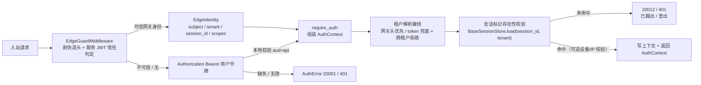

# 05 详细设计 · 登录态依赖真实化与租户解析接线

> 认证与安全 · 01 认证与会话 · 子任务 05（需求 01-5）· 详细设计

[文档首页](../../../../../../文档首页.md) › [01 认证与会话](../01_认证与会话_05_登录态依赖与租户解析接线.md) › 详细设计　|　[← 任务](../01_认证与会话_05_登录态依赖与租户解析接线.md)　[需求 01-5 →](../../../../需求/01_需求_认证与会话.md#r01-5)

## 1. 设计目标与范围 <a id="goal"></a>

把 `bms_core.api.base.require_auth` 从「按 `[edge].require_gateway_identity` 门控、开关关时恒定放行」的**占位**，真实化为**受保护路由统一登录态依赖**，并接上租户解析兜底：

1. **`require_auth` 真实实现（恒定强制）**——受保护路由一律要求有效登录态，来源二选一：
   - **网关路径**：消费 `EdgeGuardMiddleware` 已验签可信的 `EdgeIdentity`（`X-User-Subject` / `X-Tenant-Id` / `X-Session-Id`，服务 JWT 信任）；
   - **本地路径**：本地校验 `Authorization: Bearer` 用户令牌（`aud=api`，`UnifiedTokenVerifier`）；
   - 成功返回统一身份契约 `AuthContext`（`subject` / `user_id` / `tenant` / `session_id` / `scopes` / `service_identity`）并写请求上下文（`current_user_id` / 租户）；失败抛 `AuthError`（`20001` / 401）。
2. **每请求会话标记校验**——按 `session_id`（网关路径来自 `X-Session-Id`，本地路径来自 access `jti`）经 `BaseSessionStore.load` 校验 Redis 会话标记存在性；标记不存在（已踢出 / 登出）⇒ `20012` / 401，**下一请求即拦截**（不依赖广播）。
3. **租户解析接线**——请求上下文租户优先取网关身份头（中间件已解析），本地路径以 token `tenant_id` 兜底写请求态与租户上下文；显式来源（子域名 / `X-Tenant-ID`）与 token 不一致 ⇒ 跨租户拒绝；会话 / 缓存键按租户前缀隔离（沿用既有 `build_session_key`）。
4. **身份头契约扩展**——新增 `X-Session-Id` 身份头（introspect 注入 jti、网关 `upstream_headers` 纳入、`EdgeIdentity` 解析），打通网关路径的会话标记校验。
5. **设备 / IP 一致性（可选强度）**——新增 `[session].device_check`（默认 `false`）；开启时比对会话标记内 `ip` / `ua` 与当前请求，不一致 ⇒ 401。
6. **受保护路由统一切换**——补齐遗漏的「登录即可」路由（`platform/plugins.py`），核对服务目录 / 检索 / 图标 / 打印 / AI / 通知 / 偏好等已挂路由无遗漏；公开端点与内部契约路由口径不变。
7. **错误码与口径回写**——认证错误码段（`20001` / `20012`）落地与用例；《后端基类清单》「鉴权依赖占位」条目、《架构设计 14》§3 / §8、《架构设计 12》租户解析链、概要 14 §5 / §6 回写。

**不在本期**：细粒度权限码判定与越权（阶段七 RBAC，`require_permission` 沿用 Null）；SSO 来源的用户主体映射（域 02）；设备指纹强度 / IP 画像风控（性能与安全加固阶段）；真机端到端冒烟（沿用 01_03 / 01_04，归部署窗口）。

**安全影响（SDL）**：把大量「登录即可」接口从**敞开**切为**真实登录态**。专项验收点：无 / 无效 / 已失效登录态一律 401、错误响应不泄露内部细节（`20001` 统一文案）；已踢出会话下一请求即 401（标记删除即拦截）；跨租户访问被拒；日志不落 token 原始值；服务间内部端点（`require_service`）与公开端点口径不受影响。

### 1.1 现状与缺口 <a id="gap"></a>

```text
backend/libs/bms_core/src/bms_core/
├── api/base.py                # require_auth 占位：按 [edge].require_gateway_identity 门控；开关关恒定放行、返回 None
├── edge/base.py               # EdgeIdentity（user_id/subject/tenant_code/scopes/service_identity；无 session_id）
├── edge/headers.py            # 身份头契约（无 X-Session-Id）
├── edge/service_jwt.py        # ServiceJwtEdgeTrust 已交付（服务 JWT 验签信任 + 身份头解析）
├── api/middleware.py          # EdgeGuardMiddleware 已交付（剥伪造头 / 注入可信身份 / 旁路拒绝 / current_user_id）
├── session/{base,redis,memory,null}.py  # BaseSessionStore 已交付（load 未命中 = None = 已踢出/登出）
├── oauth/verify.py            # UnifiedTokenVerifier：api → 本地用户令牌 JWKS（已交付）
└── db/tenant.py               # resolve_request_tenant：子域名 → X-Tenant-ID → token 租户位（state.tenant_id）已交付
backend/services/identity/src/bms_identity/api/auth.py   # /auth/introspect：校验用户 JWT 换发网关服务 JWT + 注入 X-User-Subject/X-Tenant-Id/X-User-Scopes
backend/services/platform/src/bms_platform/api/plugins.py# 插件聚合路由：未挂 require_auth（敞开）
```

缺口：① `require_auth` 在 dev / test 恒定放行（受保护接口敞开）；② 无统一登录态身份契约（返回 None，RBAC 无可依赖的入口）；③ 无「每请求会话标记存在性」校验（踢出即时性在 HTTP 侧未闭环）；④ 网关路径缺 `session_id` 传递（introspect 不注入、EdgeIdentity 不解析）；⑤ 无 token 租户兜底与跨租户拒绝；⑥ 无设备 / IP 一致性校验；⑦ 插件聚合路由未挂登录态；⑧ 错误码 `20012` 未用于登录态失效。

### 1.2 每请求校验链（目标形态） <a id="chain"></a>



## 2. 交付物清单 <a id="deliver"></a>

```text
backend/libs/bms_core/src/bms_core/
├── api/
│   ├── base.py                  # 改：新增 AuthContext（frozen 数据契约）；require_auth 真实化为异步依赖
│   │                            #     （网关身份 / 本地用户令牌二选一 + 会话标记校验 + 设备校验 + 租户接线 + 上下文写入）
│   └── middleware.py            # 改：EdgeGuardMiddleware 剥除清单与规范身份头回写纳入 X-Session-Id
├── edge/
│   ├── headers.py               # 改：SESSION_ID_HEADER="X-Session-Id" + IDENTITY_HEADERS/STRIPPED_HEADERS
│   └── base.py                  # 改：EdgeIdentity.session_id + from_headers 解析
├── core/
│   ├── config.py                # 改：SessionSettings.device_check（[session].device_check，默认 false）
│   └── exceptions.py            # 改：SessionAuthError(SessionError)（20012 / 401；登录态会话失效）
├── services/gateway_catalog.py  # 改：AUTH_UPSTREAM_HEADERS 增 SESSION_ID_HEADER；剥头清单随 IDENTITY_HEADERS
└── api/deps.py                  # 改（如需）：导出会话存储 / 校验器提供者（已导出，按需复核）

backend/services/identity/src/bms_identity/api/auth.py    # 改：introspect 响应注入 X-Session-Id（verified.token_id）
backend/services/platform/src/bms_platform/api/plugins.py # 改：插件清单路由挂 require_auth

backend/tests_support/
├── __init__.py                  # 新
└── auth.py                      # 新：测试用用户令牌密钥对 / 环境注入 / 签发 access / 默认鉴权头（pythonpath="." 可导入）
backend/services/*/tests/conftest.py                     # 改：用例默认注入测试用户令牌（共享夹具）
backend/services/platform/tests/api/test_router_base.py  # 改：require_auth 断言随真实化更新
backend/libs/bms_core/tests/api/test_require_auth.py     # 新：require_auth 全分支（网关 / 本地 / 401 / 20012 / 跨租户 / 设备 / 上下文）
backend/libs/bms_core/tests/edge/test_edge.py            # 改：EdgeIdentity.session_id 解析
backend/libs/bms_core/tests/api/test_middleware.py       # 改：X-Session-Id 剥除 / 回写
backend/libs/bms_core/tests/services/test_gateway_catalog.py # 改：upstream_headers / 剥头含 X-Session-Id

deploy/gateway/apisix.yaml                                # 改：重生成（剥头 + upstream_headers 含 X-Session-Id）
deploy/contracts/*.json                                   # 按需：`ops.contract_snapshot check`（预期零漂移）

bms文档/
├── 后端基类清单.md                                          # 改：§12 鉴权依赖条目 → require_auth 真实化 + AuthContext；edge 链 EdgeIdentity 增 session_id
├── 设计/架构设计/14_架构设计_子系统_认证与会话.md            # 改：§3 每请求校验链 / §7 / §8 协调节口径
├── 设计/架构设计/12_架构设计_子系统_多租户路由.md            # 改：§2 租户解析链 token 兜底接线
├── 设计/架构设计/09_架构设计_接口与集成.md                   # 改：平台已发布码位补 20012（登录态会话失效 401）注记
├── 设计/概要设计/14_概要设计_会话管理.md                     # 改：§5 / §6 device_check 接入、每请求校验口径
├── 规范/后端开发规范.md / 安全开发规范.md（按需）             # 改：仅当出现新强制口径
└── 项目/06_认证与安全/…
    ├── 计划/01_计划_认证与安全.md                           # 改：§1 工时台账 / §2 已完成 / §3 移除 01_05 / 甘特
    ├── 任务/01_认证与会话/01_认证与会话.md                   # 改：子任务表状态与完成日期
    └── 任务/…_05_…/                                       # 改：任务状态 + 实施 / 测试记录

test/scripts/kiwi/cases|exports/…                          # 新：本任务策展用例登记输入与回读
```

## 3. 接口 / 契约与边界 <a id="contract"></a>

### 3.1 `AuthContext` 契约 <a id="auth-context"></a>

新增于 `bms_core/api/base.py`（frozen dataclass，继承 `BaseObject`），作为受保护路由的统一登录态身份（阶段七 RBAC 直接消费）：

| 字段 | 类型 | 语义 |
| --- | --- | --- |
| `subject` | `str` | 登录主体（本地登录 = 用户 id 字符串；SSO = 映射后主体） |
| `user_id` | `int \| None` | 内部用户数字标识（subject 可解析为整数时取之；否则 None） |
| `tenant` | `str \| None` | 生效租户编码 |
| `session_id` | `str \| None` | 会话 id（= access `jti`；会话标记键依据） |
| `scopes` | `tuple[str, ...]` | 授权范围（网关路径取身份头 / 本地路径取 token `scope`） |
| `service_identity` | `str \| None` | 网关 / 服务身份（网关路径为 `gateway`；本地路径为空） |
| `source` | `str` | 身份来源（`gateway` / `token`；诊断与审计用） |

### 3.2 `X-Session-Id` 身份头契约 <a id="session-header"></a>

| 头 | 方向 | 语义 |
| --- | --- | --- |
| `X-Session-Id` | 网关注入 | 网关验证过的会话 id（用户 access `jti`）；后端据此做每请求会话标记校验 |

- 常量落 `edge/headers.py::SESSION_ID_HEADER`，纳入 `IDENTITY_HEADERS` ⇒ 自动进 `STRIPPED_HEADERS`（网关 `global_rules` 与后端 `EdgeGuardMiddleware` 双双剥除客户端伪造值）。
- `introspect` 校验通过后回填 `X-Session-Id: <verified.token_id>`；网关 `forward-auth.upstream_headers` 纳入该头、注入上游。
- `EdgeIdentity` 增 `session_id` 并由 `from_headers` 解析（缺失为 None）。
- **降级口径**：网关路径可信身份存在但缺 `session_id`（网关生成件未同步）⇒ `require_auth` 视为无有效登录态（`20001`），fail-closed，不静默放行。

### 3.3 `require_auth` 依赖契约 <a id="require-auth"></a>

```python
async def require_auth(
    request: Request,
    verifier: Annotated[BaseTokenVerifier, Depends(get_token_verifier)],
    store: Annotated[BaseSessionStore, Depends(get_session_store)],
) -> AuthContext: ...
```

- **身份来源二选一**（恒定强制，不看 `[edge].require_gateway_identity`）：
  1. 请求态 `edge_identity` 存在（`EdgeGuardMiddleware` 服务 JWT 验签信任）⇒ 网关路径，取 `subject` / `tenant_code` / `session_id` / `scopes` / `service_identity`；
  2. 否则取 `Authorization: Bearer` 用户令牌，`verifier.verify(token, audience=api)`（签名 / `exp` / `iss` / `aud` / `type=access` 全校验）⇒ 本地路径，取 `subject` / `tenant` / `token_id` / `scopes`。
- **失败语义**：无令牌 / 非 Bearer / 验签失败 / 受众不符 ⇒ `AuthError`（`20001` / 401）；网关路径缺 `session_id` ⇒ `AuthError`（`20001` / 401）；会话标记未命中 ⇒ `SessionAuthError`（`20012` / 401）。
- **依赖顺序**：路由级依赖先于端点参数依赖求解 ⇒ `require_auth` 先于端点 `Depends(get_tenant)` 执行，故其写入的请求态租户对端点可见。
- **返回**：`AuthContext`；端点可 `Depends(require_auth)` 取用（`dependencies=[Depends(require_auth)]` 仍可用，返回值被忽略）。

### 3.4 会话标记校验与设备 / IP 一致性 <a id="marker"></a>

- **标记校验**：`session_id` 与 `tenant` 就绪后 `await store.load(session_id, tenant=tenant)`；返回 None ⇒ `SessionAuthError`（`20012` / 401）。标记删除（踢出 / 登出 / 超限作废）⇒ 下一请求即拦截，与 01_04 撤销原语一致。
- **`session_id` 缺失**：网关路径 fail-closed（见 3.2）；本地路径 `jti` 为空 ⇒ `AuthError`（`20001`）。
- **设备 / IP（`[session].device_check`，默认 false）**：开启且会话标记载荷含 `ip` / `ua` 时，与当前请求 `current_client_ip` / `User-Agent` 比对；两侧均非空且不一致 ⇒ `SessionAuthError`（`20012` / 401）；任一侧缺失不判（避免代理 / 网关转发口径误伤）。标记载荷由 01_03 登录 / 刷新写入（`{"user_id","tenant","ip","ua"}`）。

### 3.5 租户解析接线 <a id="tenant"></a>

| 来源 | 生效口径 |
| --- | --- |
| 网关身份头（`X-Tenant-Id`） | 经全局租户中间件解析为请求态租户（既有链路）；`require_auth` 只读不覆盖 |
| 本地 token `tenant_id` | 请求态租户缺失，或已解析为**非显式回落**且与 token 不一致 ⇒ 以 token 租户为准，写 `request.scope["state"]["tenant"]` 与租户上下文（`set_tenant_context` / `set_current_tenant`） |
| 显式来源与 token 不一致 | 子域名 / `X-Tenant-ID` 存在且其解析租户 ≠ token 租户 ⇒ `AuthError`（`20001` / 401，跨租户拒绝） |
| 均无租户 | 依既有回落策略（dev 演示租户 / prod 拒绝）；`require_auth` 保持中间件判决 |

- **显式来源判定**：`request.headers.get("X-Tenant-ID")` 非空，或 `tenant_hostname(Host)` 命中租户子域名——二者之一即视为显式；否则视为无来源回落。
- **兜底租户上下文**：`TenantContext(tenant_code=token_tenant, db_key=build_tenant_db_key(token_tenant), name=token_tenant)`（与 `current_tenant_context()` 兜底同口径）；端点 `Depends(get_tenant)` 读请求态即得更新后的租户与库键。
- **豁免路径一致性**：探针 / 文档 / `/.well-known/jwks.json` / `/api/v1/auth/introspect` 维持租户豁免（不解析、不设上下文）；公开登录端点（login / refresh / captcha）不豁免（登录 / 刷新需租户上下文选库）。

### 3.6 受保护路由切换 <a id="routes"></a>

| 路由 | 现状 | 本期 |
| --- | --- | --- |
| `platform/plugins.py`（插件清单 / 聚合） | 未挂 | **补挂 `require_auth`** |
| `platform/modules.py` / `dict.py` / `icon.py` / `preference.py` / `codecheck.py` / `outbox.py` / `query_scheme.py` | 已挂 | 保持（真实化后自动生效） |
| `search` / `report`(print) / `ai`(chat) / `notification` / `file` / `tenant`(mine/switch) / `org`(org) / `identity`(sessions) | 已挂 | 保持（真实化后自动生效） |
| `identity`(auth / captcha / wellknown) | 公开 | 不变 |
| `org/internal/*` | `require_service` | 不变 |
| `tenant-registry` | 内部契约（服务身份口径复核对齐 05_02） | 不变 |

- **冒烟核对**：以「全部 `BaseRouter` 模块 × 是否挂 `require_auth`」清单核对，输出到实施记录，确认无遗漏。

### 3.7 错误码口径 <a id="errors"></a>

| 码位 | 含义 | 类型 / HTTP | 本期 |
| --- | --- | --- | --- |
| `20001` | 认证失效（缺令牌 / 无效 / 受众不符 / 网关身份缺会话） | `AuthError` / 401 | 实现（沿用） |
| `20012` | 登录态会话失效（标记不存在 = 已踢出 / 登出；设备 / IP 不符） | `SessionAuthError` / 401 | 实现（新增异常，复用码位） |

- `SessionAuthError` 继承 `SessionError(AuthError)`，构造预置码位 `20012` 与 HTTP 401；与 01_04 `SessionExpiredError`（同码、HTTP 200 业务失败）**分场景**：前者用于请求鉴权链（401），后者用于会话管理端点的业务失败提示（200）。
- 错误响应不泄露内部细节：不区分「账号不存在 / 令牌类型 / 会话归属」，统一文案由前端按 `error.{code}` 映射。

### 3.8 配置契约 <a id="config"></a>

```toml
[session]
# 同一账号活跃会话上限（01_04）
max_active = 5
# 每请求是否校验设备/IP 一致性（可选强度；默认 false，不改变既有链路）
device_check = false
```

| 配置键 | 环境变量 | 口径 |
| --- | --- | --- |
| `[session].device_check` | `BMS_SESSION__DEVICE_CHECK` | 默认 `false`；开启时比对会话标记 `ip` / `ua` 与当前请求，不一致 401 |

### 3.9 失败分支与降级 <a id="failures"></a>

| 场景 | 行为 |
| --- | --- |
| 无 `Authorization` 且无网关身份 | `AuthError`（20001 / 401） |
| 令牌无效 / 过期 / `aud` 非 `api` / 类型非 `access` | `AuthError`（20001 / 401） |
| 网关可信身份缺 `X-Session-Id` | `AuthError`（20001 / 401，fail-closed） |
| 会话标记不存在（踢出 / 登出 / 超限作废） | `SessionAuthError`（20012 / 401，下一请求即拦截） |
| 设备 / IP 不一致（`device_check=true`） | `SessionAuthError`（20012 / 401） |
| 显式租户来源与 token 租户不一致 | `AuthError`（20001 / 401，跨租户拒绝） |
| 请求态无租户 + 本地 token 带租户 | 以 token 租户兜底写请求态与上下文（不拒） |
| Redis 会话存储不可用 | `load` 异常按未命中处理（既实现降级）⇒ 401；与 01_03「Redis 异常降级不命中」一致 |
| `app.state.settings` 缺失（极简 / 裸应用） | 会话标记校验仍执行；`device_check` 取默认 false；无身份即 401 |
| 已踢出会话的 refresh | 仍由 01_03 / 01_04 链路（黑名单 + 标记）拒；本任务不重复 |

## 4. 兼容性与消费方影响 <a id="compat"></a>

- **新增**：`AuthContext`、`SessionAuthError`、`X-Session-Id` 身份头、`[session].device_check`、`tests_support.auth` 测试夹具。
- **行为变更（需回归）**：`require_auth` 由「开关门控 / 恒定放行」改为「恒定强制真实登录态」；`require_auth` 由同步 `-> None` 改为异步 `-> AuthContext`（调用面 `Depends(require_auth)` 不变，直接调用它的用例需更新）。
- **扩展**：`EdgeIdentity` 增 `session_id`（默认 None，向后兼容）；`EdgeGuardMiddleware` 剥除 / 回写清单增 `X-Session-Id`；`AUTH_UPSTREAM_HEADERS` 增 `X-Session-Id`；`introspect` 响应头增 `X-Session-Id`。
- **默认值变更（需回归）**：`[session]` 新增 `device_check=false`（不改既有行为）。
- **不改**：`/auth/login` / `refresh` / `logout` 与 `introspect` 的既有契约（仅 introspect 增响应头）；`require_service` 内部端点口径；`sys_session` 表结构 / 迁移；会话 / 限流 / 协议键构造；既有 Kiwi 用例号复用。
- **消费方**：阶段七 RBAC 消费 `AuthContext`（权限判定主体）；域五前端 401 钩子消费 401 / `20012`；`05_02 数据所有权`核对内部契约路由（`tenant-registry`）鉴权口径。
- **生成件**：`deploy/gateway/apisix.yaml` 重生成（`ops.gateway_config check` 零漂移）；契约快照预期零漂移（路由级依赖不改变 OpenAPI 路径 / schema；introspect 响应头不入 schema）。

## 5. 测试设计与验收映射 <a id="test"></a>

用例**先登记 Kiwi TCMS 再编码**（编号以平台回读为准），自动化用例以 `@pytest.mark.kiwi_id(...)` 标注。

| # | 用例 / 文件 | 断言要点 | 对应完成标准 |
| --- | --- | --- | --- |
| 1 | `libs/bms_core/tests/api/test_require_auth.py` | 网关身份路径（subject / tenant / session_id / scopes / service_identity 正确入 `AuthContext` 与上下文）；本地令牌路径（验签 `aud=api`、jti 入 session_id）；无 / 无效令牌 401（20001）；网关缺 `X-Session-Id` 401；标记未命中 20012/401；device_check 开 / 关；跨租户显式不一致 401；token 租户兜底写请求态；`current_user_id` subject 数字优先 | 依赖真实化与租户解析三来源 |
| 2 | `libs/bms_core/tests/edge/test_edge.py`（改） | `EdgeIdentity.from_headers` 解析 `X-Session-Id`（有 / 无）；既有字段不回归 | 身份头契约 |
| 3 | `libs/bms_core/tests/api/test_middleware.py`（改） | `EdgeGuardMiddleware` 剥除客户端伪造 `X-Session-Id`；信任时回写规范 `X-Session-Id` | 身份头净化 |
| 4 | `libs/bms_core/tests/services/test_gateway_catalog.py`（改） | `AUTH_UPSTREAM_HEADERS` 含 `X-Session-Id`；global 剥头清单含 `X-Session-Id`；生成件确定性 | 网关接线 |
| 5 | `services/identity/tests/auth/test_introspect.py`（改） | 校验通过响应头含 `X-Session-Id`（= 用户令牌 jti）；公开路径 / 401 / 503 分支不回归 | 网关路径会话传递 |
| 6 | `services/identity/tests/auth/test_auth_dependency.py`（新） | ASGI 端到端：登录 → 带令牌访问受保护接口 200；无 / 坏令牌 401；踢出后下一请求 401（20012）；跨租户 401；`device_check=true` 不一致 401 | 端到端即时性与失败分支 |
| 7 | `services/platform/tests/api/test_router_base.py`（改） | `require_auth` 直调断言随异步 / 真实化更新；插件清单路由未带令牌 401、带令牌 200 | 受保护路由切换 |
| 8 | 各服务既有受保护路由用例（共享夹具注入令牌） | 类型检查 / 全量回归在真实鉴权下全绿 | 回归 |
| 9 | 既有全量回归 + 门禁 | `pytest` / `ruff` / `pyright` / `contract_snapshot check` / `api-types gen:check` / `check-backend-base` / `gateway_config check` / `check-base` / `preflight --fast` 全绿 | 回归与门禁 |

**验收映射**：需求 01-5「完成标准」逐条——未携带 / 无效 token 401（用例 1 / 6）、有效登录态用户与租户正确（用例 1 / 6）、跨租户被拒（用例 1 / 6）、租户三来源覆盖（用例 1 / 6）、回归全绿（用例 8 / 9）。新增 / 变更模块（`bms_core.api.base` require_auth 相关、`bms_core.edge.headers` / `base`、`bms_core.core.exceptions` 新增异常、identity `introspect` 变更）语句覆盖率 100%（分支按可达性）。

## 6. 登记落点 <a id="registry"></a>

| 内容 | 落点 |
| --- | --- |
| `require_auth` 真实化 + `AuthContext` | 《[后端基类清单](../../../../../../后端基类清单.md)》§12「鉴权依赖占位」条目状态回写 + `AuthContext` 契约登记 |
| `EdgeIdentity.session_id` / `X-Session-Id` | 《后端基类清单》edge 链与身份头契约；《架构设计 14》§7 |
| 会话失效错误码 `20012`（登录态） | `bms_core/core/error_codes.py`（沿用）+ 《架构设计 09》「平台已发布码位」注记 |
| 每请求校验链 / 租户解析链口径 | 《架构设计 14》§3 / §8、《架构设计 12》§2、《概要 14》§5 / §6 |
| `[session].device_check` 配置 | `backend/config.toml` + 本设计 §3.8 |
| 网关生成件 | `deploy/gateway/apisix.yaml`（重生成） |
| 任务 / 父任务 / 计划状态与工时 | 本任务文档、[父任务](../../01_认证与会话.md)、[计划](../../../../计划/01_计划_认证与安全.md) |
| 消费方前置契约标注 | 阶段七 RBAC（`AuthContext`）、域五前端（401 / `20012`）、`05_02`（内部契约路由口径） |
| Kiwi TCMS / 测试资产仓 | 登记本任务策展用例并回读编号；`test/scripts/kiwi/cases|exports/` 对应文件 |
| 实施 / 测试记录 | 本目录 `实施/`、`测试/` 各一份 |

## 7. 边界与开放项 <a id="boundary"></a>

- **归阶段七 RBAC**：`require_permission` 细粒度权限码判定与越权（本期 Null = 恒定通过）；`AuthContext` 为权限判定主体入口。
- **归域 02 SSO**：外部 IdP 用户主体的映射（`X-User-Subject` → 内部 `user_id`）；本期 subject 数字优先解析。
- **归阶段八**：登录 / 踢出操作日志落库；`session.revoked` 真实 Socket.IO 广播。
- **开放项（真机冒烟）**：沿用 01_03 / 01_04——真机端到端（网关 forward-auth 注入 `X-Session-Id` → 后端每请求标记校验 → 踢出即时 401）需重建 identity / 平台镜像 + 同步网关生成件 + 注入 `[security].keys` / `[service_token].keys` / `sys_user` 种子，归部署窗口；本期以 ASGI 端到端 + 单元 / 服务层用例覆盖。
- **开放项（网关与后端生成件同版本）**：`X-Session-Id` 注入依赖网关生成件同步；后端对缺该头的网关身份 fail-closed（20001）。部署须「网关生成件与后端同步发布」，写入部署窗口注意项。
- **开放项（设备一致性强度）**：`device_check` 默认关；开启后的代理 / 网关 IP 口径与误伤率随部署联调评估。
- **开放项（租户兜底回落）**：无显式来源时以 token 租户兜底；显式来源与 token 不一致即拒。`sys_config` 租户级会话配置（`device_check` / `max_active` 覆盖）归后续阶段。

## 8. 对齐记录 <a id="align"></a>

| # | 事项 | 结论（2026-09-26 拍板） |
| --- | --- | --- |
| 1 | 登录态生效口径 | **恒定强制**：受保护路由一律要求有效登录态（网关可信身份 或 本地 Bearer 用户令牌），不随 `[edge].require_gateway_identity` 放行；既有受保护路由用例加共享令牌夹具 |
| 2 | 网关路径 `session_id` 传递 | **新增 `X-Session-Id` 身份头**（introspect 注入 jti + 网关 `upstream_headers` + `EdgeIdentity` 解析）；缺该头 fail-closed |
| 3 | `require_auth` 返回契约 | **返回 `AuthContext` 契约**（subject / user_id / tenant / session_id / scopes / service_identity / source） |
| 4 | 用户标识写入口径 | **subject 数字优先**：能解析为整数写 `current_user_id`，并始终保留 subject；`X-User-Id` 若注入优先 |
| 5 | 租户 token 兜底 | **`require_auth` 内落请求态与租户上下文**；显式来源与 token 不一致 ⇒ 拒（跨租户）；无来源时以 token 租户兜底 |
| 6 | 会话标记失效错误码 | **`20012` 区分**（登录态会话失效 / 401）；缺 / 无效令牌仍 `20001` |
| 7 | 设备 / IP 一致性 | **可选配置实现、默认关**（`[session].device_check=false`），开启时不一致 401 |
| 8 | 受保护路由切换范围 | **补齐遗漏的登录即可路由**（`platform/plugins.py`），并核对已挂路由无遗漏；公开端点与内部契约路由不变 |
| 9 | 测试迁移方式 | **共享夹具自动注入令牌**：`tests_support.auth` + 各服务 `conftest` 默认带 Bearer 用户令牌，既有受保护路由用例基本零改动 |
| 10 | 会话存储校验时机 | 每请求一次 `BaseSessionStore.load`（毫秒级；Redis 异常降级为未命中 ⇒ 401） |

> 详细设计定稿后按《[AI开发规范](../../../../../../规范/AI开发规范.md)》「单任务交付一条龙」自动续行：实施 → 测试（Kiwi 先登记）→ 验证 → 登记回写 → 记录 → 提交。
