# 01 实施 · SSO 登录完整链路

> 认证与安全 · 02 SSO 与身份联邦 · 子任务 01（需求 02-1）· 实施记录

[文档首页](../../../../../../文档首页.md) › [02 SSO 与身份联邦](../../02_SSO与身份联邦.md) › 实施记录　|　[← 任务](../02_SSO与身份联邦_01_SSO登录完整链路.md)　[测试记录 →](../测试/01_测试_01_SSO登录完整链路.md)

## 1. 实施信息 

| 项 | 值 |
| --- | --- |
| 任务 | [01 SSO 登录完整链路](../02_SSO与身份联邦_01_SSO登录完整链路.md) |
| 对应需求 | [02-1](../../../../需求/02_需求_SSO与身份联邦.md#r02-1) |
| 详细设计 | [01 详细设计](../设计/01_详细设计_01_SSO登录完整链路.md) |
| 实施日期 | 2026-09-27 |
| 实施人 | minjian |
| 实施环境 | 本地开发机（Python 3.14.4 / uv；ASGI 内存客户端；SQLite 租户库 / 平台库 + 内存流程状态存储 + Mock OIDC IdP 替身；integration 用例连开发环境 Keycloak） |
| 提交 | 待用户确认后提交（本工作区 AGENTS.md 要求不擅自提交；代码 / 文档 / 测试资产分开提交） |
| 结论 | 完成（24 项设计决策全按确认执行；新增 / 变更代码全覆盖；全量 1505 passed / 37 skipped；Keycloak integration 用例实测通过；设计层 6 项实施回写见设计 §9） |

```mermaid
flowchart LR
    A["表文件 + 总览登记：sys_identity_provider / sys_user_identity"] --> B["bms_core：SsoError 子段 + 错误码 20051~20056"]
    B --> C["bms_core：IdP 契约可选扩展（nonce / PKCE）+ OIDC 增强 + id_token 透出"]
    C --> D["bms_core：idp_state_store 能力域（base / null / memory / redis）+ 工厂接线"]
    D --> E["bms_core：IdentityProviderRegistry + resolve_secret_ref + [sso] / [idp_state_store] 配置"]
    E --> F["identity：模型 / 仓储 / DTO + ProviderRegistry 桥接 + SessionIssuer 抽取"]
    F --> G["identity：SsoService + 三端点 + org_client.user_profile + 路由挂载"]
    G --> H["org：internal/users/profile 端点 + UserProfileService + get_by_id"]
    H --> I["迁移：identity:tenant 0002 + identity:platform 0001 + 链配置与断言"]
    I --> J["部署件：config.toml / .env.example / Keycloak realm / ops/seed_sso.py"]
    J --> K["Kiwi 2197 + 测试全套 + 全量门禁 + 覆盖率 100%"]
    K --> L["登记回写 + 实施 / 测试记录 + Keycloak E2E 实测"]
```

## 2. 实施概览 

## 3. 实施过程 

1. **表文件与登记（先设计后落库）**：新增 `设计/数据库设计/数据表设计/sys_identity_provider.md`（identity 服务租户库；`name` / `idp_key` / `type` / `icon` / `config`（TEXT 存 JSON，密钥仅存引用）/ `status` / `sort`；`uq_sys_identity_provider_idp_key_deleted_at` + `idx_sys_identity_provider_status_sort`）与 `sys_user_identity.md`（平台库；`idp_key`（映射键 `{tenant}:{provider_key}`）/ `external_id` / `tenant_id` / `user_id`；`uq_sys_user_identity_idp_external_deleted_at` + `idx_sys_user_identity_user_id`），总览 §6.1 登记两行（状态「已落库」）。
2. **错误码与异常（`bms_core/core/`）**：`error_codes.py` 增 `SSO_PROVIDER_NOT_FOUND=20051` ~ `LOCAL_LOGIN_GUARD=20056`；`exceptions.py` 增 `SsoError(AuthError)` 子段基与六个子类（404 / 400 / 503 / 403 / 409 / 429 映射）。
3. **IdP 契约扩展（`bms_core/idp/base.py`）**：`authorize` 增可选 `nonce` / `code_challenge` / `code_challenge_method`，`exchange_token` 增可选 `code_verifier`，`verify_token` 增可选 `nonce`（默认实现忽略，向后兼容）；`oidc.py` 实现 PKCE S256（挑战入授权 URL、换码带 verifier）、ID Token `nonce` 校验与 `id_token` 透出（`IdentityToken`）。
4. **流程状态能力域（`bms_core/idp/state/`）**：`base.py`（`BaseIdpStateStore`：`key = plugin_key = "idp_state_store"`；异步 `save` / `consume`（一次性原子消费）/ `delete`；`IdpFlowState` 数据契约；`build_idp_state_key`（`bms:{租户}:idpstate:{state}`）；`DEFAULT_IDP_STATE_TTL=300`；`get_idp_state_store` 提供者）+ `null.py`（恒定不命中）+ `memory.py`（`pop` + 惰性过期）+ `redis.py`（`GETDEL` 原子消费，JSON + TTL，异常降级不命中）。
5. **行配置实例化（`bms_core/idp/registry.py`）**：`IdentityProviderSpec`（id / idp_key / type / config / updated_at）+ `resolve_secret_ref`（`env:` 取值、`secret:` 预留、未知前缀抛 `ConfigError`）+ `IdentityProviderRegistry`（按 `type` 分派构造，`(id, updated_at, type)` 进程内缓存自动失效，`transport` 供测试注入）。
6. **配置与装配（`bms_core/core/` 与 `api/deps.py`）**：`config.py` 增 `SsoSettings`（`[sso]`：TTL / 成功与失败跳转 / 双维度限流 / `pkce` / `callback_base_url`）与 `IdpStateStoreSettings`（`[idp_state_store]`）；`assembly.py` 增 `idp_state_store` 接线（`PLUGIN_WIRINGS` + memory / redis 工厂）+ `_NULL_MODULES` 增 state.null；`deps.py` 导出 `get_idp_state_store`。
7. **表归属启用（`bms_core/services/table_registry.py`）**：`sys_identity_provider`（identity / TENANT）、`sys_user_identity`（identity / PLATFORM）由 `PLANNED` 转 `ENABLED`；`sys_client` 保持 `PLANNED`（归 `02_05`）。
8. **identity 模型与仓储（`bms_identity/`）**：`models/identity_provider.py`（`SysIdentityProvider`，租户链）+ `models/user_identity.py`（`SysUserIdentity`，平台链）+ `repositories/identity_provider.py`（`list_enabled` / `get_by_key`）+ `repositories/user_identity.py`（`get_by_key_external` / `list_by_user`）+ `schemas/sso.py`（`SsoProviderItem` / `SsoProviderList` / `SsoCallbackResult` / `OrgProfileUser` / `OrgProfileResult`）。
9. **ProviderRegistry 桥接与会话构件（`bms_identity/services/`）**：`provider_registry.py`（`ProviderRegistry`：行 → 规格 → 基座实例；`redirect_uri` 行配置优先 / 按 `[sso].callback_base_url` 派生；`config` JSON 解析与 `updated_at` 规范化）；`session_issuer.py`（自 `LoginService` 抽取 `SessionIssuer.issue`：`new_session_id` → `issue_pair` → `enforce_max_active` → 会话落库（refresh 哈希）→ Redis 标记，本地登录与 SSO 共用；`IssuedSession` 结果契约）；`auth.py` 改用构件（对外行为不变，全量回归为准）；`api/cookies.py` 抽出 refresh cookie 下发 / 清理（`api/auth.py` 与 `api/sso.py` 共用）；`org_client.py` 增 `user_profile`（scopes=`user_profile`）。
10. **SSO 编排与端点（`bms_identity/services/sso.py` + `api/sso.py`）**：`SsoService` 三编排——`list_providers`（仅 `enabled`、按 `sort` / `id`）；`authorize`（IP + IdP 双维度限流 → 状态行校验 → `state` / `nonce` / `code_verifier` 落库（短 TTL）→ IdP 发现失败翻译 `20053` → 302）；`consume_flow` + `callback`（一次性消费 `state`（记录租户为权威，上下文不一致 `20052`）→ 换码（PKCE）→ ID Token 验签 / `nonce`（失败一律 `20052`；无 `id_token` 回退 userinfo）→ 平台库映射命中（未命中 `20054`）→ org 概要（不存在 `20054` / 停用 `20004`）→ `SessionIssuer` 签发同构会话 → org `login-state(success=True)`）；端点 `GET /api/v1/auth/sso/providers`、`GET /api/v1/auth/sso/{idp_key}/authorize`、`GET /api/v1/auth/sso/{idp_key}/callback`（公开；成功 302 / JSON 回退 + refresh cookie；失败 302 + `error` / `message` 或统一 JSON）；路由器挂载 `api/router.py`。
11. **org 内部用户概要**：`api/internal_users.py`（`POST /api/v1/org/internal/users/profile`，模块级 `require_service("identity")`）+ `services/users.py`（`UserProfileService`）+ `schemas/users.py` + `repositories/user.py` 增 `get_by_id` + `api/router.py` 挂载。
12. **迁移（`backend/alembic*`）**：`alembic.ini` 增 `[alembic:identity:platform]` 段；`identity/tenant/0002_sys_identity_provider.py`（`down_revision="0001_sys_session"`）+ `identity/platform/0001_sys_user_identity.py`（新链）；`test_alembic_chains.py` 同步断言（新链登记、`branch_labels`、表集）。
13. **部署件与配置**：`config.toml` 增 `[sso]` / `[idp_state_store]`、`[gateway].public_paths` 增 `/api/identity/v1/auth/sso`；`deploy/.env.example` 增 Keycloak 联调键位与 `[sso]` 注记（不发真实密钥）；`deploy/keycloak/bms-realm.json` 增 SSO 回调 URI（保留既有）；`ops/seed_sso.py`（dev / E2E 演示种子：IdP 行 + 可选映射，幂等、显式执行）。
14. **测试（Kiwi 2197 先登记后编码）**：新增 `libs/bms_core/tests/idp/{test_state_store,test_registry}.py`、`services/identity/tests/sso/{test_providers,test_authorize,test_callback,test_units,test_keycloak_e2e}.py`、`services/org/tests/users/test_profile.py`；扩展 `services/identity/tests/idp/test_oidc.py`（随既有 2179）/ `test_idp.py`（随既有 54）、`services/identity/tests/auth/test_org_client.py`、`test_alembic_chains.py`、`test_plugin_registration.py`（随既有 531）；各服务 `conftest` 适配 `idp_state_store` 置空。
15. **验证**：`uv run pytest -q` → **1505 passed / 37 skipped**；Keycloak integration 用例 **实测通过**（连开发环境 Keycloak：授权 → 表单登录 → 回调 → 会话签发）；新增 / 变更模块覆盖率 **100%**（883 语句 0 缺失）；`ruff check` / `ruff format --check` / `pyright` 全绿；`ops.contract_snapshot check` / `ops.gateway_config check` / `ops.event_contracts check` / api-types `gen:check` 零漂移；`check-backend-base.py` / `check-base.py` / `preflight --fast` 全绿。
16. **登记回写**：《后端基类清单》增流程状态存储能力域行 + IdP 契约扩展说明 + 02_01 服务层条目 + 继承链（`idp_state_store` / `IdentityProviderRegistry` / `SsoService` 等）；架构 09 已发布码位补 `20051`~`20056`、架构 14 §4 链路口径、概要 26 §5.2 限流口径与 §3 端点 / §7.1 回写；数据库总览 §6.1 登记；任务 / 父任务 / 计划状态；消费方前置契约标注（`02_02` / `02_03` / `02_04` / `02_06` / 域五 `05_01`）；Kiwi cases / exports / 台账（补 2196 行 + 2197 批次）与平台 text 修正。
17. **前端生成件**：`pnpm run api-types:gen` 重新生成 `frontend/packages/api-types/src/{identity,org}.ts`（新增端点类型），`gen:check` 零漂移。

## 4. 问题与处置 

| # | 问题 / 现象 | 原因 | 处置与落点 |
| --- | --- | --- | --- |
| 1 | 全量测试 `test_plugin_registration` 两项失败（`_EXPECTED_PLUGIN_KEYS` 缺 `idp_state_store`） | 新增能力域后装配断言集合未同步（端口清单按 `BasePluggable` 子类收集，新能力域自动入集） | 补正测试文件 `_EXPECTED_PLUGIN_KEYS`（加 `idp_state_store`）；设计 §2 交付物与 §9 实施回写补登记该文件 |
| 2 | `preflight --fast` 报 api-types 漂移（`identity.ts` / `org.ts`） | identity / org 公开契约新增端点，前端类型快照未重生成 | `pnpm run api-types:gen` 重生成，`gen:check` 零漂移；设计 §9 实施回写补登记生成件 |
| 3 | 平台 Kiwi 2197 text 与实际实施不一致（提到不存在的 `test_local_login_regression.py`，未列 `test_units.py`） | 登记时按预留文件名写入，实施落点调整后未同步 | 按实施落点修正平台 text 并落 cases 文件（回归复用既有 auth 用例；新增 `test_units.py` 说明）；设计 §9 实施回写第 6 项、台账 §3.26 登记 |
| 4 | 覆盖率统计中 `provider_registry` helper 分支 / `_flow_from_payload` 非法结构等未覆盖 | 端点用例走主路径，helper 边界分支缺直接用例 | 增 `services/identity/tests/sso/test_units.py`（4 个分支用例），覆盖率回到 100% |

## 5. 验证结果 

| 项 | 方法 | 结果 |
| --- | --- | --- |
| 单元 / 集成全量 | `cd backend && uv run pytest -q` | **1505 passed，37 skipped** |
| 定向（idp / sso / org 概要 / 回归） | `uv run pytest libs/bms_core/tests/idp services/identity/tests/sso services/identity/tests/idp services/identity/tests/auth services/org/tests/users -q` | 117 passed，1 skipped（integration 由全量口径计） |
| Keycloak 真实 E2E | `uv run pytest services/identity/tests/sso/test_keycloak_e2e.py -q` | **1 passed**（授权 → 表单登录 → 回调 → 会话签发闭环；凭据读 `deploy/.env`） |
| 新增 / 变更模块覆盖率 | `--cov=bms_core.idp.{state,registry,oidc,base}` + `bms_identity.{services.sso,services.provider_registry,services.session_issuer,services.org_client,api.sso,api.cookies,repositories.*,models.*}` + `bms_org.{api.internal_users,services.users,schemas.users}` | **100%**（883 语句 0 缺失） |
| 静态检查 | `uv run ruff check .` / `ruff format --check .` | All checks passed / 811 files already formatted |
| 类型检查 | `uv run pyright` | 0 errors / 0 warnings |
| 契约与生成件 | `ops.contract_snapshot check`（identity / org 重生成后）/ `ops.gateway_config check` / `ops.event_contracts check` / api-types `gen:check` | 全绿零漂移 |
| 基座与边界 | `check-backend-base.py` / `check-base.py` / `check-service-boundaries.py` / `check-status.py` / `preflight --fast` | 全绿 |
| 真机部署态冒烟 | mjbk 重建 identity / org 镜像 + 迁移 + seed + 浏览器链路 | 随本任务收尾窗口执行（见 §6） |

## 6. 偏差与遗留 

- **偏差（设计回写见设计 §9，6 项）**：
  1. 交付物补正：`test_plugin_registration.py`（装配断言）、`frontend/packages/api-types/src/{identity,org}.ts`（契约类型生成件）。
  2. 测试补充：`test_units.py`（helper 分支，支撑 100% 覆盖）。
  3. 回归口径：本地登录并存回归复用既有 `services/identity/tests/auth/` 用例（不新建独立回归文件）。
  4. 表与迁移按设计 §3.1 顺序落地（表文件 → 总览 → 模型 → 迁移），本地 SQLite 链零漂移经 `test_alembic_chains` 断言。
  5. Kiwi 2197 平台 text 按实施落点修正（回归口径 / 文件清单）。
  6. 设计 §3.3 路由参数语义 `{idp_key}`、错误码翻译层（`ServiceUnavailableError` → `SsoProviderUnavailableError`）、`[sso].pkce` 默认开启等均按对齐记录执行，无口径出入。
- **遗留（均已登记归口）**：
  1. 真机部署态冒烟（mjbk 重建 identity / org + `identity:tenant` 0002 / `identity:platform` 0001 迁移 + `ops/seed_sso.py` 种子 + 真实浏览器链路）——本任务收尾窗口执行（**归口：本期收尾 / 部署窗口**）。
  2. JIT 自动建号 / 域名租户白名单 / 用户名冲突规则 / `identity.user.jit_created` 事件 / `sso:bind` 只读端点（**归口：02_02**；`config.jit_enabled` 与 `20054` 已预留）。
  3. IdP 配置 CRUD / 启停 / 排序 / 连通性测试 / 凭据加密与 `secret:` 解析实现 / SSRF 校验 / 响应掩码（**归口：02_06**）。
  4. CAS 与企微 / 钉钉适配（**归口：02_03 / 02_04**；`IdentityProviderRegistry` 按 `type` 分派扩展点已就位）。
  5. BMS 兼作 IdP（Discovery / JWKS / authorize / token / userinfo / `sys_client`）（**归口：02_05**）。
  6. 前端登录页 SSO 入口渲染与回跳消费（**归口：域五 `05_01` / `05_02`**；`providers` 契约与 302 形态已交付并标注）。
  7. `sys_login_log` 落库与真实 Socket.IO 广播（**归口：阶段八**；本期 SSO 失败仅结构化日志）。
  8. 无 `id_token` 的 IdP 无法校验 `nonce`（**归口：02_06** 行配置强制要求 / 连通性测试补充）。
  9. 回调地址网关形态（行 `config.redirect_uri` 覆盖，两形态均已在 realm 登记）（**归口：域五联调定稿**）。

> 本文档依《[文档生成规范](../../../../../../规范/文档生成规范.md)》编写
