# 02 实施 · JIT 建号与身份映射

> 认证与安全 · 02 SSO 与身份联邦 · 子任务 02（需求 02-2）· 实施记录

[文档首页](../../../../../../文档首页.md) › [02 SSO 与身份联邦](../../02_SSO与身份联邦.md) › 实施记录　|　[← 任务](../02_SSO与身份联邦_02_JIT建号与身份映射.md)　[测试记录 →](../测试/02_测试_02_JIT建号与身份映射.md)

## 1. 实施信息 

| 项 | 值 |
| --- | --- |
| 任务 | [02 JIT 建号与身份映射](../02_SSO与身份联邦_02_JIT建号与身份映射.md) |
| 对应需求 | [02-2](../../../../需求/02_需求_SSO与身份联邦.md#r02-2) |
| 详细设计 | [02 详细设计](../设计/02_详细设计_02_JIT建号与身份映射.md) |
| 实施日期 | 2026-09-27 |
| 实施人 | minjian |
| 实施环境 | 本地开发机（Python 3.14.4 / uv；ASGI 内存客户端；SQLite 租户库 / 平台库 + 内存分布式锁 + 内存发件箱替身 / `SqlOutboxStore(enforce)`） |
| 提交 | bms：`docs(02_02)`（详细设计）/ `feat(02_02)`（代码）/ `docs(02_02)`（记录与回写）；test：`docs(kiwi)`（用例登记） |
| 结论 | 完成（12 项设计决策全按确认执行；新增 / 变更代码覆盖率 100%；全量 1524 passed / 37 skipped；契约 / 基座 / 预检全绿） |

```mermaid
flowchart LR
    A["bms_core：分布式锁 memory / redis 真实实现 + 装配"] --> B["bms_core：SsoSettings 增 JIT 键 + config.toml [distributed_lock]"]
    B --> C["org：建号内部接口 POST /org/internal/users/create（占位口令 + 撞名语义）"]
    C --> D["identity：UserIdentityRepository create / list_by_user"]
    D --> E["identity：JitService（开关 / 白名单 / 锁 / 建号 / 映射 + 事件同事务）"]
    E --> F["identity：SsoService 委派 JIT + org_client.create_user + api 依赖注入"]
    F --> G["identity：sso:bind 只读端点 GET /api/v1/users/{id}/identities"]
    G --> H["契约快照与 api-types 重生成"]
    H --> I["Kiwi 2198 登记 + 测试全套 + 覆盖率 100% + 门禁"]
    I --> J["登记回写 + 实施 / 测试记录"]
```

## 2. 实施概览 

## 3. 实施过程 

1. **分布式锁能力域（`bms_core/lock/`）**：新增 `memory.py`（`MemoryDistributedLock`：进程内字典 + 惰性过期 + `wait` 轮询；`release` / `extend` 按令牌校验）与 `redis.py`（`RedisDistributedLock`：`SET key token NX EX ttl` + Lua 校验释放 / 续租；Redis 异常降级 memory 并记日志）；`assembly.py` 增 `register_plugin("distributed_lock", memory/redis)` 与工厂；`config.toml` 新增 `[distributed_lock] provider="redis"`。
2. **配置（`bms_core/core/config.py`）**：`SsoSettings` 增 `jit_enabled`（默认 false）/ `jit_allowed_tenants` / `jit_lock_ttl_seconds` / `jit_lock_wait_seconds`；`config.toml [sso]` 同步。
3. **org 建号（`bms_org`）**：`services/users.py` 增 `UserCreateService.create_user`（`uow.begin` 内查重 + `repo.create`，唯一约束冲突经 `IntegrityError` 兜底返回撞名；口令哈希 `SSO_PASSWORD_PLACEHOLDER="!sso"` 不可本地登录）；`schemas/users.py` 增 `UserCreateRequest` / `UserCreateResult`；`api/internal_users.py` 增 `POST /org/internal/users/create`（模块级 `require_service("identity")`，照既有 internal 前缀）。
4. **身份映射写路径（`bms_identity/repositories/user_identity.py`）**：增 `list_by_user`（按本地用户反查）；建号走继承的基类 `create`（平台库作用域，无租户注入）。
5. **JIT 编排（`bms_identity/services/jit.py`）**：新增 `JitService`（`enabled` 行优先回落全局 / `_enforce_whitelist` 租户 + 域名 / `lock.hold` 按映射键串行化 / 锁内二次查 / 用户名派生清洗与 `_2.._5` 后缀 / `org.create_user` / 映射 `create` + `outbox.enqueue` 同事务 `commit` / `IntegrityError` 回读复用）；模块 helper `derive_username` / `clean_username` / `allowed_email_domains` / `jit_enabled_for`；数据契约 `ExternalIdentity` / `JitResult`。
6. **SSO 回调接线（`bms_identity/services/sso.py` + `api/sso.py`）**：`_resolve_subject` 升级 `_resolve_identity`（返回 `ExternalIdentity`，含 preferred_username / name / email / locale / zoneinfo）；`callback` 在行会话释放前快照 `provider_config`，`_resolve_user_id` 未命中且 JIT 启用委派 `JitService.provision`；`SsoService` 构造注入 `lock` / `outbox_store`；端点的 `platform_session` 由只读改可写、注入 `get_distributed_lock` / `get_outbox_store`。
7. **绑定查看（`bms_identity/api/users.py` + `api/router.py`）**：新增 `GET /api/v1/users/{user_id}/identities`（`require_auth` + `require_permission("sso:bind")` 占位；平台库只读反查，返回 `SsoIdentityItem` / `SsoIdentityList`）。
8. **契约与生成件**：`ops.contract_snapshot export` 重生成 `deploy/contracts/{identity,org}.json`；`pnpm run api-types:gen` 重生成 `frontend/packages/api-types/src/{identity,org}.ts`；`event_contracts check` / `gateway_config check` 零漂移。
9. **测试（Kiwi 2198 先登记后编码）**：新增 `libs/bms_core/tests/lock/{test_lock_memory,test_lock_redis}.py`、`services/identity/tests/sso/{test_jit,test_bind}.py`、`services/org/tests/users/test_create.py`；identity `sso/helpers.py` 增 `RecordingOutboxStore` 与 `FakeSsoOrgClient` 建号；`sso/conftest.py` 注入 `MemoryDistributedLock` / `RecordingOutboxStore`；各服务 `conftest.py` 置 `BMS_DISTRIBUTED_LOCK__PROVIDER=""`（单测不连 Redis，回落 Null）。
10. **验证**：全量 `pytest` **1524 passed / 37 skipped**（`-p no:logging` 下 `test_minio_secret_not_leaked` 因缺 `caplog` 夹具报 1 error，去该参数即 `1 passed`，非真实失败）；新增 / 变更模块覆盖率 **100%**；`ruff check` / `ruff format --check` / `pyright` 全绿；契约 / 网关 / 事件契约 / api-types 零漂移；`check-backend-base`（补登基类清单后）/ `check-base` / `check-service-boundaries` / `check-status` / `preflight --fast` 全绿。
11. **登记回写**：《后端基类清单》分布式锁真实实现 + JIT 服务层条目 + 继承链；架构 14 §4 JIT 口径；概要 26 §5.3 事件签发注记；`sys_user` 表文件占位语义 + 变更记录；契约与 api-types 生成件；任务 / 父任务 / 计划状态与工时；消费方契约标注（`02_03` / `02_04` / `02_06` / 域五 / 阶段七）；Kiwi cases / exports 与台账。

## 4. 问题与处置 

| # | 问题 / 现象 | 原因 | 处置与落点 |
| --- | --- | --- | --- |
| 1 | 插件注册表构建失败：`(distributed_lock, memory) 重名` | 锁实现类声明了 `plugin_name` 被自动收集，与显式工厂重复 | 对齐既有 `ratelimit` / `idp.state` 口径：实现类不声明 `plugin_name`，由显式 `register_plugin` 登记（设计 §3.2 一致） |
| 2 | `(outbox_store, null) 重名`（测试替身） | `RecordingOutboxStore` 继承 `NullOutboxStore` 的 `plugin_name="null"` 被自动收集，与占位冲突 | 替身声明独立 `plugin_name="sso_recording"` |
| 3 | 回调 JIT 读取 `row.config` 触发 `MissingGreenlet` | `session.rollback()` 使 ORM 行过期，锁内再解引用 ORM 触发懒加载 | 行会话释放前快照 `provider_config`（JSON 原文）传值，JIT 全程不解引用 ORM（设计 §3.4 对齐） |
| 4 | pyright：`UserCreateService.create` 覆盖 `BaseService.create` 不兼容 | 同名方法签名收窄 | 建号服务方法改名 `create_user`（避免覆盖基类 CRUD） |

## 5. 验证结果 

| 项 | 方法 | 结果 |
| --- | --- | --- |
| 单元 / 集成全量 | `cd backend && uv run pytest -q` | **1524 passed，37 skipped** |
| 定向（锁 / JIT / 绑定 / org 建号） | `uv run pytest libs/bms_core/tests/lock services/identity/tests/sso services/org/tests/users -q` | 全绿 |
| 新增 / 变更模块覆盖率 | `--cov=bms_core.lock.{memory,redis}` + `bms_identity.{services.jit,api.users,repositories.user_identity}` + `bms_org.{services.users,api.internal_users}` | **100%**（`memory` 42 / `redis` 68 / `jit` 152 / `api.users` 19 / `user_identity` 16 / org 60 语句，0 缺失） |
| 静态检查 | `uv run ruff check .` / `ruff format --check .` | All checks passed / 820 files already formatted |
| 类型检查 | `uv run pyright` | 0 errors / 0 warnings |
| 契约与生成件 | `ops.contract_snapshot check`（identity / org 重生成后）/ `ops.gateway_config check` / `ops.event_contracts check` / api-types `gen:check` | 全绿零漂移 |
| 基座与边界 | `check-backend-base.py` / `check-base.py` / `check-service-boundaries.py` / `check-status.py` | 全绿 |
| 预检 | `preflight --fast` | **全部通过** |

## 6. 偏差与遗留 

- **偏差（设计回写见设计 §9）**：
  1. 用例 6（helper 分支）实际落在 `services/identity/tests/sso/test_jit.py::test_helpers_username_and_config`（设计拟 `test_units.py`）；`test_units.py` 仅适配 `SsoService` 构造新增参数。
  2. org 建号服务方法名 `create_user`（避 `BaseService.create` 覆盖冲突，见 §4-4）。
  3. 契约快照 `{identity,org}.json` 与 api-types `{identity,org}.ts` 按实施重生成（新增端点下游生成件）。
- **遗留（均已登记归口）**：
  1. Redis 故障降级 memory 下「多副本 + 同一外部身份并发首登」可能出现一个未绑定孤儿用户（映射唯一约束保证不产生重复映射，不阻断登录）——**归口：运维对账 / 清理**。
  2. `sso:bind` 真实权限码与「本人 / 超管」越权判定——**归口：阶段七（RBAC）**。
  3. `identity.user.jit_created` 内建消费方与 Webhook 推送——**归口：阶段八（事件总线）/ 阶段十（开放接口）**。
  4. JIT 建号与绑定的操作日志、`sys_login_log`——**归口：阶段八**。
  5. `02_06` 管理面需支持 IdP 行新增键 `jit_enabled` / `allowed_email_domains` 的校验与连通性——**归口：02_06**（已在消费方契约标注）。

> 本文档依《[文档生成规范](../../../../../../规范/文档生成规范.md)》编写
